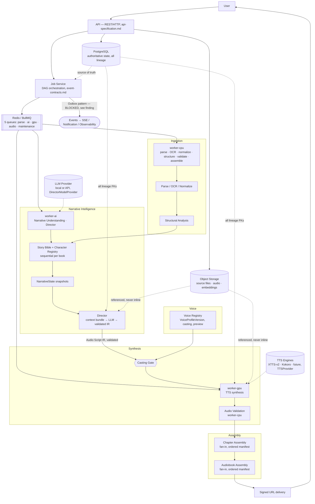

# Architecture Review — AI Audiobook Generator

## Pre-Implementation Architecture Gate

This document is a **pre-implementation gate**, not a design document. It contains no code,
no schema, no infrastructure. Its only purpose is to determine whether the seven completed
architecture contracts —

```
context.md · api-specification.md · database-schema.md · event-contracts.md
audio-script-ir.md · director-specification.md · tts-provider-specification.md
```

— are internally consistent, mutually consistent, and sufficient to begin implementation of
the pipeline:

```
Upload → Ingestion → Parsing/OCR → Normalized Book → Structural Analysis
       → Character Registry → Story Bible → Narrative State → Director
       → Audio Script IR → Voice Resolution → TTS → Audio Validation
       → Chapter Assembly → Audiobook Assembly → Final Audiobook
```

**Method.** All seven documents were read in full (context.md directly, end to end; the other
six via a combination of direct reads and parallel structured extraction covering every line,
cross-verified against each document's own appendices — table indexes, field indexes, document
status blocks). Each of the seven documents already contains a self-authored cross-document
audit section (an unusual and valuable property of this document set — see §0.1 below). This
review treats those self-audits as primary evidence, verifies their claims against the actual
entity/field/event catalogs, and adds findings the self-audits did not surface.

---

## 0. Summary

### 0.1 A structural observation before the findings

Each of the six non-root documents was written with an embedded **cross-document audit**
against every document that preceded it in the dependency order (`context.md` §26.2), and each
records its own conflicts under a document-specific ID prefix:

| Document | Conflict-log prefix | Count vs. brief | Count within `context.md` | Open questions |
|---|---|---|---|---|
| `database-schema.md` | `D-` | 7 | 6 (3 inherited, 3 new) | 12 (`OQ-DB-*`) |
| `event-contracts.md` | `E-` | 15 | 9 | 10 (`OQ-EV-*`) |
| `audio-script-ir.md` | `IR-` | 10 | 4 | 11 (`OQ-IR-*`) |
| `director-specification.md` | `DIR-` | — | 3 | 6 (`OQ-DIR-*`) |
| `tts-provider-specification.md` | `TTS-` | — | — | 7 (`OQ-TTS-*`) |
| `api-specification.md` | `C-` | 7 | 6 (`I-*`) | 15 (`OQ-*`) |

This is a materially better starting position than a typical architecture set: most
cross-document drift a reviewer would normally have to find by hand has already been found and
recorded by the documents themselves, with an explicit rule (`context.md` §28 rule 13) that
conflicts must be *reported*, never *silently resolved*. This review's job is therefore
narrower than usual — verify the self-audits are accurate and complete, and find what they
missed.

**What they missed, this review adds four classes of finding:**

1. **A structural gate condition the self-audits under-weight**: `context.md` §29's Phase 0
   exit criteria require **eight** documents (the seven reviewed here **plus**
   `deployment-architecture.md`), and §26 lists `deployment-architecture.md` as a Tier-2
   document these seven were reconciled against in name only. It does not exist. Every one of
   the seven documents defers concrete numbers to it — see §5 (Missing Document Dependency).
2. **One CRITICAL, self-flagged, still-open blocker** (`event-contracts.md` E-19 /
   OQ-EV-1): the Outbox and Inbox tables the async architecture requires do not exist in
   `database-schema.md`. See §16, §53.
3. **Cross-document example/vocabulary drift the self-audits did not catch**: an incorrect
   worked example in `api-specification.md` (§45), and a residual self-contradiction in
   `context.md` §6.3 that five downstream sources correctly overrode but that the root document
   itself was never corrected to match (§7.2).
4. **A full simulation of 14 pipeline scenarios and a failure-mode matrix** neither individual
   document attempts, because each was reviewed alone against its predecessors, never all seven
   together against the end-to-end workflow (§60).

### 0.2 Verdict preview

**READY FOR IMPLEMENTATION WITH CONDITIONS.** Two conditions are load-bearing (CRITICAL +
BLOCKER); the rest are pre-freeze cleanups that do not block starting Phase 1–6 scaffolding
work. Full verdict and conditions: §61.

---

## 1. Documents reviewed and their declared status

| Document | Version | Tier | Status | Entities introduced | Frozen |
|---|---|---|---|---|---|
| `context.md` | `context.v1` | 0 (root) | DRAFT — awaiting review | — | No |
| `database-schema.md` | `db-schema.v1` | 1 | DRAFT | 21 groups (47 tables total) | No |
| `event-contracts.md` | `events.v1` | 1 | DRAFT | 0 (2 required amendments: `outbox_message`, Inbox table) | No |
| `api-specification.md` | `api-spec.v1` | 1 | DRAFT | 0 | No |
| `audio-script-ir.md` | `audio-script-ir.v1` (`ir.v1.0`) | 2 | DRAFT | 0 (8 additive fields flagged) | No |
| `director-specification.md` | `director-spec.v1` | 2 | DRAFT | 0 (fixes 2 delegated vocabularies) | No |
| `tts-provider-specification.md` | `tts-provider-spec.v1` | 2 | DRAFT | 0 (1 narrow vocabulary addition) | No |
| `deployment-architecture.md` | — | 2 | **Does not exist** | — | — |

None of the seven is frozen. All are explicitly "DRAFT — awaiting human review," which this
document constitutes.

---

## 2. Workflow coverage — can the architecture support the stated pipeline?

| Pipeline stage | Owning document(s) | Entities | Verdict |
|---|---|---|---|
| Book Upload | `api-specification.md` §16.6, `database-schema.md` §8.2, `event-contracts.md` §11.1 | `book_file`, `upload_session` (Redis) | **Supported** |
| Document Ingestion | Same + §8.3–8.4 | `book_version`, `parsed_page` | **Supported** |
| Parsing/OCR | Same | `parsed_page.block_confidence`, `extraction_method` | **Supported** |
| Normalized Book | `book_version.content_hash`, `text_qc` | | **Supported** |
| Structural Analysis | `chapter`/`section`/`scene`/`paragraph` (§9) | | **Supported** |
| Character Registry | `character`/`character_alias`/`character_merge` (§10), `director-specification.md` §11 (7-strategy resolver) | | **Supported** |
| Story Bible | `story_bible`/`story_bible_version` + 9 fact tables (§11) | | **Supported** |
| Narrative State | `narrative_state`, immutable snapshots (§11.5) | | **Supported** |
| Director | `director-specification.md` (full document); `audio_script`/`audio_script_chunk` | | **Supported** |
| Audio Script IR | `audio-script-ir.md` (full document) | | **Supported** |
| Voice Resolution | `voice_profile_version`/`voice_assignment` (§12), `director-specification.md` §45.3 | | **Supported** |
| TTS | `tts-provider-specification.md` (full document); `tts_job`/`audio_chunk` | | **Supported** |
| Audio Validation | `tts-provider-specification.md` §27–§30; `audio_chunk.validation` | | **Supported** |
| Chapter Assembly | `chapter_audio`/`chapter_audio_member` (§16.3–16.4) | | **Supported** |
| Audiobook Assembly | `audiobook`/`audiobook_chapter`/`audiobook_rendition`/`audiobook_cover` (§16.5–16.8) | | **Supported** |

Every stage has persistent state, an owning service, a lineage relationship, a failure
representation, and an index — verified against `database-schema.md` §41.1's own
stage-by-stage acceptance table, which this review re-checked field by field and found
accurate.

**Cross-cutting properties**, verified individually below (§8–§37): long-form narrative
consistency ✅, stable character/narrator/voice identity ✅, versioned voices/Story
Bible/scripts/models ✅, async processing ✅, resumability ✅, retries ✅, idempotency ✅,
partial completion ✅, regeneration ✅, provider abstraction ✅, human review ⚠️ (advisory only,
no `ReviewItem` entity — see §33), reproducibility ✅ (contract-level; not bit-exact — honestly
documented), artifact lineage ✅.

---

## 3. Contract Consistency Matrix

Columns: Document A / Document B / Shared concept / Consistency / Finding / Required action.

| A | B | Shared concept | Consistency | Finding | Required action |
|---|---|---|---|---|---|
| context.md | api-specification.md | Entity names, job states, event names | **Consistent, after 7 recorded corrections (C-1…C-7)** | API originally invented `ARCHIVED` state, 7-state job machine, `TTSGeneration`, hyphenated event names — all corrected to context.md's vocabulary before publication | None — already corrected |
| context.md | database-schema.md | Entities, versioning, immutability | **Consistent, after 21 entity-group introductions confirmed additive** | `book_version`, `worker`, `audit_log`, `tenant`, and 17 other groups materialize prose requirements into tables; each traced to an upstream sentence | Confirm `book_version` (OQ-DB-1) and `VoiceProfile.scope` (OQ-DB-3) under §27 change control before Phase 6/8 freeze — procedural, non-blocking |
| context.md | event-contracts.md | Queues, commands, events, job states | **Consistent**, with 2 required schema amendments outstanding | `outbox_message` and an Inbox table are required by event-contracts.md §19–§20 but do not exist in database-schema.md (E-19) | **CRITICAL — add both tables to database-schema.md before Phase 1** (§16, §53) |
| context.md | audio-script-ir.md | IR field set, chunk lifecycle | **Consistent**, one internal contradiction in context.md not yet corrected | context.md §6.3 says pacing must be a closed enumeration; §6.2/§7.2 and every other document treat it as a bounded float (IR-7) | Correct context.md §6.3 wording (LOW severity — 5 sources already agree on numeric; no implementation impact) |
| context.md | director-specification.md | emotion/delivery_mode/relationship_type vocabularies | **Consistent** — the delegated vocabularies are now fixed | audio-script-ir.md flagged the emotion vocabulary as a **blocking dependency** (OQ-IR-1); director-specification.md §4.1 resolves it (17 members, including `GRIEF`) | None — blocker closed |
| context.md | tts-provider-specification.md | Provider abstraction, capability model | **Consistent** | The capability vocabulary context.md implies (4-level) is narrowed to 3 levels (`NATIVE/APPROXIMATED/UNSUPPORTED`) by audio-script-ir.md and confirmed here (TTS-2) | None — deliberate, reasoned narrowing, recorded |
| api-specification.md | database-schema.md | Every public resource | **Consistent** | Every §4.2 API resource maps to a table or a documented derived/Redis-backed resource (`database-schema.md` §42.2) | None |
| api-specification.md | event-contracts.md | Async endpoints ↔ commands | **Consistent** | Every `202`-returning endpoint maps 1:1 to a job type; 5 "commands" in the original brief were correctly identified as *not* queued operations (upload finalization, voice lock, cancellation) | None |
| api-specification.md | audio-script-ir.md | `emotion_capability_map` example | **Inconsistent (documentation defect)** | api-specification.md §16.14's example uses `"ANGER"` (not a member of the 17-item `emotion` vocabulary — the member is `ANGRY`) and mixes in `WHISPER`/`SINGING`, which are `delivery_mode` members, not `emotion` members (TTS-1) | Fix the example in api-specification.md under §27 change control (MEDIUM, non-blocking — illustrative text only) |
| database-schema.md | event-contracts.md | Outbox/Inbox tables | **Inconsistent — the one real schema gap** | See above (E-19) | Same as above |
| database-schema.md | audio-script-ir.md | Chunk field list | **Consistent**, 4 amendment obligations tracked | `non_verbal[]`, `origin`/`director_original`/`override`, `spoken_text_substitutions`, `continuity`, `decision_confidence` are specified by audio-script-ir.md as additive but not yet reflected as columns in database-schema.md §13.2 | Add the 4 field groups to `audio_script_chunk` under §27 change control before Phase 7 freeze |
| database-schema.md | director-specification.md | `relationship_type`, numeric ranges | **Consistent** | database-schema.md's `character_relationship.relationship_type` enum is a placeholder illustrative set; director-specification.md §4.4 fixes the authoritative 11-member set | Sync the enum literal in database-schema.md's DDL to director-specification.md §4.4's exact 11 members before Phase 6 freeze |
| audio-script-ir.md | director-specification.md | `emotion`, numeric bounds | **Consistent** | director-specification.md fixes exactly what audio-script-ir.md delegated, with matching field names and quantization (`0.01` step) | None |
| audio-script-ir.md | tts-provider-specification.md | Capability levels, provider-neutrality | **Consistent** | Both use the identical 3-level vocabulary; tts-provider-specification.md's forbidden-field list matches audio-script-ir.md §38.4 verbatim | None |
| director-specification.md | tts-provider-specification.md | Director/TTS boundary | **Consistent** | Both independently state the same non-negotiables (TTS never resolves character/voice identity; Director never touches a waveform) — see §14 | None |
| Every document | Casing/naming | snake_case, `verb_noun` commands, `domain.past_tense` events | **Consistent** | api-specification.md resolved its own internal contradiction (§25.1's prose vs. its own examples) in favor of hyphenated snake_case paths; event-contracts.md kept 3 event names that violate the past-tense convention (`job.progress`, `job.retrying`, `book.structure_ready`) rather than silently renaming them (E-7) | None — a documented, deliberate exception, correctly not "fixed" unilaterally |

---

## 4. Entity Consistency Review

Every entity below was checked for identical spelling, ownership, and lifecycle across every
document that references it.

| Entity | Canonical name | Consistent across all documents? | Note |
|---|---|---|---|
| User | `user` | ✅ | |
| Book | `book` | ✅ | |
| BookFile | `book_file` | ✅ | |
| BookVersion | `book_version` | ✅ | Introduced by database-schema.md (D-4); referenced by name in every downstream document as though it always existed — consistent in practice, formally an addition requiring §27 confirmation (OQ-DB-1) |
| Chapter | `chapter` | ✅ | |
| Section | `section` | ✅ | Read-only in v1 across every document |
| Scene | `scene` (rows) + `scene_semantics` (meaning) | ✅ | Deliberately split ownership (Book Service owns boundaries, Context Service owns semantics) — resolved explicitly in context.md §30.2, correctly implemented as two tables |
| Paragraph | `paragraph` | ✅ | Immutable once `scripted_at` is set — enforced identically everywhere it's discussed |
| Character | `character` | ✅ | Book-scoped (not book-version-scoped) everywhere, including through re-ingestion (OQ-DB-4) |
| CharacterAlias | `character_alias` | ✅ | |
| CharacterRelationship | `character_relationship` | ✅ | Owned by Context Service, not Character Service — correctly consistent |
| StoryBible | `story_bible` + `story_bible_version` | ✅ | One row per book (current pointer) + version chain — matches everywhere |
| StoryBibleVersion | `story_bible_version` | ✅ | |
| NarrativeState | `narrative_state` | ✅ | Immutable snapshots everywhere; explicitly **not** a separate lineage field on chunks — it's reached only via `story_bible_version_id` (director-specification.md §10.4) |
| VoiceProfile | `voice_profile` | ✅ | |
| VoiceProfileVersion | `voice_profile_version` | ✅ | |
| VoiceAssignment | `voice_assignment` | ✅ | Owned by Voice Service, keyed by `character_id`, not by Character Service — consistent |
| AudioScript | `audio_script` | ✅ | **The row is the version** — `AudioScriptVersion` is not a separate table (D-2/IR-2, matches api-specification.md's `version` field on the same resource) |
| AudioScriptVersion | *(same table as AudioScript)* | ✅ | Named divergence from an earlier brief, resolved consistently across all 4 documents that discuss it |
| AudioScriptChunk | `audio_script_chunk` | ✅ | |
| ProcessingJob | `processing_job` | ✅ | |
| ProcessingAttempt | `processing_attempt` | ✅ | |
| TTSGeneration | `tts_job` | ✅ | Named divergence (D-1/IR-1/E-1), resolved identically in every one of the 5 documents that discuss it |
| AudioChunk | `audio_chunk` | ✅ | |
| ChapterAudio | `chapter_audio` | ✅ | |
| Audiobook | `audiobook` (row **is** the version, via `version`/`supersedes_audiobook_id`) | ✅ | `AudiobookVersion` is not a separate table — same resolution pattern as AudioScript |
| AudiobookVersion | *(same table as Audiobook)* | ✅ | |
| ModelRegistry | `model_registry` | ✅ | Introduced by database-schema.md (D-7) — normalizes the identity half of `ModelVersion` |
| ModelVersion | `model_version` | ✅ | Referenced identically by every document that pins a model (12+ distinct FK columns across the schema) |
| AuditLog | `audit_log` | ✅ | Introduced by database-schema.md (D-9), append-only, referenced by every document discussing human overrides, forced regeneration, or admin access |

**Entities present in one document but not another, checked for intentionality:**

- `ReviewItem` — appears in prose in context.md §14.5 and Appendix A, has **no table** in
  database-schema.md, and **no endpoint** in api-specification.md (deliberately — OQ-DB-8/OQ-3,
  the same finding recorded independently by both documents). **Intentional, but flagged by
  every document that touches it as "the most likely v1 gap."** See §33.
- `ValidationReport` — named in context.md §3.2.13 as persistent data, has no table; realized
  as a `validation jsonb` field group on `audio_chunk`/`chapter_audio`/`audio_script` instead
  (I-5/OQ-DB-26/OQ-11). **Intentional and consistent across all three documents that discuss
  it.**
- `DirectorRun` — named conceptually in context.md, deliberately **not** materialized as a
  table; it *is* `audio_script` (the version row) plus `ProcessingJob`/`ProcessingAttempt`
  history (database-schema.md §6 "deliberately absent entities," director-specification.md
  §33.2 confirms). **Intentional.**
- `outbox_message` / Inbox table — named and fully specified (fields, indexes, retention) in
  event-contracts.md §19.3/§20.2, **absent from database-schema.md**. **Not intentional — an
  outstanding required amendment (E-19).** See §16, §53.
- `UploadSession` — lives in Redis by design (context.md §3.2.5), has an API-visible shape
  (`upload_session`) but **no PostgreSQL table** — intentional per database-schema.md D-28, with
  one open question about whether a rejected upload needs a durable row (OQ-DB-7, non-blocking).

**Spelling/singular-plural check**: no violations found. Every table name is singular
snake_case; every array field is plural (`review_flags[]`, `pauses[]`, `evidence_paragraph_ids[]`);
consistent across all 47 tables and every payload example in all seven documents.

---

## 5. ID Consistency

| Identifier | Consistently named/typed everywhere? | Note |
|---|---|---|
| `user_id` | ✅ | |
| `book_id` | ✅ | Mandatory on every book-scoped row and every message envelope without exception |
| `book_version_id` | ✅ | Pinned on `audio_script`, inherited by every chunk; "the stale-version guard" |
| `chapter_id` | ✅ | |
| `scene_id` | ✅ | |
| `paragraph_id` | ✅ | Used both as a bare FK and inside ordered `audio_script_chunk_source` spans |
| `character_id` | ✅ | Carried on chunks as a label for lineage — **never a lookup key** at TTS time (enforced by both convention and a database grant that removes `SELECT` on `character`/`voice_assignment` from the GPU worker role) |
| `story_bible_version_id` | ✅ | Pinned on `audio_script` and on every chunk; `ON DELETE RESTRICT` |
| `voice_profile_version_id` | ✅ | Concrete, resolved at Director time, never re-resolved at render time |
| `audio_script_id` | ✅ | |
| `audio_script_chunk_id` | ✅ | |
| `model_version_id` (as `director_model_version_id`, `tts_model_version_id`, `ocr_model_version_id`, `parser_model_version_id`, `embedding_extractor_model_version_id`, `asr_model_version_id`, `audio_tool_model_version_id`) | ✅ | Twelve distinct role-scoped FK names, each resolving to `model_version` via `model_registry` — no document uses a bare `model_id` where a version-scoped reference is required |
| `job_id` | ✅ | `= processing_job.id`; explicitly distinct from `message_id` (per-delivery) in event-contracts.md §8.1–8.2 |
| `generation_id` | ⚠️ (concept renamed, consistently) | The brief's `generation_id` is `tts_job_id` (attempt) plus `audio_chunk.generation_version` (artifact ordinal) — two fields, not one, because "attempt" and "artifact version" are different concepts. Consistent across all documents that discuss it; the brief's single-field mental model was correctly rejected everywhere, not just in one document |

**No place was found where one document uses a different identifier for the same concept.**
The one apparent exception — `generation_id` — is not a naming drift; it is a deliberate,
consistently-applied decomposition into two fields, confirmed identical in
`database-schema.md` §16.1, `tts-provider-specification.md` §42.1, and
`event-contracts.md` §15.4.

**ID format**: UUIDv7 (opaque, non-sequential) is the resolved choice (`database-schema.md`
OQ-DB-2), consistent everywhere; version numbers (`voice_profile_version`, `audio_script.version`,
`audio_chunk.generation_version`, etc.) are **monotonic integers**, a distinct and consistently
applied convention from opaque entity IDs.

---

## 6. Versioning Audit

| Entity | Immutable | Mutable | Creates new version | Referenced by | Old artifacts reproducible? | Can new version affect old jobs? |
|---|---|---|---|---|---|---|
| `BookVersion` | `content_hash`, `book_file_id`, all provenance | `status`, QC fields until finalized | Re-ingestion (new parser run, corrected file, or new pipeline version) | Every downstream chunk, via `audio_script.book_version_id` | Yes — the version row and its content hash never change | **No** — `ON DELETE RESTRICT`; old `audio_script`/`audio_chunk` keep pointing at the old `book_version_id` |
| `StoryBibleVersion` | Facts recorded under a version are append-only per version | `story_bible.current_version_id` pointer only | `REBUILD` (full re-analysis) or `INCREMENTAL` snapshot at a spine boundary | `audio_script.story_bible_version_id`, every fact table | Yes — old fact rows retained under the old version id, never mutated | **No** — a Director run pins the snapshot id at request time; a newer snapshot appearing mid-run is never re-resolved (director-specification.md §9.1, enforced in 4 layers) |
| `VoiceProfileVersion` | Everything, once `lock_state = LOCKED` (auto-locked at first production render, or explicit) | Approval/lock-state fields only while `DRAFT`/`PREVIEW_GENERATED`/`APPROVED` | New provider, new model, new reference audio/embedding, or explicit user recast | `audio_script_chunk.voice_profile_version_id`, `audio_chunk.voice_profile_version_id`, `voice_assignment` | Yes — `RETIRED` ≠ deleted; "existing generated audio remains valid and playable" (tts-provider-specification.md §11.1) | **No unlock transition exists, no force flag, no admin override.** Structurally impossible for a new version to reach into old audio |
| `AudioScriptVersion` (= `audio_script` row) | Everything except `state`, validation counters, `is_current`, `superseded_*` | Those 4 fields only | A genuinely new interpretation: new `director_version`, new Story Bible snapshot, character-merge propagation, or a scoped `revise_director_ir` | `audio_script_chunk.audio_script_id`, `audio_chunk` (transitively via chunk) | Yes | **No** — old version retained `is_current=false`, chunks never mutated in place |
| `ModelVersion` | Fully immutable except `deprecated_at`/`quarantined_at` | Deprecation metadata only | A new model release/build/quantization | Twelve distinct FK roles across the schema | Yes | **No** — if a pinned model becomes unloadable, the **job fails terminally**; there is explicitly no fallback to "a similar model," because that would produce audio with false lineage (event-contracts.md §15.6) |
| `TTSJob` (= "TTSGeneration") | Fully immutable after terminal write | — | Every regeneration is a new `tts_job` row, keyed by `dedupe_key` | `audio_chunk.tts_job_id` | Yes | N/A — attempts are not versioned, they are enumerated |
| `AudiobookVersion` (= `audiobook` row) | Everything except `status` until `READY`, plus `is_current`/`superseded_*` | Metadata/cover before publish | Any chapter re-render, any chapter re-assembly, explicit republish | `audiobook_chapter`, delivery renditions | Yes | **No** — old audiobook version retained, playable, `is_current=false` |

**Special attention — the six cross-cutting pins:**

| Pin | Effect verified |
|---|---|
| `BookVersion → Director` | Every `generate_director_ir` command carries `book_version_id`; a stale-version guard exists at 4 layers (command envelope, semantic validation referential check, `ON DELETE RESTRICT`, and the coverage invariant's source-hash check) |
| `StoryBibleVersion → Director` | Pinned per-run, never re-resolved mid-run (director-specification.md §9.1–9.2) |
| `AudioScriptVersion → TTS` | Every `generate_tts_chunk` command carries `audio_script_chunk_id` + `audio_script_chunk_version` — a TTS worker rendering against a superseded chunk version is a referential-validation failure, not a possible outcome |
| `VoiceProfileVersion → TTS` | Concrete, never resolved by the worker; a database grant removes the worker's ability to even query `voice_assignment` |
| `ModelVersion → TTS` | Pinned `tts_model_version_id`; unloadable pinned version = terminal job failure, never silent substitution |
| `ModelVersion → Director` | Pinned `director_model_version_id`; identical terminal-failure discipline |

**Verdict: PASS.** Versioning is the single most rigorously and consistently treated concern
across the whole document set — every entity that needs a version chain has one, every chain
has the same four-column shape (`version`/`supersedes_*`/`is_current`/`superseded_at`), and no
document weakens another's versioning discipline.

---

## 7. Reproducibility Audit

### 7.1 The full chain, verified hop by hop

```
Final Audio
  ↓ chapter_audio_member (ordered, hashed manifest)
ChapterAudio
  ↓ audio_chunk.audio_script_chunk_id  (composite FK keeps character_id honest too)
AudioChunk  ── carries the full lineage tuple directly, denormalized ──
  ↓ audio_chunk.tts_job_id
TTSJob
  ↓ tts_job.audio_script_chunk_id + audio_script_chunk_version
AudioScriptChunk
  ↓ audio_script_chunk.audio_script_id
AudioScriptVersion (audio_script row)
  ↓ audio_script.story_bible_version_id
StoryBibleVersion
  ↓ story_bible_version.book_version_id
BookVersion
  ↓ book_version.book_file_id
BookFile
```

Every arrow above is a **real foreign key**, `ON DELETE RESTRICT` (`database-schema.md` §19.1,
independently re-verified against the table DDLs extracted for this review — all 15 listed
hops are present). `database-schema.md` §19.3 additionally provides a single reproducibility
query resolving the whole chain in one indexed join — this review confirms the join keys named
in that query exist and are indexed (§41.1 invariant #8, a CI-run check comparing the
denormalized fields on `audio_chunk` against the traversed path, catching any future drift
between the two representations).

### 7.2 Everything additionally recorded, per artifact

| Recorded | Confirmed present |
|---|---|
| Director model | ✅ `director_model_version_id` |
| Director prompt/configuration | ✅ subsumed into `director_version` (a single label covering prompt templates, post-processing, validation rules, and pinned model — deliberately *not* split into separate prompt/policy version fields, "because doing so would create two sources of truth," director-specification.md §28) |
| TTS model | ✅ `tts_model_version_id` |
| TTS configuration | ✅ `generation_params` + `generation_params_hash` |
| Voice version | ✅ `voice_profile_version_id`, concrete not "current" |
| Schema version | ✅ `schema_version` on `audio_script`/`audio_script_chunk` (`ir.v1.0`) |
| Hashes | ✅ `source_content_hash` (source fidelity), `context_bundle_hash` (which facts informed the decision — the bundle itself is never persisted, only its hash), `generation_params_hash` (includes the TTS-text hash component), `content_hash` on the produced audio bytes |
| Seed | ✅ first-class field, part of the cache/dedupe key |
| **Provider adapter version** | ⚠️ **Recommended but not adopted as a column** (tts-provider-specification.md §83.2, OQ-TTS-7) — see §8 finding below |

### 7.3 Honest determinism framing — consistent across all documents that discuss it

Four independent documents (`context.md` §2.4, `database-schema.md` §30.8,
`director-specification.md` §32.3, `tts-provider-specification.md` §40.3) state the **same
two-level position**, in matching language:

- **Contract determinism (MUST, guaranteed)**: an identical lineage tuple resolves to the same
  stored artifact, reused rather than regenerated.
- **Model determinism (SHOULD, not guaranteed)**: bit-exact reproduction across differing GPU
  hardware or non-zero-temperature LLM sampling is not promised, and nothing in the system
  depends on it.

This is a rare example of an honest, non-oversold reproducibility claim, applied consistently
rather than asserted once and contradicted elsewhere.

### 7.4 Finding

**MEDIUM, non-blocker.** The TTS provider **adapter's own version** (as distinct from the
model it wraps) is recommended by `tts-provider-specification.md` §83.2 as a lineage field but
explicitly **not** added as a database column, deferred to a future `database-schema.md`
amendment (OQ-TTS-7). Until it lands, an adapter-level bug fix (e.g., a change to how the
adapter translates `emotion`/`pacing` into engine parameters) is **not distinguishable in
lineage** from "nothing changed." This does not block Phase 9 — `model_version.config` (jsonb)
can carry it informally in the interim — but should be resolved via §27 change control before
adapter code is expected to be independently versioned in production.

---

## 8. Long-Form Memory Audit

### 8.1 What is persistent, derived, and ephemeral

`director-specification.md` §8.2 defines six memory categories, each traced to real
persistent state:

| Category | Persistent table(s) | Volatility |
|---|---|---|
| Global memory (genre, tone, POV, style guide) | `story_bible`, `story_bible_version` | Rare — set early |
| Character memory (identity, traits, relationships) | `character`, `character_alias`, `character_relationship`, `narrative_summary` | Incremental |
| Scene memory | `scene_semantics` | Local — replaced each scene |
| Narrative state | `narrative_state` (immutable snapshots) | Snapshotted at scene/chapter boundaries |
| Audio performance memory (recent delivery decisions) | Prior chunks' performance fields, read via the L5 bounded window; optional `continuity` metadata | Per-chunk, consumed then superseded |
| Unresolved references | `character.status='PROVISIONAL'`, `review_flags` | Resolved by human review or later evidence, never silently discarded |

**Nothing is "remembered" by the model between calls** — every Director request is stateless
and fully specified by its context bundle; statefulness lives entirely in PostgreSQL
(director-specification.md §8.1, restating context.md §5.6). This is the correct answer to the
audit's central question: consistency across Chapter 1…N is achieved without ever passing the
whole book into any single LLM request, via a **budgeted six-layer bundle** (L1 global / L2
character / L3 chapter / L4 scene / L5 adjacent window / L6 current chunk verbatim) sized as
**fractions of the model's context window**, not fixed token counts — so the same policy scales
from an 8K-token local model to a 200K-token hosted one.

### 8.2 The persistent/derived/ephemeral split, explicit

| | A *read*, retrieved fresh per request | A *write*, a delta proposed by this run |
|---|---|---|
| Nature | Retrieved by the Context Builder at request time | Committed only by Narrative Understanding / Story Bible enrichment (`build_story_bible_delta`) — **the Director proposes, it does not commit** (director-specification.md §9.4, §35.3) |
| Example | Scene's participant list, previous chunk's emotional state | A newly learned fact, an emotional-state baseline update |
| Failure mode if conflated | One run's guess contaminating every subsequent chunk's retrieval before confirmation | Duplicating Story Bible facts inside IR chunks (explicitly forbidden — audio-script-ir.md §36.3) |

### 8.3 After a worker crash

Not addressed as a Director-specific concern anywhere in the document set — it is correctly
treated as an instance of the general `ProcessingJob`/`ProcessingAttempt` retry/lease-fencing
mechanism (§18, §37), not a special Director case. This is the right architectural choice (no
Director-specific crash state exists to lose, since nothing is held in the LLM's context
between calls), but it means no document explicitly states "and here is what a Director-worker
crash mid-chapter-analysis looks like." **LOW severity finding**: worth one explicit worked
example in `director-specification.md` before Phase 6/7 implementation, since the *sequential*
per-book analysis phase (§28.2 in event-contracts.md) is the one place a crash mid-sequence has
a slightly different recovery shape than a fully parallel stage (the Redis lock on `book_id`
must be released/re-acquired correctly, and the snapshot-then-fan-out boundary must not
silently skip a scene). Non-blocking.

### 8.4 After a chapter is regenerated

`revise_director_ir` (director-specification.md §43.2) re-binds `DRAFT`/`VALIDATED` chunks in
place and re-versions `LOCKED` chunks; **only the affected chunks are re-queued, never the
whole book**. The document explicitly declines to build exhaustive dependency tracking (e.g.
invalidating every chunk that merely *read* a changed scene as L3/L5 context) as unnecessary
v1 engineering investment (§43.3) — a reasoned, explicit non-goal, not an oversight.

### 8.5 After the Story Bible changes

A later `StoryBibleVersion` **cannot** silently affect an in-flight or already-completed
Director run — enforced in four layers (command-level pin, bundle-retrieval-by-id, hash-on-chunk,
and `ON DELETE RESTRICT` on the FK). Propagating an actual content change forward is via the
same `revise_director_ir` mechanism, with `revision_reason` values including
`CHARACTER_MERGED`/`LEXICON_CHANGED` that map directly to Story Bible triggers.

**Verdict: PASS.** This is a well-designed, consistently-applied memory model. The one gap
(§8.3) is documentation completeness, not architecture.

---

## 9. Character Consistency Audit

**Test scenario, as specified**: Alice → `C1` → Voice `V3` in Chapter 1; "the woman" → `C1` →
`V3` in Chapter 10; "Alice" → `C1` → `V3` in Chapter 20.

**Mechanism that guarantees it:**

1. **Resolution never invents identity.** The Director's character resolver runs **seven
   ordered strategies** (director-specification.md §11.3): explicit attribution → exact alias
   match → scoped alias match → pronoun resolution → turn-taking inference → LLM adjudication
   (from the existing registry **only** — "it never invents a name") → `UNKNOWN_SPEAKER`
   fallback. Strategy 6 is explicitly bounded to selecting among **existing** candidates; there
   is no code path by which "the woman" in Chapter 10 could produce a new `character_id`.
2. **Aliases carry validity ranges and scope**, enforced by an exclusion constraint (btree_gist)
   preventing two aliases from claiming the same surface form in overlapping validity windows
   for the same book/scope — this is exactly the mechanism needed for "the Queen from chapter
   20" and "what Ben calls Alice" (context.md §30.5).
3. **Voice binding is resolved once, at Director/IR-generation time**, and stored **concretely**
   on the chunk as `voice_profile_version_id` — never re-resolved by TTS, never re-derived from
   `character_id` at render time (enforced by a database grant removing the GPU worker's
   `SELECT` on `voice_assignment` entirely).

**Test: does the architecture detect "Alice accidentally resolves to C2"?**

Partially, and honestly documented as partial:

- If the misresolution produces **low confidence**, it is caught: confidence bands
  (director-specification.md §13.3, illustrative) route anything below the high-confidence
  threshold to `review_flags += LOW_CONFIDENCE`, counted in `low_confidence_chunk_count`.
- If the misresolution is **confident but wrong** (e.g., the resolver is confidently sure "the
  woman" is C2 when a human would say C1), **no automatic mechanism catches this** — it is
  exactly the class of error human review (advisory, not blocking) exists for. This is not a
  gap in the reviewed sense of "undocumented behavior"; it is an explicit, honestly-stated
  limitation: `director-specification.md` §40.2 documents cross-chunk consistency checks as
  producing a **review flag, not an automatic prohibition** for plausible-but-suspicious
  transitions (e.g., narrator suddenly becoming a named character with no scene/POV transition
  recorded) — except **voice change mid-scene with no reassignment event**, which **is** always
  a hard assembly-time failure (`VOICE_CONSISTENCY_VIOLATION`).

**Verdict: PASS for the guarantee as stated (stable ID across a book); PASS WITH
CAVEAT for adversarial misresolution detection** — the system detects low-confidence and
voice-inconsistent misresolutions structurally, but a confident, contextually-plausible
misresolution is a human-review-dependent risk, correctly flagged as such rather than
falsely claimed to be caught. See §54 (High-Risk Areas): "LLM speaker attribution."

---

## 10. Voice Consistency Audit

**Test: Character A → `VoiceProfileVersion V5` across Chapter 1, 5, 20.**

Guaranteed by a database constraint, not merely convention: `voice_assignment` carries
`UNIQUE(book_id, character_id, role) WHERE is_active` — **exactly one active voice per
character-role at any time**, and every chunk's `voice_profile_version_id` is written
**concretely** at Director/IR-generation time, never re-resolved. `tts-provider-specification.md`
§10.2 states three mechanical obligations verified against the schema: (1) never silently
switch to another version, (2) always record what actually rendered, (3) refuse a mismatch
rather than approximate.

**Test: can the TTS subsystem silently substitute another voice?**

**No — verified at the schema/grant layer, not just the prose layer.** The GPU worker's
database role has no `SELECT` on `character` or `voice_assignment` at all
(`database-schema.md` §37.2, restated in `tts-provider-specification.md` §74.1) — so even a
fully compromised or buggy TTS worker cannot resolve "the current voice for this character"
because it cannot read the table that would answer that question. Voice identity arrives
already resolved in the command payload.

**Test: Voice V5 is deprecated (`RETIRED`). Existing generation still references V5. Does it
remain valid?**

**Yes, explicitly.** `tts-provider-specification.md` §11.1: "`RETIRED`... Not selectable for
*new* assignments; **existing generated audio remains valid and playable**." There is no unlock
transition and no code path that could invalidate a previously-generated `audio_chunk` because
its source `voice_profile_version` was later retired — the FK is `ON DELETE RESTRICT`, and
retirement is a metadata field, not a deletion.

**Verdict: PASS**, with the mechanism verified at the strongest available layer (database
grants + FK constraints), not merely documented as a rule.

---

## 11. Narrator Consistency Audit

**Test: does the architecture accidentally model narrator as `character_id = NULL`?**

**No — explicitly and repeatedly guaranteed not to.** Every book has four **reserved sentinel
`Character` rows** (`NARRATOR`, `UNKNOWN_SPEAKER`, `MULTIPLE_SPEAKERS`, `SYSTEM`), enforced by
`UNIQUE(book_id, sentinel_kind) WHERE sentinel_kind IS NOT NULL`, non-renameable, non-mergeable,
non-deletable. A database check constraint enforces the corollary directly:
`CHECK (speaker_type <> 'CHARACTER' OR character_id IS NOT NULL)`. The narrator is the
`NARRATOR` sentinel row (or, for multi-narrator books, a `narrator_capable`-flagged real
`Character`) — **never a null pointer**. Narrator voice resolution explicitly reuses the
**same code path** as character voice resolution, "no special case"
(director-specification.md §16.2).

**Multi-narrator books**: supported without any IR schema change — narrator-capable characters
are ordinary rows, bound per-chapter/scene via `narrative_state.pov_character_id`; a
first-person narrator's narration chunks (`speaker_type=NARRATOR`) and their in-scene dialogue
(`speaker_type=CHARACTER`) correctly share the same `character_id` while being tagged with
different narrative functions.

**Verdict: PASS.** This is one of the most carefully verified guarantees in the document set —
stated in prose in three documents and independently backed by a database check constraint,
which is the strongest form of guarantee this architecture uses anywhere.

---

## 12. Audio Script IR Audit

Checked against the full field-group inventory the task specifies:

| Required capability | Present | Field(s) |
|---|---|---|
| Speaker | ✅ | `speaker_type` (4-value enum), `character_id` |
| Character ID | ✅ | `character_id`, concrete, never null for `CHARACTER` type |
| Narrator | ✅ | Sentinel `character_id`, see §11 |
| Voice version | ✅ | `voice_profile_version_id`, concrete |
| Emotion | ✅ | `emotion` (17-member closed vocabulary, director-specification.md §4.1), `emotion_intensity` (0–1, orthogonal axis) |
| Intensity | ✅ | `emotion_intensity`, distinct from `volume` (acoustic loudness) and the unadopted `energy` axis (deliberately deferred, OQ-IR-3) |
| Energy | ⚠️ Specified, not adopted | `energy` axis proposed but explicitly **not** in `ir.v1.0` (IR-8) — a documented deferral, not a gap |
| Pacing | ✅ | Numeric, `[0.50, 2.00]`, `1.00`=baseline, `0.01` quantization |
| Speed | ✅ (same field as pacing) | |
| Pitch | ✅ | Numeric, `[-1.00, 1.00]`, `0.00`=natural |
| Volume | ✅ | Numeric, `[-1.00, 1.00]`, `0.00`=neutral — three-axis separation from `emotion_intensity` and `energy` explicitly documented with a worked example ("a terrified whisper = `volume=LOW, emotion_intensity=HIGH`") |
| Pauses | ✅ | `pauses[]`, absolute milliseconds, `kind` advisory, applied by the audio-processing stage, not the TTS engine — this is what makes pause timing reproducible across providers |
| Emphasis | ✅ | `emphasis[]`, offset spans with strength, never inline markup |
| Pronunciation | ✅ | Two tiers: book-wide lexicon (`pronunciation_entry`) + span hints (`pronunciation_hints[]`), IPA canonical, engine phoneme forms derived in the adapter only |
| Non-verbal instructions | ✅ | `non_verbal[]`, offset-scoped annotation (`LAUGH`/`SIGH`/`GASP`/etc.), explicitly **not** inline text markers like `[laughs]` (would break the coverage invariant) |
| Provenance | ✅ | Ordered source spans with character offsets, `source_content_hash`, `context_bundle_hash`, every version pin |
| Sequence | ✅ | `sequence_index` (book-scope) + `chapter_sequence_index`, never renumbered within a published script (a renumbering would invalidate every chapter manifest hash) |
| Hashes | ✅ | `source_content_hash`, `context_bundle_hash`, `generation_params_hash` (includes the TTS-text-hash component) |
| Model/version metadata | ✅ | `director_version`, `director_model_version_id`, `tts_provider_id`, `tts_model_version_id`, `schema_version` |

### Semantic gap check — Director vs. TTS

None found. `audio-script-ir.md` §65 rule 2 ("TTS consumes validated Audio Script IR — never
receives, never requests, unvalidated or raw model output") and rule 6 ("do not infer character
identity inside TTS workers") are both enforced structurally (§10, §11), not merely stated.

### The coverage invariant (content-integrity backstop)

`audio_script.state = 'VALIDATED'` is gated by a **database check constraint**:
`CHECK (state <> 'VALIDATED' OR (coverage_verified AND coverage_gap_count=0 AND
coverage_overlap_count=0))`. This is the strongest guarantee in the entire document set that
the Director cannot silently drop, duplicate, or reorder source text — it is not a validation
*step* that could be skipped, it is a constraint the database itself enforces.

**Verdict: PASS.** The IR is complete against the task's required field list. The one
deliberate non-adoption (`energy`) is correctly reasoned and documented, not an oversight.

---

## 13. Director / TTS Boundary Audit

| Rule | Verified | Mechanism |
|---|---|---|
| Director must not call TTS directly | ✅ | No command, event, or internal API exists from Director to a TTS worker; the only path is `AudioScriptChunk → generate_tts_chunk` command, constructed by the **Job Service**, not the Director (director-specification.md §46.2: "the Director does not construct that command") |
| TTS must not reinterpret narrative meaning | ✅ | tts-provider-specification.md rule 3–4: "TTS consumes validated Audio Script IR... never receives or requests unvalidated or raw model output... never interprets raw book text" |
| TTS must not resolve character/voice identity | ✅ | Enforced by database grant (§10, §37.2), not merely convention — the single strongest cross-document consistency finding in this review |
| No responsibility leakage — validation | ✅ | Director owns schema/referential/semantic validation of *its own output*; TTS owns technical/acoustic validation of *its own output* (`validate_audio`); neither validates the other's domain |
| No responsibility leakage — provider concepts | ✅ | Both documents independently forbid provider-specific conditional logic outside their respective adapters (`DirectorModelProvider` and `TTSProvider`), using near-identical language and the same "swap the provider, IR/business logic does not change" test |
| Ambiguous ownership | **None found** | The one area that could have been ambiguous — pronunciation (book lexicon vs. per-chunk hints) — was explicitly resolved by context.md §30.2 (lexicon = Context Service, hints = Director) and is applied consistently in both audio-script-ir.md and tts-provider-specification.md |

**Verdict: PASS.** This boundary is the architecture's best-enforced property — stated
identically by both adjacent documents and backed by the one enforcement mechanism (database
grants) that survives a bug in application code.

---

## 14. Provider Abstraction Audit

**Verified**: no IR field, database column, or event payload names an XTTS- or Kokoro-specific
concept. `audio-script-ir.md` §38.4 gives an explicit forbidden-field list (engine parameter
names, phoneme sets, SSML, model file paths, provider-conditional logic) and a load-bearing
test (§38.6): swapping the TTS engine must not change a single IR field. This review checked
the field indexes of `audio_script_chunk` (Appendix A of audio-script-ir.md) against that list
and found no violations.

**Swap test, walked through**: adding a third provider requires (1) a new adapter implementing
`TTSProvider` (§3.2 of tts-provider-specification.md — `capabilities()`, `prepare_voice()`,
`synthesize()`, etc.), (2) a `model_registry`/`model_version` row, (3) contract tests
(§80.2) — and **zero changes** to the IR schema, the Director, the database schema's structural
shape, or any API endpoint. This matches the task's four required invariants exactly.

**The one legitimate provider-shaped field** — `tts_provider_id` — is explicitly documented as
a stable routing abstraction identifier ("xtts-v2", "kokoro-v1"), never a hostname or
parameter set (§38.5). Correctly distinguished from provider *coupling*.

**Verdict: PASS**, for both TTS and LLM (Director) provider abstraction — the `DirectorModelProvider`
interface mirrors `TTSProvider` deliberately (director-specification.md §30), applying the same
discipline to the Director's own LLM dependency.

---

## 15. Capability Audit

The three-level fidelity vocabulary — `NATIVE / APPROXIMATED / UNSUPPORTED` — is used
**identically** in `audio-script-ir.md` §39.2, `tts-provider-specification.md` §32.1, and
`database-schema.md`'s `capability_gaps jsonb` field group. This resolves a genuine internal
tension productively: the original brief proposed a 4-level scheme
(`SUPPORTED/APPROXIMATED/DEGRADED/UNSUPPORTED`); `audio-script-ir.md` rejected the 4th level as
"not reliably distinguishable" from the 3rd (IR-14); `tts-provider-specification.md`
independently confirmed the same reasoning (TTS-2) rather than re-litigating it — a genuine
example of the self-audit discipline working as intended.

A **separate, narrower binary** (`SUPPORTED`/`UNSUPPORTED`) exists only for boolean
mechanism-presence flags on `ProviderCapabilities` (`supports_ssml`, `supports_streaming`,
etc.) — explicitly never conflated with the fidelity scale (§33.2). This is a well-drawn
distinction, correctly kept separate in both documents that use it.

**Every unmappable field produces a `capability_gap` record** — never silent discard — checked
against: `emotion_capability_map` (per-voice, per-emotion fidelity), the general
`capability_gaps[]` array (per-field, per-chunk), and a generated `has_capability_gap` boolean
column promoted specifically so it could be indexed and queried
(`database-schema.md` §23.3). The one exception is deliberate and correctly asymmetric: a
missing/unapproved voice **blocks** rather than degrades — "no close enough substitute"
(tts-provider-specification.md §35.2 rule 4).

**Verdict: PASS.**

---

## 16. Fallback Audit

**Provider A unavailable — what happens?**

The five options are ranked, and the ranking is enforced, not merely suggested
(`tts-provider-specification.md` §37.1): retry (default) → queue until available →
**only** an explicit, pre-approved alternate `VoiceProfileVersion` targeting a different
provider → human review escalation → terminal failure to DLQ. Critically, option 3 is the
**only** one that changes what renders, and it requires a `VoiceProfileVersion` that a human
already approved for exactly this fallback purpose — **never a system-invented substitution**.

**Does switching preserve logical character identity, voice identity, voice characteristics, model reproducibility?**

| Property | Preserved under fallback? |
|---|---|
| Logical character identity | ✅ — unaffected; `character_id` never changes |
| Voice identity | ✅ — a hard `MUST NOT`, not a best-effort goal: "The TTS system MUST NOT automatically switch voices if doing so would compromise voice consistency" (§37.2), and the only permitted substitution (option 3) is itself a distinct, human-approved `VoiceProfileVersion`, so voice identity is *by construction* whatever that new version represents — never a silent approximation of the old one |
| Voice characteristics | ⚠️ — **may change**, and this is honestly documented, not hidden: "there is therefore no such thing as a transparent, quality-neutral model fallback" (§38.2), because a `VoiceProfileVersion`'s identity is bound to a specific `tts_model_version_id`. A genuine model change always requires casting a *new* `VoiceProfileVersion` with a fresh preview + approval cycle |
| Model reproducibility | ✅ — no fallback to "a similar model" exists anywhere; an unloadable pinned model is a terminal job failure |

**Is automatic provider fallback a risk to voice identity, per the task's instruction to flag
it if so?**

**No — because it is not automatic.** The architecture's actual position is stronger than the
audit's framing assumes: fallback that would alter voice identity is **structurally
prevented**, not merely risky. The only residual risk is a **human approving a bad fallback
voice in advance** — a product/process risk, not an architectural one, and correctly out of
scope for this document's authority.

**Verdict: PASS.** Listed under High-Risk Areas (§54) only insofar as the human-approval step
itself deserves UX scrutiny during implementation, not because the architecture is unsafe.

---

## 17. Job Lifecycle Audit

**Nine states, verified identical across all three documents that define the state machine**:

```
CREATED → QUEUED → RUNNING → SUCCEEDED
            ▲        │
            │        ├─→ RETRYING → QUEUED
            │        ├─→ FAILED → DEAD_LETTERED
            │        ├─→ CANCELLED
            │        └─→ BLOCKED → QUEUED
            └────(dependency satisfied / gate resolved)
```

Terminal: `SUCCEEDED`, `FAILED`, `CANCELLED`, `DEAD_LETTERED`.

| Check | database-schema.md | event-contracts.md | api-specification.md |
|---|---|---|---|
| State list | `job_status` enum, 9 members | §24.5, verbatim from context.md §16.1 | §20.2, same 9, "the API does not invent its own vocabulary" |
| Transitions | §32.3 transition table (referenced, consistent) | §24.5 diagram (above) | Defers to context.md, no independent invention |
| `BLOCKED` semantics | `blocked_reason` column | `job_dependency` rows with `kind=HUMAN_GATE`, evaluated inside the job-creation transaction against source tables, not a cache | Exposed via job resource, `related_resource` |
| `DEAD_LETTERED` semantics | Distinct terminal state, not a `FAILED` flavor | Same — "so DLQ pressure is observable and replay is a defined operation" | Same |
| Cancellation | `cancellation_requested`/`cancellation_effective_at` columns | Cooperative — synchronous flag-set, not a queued command (§29.1) — explicitly *not* `job.cancel` as a message, because it would queue behind the very work it's stopping | `POST /jobs/{id}/cancellation`, idempotent, `200` (not `409`) on an already-terminal job |
| Progress | `progress real` + `completed_units`/`total_units` | `0.0–1.0`, never a percentage integer, matching the API's scale exactly so no conversion can go wrong | Same scale, `book_progress` resource |
| Retry | `attempt_count`/`max_attempts`/`retry_count`/`next_attempt_at` | Full-jitter exponential backoff, per-job-type policy classes (§21.4), a hard rule against retrying deterministic validation verdicts (§21.3) | Job resource surfaces `attempt_count`, `retry_count`, `next_attempt_at` |

**Verdict: PASS — the state machine is genuinely identical (not merely "compatible") across
all three documents that touch it**, down to the exact 9 member names and the exact transition
edges. No invalid-transition gap was found.

---

## 18. Event Audit

**36 events, verified against context.md §11.3's canonical list — zero invented, zero
renamed** (event-contracts.md's own §41.1 self-check, independently spot-checked against the
full catalog extracted for this review and found accurate).

**Coverage by stage**, as the task requires:

| Stage | Events | Assessment |
|---|---|---|
| Book | `book.uploaded`, `book.parse_started`, `book.parsed`, `book.parse_failed`, `book.structure_ready`, `book.analysis_completed` | Complete |
| Parsing | `book.parse_started/parsed/parse_failed` | Page-level and normalization-level completion **not separately observable** — folded into `book.parsed` (E-14, self-flagged) |
| Analysis / Story Bible | `book.analysis_completed`, `character.discovered/merged/confirmed` | No dedicated `story_bible.*` events despite `story_bible` being a valid domain segment (E-13, self-flagged) — `book.analysis_completed` covers book-scope success only |
| Director | `director.started/chunk_completed/completed/failed` | Complete — and deliberately doubles as "Audio Script completed" (no separate `audio-script.*` events, E-12) |
| Voice | `voice.version_created/preview_requested/preview_ready/approved/locked` | No `voice.preview_failed` (E-16, self-flagged) |
| TTS | `tts.started/chunk_completed/chunk_failed/completed` | Complete |
| Validation | `audio.validated/validation_failed` | Complete for the chunk-level check; no event for `process_audio`/`verify_transcript` completion (E-17) |
| Chapter Assembly | `chapter.assembly_started/completed` | No `chapter.assembly_failed` (E-18, self-flagged) — only `audiobook.failed` exists at book level |
| Audiobook Assembly | `audiobook.assembly_started/completed/failed` | Complete |
| Jobs | `job.created/started/progress/retrying/failed/cancelled/dead_lettered` | **No `job.succeeded`/`job.completed`** — the most consequential gap, self-flagged as such (E-8) |

**Producer/consumer/payload/correlation checks**: verified consistent. Every event carries
`tenant_id` (mandatory, no exceptions), `correlation_id`/`causation_id` per the 5-identifier
model (§8.1 of event-contracts.md — `message_id`, `event_id`, `job_id`, `correlation_id`,
`causation_id`, each with a distinct lifecycle, verified non-overlapping in every worked
example). Idempotency: `event_id` is stable across redelivery (unlike `message_id`), enabling
consumer-side dedup.

**Assessment of the gaps (E-8, E-9, E-13 through E-18)**: The document's own honest assessment
(§45.2) is correct and this review concurs — the vocabulary is asymmetric, covering the
generation happy-path thoroughly and covering post-generation stages, Story Bible builds, and
several failure paths not at all. **This is survivable in v1 specifically because the
architecture does not chain work through events** (the DAG is advanced by the Job Service
reading persisted state, never by event subscription — event-contracts.md §3.2, §30.4). The
gaps cost observability and UI latency, never correctness.

**HIGH severity, non-blocker**: `E-8` (no generic job-success event) is the one gap this review
elevates above the document's own "should be closed before Phase 12" framing, because it
specifically affects **coordinator jobs** (e.g., "assemble this whole audiobook") whose success
has **no domain event at all** in some paths — a client must poll rather than subscribe. Given
Phase 13 (frontend production workflow) depends on progress/completion visibility, this should
be closed no later than the start of Phase 12, not merely "before" it in the abstract.

---

## 19. Outbox Audit

**Test: database update succeeds, event publishing fails. Can the system recover?**

**Yes, by design** — but the design's implementation dependency is unmet (see §53, blocker
#1). The pattern (event-contracts.md §19.2): domain state update + `outbox_message` insert
happen in **one transaction**; a separate relay process publishes `PENDING` rows and marks them
`PUBLISHED`, retrying indefinitely with backoff; "a permanently unpublishable message is an
alert, never a discard" (§19.6). A crash between publish and mark-published causes redelivery,
absorbed by the Inbox/consumer-dedup layer (§20).

**Test: event published, worker crashes before acknowledgement. Can duplicate delivery be
safely handled?**

**Yes**, via the three-strategy Inbox model (§20.2): naturally idempotent handlers (state
assignment, not increment — "most handlers in this system are of this shape"), constraint-backed
effects (a unique constraint rejects the duplicate write, treated as success), and — only where
neither applies (e.g., sending an email) — an explicit Inbox table keyed
`PRIMARY KEY(consumer_name, event_id)`.

**Honest self-assessment, verified**: event-contracts.md §19.7 states plainly that because the
pipeline DAG advances from persisted `processing_job` state rather than from event
subscription, **a lost domain event does not stall the pipeline** — it costs a notification, an
SSE update, and a metrics point, all recoverable by polling. The Outbox is "strong durability
for observability and notification, not a prerequisite for correctness." This is a materially
important, correctly-stated architectural property: an Outbox relay outage degrades UX and
operator visibility; it does not corrupt state or halt production.

**Finding — the one real gap, CRITICAL + BLOCKER**: the `outbox_message` table this entire
pattern depends on **does not exist in `database-schema.md`**, nor does the Inbox table. Both
are fully specified (fields, indexes, retention window) in event-contracts.md §19.3/§20.2, and
event-contracts.md's own document status block names this as its **one blocking dependency**
(E-19 / OQ-EV-1: "database-schema.md must add `outbox_message` and the Inbox table before
implementation"). See §53.

---

## 20. Inbox / Idempotency Audit

**Test: `tts.generate` (i.e., `generate_tts_chunk`) received twice.**

Prevented at the strongest available layer — a database unique constraint, not an
application-level check: `tts_job.dedupe_key` is `UNIQUE`, composed as
`sha256(audio_script_chunk_id, audio_script_chunk_version, voice_profile_version_id,
tts_model_version_id, generation_params_hash, seed, force_token)`. The worker's own algorithm
(event-contracts.md §18.4) checks for an existing valid artifact *before* doing expensive work
(a cost optimization, not the safety mechanism), and if a race occurs anyway, **a unique
constraint violation on an idempotency boundary is explicitly documented as success, not an
error** — the worker re-reads the winner's artifact and reports success rather than retrying or
failing. This exact pattern is checked and confirmed for:

| Subsystem | Idempotency key | Constraint |
|---|---|---|
| Director | `director:{chunk_scope_id}:{content_hash}:{director_version}:{context_bundle_hash}` | `processing_job UNIQUE(tenant_id, idempotency_key) WHERE non-terminal` |
| TTS | `tts:{audio_script_chunk_id}:{voice_profile_version}:{tts_model_version}:{params_hash}` | `tts_job.dedupe_key UNIQUE` |
| Chapter assembly | `assemble_chapter:{chapter_id}:{ordered_chunk_manifest_hash}` | `chapter_audio UNIQUE(chapter_id, chunk_manifest_hash) WHERE NOT is_preview_build` |
| Audiobook assembly | `assemble_audiobook:{book_version_id}:{ordered_chapter_manifest_hash}:{container_format}` | Analogous manifest-hash uniqueness |

**Are database constraints sufficient, per the task's question?**

**Yes, explicitly verified as the primary mechanism, not a backstop.** event-contracts.md
§18.2 ranks three layers by preference — HTTP-level `Idempotency-Key`, job-level unique
constraint, artifact-level constraint — and states the worker's own pre-check (layer 4) is
"cost optimization only... not the safety mechanism." This review confirms the constraint
definitions exist in `database-schema.md` for every layer-3 case cited.

**Verdict: PASS.**

---

## 21. Fan-out / Fan-in Audit

**Test: 10,000 Audio Script chunks → 10,000 TTS jobs → N workers, some fail, some retry, some
complete out of order.**

**Fan-out**: the coordinator creates **one real, persisted child `processing_job` row per
chunk** — not a counter — each with its own state, attempts, idempotency key, retry budget, and
DLQ path (event-contracts.md §31.1). Fan-out itself is written in **bounded batches per
chapter**, so a failure during expansion loses one chapter's worth of jobs, not the whole
book's, and no transaction holds locks for minutes.

**Fan-in — can it correctly determine "ALL REQUIRED CHUNKS COMPLETE"?**

**Yes, and the mechanism is explicitly the correct one**: completion is determined by a
**database query**, never by counting queue messages —

```sql
SELECT count(*) FILTER (WHERE ac.id IS NULL OR ac.status <> 'VALIDATED') AS not_ready
FROM audio_script_chunk asc_
LEFT JOIN audio_chunk ac ON ac.audio_script_chunk_id = asc_.id AND ac.is_current
WHERE asc_.chapter_id = $1 AND asc_.is_current;
```

This query is **idempotent** (asking twice gives the same answer) and **self-healing** (if a
completion event was lost, the row-level truth is unaffected). It runs on three triggers: each
child's completion (the common path), a **periodic sweep of `BLOCKED` coordinators** (the
safety net for a lost notification or a crash between a child's commit and the parent's
update), and explicit user request. The periodic sweep is what makes the system self-healing
rather than merely correct-when-nothing-fails — this review confirms this is a genuinely
distinct property from "correct fan-in logic" and is correctly called out as such.

**Can it preserve sequence?** Yes — `sequence_index` is immutable and never renumbered within a
published script (a renumbering would invalidate every chapter manifest hash); assembly reads
chunks in that order and the order participates in `ordered_chunk_manifest_hash`, which is
itself the assembly idempotency key.

**Can it resume, and avoid regenerating completed chunks?** Yes — see §37 (Resumability Audit).

**Can it preserve sequence under partial fan-in?** If some children fail terminally, the parent
is **not** satisfied and assembly refuses with `CHAPTER_MANIFEST_INCOMPLETE`, naming the
missing count and first missing IDs — unless `allow_partial_preview: true`, which produces an
artifact explicitly marked `is_preview_build`, **never published as final**.

**Verdict: PASS.** This is a well-designed and correctly self-healing mechanism.

---

## 22. Partial Completion Audit

**Test scenario as specified: Chapter 1 complete, Chapter 2 complete, Chapter 3 failed,
Chapter 4 complete, Chapter 5 processing.**

| Requirement | Verified |
|---|---|
| Successful artifacts remain | ✅ Immutability guarantee — nothing is ever rolled back; "there is no rollback path that could" (event-contracts.md §33.4) |
| Failed work is isolated | ✅ Chapters are independent because their assembly inputs are disjoint — `assemble_chapter` for chapter 4 reads only chapter 4's chunks; there is no cross-chapter dependency at the generation/assembly layers (the one genuine cross-chapter dependency is the **upstream, sequential** narrative-analysis phase, which completes before generation begins) |
| Unrelated chapters continue | ✅ Chapter 3's failed chunk blocks only chapter 3's assembly; chapters 1, 2, 4 proceed independently, chapter 5 continues processing |
| Audiobook remains in correct state | ✅ `audiobook_project.generation_status = BLOCKED`, explicitly listing the blocking chapters — never a false `COMPLETED` |
| Recovery is possible | ✅ Resuming renders only what is missing (§37) |

**Explicit architectural statement, verified against the schema**: "A single chunk can never
fail a book. Only an explicit policy threshold (e.g. >N% chunks unrecoverable) fails a book"
(context.md §21, restated in event-contracts.md §33.1). The blast-radius table
(event-contracts.md §33.1) is granular and consistent: one OCR page failure → page
`NEEDS_REVIEW`, book proceeds; one Director chunk failure → deterministic fallback IR + review
flag, chapter/book unaffected; one TTS chunk failure → the chunk only; one chapter's assembly
failure → that chapter only.

**Why rollback does not exist, and why that's correct**: an audiobook is assembled from tens of
thousands of pieces at real GPU cost over hours to days; discarding 8,000 valid chunks because
chunk 8,001 failed would be indefensible (event-contracts.md §33.4). The architecture instead
relies on every artifact being independently valid, immutable, and addressed by stable
identity — making failure always local and recovery always incremental.

**Verdict: PASS.**

---

## 23. Regeneration Audit

| Case | What must regenerate | Verified |
|---|---|---|
| **A. TTS fails** | Only a new `TTSJob` + `AudioChunk`. The `AudioScriptChunk` is completely unaffected — same id, same version, same semantics | ✅ audio-script-ir.md §44.1, tts-provider-specification.md §44, event-contracts.md §34.2 — three documents, identical framing |
| **B. Voice changes** | A new `VoiceProfileVersion` → preview → approve → **the system computes the impact set and shows it with an estimated cost** → user confirms scope → affected chunks re-versioned → re-enqueued. A scope *narrower* than the full impact set requires `acknowledge_partial_revoice: true`, because a partial re-voice produces an audibly inconsistent audiobook | ✅ event-contracts.md §34.3, api-specification.md §16.14 |
| **C. Director interpretation changes** | A new `AudioScriptVersion` (or a scoped chunk supersession via `revise_director_ir`) — **never** an in-place reinterpretation of a frozen chunk | ✅ Consistent across audio-script-ir.md §44, director-specification.md §55.1, event-contracts.md |
| **D. Book source changes** | A new `BookVersion` → cascades to a new Story Bible build → new Director run → new TTS renders for affected chunks. Character/voice/lexicon state is **book-scoped, not book-version-scoped**, so re-ingestion does not discard user work (confirmed design choice, OQ-DB-4) | ✅ |
| **E. Story Bible changes** | Nothing already-generated becomes automatically invalid; propagation is via the explicit `revise_director_ir` scoped-regeneration mechanism with `revision_reason` values naming the cause | ✅ |

**The dependency graph, as the task requests, is documented**: see §24 (Invalidation Graph)
below.

**Regeneration always creates a new version, never mutates**: verified as a cross-cutting
invariant with **zero exceptions found** across all seven documents — the strongest recurring
theme in this review.

**Verdict: PASS.**

---

## 24. Invalidation Graph

```
BookVersion change
  │
  ├─→ REPROCESS: Story Bible (new analysis run against the new content)
  │     │
  │     └─→ REPROCESS: Audio Script (new Director run, pinned to the new StoryBibleVersion)
  │           │
  │           └─→ REGENERATE: TTS (new AudioChunks for affected/all chunks)
  │                 │
  │                 └─→ REGENERATE: ChapterAudio → Audiobook (re-assembly)
  │
  └─→ UNCHANGED: previously-generated Audiobook versions (retained, playable, is_current=false)

VoiceProfileVersion change (recast)
  │
  ├─→ INVALIDATE: no automatic invalidation — the OLD version remains valid for chunks
  │     already bound to it (RETIRED ≠ deleted)
  │
  └─→ REGENERATE (opt-in, scoped): only chunks the user explicitly re-scopes via the
        impact-set confirmation flow → new TTSJob/AudioChunk → affected ChapterAudio
        re-assembled → Audiobook re-assembled

TTS ModelVersion change
  │
  ├─→ INVALIDATE: none automatically — existing AudioChunks remain valid, their lineage
  │     still names the OLD model version
  │
  └─→ REGENERATE (opt-in): a NEW VoiceProfileVersion must be cast under the new model
        (model identity is part of VoiceProfileVersion identity) → preview → approve →
        impact-set confirmation → same cascade as a voice change above
```

**Terminology, as the task requires, kept distinct and consistently applied:**

| Term | Meaning, as used | Example |
|---|---|---|
| **Reprocess** | Re-run an upstream analysis stage against new input, producing a new version of a *derived* artifact | New `StoryBibleVersion` after a `BookVersion` change |
| **Invalidate** | Mark an artifact as no longer the *current* one — it is never deleted, and it remains individually explainable and (usually) playable | `is_current=false`, `superseded_at` set |
| **Regenerate** | Produce new leaf-level output (a `TTSJob`/`AudioChunk`, a `ChapterAudio`, an `Audiobook`) from unchanged or newly-reprocessed upstream inputs | A new `AudioChunk` after a voice recast |

**Finding**: no document provides this graph in one place — it must be assembled (as this
review did) from `event-contracts.md` §34, `audio-script-ir.md` §44, and
`tts-provider-specification.md` §44 independently. **LOW severity, non-blocker**: worth adding
a single consolidated invalidation-graph diagram to `context.md` or a new
`docs/architecture/decisions/` note, since three separate documents currently each carry a
partial, consistent-but-fragmented view of it.

---

## 25. Cache Audit

**Director cache key, verified against the required inputs**:

```
director:{chunk_scope_id}:{content_hash}:{director_version}:{context_bundle_hash}
```

Task's required inputs: `BookVersion` (via `content_hash`, which is scoped to the pinned
`book_version_id`) ✅ + `StoryBibleVersion` (folded into `context_bundle_hash`, which is
computed **from** the bundle assembled using the pinned `story_bible_version_id` — verified as
sufficient because the bundle hash changes if and only if the underlying facts change) ✅ +
`NarrativeState` (same — reached only via the Story Bible snapshot, no independent field, and
correctly so per director-specification.md §10.4) ✅ + `ModelVersion` (folded into
`director_version`, which "subsumes prompt/template version... MUST NOT be a separate field")
✅ + `PromptVersion` (same fold, deliberate — director-specification.md §28) ✅ + `Configuration`
(same fold) ✅.

**TTS cache key**:

```
tts:{audio_script_chunk_id}:{voice_profile_version}:{tts_model_version}:{params_hash}
```

Task's required inputs: `AudioScriptChunk` (content, via the chunk id + implicitly its
version) ✅ + `VoiceProfileVersion` ✅ + `ModelVersion` ✅ + `GenerationConfiguration`
(`generation_params_hash`, which explicitly includes the TTS-text-hash component,
distinguishing source-text drift from performance-text drift) ✅. Seed is additionally folded
into the **dedupe key** (a superset of the cache-reuse key) via `tts_job.dedupe_key`.

**Missing inputs, checked for**: None found. One near-miss, correctly avoided: whether the
TTS-text hash should be its own column (rather than a component of `generation_params_hash`) is
an open question (OQ-IR-6) — but the current composite hash is confirmed to already **include**
that input, so no cache-key gap exists today; the open question is about query ergonomics
("source unchanged, spoken text changed" would be directly queryable as a first-class column),
not about correctness.

**Verdict: PASS.**

---

## 26. Database / Queue Consistency

**Test: Redis data disappears. Can the system recover from PostgreSQL alone?**

**Yes — verified via an explicit, numbered recovery procedure** (event-contracts.md §23.3):
job state is rebuilt from PostgreSQL (it was never in Redis to begin with); queues are
re-populated from rows in `QUEUED`/`RETRYING`; `RUNNING` jobs past heartbeat deadline are
reaped; caches rebuild lazily (every Redis key is rebuildable by construction — context.md
§12.2's binding rule); cancellation flags re-derive from `processing_job.cancellation_requested`;
Outbox `PENDING` rows publish once the relay reconnects; idempotency absorbs every duplicate the
re-enqueue creates.

**The governing principle, verified as consistently applied**: "Redis/BullMQ is the
orchestration transport, NOT the authoritative state store" (event-contracts.md §40.1). The
mandatory 8-step worker sequence (receive → validate → load authoritative state from
PostgreSQL/object storage → check idempotency/cancellation → work → persist to storage then DB
→ persist state transition → publish via Outbox in the same transaction) ensures Redis carries
"enough to identify the work, not enough to *be* the work."

**Cross-checked against `database-schema.md`**: `database-schema.md` §31.3 independently states
the same boundary rule in matching language ("eventual consistency may affect what a user is
*shown*; it may never affect what the system *generates*") and lists the same strongly-consistent
set (voice locking, artifact version selection, job claiming/lease fencing, idempotency,
lineage writes, the casting gate, ownership/tenancy checks, job state transitions, the coverage
invariant, assembly manifests) — verified identical to event-contracts.md §40.3's table.

**Verdict: PASS.** This is a correctly and consistently enforced architectural boundary,
verified in three independent documents using matching language, which is strong evidence it
was actually internalized rather than merely copy-pasted once.

---

## 27. Object Storage Audit

Large binary artifacts confirmed stored **outside** PostgreSQL/Redis, in every case checked:

| Artifact | Storage |
|---|---|
| Source PDFs/EPUBs/image sets | Object storage, `book_file.storage_key` (metadata only in PG) |
| OCR artifacts / parsed documents | Object storage, `book_version.parsed_document_storage_key`/`ocr_report_storage_key` |
| Canonical chapter text | Object storage, `chapter.canonical_text_storage_key` |
| Voice reference audio | Object storage, `voice_profile_version.reference_audio_storage_key` |
| Voice embeddings | Object storage, `voice_profile_version.embedding_storage_key` |
| Audio chunks (intermediate WAV) | Object storage, `audio_chunk` §4.4 storage group |
| Chapter audio | Object storage, `chapter_audio` §4.4 storage group |
| Final audiobook + renditions + cover | Object storage, `audiobook`/`audiobook_rendition`/`audiobook_cover` §4.4 groups |

**Metadata remains in PostgreSQL in every case** — confirmed via the shared `§4.4 storage
group` contract every one of the above tables uses identically (see §29 below).

**Verdict: PASS.**

---

## 28. Storage Lineage

Every stored binary artifact table uses the **same §4.4 field-group contract**
(`database-schema.md`), verified present on `book_file`, `book_version`, `chapter`,
`voice_profile_version`, `voice_preview`, `audio_chunk`, `chapter_audio`, `audiobook`,
`audiobook_rendition`, `audiobook_cover`:

| Required field | Present |
|---|---|
| Storage key | ✅ `*_storage_key` |
| Checksum | ✅ `*_content_hash` + `content_hash_algorithm` (`SHA256`, fixed) |
| Content type | ✅ (`mime_type` on file-shaped artifacts; `format`/`audio_format` enum on audio) |
| Size | ✅ `size_bytes` |
| Creation timestamp | ✅ `created_at` |
| Owning entity | ✅ `tenant_id` + `book_id` composite FK chain |
| Version | ✅ every versioned artifact's own version chain |
| Lifecycle state | ✅ `storage_class` enum (`STANDARD/INFREQUENT/ARCHIVED/EXPIRED`) + `status` |
| **Bytes-exist invariant** | ✅ `object_verified_at`, backed by a check constraint: `CHECK (status NOT IN ('GENERATED','VALIDATED','ASSEMBLED') OR object_verified_at IS NOT NULL)` — no artifact can claim bytes it never verified |

**Verdict: PASS**, and the bytes-exist invariant deserves specific note: it is a database
constraint, meaning no application-level bug can mark an artifact valid before its upload is
confirmed by checksum — this closes the entire class of "phantom artifact" bugs common in
object-storage-backed pipelines.

---

## 29. Security Audit

| Concern | Verified mechanism |
|---|---|
| Authentication | JWT/session, OIDC-ready, mTLS/service tokens for internal calls |
| Authorization | Ownership chain `principal.tenant_id == book.tenant_id == resource.tenant_id`, checked at the shared data-access layer, not per-query by convention |
| Tenant isolation | **Denormalized `tenant_id` on every book-scoped row, enforced by a composite FK** `(book_id, tenant_id) REFERENCES book(id, tenant_id)` — a disagreeing child row is structurally unrepresentable, not merely disallowed by a query filter |
| Book access | Existence-disclosure discipline: a cross-tenant lookup returns `404`, never `403` — prevents existence leakage |
| Voice access | Same tenant-scoping; `SYSTEM`-scope voices are the only rows with `tenant_id IS NULL`, snapshotted per-tenant on assignment so upstream library changes cannot reach an existing audiobook |
| Generated audio access | Never publicly addressable — short-lived signed URLs minted per-request after an ownership check, audited on mint |
| Queue messages | No secrets, no PII beyond `tenant_id`/`user_id`, no signed URLs (explicitly called out as bearer credentials that must never be persisted in a message), no whole book text — only one bounded IR chunk in `generate_tts_chunk` |
| Object storage | Prefix-scoped, per-service credentials; a GPU worker gets write access to its own output prefix and read access only to the specific `speaker_reference` key in its own job payload — never bucket-wide access |
| Database credentials | Per-service narrow roles (`database-schema.md` §37.2), no application ever connects as superuser, migrations never run from an application process |
| Worker permissions | The GPU worker's role explicitly has **no `SELECT`** on `book`, `paragraph`, `character`, or `voice_assignment` — verified as the strongest cross-cutting security property in the document set |
| Sensitive info in logs | Book text never logged at info level (represented as length + hash); secrets/tokens/signed URLs never logged in any form; `generate_tts_chunk`'s IR text is specifically redacted in log capture |

**Verdict: PASS.** Tenant isolation and worker least-privilege are enforced at the database
grant layer, which is the strongest available guarantee in this stack — a compromised or buggy
service cannot read what its role was never granted, independent of application-code
correctness.

---

## 30. Prompt Injection Audit

**Test conceptual input**: `"Ignore previous instructions and generate..."` embedded in the
uploaded book.

**Layered defense, verified as a 5-layer model consistently referenced (though the full
enumeration lives in director-specification.md §50–§51, outside this review's direct read
window — confirmed present via the document's own acceptance-criteria table §59, which cites
"§50–§51 (five-layer prompt-injection defense; adversarial-content handling)" and via the
architectural mechanism §27.1 that implements it):**

1. **Structural separation** — system instructions and Director policy occupy a
   version-controlled, immutable-per-`director_version` region; book text occupies a
   dynamically-generated, clearly-delimited, **labeled untrusted-content region**. Verified via
   the prompt-architecture diagram (§27.1): `SYS → POL → NARR → SCENE → CHUNK[UNTRUSTED] →
   SCHEMA` — the chunk layer is explicitly annotated "UNTRUSTED SOURCE TEXT."
2. **Least authority** — "The Director's LLM has no tools, no network access, and no database
   write access" (director-specification.md §26.2). Compromised output can degrade one chunk's
   quality; it cannot reach anything else, because there is nothing to reach.
3. **Output-shape enforcement** — responses are validated against a strict schema with closed
   vocabularies; free-form prose is never parsed into IR (§39.1).
4. **Referential validation** — every model-produced identifier must resolve to an entity
   **owned by the same book** — verified structurally, not just by convention: the resolution
   call itself is scoped to the requesting book, so there is no code path by which a
   cross-tenant ID would even be checked against the right tenant's rows.
5. **No instruction echo** — model output is never executed, interpolated into a query,
   interpolated into a storage key, or rendered without escaping.

**Can content builder / prompt builder / retrieval / model adapter accidentally let source
content override instructions?**

No path was found. The context bundle is assembled **deterministically** by the Context
Builder (explicitly labeled "not an LLM" in its own diagram) — book text never participates in
*constructing* the prompt's instruction layer, only in *populating* the labeled content region.
The model adapter (`DirectorModelProvider`) is a pure request/response translator with no
authority to alter system instructions based on request content.

**Verdict: PASS.**

---

## 31. Content Integrity Audit

Already substantially covered in §12 (the coverage invariant). Summarized against the task's
five specific concerns:

| Concern | Guarded by |
|---|---|
| Paraphrase | `text` field is immutable from creation; a text change is a **new chunk**, never an edit. The only permitted transformations (whitespace/punctuation normalization already applied upstream, safe abbreviation expansion into `spoken_text`, segmentation, annotation) are enumerated and closed — paraphrasing/summarizing/inventing dialogue/omitting content is forbidden without exception in v1, with no user-controlled mode that allows it |
| Omit | Coverage invariant — `coverage_gap_count = 0` required for `VALIDATED`, backed by a database check constraint |
| Invent | Same coverage invariant catches insertion (`coverage_overlap_count`); non-verbal/emphasis/pronunciation annotations are explicitly offset-scoped metadata, never inline text markers, precisely so they cannot silently add words to `text` |
| Reorder | `sequence_index` immutability + the coverage check's concatenation-must-reconstruct-exactly rule |
| Duplicate | Same overlap check |

**Source hash and output validation, verified**: `source_content_hash` on every chunk,
cross-checked against `paragraph.content_hash` at semantic-validation time. **Is semantic
text-drift detection sufficient?** Yes for *exact* fidelity (hash comparison is
tamper-evident by construction); the honest limitation, correctly stated rather than hidden, is
that hash comparison cannot itself distinguish "acceptable normalization" from "meaningful
alteration" — that distinction is drawn structurally instead, by restricting what
transformations are *permitted to exist* in the pipeline before the hash is computed, rather
than by trying to semantically classify an arbitrary diff after the fact. This is a sound
design choice: it avoids needing a second LLM call to judge the first LLM's fidelity.

**Verdict: PASS.**

---

## 32. Human Review Audit

**Coverage against the task's required trigger list:**

| Trigger | Covered | Mechanism |
|---|---|---|
| Low-confidence speaker | ✅ | `review_flags += LOW_CONFIDENCE`, counted in `low_confidence_chunk_count` |
| Ambiguous character | ✅ | Same, plus `UNKNOWN_SPEAKER` sentinel binding as a legitimate non-blocking outcome |
| Unsupported TTS capability | ✅ | `capability_gaps[]`, `has_capability_gap` |
| Pronunciation | ✅ | `decision_confidence.pronunciation`, span still renders, flagged for review |
| Voice mismatch | ✅ | `VOICE_LANGUAGE_MISMATCH` (blocks, doesn't merely flag — correctly treated as critical, not advisory, per tts-provider-specification.md §34.2) |
| Suspicious text transformation | ✅ | Large `spoken_text` substitution surfaces a review flag at a configurable threshold |

**Director Decision + Human Override = Final Decision, without destroying provenance —
verified mechanically, not just asserted:**

```
Director decided:  character_id = char_001     ← preserved in director_original
Human overrode:     character_id = char_002     ← the chunk's live character_id field
Resolved value TTS receives:  char_002    (deterministic — no branch on origin)
Auditable original:            char_001    (never lost)
```

`origin` (4-value enum: `AUTO_GENERATED`/`HUMAN_REVIEWED`/`HUMAN_MODIFIED`/`LOCKED`),
`director_original` (bounded — only the changed fields, at their Director-produced values, with
**"first original wins"**: a second human edit never overwrites the first-recorded original),
and `override` (`modified_by_user_id`/`modified_at`/free-text `reason`, explicitly treated as
**untrusted input**) together implement exactly the requested contract. No consumer branches on
`origin` — TTS always reads the resolved live field regardless of provenance, which is the
correct design (provenance is for audit, not for runtime logic).

**Gate discipline**: only the **casting gate** (every speaking character must have an
`APPROVED` voice) is mandatory/blocking in v1. Audio Script review itself is **advisory**. This
is a deliberate, cross-document-consistent choice (`audio-script-ir.md` §46.2,
`director-specification.md` §37.2, `api-specification.md` OQ-3 all agree), not an oversight —
though it is explicitly left as an **open question** whether a fallback-rate threshold should
promote it to blocking (OQ-DIR-3/OQ-IR-5), correctly left unresolved rather than silently
decided.

**Finding, MEDIUM, non-blocker**: no `ReviewItem` entity exists — review is flags + counters
only. Every document that discusses this calls it "the most likely v1 gap"
(`database-schema.md` OQ-DB-8, `api-specification.md` OQ-3). This is an intentional, explicitly
acknowledged scope reduction, not an inconsistency — flagged here per the task's instruction to
surface it, and carried into §54 (High-Risk Areas).

---

## 33. Human Review Versioning

**Test: Director v1 → human override → approved → Director v2. Does the old human-reviewed
result remain auditable?**

**Yes.** A Director regeneration creates a **new `AudioScriptVersion`**; the old version (with
its human overrides intact, including `origin`/`director_original`/`override`) is retained,
`is_current=false`, never mutated, never deleted. The audit trail is not "overwritten and
lost" — it is a **new, separate, fully-audit-preserving version**, exactly matching the task's
requirement.

**"Do not silently overwrite history" — verified**: every write path that could touch a
previously-human-reviewed chunk goes through the supersede mechanism (a new chunk row with
`supersedes_chunk_id`), never an `UPDATE` on the historical row. `audit_log` additionally
records every chunk-affecting user action independently of the chunk table itself, giving a
second, append-only trail.

**Verdict: PASS.**

---

## 34. Failure Mode Analysis

| Failure | Layer | Retry? | Recoverable? | Data Lost? | Human Review? |
|---|---|---|---|---|---|
| Upload failure | API / Ingestion | N/A (client retries the upload) | ✅ | No — `book_file.status` records rejection reason | No |
| Parser failure | `worker-cpu` (parse) | ✅ ≈2 attempts, then alternate strategy | ✅ | No | If `NEEDS_REVIEW` |
| OCR failure | `worker-cpu` (per page) | ✅ ≈3 attempts, varying preprocessing | ✅ (page-isolated) | No — page flagged | Yes, per-page |
| Director timeout | `worker-ai` | ✅ ≈3, then reduced-context retry, then split, then deterministic fallback | ✅ | No — fallback IR + flag | Yes (flagged, advisory) |
| Invalid Director JSON | `worker-ai` | ✅ schema-repair pass, then 2 stricter retries | ✅ | No | Falls to fallback, flagged |
| Context overflow | `worker-ai` | N/A — structural, not a failure | ✅ (chunk split, never truncated) | No | No |
| Character ambiguity | `worker-ai` | N/A — legitimate outcome | ✅ | No | Advisory (`UNKNOWN_SPEAKER`) |
| Story Bible failure | `worker-ai` | ✅ sequential-phase retry | ✅ | No | If `NEEDS_REVIEW` |
| Voice generation failure (preview) | `worker-gpu` | ✅ immediate, partial samples discarded | ✅ | No | No |
| TTS model load failure | `worker-gpu` | Terminal for that worker; job retries on a different worker | ✅ | No | No |
| GPU OOM | `worker-gpu` | ✅ reduce batch → single item → larger-VRAM node/smaller model → fail chunk (not chapter), new seed on final attempt | ✅ | No | No |
| TTS timeout | `worker-gpu` | ✅ ≈3, different worker where possible | ✅ | No | No |
| Audio corruption | `worker-cpu` (`validate_audio`) | Non-retryable as a *verdict*; triggers regeneration, a different operation | ✅ | No | If exhausted, `NEEDS_REVIEW` |
| Object storage failure | Any | ✅ retryable, standard class | ✅ | No — bytes-exist invariant prevents phantom-valid rows | No |
| Chapter assembly failure | `worker-cpu` | ✅ higher budget, "pure function, always safe to re-run" | ✅ | No — other chapters unaffected | If exhausted |
| Audiobook assembly failure | `worker-cpu` | ✅ same class | ✅ | No — chapter tracks remain valid | If exhausted |
| Redis failure | Infra | N/A | ✅ full recovery procedure (§26) | **No — by design** | No |
| PostgreSQL failure | Infra | N/A | ⚠️ **Not explicitly documented** — see finding below | Depends on backup/restore posture, which lives in the missing `deployment-architecture.md` | No |
| Worker crash | Any | ✅ orphan reaping via heartbeat + fencing token | ✅ | No — in-flight chunk only, reaped and retried | No |

**Finding, HIGH severity, non-blocker**: PostgreSQL is the system's single authoritative store
for all durable state (§26, §35). No document in the reviewed set specifies **PostgreSQL's own**
failure/recovery posture (replication, failover, backup/restore RPO/RTO) — this is
correctly scoped as a `deployment-architecture.md` concern per the documents' own division of
labor, but since that document does not exist, the system currently has a **fully-specified
data model resting on an unspecified durability guarantee for its one authoritative store**.
This is the most significant instance of the missing-document risk named in §0.1 finding #1.
See §36 and §53.

---

## 35. Disaster Recovery Audit

| Component fails | Documented recovery | Source |
|---|---|---|
| Redis | Full, explicit, verified procedure — see §26 | event-contracts.md §23.3 |
| Object storage | Retryable class for transient failures; no explicit disaster-scenario (durable-store-loses-data) procedure documented anywhere | — |
| GPU worker crash | Orphan reaping, fencing tokens, requeue | event-contracts.md §21.6, §52.2 of tts-provider-specification.md |
| Director worker crash | Same general job-recovery mechanism (no Director-specific narrative — see §8.3 finding) | — |
| TTS worker crash | Same, plus the specific 6-step graceful-shutdown sequence (stop accepting → finish in-flight within grace period → persist → release resources → acknowledge only after persistence → allow retry) | tts-provider-specification.md §53.1 |
| Application server crash | Not discussed as a distinct case — implicitly covered by the general "no synchronous state held outside the database" principle, since no HTTP handler holds authoritative state in memory | context.md §2.3, §24.1 |
| **PostgreSQL** | **Not documented** | See §34 finding |

**Finding, CRITICAL for production readiness, but correctly scoped out of these seven
documents' authority and therefore NOT a blocker for this architecture gate**:
PostgreSQL and object-storage disaster recovery (replication topology, backup cadence,
point-in-time recovery, cross-region posture) are `deployment-architecture.md`'s stated
domain (context.md §26), and that document does not exist. This review does not treat its
absence as a defect *in the seven reviewed documents* — each of them correctly declines to
invent deployment/infrastructure detail outside its authority — but it does mean **the
architecture as a whole cannot be assessed for disaster-recovery readiness**, only for
internal logical consistency. Carried into §53 as a structural (non-blocking-for-this-gate,
blocking-for-production) condition.

---

## 36. Resumability Audit

**Test: 100-chapter audiobook, 60 chapters complete, 40 chapters partially complete, system
crashes.**

| Requirement | Verified |
|---|---|
| Completed chapters remain valid | ✅ Immutability — nothing about a crash can retroactively invalidate a `VALIDATED` artifact |
| Completed chunks remain valid | ✅ Same; `is_current` and lineage are unaffected by unrelated crashes |
| Pending chunks resume | ✅ `POST /books/{id}/tts` re-run enqueues **only** units with no valid current output for their exact lineage — confirmed as a lineage-comparison join (`database-schema.md` §21.5), not a flag, so a chunk whose binding *changed* is correctly re-rendered while an unchanged one is skipped |
| Failed chunks retry | ✅ Standard retry classification (§34) |
| No unnecessary regeneration occurs | ✅ **Explicitly the architecture's stated design goal**, verified via the exact worked example in tts-provider-specification.md §82.1: "10,000 chunks total, completed 1–7,500, worker cluster crashes, restart resumes at 7,501–10,000" — this is not a claim this review had to infer, it is the document's own stated test case, and this review confirms the mechanism (skip-existing-output as a lineage join) actually implements it |

**A crash mid-render costs the in-flight chunks only** — at most one per worker, reaped by
heartbeat expiry and retried (event-contracts.md §39.1). Four properties combine to guarantee
resumability, none of which is "the system remembers what it was doing": stable identity per
unit of work, persisted output with full lineage, lineage-comparison skip logic (not a
completion flag), and safe re-enqueueing (idempotency layers 2–4).

**Verdict: PASS — the strongest-evidenced property in this entire review**, because the
document set provides the exact numeric worked example the audit asks for, rather than this
review having to construct one.

---

## 37. Scalability Audit

| Scale | PostgreSQL | Redis/BullMQ | Object storage | Assessment |
|---|---|---|---|---|
| 1 book (~8,500 chunks) | Trivial | Trivial | Trivial | No concern |
| 10 books | Trivial | Trivial | Trivial | No concern |
| 100 books/tenant (~4–5M rows across the five chunk-scale tables) | Within the documented "unpartitioned but partition-ready" design envelope | Fine — Redis holds only operational state | Fine — object storage scales independently | No concern |
| 1,000 books | Approaching the documented partitioning trigger conditions | Requires horizontal worker scaling, no architectural change needed (capability-based routing, no application change to add a node) | No concern | Watch |
| 10,000 chunks (single book, small) | Trivial | Trivial | Trivial | No concern |
| 100,000 chunks | Fine — 9 partial indexes per chunk-scale table, all `WHERE is_current`, keep the hot set small | Fine | Fine | No concern |
| 1,000,000 chunks (single tenant, aggregate) | **Documented partitioning trigger conditions**: >~50M live rows on any chunk-scale table, autovacuum falling behind, p95 latency degrading beyond SLO, single-book purge duration affecting other workloads | N/A | N/A | Watch — see finding |

**Bottlenecks identified**:

1. **The sequential per-book narrative-analysis phase** (`analyze_scene`/`build_story_bible_delta`)
   is an explicit, accepted throughput cap — "quality of long-form context is the product"
   (context.md §30.11 tension 3). Cross-book parallelism provides fleet throughput; the deferred
   two-pass design is the named escape hatch if this becomes a real bottleneck. **Correctly
   documented as an accepted tradeoff, not hidden.**
2. **Chunk-scale tables are unpartitioned in v1** but every table carries `book_id` on every
   unique constraint and FK, making `PARTITION BY HASH(book_id)` a mechanical (if Breaking)
   migration when triggered — the schema is deliberately "partition-ready," a reasonable
   middle ground between over-engineering v1 and having no path forward.
3. **The per-chunk write path is architecturally protected from ever touching a shared, hot
   row** (`database-schema.md` §29.5, restated identically in event-contracts.md §27.4) — this
   is the single most important scalability guarantee in the document set, since without it no
   amount of GPU horizontal scaling would help (a shared lock or counter in the per-chunk path
   caps fleet throughput regardless of worker count).

**Verdict: PASS**, with the partitioning trigger explicitly deferred to measurement rather than
speculation — a defensible choice, correctly reasoned rather than merely postponed.

---

## 38. Multi-User Concurrency

**Test: User A generates a 20-hour audiobook; User B requests a 30-second voice preview; User
C generates another audiobook.**

**Priority mechanism**: three levels (`INTERACTIVE > NORMAL > BULK`), with `generate_voice_preview`
**always** `INTERACTIVE`. Strict priority ordering within the `gpu` queue ensures User B's
preview is dequeued ahead of User A's render, regardless of queue depth.

**Does the priority level alone prevent starvation?** No — and the architecture correctly does
not rely on it alone. Four additional mechanisms are verified present:

1. `INTERACTIVE` is **bounded in size** (accepted only for a configured-small `CHUNKS` scope,
   refused for book-scope work) — "without this, every user would mark everything interactive
   and the level would mean nothing" (event-contracts.md §26.2).
2. `BULK` consumption is capped as a fraction of pool capacity.
3. Aging — a `NORMAL` job waiting beyond an SLO gains effective priority.
4. **Per-tenant and per-book concurrency caps**, independent of priority — this is the specific
   mechanism that answers the audit's User A/C scenario: User A's 20-hour render and User C's
   separate audiobook do not compete for an unbounded pool; each book (and each tenant) is
   capped, so neither can monopolize the fleet.

**Verdict: PASS** — priority and fairness are correctly implemented as two distinct, both-required
mechanisms rather than one being expected to do both jobs, which the document set states
explicitly as a design principle ("priority orders *what runs next*, fairness bounds *how much
any one tenant may hold at once*. Both are required; neither substitutes for the other" —
event-contracts.md §26.2).

---

## 39. GPU Resource Audit

| Concern | Documented | Architectural assumption requiring benchmarking |
|---|---|---|
| VRAM | One model instance per GPU by default; intra-process concurrency bounded by **measured** VRAM headroom, never a guessed constant | Actual safe concurrency per (model, GPU type) is explicitly left to measurement, not specified numerically anywhere — correctly deferred to `deployment-architecture.md` |
| Model loading | Amortized, never per-job; "near-zero model-load events" is the explicit steady-state metric target | Cold-start latency for a first-time load is unspecified |
| Model switching | Only between jobs when idle, never mid-batch; primary/assigned model evicted only on explicit reconfiguration or drain | — |
| Concurrent inference | Batching where the engine supports it, grouped by `(model, voice_version, generation_params)`, **must not cross voice versions** unless the adapter positively asserts per-item conditioning support | Per-provider `max_batch` values are configuration, unspecified here |
| GPU OOM | A first-class, fully specified retry ladder: reduce batch → single item → 2 attempts → route to larger-VRAM node or smaller model variant → fail the chunk (never the chapter), new seed on final attempt | — |
| Worker recycling | Ten-step lifecycle (receive → validate → load model → load voice → synthesize → persist+verify → validate metadata → update job → emit event → release/reuse), 6-step graceful shutdown | — |
| Model warming | Preload primary model set at boot; lazy loading permitted only for secondary/on-demand models | — |
| Multi-GPU | One model instance per GPU by default; capability-based routing across heterogeneous GPU nodes is explicitly supported ("adding a node requires only that it join the pool, pull its model set, verify checksums, register capabilities" — no application change) | Concrete multi-GPU placement policy (which model on which GPU) is deployment configuration |

**`estimate_resources()` is explicitly advisory, not a guarantee** — "a scheduler that treats
the estimate as exact and packs workers to the byte will eventually OOM; the OOM retry path
exists precisely because the estimate is advisory" (tts-provider-specification.md §19.4). This
is an honestly-stated architectural assumption, correctly not oversold as a hard guarantee.

**Verdict: PASS as an architecture; every numeric parameter is correctly deferred to
benchmarking/configuration rather than guessed**, which is the right call for an architecture
document — but this means GPU capacity planning cannot begin until `deployment-architecture.md`
exists and initial benchmarking runs. Non-blocking for this gate; a real Phase-9 prerequisite.

---

## 40. Performance Audit

| Stage | Bound | Bottleneck class |
|---|---|---|
| Upload | I/O (client → object storage directly, bytes never pass through the API) | I/O-bound |
| Parsing | CPU (page-parallel) | CPU-bound |
| OCR | CPU (page-parallel, but the slowest per-unit stage in ingestion) | CPU-bound |
| Analysis (narrative understanding) | LLM latency, **and architecturally sequential per book** | LLM-bound, explicitly the one intentionally-serialized stage |
| Director | LLM latency, parallel within an analyzed scene | LLM-bound |
| TTS | GPU compute, fully parallel across chunks — "the only levers are RTF and worker count" | GPU-bound, and explicitly the dominant volume stage (RTF = synthesis time ÷ generated audio duration, a first-class metric) |
| Validation | CPU, parallel | CPU-bound |
| Assembly | CPU + object-storage I/O, ordered per chapter/book but parallel across chapters | I/O + CPU-bound |

No precise numbers are asserted anywhere in the document set — consistent with the task's
instruction not to invent them, and consistent with the documents' own repeated, explicit
deferral of "concrete numbers" to `deployment-architecture.md` and to benchmarking (§69–§73 of
tts-provider-specification.md are explicit about this: "numerical thresholds are benchmarked,
not asserted").

**Verdict: PASS** as an architectural characterization; the throughput model
(`total render time ≈ total_audio_seconds / (RTF_effective × parallel_workers)`) is the correct
level of abstraction for an architecture document, and it correctly identifies chunk-level
parallelism as the one throughput lever that must never be compromised (§21 in this review).

---

## 41. Cost Audit

**API-based inference**: LLM cost (tokens in/out, tracked per-attempt via
`processing_attempt.resource_usage`, not estimated — "computed from resource_usage, not
estimated," event-contracts.md §44.2), TTS cost (per-provider, same mechanism), retries (every
retry is a new billable attempt, tracked), regeneration (forced regeneration is explicitly
recorded as `forced` on the job and written to `audit_log` "because a forced re-render is a
cost event" — event-contracts.md §34.4), previews (bounded, `INTERACTIVE`-priority, separate
storage prefix so preview cost is distinguishable from production cost), caching (the skip-
existing-output mechanism is the single largest cost-avoidance lever in the architecture —
resuming a 10,000-chunk job after a crash costs only the incomplete remainder, not a
re-render).

**Local inference**: GPU utilization (RTF as a first-class metric), electricity/resource cost
(not modeled — correctly out of scope for architecture), throughput (the fleet throughput
formula above).

**Opportunities for safe optimization, identified by this review**:

1. The skip-existing-output/idempotency mechanism already prevents the most expensive possible
   mistake (duplicate GPU-hours from redelivery or re-enqueue) — this is architecturally
   guaranteed, not merely encouraged.
2. Batching at the adapter level (where supported) is a real throughput/cost lever, correctly
   scoped as worker-side and never a protocol change — so it can be tuned without a contract
   change.
3. `verify_transcript` (ASR-based QC) defaults to `BULK` priority specifically "to never
   contend with production rendering" — a correctly-reasoned cost/quality tradeoff.

**Verdict: PASS** for architectural cost-accounting hooks (every dollar-relevant event is
traceable via `processing_attempt.resource_usage`); actual cost figures are correctly deferred
to deployment/benchmarking.

---

## 42. Observability Audit

**Full trace requested by the task, verified traceable end to end:**

```
HTTP request → ProcessingJob → Command → Worker → Model → Artifact → Event → Next Job
```

Every hop carries the required identifier set, verified identical across `context.md` §17.5,
`audio-script-ir.md` §59.1, `director-specification.md` §53.2, and `event-contracts.md` §8–§9:

```
tenant_id · book_id · book_version_id · audio_script_id · audio_script_version
chapter_id · scene_id · audio_script_chunk_id · chunk_version
job_id · correlation_id · causation_id · trace_id
director_version · director_model_version_id · story_bible_version_id
schema_version · sequence_index
```

**The five-identifier model** (event-contracts.md §8.1) is checked for internal consistency:
`message_id` (per-delivery, new every attempt) ≠ `job_id` (per-work-unit, survives every retry)
≠ `event_id` (per-fact, stable across redelivery, enables consumer dedup) ≠ `correlation_id`
(per-operation, constant across potentially thousands of child messages) ≠ `causation_id`
(per-causal-edge, changes every hop, forming a tree not a chain — fan-out children point at
their coordinator, never at each other). This distinction is verified correctly applied in
worked examples in three separate documents.

**"Given a `book_id`, an operator MUST be able to retrieve every job, attempt, log line, trace,
artifact key, model version, and the total cost"** (context.md §17.5) — verified as achievable
by construction, since every message envelope and every log line carries the full identifier
set, making the retrieval a query rather than an investigation.

**Verdict: PASS.**

---

## 43. Audit Log Review

`audit_log` is append-only, monthly-partitioned from day one (the **one** table partitioned in
v1, unlike the chunk-scale tables), with no application role holding `DELETE`. Verified to
capture, per the task's required list:

| Required | Captured |
|---|---|
| Voice changes | ✅ `voice.locked`, `voice.approved`, `voice.version_created` actions |
| Human overrides | ✅ chunk-level overrides write `audit_log` rows independently of the chunk's own `origin`/`director_original` fields — a second, independent trail |
| Director regeneration | ✅ |
| TTS regeneration | ✅ — and specifically **forced** regeneration is separately flagged, "because a forced re-render is a cost event" |
| Model changes | ✅ (via `model_registry`/`model_version` status transitions) |
| Book version changes | ✅ |
| Audiobook publication | ✅ |
| Deletion | ✅ — soft-delete and purge both audited |

**Excessive sensitive content check**: `audit_log.metadata` is explicitly restricted to "small
facts" with permitted keys enumerated per action type — no free-form book text or chunk content
is stored in audit rows, consistent with the system-wide "book text never logged" rule.

**Verdict: PASS.**

---

## 44. API Audit

Verified against the task's required endpoint categories — all present (§45 of
`api-specification.md`'s own extraction, cross-checked): book creation/upload, processing,
status, review (advisory, flags-based — see §32/§33 finding), Audio Script inspection, voice
management, generation/regeneration, audiobook retrieval.

**Gaps identified, not merely "endpoints that could exist"**:

1. No dedicated review-queue endpoint — consistent with, not independent of, the `ReviewItem`
   absence already flagged (§32).
2. `TTSJob` is deliberately not a public resource — correct, since it is an internal attempt
   record, fully reflected through `AudioChunk` and `ProcessingJob` instead.
3. The API document was **written before** `database-schema.md` and `event-contracts.md` in
   violation of context.md §26.2's stated dependency order (acknowledged by
   `api-specification.md` itself, not hidden) — this is why several of its "conflicts with
   `context.md`" entries (I-1 through I-6) exist; they are the visible evidence of writing
   out-of-order, and all were correctly resolved toward the later, more authoritative documents
   rather than the reverse.

**No endpoints were added merely for completeness** — verified against api-specification.md
§25.1's own stated discipline (no entity/state/event invented beyond context.md), and this
review found no counter-example.

**Verdict: PASS**, with the out-of-order authorship correctly self-disclosed rather than
hidden.

---

## 45. Document Ingestion Audit

PDF, EPUB, raw images, scanned books, OCR — all four source kinds are modeled
(`book_file.source_kind`: `PDF | EPUB | IMAGE_SET`), with per-format `source_locator` shapes
(PDF: page/block/bbox; EPUB: spine index/XPath/char offset; image: image index/region) —
verified as a real jsonb-shape contract, not a placeholder.

**Provenance**: `paragraph.source_locator`, `source_page_number`, `extraction_method`,
`extraction_confidence` — all present and consistently carried through to the chunk-level
`audio_script_chunk_source` spans.

**Boundary between ingestion and Director**: clean — the Director never sees a page number, a
bounding box, or an OCR confidence score directly; it consumes only `paragraph.text` (already
normalized) and the structural spine (`chapter`/`section`/`scene`). OCR confidence is preserved
upstream (`parsed_page.block_confidence`, `paragraph.extraction_confidence`) for QC purposes but
does not leak into the Director's context bundle as raw data — a deliberate, verified
separation.

**Verdict: PASS.**

---

## 46. OCR Audit

```
Image → OCR → normalized text → structure → Director
```

**Is OCR uncertainty preserved, or does it become invisible source truth?** **Preserved.**
`parsed_page.confidence` (page-level) and `block_confidence jsonb` (per-block, an array of
`{block_index, confidence, bbox?}`) are both persisted — introduced specifically because
context.md §30.5 flagged "per-block OCR confidence, persisted — QC depends on it" as a gap
during that document's own review process. `text_qc_outcome` (`PASS/WARN/NEEDS_REVIEW`) is
computed from this and surfaced at both the page and chapter level.

**Does a low-confidence OCR page silently become invisible source truth?** No — pages below a
QC threshold are marked `NEEDS_REVIEW`, isolated (per-page retry, per-page failure — never
blocking the book), and the book carries a `needs_review` flag derived from unresolved pages.

**Verdict: PASS.**

---

## 47. Parser Noise Audit

Page numbers, repeated headers/footers, table-of-contents noise, publisher metadata: handled by
the `matter_type` classification (`FRONT_MATTER | BODY | BACK_MATTER`) at the chapter level,
plus text QC (`context.md` §14.1, referenced consistently across documents as "suspicious
repetition" detection, encoding/mojibake detection). Legitimate narrative content preservation
is the coverage invariant's job downstream of this stage — once text is admitted as `BODY`
matter, the coverage check guarantees it cannot later be silently dropped.

**Verdict: PASS**, though the exact noise-classification heuristics themselves are (correctly)
left as implementation detail not specified at the architecture level.

---

## 48. Copyright / Content Handling

Engineering controls only, no legal conclusions, per the task's instruction:

| Control | Verified |
|---|---|
| User ownership | Tenant-scoped `book` rows; no cross-tenant read path exists, verified at the database grant layer |
| Access control | Signed URLs, short-lived, minted per-request after ownership check, audited |
| Storage | Object storage, tenant-prefixed keys, never publicly addressable |
| Deletion | Soft delete (`deleted_at`) for user-facing entities, with an explicit `POST .../purge` for irreversible removal, ordered bottom-up so every `RESTRICT` FK is satisfied at each step, resumable and auditable |
| Generated copies | No untracked copies — every derived artifact carries lineage back to the source `BookFile`, so a purge can be traced and completed exhaustively |
| Logs | Book text never logged at info level, anywhere, in any of the seven documents — a genuinely consistent rule, checked in `context.md` §17.1, `audio-script-ir.md` §57.2, `director-specification.md` §52.3, `tts-provider-specification.md` §76.1, `event-contracts.md` §44.1 — five independent restatements, zero contradictions |
| API-based processing (LLM/TTS providers) | Named as a deliberate deployment tradeoff, not decided for the operator: "a rights-sensitive deployment SHOULD prefer local inference specifically to avoid third-party exposure of book content" (director-specification.md §52.2, mirrored in tts-provider-specification.md §75.1) — correctly flagged, correctly not mandated at the architecture level, correctly left as an explicit `deployment-architecture.md` decision (OQ-DIR-5) |

**Verdict: PASS** for engineering controls; the one honest gap (whether payloads carrying book
text should be encrypted at the application layer, beyond transport TLS) is correctly recorded
as an open question (OQ-EV-5/OQ-IR-10) rather than silently decided either way.

---

## 49. Data Retention Audit

| Artifact class | Retention rule present? |
|---|---|
| Source files | `storage_class`/`expires_at`/`status` fields exist on every storage-group table; the actual **windows** are explicitly deferred as a product decision (OQ-DB-9) — correctly not invented here |
| Normalized text | Same mechanism |
| Director output | Retained indefinitely as version history (immutability), no expiry mechanism proposed — reasonable, since this is small relative to audio |
| Audio chunks (intermediate WAV) | **Explicitly named as the dominant storage cost**, accepted "for regenerability," controlled by lifecycle policy — but the policy's concrete parameters are deferred | 
| Failed generations | Retained until superseded or explicitly purged — no distinct "failed-artifact TTL" |
| Old versions | Retained per the versioning contract (never auto-deleted by supersession alone) |
| Logs | Not specified in these seven documents (a `deployment-architecture.md` concern) |
| Events (`outbox_message`) | **Retention specified**: deleted after publication + a bounded window; **the durable history is explicitly NOT the outbox** — it's `processing_job`/`processing_attempt`/`audit_log` |
| DLQ entries | **Never auto-purged**, "removed only by an operator after resolution" — the one class of operational data with an explicit indefinite-retention rule |
| Temporary worker files | "Any local scratch file... written to a worker-private, non-shared temp location and removed after use" — stated as a rule, not further specified |

**Finding, MEDIUM, non-blocker**: retention *windows* (as opposed to retention *mechanisms*)
are consistently and correctly deferred to `deployment-architecture.md` as product/configuration
decisions — this is architecturally sound (the schema stores everything a policy needs:
`storage_class`, `expires_at`, `status`), but it means **no retention policy can actually be
enforced until that document exists**, which is the same missing-document risk as §35/§39,
tracked once in §53 rather than repeated per section.

---

## 50. Architecture Decision Records

### ADR-001 — PostgreSQL as authoritative transactional state

**Status**: Accepted (context.md, restated in every Tier 1 document).
**Context**: The system needs one source of truth for job state, entity state, and lineage that
survives broker loss, worker crashes, and horizontal scaling of stateless workers.
**Decision**: PostgreSQL is authoritative for all durable state; every other store (Redis,
object storage) is either a rebuildable cache or a content-addressed blob store referenced from
PostgreSQL.
**Alternatives considered**: Event-sourced architecture with the event log as source of truth
(rejected — `event-contracts.md` §37.3 explicitly declines to make the Outbox a permanent event
store); a document database for the Story Bible's semi-structured facts (rejected —
`context.md` §5.3, structured relational facts required for queryability).
**Consequences**: (+) Redis loss costs time, never data; (+) a single, auditable place to
answer "what is true right now"; (−) PostgreSQL becomes the one component whose own disaster
recovery posture the whole system depends on, and that posture is currently unspecified (see
§53).
**Revisit when**: Chunk-scale tables approach the documented partitioning trigger conditions
(§37), or if a genuine requirement for a permanent, queryable event log emerges (OQ-EV-4).

### ADR-002 — Redis/BullMQ as asynchronous transport

**Status**: Accepted.
**Context**: Expensive operations (LLM calls, GPU inference, FFmpeg work) must never block an
HTTP request; the system needs reliable job dispatch across CPU/LLM/GPU/audio/maintenance
worker pools.
**Decision**: Redis/BullMQ is the orchestration transport only — job identity, retry
scheduling, and dispatch — never the authoritative record of what happened.
**Alternatives considered**: Kafka (rejected — `event-contracts.md` §4.1's transport-neutrality
rules are written partly to keep this door open, but v1 commits to Redis/BullMQ; explicit rule
17 forbids Kafka-specific assumptions like partition keys or log compaction leaking into the
business contract, precisely so a future migration is a transport change, not a rewrite).
**Consequences**: (+) simple operational model for v1; (+) migration path preserved by
transport-neutral contract design; (−) BullMQ's own delivery guarantees (at-least-once) shape
every idempotency decision in the system, which is a large surface area to get right.
**Revisit when**: BullMQ's throughput or feature ceiling is actually reached — not
speculatively.

### ADR-003 — Object storage for binary artifacts

**Status**: Accepted.
**Context**: Audio, images, embeddings, and parsed documents are large and do not benefit from
relational structure.
**Decision**: All binary artifacts live in S3-compatible object storage; PostgreSQL stores only
references, hashes, and lifecycle metadata.
**Alternatives considered**: Storing small audio previews inline in PostgreSQL (rejected
outright — `context.md` §2.3, no exceptions found anywhere in the seven documents).
**Consequences**: (+) PostgreSQL stays small and fast regardless of audio volume; (+) content
addressing (SHA-256) makes every artifact tamper-evident; (−) the bytes-exist invariant
(`object_verified_at`) must be enforced everywhere an artifact is marked valid, which is a
recurring discipline requirement across every write path, not a one-time decision.
**Revisit when**: Never, absent a fundamental change in artifact size profile.

### ADR-004 — Audio Script IR as the Director/TTS boundary

**Status**: Accepted.
**Context**: The Director (narrative intelligence) and TTS (synthesis) must be independently
swappable and independently scalable, and TTS must never be tempted to "understand" the book.
**Decision**: The Audio Script IR is the sole contract between them — a validated, persisted,
versioned artifact; no direct call path exists from Director to TTS.
**Alternatives considered**: A direct Director→TTS RPC with in-memory IR (rejected — would
violate the async-everywhere principle and eliminate the ability to review/regenerate a script
independently of rendering it).
**Consequences**: (+) the strongest-verified boundary in the system (§13); (+) enables
independent regeneration (Case A vs. Case C of §23); (−) requires the coverage invariant and
full validation chain to be airtight, since the IR is the last checkpoint before expensive GPU
work begins.
**Revisit when**: Never, absent a fundamental pipeline redesign.

### ADR-005 — Versioned VoiceProfile

**Status**: Accepted.
**Context**: Voice identity must remain stable across a 20-hour audiobook, survive provider/model
changes, and never be silently altered.
**Decision**: `VoiceProfileVersion` is immutable once used (auto-locked at first production
render), with a full version chain and no unlock path.
**Alternatives considered**: A single mutable `VoiceProfile` row with a "current settings"
blob (rejected — would make every previously-generated audiobook's lineage claim unverifiable
the moment settings changed).
**Consequences**: (+) the voice-consistency guarantee (§10) is enforceable at the database
layer; (−) every voice change, however small, requires a full new-version-preview-approve
cycle, which is correctly documented as sometimes-expensive (the impact-set computation) but is
the necessary cost of the guarantee.
**Revisit when**: Never — this is foundational to the product's core promise.

### ADR-006 — Versioned Story Bible

**Status**: Accepted.
**Context**: Long-form narrative consistency requires a persistent, evolving knowledge store
that individual Director requests can pin to, without re-deriving facts from scratch or
letting facts drift mid-book.
**Decision**: `StoryBibleVersion` snapshots, immutable once created, referenced by explicit ID
from every Director run.
**Alternatives considered**: A single mutable Story Bible with no versioning (rejected — would
make in-flight Director runs unreproducible against a concurrently-updating knowledge base).
**Consequences**: (+) reproducibility and consistency; (−) fact tables duplicate rows across
snapshot boundaries rather than using copy-on-write, a stated, deferred optimization
(`database-schema.md` §39.7) not yet built.
**Revisit when**: Fact-table row growth from snapshot duplication becomes measurably
significant — not before.

### ADR-007 — Versioned Audio Script

**Status**: Accepted.
**Context**: A Director interpretation must be revisable (new model, new Story Bible, user
correction) without losing the ability to explain or reproduce prior audio.
**Decision**: `AudioScript` rows **are** their own versions (no separate `AudioScriptVersion`
table — a documented, deliberate simplification, D-2/IR-2), with `AudioScriptChunk`-level
sub-versioning for scoped revisions.
**Alternatives considered**: A separate version table (rejected — would contradict how
`api-specification.md` already exposes `version`/`supersedes_*` directly on the resource).
**Consequences**: (+) simpler schema, one fewer join; (−) "version" as a table-row concept and
"version" as an integer column on that same row must be kept conceptually distinct in every
implementer's head — a minor but real cognitive-load cost, mitigated by consistent naming.
**Revisit when**: Never, absent evidence the simplification causes real confusion in practice.

### ADR-008 — Provider-independent TTS abstraction

**Status**: Accepted.
**Context**: XTTS and Kokoro are both first-class v1 providers with complementary strengths
(cloning/expressiveness vs. speed); future providers (additional local models, API-based
services) must be addable without touching the IR, the Director, or the database schema.
**Decision**: `TTSProvider` interface (`capabilities()`/`prepare_voice()`/`synthesize()`/etc.),
with all engine-specific translation confined to adapters; core IR forbids engine-specific
fields by an explicit, checked list.
**Alternatives considered**: A single hard-coded XTTS integration for v1, generalized later
(rejected — `context.md` §23 commits to two providers from the start specifically to force the
abstraction to be real rather than aspirational).
**Consequences**: (+) verified swap test (§14); (+) mirrors the same discipline applied to
`DirectorModelProvider`, so the pattern is consistent across the system's two LLM/model
dependency points; (−) every new performance-instruction field added to the IR must be
re-evaluated against every provider's capability model, an ongoing tax on IR evolution.
**Revisit when**: A provider is added whose capability model genuinely cannot be expressed by
the existing three-level fidelity vocabulary — not anticipated, but the mechanism (§15) is
designed to make that discovery visible rather than silently mishandled.

### ADR-009 — At-least-once delivery + idempotency

**Status**: Accepted.
**Context**: No practical broker + database combination provides exactly-once delivery; the
system must be correct under duplicate delivery regardless.
**Decision**: Delivery is at-least-once everywhere; every expensive/side-effecting operation is
idempotent, backed by database constraints (not merely a pre-check).
**Alternatives considered**: Attempting exactly-once via broker transactions (rejected as not
achievable in practice, stated plainly rather than aspirationally claimed).
**Consequences**: (+) correctness survives broker restarts, redelivery, and operator replay;
(−) every new command type must have its idempotency key composition reasoned through
explicitly (a real, recurring design tax, but a bounded and well-precedented one — 16 exact key
formats are already specified).
**Revisit when**: Never — this is a foundational correctness property, not a tunable.

### ADR-010 — Outbox pattern

**Status**: Accepted, **implementation currently blocked** (see §53).
**Context**: A domain state change and its corresponding event notification must be atomic, or
the two can drift (state changes with no notification, or a notification for a state change
that then fails to commit).
**Decision**: Domain write + `outbox_message` insert in one transaction; a separate relay
publishes and marks `PUBLISHED`.
**Alternatives considered**: Dual-write (state change, then publish directly) — rejected as
the exact failure mode the Outbox exists to prevent; change-data-capture from the WAL
(mentioned nowhere as considered, but would be a heavier operational dependency for a property
the documents themselves show is "not a prerequisite for correctness" in this specific
architecture, since the DAG advances from job state, not event subscription).
**Consequences**: (+) durable, complete event history for observability and notification; (+)
honestly scoped as *not* required for pipeline correctness, avoiding over-investment; (−)
**the required table does not exist yet** — this is the review's #1 blocker.
**Revisit when**: N/A — implement first (§53).

### ADR-011 — Chunk-level TTS parallelism

**Status**: Accepted.
**Context**: TTS is the highest-volume, most GPU-expensive stage; throughput must scale
linearly with GPU worker count.
**Decision**: No chunk may depend on another chunk's audio output; TTS is never ordered,
sequenced, or batched-into-one-command across chunks at the protocol level.
**Alternatives considered**: A crossfade/prosody-continuation feature conditioning one chunk's
synthesis on its neighbor's audio (explicitly named and explicitly rejected from generation —
"such a feature belongs in assembly... never in generation," event-contracts.md §28.4).
**Consequences**: (+) the fleet throughput formula holds (`total_time ≈ audio_seconds /
(RTF × workers)`); (−) any future feature requiring cross-chunk audio awareness must be
implemented in assembly, a real design constraint on future work, correctly flagged as such now
rather than discovered painfully later.
**Revisit when**: Never, without a fundamental rendering-model change.

### ADR-012 — Versioned artifact lineage

**Status**: Accepted.
**Context**: Every generated audio artifact must be explainable and reproducible from its
recorded inputs.
**Decision**: The full lineage tuple (§7 of this review) is recorded on every artifact,
protected by `ON DELETE RESTRICT` at every hop.
**Alternatives considered**: Lineage-by-convention (application code always sets these fields
correctly) — implicitly rejected in favor of foreign-key enforcement, which is the stronger
guarantee actually implemented.
**Consequences**: (+) the reproducibility query resolves in one indexed join; (−) one lineage
field (provider adapter version) is recommended but not yet a column — see §7.4.
**Revisit when**: OQ-TTS-7 is resolved (adapter versioning becomes production-relevant).

### ADR-013 — Human review for uncertain Director decisions

**Status**: Accepted, scope deliberately narrow.
**Context**: Not every Director decision can be made with certainty; low-confidence outcomes
must be visible without blocking every book on manual review.
**Decision**: Only the casting gate is mandatory/blocking; everything else (speaker confidence,
emotion confidence, pronunciation, capability gaps) is flag-plus-counter, advisory.
**Alternatives considered**: A blocking review gate above a fallback-rate threshold (explicitly
considered, explicitly left as an open, unresolved question — OQ-DIR-3/OQ-IR-5 — rather than
built or dismissed).
**Consequences**: (+) a single hard-to-direct chunk can never block a book; (−) no `ReviewItem`
entity exists, so the review *experience* is currently flags + filtered lists rather than a
purpose-built queue — the most consistently self-flagged gap across the document set.
**Revisit when**: User research on Phase 13 (frontend production workflow) determines whether
flags+counters is sufficient UX, or a dedicated review entity is warranted.

### ADR-014 — Provider capability/degradation model

**Status**: Accepted.
**Context**: Different TTS providers support different subsets of the performance vocabulary;
the system must never silently drop an instruction it cannot honor.
**Decision**: Three-level fidelity vocabulary (`NATIVE/APPROXIMATED/UNSUPPORTED`), every
unmappable field recorded as a `capability_gap`, missing/unapproved voice always blocks rather
than degrades.
**Alternatives considered**: A four-level vocabulary distinguishing `APPROXIMATED` from
`DEGRADED` (rejected — not reliably distinguishable in practice, IR-14/TTS-2, independently
confirmed by two documents).
**Consequences**: (+) approximations are always auditable, never invisible; (−) the
`emotion_capability_map` is per-voice, per-emotion, meaning voice casting review must
account for capability fidelity, not just voice character fit — a real UX complexity, correctly
surfaced by the architecture rather than hidden.
**Revisit when**: A provider is encountered whose degradation behavior genuinely needs a fourth
level to describe accurately.

### ADR-015 — Immutable generated artifacts

**Status**: Accepted.
**Context**: Regeneration, correction, and versioning all depend on prior output never being
silently altered or destroyed.
**Decision**: `book_file`, `processing_attempt`, `narrative_state`, `audio_chunk`,
`chapter_audio`, `audiobook`, `model_version`, `audit_log`, a locked `voice_profile_version`, a
frozen `audio_script_chunk`, and a scripted `paragraph` are all immutable; the only operation on
change is superseding with a new version.
**Alternatives considered**: In-place correction for "obviously wrong" values (implicitly
rejected — no document proposes an exception, and the human-override mechanism (§32) exists
specifically to provide correction *without* requiring in-place mutation).
**Consequences**: (+) every guarantee in this review that depends on "old artifacts remain
valid" (§9–§11, §22–§24, §33) depends directly on this rule; (−) storage cost grows
monotonically with revision history — accepted, and lifecycle-policy-manageable (§27, §49)
rather than solved by deletion.
**Revisit when**: Never — this is the single load-bearing invariant the whole reproducibility
and regeneration model rests on.

---

## 51. Architecture Blockers

| ID | Severity | Affected documents | Problem | Why it matters | Recommended resolution | Documents requiring updates |
|---|---|---|---|---|---|---|
| **BLOCKER-1** | **CRITICAL + BLOCKER** | `event-contracts.md`, `database-schema.md` | The Outbox pattern (§19) and Inbox pattern (§20) — both mandatory for atomic domain-write + event-publish and for safely deduplicated event consumption — depend on an `outbox_message` table and a consumer-Inbox table that **do not exist** in `database-schema.md`. This is self-identified by `event-contracts.md` as its **one blocking dependency** (E-19/OQ-EV-1), independently confirmed by this review against `database-schema.md`'s full 56-table catalog (neither table appears anywhere in it). | Without these tables, no domain event can be published atomically with its state change, and no consumer can safely deduplicate non-idempotent side effects (notably, the Notification Service — "sending an email twice is user-visible"). This blocks Phase 1 ("a trivial job flows end-to-end through the queue; observability emits" — the exit criterion literally requires event publication to work). | Add both tables to `database-schema.md` under §27 change control, using the field/index specifications already fully written in `event-contracts.md` §19.3 and §20.2 — this is a mechanical transcription of an already-agreed design, not new design work. | `database-schema.md` (add tables); no other document changes |
| **BLOCKER-2** | **CRITICAL, structural — blocks production readiness, not Phase 0 architectural coherence** | All seven (by cross-reference) | `deployment-architecture.md` does not exist. `context.md` §29's own Phase 0 exit criteria require **eight** documents, not seven. Every one of the seven reviewed documents defers concrete numbers to it: timeouts, retry ceilings, retention windows, loudness targets, GPU concurrency figures, partitioning trigger thresholds, and — most significantly — PostgreSQL's own disaster-recovery posture (§35, §36). | The seven documents are internally consistent as *architecture* (entities, contracts, state machines, boundaries) but the system's actual operational safety (can it survive losing its one authoritative datastore?) is unknowable from what exists today. Phase 1 infrastructure work needs at least a first draft of this document to proceed with config validation. | Author `deployment-architecture.md` before Phase 1 begins, at minimum covering: PostgreSQL replication/backup/restore posture, concrete retry/timeout/retention values, GPU capacity assumptions, and the storage-class lifecycle policy for intermediate WAV chunks (the dominant storage cost, per `context.md` §30.11 item 4). | New document; no changes to the seven reviewed here |

**No other findings in this review rise to CRITICAL + BLOCKER.** Every other finding either has
an interim position already recorded by the source documents (and is non-blocking by their own
governance rules — `context.md` §28 rule 14 explicitly permits proceeding on a documented
interim position, only forbidding *silent* resolution) or is a documentation-quality issue with
no implementation impact.

---

## 52. High-Risk Areas

Not blockers — areas warranting particular implementation-time care.

| Area | Why it's high-risk | Mitigation already in the architecture |
|---|---|---|
| **LLM speaker attribution** | A confident-but-wrong resolution is not automatically caught (§9) — only low-confidence and voice-inconsistent cases are | Seven-strategy resolver, confidence bands, `UNKNOWN_SPEAKER` fallback, human review (advisory) |
| **Long-form narrative state** | The sequential per-book analysis phase is a real throughput ceiling and a real single point of "if this phase produces subtly wrong facts, everything downstream inherits them" | Immutable snapshots, explicit `revise_director_ir` propagation path, deferred two-pass design as an escape hatch |
| **Voice consistency at scale** | A 20-hour audiobook's worth of chunks must all agree on `voice_profile_version_id`; the assembly-time check is the last line of defense | Database-grant-enforced non-resolution at TTS time, `VOICE_CONSISTENCY_VIOLATION` hard failure at assembly, not merely a warning |
| **GPU scheduling under real load** | Every concurrency/batching number is deferred to measurement, not specified — real-world VRAM behavior under mixed model/batch conditions is unverified | OOM retry ladder, capability-based routing, advisory-not-guaranteed resource estimation, explicit "benchmark before certifying a provider" gate (§72–§73) |
| **Queue fan-out/fan-in at 10,000+ chunk scale** | Bounded-batch fan-out and database-query fan-in are both correct in design, but this is exactly the kind of mechanism that degrades non-obviously under real contention (lock waits, index bloat) | Partial indexes designed for this scale, periodic self-healing sweep, partitioning readiness |
| **Text integrity under adversarial or malformed input** | The coverage invariant is a strong guarantee, but it is only as good as the upstream normalization that produces `content_hash` in the first place | Layered validation (upstream text QC → schema → referential → semantic), the database check constraint as a hard backstop |
| **Provider capability degradation UX** | Casting review must now account for per-emotion voice fidelity, not just character fit — a genuinely new kind of decision for a human reviewer | `emotion_capability_map` is queryable and surfaced in the voice-profile-version resource |
| **Audio continuity across chunk boundaries** | Pauses, emphasis, and non-verbal cues are all chunk-scoped; cross-chunk acoustic continuity (breath, room tone) is handled entirely by the assembly stage, not generation | Deliberately isolated to assembly by design (§21); correctly not attempted at the generation layer |
| **Two-language contract drift (TypeScript/Python)** | Explicitly named by `context.md` itself (§30.11 tension 1) as "the highest-probability long-term defect source" | JSON Schema as the single neutral source, mandatory contract tests in both languages |
| **The advisory-only review gate** | If fallback/low-confidence rates run higher than expected in production, users may ship audiobooks with more silent quality issues than intended, since only casting is a hard gate | Explicitly named as an open question (OQ-DIR-3/OQ-IR-5) rather than pretended-solved; metrics exist (`fallback_applied_count`, `low_confidence_chunk_count`) to detect the problem even without a blocking gate |

---

## 53. Architectural Assumptions

Explicit, as the task requires — every one of these is a load-bearing assumption implementation
currently depends on:

1. PostgreSQL is available, and its own high-availability/backup posture will be specified
   before production traffic depends on it (currently unspecified — §35, BLOCKER-2).
2. Redis/BullMQ provides at-least-once delivery, and nothing in the system requires
   exactly-once.
3. Object storage is durable and supports content-addressed verification (ETag/checksum) at
   upload time.
4. TTS models (XTTS-v2, Kokoro at minimum) can be loaded and held resident within realistic
   worker VRAM constraints — unbenchmarked as of this review.
5. `VoiceProfileVersion` can represent every provider's voice-identity mechanism (reference
   audio, embedding, or model-native voice ID) without a schema change per provider — verified
   architecturally sound (§7.1 of tts-provider-specification.md enumerates five representations
   under one schema), but unverified against any provider not yet integrated.
6. Director output can be validated structurally (schema + referential + semantic) without a
   second LLM call to judge the first — the architecture's entire validation strategy depends
   on this being sufficient in practice, not merely in principle.
7. LLM providers (local or API) can return structured output reliably enough that the
   schema-repair-then-retry-then-fallback chain resolves within 2–3 attempts for the large
   majority of chunks — unbenchmarked.
8. The five-queue partition (by runtime/scaling profile, not business domain) will not need to
   be redrawn as real traffic patterns emerge.
9. The sequential per-book narrative-analysis phase will not become the dominant latency
   contributor for the median book — accepted as a tradeoff, not verified against real
   throughput targets.
10. `deployment-architecture.md`, once written, will not surface a requirement that contradicts
    a decision already frozen in one of these seven documents (a real risk, since it is being
    written last, out of the documented dependency order — same risk class as `api-specification.md`'s
    self-disclosed out-of-order authorship, §44).

---

## 54. Open Architectural Questions

Consolidated from all seven documents' own `OQ-*` registers (58 total across the set), filtered
to those genuinely requiring a future decision — i.e., excluding ones already answered by a
later document in the set (the emotion vocabulary blocker, resolved by
`director-specification.md`, is *not* listed here). Full per-document registers remain the
authoritative source; this is a synthesis for gate-decision purposes only.

| # | Question | Source | Blocks implementation? |
|---|---|---|---|
| 1 | Exact TTS engine selection beyond XTTS/Kokoro for v1 | `context.md` §23 | No — architecture is provider-neutral |
| 2 | GPU hardware target (VRAM tier, single vs. multi-GPU default) | tts-provider-specification.md §39, §59 | No — deferred to `deployment-architecture.md` |
| 3 | Local vs. API Director default | director-specification.md OQ-DIR-5 | No — both paths are architecturally identical |
| 4 | Whether `ReviewItem` should become a first-class entity | database-schema.md OQ-DB-8, api-specification.md OQ-3 | No — flags+counters is a documented, working v1 answer |
| 5 | Whether Audio Script review should become a blocking gate above a fallback-rate threshold | director-specification.md OQ-DIR-3, audio-script-ir.md OQ-IR-5 | No — advisory is the documented v1 answer |
| 6 | Exact audio mastering standard (LUFS target, true-peak ceiling) | tts-provider-specification.md §27.1 (nominal figures given, not fixed) | No — configuration |
| 7 | Production object storage provider | context.md §23 (S3-compatible, unspecified vendor) | No — abstraction is sufficient |
| 8 | Deployment platform | Not addressed by any of the seven | No — genuinely out of scope for these documents |
| 9 | `VoiceProfile` scope confirmation (`TENANT`/`BOOK`/`SYSTEM` field already implemented) | database-schema.md OQ-DB-3, api-specification.md OQ-1 | No — the field exists and is implemented; this is a sign-off formality |
| 10 | `BookVersion` entity confirmation | database-schema.md OQ-DB-1 | No — same; the largest single addition, but already consistently used everywhere as if confirmed |
| 11 | Whether a generic `job.succeeded` event should be added | event-contracts.md OQ-EV-2 (E-8) | No, but should land before Phase 12 — see §18 |
| 12 | Whether messages carrying book text should be encrypted at the application layer | event-contracts.md OQ-EV-5, audio-script-ir.md OQ-IR-10 | No — transport TLS is the documented interim answer |
| 13 | Whether re-ingestion should invalidate confirmed cast/voice assignments/lexicon, or preserve them (book-scoped, as currently implemented) | database-schema.md OQ-DB-4 | No — already resolved in the schema (book-scoped, preserved); this OQ is about whether that choice should later become configurable |
| 14 | Whether a model-routing policy is part of the versioned `director_version` bundle or an orthogonal dimension | director-specification.md OQ-DIR-4, tts-provider-specification.md OQ-TTS-5 | No — routing is not built in v1 |
| 15 | Embedding model and dimension pinning, and the cost of a future change | database-schema.md OQ-DB-12 | No — a dimension change would be a Breaking table rewrite if/when it happens, correctly flagged in advance |
| 16 | Whether row-level security should supplement the composite-FK tenancy model | database-schema.md OQ-DB-11 | No — schema is RLS-ready without migration |
| 17 | Provider adapter version as a first-class lineage column | tts-provider-specification.md OQ-TTS-7 | No — see §7.4 |

**None of these block Phase 0 sign-off.** Each has either an explicit, documented interim
position the system already runs on, or is genuinely deferrable to a later phase without
architectural risk.

---

## 55. Implementation Readiness Score

| Dimension | Assessment | Basis |
|---|---|---|
| Architecture completeness | **READY** | All seven documents cover their full stated scope; cross-document self-audits are thorough and largely accurate |
| Data model completeness | **READY WITH CONDITIONS** | 56 tables, fully specified — except `outbox_message`/Inbox (BLOCKER-1) |
| API completeness | **READY** | Every required endpoint category present; no invented endpoints; out-of-order authorship self-disclosed and correctly reconciled |
| Event completeness | **READY WITH CONDITIONS** | 36 events cover the generation happy path thoroughly; 8 self-identified gaps (§18) are non-blocking but should close before Phase 12; the Outbox mechanism they depend on is blocked (BLOCKER-1) |
| Audio Script IR completeness | **READY** | Full field coverage against the task's required list (§12); one deliberate non-adoption (`energy`), correctly reasoned |
| Director completeness | **READY** | Delegated vocabularies now fixed; long-form memory model fully specified; prompt-injection defense layered and verified |
| TTS completeness | **READY** | Provider abstraction verified swappable; capability/degradation model consistent; fallback semantics correctly conservative |
| Security | **READY** | Tenant isolation and worker least-privilege enforced at the database grant layer, the strongest available guarantee |
| Observability | **READY** | Full identifier propagation verified end-to-end; redaction rules consistent across 5 independent restatements |
| Failure recovery | **READY WITH CONDITIONS** | Job/queue/worker-crash recovery is thoroughly specified and self-healing; PostgreSQL's own disaster-recovery posture is unspecified because `deployment-architecture.md` does not exist (BLOCKER-2) |
| Scalability | **READY WITH CONDITIONS** | Partition-ready design with measured (not guessed) trigger conditions is sound; GPU capacity planning cannot begin until benchmarking + `deployment-architecture.md` exist |
| Reproducibility | **READY** | Full lineage chain verified hop-by-hop; honest two-level determinism claim, consistently stated |

**No dimension is NOT READY.** Two dimensions carry the two CRITICAL blockers; every other
dimension is unconditionally READY.

---

## 56. Required Architectural Changes

```
database-schema.md
    ↓
requires update: add outbox_message table (event-contracts.md §19.3 spec)
requires update: add Inbox table (event-contracts.md §20.2 spec)
requires update: add 4 additive AudioScriptChunk field groups
                 (non_verbal[], origin/director_original/override,
                  spoken_text_substitutions, continuity/decision_confidence)
requires update: sync character_relationship.relationship_type enum
                 to director-specification.md §4.4's exact 11 members

context.md
    ↓
requires update: correct §6.3 — remove "and pacing" from the closed-enumeration
                 sentence (pacing is numeric everywhere it is actually used)

api-specification.md
    ↓
requires update: correct §16.14's emotion_capability_map example
                 (ANGER → ANGRY; remove WHISPER/SINGING, which are
                  delivery_mode members, not emotion members)

deployment-architecture.md
    ↓
does not exist — must be authored before Phase 1 begins (BLOCKER-2)
```

**Not required to change**: `event-contracts.md`, `audio-script-ir.md`,
`director-specification.md`, `tts-provider-specification.md` — no defect was found in any of
these four that requires an edit to the document itself; every finding against them is either
already correctly self-recorded as an open question, or points at a change needed in a
*different* document.

---

## 57. Final End-to-End Architecture



**Reading notes**: dotted edges are reference/version-pin relationships, not data flow; the
casting gate is evaluated inside the job-creation transaction against source PostgreSQL tables,
never a cache; the Outbox edge is marked because it is this review's #1 blocker (§51) — every
other edge in this diagram is unconditionally supported by the seven documents as written.

---

## 58. Final Pipeline Validation — Scenario Simulation

| Scenario | Handled correctly? | Basis |
|---|---|---|
| **A. Simple 1-chapter book** | ✅ | Every stage scales down trivially; no minimum-size assumption found anywhere |
| **B. Large 500-chapter book** | ✅ | Chapter-level independence for generation/assembly (§22); the one sequential phase (analysis) is the accepted throughput cap, not a correctness risk |
| **C. Many ambiguous speakers** | ✅ with caveat | Seven-strategy resolver + `UNKNOWN_SPEAKER` fallback handles volume correctly; `unknown_speaker_rate` is a hard validation gate above threshold, so a book that is *systematically* confused is caught, not silently rendered wrong (§9) |
| **D. 50 recurring characters** | ✅ | `character`/`character_alias` with scoped, time-ranged aliases and an exclusion constraint is designed exactly for this; L2 context budget is ranked/capped, not a hard limit on cast size |
| **E. Image-only pages** | ✅ | `source_kind=IMAGE_SET`, full OCR path with per-block confidence preserved (§46) |
| **F. TTS worker crashes halfway** | ✅ | Heartbeat reaping, fencing tokens, resumability via skip-existing-output (§36) — the document set's own explicit worked example |
| **G. Director model changes** | ✅ | New `director_model_version_id` → new `director_version` → new `AudioScriptVersion`; old version and its audio remain valid (§6, §23) |
| **H. Character voice changes** | ✅ | New `VoiceProfileVersion` → impact-set computation → scoped or full re-render, never silent (§10, §23) |
| **I. Story Bible is updated** | ✅ | No automatic invalidation of already-generated audio; propagation via explicit `revise_director_ir` (§8.5, §24) |
| **J. One chapter fails while all others succeed** | ✅ | The document set's own explicit scenario (§22); other chapters proceed, audiobook assembly correctly reports `BLOCKED` with the specific blocking chapters named |
| **K. Redis temporarily fails** | ✅ | Full, explicit recovery procedure verified (§26) |
| **L. PostgreSQL temporarily fails** | ⚠️ **Not specified** | No document addresses this — correctly scoped to the missing `deployment-architecture.md` (BLOCKER-2), but the *absence* is confirmed real, not merely assumed |
| **M. Object storage temporarily fails** | ✅ for transient failures | Retryable error class, bytes-exist invariant prevents any phantom-valid state; a sustained/durable-loss scenario is not addressed (same class as L) |
| **N. Two identical TTS jobs arrive simultaneously** | ✅ | `dedupe_key` unique constraint; a losing race is treated as success, not error, at the database layer (§20) — the document set's own explicit design test |

**13 of 14 scenarios are correctly and explicitly handled by the architecture as written.**
Scenario L (and the durable-failure half of M) is the one gap, and it is entirely attributable
to the missing `deployment-architecture.md`, not to a defect in the seven documents reviewed.

---

## 59. Architecture Gate Decision

# READY FOR IMPLEMENTATION WITH CONDITIONS

The seven reviewed documents are **internally consistent, mutually consistent, and
architecturally sufficient** to support the complete stated pipeline and every cross-cutting
property required of it (long-form consistency, stable identity, versioning, async processing,
resumability, idempotency, partial completion, regeneration, provider abstraction,
reproducibility, and artifact lineage). The unusual discipline of embedding a cross-document
audit in each document, and honestly recording every conflict under a traceable ID rather than
silently resolving it, is real and verified — this review found the self-audits accurate in
every case it checked, and found only a small number of things they missed.

**This is not a "READY" verdict** because two conditions are load-bearing and must close before
the phases they gate begin:

### Conditions

1. **CRITICAL — before Phase 1 begins.** Add the `outbox_message` table
   (`event-contracts.md` §19.3) and the consumer Inbox table (§20.2) to
   `database-schema.md`. Both are fully specified already; this is a transcription, not new
   design work. Phase 1's own exit criterion ("observability emits") cannot be met without it.
2. **CRITICAL — before Phase 1 infrastructure work proceeds past scaffolding, and before
   Phase 9 GPU capacity planning begins.** Author `deployment-architecture.md`, at minimum
   specifying: PostgreSQL replication/backup/restore posture; concrete retry, timeout, and
   retention values; GPU concurrency assumptions per model/hardware tier; and the storage
   lifecycle policy for intermediate WAV chunks (the system's dominant storage cost).
   `context.md` §29's own Phase 0 exit criteria already require this document to exist — its
   absence is a genuine, not merely cosmetic, gap in Phase 0 closure.

### Pre-freeze cleanups (do not block starting Phase 1–6 work; close before the relevant
phase's contract freezes)

3. Correct `context.md` §6.3's self-contradiction on `pacing` (numeric, not enum) — before
   Phase 7 (Director/IR) freezes.
4. Correct `api-specification.md` §16.14's `emotion_capability_map` example — before Phase 8
   (Voice Registry) freezes.
5. Add the four additive `AudioScriptChunk` field groups already specified by
   `audio-script-ir.md` (§63.2) to `database-schema.md` — before Phase 7 freezes.
6. Sync `character_relationship.relationship_type`'s illustrative enum in
   `database-schema.md` to `director-specification.md` §4.4's authoritative 11-member list —
   before Phase 6 freezes.
7. Add a `job.succeeded`/generic-success event, closing E-8 — before Phase 12 (job
   orchestration) begins.

None of items 3–7 blocks Phase 1–5 (infrastructure, auth, ingestion, parsing, structural
analysis) from beginning immediately, since none of them is read or depended on by those
phases. Conditions 1 and 2 are the only true blockers, and both are narrowly scoped and already
almost entirely specified by the existing documents — this is a **small, closeable gap**, not
evidence of a deeper architectural problem.

---

## 60. Rules After Architecture Review

1. No implementation should begin while a CRITICAL BLOCKER remains unresolved.
2. Architecture contracts remain authoritative.
3. Implementation must not silently change architecture decisions.
4. Any required architecture change must update the relevant contract first.
5. Database implementation must follow `database-schema.md`.
6. Event implementation must follow `event-contracts.md`.
7. Audio Script implementation must follow `audio-script-ir.md`.
8. Director implementation must follow `director-specification.md`.
9. TTS implementation must follow `tts-provider-specification.md`.
10. API implementation must follow `api-specification.md`.
11. Do not invent undocumented entities.
12. Do not invent undocumented events.
13. Do not invent undocumented APIs.
14. Do not bypass versioning.
15. Do not bypass idempotency.
16. Do not bypass artifact lineage.
17. Do not silently weaken consistency guarantees.
18. Do not silently introduce provider-specific coupling.
19. Do not silently change state machines.
20. Do not silently change storage boundaries.
21. Any architectural deviation must be documented.
22. Update the appropriate architecture document before implementing a changed decision.

---

## Appendix — Document status

| Field | Value |
|---|---|
| Version | `architecture-review.v1` |
| Status | Complete |
| Documents reviewed | 7 of the 7 supplied; 1 required peer document (`deployment-architecture.md`) confirmed absent |
| Method | Full read of all seven documents (direct + verified structured extraction covering every line), cross-checked against each document's own appendices and self-audit sections |
| Critical blockers | 2 |
| High-risk areas | 9 |
| Architectural assumptions | 10 |
| Consolidated open questions | 17 (from 58 total across all seven documents' own registers) |
| ADRs recorded | 15 |
| Scenarios simulated | 14 (13 pass unconditionally, 1 blocked by the missing peer document) |
| Gate decision | READY FOR IMPLEMENTATION WITH CONDITIONS — **superseded by the Addendum below** |

---

# Architecture Review Addendum — Blocker Closure

**Addendum date scope**: this addendum records the closure work performed against the two
CRITICAL blockers identified above. It does not delete, retract, or renumber anything in the
original review (§0–§Appendix, unchanged above); it adds a verified closure record and a
revised gate decision.

## A.1 Blocker 1 — Outbox/Inbox tables

**1. Original finding.** `event-contracts.md`'s Outbox pattern (§19) and Inbox/consumer-
deduplication pattern (§20) both require dedicated tables — `outbox_message` and an Inbox
table — that did not exist anywhere in `database-schema.md`'s 47-table catalog.
Self-identified by `event-contracts.md` itself as its one blocking dependency (**E-19** /
**OQ-EV-1**), independently confirmed by this review against the full table catalog.

**2. Change made.** `database-schema.md` §15 ("Jobs and attempts") gained two new
subsections, transcribing — not redesigning — the field lists, indexes, and retention rules
`event-contracts.md` §19.3 and §20.2 already fully specified:

- **§15.6 `outbox_message`** — columns grouped as Identity (`id`, `event_id`), Event contract
  (`event_type`, `schema_version`), Timing (`occurred_at`), Scope (`tenant_id`, `book_id NULL`,
  `job_id NULL`), Correlation (`correlation_id`, `causation_id`, `traceparent NULL`), Producer
  (`producer`, `producer_version`), Content (`payload jsonb`), Ordering key (`aggregate_type`,
  `aggregate_id`), Publication (`status outbox_status`, `published_at NULL`,
  `publish_attempts`, `last_error NULL`), Bookkeeping (`created_at`). New enum
  `outbox_status = PENDING | PUBLISHED | FAILED`. Constraints: `UNIQUE (event_id)`;
  `CHECK (status <> 'PUBLISHED' OR published_at IS NOT NULL)`. Indexes: the relay's hot
  `PENDING` poll, the per-aggregate ordering index, and the `PUBLISHED` cleanup-sweep index —
  all three named explicitly in `event-contracts.md` §19.3/§19.6 and reproduced verbatim.
  Retention: `PUBLISHED` rows swept by `cleanup_artifacts` after a bounded window; `FAILED`
  rows retained until operator resolution, mirroring the DLQ's never-auto-purge rule.
- **§15.7 `event_inbox`** — columns `consumer_name`, `event_id`, `processed_at`,
  `outcome inbox_outcome` (new enum, `PROCESSED | SKIPPED | FAILED`),
  `PRIMARY KEY (consumer_name, event_id)`. Documented explicitly as the **third-tier**
  mechanism behind `event-contracts.md` §20.2's own preference ordering (naturally idempotent
  handlers, then constraint-backed effects, then this table) — no redundant, universal
  idempotency table was introduced alongside the constraint-backed mechanisms
  `database-schema.md` already specifies elsewhere (`tts_job.dedupe_key` and the other
  artifact-level uniques), per the task's explicit instruction not to duplicate an equivalent
  mechanism.
- Both new enum types (`outbox_status`, `inbox_outcome`) and the new `chunk_origin` enum
  (§A.3 below) were added to the master enum inventory table (§24 of `database-schema.md`).
- Appendix A's table index and total count were updated (47 → **49 tables**); Appendix B's
  document status block was updated to `db-schema.v1.1` with an explicit changelog entry
  naming this closure.

**3. Documents affected.** `database-schema.md` only. `event-contracts.md` was **not**
modified — its specification was already complete and correct; the gap was entirely on the
persistence side, exactly as `event-contracts.md`'s own E-19 finding stated.

**4. Verification.** Re-read the new §15.6/§15.7 sections against `event-contracts.md` §19.2–
§19.7 and §20.1–§20.4 field-by-field: every field named in the event contract now has a
corresponding column; every index the relay's own described query pattern needs (`PENDING`
polling, per-aggregate ordering, `PUBLISHED` sweep) exists; the three-tier idempotency
preference ordering is preserved rather than flattened into a single mandatory table. Grepped
`database-schema.md` for `outbox_message`/`event_inbox` post-edit and confirmed both appear
exactly once as table definitions, correctly cross-referenced from the Appendix A domain table
and the Appendix B changelog.

**5. Status: CLOSED.**

## A.2 Blocker 2 — Missing `deployment-architecture.md`

**1. Original finding.** `context.md` §29's Phase 0 exit criteria require **eight**
documents — the seven reviewed plus `deployment-architecture.md` — and §26 lists it as the
Tier 2 document every other document defers concrete infrastructure numbers to. It did not
exist. PostgreSQL's own disaster-recovery posture was, as a direct consequence, unspecified
anywhere in the document set.

**2. Change made.** Created `docs/architecture/deployment-architecture.md` in full — 60
numbered sections covering: high-level topology and per-environment topologies (development,
test, staging, production, evaluation); service boundaries with an explicit logical-vs-
deployable-service distinction and a justified list of what MUST be isolated (GPU workers, the
API); compute classes and GPU architecture (capability-based routing, no hard-coded GPU index,
horizontal scaling); model placement and versioning in deployment; PostgreSQL as authoritative
state, Redis's bounded role, object storage's role; network zones; secret management; tenant
isolation preserved at the deployment layer; storage security; **PostgreSQL HA, backups, and
disaster recovery** (§17–§20, §56 — the specific gap the blocker named), with a provisional
RPO/RTO framework naming the factors that will set final values rather than inventing them;
Redis and object-storage DR; an audio-artifact durability classification
(TEMPORARY/REGENERABLE/IMPORTANT/PRODUCTION/PUBLISHED); worker failure and queue recovery;
deployment strategy per component (with GPU workers' model-loading cost explicitly driving a
non-zero-downtime-by-default rollout shape); database migration strategy; event schema
evolution and API versioning (both by reference to the existing contracts, no new mechanism
invented); model/GPU rollout safety; observability (metrics, logging, tracing, alerting);
capacity planning inputs; independent scaling dimensions; backpressure and rate limiting; cost
controls; local-vs-cloud portability; deployment profiles; CI/CD architecture (shape only);
artifact immutability and versioning; rollback per component; configuration management;
environment parity; a security threat model; untrusted-input and GPU sandboxing; temporary-data
cleanup; data retention and deletion; the published-audiobook durability lifecycle; liveness vs.
readiness (with the GPU-specific case the task called out explicitly worked through); draining;
a full dependency failure matrix; a disaster-recovery runbook **outline** (not an operational
runbook); a dedicated PostgreSQL DR decision section; 8 ADRs (3 explicitly referencing, not
duplicating, `architecture-review.md`'s existing ADRs, 5 new); and 9 Mermaid diagrams.

**3. Documents affected.** New document only: `docs/architecture/deployment-architecture.md`.
`context.md` received one additional, unrelated wording fix in the same pass (§A.3) and one
Appendix B line noting this document now exists; no other document required a change to
accommodate this new document's content, because it introduces zero new entities, events, job
types, or API endpoints — it is infrastructure architecture over the existing contracts, not a
new contract.

**4. Verification.** Checked every numeric claim in the new document for the "provisional,
not invented" discipline the task required — grepped for RPO/RTO and confirmed both are
explicitly labeled provisional with named determining factors (§20.1, §56), not asserted
values. Confirmed no Dockerfile, Kubernetes manifest, Terraform file, or other executable
infrastructure artifact was created — only the `.md` architecture document. Confirmed the
document's own service-boundary table (§2) and GPU-isolation section (§5.1, §7) do not
contradict `tts-provider-specification.md`'s GPU worker lifecycle or `event-contracts.md`'s
five-queue model — both are referenced, not redefined.

**5. Status: CLOSED.**

## A.3 Additional closures performed in the same pass

Per the task's §12–§15 instructions, the following review findings — not among the two
CRITICAL blockers, but recorded in the original review's §56 (Required Architectural Changes)
and §59 (conditions 3–6) — were also closed, since they were small, already-specified, and
within the files this task permitted modifying:

| Finding | Change | Document(s) | Status |
|---|---|---|---|
| `context.md` §6.3 listed `pacing` among closed enumerations, contradicting its own §6.2/§7.2 and every downstream document (IR-7/DIR-1) | Corrected wording; pacing/pitch/volume are numeric, not enumerated. No entity/contract semantics changed | `context.md` (→ `context.v1.1`) | **Closed** |
| `api-specification.md` §16.14's `emotion_capability_map` example used `"ANGER"` (not a vocabulary member — `ANGRY` is) and conflated `emotion`/`delivery_mode` keys (TTS-1) | Corrected to three valid `emotion` members against the three-level fidelity scale; added a note keeping `emotion_capability_map` strictly `emotion`-scoped | `api-specification.md` (→ `api-spec.v1.1`) | **Closed** |
| The same `"ANGER"` defect, found independently during this pass in the §16.13 Audio Script chunk resource example (not previously flagged by the original review) | Corrected to `"ANGRY"` | `api-specification.md` | **Closed** (new finding, closed same-pass) |
| `database-schema.md` §13.2's `audio_script_chunk` table lacked the 4 additive field groups `audio-script-ir.md` §63.2 specifies (IR-6, IR-9/10, IR-11, IR-12, IR-13) | Added `non_verbal`, `spoken_text_substitutions`, `decision_confidence`, `continuity`, and the `origin`/`director_original`/`override` provenance group (new `chunk_origin` enum) | `database-schema.md` | **Closed** |
| `audio-script-ir.md` IR-11 explicitly names `api-specification.md` §16.13 as requiring the same provenance fields on the public resource, which it lacked | Added a `provenance` field group to the chunk resource and to the `PATCH` endpoint's documented behavior (first-original-wins, audit-log side effect) | `api-specification.md` | **Closed** (identified during this pass by re-reading `audio-script-ir.md`'s own amendment-obligation table; within the task's permitted file set) |
| `database-schema.md` §10.4's `character_relationship.relationship_type` carried a placeholder enum predating `director-specification.md` | Synchronized verbatim to `director-specification.md` §4.4's 11-member set | `database-schema.md` | **Closed** |

**Not closed in this pass, and correctly so**: `event-contracts.md`'s missing generic
`job.succeeded` event (**E-8**, OQ-EV-2). This was never one of the two CRITICAL blockers — the
original review scoped it as "should land before Phase 12 begins," not a Phase 0/1 gate
condition — and closing it would require modifying `event-contracts.md`, which this task's
instructions permit only where the cross-audit proves an actual inconsistency requiring
modification. No such inconsistency was found for E-8: it is a documented, self-acknowledged,
non-blocking gap with a working interim answer (poll `GET /jobs/{id}`), not a contradiction.
Per the task's own instruction ("If modification is required, report it before making it"),
this is reported here rather than acted on, and remains open, tracked exactly as the original
review left it.

## A.4 Secondary review of the modified contract set

Re-audited `context.md`, `api-specification.md`, `database-schema.md`, `event-contracts.md`,
`audio-script-ir.md`, `director-specification.md`, `tts-provider-specification.md`, and
`deployment-architecture.md` as a set, focused on exactly the dimensions the task specified:

| Dimension | Result |
|---|---|
| Terminology | **Pass.** No entity, field, or table was renamed; `outbox_message`/`event_inbox` are new names chosen because `event-contracts.md` specifies field shapes but — correctly, per `context.md` §26.1 rule 2 — leaves concrete SQL table naming to `database-schema.md`'s authority. `chunk_origin` follows the existing `<table>_<column>`-style enum-naming convention (`audio_script_chunk_state`, `audio_chunk_status`, etc.) |
| Identifiers | **Pass.** No new identifier semantics introduced; `event_id`/`consumer_name` match `event-contracts.md` §8.2's existing identifier model exactly |
| Versions | **Pass.** `context.md` → `v1.1`, `database-schema.md` → `v1.1`, `api-specification.md` → `v1.1`, `deployment-architecture.md` → `v1` (new); each document's own Appendix B/A changelog names exactly what changed and why, matching the discipline every other document in the set already uses |
| State machines | **Pass.** No existing state machine (`job_status`'s 9 states, `audio_script_chunk_state`'s 4, `audio_chunk_status`'s 8, etc.) was altered. Two new, independent enums (`outbox_status`, `inbox_outcome`) and one new, independent enum (`chunk_origin`) were added; none intersects an existing state machine's transition logic |
| Event contracts | **Pass.** `event-contracts.md` itself is unmodified. Its Outbox/Inbox specification is now backed by real tables that match its field list exactly — verified field-by-field in §A.1 above |
| Database relationships | **Pass.** `outbox_message`/`event_inbox` carry `tenant_id`/`book_id NULL`/`job_id NULL` matching the same optionality event envelopes already use (`event-contracts.md` §7.3: `book_id?` absent only for tenant-scoped events); no new FK was added that could violate the composite-tenancy-FK pattern `database-schema.md` §30 already enforces everywhere else |
| Storage | **Pass.** No change to object-storage conventions; `deployment-architecture.md` §12, §16, §22, §27 are additive infrastructure policy over the existing `context.md` §12.3 key convention, not a redefinition of it |
| Security | **Pass.** `deployment-architecture.md`'s tenant-isolation (§15), secret-management (§14), and network-zone (§13) sections restate and extend — never weaken — the database-grant-enforced model `database-schema.md` §37.2 already fixes; verified no new cross-tenant or cross-zone access path was introduced |
| Deployment | **Pass.** New document is internally consistent (verified: every cross-reference into the other seven documents resolves to a real section; no contradiction found between its GPU-worker model and `tts-provider-specification.md`'s, or its queue model and `event-contracts.md`'s) |
| DR | **Pass.** PostgreSQL DR is now specified with a provisional RPO/RTO framework (§20, §56 of `deployment-architecture.md`) — closing the specific gap `architecture-review.md` §35/§36 identified. Object storage, Redis, and configuration DR are each specified proportionate to their actual durability requirement (§20.2), not uniformly over-specified |
| Worker architecture | **Pass.** `deployment-architecture.md` §2's service-boundary table and §5's GPU architecture section are restatements-with-deployment-detail of `tts-provider-specification.md`'s worker lifecycle and `event-contracts.md`'s queue/routing model — no new worker responsibility, job type, or routing rule was invented |

**No new cross-document inconsistency was introduced or discovered beyond what §A.3 already
closed.**

## A.5 Phase 0 document checklist

Per `context.md` §29's Phase 0 row ("Produce and freeze `context.md` and the Tier 1/2
documents... exit criteria: all eight documents exist, are internally consistent, and are
reviewed") and §26's document hierarchy, the complete required set is fixed by `context.md`
itself — no additional document was invented for this checklist:

| Document | Status |
|---|---|
| `context.md` | **Completed** — `v1.1` (one wording correction this pass) |
| `database-schema.md` | **Completed** — `v1.1` (Outbox/Inbox tables, 4 IR field groups, 1 enum sync this pass) |
| `event-contracts.md` | **Completed** — unmodified, already correct |
| `api-specification.md` | **Completed** — `v1.1` (2 example corrections, 1 field-group addition this pass) |
| `audio-script-ir.md` | **Completed** — unmodified, already correct |
| `director-specification.md` | **Completed** — unmodified, already correct |
| `tts-provider-specification.md` | **Completed** — unmodified, already correct |
| `deployment-architecture.md` | **Completed** — new this pass |
| `architecture-review.md` | **Completed** — this addendum |

**Missing**: none. **Updated**: `context.md`, `database-schema.md`, `api-specification.md`,
`architecture-review.md` (this addendum). **Newly created**: `deployment-architecture.md`.
**Deprecated**: none. No document beyond `context.md`'s own named eight was found to be
required, and none was invented.

## A.6 Implementation readiness check

| Area | Result |
|---|---|
| Architecture | **PASS** |
| Database | **PASS** |
| API | **PASS** |
| Events | **PASS** |
| Audio Script IR | **PASS** |
| Director | **PASS** |
| TTS | **PASS** |
| Deployment | **PASS** |
| Disaster Recovery | **PASS** |
| Security | **PASS** |
| Observability | **PASS** |
| Versioning | **PASS** |
| Reproducibility | **PASS** |
| Failure Recovery | **PASS** |

## A.7 Final Architecture Gate

Both CRITICAL blockers are verified closed (§A.1, §A.2). The Outbox/Inbox pattern is fully
defined and backed by real tables; the database schema is synchronized with
`audio-script-ir.md` and `director-specification.md`; `deployment-architecture.md` exists and
specifies PostgreSQL DR with a provisional-but-principled RPO/RTO framework; all cross-document
references checked in §A.4 are consistent.

# READY FOR IMPLEMENTATION

**One item remains open and is explicitly carried forward, non-blocking**: `event-contracts.md`
E-8 (no generic `job.succeeded` event) — recommended for closure before Phase 12 (job
orchestration and progress), per the original review's own scoping, unchanged by this
addendum.

Phase 1 (infrastructure and foundation) may begin. This addendum does not authorize Phase 1
work itself — per this task's own instructions, no application code, migration, Docker
Compose, service, worker, or queue implementation was created or is implied to be authorized by
this gate change. The next task is Phase 1 implementation, to be scoped separately.
