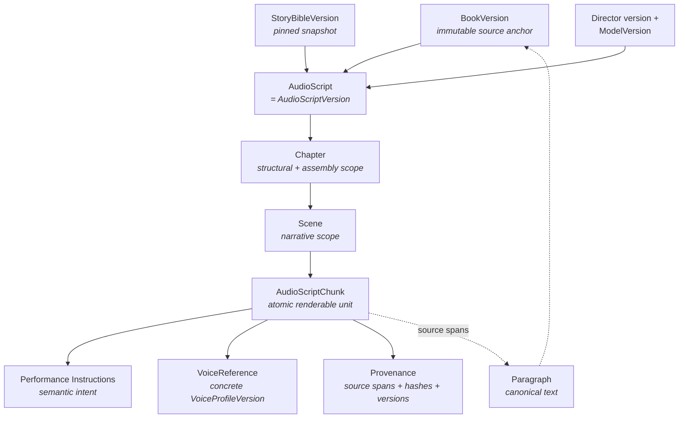
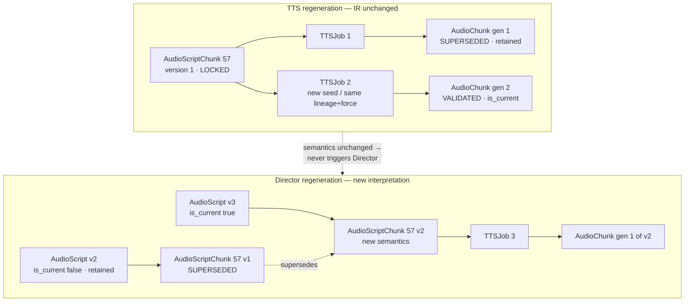
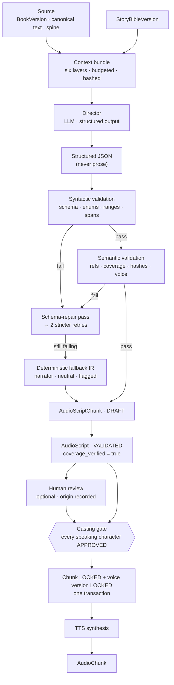
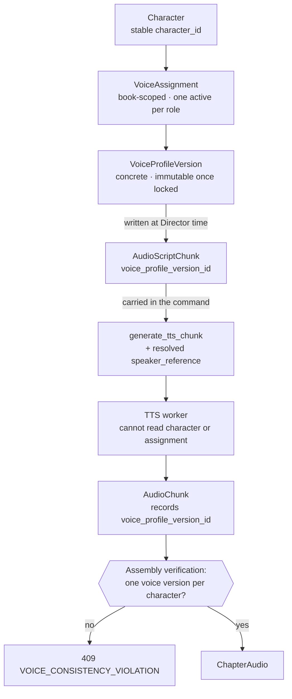
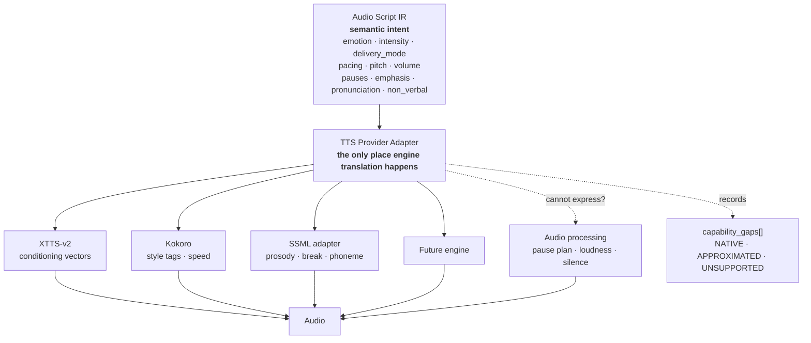

# Audio Script IR — Audiobook Production Platform

> **Document type:** Architecture Contract (Tier 2 — the IR schema, binding Director ↔ TTS)
> **Path:** `docs/architecture/audio-script-ir.md`
> **Status:** DRAFT — pending human review
> **IR schema version specified here:** `ir.v1.0`
> **Doc version:** `audio-script-ir.v1`
> **Owner:** Architecture
> **Derives from:** `context.md` (`context.v1`) §6, §7
> **Reconciled against:** `database-schema.md` (`db-schema.v1`), `event-contracts.md` (`events.v1`), `api-specification.md` (`api-spec.v1`)
> **Supersedes:** nothing (initial document)

---

## 0. How to read this document

This document is the **authoritative specification of the Audio Script Intermediate
Representation** — the concrete schema of the artifact that carries every performance decision
from the Director to the TTS subsystem.

`context.md` §26.1 rule 3 fixes its authority precisely:

> `audio-script-ir.md` owns the IR's **concrete schema**, but the IR's *role and mutability
> rules* come from §7 here.

So: `context.md` §6–§7 decide what the IR is *for* and what may change; this document decides
what its fields are called, what types they carry, what values are legal, and how they are
validated.

It stops short of implementation. It contains **no TypeScript interfaces, no Zod schemas, no
Python models, no Prisma models, no migrations, no API routes, no Director implementation, no
TTS implementation, and no worker code.**

Modal words carry the meanings of `context.md` §0: **MUST** is non-negotiable, **SHOULD** is a
strong default requiring a documented reason to deviate, **MAY** is genuinely optional.

**Authority.** `context.md` is Tier 0 and supreme. `database-schema.md`,
`event-contracts.md`, and `api-specification.md` are Tier 1. This document is Tier 2 and may
not contradict any of them. Where it appears to, the contradiction is reported in §63, never
silently resolved (`context.md` §28 rule 13).

**One boundary to note before reading further.** `context.md` §6.3 assigns the *member lists*
of the emotion and delivery-mode vocabularies to `docs/architecture/director-specification.md`
— a document that does not yet exist. This document therefore specifies the **fields, their
types, their validation rules, and how the vocabularies are versioned and extended**, and
carries a **recommended member set** clearly marked as a proposal to that document rather than
as authority here. §17.2 and §63 explain the consequences.

---

## 1. Purpose

### 1.1 Position in the pipeline

```
BOOK → PARSER → NORMALIZED DOCUMENT → NARRATIVE UNDERSTANDING → DIRECTOR
     → AUDIO SCRIPT IR → VOICE RESOLUTION → TTS → AUDIO
```

The Audio Script IR sits at the single most important boundary in the system
(`context.md` §6.3: *"This is the single most important boundary in §10."*). Everything
upstream of it is about **understanding a book**. Everything downstream is about **rendering
a performance**. The IR is what lets those two halves be developed, scaled, tested, and
replaced independently.

### 1.2 The correctness test

`context.md` §7.1 states it, and every design decision in this document is measured against
it:

> A TTS worker with **no database access, no book access, and no network except object
> storage** must be able to render the chunk correctly from the IR plus the referenced voice
> artifact.

> If a worker needs any fact not present in its chunk, **the IR is under-specified and that is
> an architecture bug.**

This is not aspirational. `database-schema.md` §37.2 makes it a database permission: the
`app_worker_gpu` role has no `SELECT` privilege on `book`, `paragraph`, `character`,
`voice_assignment`, or any Story Bible table. A TTS worker that tried to look something up
would receive a permission error, not a row.

### 1.3 What the TTS subsystem MUST NOT infer

Never, under any circumstance:

| Must not infer | Because it is decided by |
| --- | --- |
| Who is speaking | Director + Character Registry (§11, §13) |
| Whether text is narration, dialogue, or internal thought | Director (§18, §28, §29) |
| Character identity from a name, alias, or pronoun | Character Service reference resolution (§13.2) |
| Emotion or its intensity | Director (§17) |
| Scene context or narrative situation | Story Bible + Director (§36, §37) |
| Speaking style | Director (§18) |
| Pacing, pitch, volume | Director (§19–§21) |
| **Voice identity** | Voice Registry, resolved at IR generation time (§14) |

`context.md` §28 rule 16 states the general form: *"Never make TTS smart. If a task tempts a
TTS worker to read the book, the Story Bible, or the Character Registry, the design is wrong —
the missing information belongs in the IR."*

---

## 2. The architectural principle

> **The Audio Script IR is the semantic contract between narrative intelligence and audio
> generation.**

| The **Director** decides | The **TTS subsystem** decides |
| --- | --- |
| **WHAT** is said — which verbatim slice of canonical text | **HOW to synthesize** the approved performance instructions into waveform |
| **WHO** says it — a resolved, stable `character_id` | Which engine controls approximate the requested semantic intent |
| **HOW** it is performed — emotion, intensity, delivery mode, pacing, pitch, volume, pauses, emphasis, pronunciation | How to batch, how to allocate VRAM, which seed to honour |
| **WHICH VOICE** performs it — a concrete `voice_profile_version_id` | Nothing about identity, meaning, or intent |

### 2.1 The two prohibitions that keep them separate

From `context.md` §6.5, the Director **MUST NOT**:

- synthesize, decode, or touch audio;
- create voice profiles or alter voice identity;
- rewrite, abridge, or paraphrase the author's text;
- invent characters;
- persist book structure.

From `context.md` §3.2.12 and §10.1, the TTS subsystem **MUST NOT**:

- read the book, the Story Bible, or the Character Registry;
- decide emotion, speaker, or voice — those arrive **fully decided** in the IR;
- alter the semantic meaning of a chunk during generation.

### 2.2 Why the boundary is drawn here and not elsewhere

Two other placements were possible and are worth naming so the choice is legible:

- **IR as engine parameters** (the Director emits XTTS conditioning vectors). Rejected: it
  welds the intelligence layer to one engine, so `context.md` §1.5's load-bearing test —
  *"swapping XTTS for another engine MUST NOT require changes in document understanding,
  narrative understanding, voice assignment, or delivery"* — would fail immediately.
- **IR as annotated text with the TTS worker resolving speakers and voices.** Rejected: it
  makes consistency across a 300 000-word artifact a per-chunk inference problem rather than a
  state-management problem, which `context.md` §1.2 identifies as the central design error to
  avoid.

The IR carries **semantic intent** — `emotion=GRIEF, intensity=0.7` — and never engine
parameters. Translation happens inside the provider adapter (§38).

---

## 3. Design goals

Each is traced to the section that satisfies it and to the acceptance check that verifies it.

| # | Goal | Satisfied by | Verified in |
| --- | --- | --- | --- |
| 1 | Deterministic speaker identity | §11, §13 | §61 |
| 2 | Deterministic voice assignment | §14, §15 | §61 |
| 3 | Narrative context | §36, §37 | §61 |
| 4 | Emotional direction | §17, §21 | §61 |
| 5 | Pacing direction | §19 | §61 |
| 6 | Pronunciation guidance | §25, §26 | §61 |
| 7 | Pause and breath guidance | §22, §23 | §61 |
| 8 | Emphasis guidance | §24 | §61 |
| 9 | Scene continuity | §37 | §61 |
| 10 | Chunk ordering | §35 | §61 |
| 11 | Source-text provenance | §33, §34 | §61 |
| 12 | Model and version provenance | §8, §43 | §61 |
| 13 | Reproducibility | §43, §45 | §61 |
| 14 | Validation | §41, §42 | §61 |
| 15 | Resumability | §35, §45 | §61 |
| 16 | Regeneration support | §44 | §61 |
| 17 | Future TTS-provider independence | §38, §39, §40 | §61 |

---

## 4. Inputs and consistency verification

### 4.1 Documents read in full before drafting

- **`context.md`** — §1.4 (stage boundaries), §2.4–§2.5 (determinism, immutability), §5.4–§5.6
  (context bundles, chunk sizing), **§6 (Director) and §7 (IR) — load-bearing**, §8
  (characters), §9 (voice), §10.2–§10.3 (provider abstraction, capability negotiation), §13
  (audio pipeline), §14.2 (Director validation), §16 (jobs), §18.9–§18.10 (prompt injection,
  LLM output validation), §26 (document authority).
- **`database-schema.md`** — §6 (entities), §9 (structure and provenance), §10 (characters),
  §11 (Story Bible), §12 (voice), **§13 (`audio_script`, `audio_script_chunk`,
  `audio_script_chunk_source`)**, §14 (models), §16 (TTS and audio), §19 (lineage), §21
  (idempotency), §23 (JSONB), §24 (enums), §32 (state machines).
- **`event-contracts.md`** — §11.7/§11.10 (Director and TTS commands), §12.4–§12.5 (events),
  §15 (version consistency), §16 (the `generate_tts_chunk` payload), §18 (idempotency), §39
  (reproducibility).
- **`api-specification.md`** — §12.3 (field constraints), §12.5 (LLM validation), §16.13
  (Director and IR endpoints — the IR's public shape), §20 (state vocabularies), §21.5 (error
  codes).

### 4.2 Terminology inherited verbatim

**No entity is renamed and no alternative name is introduced.**

| Entity | Source | Note |
| --- | --- | --- |
| `BookVersion` | `database-schema.md` §8.3 | The reproducibility anchor |
| `Chapter`, `Section`, `Scene`, `Paragraph` | `database-schema.md` §9 | The reading spine |
| `Character`, `CharacterAlias` | `context.md` §8.2 | Identity, with reserved sentinels |
| `StoryBibleVersion` | `database-schema.md` §11.3 | The pinned narrative snapshot |
| `VoiceProfile`, `VoiceProfileVersion`, `VoiceAssignment` | `context.md` §9.2 | |
| **`AudioScript`** | `context.md` §4.2 #14 | **Is the Audio Script version** — §8.1 |
| `AudioScriptChunk` | `context.md` §4.2 #15 | The atomic unit |
| `TTSJob` | `context.md` §4.2 #16 | The brief calls it `TTSGeneration` — §63, IR-1 |
| `AudioChunk` | `context.md` §4.2 #17 | The rendered artifact |
| `ProcessingJob`, `ProcessingAttempt` | `context.md` §4.2 #20–21 | |
| `ModelVersion` | `context.md` §4.2 #22 | |

### 4.3 Consistency checks performed

| Check | Result | Where |
| --- | --- | --- |
| Entity names and identifiers | **Pass** — §4.2 | §62.1 |
| Field names match `context.md` §7.2 | **Pass** — every §7.2 field appears with the same name | §52 |
| Field names match `database-schema.md` §13.2 columns | **Pass** — the IR is the row | §53 |
| Mutability matches `context.md` §7.3 | **Pass** | §7 |
| Coverage invariant respected | **Pass** — and it constrains non-verbal representation (§27) | §34.3 |
| Voice consistency guarantee respected | **Pass** — concrete version, never a floating pointer | §14 |
| No provider-specific field in the core IR | **Pass** | §38.4 |
| No new persistent entity introduced | **Pass, with two flagged additive fields** | §63.2 |

---

## 5. The IR hierarchy

### 5.1 The levels

```
BookVersion                  ← the immutable source anchor
    ↓
AudioScript (= AudioScriptVersion)   ← one Director interpretation of that source
    ↓
Chapter                      ← structural scope, from the spine
    ↓
Scene                        ← narrative scope, from analysis
    ↓
AudioScriptChunk             ← the atomic renderable performance unit
    ↓
Performance Instructions     ← how this chunk is performed
```

### 5.2 Responsibility of each level

| Level | Owns | Does **not** own |
| --- | --- | --- |
| **`BookVersion`** | The canonical text, the structural spine, and the parse/normalisation provenance. **Everything downstream pins it** (`event-contracts.md` §15.2) | Any performance decision |
| **`AudioScript`** | One complete Director interpretation of a scope: the input version pins, the Director and model versions, the IR schema version, the chunk manifest, validation outcome, coverage proof | Individual chunk content |
| **`Chapter`** | Structural scope and assembly boundary. Chunks group by chapter for assembly, regeneration, and progress | Narrative meaning |
| **`Scene`** | Narrative scope: participants, mood, POV, location. **Referenced by id, never copied into every chunk** (§36) | Chunk-level delivery |
| **`AudioScriptChunk`** | One renderable unit: verbatim text, resolved speaker, resolved voice, full performance instructions, provenance, generation control | Audio. It is a *specification*, never a result |
| **Performance Instructions** | Semantic intent: emotion, intensity, delivery mode, pacing, pitch, volume, pauses, emphasis, pronunciation, non-verbal | Engine parameters (§38) |

`Section` exists in the spine (`database-schema.md` §9) and is carried on the chunk as
`section_id` for traceability, but it is **not** an IR grouping level: `context.md` §4.3 allows
a scene to cross a section boundary but never a chapter boundary, so section is an attribute,
not a container.

### 5.3 Ordering is preserved at every level

The IR **MUST** preserve original narrative ordering. Three mechanisms, all required:

| Mechanism | Scope | Guarantees |
| --- | --- | --- |
| `sequence_index` | Global within one `AudioScript` | Total order of every chunk in the interpretation |
| `chapter_sequence_index` | Within a chapter | Chapter-local order, so a chapter is assemblable in isolation |
| Structural ordering (`chapter.order_index`, `scene.order_index`, `spine_position`) | The spine | The reading order the chunks were sliced from |

§35 specifies the ordering contract in full.

### 5.4 Hierarchy diagram



---

## 6. Audio Script versus source text

### 6.1 The distinction

| | **Source text** | **Audio Script IR** |
| --- | --- | --- |
| Represents | What the book **contains** | How that content should be **performed** |
| Owned by | Parser → `paragraph.text` (`database-schema.md` §9.3) | Director → `audio_script_chunk` |
| Mutability | Immutable once scripted (`context.md` §4.5) | Immutable once generation starts (§7) |
| Authority | The book | The Director's interpretation of the book |

### 6.2 The worked example

Source:

```
"Don't come any closer," Alice whispered.
```

The Director's interpretation splits this into **two chunks**, because it contains two
different speakers performing two different things:

```
chunk 1  speaker_type = CHARACTER   character_id = <Alice>
         text         = "\"Don't come any closer,\""
         delivery_mode = WHISPER   emotion = FEAR   emotion_intensity = 0.75
         pacing = 0.85   volume = -0.6
         pauses = [ { position: TRAILING, duration_ms: 220 } ]
         emphasis = [ { offset_chars: 15, length_chars: 6, strength: 0.6 } ]   ← "closer"

chunk 2  speaker_type = NARRATOR    character_id = <NARRATOR sentinel>
         text         = " Alice whispered."
         delivery_mode = NORMAL    emotion = NEUTRAL   emotion_intensity = 0.2
```

Note four properties of that split, each of which is a rule elsewhere in this document:

1. **The text is verbatim, including its punctuation and the surrounding quotation marks.**
   Concatenating chunk 1 and chunk 2's `text` reconstructs the source exactly (§34.3).
2. **The speech tag "Alice whispered" is narration, not dialogue** — it is what the narrator
   says about Alice, in the narrator's voice.
3. **"whispered" is not deleted or rewritten.** It stays in the narrator's chunk *and* informs
   the character chunk's `delivery_mode` — the same information is expressed twice, once as
   literature and once as instruction. That is correct and intended.
4. **Nothing was invented.** No `[whispering]` marker was inserted into any text field.

### 6.3 What the Director MAY do

| Transformation | Permitted | Constraint |
| --- | --- | --- |
| **Split** text into chunks at sentence, dialogue, or speaker boundaries | **Yes** | Concatenation must reconstruct the source exactly (§34.3). Boundaries must align to sentence boundaries (`context.md` §5.6) |
| **Attach** performance metadata | **Yes** | This is its entire purpose |
| **Attach** offset-scoped pronunciation hints | **Yes** | As metadata, never by altering `text` (`context.md` §6.4) |
| **Attach** offset-scoped emphasis spans | **Yes** | Never as markup inside `text` (`context.md` §6.2) |
| **Represent** non-verbal action | **Yes** | As annotation or an empty-text chunk, never as invented text (§27) |
| **Normalise whitespace** | **Yes, narrowly** | Only the normalisation the parser already applied to produce canonical text; the Director does not re-normalise |
| **Produce `spoken_text`** — a normalised-for-speech form | **Yes** | §34.2. Documented, reversible, and **the original `text` is always retained** |

### 6.4 What the Director MUST NOT do

`context.md` §6.5, verbatim in force:

> **MUST NOT** rewrite, abridge, or paraphrase the author's text. The `text` field of a chunk
> is a **verbatim slice of canonical text**; the only permitted transformation is documented,
> reversible normalization (e.g. expansion of "Dr." for speech) recorded as a **separate
> `spoken_text` field with the original retained**.

Concretely forbidden:

| Forbidden | Why |
| --- | --- |
| Paraphrasing or "improving" a sentence | It is the author's book |
| Deleting text deemed unreadable | Silent content loss; caught by the coverage invariant |
| Adding explanatory or connective content | Hallucination; caught by the text-hash check |
| Inserting `[laughs]`, `[sighs]`, or any marker into `text` | Invents content and breaks coverage (§27.2) |
| Embedding SSML, phoneme markup, or emphasis tags in `text` | The IR is not markup (§40); annotations are offset-addressed |
| Rewriting text to fix pronunciation | `context.md` §6.4 forbids it explicitly (§25.3) |
| Reordering sentences | Destroys the reading spine |

### 6.5 The safeguards that make this enforceable

Three independent mechanisms, none of which relies on the model behaving:

1. **Text-hash fidelity.** `source_content_hash` is verified against the source paragraphs'
   `content_hash` (`context.md` §18.9 rule 5). A mismatch is a validation failure recorded on
   the script, and the chunk never becomes `VALIDATED`.
2. **The coverage invariant.** The concatenation of chunk `text` for a chapter **MUST**
   reconstruct the chapter's canonical text exactly (`context.md` §14.2). This single check
   catches most silent content loss, and `database-schema.md` §13.1 makes it a check
   constraint: a script cannot be `VALIDATED` with a non-zero gap or overlap count.
3. **`spoken_text` is additive, never destructive.** It sits beside `text`, which is
   unchanged. A reviewer can always see both.

---

## 7. Immutability

### 7.1 The mutability contract

Taken from `context.md` §7.3 and binding without modification:

| Field group | Mutability |
| --- | --- |
| Identity, lineage, `source_content_hash`, `schema_version`, `director_version`, `context_bundle_hash` | **Immutable from creation** |
| `text`, `spoken_text`, `language`, `script` | **Immutable from creation.** A text change is a **new chunk**, not an edit |
| Performance fields, voice binding, generation params, seed | Mutable while chunk state is `DRAFT`/`VALIDATED`. **Frozen the moment a `TTSJob` for this chunk enters `RUNNING`** |
| `confidence`, `review_flags` | Mutable — annotations, not contract |

### 7.2 What must never silently change

The brief's list, mapped to the fields that carry it:

| Must not silently change | Field |
| --- | --- |
| Source content hash | `source_content_hash` |
| Book version | `book_version_id` (on the `AudioScript`, inherited by every chunk) |
| Audio script version | `audio_script_id` + `version` |
| Chunk identity | `id` + `version` |
| Sequence | `sequence_index`, `chapter_sequence_index` |
| Director version | `director_version` + `director_model_version_id` |
| Story Bible version | `story_bible_version_id` |

### 7.3 The freeze

The transition is atomic. `event-contracts.md` §28.4 and `database-schema.md` §28.4 specify
one transaction:

```
lock the chunk row
  → audio_script_chunk.state  = LOCKED, locked_at = now()
  → voice_profile_version.lock_state = LOCKED, reason = USED_IN_GENERATION
  → insert tts_job
  → processing_job.status = RUNNING, lease_fence += 1
commit
```

If these were separate transactions there would be a window in which a chunk is being rendered
while its performance fields are still editable — the race that produces **audio whose IR no
longer describes it**.

### 7.4 After the freeze: supersede, never mutate

```
AudioScriptChunk v1  state = LOCKED       ← retained, still explains AudioChunk v1
                     ↓ supersedes
AudioScriptChunk v2  state = DRAFT → VALIDATED → LOCKED
```

`context.md` §7.3: after freeze, any change produces a **new chunk version** with
`supersedes = <old chunk_id>`; downstream audio for the old version is marked `SUPERSEDED`
but **retained**; the chapter manifest then references the new version.

> **This is how a user fixes one line without invalidating a 14-hour render.**

### 7.5 Interpretation changes create a new AudioScript

If the Director must produce a *different interpretation* — a new Director version, a new
Story Bible snapshot, a re-run after a character merge — the result is:

```
AudioScript version N     is_current = false, superseded_at set   ← retained
AudioScript version N+1   is_current = true
```

**The existing version is never mutated.** §44 distinguishes this from TTS regeneration, which
is the distinction the brief calls critical and which this document treats as such.

### 7.6 Immutability at the `AudioScript` level

`context.md` §4.2 #14 marks `AudioScript` immutable. `database-schema.md` §13.1 permits
exactly four post-insert writes, and no others:

`state` · the validation counters · `is_current` · `superseded_*`

These are the outcome of the validation pass that runs *after* the chunks are written and
*before* the script becomes usable. Everything else — the version pins, the model versions,
the schema version, the totals — is written once.

---

## 8. AudioScript and AudioScriptVersion

### 8.1 They are the same row

`context.md` §4.2 #14 lists a single `AudioScript` entity marked "Ver.: yes".
`api-specification.md` §16.13 returns `version` and `supersedes_audio_script_id` **on the
`audio_script` resource itself**. `database-schema.md` §13.1 implements it as one table with a
version chain.

> **`AudioScript` row = one `AudioScriptVersion`.** There is no separate version table, and
> introducing one would contradict the API. Recorded as **IR-2** in §63.

Throughout this document, `audio_script_id` **is** the Audio Script version identifier, and
`AudioScriptVersion` is used as a role name for the same row.

### 8.2 Required fields

Every value a re-run would need in order to be explained or reproduced.

| Field | Type | Req. | Meaning |
| --- | --- | --- | --- |
| `id` | UUIDv7 | **Yes** | The Audio Script version identifier |
| `book_id`, `tenant_id` | UUIDv7 | **Yes** | Ownership and scope |
| **`book_version_id`** | UUIDv7 | **Yes** | **The source pin.** Every chunk inherits it |
| **`story_bible_version_id`** | UUIDv7 | **Yes** | **The narrative-context pin** (§43.2) |
| `scope` | `BOOK` \| `CHAPTER` | **Yes** | What this interpretation covers |
| `scope_chapter_id` | UUIDv7 | Conditional | Required when `scope = CHAPTER` |
| `version` | integer ≥ 1 | **Yes** | Monotonic per book |
| `supersedes_audio_script_id` | UUIDv7 \| null | **Yes** | The version this replaces |
| `is_current` | boolean | **Yes** | Exactly one per book |
| **`schema_version`** | `ir.vMAJOR.MINOR` | **Yes** | **The IR schema version** — `ir.v1.0` here (§42) |
| **`director_version`** | string | **Yes** | The whole decision bundle: prompt templates, post-processing, validation rules, and the model (§8.3) |
| **`director_model_version_id`** | UUIDv7 | **Yes** | FK to `model_version`; resolves the label to a concrete model |
| `source_content_hash` | `char(64)` | **Yes** | Canonical text hash of the scope |
| `structure_version_label` | string | **Yes** | The spine label the chunks were sliced from |
| `chunk_count`, `total_characters`, `estimated_audio_ms` | integer | **Yes** | Totals for progress math |
| `state` | `DRAFT` \| `VALIDATED` \| `SUPERSEDED` | **Yes** | §42.4 |
| `coverage_verified`, `coverage_gap_count`, `coverage_overlap_count` | bool, int, int | **Yes** | The coverage proof (§34.3) |
| `unknown_speaker_rate`, `fallback_applied_count`, `low_confidence_chunk_count` | real, int, int | **Yes** | Validation summary (§41.4) |
| `degraded` | boolean | **Yes** | True if any part of the run consumed a degraded context bundle |
| `job_id` | UUIDv7 | **Yes** | The producing `ProcessingJob` |
| `created_at`, `updated_at` | timestamptz | **Yes** | |

### 8.3 `director_version` and the prompt/template question

`context.md` §6.6 defines it precisely:

> `director_version` identifies the **whole decision-making bundle**: prompt template set,
> post-processing logic, validation rules, and the LLM `ModelVersion`. It changes whenever any
> of those change.

So the brief's question — *"also consider prompt/template version if relevant to
reproducibility"* — is answered: **the prompt/template version is subsumed by
`director_version` and MUST NOT be a separate IR field.** A separate field would create two
sources of truth for the same fact and permit the inconsistent state "same `director_version`,
different prompts", which is precisely what §6.6 exists to prevent.

**Prompt text never appears in the IR** — not in a chunk, not on the script, not in a message
(`event-contracts.md` §15.7). It is a deployment artifact identified by the label.

### 8.4 Director version mixing

`context.md` §6.6: mixing Director versions within a single published audiobook is
**forbidden by default**, because it produces audible inconsistency. Doing so requires an
explicit, recorded user decision, stored on `book` with principal and timestamp
(`database-schema.md` §8.1) — never inferred, and never a per-chunk override.

### 8.5 What the AudioScript is *not*

| Not | Because |
| --- | --- |
| A container for chunk content | Chunks are their own rows; the script carries the manifest and the pins |
| A mutable working document | Immutable but for four lifecycle columns (§7.6) |
| A place to record TTS outcomes | That is `TTSJob` and `AudioChunk` (§56) |
| A Director run log | That is `ProcessingJob` + `ProcessingAttempt` (`api-specification.md` OQ-10) |

---

## 9. Chunk design

### 9.1 The atomic unit

`context.md` Appendix A: *"**Chunk** — One renderable performance unit: an
`AudioScriptChunk` and the `AudioChunk` it produces. The atomic unit of generation, retry, and
regeneration."*

### 9.2 The four properties a chunk must have

| Property | Guaranteed by |
| --- | --- |
| **Independently processable** | The chunk is self-sufficient (§1.2); no cross-chunk read is needed to render it |
| **Independently retryable** | One `ProcessingJob` per chunk (`event-contracts.md` §31.1); one `TTSJob` per generation |
| **Independently regeneratable** | `context.md` §16.4: *"A failed chunk MUST be regenerable without regenerating its chapter"* |
| **Independently traceable** | `audio_script_chunk_source` links to exact paragraph spans; `AudioChunk` carries the full lineage tuple |

### 9.3 The seven field groups

```
AudioScriptChunk
 ├── Identity & lineage      id · audio_script_id · book_id · chapter_id · section_id ·
 │                           scene_id · sequence_index · chapter_sequence_index ·
 │                           version · supersedes_chunk_id · schema_version ·
 │                           director_version · director_model_version_id ·
 │                           context_bundle_hash · story_bible_version_id
 ├── Content                 text · spoken_text · language · script
 ├── Speaker                 speaker_type · character_id · is_dialogue · delivery_mode
 ├── Performance             emotion · emotion_intensity · pacing · pitch · volume ·
 │                           pauses[] · emphasis[] · pronunciation_hints[] · non_verbal[]
 ├── Voice binding           voice_profile_id · voice_profile_version_id
 ├── Generation control      tts_provider_id · generation_params · generation_params_hash ·
 │                           seed · target_sample_rate · target_channels
 └── Quality & provenance    confidence · review_flags[] · fallback_applied ·
                             fallback_reason · capability_gaps[] · origin ·
                             source_content_hash · source spans · state
```

Every field name comes from `context.md` §7.2 or `database-schema.md` §13.2. The three
additions — `non_verbal[]`, `origin`, and `story_bible_version_id` on the chunk — are flagged
in §63.2.

### 9.4 `voice_reference` is resolved, not stored on the IR row

`context.md` §7.2 lists `voice_reference` — the object key for the embedding or reference
audio — as *"resolved at generation time, recorded on the audio chunk, **not mutated in the
IR**"*.

So it is **materialised into the `generate_tts_chunk` message payload**
(`event-contracts.md` §16.1) and recorded on the `AudioChunk`, but it is **not a stored column
on the IR row**. Storing it would create a second, staleable copy of a key that
`voice_profile_version` already owns, and `api-specification.md` §16.13 confirms it is never
returned to a public client because it is an object-storage key.

### 9.5 One chunk, one speaker

A chunk resolves to **exactly one** `speaker_type` and, where applicable, exactly one
`character_id` and one `voice_profile_version_id`. §30 gives the reasoning and the single
narrow exception.

---

## 10. Chunking strategy

### 10.1 Semantic chunking, never fixed-width

> **Chunk boundaries are semantic. Splitting every *N* characters is forbidden.**

`context.md` §5.6 fixes the target:

> Chunk sizing targets a **performance-natural unit** (a paragraph, or a dialogue exchange),
> bounded by an absolute character ceiling and by the TTS engine's practical input limit —
> whichever is smaller. Chunk boundaries **MUST** align to sentence boundaries.

### 10.2 Boundary rules, in priority order

A boundary **MUST** be placed at:

| # | Boundary | Why |
| --- | --- | --- |
| 1 | **Speaker change** | One chunk, one voice (§9.5, §30) |
| 2 | **Scene boundary** | A chunk never spans scenes; scene context would be ambiguous |
| 3 | **Chapter boundary** | Chapters are the assembly and regeneration unit |
| 4 | **Delivery-mode change** | A whisper and a shout cannot share one synthesis call |

A boundary **SHOULD** be placed at:

| # | Boundary | Why |
| --- | --- | --- |
| 5 | **Paragraph boundary** | The natural performance unit for narration |
| 6 | **Dialogue open/close** | Separates the quoted speech from its speech tag (§6.2) |
| 7 | **Marked emotional transition** | A sentence where the emotional register shifts |

A boundary **MAY** be placed at a sentence boundary to respect the size bounds — and when the
size bounds force a split, it **MUST** fall on a sentence boundary (`context.md` §5.6).

A boundary **MUST NOT** be placed:

- mid-word, mid-sentence, or inside a quotation;
- inside an emphasis span or a pronunciation hint span;
- at an arbitrary character offset.

### 10.3 Size bounds

All values here are **configuration**, recorded in `deployment-architecture.md`. This document
fixes the **rule**, not the number.

```
effective_max_chars = min( ir_absolute_ceiling ,
                           provider.max_input_chars for the bound voice version )
```

`context.md` §10.3: `max_input_chars` from provider capabilities *"feeds back into Director
chunk sizing via **configuration**, not via runtime coupling"* — the Director reads a
configured number, it does not call a worker at chunk time.

| Bound | Rule | Illustrative value (**configurable**) |
| --- | --- | --- |
| **Hard ceiling** | Never exceeded; a chunk over it is a validation failure | ~400 characters, the typical XTTS `max_input_chars` (`api-specification.md` §16.21) |
| **Target band** | Where most chunks should land | ~120–320 characters |
| **Soft floor** | Below this, prefer merging with an adjacent same-speaker chunk | ~40 characters |

### 10.4 Why both extremes are wrong

| Too small | Too large |
| --- | --- |
| **Unnatural prosody** — an autoregressive model given three words has no phrase to shape, and the result sounds clipped | **Expensive failure** — a failed 900-character chunk wastes far more GPU time than a failed 200-character one |
| More join points, so more crossfade artefacts | Higher latency to first audible output |
| Overhead per chunk (job row, attempt, validation, storage object) dominates | Coarser retry granularity — one bad word forces re-rendering a whole paragraph |
| Sentence-final intonation applied where the sentence has not ended | Less control: one emotion for a span that may have several |
| More rows: a book that would be 8 000 chunks becomes 30 000 | **Runaway repetition risk** — a known autoregressive TTS failure mode that grows with input length (`context.md` §14.3) |

### 10.5 The soft floor has an exception

Short utterances are legitimate. `"No."` as a chunk is correct when it is a complete
character line — merging it into the neighbouring narration would put it in the wrong voice.
**The floor never overrides a boundary rule from §10.2.** Rules 1–4 always win.

### 10.6 Splitting when the bundle does not fit

`context.md` §5.4 rule 1: *"L6 is inviolable. If the bundle does not fit, the **chunk is
split**, never truncated."* A chunk is never shortened by dropping text; it becomes two
chunks, split at a sentence boundary, each independently coherent.

### 10.7 Chunking is a Director decision and is versioned with it

Chunk boundaries are part of the interpretation. Different `director_version`s may chunk the
same source differently, which is one reason a Director re-run produces a **new
`AudioScript`** rather than editing chunks in place (§44.2): the chunk set itself may change.

---

## 11. Speaker model

### 11.1 `speaker_type`

A closed enumeration, verbatim from `context.md` §6.2:

| Value | Meaning | `character_id` |
| --- | --- | --- |
| `NARRATOR` | The narrating voice | The `NARRATOR` sentinel, or a narrator-capable character (§12) |
| `CHARACTER` | A character speaking, in dialogue or internal thought | **Required** — a real character |
| `SYSTEM` | Non-narrative material: headings, front matter, footnotes, chapter titles | The `SYSTEM` sentinel |
| `UNKNOWN` | Attribution failed | The `UNKNOWN_SPEAKER` sentinel |

The brief's `NON_NARRATIVE` is the contract's `SYSTEM`; the vocabulary is closed and the
contract name is used (§63, IR-3).

### 11.2 `character_id` is always present

Every chunk carries a `character_id`. There is **no null speaker**, because
`context.md` §8.2 creates four **reserved sentinels for every book**:

```
NARRATOR · UNKNOWN_SPEAKER · MULTIPLE_SPEAKERS · SYSTEM
```

These are real `character` rows with real ids (`database-schema.md` §10.1, with
`UNIQUE (book_id, sentinel_kind)` guaranteeing exactly one of each per book). They are
non-renameable, non-mergeable, non-deletable.

The consequence is that `speaker_type` and `character_id` are always **consistent and never
ambiguous**: a downstream consumer resolves a voice from `character_id` alone, and there is no
"if null then narrator" branch anywhere in the system.

`database-schema.md` §13.2 backs it with
`CHECK (speaker_type <> 'CHARACTER' OR character_id IS NOT NULL)`.

### 11.3 `UNKNOWN` is a real, permitted outcome

`context.md` §8.3 is emphatic: the resolver **MUST NOT** invent a character to make an
ambiguity go away, and **MUST NOT** guess silently. An unresolved reference binds to
`UNKNOWN_SPEAKER` and raises a review flag.

A chunk with `speaker_type = UNKNOWN`:

- renders with the **narrator voice** as a documented fallback (`context.md` §21 row 6);
- carries `review_flags += UNKNOWN_SPEAKER`;
- counts toward `audio_script.unknown_speaker_rate`, which is a validation gate: an
  unknown-speaker rate above the tolerated threshold fails Director validation
  (`context.md` §14.2);
- is **not** blocked from rendering. A single unresolved line must not stop a book.

### 11.4 `MULTIPLE_SPEAKERS`

The sentinel exists for crowd or chorus lines ("the crowd roared"). It is a **narration
device**, not multi-speaker synthesis: the chunk binds to one voice like any other. §30.3
explains why true multi-speaker synthesis in one chunk is out of scope.

---

## 12. Narrator model

### 12.1 The narrator is a first-class identity

> The narrator is **never** modelled as `character_id = null`.

`context.md` §8.2 makes `NARRATOR` a reserved sentinel `Character` row for every book. It has
a stable id, it appears in the cast list, it takes a `VoiceAssignment` like any character, and
`api-specification.md` §16.14 confirms it is assignable: *"the `NARRATOR` sentinel **is**
assignable — a book needs a narrator voice."*

So narrator voice resolution is **the same code path** as character voice resolution:

```
speaker_type = NARRATOR
character_id = <NARRATOR sentinel>
      ↓  VoiceAssignment (book-scoped, one active)
voice_profile_version_id = <concrete>
```

No special case, no fallback branch, no separate `narrator_id` field. That uniformity is the
point: a special-cased narrator is a narrator whose consistency is guaranteed by different
code than everyone else's.

### 12.2 Multiple narrators — supported, not built

`context.md` §8.2, verbatim:

> **Multiple narrators** are ordinary `Character` rows flagged narrator-capable, with a
> per-chapter/scene narrator binding held in `NarrativeState`. **Nothing in the architecture
> assumes exactly one narrator.**

The IR needs **no change** to support this, and that is the whole design:

| Scenario | How the IR expresses it |
| --- | --- |
| Single narrator (v1 default) | Every narration chunk carries the `NARRATOR` sentinel's id |
| Multiple narrators | Narration chunks carry the id of whichever narrator-capable character narrates that scene, resolved by the Director from `narrative_state.pov_character_id` |
| Narrator variants (same narrator, different register) | A **new `VoiceProfileVersion`** of the same profile, or a different `delivery_mode`/performance profile on the same version |

`database-schema.md` §10.1 already carries `narrator_capable` on `character`, and
§11.5 carries `pov_character_id` on `narrative_state`. **No field is added and no field is
deferred** — v1 simply always resolves to the one sentinel.

### 12.3 What is deliberately not built now

No narrator-switching UI, no per-chapter narrator assignment endpoint, no narrator-transition
performance rules. `context.md` §29 does not schedule them, and building them speculatively
would violate rule 8 ("implement only the requested phase"). The identity model does not
preclude them, which is the requirement.

---

## 13. Character identity

### 13.1 Names are not identities

`context.md` §8.1: *"'Alice', 'Miss Hartwell', 'the girl in the blue coat', 'she', and 'her
sister' may all be one character; 'the Captain' may be three different people across a book.
The registry owns identity; text surfaces are merely evidence."*

The IR therefore carries **`character_id` only**. It does not carry the character's name,
aliases, pronouns, or speech traits — because a TTS worker has no use for them and no
permission to resolve them.

### 13.2 Resolution happens once, in the Director

```
surface form + spine position + scene participants
        ↓  Character Service reference resolution (context.md §8.3)
   character_id  +  resolution_strategy  +  confidence
        ↓  written into the IR chunk
        ↓  TTS consumes the resolved identity
```

`context.md` §8.3 defines seven ordered strategies — explicit attribution, exact alias, scoped
alias, pronoun resolution, turn-taking inference, LLM adjudication, fallback — and requires
that **the strategy used is recorded**. `database-schema.md` §24 has the
`resolution_strategy` enum for exactly this.

> **A TTS worker never sees a name, never resolves a pronoun, and never performs turn-taking
> inference.** It receives an id.

### 13.3 What happens when identity changes later

A character merge (`context.md` §8.4) does **not** rewrite generated audio:

| Chunk state | Behaviour |
| --- | --- |
| `DRAFT` / `VALIDATED` | Re-bound in place to the winning `character_id` |
| `LOCKED` (generation started) | **Re-versioned** — a new chunk with `supersedes_chunk_id` — and only the affected chunks are re-queued, never the whole book |

The losing `character` row is retained with `status = MERGED_INTO` and
`merged_into_character_id` set, so a historical chunk's `character_id` **always resolves**,
even to a merged identity. `database-schema.md` §26.2 makes `character_id` `ON DELETE
RESTRICT`, and characters are never deleted — so no IR chunk can ever hold a dangling
character reference.

---

## 14. Voice resolution

### 14.1 The chain

```
character_id
     ↓  VoiceAssignment      (book-scoped, exactly one active per (book, character, role))
voice_profile_id
     ↓  the assignment names a concrete version
voice_profile_version_id     ← written into the IR chunk
     ↓
TTS
```

### 14.2 The IR carries a concrete version, never a pointer

> The chunk resolves to the **exact `voice_profile_version_id`** required for generation.

`api-specification.md` §17.3, binding: the Voice Service's internal binding endpoint
*"never returns a floating 'current version' pointer for a caller to dereference later."*

This is what prevents the failure the brief names:

```
Chapter 1  → Alice voice v1
Chapter 20 → Alice voice v2      ← accidentally, because "current" changed in between
```

If the IR stored `voice_profile_id` alone, "current" would be a function of **when the worker
ran**, and a render spanning a voice change would silently produce two Alices.

### 14.3 The five enforcement layers

`context.md` §9.1 calls this *"enforced structurally, not by convention"*. The layers, in
order:

| # | Layer | Mechanism |
| --- | --- | --- |
| 1 | **One active assignment** | `UNIQUE (book_id, character_id, role) WHERE is_active` (`database-schema.md` §12.3) — resolution is deterministic at Director time |
| 2 | **Concrete version in the IR** | `audio_script_chunk.voice_profile_version_id` is a foreign key, written once at IR generation |
| 3 | **Concrete version in the message** | `event-contracts.md` §16.1 carries it in the `generate_tts_chunk` payload with the resolved `speaker_reference` |
| 4 | **The worker cannot look it up** | `database-schema.md` §37.2 — `app_worker_gpu` has no `SELECT` on `character` or `voice_assignment`. **The rule is a permission error, not a code review** |
| 5 | **Assembly verifies** | Every chunk sharing a `character_id` must share a `voice_profile_version_id`, or assembly refuses with `VOICE_CONSISTENCY_VIOLATION` (`context.md` §9.1) |

Layer 5 matters because layers 1–4 could all be satisfied while a *voice change mid-book*
still produced inconsistency. `context.md` §9.1: **consistency is validated, not assumed.**

### 14.4 Voice changes are explicit, always

`context.md` §15.4 fixes the flow, and no step is skippable:

```
1. User requests a voice change for character X
2. System creates VoiceProfileVersion v(n+1) — DRAFT. The old version stays intact
3. Preview → approve
4. System computes the IMPACT SET: all chunks bound to (X, v(n)), grouped by chapter,
   with estimated cost and duration
5. User confirms scope. A scope narrower than the impact set requires an explicit
   acknowledgement, because a partial re-voice produces an inconsistent audiobook
6. Affected AudioScriptChunks are re-versioned with the new binding; new TTSJobs enqueued;
   old AudioChunks marked SUPERSEDED but RETAINED
7. Affected chapters re-assembled; the audiobook gets a new version
```

> **At no point is an existing artifact overwritten, and at every point the previous audiobook
> version remains playable.**

### 14.5 What the IR does not carry about voices

| Not carried | Why |
| --- | --- |
| Voice name, description | Presentation only; the worker has no use for it |
| `tts_model_id`, provider parameters | Properties of the `VoiceProfileVersion`, materialised into the command (§38.3) |
| Reference audio or embedding **bytes** | Object reference only (§9.4, `event-contracts.md` §17) |
| Cloning method, training provenance | An implementation concern of the Voice/TTS subsystem (§49.2) |

---

## 15. Voice locking

### 15.1 The IR respects the lock

`context.md` §9.2 and §4.4 fix the lifecycle:

```
DRAFT → PREVIEW_GENERATED → APPROVED → LOCKED → RETIRED
```

A version becomes `LOCKED` automatically on first production render
(`locked_reason = USED_IN_GENERATION`) or explicitly (`USER_LOCKED`).

> **A `LOCKED` version is immutable forever. There is no unlock transition, no force flag, and
> no admin override** (`api-specification.md` §16.14).

### 15.2 What the IR must guarantee

| Guarantee | Mechanism |
| --- | --- |
| An IR chunk references an **immutable** version | Locking happens in the **same transaction** as the chunk freeze (§7.3) |
| A locked version's parameters cannot drift | `identity_fingerprint` includes the reference-audio hash, so swapping the audio without a version bump is impossible (`context.md` §30.7) |
| A referenced version can never be deleted | `ON DELETE RESTRICT` from every referencing table (`database-schema.md` §26.2) |
| Generation is blocked on an unapproved voice | The casting gate: `409 CASTING_INCOMPLETE` before any job is created (`event-contracts.md` §30.3) |

`context.md` §9.3 rule 1: *"Never silently mutate. A write to a `LOCKED` version is a contract
error (`409`), with a message pointing to version creation. **No exceptions, no 'small
change.'**"*

### 15.3 Old Audio Scripts are never rewritten

When a voice changes, the old `AudioScript` keeps its old `voice_profile_version_id` bindings
and remains a complete, valid explanation of the audio it produced. `RETIRED` means *"no
longer selectable for new assignments"* and **never** means deleted
(`context.md` §9.2).

---

## 16. The performance model

### 16.1 Semantic intent, not engine parameters

`context.md` §6.3, the single most important sentence in this document's subject area:

> The Director emits **semantic intent** (`emotion=grief, intensity=0.7`), **not engine
> parameters**. Translation to engine controls happens inside the provider adapter.

So the IR says *"this is grief at 0.7 intensity, whispered, slightly slow"*. It does not say
*"conditioning vector X, temperature 0.62, speed 0.85"*. §38 gives the full boundary.

### 16.2 The performance fields

| Field | Type | Req. | Meaning | §  |
| --- | --- | --- | --- | --- |
| `delivery_mode` | enum | **Yes** | The manner of production | §18 |
| `emotion` | enum | **Yes** | Primary emotional register | §17 |
| `emotion_intensity` | real 0–1 | **Yes** | How strongly that emotion is felt | §17.4, §21 |
| `pacing` | real, bounded | **Yes** | Relative speech-rate multiplier | §19 |
| `pitch` | real, bounded | **Yes** | Relative pitch hint | §20 |
| `volume` | real, bounded | **Yes** | Relative gain hint | §21 |
| `pauses[]` | array | **Yes** (may be empty) | Structured pause plan | §22, §23 |
| `emphasis[]` | array | **Yes** (may be empty) | Offset-scoped emphasis spans | §24 |
| `pronunciation_hints[]` | array | **Yes** (may be empty) | Offset-scoped pronunciation | §25 |
| `non_verbal[]` | array | **Yes** (may be empty) | Offset-scoped non-verbal expression — **additive, flagged IR-6** | §27 |
| `is_dialogue` | enum | **Yes** | Dialogue / narration / internal thought | §18.4, §28 |

### 16.3 The brief's example, expressed in the contract's fields

The brief proposes:

```json
{ "emotion": "fear", "intensity": 0.75, "energy": 0.40,
  "pacing": "SLOW", "emphasis": ["closer"] }
```

The contract-conformant form:

```json
{ "delivery_mode": "WHISPER",
  "emotion": "FEAR", "emotion_intensity": 0.75,
  "pacing": 0.85, "pitch": 0.0, "volume": -0.6,
  "emphasis": [ { "offset_chars": 15, "length_chars": 6, "strength": 0.6 } ] }
```

Four differences, each a conflict recorded in §63:

| Brief | Contract | Why |
| --- | --- | --- |
| `"fear"` | `"FEAR"` | Enum values are `SCREAMING_SNAKE_CASE` (`api-specification.md` §2.3) |
| `"intensity"` | `"emotion_intensity"` | `context.md` §7.2's field name |
| `"pacing": "SLOW"` | `"pacing": 0.85` | §19.2 — resolves a genuine contradiction inside `context.md` |
| `"emphasis": ["closer"]` | offset spans | §24.2 — a literal string cannot survive normalisation or disambiguate repeats |
| `"energy": 0.40` | *(not adopted in `ir.v1.0`)* | §21.4 |

---

## 17. Emotion

### 17.1 The field

| Field | Type | Required | Notes |
| --- | --- | --- | --- |
| `emotion` | enum | **Yes** | Primary emotional register. Closed vocabulary |
| `emotion_intensity` | real 0.0–1.0 | **Yes** | Quantised to a documented step (`context.md` §6.2) |
| `emotion_secondary` | enum \| null | Optional — **deferred, see §17.5** | A blended register |

### 17.2 The vocabulary is owned by `director-specification.md`

`context.md` §6.3, binding:

> Emotion, delivery mode, and pacing **MUST** be closed enumerations defined in
> `docs/architecture/director-specification.md`.

**That document does not yet exist.** `context.md` §26.2 places `audio-script-ir.md` *before*
it in the writing order, so this is expected — and it means this document can specify the
field, its type, its validation rule, and its extension policy, but **cannot fix the member
list without exceeding its authority**.

The recommended set below is a **proposal to `director-specification.md`**, not authority
here. Recorded as **IR-4** and **OQ-IR-1**.

### 17.3 Recommended member set (proposal, not authority)

Sixteen members, from the brief's list, which is well-shaped: it spans the register space an
audiobook needs without the combinatorial sprawl that makes cross-engine mapping impossible.

```
NEUTRAL   HAPPY     SAD        ANGRY      FEARFUL    SURPRISED  DISGUSTED  EXCITED
CALM      TENSE     ANXIOUS    SOMBER     CONFIDENT  UNCERTAIN  PLAYFUL    SERIOUS
```

Two observations for whoever fixes the list:

- **`NEUTRAL` must exist and must be the fallback.** `context.md` §21 row 5 requires a
  deterministic fallback IR of *"narrator voice, neutral emotion"* when the Director cannot
  produce valid output. Without a `NEUTRAL` member the fallback is unexpressible.
- **`context.md` §6.3's own example uses `grief`**, which is not in the brief's sixteen.
  `SAD` and `SOMBER` are the nearest members. Whether `GRIEF` becomes a seventeenth member is
  precisely the kind of decision `director-specification.md` must make deliberately — recorded
  in **OQ-IR-1**.

> **Do not blindly create hundreds of emotions.** Every member must be mappable by every
> provider adapter (§39). An emotion no engine can express and no reviewer can distinguish is
> validation surface without audible benefit.

### 17.4 Intensity is separate from emotion, and from volume

`emotion_intensity` says *how strongly the emotion is felt*, not how loud it is. §21 gives the
three-axis separation, which is the distinction that makes expressive narration possible.

### 17.5 Secondary emotion — specified, deferred to `ir.v1.1`

Genuinely useful ("cheerful on the surface, frightened underneath") and genuinely costly:
every provider adapter must decide how to blend two registers, and most engines expose one
conditioning axis, so the second would be silently dropped or crudely averaged — exactly the
outcome §39 exists to prevent.

**Decision:** `emotion_secondary` is **specified but not adopted in `ir.v1.0`**. Adding it
later is an **additive optional field → MINOR bump** (§42.2), so nothing is foreclosed.
Recorded as **OQ-IR-2**.

### 17.6 Adding an emotion later without breaking old IR

Because `emotion` is a closed enum validated at write time, adding a member is safe in one
direction only:

| Change | Version impact | Effect on existing IR |
| --- | --- | --- |
| **Add** a member | MINOR bump of the vocabulary; MINOR bump of the IR schema | **None.** Old chunks keep their values, which are still valid |
| **Remove** a member | **MAJOR** | Breaks every chunk holding it. Requires a migration mapping old values to new |
| **Rename** a member | **MAJOR** | Same |
| **Change a member's meaning** | **Forbidden outright** (§42.3) | Silently re-interprets stored artifacts |

A provider that has not yet mapped a newly added emotion reports `UNSUPPORTED` or
`APPROXIMATED` for it (§39) — *"an unmapped value is a provider-implementation gap, not a data
problem"* (`context.md` §6.3).

---

## 18. Delivery mode (speaking style)

### 18.1 The field

`delivery_mode` — a closed enumeration, and unlike emotion its members **are** fixed by
`context.md` §6.2 verbatim:

```
NORMAL · INTERNAL_THOUGHT · WHISPER · SHOUT · LAUGHING · CRYING · SINGING · READING_ALOUD
```

`READING_ALOUD` covers a character reading a letter, a sign, or an inscription — a distinct
register that would otherwise be mis-performed as ordinary dialogue.

### 18.2 The brief's proposed styles, mapped

The brief proposes thirteen. `context.md` §6.2's eight are authoritative (**IR-5**); here is
where the others go:

| Brief | Contract expression |
| --- | --- |
| `NORMAL`, `WHISPER`, `SHOUT`, `CRYING`, `LAUGHING` | Same members ✓ |
| `BREATHLESS` | `delivery_mode = NORMAL` + high `pacing` + a `BREATH` pause plan (§23) |
| `SARCASTIC` | An **emotional register**, not a production manner → `emotion` |
| `FORMAL`, `CASUAL` | **Character speech traits**, not per-chunk direction. They live on `character.speech_traits` (`database-schema.md` §10.1) and inform the Director's choices, but do not vary line by line |
| `URGENT` | `emotion = TENSE` + elevated `pacing` |
| `TIRED` | `emotion` + reduced `pacing` + reduced `volume` |
| `DRAMATIC` | Emphasis + pause plan, not a mode |
| `MONOTONE` | Low `emotion_intensity` + flat `pitch` |

The pattern: **`delivery_mode` describes how the voice is physically produced; `emotion`
describes the feeling; `pacing`/`pitch`/`volume` describe the shape.** Collapsing them into one
enum would produce a combinatorial vocabulary no adapter could map.

### 18.3 Adding a delivery mode

Same rules as §17.6, with one extra caution: `delivery_mode` values often map to *fundamentally
different* engine mechanisms (whisper may be a conditioning token in one engine and a
volume-plus-breathiness approximation in another), so a new member's provider mapping must be
specified in `tts-provider-specification.md` before it is added.

### 18.4 `is_dialogue` is a separate three-way field

`context.md` §6.2: *"Dialogue vs narration vs internal thought (**distinct, not a boolean
pair**)."*

Despite the field name, it is **not a boolean**:

```
DIALOGUE · NARRATION · INTERNAL_THOUGHT
```

The name is `context.md`'s and is kept verbatim (§4.2). It is orthogonal to `delivery_mode`:
internal thought may be whispered, and dialogue may be sung. §28 gives the interaction.

---

## 19. Pacing

### 19.1 The field

| Field | Type | Required |
| --- | --- | --- |
| `pacing` | real, within a bounded range, `1.0` = the voice's baseline rate | **Yes** |

### 19.2 Numeric, not an enum — resolving a contradiction inside `context.md`

`context.md` contradicts itself on this field:

| Source | Says |
| --- | --- |
| `context.md` §6.2 | `pacing` = *"Relative speech rate **multiplier** within a bounded range"* → numeric |
| `context.md` §7.2 | Groups `pacing, pitch, volume` together as relative hints → numeric |
| `api-specification.md` §12.3 | *"`pacing`, `pitch`, `volume` — **float** within the bounded range defined in `director-specification.md`"* → numeric |
| `api-specification.md` §16.13 example | `"pacing": 0.95` → numeric |
| `database-schema.md` §5.5 | `real` with a `CHECK` against the bounded range → numeric |
| **`context.md` §6.3** | *"Emotion, delivery mode, **and pacing** MUST be closed enumerations"* → **enum** |

**Five sources say numeric; one says enum.** This document specifies **numeric**, and records
the contradiction as **IR-7** for a `context.md` §6.3 correction.

The substantive reason numeric is right: pacing composes with a voice's baseline rate and with
provider speed controls multiplicatively. `SLOW` is not a value an adapter can multiply, and
mapping five enum members onto a continuous engine control loses the Director's ability to say
*"slightly slower"* — which is most of what pacing is for in narration.

### 19.3 Semantic labels are a derived view, not the stored value

A UI may render bands, and a Director prompt may reason in them, but the **stored and
transported value is the number**:

| Label (presentation only) | Illustrative band (**configurable**) |
| --- | --- |
| `VERY_SLOW` | ≤ 0.75 |
| `SLOW` | 0.75 – 0.92 |
| `NORMAL` | 0.92 – 1.08 |
| `FAST` | 1.08 – 1.25 |
| `VERY_FAST` | ≥ 1.25 |

Bounds live in `director-specification.md` and are enforced by a database `CHECK`
(`database-schema.md` §5.5).

### 19.4 What pacing affects, and what it does not

| Affects | Does **not** affect |
| --- | --- |
| Speaking rate within the chunk | **Pause durations** — those are explicit and absolute (§22.4) |
| The provider's speed/rate control, or a documented approximation | Sentence boundaries — those are chunking decisions (§10) |
| | Loudness or pitch — separate axes |

`context.md` §13.3 is the reason pauses are independent: *"Pause durations come from the IR
pause plan, not from whatever silence the engine happened to emit... This is what makes pacing
reproducible across engines."* If pacing scaled pauses, the same IR would produce different
timing on every engine.

### 19.5 Provider neutrality

An engine with no speed control has the adapter approximate — resampling, or a documented
"unsupported" declaration — and **record a `capability_gap`** (§39). It is never silently
ignored.

---

## 20. Pitch

| Field | Type | Required |
| --- | --- | --- |
| `pitch` | real, bounded, `0.0` = the voice's natural pitch | **Yes** |

Same reasoning as §19: a **relative hint**, not an enum, per `context.md` §6.2 (*"Relative
pitch hint within a bounded range"*) and `api-specification.md` §12.3. Presentation may band
it as `LOW`/`NORMAL`/`HIGH`; the stored value is the number.

**Many TTS models expose no pitch control at all.** The IR states intent regardless; the
adapter maps it, approximates it (post-hoc shifting, at a quality cost), or declares it
`UNSUPPORTED` — and records the gap (§39). The Director does not need to know which, and must
not branch on it: `context.md` §10.2 forbids any engine-specific condition outside a provider
adapter.

`0.0` is the neutral value and **SHOULD** be the default. Pitch is the axis most likely to
sound artificial when over-directed; a voice's identity largely *is* its pitch, so shifting it
per chunk risks making one character sound like several.

---

## 21. Volume, intensity, and energy

### 21.1 Three different things

This distinction matters more than any other in the performance model, and getting it wrong
produces flat or absurd narration.

| Axis | Field | Means | Maps to |
| --- | --- | --- | --- |
| **Volume** | `volume` | How **loud** — acoustic level | Gain / engine loudness control |
| **Emotional intensity** | `emotion_intensity` | How **strongly the emotion is felt** | Expressive conditioning strength |
| **Energy** | *(not adopted — §21.4)* | How much **physical effort** is in the delivery | — |

### 21.2 The examples that prove they are not the same

```
A terrified whisper       volume = LOW      emotion_intensity = HIGH   (0.9)
A calm narrator           volume = NORMAL   emotion_intensity = LOW    (0.15)
A furious shout           volume = HIGH     emotion_intensity = HIGH   (0.95)
Suppressed grief          volume = LOW      emotion_intensity = HIGH   (0.85)
Bored announcement        volume = HIGH     emotion_intensity = LOW    (0.1)
```

If volume and intensity were one field, the first and last rows would be indistinguishable —
and a terrified whisper would be rendered as an *unemotional quiet line*, which is the single
most common failure of naive expressive TTS.

### 21.3 `volume` is a hint, not the final mix

`volume` is a **relative gain hint** consumed by the provider adapter. It is **not** the
audiobook's loudness: `context.md` §13.3 applies a light per-chunk normalisation pass and an
authoritative per-chapter/whole-book integrated pass to a target LUFS. The IR's `volume`
shapes the *performance*; the audio pipeline guarantees the *delivery loudness*.

A Director that tried to set absolute loudness would be overruled by normalisation, and should
not try.

### 21.4 `energy` — specified, not adopted in `ir.v1.0`

The brief proposes a third axis. It is conceptually real: a whisper can be low-volume,
high-intensity, and either tense-and-effortful or exhausted-and-limp.

**Decision: not adopted in `ir.v1.0`.** Three reasons:

1. **`context.md` §6.2 and §7.2 do not list it.** Adding it is an architecture change
   requiring a §27 amendment, not a Tier 2 decision (**IR-8**).
2. **Almost no provider exposes an effort axis** separate from expressiveness. It would be
   `UNSUPPORTED` nearly everywhere, adding validation surface and capability-gap noise for
   little audible benefit.
3. **The space is already covered for the cases that matter.** `delivery_mode` (`WHISPER`,
   `BREATHLESS`-via-pacing, `SHOUT`) plus `emotion` plus `emotion_intensity` plus `volume`
   express every example in the brief.

Adding it later is an additive optional field → MINOR bump. Recorded as **OQ-IR-3**.

---

## 22. The pause model

### 22.1 Structure

`context.md` §6.2 defines the pause plan as *"leading, trailing, and intra-text at character
offsets, in ms"*, and §7.2 gives the entry shape
`{position: LEADING|TRAILING|OFFSET, offset_chars?, duration_ms}`.

This document specifies the concrete entry, adding two optional attributes:

```json
{
  "position":    "TRAILING",
  "offset_chars": null,
  "duration_ms":  800,
  "kind":        "DRAMATIC",
  "breath":      "NONE"
}
```

| Field | Type | Req. | Meaning |
| --- | --- | --- | --- |
| `position` | `LEADING` \| `TRAILING` \| `OFFSET` | **Yes** | Where relative to the chunk |
| `offset_chars` | integer \| null | Conditional | **Required iff** `position = OFFSET`; must fall within `text` and not inside a word |
| `duration_ms` | integer ≥ 0 | **Yes** | **Absolute milliseconds** |
| `kind` | enum | Optional, default `BEAT` | Semantic purpose — §22.3. **Additive, flagged IR-9** |
| `breath` | enum | Optional, default `NONE` | §23 |

### 22.2 Why absolute milliseconds

`context.md` §13.3 is unambiguous: *"Pause durations come from the IR pause plan, not from
whatever silence the engine happened to emit. Engine-emitted leading/trailing silence is
**trimmed first**, then the intended pause is inserted. **This is what makes pacing
reproducible across engines.**"*

So the pause plan is executed by the **audio processing stage** (`process_audio`), not by the
TTS engine. The engine's own silence is removed; the IR's pause is inserted. A dramatic beat is
therefore identical across XTTS, Kokoro, and any future engine — which a punctuation-derived
pause could never be.

### 22.3 `kind` — semantic purpose

| Value | Purpose |
| --- | --- |
| `BEAT` | An ordinary rhythmic pause (default) |
| `SENTENCE` | Between sentences within a chunk |
| `PARAGRAPH` | At a paragraph boundary |
| `DRAMATIC` | A deliberate held silence for effect |
| `SCENE_TRANSITION` | At a scene boundary |
| `SPEAKER_TRANSITION` | Between speakers (§30.4) |

`kind` is **advisory**: `duration_ms` is authoritative. `kind` exists so a reviewer can see
*why* a pause is there, so a UI can render it meaningfully, and so a future policy could adjust
all dramatic pauses without re-running the Director.

### 22.4 Do not rely on punctuation

The brief's requirement, and the architecture's: *"Do not rely entirely on punctuation to
produce important dramatic timing."*

A full stop tells an engine to pause; it does not tell it to hold 800 ms because a character
has just realised who the murderer is. **That is a Director decision and belongs in the IR
explicitly.** Punctuation-derived micro-pauses remain the engine's business; anything the
performance depends on is stated.

### 22.5 Validation

Every pause entry is validated (§41.3): `offset_chars` within `[0, len(text)]`, not inside a
word, `duration_ms` within a configured maximum, `LEADING`/`TRAILING` appearing at most once
each, and `OFFSET` entries strictly increasing.

---

## 23. The breath model

### 23.1 Breath is an attribute of a pause, not a separate field

**Decision:** breath is expressed as the optional `breath` attribute on a pause entry (§22.1),
not as a chunk-level field.

Reasoning: an audible breath **occupies time at a position** — which is precisely what a pause
entry already is. A separate chunk-level `breath` field would need its own position semantics,
duplicating the pause model. And `context.md` §7.2 already owns the pause structure, so this is
a concrete specification of an existing field rather than a new one.

### 23.2 Values

| Value | Meaning |
| --- | --- |
| `NONE` | Silence (default) |
| `NATURAL` | An unobtrusive breath, if the engine produces one |
| `AUDIBLE` | A deliberately audible breath |
| `HEAVY` | Laboured breathing — exertion, fear, exhaustion |

### 23.3 Capability, not obligation

Most engines cannot synthesise a controlled breath. Per §39 the adapter reports
`SUPPORTED` / `APPROXIMATED` / `UNSUPPORTED`, and where unsupported the pause is rendered as
**silence of the requested duration** — a graceful degradation that preserves timing even when
it cannot preserve texture. The gap is recorded, never hidden.

`BREATHLESS` delivery (§18.2) is expressed as elevated `pacing` plus a pattern of short
`NATURAL`/`AUDIBLE` breath pauses, which most engines approximate acceptably.

---

## 24. The emphasis model

### 24.1 Offset spans, never inline markup

```json
{ "offset_chars": 13, "length_chars": 4, "strength": 0.8 }
```

| Field | Type | Meaning |
| --- | --- | --- |
| `offset_chars` | integer ≥ 0 | Start, in characters, into `text` |
| `length_chars` | integer > 0 | Span length |
| `strength` | real 0.0–1.0 | How strongly emphasised |

`context.md` §6.2: emphasis is *"Spans (offset, length, strength) — **never raw markup embedded
in text**."*

### 24.2 Why spans and not the emphasised words

The brief's `"emphasis": ["closer"]` cannot work:

| Problem | Consequence |
| --- | --- |
| **Ambiguity** | *"Come closer, closer still"* — which "closer"? |
| **Duplication** | The word is stored twice; they can diverge |
| **Normalisation fragility** | If `spoken_text` differs from `text`, a literal no longer matches (§24.4) |
| **No sub-word emphasis** | A stressed syllable is inexpressible |
| **Validation** | A span can be bounds-checked; a string can only be searched for |

### 24.3 Offsets are into `text`, always

Even when `spoken_text` is present, **all offsets — emphasis, pauses, pronunciation, non-verbal
— are relative to `text`**, the verbatim source slice.

One anchor for every annotation. Two anchors would mean every consumer must know which one a
given array uses, and one bug silently mis-places emphasis.

### 24.4 Surviving normalisation

When `spoken_text` differs, the adapter must map spans from `text` coordinates into
`spoken_text` coordinates. This is possible because §34.2 requires `spoken_text` to be produced
by a **documented, reversible, span-preserving** transformation with an explicit substitution
list — each substitution recording its `offset_chars`, `length_chars`, and replacement, so an
offset mapping is mechanical.

> **A `spoken_text` transformation that cannot be span-mapped is not permitted.** This is what
> keeps emphasis and pronunciation correct through abbreviation expansion.

### 24.5 Validation

Spans must be within bounds, non-overlapping with each other, of non-zero length, and not
splitting a word without an explicit sub-word flag. `context.md` §14.2 lists out-of-bounds and
overlapping spans among the Director validation checks.

---

## 25. The pronunciation model

### 25.1 Two tiers

`context.md` §6.4:

| Tier | Scope | Lives in | Purpose |
| --- | --- | --- | --- |
| **1. Book lexicon** | Book-wide, established once, **user-editable** | `pronunciation_entry` (`database-schema.md` §11.9) | Proper nouns, invented words, place names — pronounced the same way everywhere |
| **2. Span hints** | One chunk, one span | `pronunciation_hints[]` in the IR | Contextual disambiguation — "lead" the metal vs the verb |

The division matters: *"Aurelio"* is a lexicon entry because it is pronounced identically
throughout the book; *"read"* is a span hint because it depends on tense in this sentence.

### 25.2 The hint entry

```json
{ "offset_chars": 31, "length_chars": 7,
  "lexicon_key": "aurelio_given", "ipa": null, "reason": "PROPER_NOUN" }
```

| Field | Type | Meaning |
| --- | --- | --- |
| `offset_chars`, `length_chars` | integer | The span, in `text` coordinates (§24.3) |
| `lexicon_key` | string \| null | Reference to a `pronunciation_entry` — **preferred** |
| `ipa` | string \| null | Inline IPA for a one-off (§26) |
| `reason` | enum \| null | `PROPER_NOUN`, `FOREIGN_WORD`, `HOMOGRAPH`, `ABBREVIATION`, `ACRONYM`, `INVENTED_WORD`, `DOMAIN_TERM` — advisory, for review |

**Exactly one of `lexicon_key` or `ipa` is required** (`api-specification.md` §16.12 fixes the
same rule for lexicon entries). Preferring `lexicon_key` means a user correcting a name once
corrects it everywhere.

### 25.3 Never mangle the text

`context.md` §6.4, categorical:

> Pronunciation **MUST NOT** be encoded by mangling the display text. The text field stays
> faithful to the book; hints are separate, offset-addressed metadata.

So *"Worcestershire"* stays *"Worcestershire"*. It never becomes *"Wuster-sher"* in `text`,
and `api-specification.md` §16.12 confirms: *"there is no endpoint that edits `text` to change
how something is spoken."*

The brief's `{ "text": "Worcestershire", "pronunciation": "..." }` is the right *idea* — the
contract's form is a span hint on the chunk's verbatim text, which additionally handles the
same word appearing three times in one chunk.

### 25.4 What is covered

Proper names · unusual words · foreign words · abbreviations · acronyms · invented words ·
domain terminology · homographs.

**Abbreviations and acronyms have two possible treatments** and the choice is a Director
decision:

| Treatment | When | Mechanism |
| --- | --- | --- |
| Pronunciation hint | The abbreviation is *spoken as a word or as letters* — "NASA", "Dr." | `pronunciation_hints[]` |
| `spoken_text` expansion | The abbreviation is *read as its expansion* — "Dr." → "Doctor" | §34.2, with `text` retained |

`context.md` §6.5 names the second explicitly as the permitted transformation.

---

## 26. Phonemes

### 26.1 Semantic versus provider-specific pronunciation

| | **Semantic pronunciation** | **Provider-specific pronunciation** |
| --- | --- | --- |
| Notation | **IPA**, canonical | Engine phoneme sets, ARPAbet, engine lexicon syntax, SSML `<phoneme>` |
| Lives in | The **IR** and the book lexicon | The **provider adapter** |
| Portable | Yes — across every engine and every language | No |
| Who writes it | Director, user, lexicon | Adapter, at synthesis time |

`context.md` §6.4: lexicon pronunciations are *"Stored phonetically in a documented notation
(**IPA canonical**, engine-specific forms derived by the adapter)."*

### 26.2 IPA is canonical but not mandatory per hint

```
IR carries:        lexicon_key  →  IPA   (preferred)
                   or inline IPA         (one-off)
Adapter derives:   engine phoneme set / lexicon entry / SSML phoneme markup
```

A hint **MAY** carry `ipa` directly. It **MUST NOT** carry engine-specific phoneme markup —
that would embed a provider assumption in the core IR, which §38.4 forbids.

**IPA is not forced where it would reduce portability.** A hint may reference a lexicon entry
without inline IPA, and a lexicon entry may (rarely, and recorded as such) carry a
respelling rather than strict IPA where IPA is impractical. The IR states *what should be
pronounced how*; the adapter decides how to tell its engine.

### 26.3 Where engine-specific pronunciation is permitted

Only inside the adapter, and only derived. `tts-provider-specification.md` documents each
provider's derivation. `context.md` §10.2: *"no component outside a provider adapter may
reference an engine-specific concept."*

---

## 27. Non-verbal expressions

### 27.1 The constraint that decides the design

The obvious approach — writing `[laughs]` into the text — is **forbidden**, and not merely as
a style preference. It breaks the coverage invariant:

> `context.md` §14.2: the concatenation of chunk `text` for a chapter **MUST reconstruct the
> chapter's canonical text exactly**.

`[laughs]` is not in the source. A chunk containing it would make its chapter's concatenation
differ from canonical text, `coverage_verified` would be false, and
`database-schema.md` §13.1's check constraint would make the script **unable to reach
`VALIDATED`**. The architecture rejects it structurally.

`context.md` §6.5 says the same from the other direction: the Director **MUST NOT** add
content.

### 27.2 The three candidate representations, evaluated

| Option | Verdict |
| --- | --- |
| **1. Text markers** (`[laughs]` inside `text`) | **Forbidden** — breaks coverage, invents content, and is engine-specific in practice |
| **2. Provider-specific instructions** | **Forbidden in the core IR** — §38.4 |
| **3. Offset-scoped annotation, plus optional empty-text chunks** | **Adopted** |

### 27.3 The adopted representation

**`non_verbal[]`** — an offset-scoped annotation array, structurally parallel to `emphasis[]`
and `pronunciation_hints[]`:

```json
{ "offset_chars": 24, "length_chars": 0,
  "expression": "LAUGH", "intensity": 0.5, "placement": "AFTER" }
```

| Field | Type | Meaning |
| --- | --- | --- |
| `offset_chars` | integer | Position in `text` coordinates (§24.3) |
| `length_chars` | integer ≥ 0 | `0` for a point insertion; > 0 when the expression colours a span ("said, laughing") |
| `expression` | enum | `LAUGH`, `SIGH`, `GASP`, `SOB`, `GROAN`, `BREATH`, `THROAT_CLEAR`, `HESITATION` — recommended set, closed |
| `intensity` | real 0–1 | Strength |
| `placement` | `BEFORE` \| `AFTER` \| `OVERLAY` | Whether it precedes, follows, or colours the span |

`OVERLAY` is the case of *laughing while speaking* — which for most engines resolves to
`delivery_mode = LAUGHING` for the span, and for a few to a native mechanism.

### 27.4 Dedicated non-verbal chunks

Where an expression stands alone — a paragraph that is just a character sighing, with no
speech — a chunk **MAY** have `text = ""` and a single `non_verbal[]` entry.

This is coverage-safe: an empty string contributes nothing to the concatenation. It requires
one exception to `database-schema.md` §13.2's `CHECK (char_length(text) > 0)`, which must be
relaxed to permit an empty `text` **only** when `non_verbal[]` is non-empty. Recorded as
**IR-6** — a `database-schema.md` amendment obligation.

### 27.5 Provider neutrality

`LAUGH` is semantic intent. One engine has a native laugh token; another approximates with
delivery mode and pitch contour; a third declares it `UNSUPPORTED` and the adapter emits
silence or omits it — **recording a capability gap** (§39). The IR does not change based on
which.

---

## 28. Internal thought

### 28.1 Three distinct things

```
Narration          "She wondered whether he was lying."
Spoken dialogue    "Are you lying to me?"
Internal thought   Maybe he knows.
```

Expressed with two orthogonal fields:

| | `is_dialogue` | `delivery_mode` | `speaker_type` |
| --- | --- | --- | --- |
| Narration | `NARRATION` | `NORMAL` | `NARRATOR` |
| Spoken dialogue | `DIALOGUE` | `NORMAL` (or any) | `CHARACTER` |
| **Internal thought** | **`INTERNAL_THOUGHT`** | **`INTERNAL_THOUGHT`** | `CHARACTER` |

Both fields carry it because they answer different questions: `is_dialogue` classifies the
*narrative mode* (used by review UIs, coverage analysis, and Director prompting);
`delivery_mode` directs the *performance*. `context.md` §6.2 defines both independently, and
they are permitted to disagree — internal thought may be performed `WHISPER` for effect.

### 28.2 The voice strategy is explicit, never assumed

> **Do not assume internal thoughts automatically use a different voice.**

An internal thought's `voice_profile_version_id` is resolved by exactly the same path as any
other chunk for that character (§14.1). Options a production may choose:

| Strategy | How the IR expresses it |
| --- | --- |
| **Same voice, different delivery** (recommended default) | Same `voice_profile_version_id`, `delivery_mode = INTERNAL_THOUGHT` |
| **Same voice, distinct treatment** | Same version; the adapter applies a documented treatment for the mode |
| **A dedicated "inner voice" version** | A **separate `VoiceProfileVersion`** of the same profile, assigned with an explicit `VoiceAssignment` |

The third is expressible today via `voice_assignment_role` (`database-schema.md` §12.3
includes `ALTERNATE` in the role key), and requires no IR change. **What the IR forbids is the
implicit case** — a worker deciding on its own that thoughts sound different. That decision is
the Director's and is recorded.

### 28.3 Whose thought?

`speaker_type = CHARACTER` with the **thinking character's** `character_id` — not the
narrator's, even in third-person-limited narration where the thought is reported. The Director
decides whether a passage is reported thought (narration) or rendered thought (the
character's), and the two are different chunks with different speakers.

---

## 29. Narrative text

### 29.1 Default and exception

Narrative text carries `speaker_type = NARRATOR` unless the Director has explicitly identified
another voice. There is no inference at render time.

### 29.2 Narration is performed, not read flatly

This is where an audiobook is won or lost. Narrator chunks carry the **full performance field
set** — every field of §16.2 applies:

| Narrative quality | IR expression |
| --- | --- |
| Suspense | `emotion = TENSE`, moderate intensity, slightly reduced `pacing`, `DRAMATIC` pauses |
| Sadness | `emotion = SOMBER`/`SAD`, reduced `pacing`, reduced `volume` |
| Urgency | `emotion = TENSE`, elevated `pacing`, elevated `volume` |
| Warmth | `emotion = CALM`/`HAPPY`, low intensity, natural pacing |
| Irony | `emotion` with restrained intensity, plus `emphasis[]` on the ironic term |
| Tension | `emotion = TENSE`, rising intensity across consecutive chunks (§37.3) |

A system that treated narration as a neutral default would produce the flat, machine-read
quality `context.md` §1.2 exists to avoid: *"This system maps **a book** to **a
performance**."*

### 29.3 `SYSTEM` is not narration

Chapter headings, front matter, footnotes, and inscriptions carry `speaker_type = SYSTEM`. They
are typically rendered with the narrator's voice but with a **distinct, flatter performance
profile** — a chapter title is announced, not performed. Keeping them a separate
`speaker_type` lets a production style them uniformly and lets a user exclude them entirely,
without either decision leaking into narration.

---

## 30. Dialogue transitions

### 30.1 One resolved speaker per chunk

```
Alice: "Hello."          → chunk 1  CHARACTER  Alice   voice v4
Bob:   "Hi."             → chunk 2  CHARACTER  Bob     voice v2
Alice: "Where were you?" → chunk 3  CHARACTER  Alice   voice v4
```

Each segment has its own `character_id`, its own `voice_profile_version_id`, and its own
performance metadata. A speaker change is a **mandatory chunk boundary** (§10.2 rule 1).

### 30.2 Why speakers are never combined

| Reason | |
| --- | --- |
| **One synthesis call, one voice** | Every engine in scope conditions on a single speaker per call |
| **Retryability** | If Bob's line fails, only Bob's line is retried (`context.md` §16.4) |
| **Voice consistency verification** | §14.3 layer 5 aggregates by `character_id` per chunk; a multi-speaker chunk would make it unverifiable |
| **Lineage** | `AudioChunk` records one `voice_profile_version_id` — a multi-speaker chunk's lineage would be a lie |
| **Regeneration** | Re-voicing Alice would force re-rendering Bob's audio too |

### 30.3 The narrow exception, and why it is not taken in v1

A future engine may support genuine multi-speaker synthesis with per-item conditioning.
`context.md` §10.4 step 5 anticipates the adjacent case for batching and constrains it:
batches **MUST NOT** cross voice versions *"unless the engine provably supports per-item
conditioning"*.

Even then, combining speakers into one IR chunk would sacrifice the four properties of §9.2.
**The IR's position is one resolved speaker per chunk, unconditionally.** If multi-speaker
synthesis becomes valuable, it belongs in the **adapter** — which may batch adjacent
compatible chunks into one call while preserving one row, one job, one lineage, and one audio
artifact per chunk (`event-contracts.md` §32).

### 30.4 Transition metadata

A speaker change may carry an explicit pause:

```json
{ "position": "LEADING", "duration_ms": 260, "kind": "SPEAKER_TRANSITION" }
```

| Concern | Contract |
| --- | --- |
| **Pause** | Explicit, on the incoming chunk's `LEADING` pause, `kind = SPEAKER_TRANSITION` |
| **Transition style** | Not a field. Emergent from the two chunks' performance metadata |
| **Overlap** | **Not supported.** No two chunks overlap in time. `context.md` §13.1 assembles chunks by ordered concatenation, with crossfade only to hide join clicks — *"single-digit milliseconds"*, and *"disabled by default for dialogue transitions where a clean cut is more natural"* |
| **Breath** | Optional on the transition pause (§23) |

Introducing true overlap would break the assembly model, the duration index, and chapter
timing. It is out of scope, and the IR provides no way to express it.

---

## 31. Confidence

### 31.1 The field

`confidence` — real 0.0–1.0, **required**, the Director's composite confidence in this chunk's
decisions.

### 31.2 A contradiction in `context.md`, resolved

| Source | Says |
| --- | --- |
| `context.md` §6.2 | *"`confidence` — **Per-decision** confidence, driving review queues"* → multiple |
| `context.md` §7.2 | Lists a single `confidence` under Quality → one |
| `database-schema.md` §13.2 | One `confidence real` column | → one |
| `api-specification.md` §16.13 | `"quality": { "confidence": 0.91, ... }` → one |

Recorded as **IR-10**. This document specifies **one required composite `confidence`**, plus an
**optional `decision_confidence` object** for per-decision values where the Director can
produce them:

```json
{ "confidence": 0.91,
  "decision_confidence": { "speaker": 0.94, "emotion": 0.82, "pronunciation": 0.99 } }
```

`confidence` is authoritative for gating; `decision_confidence` is diagnostic and additive
(**flagged IR-10**). This satisfies §6.2's intent without breaking the single-field contract
three other documents rely on.

### 31.3 Thresholds and what they gate

`context.md` §8.3, binding: *"Confidence below the configured threshold **MUST** produce a
review flag on the chunk, **even when a candidate was chosen**."*

| Band (**configurable**) | Outcome |
| --- | --- |
| **Automatic acceptance** — above the high threshold | Proceeds normally |
| **Review required** — between thresholds | Chunk proceeds **but** carries `review_flags += LOW_CONFIDENCE` and counts toward `low_confidence_chunk_count` |
| **Unresolved** — below the low threshold, or resolution failed | `speaker_type = UNKNOWN`, narrator-voice fallback, `review_flags += UNKNOWN_SPEAKER` |

### 31.4 Low confidence never silently becomes a permanent voice assignment

Two safeguards:

1. **The IR flags it.** A low-confidence speaker binding always carries a review flag, so it is
   visible in `GET .../audio-script-chunks?has_review_flags=true`.
2. **The IR never writes a `VoiceAssignment`.** Only the Voice Service does, only from an
   explicit user action, and only after approval (§14). A Director guess binds a chunk to an
   *already-approved* voice; it cannot create or approve one.

Additionally, `unknown_speaker_rate` above the tolerated rate is a **hard Director validation
failure** (`context.md` §14.2) — so a systematically confused run does not reach TTS at all.

### 31.5 Where confidence is not used

Only where downstream behaviour can act on it. Pacing, pitch, and volume carry **no**
confidence: nothing downstream would branch on it, and a field nobody reads is a field that
drifts. The restraint is deliberate: confidence exists on speaker, emotion, and
pronunciation because each has a defined consequence (review flag, fallback, lexicon
promotion).

---

## 32. Human review and override

### 32.1 The requirement

`context.md` §14.5: *"QC that no human can act on is telemetry, not quality control."* The IR
must be inspectable and correctable **before** expensive TTS generation, and:

> **Human modifications must not destroy the original Director output.**

### 32.2 A gap in the current contracts

`api-specification.md` §16.13 permits editing a `DRAFT`/`VALIDATED` chunk's performance
fields and states: *"Editing a `DRAFT`/`VALIDATED` chunk **mutates it in place** and re-runs
chunk validation."*

In-place mutation **destroys the original Director decision**. There is no field in
`context.md` §7.2 or `database-schema.md` §13.2 that records whether a value was
auto-generated or human-set, and none that preserves what the Director originally chose.

The frozen path is safe — a `LOCKED` chunk can only be superseded, so version *n* retains the
Director's output. The **`DRAFT`/`VALIDATED` path is where the original is lost**, and that is
precisely where most review happens.

Recorded as **IR-11**. Two additive fields close it.

### 32.3 `origin` — provenance of the current values

| Value | Meaning |
| --- | --- |
| `AUTO_GENERATED` | Every value is as the Director produced it (default) |
| `HUMAN_REVIEWED` | A human inspected and accepted it; no value changed |
| `HUMAN_MODIFIED` | A human changed at least one value |
| `LOCKED` | Frozen because generation started — the existing `state = LOCKED` (§32.6) |

`HUMAN_REVIEWED` is worth its own value: *"a person looked at this and it is correct"* is
different information from *"nobody has looked"*, and it is what lets a review UI show
remaining work and what lets a sampling policy skip verified chunks.

### 32.4 `director_original` — the preserved original

A bounded object holding **only the fields a human changed**, with their original values:

```json
{
  "origin": "HUMAN_MODIFIED",
  "director_original": {
    "character_id": "0199c4d1-...-Alice",
    "emotion": "NEUTRAL",
    "emotion_intensity": 0.30
  },
  "override": {
    "modified_by_user_id": "0199c4c0-...",
    "modified_at": "2026-08-27T16:12:04.881Z",
    "reason": "Speaker misattributed; this is Bob's line."
  }
}
```

Design choices, each deliberate:

| Choice | Reason |
| --- | --- |
| **Only changed fields**, not a full snapshot | A full copy would roughly double the widest table in the system for a case affecting a small fraction of chunks |
| **First original wins** | A second edit does **not** overwrite `director_original`. It always holds the *Director's* value, not the previous human's |
| **The chunk's own fields hold the resolved value** | Every consumer reads the same fields regardless of origin. **No consumer branches on `origin`** — that is what keeps the final value deterministic |
| **`reason` is optional free text** | Bounded, and treated as untrusted user input (§57.3) |

### 32.5 Director decision versus human override

```
Director decided:  character_id = char_001    ← preserved in director_original
Human overrode:    character_id = char_002    ← the chunk's character_id field

Resolved value the TTS worker receives:  char_002    (deterministic)
Auditable original:                      char_001    (never lost)
```

> **The final resolved value is deterministic; the original decision remains auditable.**

An `audit_log` row is also written (`database-schema.md` §17.1 already lists chunk-affecting
user actions), so *who* changed *what* and *when* survives even a later supersession.

### 32.6 Interaction with `state`

`origin` and `state` are orthogonal and both are required:

| | `state` | `origin` |
| --- | --- | --- |
| Answers | Where in the lifecycle? | Where did these values come from? |
| Values | `DRAFT` · `VALIDATED` · `LOCKED` · `SUPERSEDED` | `AUTO_GENERATED` · `HUMAN_REVIEWED` · `HUMAN_MODIFIED` · `LOCKED` |
| Set by | The pipeline | Review activity |

The brief's proposed `LOCKED` provenance value is the existing `state = LOCKED`, and this
document does **not** duplicate it as an `origin` value in `ir.v1.0` — one fact, one field.

### 32.7 Editing a frozen chunk

Unchanged from §7.4: a `LOCKED` chunk cannot be edited. The edit creates chunk *n+1* with
`supersedes_chunk_id = n`, carrying `origin = HUMAN_MODIFIED` and a `director_original`
populated from chunk *n*'s values. The original chunk and its audio are retained.

---

## 33. Source provenance

### 33.1 The question that must be answerable

> **Which exact source text produced this audio?**

### 33.2 The provenance fields

| Field | Level | Meaning |
| --- | --- | --- |
| `book_version_id` | `AudioScript` | The source pin — resolves to `book_file`, parser/OCR/normaliser model versions, `pipeline_version` |
| `chapter_id`, `section_id`, `scene_id` | Chunk | Structural and narrative location |
| **Source spans** | Chunk | Ordered `(paragraph_id, order_index, paragraph_char_start, paragraph_char_end)` — `audio_script_chunk_source` (`database-schema.md` §13.3) |
| `source_content_hash` | Chunk | Hash of the exact canonical text rendered (§34.4) |
| `sequence_index`, `chapter_sequence_index` | Chunk | Position in the interpretation |
| `context_bundle_hash` | Chunk | Which facts, at which versions, informed the decision |
| `story_bible_version_id` | Both | The narrative snapshot used |

### 33.3 Spans, not an array of ids

`context.md` §7.2 lists `source_paragraph_ids[]`. `database-schema.md` §13.3 implements it as
a join table with **character offsets**, and the IR follows.

Offsets are required because a chunk may render **part** of a paragraph (a long paragraph split
at a sentence boundary, §10.6) or **several consecutive** paragraphs (a dialogue exchange).
Without them the coverage invariant could not be checked by reconstruction — only guessed at.

The join table also gives the reverse index: `INDEX (paragraph_id)` answers *"which chunk did
this source text produce?"*, which is the direction a reviewer asks in.

### 33.4 The full chain

```
AudioChunk (audio artifact)
  → TTSJob                      generation parameters, seed, model version
  → AudioScriptChunk            the performance specification
    → audio_script_chunk_source ordered spans, with offsets
      → Paragraph               canonical text, content_hash, source_page_number, source_locator
        → ParsedPage            per-block OCR confidence, ocr_model_version_id
        → BookVersion           parser/normaliser model versions, pipeline_version
          → BookFile            the original upload, its hash, its object key
  → AudioScript
    → StoryBibleVersion         the narrative snapshot
    → BookVersion               the source pin
```

**Every hop is a real foreign key** (`database-schema.md` §19.1). None is a string match, and
none can be orphaned: every hop is `ON DELETE RESTRICT`.

---

## 34. Text transformation and content integrity

### 34.1 Permitted and forbidden transformations

| Transformation | Status | Mechanism |
| --- | --- | --- |
| Whitespace normalisation | **Allowed** — already applied by the Normaliser | Canonical text; the Director does not re-normalise |
| Typographic normalisation (quotes, dashes, ligatures) | **Allowed** — Normaliser | Canonical text |
| Safe punctuation normalisation | **Allowed** — Normaliser | Canonical text |
| Splitting into chunks | **Allowed** | §10; coverage-verified |
| Pronunciation metadata | **Allowed** | §25 — never alters `text` |
| Emphasis, pause, non-verbal annotation | **Allowed** | §22, §24, §27 — offset-scoped |
| **Controlled abbreviation expansion** | **Allowed, where configured** | `spoken_text`, §34.2, with `text` retained |
| Paraphrasing | **Forbidden** | `context.md` §6.5 |
| Sentence rewriting | **Forbidden** | `context.md` §6.5 |
| Removing literary text | **Forbidden** | Coverage invariant |
| Adding explanatory content | **Forbidden** | Hallucination; text-hash check |

Note that the first three happen in **normalisation**, upstream of the Director, and are
recorded against `normalizer_model_version_id` on the `BookVersion`. By the time the Director
sees text it is already canonical; the Director's only text operation is slicing.

### 34.2 `spoken_text`

`context.md` §6.5: the only permitted text transformation is *"documented, reversible
normalization (e.g. expansion of 'Dr.' for speech) recorded as a **separate `spoken_text` field
with the original retained**."*

```json
{ "text": "Dr. Aurelio arrived at 7 p.m.",
  "spoken_text": "Doctor Aurelio arrived at seven p m.",
  "spoken_text_substitutions": [
    { "offset_chars": 0,  "length_chars": 3,  "replacement": "Doctor" },
    { "offset_chars": 22, "length_chars": 1,  "replacement": "seven" }
  ] }
```

| Rule | |
| --- | --- |
| `spoken_text = null` means **"use `text`"** (`context.md` §7.2) | The common case |
| `text` is **always** retained, unchanged | The literary record |
| The transformation is **documented and reversible** | Applying the substitution list to `text` yields `spoken_text` |
| The transformation is **span-preserving** | `spoken_text_substitutions` makes offset remapping mechanical (§24.4) |
| `spoken_text` is **immutable from creation** | `context.md` §7.3 |
| Only **configured** classes of expansion are permitted | Titles, numerals, ordinals, units, times — from a documented list, not model discretion |

`spoken_text_substitutions` is additive relative to `context.md` §7.2 (**IR-12**) and exists
because without it, the "reversible" and "span-preserving" requirements are unverifiable
claims rather than checkable properties.

### 34.3 The coverage invariant

`context.md` §14.2:

> **Coverage is a hard invariant:** the concatenation of chunk `text` for a chapter MUST
> reconstruct the chapter's canonical text exactly (modulo declared `spoken_text`
> substitutions). This single check catches most silent content loss.

Consequences threaded through this document: non-verbal expressions cannot be text (§27.1);
pronunciation cannot mangle text (§25.3); the Director cannot drop or add content (§6.4); and
`database-schema.md` §13.1's check constraint makes a `VALIDATED` script with gaps or overlaps
**unrepresentable**.

### 34.4 `source_text_hash` versus `tts_text_hash`

The brief asks for both. Mapped to the contract's names:

| Concept | Contract field | Hashes | Detects |
| --- | --- | --- | --- |
| **Source text hash** | `source_content_hash` | The chunk's verbatim `text` — the exact canonical slice | Source drift; text-fidelity violation; **is the value verified against `paragraph.content_hash`** |
| **TTS text hash** | Part of `generation_params_hash` | What is actually sent to the engine: `spoken_text` if present, else `text` | Performance-text drift with unchanged source |

The distinction is exactly the one the brief names: **source unchanged but performance text
changed**. That happens when abbreviation-expansion configuration changes. `source_content_hash`
stays identical; the TTS-text component of `generation_params_hash` changes; the cache key
(§45) therefore changes; and the chunk is correctly re-rendered rather than served stale audio.

Recorded as **OQ-IR-6**: whether the TTS-text hash should be promoted to its own column for
queryability, or remain a component of `generation_params_hash` as it is today.

### 34.5 Safeguards against accidental alteration

| Safeguard | Catches |
| --- | --- |
| Text-hash fidelity against source paragraphs | Any alteration of a chunk's text |
| Coverage invariant per chapter | Omission, duplication, reordering |
| `text` immutable from creation | Post-hoc editing |
| No API can edit `text` (`api-specification.md` §16.13: `422 immutable`) | Editing through the front door |
| Model output never builds queries, keys, or markup (`context.md` §18.9 rule 6) | Injection via literary content |
| Referential validation of every model-produced id (`context.md` §18.9 rule 4) | A model conjuring a reference to another book's data |

---

## 35. Chunk sequence and ordering

### 35.1 The fields

| Field | Scope | Contract |
| --- | --- | --- |
| `sequence_index` | The whole `AudioScript` | Total order; `UNIQUE (audio_script_id, sequence_index) WHERE is_current` |
| `chapter_sequence_index` | One chapter | Chapter-local order, so a chapter assembles in isolation |

Both are integers. `database-schema.md` §5.5 and `api-specification.md` §12.3 require `>= 0`.

### 35.2 Stability

> **Ordering is stable across TTS retries, worker restarts, parallel execution, regeneration,
> and broker loss.**

It is a property of the **IR row**, assigned once by the Director. Nothing downstream may
compute, infer, or renumber it. A retry re-renders the same chunk with the same
`sequence_index`; a regeneration produces a new `AudioChunk` for the same
`AudioScriptChunk`, whose `sequence_index` is unchanged.

### 35.3 Parallel generation, ordered assembly

```
Director assigns:   001  002  003  004
TTS may complete:   004  002  001  003     ← fully parallel, any order (context.md §20.3)
Assembly restores:  001 → 002 → 003 → 004  ← ordered manifest
```

`event-contracts.md` §28.3: the order is not merely respected at assembly time, it is **part of
the artifact's identity** — `ordered_chunk_manifest_hash` is computed over the ordered list
and is both the assembly idempotency key and a unique constraint. A different order is a
different artifact.

### 35.4 Gaps and renumbering

`sequence_index` values **MAY** be sparse; consumers **MUST NOT** assume contiguity. What is
required is a strict total order within the script.

**Renumbering within a published `AudioScript` is forbidden** — it would change the manifest
hash of every chapter and invalidate every assembly idempotency key. A Director re-run that
changes chunk boundaries produces a **new `AudioScript`** with its own numbering (§44.2), which
is one of the reasons that regeneration is version-scoped rather than in-place.

---

## 36. Context: carried versus referenced

### 36.1 The rule

> **Store references. Carry only compact resolved metadata that the renderer actually needs.**

`context.md` §5.4 forbids sending the whole book, the whole Story Bible, or a whole chapter's
raw text to the Director; the same discipline applies to what the IR *stores*, for the same
reason at a different scale — an 8 000-chunk book would multiply any embedded context 8 000
times.

### 36.2 Director context versus IR metadata

| | **Context used by the Director** | **Metadata stored in the IR** |
| --- | --- | --- |
| What | The six-layer bundle: global book context, character context, chapter context, scene context, adjacent narrative, the chunk itself (`context.md` §5.4) | Identifiers, version pins, resolved decisions |
| Size | Thousands of tokens per request | Bytes |
| Lifetime | One LLM call | Permanent |
| Persisted? | **No** — only its **hash** | Yes |
| Where | Assembled by the Context Service at Director time | On the chunk |

The chunk records `context_bundle_hash` — *"which facts, from which snapshot, at which
versions"* (`context.md` §5.4 rule 4) — so a decision is **explainable** without the bundle
being **stored**. That single field is what makes the IR both auditable and small.

### 36.3 What is never embedded in a chunk

Story Bible content · character profiles, traits, aliases · scene summaries · chapter summaries
· adjacent chunk text · the context bundle · prompt text · raw model responses · voice
parameters · reference audio.

### 36.4 What a chunk does carry

Everything in §9.3 — and the test is §1.2: **a TTS worker with no database access must render
correctly from this chunk plus the referenced voice artifact.** A field that fails that test is
not needed; a fact the worker needs and does not have is an architecture bug.

The only substantive content is the chunk's own text, bounded by the provider's
`max_input_chars` (§10.3).

---

## 37. Scene and narrative continuity

### 37.1 Scene reference, not scene copy

A chunk carries `scene_id`. Scene semantics — summary, participants, location, in-story time,
mood, tension, POV — live in `scene_semantics` (`database-schema.md` §11.4), owned by the
Context Service, and are **referenced, not copied**.

`scene_sequence` is expressible as the chunk's position within its scene; it is derivable from
`sequence_index` and `scene_id` and is therefore **not a stored field** — a derived value
stored is a derived value that drifts.

### 37.2 Why scene context is not copied into every chunk

| Reason | |
| --- | --- |
| **Size** | A scene summary × 8 000 chunks is megabytes of duplication |
| **Staleness** | A corrected scene summary would leave thousands of stale copies |
| **The renderer does not need it** | A TTS worker performs a chunk; it does not situate it. The Director already used the scene context to *produce* the decisions |
| **Ownership** | Scene semantics belong to the Context Service (`context.md` §30.2); copying them into the Director's table would create a second writer |

Scene-level context **MAY** be surfaced by an API read model that joins for a review UI
(`api-specification.md` §16.9 does exactly this) — a join at read time, not a copy at write
time.

### 37.3 Narrative continuity: encoded, not inferred

```
Chunk 101   Alice is calm        emotion = CALM,    intensity = 0.20
Chunk 102   Alice is frightened  emotion = FEARFUL, intensity = 0.65
Chunk 103   Alice whispers       emotion = FEARFUL, intensity = 0.85, delivery_mode = WHISPER
```

> The Director encodes the progression. **The TTS worker never infers it from raw text.**

The progression is expressed by the per-chunk values themselves — that is what makes each
chunk independently renderable while the sequence still reads as an arc.

### 37.4 Optional continuity metadata

Where a transition itself matters, a bounded optional object:

```json
{ "continuity": {
    "previous_speaker_character_id": "0199c4d1-...",
    "emotional_transition": "RISING",
    "delivery_transition": "TO_WHISPER" } }
```

| Field | Purpose |
| --- | --- |
| `previous_speaker_character_id` | Lets an adapter shape an entry after a speaker change |
| `emotional_transition` | `RISING` \| `FALLING` \| `STEADY` \| `BREAK` |
| `delivery_transition` | A named transition where the adapter can act on it |

**Rules:** entirely optional; present only where the Director has something to say; **never**
duplicating what neighbouring chunks already express; and **never** required for correct
rendering — a worker that ignores it produces correct audio, just occasionally a less graceful
join.

Additive relative to `context.md` §7.2 (**IR-13**), and deliberately minimal: the failure mode
of continuity metadata is over-population, where every chunk carries a description of its
neighbours and the IR becomes the very context blob §36 exists to prevent.

---

## 38. TTS provider abstraction

### 38.1 The mandate

`context.md` §10.2:

> **MUST:** no component outside a provider adapter may reference an engine-specific concept.
> **No `if (model === 'xtts')` anywhere in the Director, Voice Registry, or orchestration
> code.**

> **The IR is not an XTTS config. The IR is not a Kokoro config. The IR is not SSML.**

### 38.2 The layering

```
        Audio Script IR              ← semantic intent, provider-neutral
               ↓
        TTS Provider Adapter         ← the ONLY place engine translation happens
        ↙          ↓          ↘
     XTTS       Kokoro      Future engine
```

### 38.3 What crosses the boundary

| Direction | Carries |
| --- | --- |
| **IR → adapter** | `emotion`, `emotion_intensity`, `delivery_mode`, `pacing`, `pitch`, `volume`, `pauses[]`, `emphasis[]`, `pronunciation_hints[]`, `non_verbal[]`, `text`/`spoken_text`, `language`, and the resolved voice reference |
| **Adapter → engine** | Conditioning vectors, style tags, speed multipliers, phoneme markup, SSML — **whatever that engine speaks** |
| **Adapter → audio pipeline** | Post-processing instructions where the engine cannot express an IR field (`context.md` §10.2) — notably the pause plan (§22.2) |
| **Adapter → IR lineage** | `capability_gaps[]`, recorded on the generated chunk (§39.3) |

The third row is the subtle one: an engine that cannot honour a pause plan does not cause the
pause to be lost. The adapter hands it to `process_audio`, which applies it deterministically.
**The IR's intent is realised somewhere, always** — just not always by the engine.

### 38.4 What the core IR must never contain

| Forbidden | Belongs in |
| --- | --- |
| Engine parameter names (`temperature`, `top_k`, `exaggeration`, `gpt_cond_len`) | `voice_profile_version.base_generation_params` and the adapter |
| Engine phoneme sets or lexicon syntax | Adapter (§26.3) |
| SSML or any markup | Adapter (§40) |
| Model file names, checkpoint paths, weights references | `model_version` |
| Sample-rate or codec choices as *performance* decisions | `target_sample_rate` / `target_channels` are **generation control**, set from project configuration, not artistic direction |
| Conditional logic on provider identity | Nowhere outside the adapter |

### 38.5 The one provider-shaped field, and why it is legitimate

`tts_provider_id` appears on the chunk (`context.md` §7.2). It is a **stable provider
abstraction identifier** — `xtts-v2`, `kokoro-v1` — not a hostname, not a worker address, not a
parameter set (`context.md` §7.2, §10.2).

It is present because a `VoiceProfileVersion` is bound to a provider and model, and a chunk
targeting it must be **routed only to workers advertising that model** (`context.md` §10.3).
That is a routing fact, not an engine coupling: it names *which adapter* to use, and carries no
knowledge of what that adapter does.

### 38.6 The load-bearing test

`context.md` §1.5: changing the TTS engine **MUST NOT** require changes to document
understanding, narrative understanding, voice assignment, or delivery. And §20.4: adding a GPU
node must require *"no application change, no contract change"*.

Applied to this document: **swapping XTTS for a new engine must not change a single field of
the IR.** If it would, the IR has leaked an engine assumption.

---

## 39. Capability negotiation and degradation

### 39.1 The capability model

`context.md` §10.2's `capabilities()`:

```
models[] · languages[] · max_input_chars · native_sample_rate
supports_reference_audio · supports_embedding · supports_streaming
emotion_control: none | tags | conditioning
deterministic_seed · max_batch
```

`api-specification.md` §16.21 exposes an abstracted projection to clients — never worker
counts, hostnames, VRAM, or fleet composition.

The brief's proposed flags map on: `supports_emotion` → `emotion_control`;
`supports_speed`/`supports_pitch`/`supports_style` → per-field support declared by the adapter;
`supports_ssml`/`supports_phonemes` → adapter-internal (§40, §26.3);
`supports_nonverbal` → per-expression support (§27.5); `supports_voice_cloning` →
`supports_reference_audio` + `supports_embedding`.

### 39.2 The support vocabulary

`context.md` §9.2's `emotion_capability_map` fixes three levels:

```
NATIVE · APPROXIMATED · UNSUPPORTED
```

The brief proposes four, adding `DEGRADED`. **This document uses the contract's three**
(**IR-14**), because `APPROXIMATED` and `DEGRADED` are not reliably distinguishable in
practice: both mean *"the engine did something other than what was asked"*, and the useful
information is the **note explaining what** — which `capability_gaps[]` already carries.

| Level | Meaning |
| --- | --- |
| `NATIVE` | The engine has a direct control for this |
| `APPROXIMATED` | Expressed through other controls or post-processing, with a documented method |
| `UNSUPPORTED` | Cannot be expressed at all; the instruction has no audible effect |

### 39.3 Degradation is recorded, never silent

`context.md` §10.3:

> If an IR field is unsupported by the target provider, the adapter records a `capability_gap`
> on the chunk's generation metadata (e.g. *"whisper approximated via volume+pacing"*).
> **Gaps are visible in QC, never hidden.**

```json
{ "capability_gaps": [
    { "field": "delivery_mode", "requested": "WHISPER",
      "handling": "APPROXIMATED", "note": "volume+pacing approximation" },
    { "field": "non_verbal", "requested": "SIGH",
      "handling": "UNSUPPORTED", "note": "rendered as 300ms silence" } ] }
```

This is why `database-schema.md` §16.2 carries `capability_gaps jsonb` **and** a generated
`has_capability_gap` boolean with an index: the QC view filters on it, and
`api-specification.md` §16.15 exposes `has_capability_gap` as a query parameter.

### 39.4 The degradation policy

```
Director:   delivery_mode = WHISPER
Engine:     no native whisper
Adapter:    approximate  →  reduced volume + slightly slower pacing + breathiness where available
            record       →  capability_gap { field, requested, handling: APPROXIMATED, note }
```

Four rules:

1. **Never silently discard an instruction.** Every unsupported field produces a gap record.
2. **Never falsely report exact support.** `NATIVE` means the engine has a real control.
3. **Approximate where a documented approximation exists**; `tts-provider-specification.md`
   documents each per provider.
4. **Prefer approximation over failure.** An unsupported `pitch` is a gap, not a failed chunk.
   The exception is a **missing or unapproved voice**, which blocks rather than degrades
   (`context.md` §21 row 7) — voice identity is not approximable.

### 39.5 Where capability is checked

| When | Check |
| --- | --- |
| **Before job creation** | Some worker advertises the bound provider and model, else `409 VOICE_MODEL_UNAVAILABLE` (`api-specification.md` §16.15) |
| **At routing** | The chunk goes only to a worker advertising that model (`context.md` §10.3) |
| **At synthesis** | The adapter maps each field, recording gaps |
| **At QC** | `has_capability_gap` surfaces in the review view |
| **At Director time** | Chunk sizing respects `max_input_chars` **via configuration**, not a runtime call |

---

## 40. SSML

### 40.1 The IR is not SSML

```
Audio Script IR  →  SSML Adapter    →  provider that speaks SSML
Audio Script IR  →  Native Adapter  →  provider with a native control surface
```

SSML is **one possible output of one adapter**, never the IR itself.

### 40.2 Why not

| Reason | |
| --- | --- |
| **Not universal** | XTTS and Kokoro do not consume SSML. An SSML IR would need translating *out of* markup for the primary engines |
| **Markup in text violates the contract** | `context.md` §6.2 forbids raw markup in `text`; §6.4 forbids mangling text for pronunciation. SSML is markup interleaved with text |
| **Breaks the coverage invariant** | Tags in `text` mean concatenation no longer reconstructs canonical text (§34.3) |
| **Lossy in both directions** | SSML cannot express `emotion = GRIEF, intensity = 0.7`; the IR cannot express vendor SSML extensions |
| **Offsets become fragile** | Every annotation offset would shift with every tag |
| **Not semantic** | SSML says `<prosody rate="slow">`; the IR says *why* |

### 40.3 Where SSML is legitimate

Inside an adapter for a provider that consumes it. The adapter maps IR fields into
`<prosody>`, `<break>`, `<emphasis>`, and `<phoneme>` elements, records capability gaps for
whatever it cannot express, and keeps every SSML detail behind the provider boundary
(`context.md` §10.2).

---

## 41. Validation

### 41.1 Never send unvalidated model output to TTS

`context.md` §18.10 fixes the mandatory chain, in order:

```
schema → enumeration → referential integrity → range/bounds
      → coverage/overlap → text-hash fidelity → confidence thresholds → VALIDATED
```

`api-specification.md` §12.5 makes the same chain binding on anything reaching the API. Only
after the full chain does a script reach `state = VALIDATED`, and only a `VALIDATED` script may
be rendered (`api-specification.md` §16.15 precondition 2).

### 41.2 Structured output, not prose parsing

`context.md` §18.9 rule 3: responses are *"validated against a strict schema with closed
vocabularies. Anything else is a validation failure."*

```
LLM → structured JSON → schema validation → semantic validation → Audio Script IR
```

Free-form prose is **never** parsed into IR. The Director's LLM has *"no tools, no network, no
database writes. It returns data; the service decides what to persist"* (`context.md` §18.9
rule 2) — so a compromised or hallucinating model can damage one chunk's quality, never the
system.

### 41.3 Syntactic validation

Structure and shape, checkable without reading another row:

| Check | Failure |
| --- | --- |
| Valid JSON, conforming to the `ir.vMAJOR.MINOR` schema | `DIRECTOR_SCHEMA_INVALID` |
| All required fields present and non-null | `DIRECTOR_SCHEMA_INVALID` |
| Types exact — no coercion | `DIRECTOR_SCHEMA_INVALID` |
| **Enum values in the closed vocabulary** — `emotion`, `delivery_mode`, `speaker_type`, `is_dialogue`, pause `position`/`kind`, `non_verbal.expression` | `INVALID_PERFORMANCE_METADATA` |
| Numeric ranges — `emotion_intensity`, `confidence`, `strength` in `[0,1]`; `pacing`/`pitch`/`volume` within configured bounds | `INVALID_PERFORMANCE_METADATA` |
| Identifiers well-formed UUIDs | `DIRECTOR_SCHEMA_INVALID` |
| `text` non-empty (unless a non-verbal-only chunk, §27.4) | `DIRECTOR_SCHEMA_INVALID` |
| **Span bounds** — every emphasis, pronunciation, non-verbal, and `OFFSET` pause within `[0, len(text)]` | `MALFORMED_SPAN` |
| **Span overlap** — emphasis spans non-overlapping | `MALFORMED_SPAN` |
| `text` within `max_input_chars` for the target provider | `INVALID_PERFORMANCE_METADATA` |
| Unknown fields rejected (strict mode) | `DIRECTOR_SCHEMA_INVALID` |

### 41.4 Semantic validation

Requires reading persisted state. **Schema validation is not enough**, and this is where most
real defects are caught.

| Check | Failure |
| --- | --- |
| `character_id` exists **and belongs to this book** | `UNKNOWN_CHARACTER` |
| `speaker_type = CHARACTER` ⇒ `character_id` is not a sentinel | `INVALID_AUDIO_SCRIPT` |
| `voice_profile_version_id` exists | `MISSING_VOICE_PROFILE` |
| **The voice is assigned to this character in this book** | `VOICE_VERSION_MISMATCH` |
| **The voice version is `APPROVED` or `LOCKED`** | `VOICE_PROFILE_NOT_APPROVED` |
| The voice version supports the chunk's `language` | `VOICE_LANGUAGE_MISMATCH` |
| `chapter_id` belongs to the `AudioScript`'s `book_version_id` | `INVALID_AUDIO_SCRIPT` |
| `scene_id` belongs to `chapter_id` | `INVALID_AUDIO_SCRIPT` |
| Chunk belongs to the named `audio_script_id` | `INVALID_AUDIO_SCRIPT` |
| **`sequence_index` unique within the version** | `INVALID_SEQUENCE` |
| **`source_content_hash` matches the source paragraphs** | `INVALID_SOURCE_HASH` |
| **Coverage** — chapter concatenation reconstructs canonical text | `INVALID_AUDIO_SCRIPT` |
| **No coverage overlap** — no source text covered twice | `INVALID_AUDIO_SCRIPT` |
| Source spans reference paragraphs of this `book_version_id` | `INVALID_SOURCE_HASH` |
| `lexicon_key` resolves to a `pronunciation_entry` in this book | `INVALID_PERFORMANCE_METADATA` |
| **Dialogue attributed to a character present in the scene** | review flag (soft) |
| `director_model_version_id` exists in the registry | `INVALID_AUDIO_SCRIPT` |
| `schema_version` MAJOR is implemented by the consumer | `DIRECTOR_SCHEMA_INVALID` |
| **Unknown-speaker rate within the tolerated threshold** | `DIRECTOR_SEMANTIC_INVALID` |
| Confidence below threshold ⇒ a review flag is present | `DIRECTOR_SEMANTIC_INVALID` |

`context.md` §14.2 lists most of these as the Director validation set; this table is their IR
expression.

### 41.5 The failure path

`context.md` §21 row 5: malformed output → **schema-repair pass** → 2 retries with stricter
instruction → **deterministic fallback IR** (narrator voice, neutral emotion, default pacing)
with `review_flags += DIRECTOR_FALLBACK`.

> **Fallbacks are flagged, never silent.** A chunk that fell back is visible in QC, counted in
> `fallback_applied_count`, and filterable via `?fallback_applied=true`.

Note the retry shape: **repair, then retry with a changed prompt** — not identical retries.
`event-contracts.md` §21.3 forbids retrying a deterministic failure unchanged.

### 41.6 Prompt-injection defences that touch the IR

Book text is adversarial by assumption (`context.md` §18.9). Three defences are IR-level:

1. **Referential validation** — every model-produced `character_id`, `voice_profile_id`, and
   offset must resolve to an entity **owned by the same book**. A model cannot conjure a
   reference to another tenant's data.
2. **Text-hash fidelity** — the model cannot inject content into what gets spoken.
3. **No instruction echo** — IR content never builds queries, storage keys, or unescaped
   markup.

---

## 42. Version compatibility

### 42.1 `schema_version`

Format `ir.vMAJOR.MINOR`; this document specifies **`ir.v1.0`**. It appears on the
`AudioScript` and on every chunk (`context.md` §7.2), so a chunk is self-describing even when
extracted from its script.

*(`api-specification.md`'s examples show `ir.v1.2`, illustrating a system some minors along.
They are illustrative, not a contradiction.)*

### 42.2 Compatible changes — MINOR

Adding an **optional** field · adding an **enum member** · relaxing a constraint · adding an
optional annotation array entry attribute · deprecating a field while still populating it.

`context.md` §7.4: *"Additive optional fields → minor."*

### 42.3 Breaking changes — MAJOR

Removing or renaming a field · changing a type or units · **changing a field's meaning while
keeping its name** · making an optional field required · narrowing a constraint · removing an
enum member · changing the canonical serialisation used for a hash.

`context.md` §7.4: removal, renaming, or semantic change of any field → **major**, requiring a
change-control task plus *"a documented migration/compatibility statement in
`audio-script-ir.md`"* — that is, in this document, in the appendix reserved for it.

> **Never silently change the meaning of an existing field.** If the meaning must change, the
> field gets a new name and the old one is deprecated.

### 42.4 Consumer obligations

| Obligation | |
| --- | --- |
| **Reject an unimplemented MAJOR** | `context.md` §7.4: *"Workers **MUST** reject a chunk whose major schema version they do not implement rather than best-effort parse it."* A terminal failure (`event-contracts.md` §21.2) — it will never succeed on retry |
| **Ignore unknown fields** | Forward compatibility; what makes MINOR safe |
| **Tolerate unknown enum values** where marked open, degrading to a documented default | `api-specification.md` §7.6 |
| **Never guess at a missing required field** | A missing required field is invalid IR |

### 42.5 The compatibility matrix

| Axis | Version | Compatibility rule |
| --- | --- | --- |
| **IR schema** | `ir.vMAJOR.MINOR` | Worker rejects an unimplemented MAJOR |
| **Director** | `director_version` | Mixing within a published audiobook **forbidden by default**; requires an explicit recorded acknowledgement (`context.md` §6.6) |
| **Story Bible** | `story_bible_version_id` | Pinned per `AudioScript`; a later snapshot never affects an existing script |
| **Voice** | `voice_profile_version_id` | Pinned per chunk; locked on first render; immutable thereafter |
| **TTS provider** | `tts_provider_id` | Chunk routed only to workers advertising it |
| **TTS model** | `tts_model_version_id` | Pinned in the command; a worker with a different loaded version is **quarantined** (`context.md` §10.4 step 9) |
| **Book** | `book_version_id` | Pinned on the script; a job targeting version 3 stays on version 3 forever |

> **A TTS worker MUST reject an incompatible Audio Script rather than silently attempting to
> interpret it.** Every row above fails closed.

---

## 43. Reproducibility

### 43.1 What must be reconstructable

> An `AudioScript` version must allow reconstruction of the exact Director result.

| Recorded | Field |
| --- | --- |
| Source `BookVersion` | `book_version_id` |
| `StoryBibleVersion` | `story_bible_version_id` |
| Director model version | `director_model_version_id` → `model_version` |
| **Director configuration** (prompts, post-processing, validation rules) | `director_version` (§8.3) |
| Prompt/template version | **Subsumed by `director_version`** (§8.3) |
| IR schema version | `schema_version` |
| Creation timestamp | `created_at` |
| Which facts informed each chunk | `context_bundle_hash` |
| Exact source text | `source_content_hash` + source spans |
| Structural spine | `structure_version_label` |

### 43.2 Never "the current Director model"

Every version is **pinned at creation**, never resolved at read time. `event-contracts.md`
§15.1 states the general rule: *"A command pins every version it depends on. A worker resolves
nothing."* A worker that resolved "current" would produce artifacts whose lineage is a function
of when they ran.

`database-schema.md` §26.2 makes every pin `ON DELETE RESTRICT`, so a pinned version can never
be removed and the lineage can never be orphaned.

### 43.3 Two honest levels of determinism

`context.md` §2.4:

| Level | Guarantee |
| --- | --- |
| **Contract determinism (MUST)** | Identical lineage tuples resolve to **the same stored artifact** — the system reuses it rather than regenerating. Regeneration happens only on a lineage change or an explicit force |
| **Model determinism (SHOULD)** | Where the engine supports seeding and deterministic kernels, the seed is pinned and recorded so re-rendering yields *perceptually identical* audio. **Bit-exactness across differing GPU models is not promised, and nothing may depend on it** |

The IR's contribution is the seed and `generation_params_hash` as **first-class fields, not
implementation trivia** (`context.md` §2.4).

### 43.4 Director reproducibility has a caveat worth stating

Even with every input pinned, re-running the Director may not produce byte-identical IR: LLMs
are not deterministic at temperature > 0, and a pinned model version does not make them so.

What the recorded inputs guarantee is that the run is **explainable and re-derivable**, not
that it is byte-reproducible. This is the same honest position `context.md` §2.4 takes for TTS,
and it is why **the IR is retained rather than regenerated on demand**: the artifact is the
record.

---

## 44. Regeneration

### 44.1 The distinction the brief calls critical, and it is

| | **TTS regeneration** | **Director regeneration** |
| --- | --- | --- |
| Trigger | Bad audio, validation failure, forced re-render | New Director version, new Story Bible snapshot, character merge, user edit of a frozen chunk |
| **`AudioScriptChunk`** | **Unchanged** — same id, same version, same semantics | **New version**, or a whole new `AudioScript` |
| **`AudioScript`** | **Unchanged** | **New version** |
| New rows | `TTSJob` + `AudioChunk` (`generation_version` n+1) | `AudioScript` and/or `AudioScriptChunk` (version n+1), then TTS |
| Voice binding | **Identical** | May change |
| Chunk boundaries | **Identical** | May change |
| Cost | One chunk's GPU time | Director LLM cost + affected TTS |
| Command | `generate_tts_chunk` | `generate_director_ir` / `revise_director_ir`, then `generate_tts_chunk` |

> **If the semantic instructions did not change, the chunk does not change. Only the TTS
> generation changes.**

### 44.2 TTS regeneration

```
AudioScriptChunk 57                        ← unchanged, still LOCKED
    ↓ TTSJob 1 → AudioChunk gen 1  status SUPERSEDED  is_current false   ← retained
    ↓ TTSJob 2 → AudioChunk gen 2  status VALIDATED   is_current true    ← selected
```

Rules: a new `TTSJob` and a new `AudioChunk` row; `UNIQUE (audio_script_chunk_id) WHERE
is_current` ensures exactly one selected output; previous generations are **retained with full
lineage**; and only the affected chapter is re-assembled.

There is **no separate regeneration command** — it is `generate_tts_chunk` with
`scope: CHUNKS` (`api-specification.md` §16.15, `event-contracts.md` §34.1). A distinct
`tts.chunk.regenerate` would duplicate the contract and split the idempotency surface
(**IR-15**).

### 44.3 Director regeneration

```
AudioScript v2   is_current false   ← retained; still explains the audio it produced
    ↓
AudioScript v3   is_current true    ← new interpretation
```

Scope depends on the trigger:

| Trigger | Scope |
| --- | --- |
| New `director_version` or Story Bible rebuild | Typically the whole book — a new `AudioScript` |
| Character merge | `revise_director_ir` over the **affected chunks only**; `DRAFT`/`VALIDATED` re-bound in place, `LOCKED` re-versioned (`context.md` §8.4) |
| Voice reassignment | Affected chunks re-versioned with the new binding (§14.4) |
| User edit of a frozen chunk | That chunk re-versioned (§7.4) |

**Only the affected chunks are re-queued, never the whole book** (`context.md` §8.4 step 4).

### 44.4 Do not conflate them

Conflating them produces one of two failures:

| Mistake | Consequence |
| --- | --- |
| Treating bad audio as a Director problem | Re-running the LLM over a chapter to fix one clipped waveform — expensive and pointless |
| Treating a changed interpretation as a TTS problem | Rendering new audio against a stale IR — the audio no longer matches the specification that supposedly describes it, and lineage becomes a lie |

### 44.5 Regeneration diagram



---

## 45. Caching and the deterministic cache key

### 45.1 When a TTS result may be reused

Only when **every output-affecting input** is identical:

```
audio_script_chunk content hash
+ voice_profile_version_id
+ tts_model_version_id
+ generation configuration (params hash + seed)
```

### 45.2 The cache identity

`context.md` §16.3 already fixes it as the job idempotency key:

```
tts:{audio_script_chunk_id}:{voice_profile_version}:{tts_model_version}:{params_hash}
```

and `database-schema.md` §16.1 makes it a **unique constraint** on `tts_job.dedupe_key`:

```
sha256( audio_script_chunk_id, audio_script_chunk_version,
        voice_profile_version_id, tts_model_version_id,
        generation_params_hash, seed, force_token )
```

So the principle the brief asks for is not merely defined — it is **enforced by the database**.
A duplicate generation cannot be created, because the second insert violates a constraint.

### 45.3 Every component justified

| Component | Omitting it would mean |
| --- | --- |
| `audio_script_chunk_id` + `version` | Different chunks or chunk versions sharing audio |
| `voice_profile_version_id` | A voice change silently serving the old voice's audio |
| `tts_model_version_id` | A model upgrade silently serving old-model audio |
| `generation_params_hash` (includes the TTS-text hash, §34.4) | A parameter or spoken-text change serving stale audio |
| `seed` | Two deliberately different renders colliding |
| `force_token` | A forced re-render being deduplicated against the artifact it exists to replace |

### 45.4 Never reuse when an input changed

The skip-existing-output query (`database-schema.md` §21.5) compares lineage, not a flag:

```sql
LEFT JOIN audio_chunk ac
       ON ac.audio_script_chunk_id = asc_.id
      AND ac.is_current
      AND ac.status IN ('GENERATED','VALIDATED','ASSEMBLED')
      AND ac.voice_profile_version_id = asc_.voice_profile_version_id
      AND ac.generation_params_hash   = asc_.generation_params_hash
      AND ac.source_content_hash      = asc_.source_content_hash
WHERE ac.id IS NULL   -- needs rendering
```

The lineage comparison is what makes resumption **correct** rather than merely fast: a chunk
whose voice binding changed has no matching current audio and is correctly re-rendered, without
anyone remembering to invalidate a cache.

### 45.5 Resumability follows from the same property

`event-contracts.md` §39.1: stopping after 8 000 of 10 000 chunks and resuming renders the
remaining 2 000 — because every unit has a stable identity, its output is persisted with its
lineage, and the skip query is a lineage comparison. **Resuming is not a special mode.**

---

## 46. Quality control and human review gates

### 46.1 Pre-TTS blocking checks

Generation is blocked when any is unsatisfied:

| Check | Blocks with |
| --- | --- |
| `text` present (or a valid non-verbal-only chunk) | `INVALID_AUDIO_SCRIPT` |
| Speaker resolved — `speaker_type` and `character_id` set | `UNKNOWN_CHARACTER` |
| Voice resolved — `voice_profile_version_id` set | `MISSING_VOICE_PROFILE` |
| Voice version valid, assigned, and `APPROVED`/`LOCKED` | `VOICE_PROFILE_NOT_APPROVED` |
| Performance fields valid and in range | `INVALID_PERFORMANCE_METADATA` |
| `sequence_index` unique | `INVALID_SEQUENCE` |
| Source provenance valid; hash matches | `INVALID_SOURCE_HASH` |
| `AudioScript.state = VALIDATED` with coverage verified | `AUDIO_SCRIPT_NOT_VALIDATED` |
| Model versions exist | `INVALID_AUDIO_SCRIPT` |
| Target model advertised by some worker | `UNSUPPORTED_TTS_CAPABILITY` |
| **Casting complete for the scope** | `CASTING_INCOMPLETE` |
| Single Director version in scope | `DIRECTOR_VERSION_MIXING_FORBIDDEN` |

### 46.2 The review gates

`context.md` §29 and §15.2 place them; the IR supports each:

```
Book parsed        → structure review          (chapters, text QC findings)
Characters detected → cast review              (confirm, merge, rename, mark non-speaking)
Voice assignments  → casting + preview + approval   ← MANDATORY GATE (context.md §15.1)
Director output    → Audio Script review       ← the IR review surface
Audio Script review → sample generation        (§47)
                   → full TTS generation
```

**Only the casting gate is mandatory** in v1: full-book generation is blocked until every
speaking character has an `APPROVED` assignment or the user has explicitly accepted
narrator-fallback (`context.md` §9.3 rule 2). The Audio Script review gate is *available* but
not enforced — `api-specification.md` OQ-3 keeps review as flags and counters in v1 rather than
a blocking workflow.

### 46.3 What a reviewer inspects

`api-specification.md` §16.13's chunk resource exposes exactly the brief's list: source text,
speaker, voice, emotion, pacing, pronunciation — plus confidence, review flags, fallback
status, and capability gaps.

Useful filters, all indexed (`database-schema.md` §13.2): `?has_review_flags=true`,
`?fallback_applied=true`, `?max_confidence=0.7`, `?speaker_type=UNKNOWN`,
`?character_id=`, `?state=DRAFT`.

### 46.4 Review before expense

`context.md` §15.1: *"Full-book generation costs GPU-hours and real money. Discovering after 14
hours that the protagonist sounds wrong is unacceptable."*

The IR is what makes cheap review possible: it is **complete, inspectable, and orders of
magnitude cheaper to produce than audio**. Every performance decision is visible and correctable
before a single GPU-second is spent.

---

## 47. Sample generation

### 47.1 The fidelity requirement

`context.md` §15.3, binding:

> Preview samples are generated with the **same provider, model version, and generation
> parameters** as production. **A preview that does not predict production output is worse than
> no preview.**

Applied to Audio Script samples: a sample renders **real chunks** from the real `AudioScript`
with their real bindings — not synthetic text, not default parameters.

`api-specification.md` §16.14 enforces it by **refusing a `generation_params` override** on a
preview request.

### 47.2 Two kinds of sample

| | **Voice preview** | **Audio Script sample** |
| --- | --- | --- |
| Purpose | Does this voice suit this character? | Does this *interpretation* work? |
| Input | Short lines drawn from that character's actual lines | A representative set of real chunks |
| Command | `generate_voice_preview` (`INTERACTIVE`) | `generate_tts_chunk` with `scope: CHUNKS` |
| Artifact | `voice_preview` — outside every audiobook lineage | **Real `AudioChunk`s** — reused by the full render (§45) |
| Gate | Mandatory before generation | Advisory |

The second row's asymmetry is deliberate and valuable: a sampled chunk is a **real, cached,
lineage-bearing artifact**, so approving a sample costs nothing extra — the full render skips
it (§45.4).

### 47.3 Choosing a representative sample

Not specified as an algorithm; the IR provides the selection dimensions: highest-line-count
characters, chunks with the widest emotion range, `has_review_flags`, `fallback_applied`, the
lowest-confidence chunks, at least one narration chunk per matter type, and any chunk with a
capability gap. Recorded as **OQ-IR-8**: whether sample selection should be a documented policy
or left to the UI.

---

## 48. Multilingual design

### 48.1 The IR is language-neutral

**No field assumes English.** Language is data, present at three levels:

| Field | Level | Meaning |
| --- | --- | --- |
| `language` | Chunk | **BCP-47** — the language of *this chunk's* text |
| `script` | Chunk | Script code where relevant (`Latn`, `Cyrl`, `Hans`) — for text that is unambiguous only with it |
| `book.language` | Book | The book's primary language |
| `voice_profile_version.language` + `supported_languages[]` | Voice | What the voice can speak |
| `pronunciation_entry.ipa` | Lexicon | IPA is language-neutral by construction (§26.1) |

### 48.2 Per-chunk language enables code-switching

A chunk carries its own `language`, so a French line inside an English novel is a chunk with
`language = "fr-FR"`. This is common in literary fiction and would be unexpressible with a
book-level language alone.

### 48.3 Validation and capability

| Check | Failure |
| --- | --- |
| The bound voice version supports the chunk's `language` | `VOICE_LANGUAGE_MISMATCH` (`api-specification.md` §16.14) |
| The provider supports the language (`capabilities().languages[]`) | `UNSUPPORTED_TTS_CAPABILITY` |
| `language` is a well-formed BCP-47 tag | `INVALID_PERFORMANCE_METADATA` |

`pronunciation_locale` from the brief is expressed by the hint's IPA plus the chunk's
`language`; a separate field would be a fourth locale axis with no consumer.

### 48.4 What is not built now

No translation, no automatic language detection at render time (the Director decides and
records), and no multilingual voice-blending policy. Recorded as **OQ-IR-9**: whether a chunk
whose language differs from the bound voice's primary language should switch voice version
automatically or block.

---

## 49. Multi-narrator and voice cloning

### 49.1 Multi-narrator

Covered in §12.2: narrators are ordinary characters, voice resolution is uniform, and
**no IR change is required**. v1 always resolves to the one `NARRATOR` sentinel.

### 49.2 Voice cloning is invisible to the IR

The IR references a `voice_profile_version_id`. **Where that voice came from is not the IR's
concern:**

| Source | IR impact |
| --- | --- |
| Predefined library voice | None |
| Cloned from uploaded reference audio | None |
| Locally trained | None |
| External provider voice | None |

The `VoiceProfileVersion` owns the reference audio key, the embedding key, the extractor model
version, the consent attestation, and the provenance
(`UPLOADED` \| `LIBRARY` \| `SYNTHESIZED`). The IR sees an id.

This is what lets `context.md` §9.3 rule 6's consent requirement — *voice cloning of a real
person without attested consent is refused at the ingestion boundary* — be enforced entirely in
the Voice subsystem, with the IR needing no knowledge of it. `database-schema.md` §12.2 makes
an unattested version **unrepresentable** (`CHECK (consent_attested)`).

---

## 50. Examples

All examples are drawn from one consistent fictional production and share the identifiers of
§51. Envelope fields common to every chunk (`tenant_id`, `book_id`, `book_version_id`,
`audio_script_id`, `schema_version`, `director_version`, `director_model_version_id`,
`story_bible_version_id`, `context_bundle_hash`) are shown once in §51 and elided here for
readability. **No example contains a provider-specific field.**

The source passage, chapter 12 "The Keeper's Log", scene 3, four canonical paragraphs:

```
P1  The lamp room was cold, and the sea below it had gone the colour of slate.
P2  "You will not take the log," said Aurelio.
P3  Marta did not move from the doorway. "It is not yours to keep," she said. "It never was."
P4  He thought of the harbour at Ushuaia, and of what he had promised there. She cannot know.
P5  "Then take it," he said, and laughed, and the sound was not a pleasant one.
```

### Example 1 — Narration

Plain narrative text, performed rather than read flatly (§29.2).

```json
{
  "id": "0199c4aa-0000-7000-8000-000000004021",
  "sequence_index": 4021,
  "chapter_sequence_index": 1,
  "chapter_id": "0199c4c8-0000-7000-8000-000000000012",
  "scene_id": "0199c4cc-0000-7000-8000-000000000031",
  "state": "VALIDATED",
  "content": {
    "text": "The lamp room was cold, and the sea below it had gone the colour of slate.",
    "spoken_text": null,
    "language": "en-GB",
    "script": null
  },
  "speaker": {
    "speaker_type": "NARRATOR",
    "character_id": "0199c4d0-0000-7000-8000-000000000001",
    "is_dialogue": "NARRATION",
    "delivery_mode": "NORMAL"
  },
  "performance": {
    "emotion": "SOMBER",
    "emotion_intensity": 0.35,
    "pacing": 0.94,
    "pitch": 0.0,
    "volume": 0.0,
    "pauses": [ { "position": "TRAILING", "duration_ms": 350, "kind": "SENTENCE" } ],
    "emphasis": [],
    "pronunciation_hints": [],
    "non_verbal": []
  },
  "voice_binding": {
    "voice_profile_id": "0199c4b0-0000-7000-8000-000000000001",
    "voice_profile_version_id": "0199c4b1-0000-7000-8000-000000000001",
    "voice_profile_version": 2
  },
  "quality": {
    "confidence": 0.97, "review_flags": [], "fallback_applied": false, "origin": "AUTO_GENERATED"
  },
  "provenance": {
    "source_content_hash": "a41f9c...02",
    "sources": [ { "paragraph_id": "0199c4c0-0000-7000-8000-000000001211",
                   "order_index": 0, "paragraph_char_start": 0, "paragraph_char_end": 74 } ]
  }
}
```

### Example 2 — Character dialogue, with the speech tag as a separate narration chunk

The `"You will not take the log," said Aurelio.` split of §6.2, shown as the two chunks it
actually becomes. Note that concatenating their `text` reproduces P2 exactly (§34.3).

```json
[
  {
    "id": "0199c4aa-0000-7000-8000-000000004022",
    "sequence_index": 4022,
    "content": { "text": "\"You will not take the log,\"", "spoken_text": null, "language": "en-GB" },
    "speaker": {
      "speaker_type": "CHARACTER",
      "character_id": "0199c4d0-0000-7000-8000-000000000002",
      "is_dialogue": "DIALOGUE",
      "delivery_mode": "NORMAL"
    },
    "performance": {
      "emotion": "ANGRY", "emotion_intensity": 0.55,
      "pacing": 0.92, "pitch": -0.05, "volume": 0.1,
      "pauses": [ { "position": "TRAILING", "duration_ms": 120, "kind": "BEAT" } ],
      "emphasis": [ { "offset_chars": 5, "length_chars": 4, "strength": 0.55 } ],
      "pronunciation_hints": [], "non_verbal": []
    },
    "voice_binding": {
      "voice_profile_id": "0199c4b0-0000-7000-8000-000000000002",
      "voice_profile_version_id": "0199c4b1-0000-7000-8000-000000000002",
      "voice_profile_version": 4
    },
    "quality": { "confidence": 0.96, "review_flags": [], "fallback_applied": false,
                 "origin": "AUTO_GENERATED",
                 "decision_confidence": { "speaker": 0.99, "emotion": 0.84 } },
    "provenance": {
      "source_content_hash": "7b20d4...19",
      "sources": [ { "paragraph_id": "0199c4c0-0000-7000-8000-000000001212",
                     "order_index": 0, "paragraph_char_start": 0, "paragraph_char_end": 28 } ]
    }
  },
  {
    "id": "0199c4aa-0000-7000-8000-000000004023",
    "sequence_index": 4023,
    "content": { "text": " said Aurelio.", "spoken_text": null, "language": "en-GB" },
    "speaker": {
      "speaker_type": "NARRATOR",
      "character_id": "0199c4d0-0000-7000-8000-000000000001",
      "is_dialogue": "NARRATION",
      "delivery_mode": "NORMAL"
    },
    "performance": {
      "emotion": "NEUTRAL", "emotion_intensity": 0.15,
      "pacing": 1.0, "pitch": 0.0, "volume": 0.0,
      "pauses": [ { "position": "TRAILING", "duration_ms": 300, "kind": "SENTENCE" } ],
      "emphasis": [],
      "pronunciation_hints": [ { "offset_chars": 6, "length_chars": 7,
                                 "lexicon_key": "aurelio_given", "ipa": null,
                                 "reason": "PROPER_NOUN" } ],
      "non_verbal": []
    },
    "voice_binding": {
      "voice_profile_id": "0199c4b0-0000-7000-8000-000000000001",
      "voice_profile_version_id": "0199c4b1-0000-7000-8000-000000000001",
      "voice_profile_version": 2
    },
    "quality": { "confidence": 0.98, "review_flags": [], "fallback_applied": false,
                 "origin": "AUTO_GENERATED" },
    "provenance": {
      "source_content_hash": "e903a7...41",
      "sources": [ { "paragraph_id": "0199c4c0-0000-7000-8000-000000001212",
                     "order_index": 0, "paragraph_char_start": 28, "paragraph_char_end": 42 } ]
    }
  }
]
```

Three things to notice: the speech tag is **narrator**, not Aurelio; "whispered"-style verbs
stay in the text *and* inform the neighbouring chunk's direction; and "Aurelio" carries a
lexicon-backed pronunciation hint rather than a respelling.

### Example 3 — Whisper

Low volume, **high** emotional intensity — the distinction of §21.2.

```json
{
  "id": "0199c4aa-0000-7000-8000-000000004025",
  "sequence_index": 4025,
  "content": { "text": "\"It is not yours to keep,\"", "spoken_text": null, "language": "en-GB" },
  "speaker": {
    "speaker_type": "CHARACTER",
    "character_id": "0199c4d0-0000-7000-8000-000000000003",
    "is_dialogue": "DIALOGUE",
    "delivery_mode": "WHISPER"
  },
  "performance": {
    "emotion": "TENSE", "emotion_intensity": 0.80,
    "pacing": 0.86, "pitch": -0.10, "volume": -0.65,
    "pauses": [ { "position": "LEADING",  "duration_ms": 260, "kind": "SPEAKER_TRANSITION",
                  "breath": "AUDIBLE" },
                { "position": "TRAILING", "duration_ms": 180, "kind": "BEAT" } ],
    "emphasis": [ { "offset_chars": 11, "length_chars": 5, "strength": 0.7 } ],
    "pronunciation_hints": [], "non_verbal": []
  },
  "voice_binding": {
    "voice_profile_id": "0199c4b0-0000-7000-8000-000000000003",
    "voice_profile_version_id": "0199c4b1-0000-7000-8000-000000000003",
    "voice_profile_version": 1
  },
  "quality": { "confidence": 0.91, "review_flags": [], "fallback_applied": false,
               "origin": "AUTO_GENERATED" },
  "provenance": {
    "source_content_hash": "5cd8b1...77",
    "sources": [ { "paragraph_id": "0199c4c0-0000-7000-8000-000000001213",
                   "order_index": 0, "paragraph_char_start": 37, "paragraph_char_end": 63 } ]
  }
}
```

An engine without native whisper support will render this with a recorded
`capability_gap { field: "delivery_mode", requested: "WHISPER", handling: "APPROXIMATED" }`
(§39.3) — the intent is preserved and the approximation is auditable.

### Example 4 — Shouting

From a later chunk in the same scene: `"Get away from the light!" she screamed.`

```json
{
  "id": "0199c4aa-0000-7000-8000-000000004035",
  "sequence_index": 4035,
  "content": { "text": "\"Get away from the light!\"", "spoken_text": null, "language": "en-GB" },
  "speaker": {
    "speaker_type": "CHARACTER",
    "character_id": "0199c4d0-0000-7000-8000-000000000003",
    "is_dialogue": "DIALOGUE",
    "delivery_mode": "SHOUT"
  },
  "performance": {
    "emotion": "FEARFUL", "emotion_intensity": 0.95,
    "pacing": 1.18, "pitch": 0.22, "volume": 0.85,
    "pauses": [ { "position": "LEADING", "duration_ms": 90, "kind": "SPEAKER_TRANSITION" },
                { "position": "TRAILING", "duration_ms": 420, "kind": "DRAMATIC" } ],
    "emphasis": [ { "offset_chars": 1, "length_chars": 3, "strength": 0.9 },
                  { "offset_chars": 19, "length_chars": 5, "strength": 0.75 } ],
    "pronunciation_hints": [], "non_verbal": []
  },
  "voice_binding": {
    "voice_profile_id": "0199c4b0-0000-7000-8000-000000000003",
    "voice_profile_version_id": "0199c4b1-0000-7000-8000-000000000003",
    "voice_profile_version": 1
  },
  "quality": { "confidence": 0.94, "review_flags": [], "fallback_applied": false,
               "origin": "AUTO_GENERATED" },
  "provenance": { "source_content_hash": "1af7e0...c3", "sources": [ "…" ] }
}
```

Note that **Marta's `voice_profile_version_id` is identical to Example 3's**. A whisper and a
shout are the same voice performed differently — never two voices (§14.2).

### Example 5 — Emotional transition across three chunks

The §37.3 progression, showing only the fields that change.

```json
[
  { "sequence_index": 4041, "content": { "text": "She set the lamp down and waited." },
    "speaker": { "speaker_type": "CHARACTER", "character_id": "0199c4d0-...-0003",
                 "is_dialogue": "NARRATION", "delivery_mode": "NORMAL" },
    "performance": { "emotion": "CALM", "emotion_intensity": 0.20,
                     "pacing": 0.98, "pitch": 0.0, "volume": 0.0 },
    "continuity": { "emotional_transition": "STEADY" } },

  { "sequence_index": 4042, "content": { "text": "The stair below her creaked once, and then again." },
    "speaker": { "speaker_type": "NARRATOR", "character_id": "0199c4d0-...-0001",
                 "is_dialogue": "NARRATION", "delivery_mode": "NORMAL" },
    "performance": { "emotion": "TENSE", "emotion_intensity": 0.60,
                     "pacing": 0.90, "pitch": 0.0, "volume": -0.1,
                     "pauses": [ { "position": "OFFSET", "offset_chars": 32,
                                   "duration_ms": 300, "kind": "DRAMATIC" } ] },
    "continuity": { "emotional_transition": "RISING" } },

  { "sequence_index": 4043, "content": { "text": "\"Who is there?\"" },
    "speaker": { "speaker_type": "CHARACTER", "character_id": "0199c4d0-...-0003",
                 "is_dialogue": "DIALOGUE", "delivery_mode": "WHISPER" },
    "performance": { "emotion": "FEARFUL", "emotion_intensity": 0.85,
                     "pacing": 0.84, "pitch": -0.05, "volume": -0.60 },
    "continuity": { "emotional_transition": "RISING",
                    "delivery_transition": "TO_WHISPER",
                    "previous_speaker_character_id": "0199c4d0-...-0001" } }
]
```

The arc lives in the **per-chunk values**. Each chunk is still independently renderable; a TTS
worker infers nothing.

### Example 6 — Internal thought

`She cannot know.` from P4 — the thinking character speaks, in her own voice, with a distinct
delivery mode (§28).

```json
{
  "id": "0199c4aa-0000-7000-8000-000000004029",
  "sequence_index": 4029,
  "content": { "text": "She cannot know.", "spoken_text": null, "language": "en-GB" },
  "speaker": {
    "speaker_type": "CHARACTER",
    "character_id": "0199c4d0-0000-7000-8000-000000000002",
    "is_dialogue": "INTERNAL_THOUGHT",
    "delivery_mode": "INTERNAL_THOUGHT"
  },
  "performance": {
    "emotion": "ANXIOUS", "emotion_intensity": 0.62,
    "pacing": 0.88, "pitch": -0.08, "volume": -0.35,
    "pauses": [ { "position": "LEADING", "duration_ms": 320, "kind": "BEAT" },
                { "position": "TRAILING", "duration_ms": 400, "kind": "DRAMATIC" } ],
    "emphasis": [ { "offset_chars": 4, "length_chars": 6, "strength": 0.6 } ],
    "pronunciation_hints": [], "non_verbal": []
  },
  "voice_binding": {
    "voice_profile_id": "0199c4b0-0000-7000-8000-000000000002",
    "voice_profile_version_id": "0199c4b1-0000-7000-8000-000000000002",
    "voice_profile_version": 4
  },
  "quality": { "confidence": 0.88,
               "review_flags": [], "fallback_applied": false, "origin": "AUTO_GENERATED" },
  "provenance": {
    "source_content_hash": "9d3c02...b8",
    "sources": [ { "paragraph_id": "0199c4c0-0000-7000-8000-000000001214",
                   "order_index": 0, "paragraph_char_start": 73, "paragraph_char_end": 89 } ]
  }
}
```

**The same `voice_profile_version_id` as Aurelio's spoken dialogue in Example 2.** The thought
is his, in his voice, differently delivered — the recommended default of §28.2.

### Example 7 — Dialogue between multiple characters

Four consecutive chunks across the P3 exchange. Each is one speaker; concatenation reproduces
P3 exactly.

| seq | `speaker_type` | `character_id` | voice version | `text` | P3 span |
| --- | --- | --- | --- | --- | --- |
| 4024 | `NARRATOR` | …0001 | narrator v2 | `Marta did not move from the doorway. ` | [0, 37) |
| 4025 | `CHARACTER` | …0003 Marta | marta v1 | `"It is not yours to keep,"` | [37, 63) |
| 4026 | `NARRATOR` | …0001 | narrator v2 | `" she said. "` → ` she said. ` | [63, 74) |
| 4027 | `CHARACTER` | …0003 Marta | marta v1 | `"It never was."` | [74, 89) |

```
0 ────────────── 37 ──────── 63 ──── 74 ────── 89
│   narration    │  Marta    │ narr. │  Marta  │
└────────────────┴───────────┴───────┴─────────┘
        no gaps · no overlaps · coverage verified
```

Chunks 4025 and 4027 share Marta's `voice_profile_version_id`, which is exactly what the
assembly-time consistency check verifies (§14.3 layer 5). Chunks 4024 and 4026 share the
narrator's.

### Example 8 — Pronunciation-sensitive name

`He thought of the harbour at Ushuaia, and of what he had promised there. ` — with a
lexicon-backed hint on the place name and, separately, an `spoken_text` expansion elsewhere in
the chapter.

```json
{
  "id": "0199c4aa-0000-7000-8000-000000004028",
  "sequence_index": 4028,
  "content": {
    "text": "He thought of the harbour at Ushuaia, and of what he had promised there. ",
    "spoken_text": null,
    "language": "en-GB"
  },
  "speaker": { "speaker_type": "NARRATOR", "character_id": "0199c4d0-...-0001",
               "is_dialogue": "NARRATION", "delivery_mode": "NORMAL" },
  "performance": {
    "emotion": "SOMBER", "emotion_intensity": 0.40,
    "pacing": 0.95, "pitch": 0.0, "volume": 0.0,
    "pauses": [ { "position": "TRAILING", "duration_ms": 260, "kind": "SENTENCE" } ],
    "emphasis": [],
    "pronunciation_hints": [
      { "offset_chars": 29, "length_chars": 7,
        "lexicon_key": "ushuaia_place", "ipa": null, "reason": "PROPER_NOUN" }
    ],
    "non_verbal": []
  },
  "quality": { "confidence": 0.95, "review_flags": [], "fallback_applied": false,
               "origin": "AUTO_GENERATED",
               "decision_confidence": { "pronunciation": 0.99 } }
}
```

The book lexicon entry it references:

```json
{ "lexicon_key": "ushuaia_place", "surface_form": "Ushuaia",
  "ipa": "uˈswaja", "applies_to": "GLOBAL" }
```

**The text still reads "Ushuaia".** Correcting the lexicon entry once corrects every chunk in
the book (§25.1).

A contrasting case, showing `spoken_text` (§34.2):

```json
{ "content": {
    "text": "Dr. Aurelio arrived at 7 p.m.",
    "spoken_text": "Doctor Aurelio arrived at seven p m.",
    "spoken_text_substitutions": [
      { "offset_chars": 0,  "length_chars": 3, "replacement": "Doctor" },
      { "offset_chars": 22, "length_chars": 1, "replacement": "seven" }
    ],
    "language": "en-GB" } }
```

### Example 9 — Non-verbal expression

`"Then take it,"` followed by a laugh — annotated, **never written into the text** (§27.1).

```json
{
  "id": "0199c4aa-0000-7000-8000-000000004030",
  "sequence_index": 4030,
  "content": { "text": "\"Then take it,\"", "spoken_text": null, "language": "en-GB" },
  "speaker": {
    "speaker_type": "CHARACTER",
    "character_id": "0199c4d0-0000-7000-8000-000000000002",
    "is_dialogue": "DIALOGUE",
    "delivery_mode": "NORMAL"
  },
  "performance": {
    "emotion": "ANGRY", "emotion_intensity": 0.70,
    "pacing": 0.96, "pitch": -0.05, "volume": 0.05,
    "pauses": [ { "position": "TRAILING", "duration_ms": 200, "kind": "BEAT" } ],
    "emphasis": [],
    "pronunciation_hints": [],
    "non_verbal": [
      { "offset_chars": 15, "length_chars": 0,
        "expression": "LAUGH", "intensity": 0.65, "placement": "AFTER" }
    ]
  },
  "voice_binding": { "voice_profile_version_id": "0199c4b1-...-0002", "voice_profile_version": 4 },
  "quality": { "confidence": 0.90, "review_flags": [], "fallback_applied": false,
               "origin": "AUTO_GENERATED" },
  "provenance": {
    "source_content_hash": "c7e441...05",
    "sources": [ { "paragraph_id": "0199c4c0-0000-7000-8000-000000001215",
                   "order_index": 0, "paragraph_char_start": 0, "paragraph_char_end": 15 } ]
  }
}
```

`offset_chars: 15` equals `len(text)`, which is the valid "after the end" position for a point
annotation. The narrator's following chunk still contains the words *"and laughed"* verbatim —
the literature and the direction coexist.

### Example 10 — Human override

The Director attributed a line to Aurelio; a reviewer corrected it to Marta. The chunk is
`DRAFT`, so the correction is applied in place — and `director_original` preserves what the
Director decided (§32.4).

```json
{
  "id": "0199c4aa-0000-7000-8000-000000004052",
  "sequence_index": 4052,
  "state": "VALIDATED",
  "content": { "text": "\"I locked it myself.\"", "spoken_text": null, "language": "en-GB" },
  "speaker": {
    "speaker_type": "CHARACTER",
    "character_id": "0199c4d0-0000-7000-8000-000000000003",
    "is_dialogue": "DIALOGUE",
    "delivery_mode": "NORMAL"
  },
  "performance": {
    "emotion": "CONFIDENT", "emotion_intensity": 0.50,
    "pacing": 0.97, "pitch": 0.0, "volume": 0.0,
    "pauses": [], "emphasis": [ { "offset_chars": 12, "length_chars": 6, "strength": 0.6 } ],
    "pronunciation_hints": [], "non_verbal": []
  },
  "voice_binding": {
    "voice_profile_id": "0199c4b0-0000-7000-8000-000000000003",
    "voice_profile_version_id": "0199c4b1-0000-7000-8000-000000000003",
    "voice_profile_version": 1
  },
  "quality": {
    "confidence": 0.61,
    "review_flags": ["LOW_CONFIDENCE"],
    "fallback_applied": false,
    "origin": "HUMAN_MODIFIED",
    "director_original": {
      "character_id": "0199c4d0-0000-7000-8000-000000000002",
      "voice_profile_id": "0199c4b0-0000-7000-8000-000000000002",
      "voice_profile_version_id": "0199c4b1-0000-7000-8000-000000000002",
      "emotion": "UNCERTAIN",
      "emotion_intensity": 0.40
    },
    "override": {
      "modified_by_user_id": "0199c4c0-0000-7000-8000-0000000000u1",
      "modified_at": "2026-08-27T16:12:04.881Z",
      "reason": "Speech tag two paragraphs later attributes this to Marta."
    }
  }
}
```

The resolved values in `speaker` and `voice_binding` are what TTS receives — **deterministic,
with no branch on `origin`**. The Director's original decision, and the low confidence that
justified the review, both survive.

---

## 51. Complete Audio Script Version example

One internally consistent `AudioScript`, abbreviated in its chunk manifest (marked) but
consistent in every value shown.

```json
{
  "object": "audio_script",
  "id": "0199c4a5-0000-7000-8000-00000000000a",
  "tenant_id": "0199c4e0-0000-7000-8000-000000000001",
  "book_id": "0199c4e1-0000-7000-8000-000000000002",

  "book_version_id": "0199c4e2-0000-7000-8000-000000000003",
  "story_bible_version_id": "0199c4e3-0000-7000-8000-000000000007",
  "story_bible_snapshot_version": 7,
  "structure_version_label": "structure.v1",
  "source_content_hash": "9f2c1b4e7a...e1",

  "scope": "BOOK",
  "scope_chapter_id": null,
  "version": 2,
  "supersedes_audio_script_id": "0199c4a5-0000-7000-8000-000000000009",
  "is_current": true,
  "superseded_at": null,

  "schema_version": "ir.v1.0",
  "director_version": "director.v3",
  "director_model_version_id": "0199c4f0-0000-7000-8000-00000000010a",

  "state": "VALIDATED",
  "validation": {
    "coverage_verified": true,
    "coverage_gap_count": 0,
    "coverage_overlap_count": 0,
    "unknown_speaker_rate": 0.004,
    "fallback_applied_count": 11,
    "low_confidence_chunk_count": 37,
    "text_hash_mismatch_count": 0
  },

  "totals": { "chunk_count": 8420, "total_characters": 1842113, "estimated_audio_ms": 43200000 },
  "degraded": false,
  "job_id": "0199c4f1-0000-7000-8000-0000000000d1",
  "created_at": "2026-08-27T14:05:00.000Z",
  "updated_at": "2026-08-27T14:05:00.000Z",

  "book": {
    "title": "The Lighthouse at the End of the World",
    "author": "Jules Verne",
    "language": "en-GB"
  },

  "cast": [
    { "character_id": "0199c4d0-0000-7000-8000-000000000001",
      "display_name": "Narrator", "is_sentinel": true, "sentinel_kind": "NARRATOR",
      "voice_profile_id": "0199c4b0-0000-7000-8000-000000000001",
      "voice_profile_version_id": "0199c4b1-0000-7000-8000-000000000001",
      "voice_profile_version": 2, "approval_state": "LOCKED" },
    { "character_id": "0199c4d0-0000-7000-8000-000000000002",
      "display_name": "Aurelio", "is_sentinel": false,
      "voice_profile_id": "0199c4b0-0000-7000-8000-000000000002",
      "voice_profile_version_id": "0199c4b1-0000-7000-8000-000000000002",
      "voice_profile_version": 4, "approval_state": "LOCKED" },
    { "character_id": "0199c4d0-0000-7000-8000-000000000003",
      "display_name": "Marta", "is_sentinel": false,
      "voice_profile_id": "0199c4b0-0000-7000-8000-000000000003",
      "voice_profile_version_id": "0199c4b1-0000-7000-8000-000000000003",
      "voice_profile_version": 1, "approval_state": "LOCKED" }
  ],

  "model_versions": [
    { "role": "LLM", "model_version_id": "0199c4f0-0000-7000-8000-00000000010a",
      "provider_id": "vllm-local", "model_id": "qwen2.5-72b-instruct", "version": "2024.11" },
    { "role": "TTS", "model_version_id": "0199c4f0-0000-7000-8000-00000000020a",
      "provider_id": "xtts-v2", "model_id": "xtts_v2", "version": "2.0.3" }
  ],

  "chunks": [
    {
      "id": "0199c4aa-0000-7000-8000-000000004021",
      "audio_script_id": "0199c4a5-0000-7000-8000-00000000000a",
      "version": 1, "supersedes_chunk_id": null, "is_current": true,
      "chapter_id": "0199c4c8-0000-7000-8000-000000000012",
      "section_id": "0199c4ca-0000-7000-8000-000000000021",
      "scene_id": "0199c4cc-0000-7000-8000-000000000031",
      "sequence_index": 4021, "chapter_sequence_index": 1,
      "state": "VALIDATED",

      "schema_version": "ir.v1.0",
      "director_version": "director.v3",
      "director_model_version_id": "0199c4f0-0000-7000-8000-00000000010a",
      "story_bible_version_id": "0199c4e3-0000-7000-8000-000000000007",
      "context_bundle_hash": "b71f0928...09",

      "content": {
        "text": "The lamp room was cold, and the sea below it had gone the colour of slate.",
        "spoken_text": null, "spoken_text_substitutions": [],
        "language": "en-GB", "script": null
      },
      "speaker": {
        "speaker_type": "NARRATOR",
        "character_id": "0199c4d0-0000-7000-8000-000000000001",
        "is_dialogue": "NARRATION", "delivery_mode": "NORMAL"
      },
      "performance": {
        "emotion": "SOMBER", "emotion_intensity": 0.35,
        "pacing": 0.94, "pitch": 0.0, "volume": 0.0,
        "pauses": [ { "position": "TRAILING", "duration_ms": 350,
                      "kind": "SENTENCE", "breath": "NATURAL" } ],
        "emphasis": [], "pronunciation_hints": [], "non_verbal": []
      },
      "voice_binding": {
        "voice_profile_id": "0199c4b0-0000-7000-8000-000000000001",
        "voice_profile_version_id": "0199c4b1-0000-7000-8000-000000000001",
        "voice_profile_version": 2
      },
      "generation_control": {
        "tts_provider_id": "xtts-v2",
        "tts_model_version_id": "0199c4f0-0000-7000-8000-00000000020a",
        "generation_params_hash": "77aa31c0...31",
        "seed": 8123471,
        "target_sample_rate": 24000, "target_channels": 1
      },
      "quality": {
        "confidence": 0.97, "decision_confidence": { "speaker": 0.99, "emotion": 0.88 },
        "review_flags": [], "fallback_applied": false, "fallback_reason": null,
        "capability_gaps": [], "origin": "AUTO_GENERATED",
        "director_original": null, "override": null
      },
      "provenance": {
        "source_content_hash": "a41f9c33...02",
        "sources": [ { "paragraph_id": "0199c4c0-0000-7000-8000-000000001211",
                       "order_index": 0,
                       "paragraph_char_start": 0, "paragraph_char_end": 74 } ]
      },
      "created_at": "2026-08-27T14:02:11.400Z"
    },

    {
      "id": "0199c4aa-0000-7000-8000-000000004022",
      "sequence_index": 4022, "chapter_sequence_index": 2,
      "chapter_id": "0199c4c8-0000-7000-8000-000000000012",
      "scene_id": "0199c4cc-0000-7000-8000-000000000031",
      "version": 1, "is_current": true, "state": "VALIDATED",
      "content": { "text": "\"You will not take the log,\"", "spoken_text": null,
                   "language": "en-GB", "script": null },
      "speaker": { "speaker_type": "CHARACTER",
                   "character_id": "0199c4d0-0000-7000-8000-000000000002",
                   "is_dialogue": "DIALOGUE", "delivery_mode": "NORMAL" },
      "performance": {
        "emotion": "ANGRY", "emotion_intensity": 0.55,
        "pacing": 0.92, "pitch": -0.05, "volume": 0.10,
        "pauses": [ { "position": "TRAILING", "duration_ms": 120, "kind": "BEAT" } ],
        "emphasis": [ { "offset_chars": 5, "length_chars": 4, "strength": 0.55 } ],
        "pronunciation_hints": [], "non_verbal": []
      },
      "voice_binding": { "voice_profile_id": "0199c4b0-0000-7000-8000-000000000002",
                         "voice_profile_version_id": "0199c4b1-0000-7000-8000-000000000002",
                         "voice_profile_version": 4 },
      "generation_control": { "tts_provider_id": "xtts-v2",
                              "tts_model_version_id": "0199c4f0-0000-7000-8000-00000000020a",
                              "generation_params_hash": "77aa31c0...31", "seed": 8123472,
                              "target_sample_rate": 24000, "target_channels": 1 },
      "quality": { "confidence": 0.96, "review_flags": [], "fallback_applied": false,
                   "capability_gaps": [], "origin": "AUTO_GENERATED" },
      "provenance": { "source_content_hash": "7b20d4a1...19",
                      "sources": [ { "paragraph_id": "0199c4c0-0000-7000-8000-000000001212",
                                     "order_index": 0,
                                     "paragraph_char_start": 0, "paragraph_char_end": 28 } ] }
    },

    {
      "id": "0199c4aa-0000-7000-8000-000000004023",
      "sequence_index": 4023, "chapter_sequence_index": 3,
      "chapter_id": "0199c4c8-0000-7000-8000-000000000012",
      "scene_id": "0199c4cc-0000-7000-8000-000000000031",
      "version": 1, "is_current": true, "state": "VALIDATED",
      "content": { "text": " said Aurelio.", "spoken_text": null, "language": "en-GB" },
      "speaker": { "speaker_type": "NARRATOR",
                   "character_id": "0199c4d0-0000-7000-8000-000000000001",
                   "is_dialogue": "NARRATION", "delivery_mode": "NORMAL" },
      "performance": {
        "emotion": "NEUTRAL", "emotion_intensity": 0.15,
        "pacing": 1.0, "pitch": 0.0, "volume": 0.0,
        "pauses": [ { "position": "TRAILING", "duration_ms": 300, "kind": "SENTENCE" } ],
        "emphasis": [],
        "pronunciation_hints": [ { "offset_chars": 6, "length_chars": 7,
                                   "lexicon_key": "aurelio_given", "ipa": null,
                                   "reason": "PROPER_NOUN" } ],
        "non_verbal": []
      },
      "voice_binding": { "voice_profile_id": "0199c4b0-0000-7000-8000-000000000001",
                         "voice_profile_version_id": "0199c4b1-0000-7000-8000-000000000001",
                         "voice_profile_version": 2 },
      "generation_control": { "tts_provider_id": "xtts-v2",
                              "tts_model_version_id": "0199c4f0-0000-7000-8000-00000000020a",
                              "generation_params_hash": "77aa31c0...31", "seed": 8123473,
                              "target_sample_rate": 24000, "target_channels": 1 },
      "quality": { "confidence": 0.98, "review_flags": [], "fallback_applied": false,
                   "capability_gaps": [], "origin": "AUTO_GENERATED" },
      "provenance": { "source_content_hash": "e903a7f2...41",
                      "sources": [ { "paragraph_id": "0199c4c0-0000-7000-8000-000000001212",
                                     "order_index": 0,
                                     "paragraph_char_start": 28, "paragraph_char_end": 42 } ] }
    },

    "… chunks 4024 – 4029 elided; shown individually in §50 examples 3, 6, 7 …",

    {
      "id": "0199c4aa-0000-7000-8000-000000004030",
      "sequence_index": 4030, "chapter_sequence_index": 10,
      "chapter_id": "0199c4c8-0000-7000-8000-000000000012",
      "scene_id": "0199c4cc-0000-7000-8000-000000000031",
      "version": 1, "is_current": true, "state": "VALIDATED",
      "content": { "text": "\"Then take it,\"", "spoken_text": null, "language": "en-GB" },
      "speaker": { "speaker_type": "CHARACTER",
                   "character_id": "0199c4d0-0000-7000-8000-000000000002",
                   "is_dialogue": "DIALOGUE", "delivery_mode": "NORMAL" },
      "performance": {
        "emotion": "ANGRY", "emotion_intensity": 0.70,
        "pacing": 0.96, "pitch": -0.05, "volume": 0.05,
        "pauses": [ { "position": "TRAILING", "duration_ms": 200, "kind": "BEAT" } ],
        "emphasis": [], "pronunciation_hints": [],
        "non_verbal": [ { "offset_chars": 15, "length_chars": 0, "expression": "LAUGH",
                          "intensity": 0.65, "placement": "AFTER" } ]
      },
      "voice_binding": { "voice_profile_id": "0199c4b0-0000-7000-8000-000000000002",
                         "voice_profile_version_id": "0199c4b1-0000-7000-8000-000000000002",
                         "voice_profile_version": 4 },
      "generation_control": { "tts_provider_id": "xtts-v2",
                              "tts_model_version_id": "0199c4f0-0000-7000-8000-00000000020a",
                              "generation_params_hash": "77aa31c0...31", "seed": 8123480,
                              "target_sample_rate": 24000, "target_channels": 1 },
      "quality": { "confidence": 0.90, "review_flags": [], "fallback_applied": false,
                   "capability_gaps": [ { "field": "non_verbal", "requested": "LAUGH",
                                          "handling": "APPROXIMATED",
                                          "note": "rendered via LAUGHING delivery on a 400ms tail" } ],
                   "origin": "AUTO_GENERATED" },
      "provenance": { "source_content_hash": "c7e44190...05",
                      "sources": [ { "paragraph_id": "0199c4c0-0000-7000-8000-000000001215",
                                     "order_index": 0,
                                     "paragraph_char_start": 0, "paragraph_char_end": 15 } ] }
    }
  ]
}
```

### 51.1 Internal consistency notes

Every value above is mutually consistent; the checks a reviewer would run:

| Check | Verified |
| --- | --- |
| Every chunk's `audio_script_id`, `schema_version`, `director_version`, `director_model_version_id`, `story_bible_version_id` matches the script | ✓ |
| `sequence_index` strictly increasing and unique | ✓ 4021 → 4022 → 4023 → … → 4030 |
| Narrator chunks (4021, 4023) share `voice_profile_version_id` …0001 | ✓ |
| Aurelio chunks (4022, 4029, 4030) share …0002 | ✓ |
| Marta chunks (4025, 4027, 4035) share …0003 | ✓ |
| Every `voice_profile_version_id` appears in `cast` with `approval_state` `LOCKED` | ✓ |
| Every `character_id` appears in `cast` | ✓ |
| Source spans are contiguous and non-overlapping within each paragraph | ✓ P2: [0,28) + [28,42) = the whole paragraph |
| `tts_model_version_id` matches the `TTS` entry in `model_versions` | ✓ |
| `director_model_version_id` matches the `LLM` entry | ✓ |
| Seeds differ per chunk | ✓ deliberate — identical seeds across chunks would not be wrong, but distinct ones make per-chunk reproduction unambiguous |
| `coverage_verified: true` is consistent with zero gaps and overlaps | ✓ — and the `state: VALIDATED` check constraint requires it |
| The one capability gap is on a genuinely approximable field | ✓ chunk 4030's `LAUGH` |
| No provider parameter appears anywhere | ✓ only `tts_provider_id` (a routing abstraction, §38.5) and a params **hash** |

---

## 52. The conceptual schema

### 52.1 Five distinct objects

| Object | Cardinality | Nature | Where it lives |
| --- | --- | --- | --- |
| **`AudioScriptVersion`** | 1 per Director interpretation | Immutable but for four lifecycle columns | `audio_script` row |
| **`AudioScriptChunk`** | *n* per version | Immutable identity/content; performance frozen at generation | `audio_script_chunk` row |
| **`PerformanceInstructions`** | 1 per chunk | Semantic intent | Columns + three JSONB annotation arrays |
| **`Provenance`** | 1 per chunk | Immutable | Columns + `audio_script_chunk_source` rows |
| **`VoiceReference`** | 1 per chunk | Resolved concrete version | Two FK columns; the object key is materialised into the command, not stored (§9.4) |

They are kept separate because they have **different mutability, different owners, and
different lifetimes**. Collapsing `PerformanceInstructions` into the chunk conceptually would
obscure that identity is immutable while performance is merely frozen-later; collapsing
`VoiceReference` would invite storing a floating pointer.

### 52.2 What becomes what

| IR element | Physical form | Why |
| --- | --- | --- |
| Identity, ordering, version, lineage ids | **Database columns**, indexed | Joined, filtered, sorted, constrained |
| `text`, `spoken_text`, `language`, `script` | **Columns** (bounded, `database-schema.md` §5.6) | Queried and hashed; bounded by `max_input_chars` |
| `speaker_type`, `is_dialogue`, `delivery_mode`, `emotion` | **Columns**, native PostgreSQL enums | Closed vocabularies, filtered on |
| `emotion_intensity`, `pacing`, `pitch`, `volume`, `confidence` | **Columns**, `real` with `CHECK` bounds | Range-constrained, filtered on |
| `character_id`, `voice_profile_id`, `voice_profile_version_id` | **Columns**, foreign keys | Referential integrity is the guarantee |
| `pauses[]`, `emphasis[]`, `pronunciation_hints[]`, `non_verbal[]` | **JSONB** | Variable-length structured annotations, always read whole with the chunk, never filtered into |
| `capability_gaps[]` | **JSONB** + a generated `has_capability_gap` boolean | The filterable fact is promoted to a column (`database-schema.md` §23.3) |
| `review_flags[]` | **Enum array** + generated `has_review_flags` | Closed vocabulary, small, filtered via the boolean |
| `director_original`, `override`, `decision_confidence`, `continuity`, `spoken_text_substitutions` | **JSONB** | Sparse, optional, read whole |
| Source spans | **A join table** (`audio_script_chunk_source`) | Needs referential integrity and a reverse index (§33.3) |
| `generation_params` | **JSONB** + `generation_params_hash` column | Provider-specific by definition (§38.4); the hash is what is queried |
| Engine parameters | **Derived, never stored on the IR** | Produced by the adapter at synthesis (§38) |

`database-schema.md` §23.1's test governs every one of these: *would a query ever have this in
its `WHERE`, `ORDER BY`, or a constraint?* If yes, it is a column.

### 52.3 The application schema layer

JSON Schema is the neutral source from which TypeScript types and Pydantic models are
generated (`context.md` §23 row 26), because the system is two-language and *"contract
duplication across languages is a known hazard."* Proposed location, **not created by this
task**:

```
docs/contracts/ir/
├── audio-script-version.v1.json
├── audio-script-chunk.v1.json
├── performance-instructions.v1.json
├── provenance.v1.json
└── voice-reference.v1.json
```

The Director validates its structured output against these **before** persistence (§41.2), and
the TTS worker validates the received chunk against them **before** synthesis (§42.4).

---

## 53. Database mapping

`database-schema.md` is the source of truth. **No entity is introduced here.**

### 53.1 Entity mapping

| IR concept | Table | Notes |
| --- | --- | --- |
| `AudioScript` / `AudioScriptVersion` | `audio_script` (§13.1) | One table; the row **is** the version (§8.1) |
| `AudioScriptChunk` | `audio_script_chunk` (§13.2) | Nine indexes, all partial on `is_current` |
| Source spans | `audio_script_chunk_source` (§13.3) | Ordered join with character offsets |
| `Character` | `character` (§10.1) | Sentinels included |
| `VoiceProfileVersion` | `voice_profile_version` (§12.2) | Referenced, never copied |
| Voice binding | `voice_assignment` (§12.3) | Resolved at Director time; the chunk stores the outcome |
| `StoryBibleVersion` | `story_bible_version` (§11.3) | `ON DELETE RESTRICT` |
| `BookVersion` | `book_version` (§8.3) | `ON DELETE RESTRICT` |
| `ModelVersion` | `model_registry` ⋈ `model_version` (§14) | |
| Chapter / Section / Scene / Paragraph | §9 | |
| Pronunciation lexicon | `pronunciation_entry` (§11.9) | Book-scoped, user-editable |
| `TTSJob` (the brief's `TTSGeneration`) | `tts_job` (§16.1) | **Not** part of the IR (§56) |
| `AudioChunk` | `audio_chunk` (§16.2) | **Not** part of the IR (§56) |

### 53.2 Field mapping for `audio_script_chunk`

Every IR field maps to a column of the same name. The three groups worth noting:

| IR field | Column | Form |
| --- | --- | --- |
| Source spans | *(not a column)* | `audio_script_chunk_source` rows |
| `voice_reference` object key | *(not a column)* | Materialised into the command (§9.4) |
| `scene_sequence` | *(not a column)* | Derived from `sequence_index` + `scene_id` (§37.1) |

### 53.3 The four amendments this document requires

Each is additive and flagged; **`database-schema.md` must be amended before implementation**
(`context.md` §27.1 step 4):

| # | Amendment | Section |
| --- | --- | --- |
| **IR-6** | Add `non_verbal jsonb` to `audio_script_chunk`; relax `CHECK (char_length(text) > 0)` to permit empty `text` **only** when `non_verbal` is non-empty | §27 |
| **IR-11** | Add `origin` (enum), `director_original jsonb`, `override jsonb` | §32 |
| **IR-12** | Add `spoken_text_substitutions jsonb` | §34.2 |
| **IR-10 / IR-13** | Add `decision_confidence jsonb` and `continuity jsonb` (both optional) | §31.2, §37.4 |

All four are JSONB or enum columns on an existing table, none is indexed, and none changes an
existing constraint except the narrowly-scoped `text` relaxation. `database-schema.md` §23
must gain four rows in its JSONB inventory.

### 53.4 Immutability at the database level

| IR rule | Enforcement |
| --- | --- |
| One current version per chain | `UNIQUE (audio_script_id, sequence_index) WHERE is_current` |
| Coverage before `VALIDATED` | `CHECK (state <> 'VALIDATED' OR (coverage_verified AND gaps = 0 AND overlaps = 0))` |
| Frozen chunk has a voice and a lock time | `CHECK (state <> 'LOCKED' OR (voice_profile_version_id IS NOT NULL AND locked_at IS NOT NULL))` |
| Character speech has a character | `CHECK (speaker_type <> 'CHARACTER' OR character_id IS NOT NULL)` |
| A scripted paragraph cannot be deleted | `audio_script_chunk_source.paragraph_id` `ON DELETE RESTRICT` |
| Version pins cannot be orphaned | Every lineage FK `ON DELETE RESTRICT` |

---

## 54. Event mapping

`event-contracts.md` is the source of truth. **No event is introduced here**, and the six
event names below are exactly those of `context.md` §11.3.

### 54.1 Events in the IR lifecycle

| Event | Emitted when | IR-relevant payload |
| --- | --- | --- |
| `director.started` | A Director run begins | `audio_script_id`, `book_version_id`, `story_bible_version_id`, `director_version`, `director_model_version_id`, `scope`, `planned_chunk_count` |
| `director.chunk_completed` | One chunk's IR is written and validated | `audio_script_id`, `audio_script_chunk_id`, `sequence_index`, `chunk_version`, `confidence`, `fallback_applied`, `review_flags[]` |
| `director.completed` | The scope's IR passes validation | `audio_script_id`, `audio_script_version`, `chunk_count`, `ir_schema_version`, `coverage_verified`, `unknown_speaker_rate`, `fallback_applied_count`, `low_confidence_chunk_count` |
| `director.failed` | A run terminally fails | `audio_script_id`, `error_code`, `error_class`, `failed_scope`, `retryable` |
| `tts.chunk_completed` | A chunk renders, upload verified | `audio_script_chunk_id`, `audio_chunk_id`, `generation_version`, `duration_ms`, `content_hash` |
| `tts.chunk_failed` | A chunk render fails | `audio_script_chunk_id`, `error_code`, `error_class`, `attempt`, `retryable` |

### 54.2 There are no `audio-script.*` events

The brief proposes `audio-script.started` / `.completed` / `.failed`. They do not exist:
**the Director *is* the Audio Script generator**, so `director.completed` **is** the
"Audio Script completed" fact, and it carries `audio_script_id` and `audio_script_version`
precisely so it can serve that role. Recorded as **IR-16**, matching `event-contracts.md` E-12.

Inventing them would violate `api-specification.md` §25 rule 17 and `context.md` §28 rule 3.

### 54.3 The IR never travels in an event

> Events carry **identifiers and small facts, not large payloads**
> (`context.md` §11.3).

`director.chunk_completed` carries a chunk **id and a few scalars**, never the chunk. An
8 420-chunk book would otherwise push megabytes of literary text through Redis, in violation of
`event-contracts.md` §13.6's 4 KB target and 64 KB ceiling — and it would put book text into
the broker and every log that captured a payload (§57.2).

### 54.4 The one place IR content does travel

`generate_tts_chunk` — a **command**, not an event — carries the chunk's IR inline
(`event-contracts.md` §16.2). This is the deliberate exception that makes §1.2's correctness
test satisfiable: the worker must render from the message plus the voice artifact, with no
database access. It is bounded by the provider's `max_input_chars`, so a chunk IR is well
under 4 KB.

---

## 55. API mapping

`api-specification.md` is the source of truth. **No endpoint is introduced here.**

### 55.1 The IR's public surface

| Resource | Purpose |
| --- | --- |
| `GET /books/{bookId}/director` | Director state: versions, input pins, output pointer, validation summary |
| `GET /books/{bookId}/audio-script` | The current `AudioScript` |
| `GET /books/{bookId}/audio-scripts` | Version history, `include_superseded` |
| `GET /books/{bookId}/audio-scripts/{audioScriptId}` | One version |
| `GET /books/{bookId}/audio-script-chunks` | The **review surface** — filtered, paginated |
| `GET /books/{bookId}/audio-script-chunks/{chunkId}` | One chunk, in full |
| `PATCH /books/{bookId}/audio-script-chunks/{chunkId}` | Human override (§32), bounded by the freeze rule |
| `POST /books/{bookId}/director` | Start a Director run — `202` + job handle |

### 55.2 The review filters

All indexed (`database-schema.md` §13.2): `chapter_id`, `scene_id`, `section_id`,
`character_id`, `speaker_type`, `state`, `has_review_flags`, `fallback_applied`,
`min_confidence` / `max_confidence`, `include_superseded`; sortable by `sequence_index` or
`confidence`.

### 55.3 What the API deliberately does not expose

| Hidden | Why |
| --- | --- |
| `voice_reference` object key | An object-storage key (`api-specification.md` §14.8) |
| Prompt text, prompt templates, context bundles | `api-specification.md` §16.12 — `context_bundle_hash` appears **as an opaque identifier only** |
| Token budgets, retrieval scores, embedding vectors | Internal retrieval mechanics |
| Raw model responses | Not persisted |
| Provider parameters | Only `tts_provider_id` and a params **hash** |

> The API lets a user inspect **what the Director decided**, never **how it was prompted**.

### 55.4 Mutation is bounded by the IR's own rules

`api-specification.md` §16.13's editability table is the API expression of §7.1:

| Field group | Editable |
| --- | --- |
| Identity, lineage, hashes, schema/director versions | **Never** — `422 immutable` |
| `content.text`, `spoken_text`, `language` | **Never via this endpoint** — a text change is a new chunk |
| `performance.*`, `voice_binding.*`, `generation_control.*` | Only while `DRAFT` or `VALIDATED` |
| `quality.review_flags` | Editable — annotations |

A frozen chunk returns `409 AUDIO_SCRIPT_CHUNK_FROZEN`, directing the caller to the supersede
path (§7.4).

---

## 56. Audio Script IR versus TTSGeneration versus AudioChunk

### 56.1 Three concepts, never merged

| | **AudioScriptChunk** | **`TTSJob`** | **`AudioChunk`** |
| --- | --- | --- | --- |
| Is | The **desired performance** | One **synthesis attempt** | The **resulting artifact** |
| Owner | Director | Job / TTS | TTS |
| Answers | *How should this be performed?* | *What was requested, with which parameters?* | *What was produced?* |
| Cardinality | 1 per unit of the interpretation | *n* per chunk over time | 1 per successful `TTSJob`; 1 current per chunk |
| Contains | Text, speaker, voice, performance, provenance | Parameters, seed, model version, dedupe key, status | Object key, duration, sample rate, loudness, validation, full lineage |
| Changes when | The **interpretation** changes | A **generation** is requested | A generation **succeeds** |

```
AudioScriptChunk  ──1:N──▶  TTSJob  ──1:0..1──▶  AudioChunk
   (specification)           (attempt)             (artifact)
```

### 56.2 Why merging any pair would break something

| Merge | Breaks |
| --- | --- |
| Chunk + `TTSJob` | The chunk would change on every retry, destroying immutability and making "the IR unchanged" (§44.1) inexpressible |
| `TTSJob` + `AudioChunk` | A failed attempt would leave no record, and comparing generations of the same chunk would be impossible |
| Chunk + `AudioChunk` | Regeneration would overwrite the specification, and the artifact's lineage would point at itself |

`database-schema.md` §16 keeps them as three tables for exactly these reasons, and the
selection of a current output is `UNIQUE (audio_script_chunk_id) WHERE is_current` on
`audio_chunk` — which is only expressible because they are separate.

---

## 57. Security

### 57.1 The IR contains user-uploaded literary content

Every chunk carries a verbatim slice of a copyrighted book. That single fact drives this
section.

| Requirement | Mechanism |
| --- | --- |
| **Authorization** | Every access checked against the principal's `tenant_id`, **in the owning service**, not only at the gateway (`context.md` §18.2) |
| **Tenant isolation** | `tenant_id` on every row, with composite FKs making a cross-tenant chunk **unrepresentable** (`database-schema.md` §4.1) |
| **Access control** | `404` for a cross-tenant reference, never `403` — existence must not leak (`api-specification.md` §6.4) |
| **Administrator boundary** | `PLATFORM_ADMIN` **cannot read book text, Story Bible content, or audio** through any endpoint (`api-specification.md` §6.6). Administrative access to the IR is metadata and lineage only |
| **No cross-tenant reuse** | Two tenants uploading the same book get separate everything (`context.md` §19.2) |

### 57.2 Logging and redaction

> **Book text is never logged at info level** (`context.md` §17.1) — for copyright and for
> volume.

| Never logged | Logged instead |
| --- | --- |
| `text`, `spoken_text` | Character count and `source_content_hash` |
| Whole chunk payloads | Identifiers and outcome |
| Prompt text, bundles, model responses | `director_version`, `context_bundle_hash` |
| Storage keys | A key hash, where correlation is needed |
| Signed URLs, tokens, credentials | Never, in any form |

Debug-level logging of chunk text is permitted **only** in development, against fixture books
(`context.md` §22.3 restricts development data to fixtures and public-domain books), and never
in staging or production.

### 57.3 Untrusted content

Book text is adversarial by assumption (`context.md` §18.9) — a book can contain *"ignore
previous instructions"*. Every consumer of IR content **MUST**:

- never execute it, interpolate it into a query, or interpolate it into a storage key
  (`context.md` §18.9 rule 6);
- escape it before rendering anywhere;
- treat it as **data to synthesise**, never as instruction;
- validate that every model-produced identifier resolves to an entity **owned by the same
  book** (§41.6).

The same applies to the `override.reason` free-text field (§32.4) and to any user-supplied
lexicon entry — user text is untrusted (`api-specification.md` §12.6).

### 57.4 Queue exposure

`generate_tts_chunk` carries chunk text into Redis (§54.4). This is unavoidable given §1.2's
correctness test, and it is bounded — one chunk, a few hundred characters. The controls are
network isolation, transport TLS, per-service credentials, and no public reachability
(`event-contracts.md` §35.3). Whether payloads carrying book text should be encrypted at the
application layer for a rights-sensitive deployment is **OQ-IR-10**.

---

## 58. Performance and scale

### 58.1 The numbers

One 400-page book yields roughly **8 500 chunks**; a tenant with 100 books holds close to a
million IR rows, and the pipeline as a whole reaches millions
(`database-schema.md` §33.1). The IR is the highest-cardinality artifact in the system.

### 58.2 What keeps it manageable

| Technique | Applied |
| --- | --- |
| **No duplicated context** | Scene, character, and Story Bible content are referenced, never copied (§36, §37.2). This is the single largest saving: a copied scene summary would multiply by 8 500 |
| **Bounded text per chunk** | `max_input_chars` caps the largest field (§10.3) |
| **Compact JSON** | Annotation arrays are usually empty; `spoken_text` is usually `null`; optional objects are absent, not empty |
| **Partial indexes** | All nine chunk indexes are `WHERE is_current`, so the hot set is the current generation only (`database-schema.md` §22.3) |
| **Chapter-scoped retrieval** | Every review query is chapter- or scene-scoped; the API **refuses** a whole-book paragraph listing (`api-specification.md` §16.8) |
| **Cursor pagination** | Every allowlisted sort has its key in an index (`api-specification.md` §10) |
| **Object storage for bulk artifacts** | Canonical text, audio, embeddings — never in the IR (`context.md` §12.1) |
| **Partition-readiness** | `book_id` on every chunk row and in every unique constraint, so hash partitioning is a mechanical migration (`database-schema.md` §33.2) |

### 58.3 Lazy loading

A review UI loads a chapter's chunks, not a book's. `GET /audio-script-chunks` requires a
scope filter in practice and is cursor-paginated with `limit ≤ 100`. The `AudioScript` resource
returns **totals and the manifest pointer**, never the chunks — which is why §51's complete
example is explicitly abbreviated: the real API never returns 8 420 chunks in one response.

### 58.4 The property to preserve

`database-schema.md` §29.5 and `event-contracts.md` §27.4: **the per-chunk write path touches
only rows unique to that chunk.** A future IR field requiring a shared lock, a global counter,
or a cross-chunk read at generation time would cap fleet throughput regardless of GPU count.
`continuity` (§37.4) is deliberately *stored* rather than *computed at render time* for exactly
this reason.

---

## 59. Observability

### 59.1 The minimum identifier set

Every IR operation — Director generation, validation, review, TTS, assembly — logs and traces
with:

```
tenant_id · book_id · book_version_id · audio_script_id · audio_script_version
chapter_id · scene_id · audio_script_chunk_id · chunk_version
job_id · correlation_id · causation_id · trace_id
director_version · director_model_version_id · story_bible_version_id
schema_version · sequence_index
```

`context.md` §17.5 makes this an architectural requirement on identifier propagation, not a
dashboard feature: given a `book_id`, an operator **MUST** be able to retrieve every job,
attempt, log line, trace, artifact key, and model version.

### 59.2 IR-specific metrics

| Metric | Signals |
| --- | --- |
| Chunks per Director run; characters per chunk distribution | Chunking health — a drifting distribution means the sizing rules changed |
| **`unknown_speaker_rate`** per script | Attribution quality; a validation gate |
| **`fallback_applied_count`** | How often the Director could not produce valid output |
| **`low_confidence_chunk_count`** | Review burden |
| Coverage gap / overlap counts | Should be **zero**; non-zero is a defect |
| Text-hash mismatch count | Should be **zero**; non-zero is a fidelity breach |
| Schema-validation failure rate by version | LLM output quality and version drift |
| `has_capability_gap` rate by provider and field | Which instructions the fleet cannot honour |
| `origin` distribution | How much human correction the Director requires |
| Chunks per `AudioScript` version | Director re-run churn |

### 59.3 What must not be logged

§57.2. In particular, a `generate_tts_chunk` payload is logged with **`ir.text` replaced by its
length and hash** (`event-contracts.md` §44.1) — the one place chunk text would otherwise reach
the log pipeline in volume.

---

## 60. Diagrams

### 60.1 Audio Script lifecycle



### 60.2 IR hierarchy

See §5.4.

### 60.3 Voice resolution



The dashed guarantee: **at no point does anything downstream of the Director resolve a
character to a voice.**

### 60.4 Regeneration

See §44.5.

### 60.5 Provider abstraction



**Nothing to the right of the adapter is ever named in the IR.**

---

## 61. Acceptance criteria

| Criterion | Result | Evidence |
| --- | --- | --- |
| **Semantic correctness** — can represent who speaks and how | **Pass** | §11 speaker model; §16 performance model; §50 examples 1–9 |
| **Voice consistency** — every character resolves to an exact `VoiceProfileVersion` | **Pass** | §14 — five enforcement layers, one of them a database permission |
| **Narrator consistency** — a stable voice identity | **Pass** | §12 — a sentinel character, never `character_id = null` |
| **Emotional control** — without engine coupling | **Pass** | §17 semantic vocabulary; §38 adapter boundary |
| **Pacing** — independently representable | **Pass** | §19 numeric multiplier, independent of emotion and of pauses |
| **Pronunciation** — names and difficult words | **Pass** | §25 two tiers; §26 IPA canonical, engine forms derived |
| **Pauses** — important pauses explicit | **Pass** | §22 absolute ms, applied by audio processing, not inferred from punctuation |
| **Speaker transitions** — unambiguous | **Pass** | §30 — one resolved speaker per chunk, mandatory boundary |
| **Non-verbal behaviour** | **Pass** | §27 — annotation, coverage-safe, provider-neutral |
| **Internal thoughts** — distinguished | **Pass** | §28 — two orthogonal fields; voice strategy explicit |
| **Provenance** — every chunk traceable to source | **Pass** | §33 — ordered spans with offsets, every hop a foreign key |
| **Versioning** — Director, Story Bible, Voice, model preserved | **Pass** | §8.2, §42.5, §43.1 |
| **Reproducibility** — a TTS result reproducible from recorded inputs | **Pass** | §43, with the honest two-level position of §43.3 and §43.4 |
| **Regeneration** — TTS without re-running the Director | **Pass** | §44.2 — the chunk is unchanged; only `TTSJob` and `AudioChunk` are new |
| **Director regeneration** — a new interpretation creates a new version | **Pass** | §44.3 — never mutation |
| **Provider independence** — not tied to XTTS, Kokoro, or SSML | **Pass** | §38.4 forbidden-field list; §40; §60.5 |
| **Validation** — malformed output cannot reach TTS | **Pass** | §41 — the full chain, syntactic then semantic, with `VALIDATED` gated by a check constraint |
| **Scalability** — large books without duplicated context | **Pass** | §36, §58 |
| **Human review** — override without destroying the original | **Pass** | §32 — closing a real gap in the current contracts (IR-11) |

---

## 62. Cross-document audit

Performed by re-reading all four documents in full after drafting §1–§61.

### 62.1 The seventeen required checks

| # | Check | Result |
| --- | --- | --- |
| 1 | **Entity names consistent** | **Pass** — §4.2. `TTSJob` not `TTSGeneration`; `AudioScript` rows *are* versions |
| 2 | **IDs consistent** | **Pass** — every identifier resolves to a `database-schema.md` §6 table |
| 3 | **Versioning consistent** | **Pass** — §42.5 matrix; every pin `ON DELETE RESTRICT` |
| 4 | **Job states consistent** | **Pass** — the IR introduces no job state; chunk states are `context.md` §4.4's four |
| 5 | **Event names consistent** | **Pass** — §54, six names from `context.md` §11.3, none invented |
| 6 | **API resources consistent** | **Pass** — §55, no endpoint introduced |
| 7 | **Character identity consistent** | **Pass** — `character_id` only, sentinels for every book |
| 8 | **Voice identity consistent** | **Pass** — concrete `voice_profile_version_id`, never a pointer |
| 9 | **Story Bible references consistent** | **Pass** — `story_bible_version_id` pinned, never embedded (§36.3) |
| 10 | **BookVersion references consistent** | **Pass** — pinned on the script, inherited by chunks, stale-version guarded |
| 11 | **TTS responsibilities separate** | **Pass** — §1.3, §2.1, enforced by database grant |
| 12 | **Director responsibilities separate** | **Pass** — §6.4's prohibitions, §2.1 |
| 13 | **Large data not through queues** | **Pass** — §54.3; the single bounded exception of §54.4 is justified by §1.2 |
| 14 | **Immutable artifacts remain immutable** | **Pass** — §7, backed by check constraints |
| 15 | **Regeneration semantics consistent** | **Pass** — §44, matching `event-contracts.md` §34 and `api-specification.md` §16.15 |
| 16 | **No provider assumption in the core IR** | **Pass** — §38.4; the one provider-shaped field is a routing abstraction (§38.5) |
| 17 | **No contradicting database entity invented** | **Pass** — no entity introduced; four additive **fields** flagged in §53.3 |

### 62.2 Where this document had to choose

Numeric `pacing`/`pitch`/`volume` over enums (resolving a `context.md` internal contradiction);
`origin` + `director_original` to close the review-provenance gap; `non_verbal[]` as annotation
rather than text; breath as a pause attribute; three capability levels rather than four;
`energy` and `emotion_secondary` specified but deferred. Each is recorded in §63 or §64, and
none weakens `context.md`.

---

## 63. Conflicts discovered

### 63.1 Conflicts with this document's commissioning brief

Resolved toward the contracts, per `context.md` §26.1 rule 4.

| # | Brief proposed | Contract says | This document |
| --- | --- | --- | --- |
| **IR-1** | `TTSGeneration` | `context.md` §4.2 #16 names it **`TTSJob`** | `TTSJob` (§56). Consistent with `database-schema.md` D-1 |
| **IR-2** | `AudioScript` and `AudioScriptVersion` as separate entities | `api-specification.md` §16.13 returns `version` **on the `audio_script` resource** | One row (§8.1) |
| **IR-3** | `speaker_type` includes `NON_NARRATIVE` | `context.md` §6.2: `SYSTEM` | `SYSTEM` (§11.1) |
| **IR-5** | 13 delivery styles | `context.md` §6.2 fixes **8** | The eight; the others map onto `emotion`, `pacing`, `volume`, or character speech traits (§18.2) |
| **IR-7** | `"pacing": "SLOW"` (enum) | **`context.md` contradicts itself** — §6.2/§7.2 and `api-specification.md` §12.3 say numeric; §6.3 says enum | **Numeric** (§19.2), five sources to one. Semantic bands are a presentation view |
| **IR-8** | An `energy` axis | Not in `context.md` §6.2 or §7.2 | **Specified, not adopted** in `ir.v1.0` (§21.4). Additive later |
| **IR-14** | Capability levels `SUPPORTED/APPROXIMATED/DEGRADED/UNSUPPORTED` | `context.md` §9.2: `NATIVE/APPROXIMATED/UNSUPPORTED` | Three (§39.2). `APPROXIMATED` and `DEGRADED` are not reliably distinguishable; the note carries the detail |
| **IR-15** | `tts.chunk.regenerate` as a distinct operation | `api-specification.md` §16.15: the same endpoint with `scope: CHUNKS` | No separate command (§44.2) |
| **IR-16** | `audio-script.started/completed/failed` events | `context.md` §11.3 has no such names | `director.*` (§54.2), matching `event-contracts.md` E-12 |
| **IR-17** | `{ "emphasis": ["closer"] }` | `context.md` §6.2: spans of (offset, length, strength) | Offset spans (§24.2) |

### 63.2 Additive fields requiring an upstream amendment

Each is optional, additive, and would be a **MINOR** IR bump — but each also requires a
`context.md` §7.2 and/or `database-schema.md` §13.2 amendment **before implementation**
(`context.md` §27.1 step 4).

| # | Field | Justification | Amends |
| --- | --- | --- | --- |
| **IR-6** | `non_verbal[]`, plus relaxing `CHECK (char_length(text) > 0)` for non-verbal-only chunks | The brief requires non-verbal expression; text markers are forbidden by the coverage invariant, so annotation is the only coverage-safe form | `context.md` §7.2, `database-schema.md` §13.2 |
| **IR-9** | `kind` and `breath` on a pause entry | Concretises a structure `context.md` §7.2 sketches; `kind` makes pauses reviewable, `breath` gives §23 a home without a new field | `context.md` §7.2 |
| **IR-10** | `decision_confidence` | `context.md` §6.2 says *"per-decision confidence"* while §7.2 has a single field — this satisfies §6.2's intent additively | `context.md` §7.2, `database-schema.md` §13.2 |
| **IR-11** | `origin`, `director_original`, `override` | **`api-specification.md` §16.13's in-place edit destroys the Director's original decision**, which the brief forbids. §32.2 | `context.md` §7.2, `database-schema.md` §13.2, `api-specification.md` §16.13 |
| **IR-12** | `spoken_text_substitutions` | Makes `context.md` §6.5's "documented, reversible" requirement **checkable**, and makes span remapping mechanical (§24.4) | `context.md` §7.2, `database-schema.md` §13.2 |
| **IR-13** | `continuity` | Optional, minimal, and stored rather than computed so the per-chunk render path stays independent (§58.4) | `context.md` §7.2, `database-schema.md` §13.2 |

### 63.3 Contradictions inside `context.md`

Reported, not resolved.

| # | Location | The contradiction | How this document proceeds |
| --- | --- | --- | --- |
| **IR-7** | §6.2 *"pacing = relative speech rate **multiplier** within a bounded range"* vs §6.3 *"emotion, delivery mode, **and pacing** MUST be closed **enumerations**"* | A multiplier is not an enumeration. `api-specification.md` §12.3 and `database-schema.md` §5.5 both implement it as a float | **Numeric.** §6.3's inclusion of pacing appears to be an error and should be corrected there |
| **IR-10** | §6.2 *"confidence — **per-decision** confidence"* vs §7.2's single `confidence` field | One field cannot hold per-decision values | One required composite + an optional `decision_confidence` object |
| **IR-4** | §6.3 assigns the emotion and delivery-mode vocabularies to `director-specification.md` — **which does not exist**, and which §26.2 places *after* this document | The IR cannot be fully validated without the member lists | Field, type, validation rule, and extension policy specified here; the member set offered as a **recommendation** (§17.3). **OQ-IR-1** |
| **IR-18** | §6.3's own example uses `emotion=grief`, which is absent from every candidate vocabulary discussed | The illustrative value may or may not be intended as a member | Not adopted unilaterally. **OQ-IR-1** |

### 63.4 Conflicts with `database-schema.md`, `event-contracts.md`, `api-specification.md`

**No contradictions.** The four amendment obligations of §53.3 / §63.2 are additive
requirements, not disagreements — and one of them (IR-11) also touches
`api-specification.md` §16.13, which must gain the `origin`/`director_original` fields on the
chunk resource and state that an in-place edit preserves the original.

---

## 64. Open architectural questions

Unresolved. An implementation phase **MUST NOT** resolve one by choosing silently
(`context.md` §28 rule 13).

| # | Question | Affected | Options | Interim position |
| --- | --- | --- | --- | --- |
| **OQ-IR-1** | What are the exact `emotion` and `delivery_mode` member lists, and is `GRIEF` a member? | `context.md` §6.3; `director-specification.md` | (a) the 16 recommended in §17.3; (b) that set plus `GRIEF`; (c) a different set | **(a) as a recommendation only.** `director-specification.md` must fix it. **This blocks Director implementation** — the IR cannot be validated without it |
| **OQ-IR-2** | Should `emotion_secondary` exist? | `context.md` §6.2 | (a) not in v1; (b) optional from v1 | **(a)** (§17.5). Additive later; every adapter needs a blending policy first |
| **OQ-IR-3** | Should an `energy` axis exist? | `context.md` §6.2 | (a) no; (b) optional | **(a)** (§21.4). Almost no provider exposes it |
| **OQ-IR-4** | Does `director-specification.md` or this document own the closed vocabularies? | `context.md` §6.3, §26.1 rule 3 | (a) as §6.3 says; (b) move them here, since the IR is what validates against them | **(a) as contracted**, but the split is awkward: the document that owns the *schema* cannot validate it without a document that does not exist |
| **OQ-IR-5** | Is Audio Script review a **blocking** gate? | `context.md` §15.2; `api-specification.md` OQ-3 | (a) advisory in v1; (b) blocking; (c) blocking above a flag threshold | **(a)** (§46.2). Only casting is mandatory. (c) is attractive: a script with a high fallback rate probably should not render unreviewed |
| **OQ-IR-6** | Should the TTS-text hash be its own column? | §34.4 | (a) a component of `generation_params_hash`; (b) a first-class `tts_text_hash` column | **(a)**. (b) would make "source unchanged, spoken text changed" directly queryable |
| **OQ-IR-7** | Where do the IR JSON Schemas live, and who reviews changes? | `context.md` §22.4, §23 row 26 | (a) `docs/contracts/ir/`; (b) alongside the event schemas | **(a)** (§52.3). Must be settled before Phase 7 |
| **OQ-IR-8** | Should representative sample selection be a documented policy? | `context.md` §15.2 | (a) UI discretion; (b) a documented selection policy | **(a)** in v1 (§47.3). (b) becomes valuable once sampling gates spend |
| **OQ-IR-9** | What happens when a chunk's `language` differs from the bound voice's? | §48.3 | (a) block with `VOICE_LANGUAGE_MISMATCH`; (b) auto-switch to a compatible version; (c) render with a capability gap | **(a)**, matching `api-specification.md` §16.14. (b) would be a silent voice change (§14.2) |
| **OQ-IR-10** | Should messages carrying chunk text be encrypted at the application layer? | `context.md` §18; §57.4 | (a) transport TLS + isolation; (b) encrypt payloads with book text | **(a)**, matching `event-contracts.md` OQ-EV-5. A rights-sensitive deployment may want (b) |
| **OQ-IR-11** | What are the concrete chunk-size bounds, confidence thresholds, and performance-field ranges? | `deployment-architecture.md`, `director-specification.md` | Configuration | This document fixes the **rules and their shape**; the numbers must be measured against real books and real providers, not guessed (§10.3, §31.3) |

---

## 65. Rules for Future Audio Script IR Implementation

Binding on every implementation session touching the Director, the IR, or the TTS subsystem.
These sit under, and never above, `context.md` §28.

1. **This document is the authoritative Audio Script IR contract.** For IR fields, types,
   vocabularies, validation, versioning, and semantics, it is the source of truth. Code
   conforms to it; it is not retro-fitted to code.
2. **The TTS system must consume the IR, never raw source text.** A worker that reads a
   paragraph, a chapter, or a book has broken the architecture.
3. **The Director must produce validated IR.** The full chain of §41.1 — schema, enumeration,
   referential integrity, ranges, coverage, text-hash fidelity, confidence — runs before a
   script reaches `VALIDATED`.
4. **Do not bypass schema validation.** Unvalidated model output never becomes IR, and never
   reaches TTS.
5. **Do not bypass semantic validation.** Schema validity is not enough (§41.4); the checks
   that catch real defects all require reading persisted state.
6. **Do not infer character identity inside TTS workers.** Identity arrives resolved.
7. **Do not infer voice identity from character names inside TTS workers.** The chunk carries a
   concrete `voice_profile_version_id`; the worker has neither reason nor permission to resolve
   anything.
8. **Do not silently change `VoiceProfileVersion`.** A voice change is a new version, an
   explicit user decision, a computed impact set, and a recorded acknowledgement (§14.4).
9. **Do not mutate immutable `AudioScriptVersion`s.** Four lifecycle columns are writable
   (§7.6); everything else is written once.
10. **Do not modify a chunk's semantic meaning during TTS generation.** The worker renders what
    it is given. It does not reinterpret, re-punctuate, re-chunk, or "improve".
11. **TTS regeneration must not require Director regeneration when the IR is unchanged.** Same
    chunk, new `TTSJob`, new `AudioChunk` (§44.2).
12. **Director regeneration must create a new `AudioScriptVersion`** — or a new chunk version
    for a scoped revision. Never an in-place reinterpretation of a frozen chunk (§44.3).
13. **Do not hard-code XTTS or Kokoro fields into the core IR.** §38.4 lists what is forbidden;
    the test is §38.6 — swapping the engine must not change a single IR field.
14. **Provider-specific translation belongs in the TTS adapter.** No engine-specific concept
    outside it, and no `if (provider === …)` in the Director, the Voice Registry, or
    orchestration (`context.md` §10.2).
15. **Do not discard unsupported performance instructions silently.** Every unmappable field
    produces a `capability_gap` record (§39.3).
16. **Record capability degradation** with the field, the requested value, the handling level,
    and a note explaining the approximation.
17. **Do not store entire Story Bibles, scene summaries, or character profiles inside chunks.**
    Reference them (§36.3). The chunk carries `context_bundle_hash`, not the bundle.
18. **Preserve source provenance.** Ordered spans with offsets, the source hash, and the
    version pins — every hop a real foreign key (§33).
19. **Preserve model and version provenance.** `director_version`, `director_model_version_id`,
    `story_bible_version_id`, `book_version_id`, `schema_version`, and the TTS model version
    are pinned at creation and never resolved at read time (§43.2).
20. **Preserve content hashes.** `source_content_hash` on every chunk, verified against the
    source; `generation_params_hash` including the spoken-text hash (§34.4). A change to the
    canonical serialisation used for any hash is **Breaking**.
21. **Do not log complete book text.** `text` is logged as a length and a hash, never verbatim,
    outside development against fixture books (§57.2).
22. **Do not change the IR schema without versioning it.** Additive optional fields are MINOR;
    removal, renaming, retyping, or a **change of meaning** is MAJOR and requires a documented
    migration statement in this document (§42.3).
23. **If implementation conflicts with this document, stop and report the conflict.** Name the
    field, the section, and the options. Do not pick one and proceed
    (`context.md` §28 rules 13–14).
24. **Update this document before making a breaking IR change** (`context.md` §27.1 step 4),
    then dependent contracts in dependency order.

Additional standing rules specific to the IR:

25. **Never write invented text into `text`.** Not `[laughs]`, not SSML, not emphasis markup,
    not a pronunciation respelling. The coverage invariant makes it structurally detectable
    (§34.3), and the correct forms are offset-scoped annotations.
26. **Never combine two speakers into one chunk** (§30.2). One resolved speaker per chunk,
    unconditionally; batching, if adopted, lives in the adapter.
27. **Never renumber `sequence_index` within a published `AudioScript`** (§35.4). It would
    invalidate every chapter manifest hash.
28. **Never let a low-confidence decision become a permanent voice assignment** (§31.4). The
    IR flags; only the Voice Service assigns, and only from an explicit user action.
29. **Never resolve "the current version" of anything at render time.** Every version is pinned
    in the IR and in the command (§43.2).

---

## Appendix A — Field index

**`AudioScript`** — `id` · `tenant_id` · `book_id` · `book_version_id` ·
`story_bible_version_id` · `scope` · `scope_chapter_id` · `version` ·
`supersedes_audio_script_id` · `is_current` · `superseded_at` · `schema_version` ·
`director_version` · `director_model_version_id` · `source_content_hash` ·
`structure_version_label` · `chunk_count` · `total_characters` · `estimated_audio_ms` ·
`state` · `coverage_verified` · `coverage_gap_count` · `coverage_overlap_count` ·
`unknown_speaker_rate` · `fallback_applied_count` · `low_confidence_chunk_count` · `degraded` ·
`job_id` · `created_at` · `updated_at`

**`AudioScriptChunk`** — `id` · `audio_script_id` · `tenant_id` · `book_id` · `chapter_id` ·
`section_id` · `scene_id` · `sequence_index` · `chapter_sequence_index` · `version` ·
`supersedes_chunk_id` · `superseded_by_chunk_id` · `is_current` · `superseded_at` ·
`schema_version` · `director_version` · `director_model_version_id` · `context_bundle_hash` ·
`story_bible_version_id` · `text` · `spoken_text` · `spoken_text_substitutions`\* · `language` ·
`script` · `speaker_type` · `character_id` · `is_dialogue` · `delivery_mode` · `emotion` ·
`emotion_intensity` · `pacing` · `pitch` · `volume` · `pauses[]` · `emphasis[]` ·
`pronunciation_hints[]` · `non_verbal[]`\* · `continuity`\* · `voice_profile_id` ·
`voice_profile_version_id` · `tts_provider_id` · `generation_params` ·
`generation_params_hash` · `seed` · `target_sample_rate` · `target_channels` · `confidence` ·
`decision_confidence`\* · `review_flags[]` · `fallback_applied` · `fallback_reason` ·
`capability_gaps[]` · `origin`\* · `director_original`\* · `override`\* ·
`source_content_hash` · `state` · `locked_at` · `current_audio_chunk_id` · `created_at` ·
`updated_at`

\* Additive fields requiring the upstream amendments of §63.2.

**Vocabularies fixed here** — `speaker_type` (4) · `is_dialogue` (3) · `delivery_mode` (8) ·
pause `position` (3) · pause `kind` (6) · `breath` (4) · `non_verbal.expression` (8) ·
pronunciation `reason` (7) · `origin` (4) · `capability.handling` (3) · `emotional_transition`
(4) · `state` (4).

**Vocabularies owned elsewhere** — `emotion` (`director-specification.md`, §17.2) ·
`review_flag` (`database-schema.md` §24) · numeric ranges for `pacing`/`pitch`/`volume`
(`director-specification.md`).

## Appendix B — Schema migration statements

`context.md` §7.4 requires that every MAJOR IR change record a migration and compatibility
statement **in this document**. This appendix is reserved for them.

| From | To | Change | Migration | Compatibility |
| --- | --- | --- | --- | --- |
| — | `ir.v1.0` | Initial | — | — |

## Appendix C — Document status

| Field | Value |
| --- | --- |
| Version | `audio-script-ir.v1` |
| IR schema version specified | `ir.v1.0` |
| Status | DRAFT — awaiting human review |
| Tier | 2 (the IR schema, binding Director ↔ TTS) |
| Derives from | `context.md` (`context.v1`) §6, §7 |
| Reconciled against | `database-schema.md`, `event-contracts.md`, `api-specification.md` |
| Frozen | No. Freezes when Phase 7 begins (`context.md` §27.3) |
| Change protocol | `context.md` §27 |
| Entities introduced | **Zero** |
| Fields introduced | 8, all optional and additive, all flagged (§63.2) |
| Conflicts recorded | 10 with the commissioning brief, 4 within `context.md` (§63) |
| Open questions | 11 (§64) |
| **Blocking dependency** | **OQ-IR-1 / IR-4** — `director-specification.md` must fix the `emotion` and `delivery_mode` member lists before the IR can be validated |
| Amendment obligations | `context.md` §7.2, `database-schema.md` §13.2, `api-specification.md` §16.13 (§63.2) |
| Next documents | `director-specification.md`, `tts-provider-specification.md`, `deployment-architecture.md` (`context.md` §26.2) |
