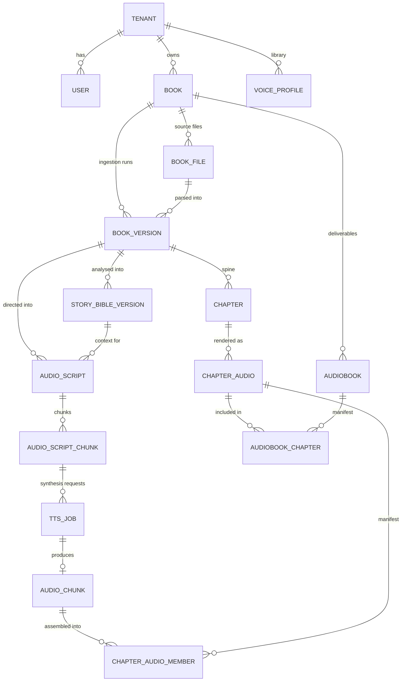
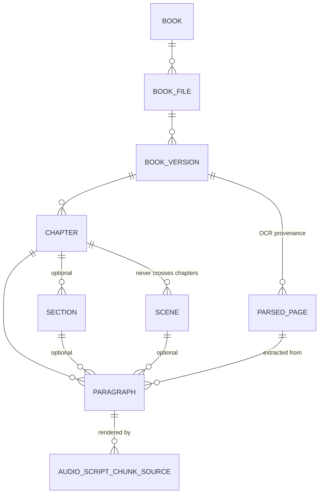
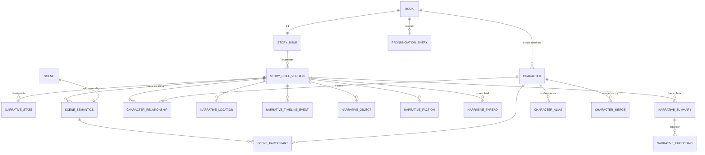
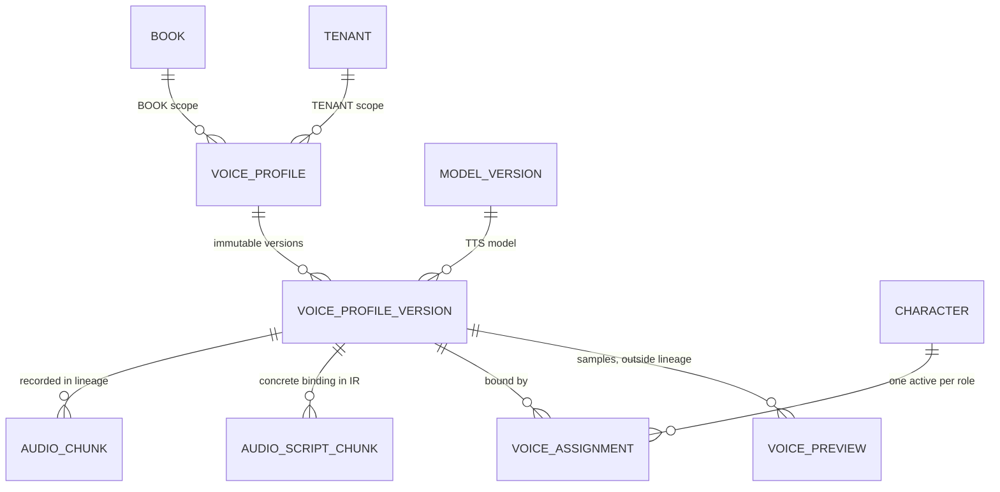
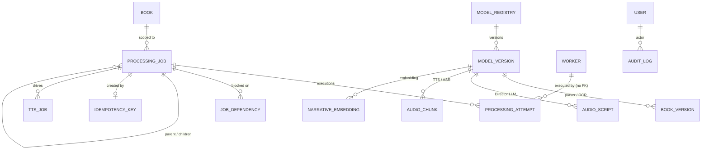
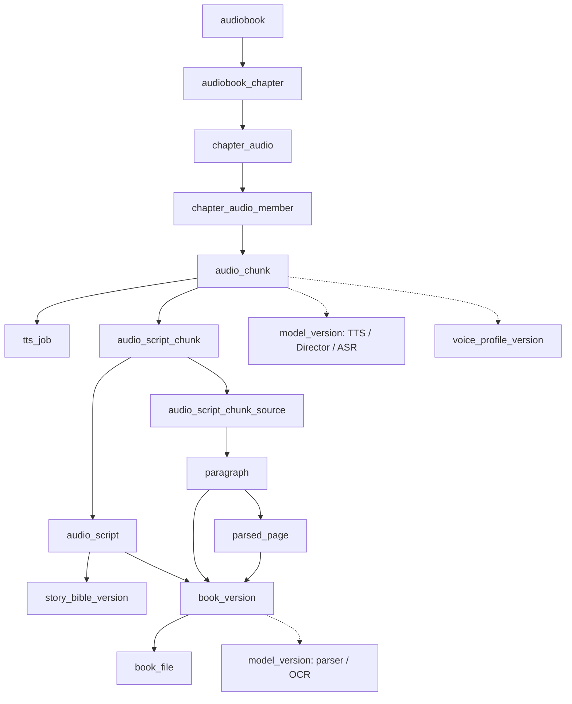

# Database Schema — Audiobook Production Platform

> **Document type:** Architecture Contract (Tier 1 — persistence contract of record)
> **Path:** `docs/architecture/database-schema.md`
> **Status:** DRAFT — pending human review
> **Schema/Doc version:** `db-schema.v1`
> **Owner:** Architecture
> **Derives from:** `context.md` (`context.v1`), reconciled against `api-specification.md` (`api-spec.v1`)
> **Supersedes:** nothing (initial document)

---

## 0. How to read this document

This document is the **single source of truth for persistence**: which entities exist as
rows, what their columns mean, how they relate, what is immutable, what is versioned, what
is indexed, what is constrained, what cascades, and what may never be stored in PostgreSQL
at all.

It stops short of implementation. It contains **no `schema.prisma`, no SQL DDL, no
migrations, no repository or service code**. It is written so that a Prisma schema and a
migration set can be derived from it mechanically, and so that a reviewer can tell whether
a derived schema is faithful.

The three modal words carry the meanings fixed by `context.md` §0:

| Word | Meaning |
| --- | --- |
| **MUST** | Non-negotiable. Violating it is an architecture breach requiring a §27 change-control task. |
| **SHOULD** | Strong default. Deviation requires a documented reason in the implementing phase's notes. |
| **MAY** | Genuinely optional within the surrounding contract. |

**Authority.** `context.md` is Tier 0 and supreme. This document is Tier 1 and is the only
authority on tables, columns, types, indexes, constraints, and migrations
(`context.md` §26.1 rule 2). Where this document and `api-specification.md` describe the
same field, the API document owns the **wire name and shape**; this document owns the
**stored representation**. Where either appears to contradict `context.md`, the
contradiction is a defect in the lower document and is reported in §43, never silently
resolved.

---

## 1. Scope, inputs, and what this document may not do

### 1.1 Inputs read in full before drafting

- `docs/architecture/context.md` — read completely. §4 (data architecture), §5 (Story
  Bible), §7 (IR), §8 (characters), §9 (voice), §12 (storage), §16 (jobs), §19 (tenancy),
  §20 (scale) are load-bearing here.
- `docs/architecture/api-specification.md` — read completely. §4.2 (entity→resource map),
  §11 (idempotency), §16 (resource field shapes), §20 (state vocabularies), §23–§24
  (conflicts and open questions) are load-bearing here.

Both are treated as authoritative. Every entity, state name, event name, job type, and
field name in this document comes from one of them, except where §43 records a documented,
justified introduction.

### 1.2 What this document may not do

Per `context.md` §4 and §30.10 it **MUST NOT**:

- introduce an entity absent from `context.md` §4.2 without recording it as a change-control
  item (§43, §44);
- rename an entity, state, or field that either upstream document names;
- define endpoints, payload shapes, queue names, event schemas, or IR field types — those
  belong to `api-specification.md`, `event-contracts.md`, and `audio-script-ir.md`;
- bake configuration (retention windows, loudness targets, timeouts, quota values, key
  lifetimes) into the schema. Configuration lives in `deployment-architecture.md`; the
  schema stores *what was configured at the time*, never the policy itself.

### 1.3 Downstream documents that depend on this one

`event-contracts.md` (job payload references), `audio-script-ir.md` (IR field types),
`api-specification.md` (already drafted ahead of this document — see §42.2 for the
back-check), and every implementation phase from Phase 1 onward.

---

## 2. Database architecture

### 2.1 Technology

`context.md` §23 row 5 selects **PostgreSQL 16+** as the primary transactional database and
row 6 selects **pgvector** for semantic retrieval, co-located in the same database. Nothing
in `context.md` specifies otherwise, so this document does not deviate.

| Store | Holds | Authority |
| --- | --- | --- |
| **PostgreSQL 16+** | Every entity in §6; job and attempt state; lineage; Story Bible structured facts; embeddings (pgvector); audit records; idempotency registry | Source of truth for all durable state |
| **Redis 7+** | BullMQ queues and job runtime, distributed locks with fencing tokens, rate-limit counters, hot Story Bible working sets, resolution caches, progress counters, SSE pub/sub, token-verification cache, **upload sessions** | Cache and transport only. Never the sole source of truth for anything durable (`context.md` §12.2) |
| **S3-compatible object storage** (MinIO in dev) | All binary and bulk-text artifacts | Source of truth for bytes; PostgreSQL holds the reference, hash, and lifecycle state |

### 2.2 What PostgreSQL is responsible for

Tenants and users; books; book files; book versions; book metadata; chapters, sections,
scenes, paragraphs; characters and aliases; Story Bible metadata, facts and snapshot state;
voice profile metadata, versions, assignments and previews; Audio Script IR metadata and
chunks; processing jobs and attempts; TTS job records; audio chunk, chapter audio and
audiobook metadata; model registry and versions; ownership and tenancy; quotas and usage;
idempotency records; and the audit log.

### 2.3 What PostgreSQL is forbidden to hold

Per `context.md` §12.1, PostgreSQL **MUST NOT** store:

- audio bytes of any kind (chunk, chapter, audiobook, preview, reference audio);
- images (covers, scanned pages);
- full parsed documents or full canonical text;
- speaker embeddings or model weights;
- model prompt templates or raw LLM responses.

For each of these, PostgreSQL stores a **storage reference row**: object key, content hash,
byte size, media facts, and lifecycle state. See §5.7 and §34.

**Bounded text exception.** Small, query-relevant text is stored inline because the system
cannot function without querying it: `paragraph.text`, `audio_script_chunk.text` and
`spoken_text`, chapter and character names, scene and chapter summaries, pronunciation
entries, and short excerpts. These are bounded per row (§5.6) and are the smallest units the
Director and the review UI must filter and join on. Chapter-level and book-level canonical
text is **not** stored inline; it lives in object storage with a hash and a preview
(`context.md` §12.1).

---

## 3. Non-negotiable design principles

These are binding on every table in this document and on every future addition to it.

### 3.1 Opaque, non-sequential identifiers

- Every entity's primary key is a **UUIDv7** stored in PostgreSQL's native `uuid` type.
- No sequential integer is ever exposed through the public API. `bigserial` is permitted
  **only** for append-only internal ordering columns that never leave the database
  (`audit_log.seq`, `processing_job.lease_fence`).
- IDs never encode meaning. Sort order by ID is not semantic, and no code may rely on it,
  even though UUIDv7 happens to be time-ordered. Time-ordering is an **index-locality
  optimisation**, not a contract.
- Client-supplied identifiers are never accepted as primary keys.

**Decision — UUIDv7 over ULID.** `context.md` §4.1 and `api-specification.md` §2.4 both
permit "UUIDv7 or ULID". This document selects UUIDv7 because PostgreSQL has a native
16-byte `uuid` type with native indexing and Prisma has first-class support (`@db.Uuid`),
whereas ULID would require `char(26)` with no type safety and 60 % more index bytes. The
API's illustrative examples render ULID-shaped strings; §2.4 explicitly permits either form,
so this is a permitted choice and not a contract change. The edge validator must accept the
canonical UUID form. Recorded as **OQ-DB-2** because it is cross-cutting and one form should
be fixed in `context.md`.

### 3.2 Explicit ownership

Every user-owned row is reachable by a single unambiguous path:

```
Tenant
  └── User            (membership)
  └── Book            (tenant_id)
        └── every book-scoped resource   (book_id + tenant_id)
  └── VoiceProfile    (tenant_id, optionally book_id when scope = BOOK)
  └── ProcessingJob   (tenant_id, usually book_id)
```

`context.md` §19.1 is categorical: *"`tenant_id` is mandatory on every user-owned row and is
part of every query predicate. Not 'usually' — every query."* This document therefore
**denormalises `tenant_id` onto every user-owned table**, including deep children, and
denormalises `book_id` onto every book-scoped table. §30 explains why this is the correct
model here rather than inheriting ownership through joins, and how the denormalisation is
kept honest by composite foreign keys.

### 3.3 Referential integrity is a database concern

Every relationship that PostgreSQL can express **MUST** be a real foreign key with an
explicit `ON DELETE` / `ON UPDATE` action (§26). Application-level validation is additive,
never a substitute.

The only permitted exceptions, each individually justified in place:

| Exception | Why | Compensating control |
| --- | --- | --- |
| `audit_log.resource_id` | Polymorphic across every entity, and must survive purge of its target | `resource_type` enum + append-only; no FK by design |
| `idempotency_key.response_body` references | Stores a rendered response, not a relation | Expiry + body hash |
| `character.evidence_paragraph_ids` and similar arrays | Evidence pointers, not structural relations | Validated on write; nullable-tolerant reads; the structural relation lives in a join table where it matters (§13.4) |

### 3.4 Explicit lifecycle states

Every long-running entity uses a **named PostgreSQL enum** whose members come verbatim from
`context.md` and `api-specification.md` §20. There are no free-text status columns anywhere
in this schema. §32 enumerates every state machine and its legal transitions; §24 enumerates
every enum type.

### 3.5 Immutable generated artifacts

Generated artifacts are append-only (`context.md` §2.5). Concretely:

- `book_file`, `processing_attempt`, `narrative_state`, `audio_chunk`, `chapter_audio`,
  `audiobook`, `model_version`, `audit_log` are **never updated after insert** except for
  the narrow, enumerated lifecycle columns listed on each entity (typically
  `status`, `superseded_at`, `superseded_by_*`, and retention columns).
- `paragraph` is immutable once scripted; `audio_script_chunk` is immutable once its
  `tts_job` enters `RUNNING`; `voice_profile_version` is immutable once locked.
- Every versioned artifact carries `version` (monotonic integer within its parent) and
  `supersedes_*_id` (self-referencing FK) plus `is_current` (boolean, guarded by a partial
  unique index).
- Object keys embed identity and version, so a key is never rewritten with different bytes.
- Deletion is a lifecycle/retention operation (§27), never a side effect of a rerun.

### 3.6 Auditability and reproducibility

The schema **MUST** be able to answer, by joins alone and without reading object storage:

> Which source text, which Book Version, which Story Bible snapshot, which Director version
> and model, which voice version, which TTS model, which parameters and seed, and which
> worker attempt produced this audio?

§19 shows the exact traversal and names the column that implements each hop. Any future
change that breaks one hop of that traversal is a Breaking change under `context.md` §27.4.

---

## 4. Naming and structural conventions

| Concern | Convention |
| --- | --- |
| Table names | `snake_case`, **singular** (`book`, `audio_script_chunk`). Prisma models are PascalCase singular with `@@map`. |
| Column names | `snake_case`. Where a column corresponds to an API field, the names are identical (`api-specification.md` §2.3 fixes `snake_case` on the wire, which removes any translation layer). |
| Primary key | `id uuid` in every table, except pure join tables which use a composite PK. |
| Foreign keys | `<referenced_table>_id`. Self-references use a role prefix (`supersedes_audio_chunk_id`, `merged_into_character_id`). |
| Enums | PostgreSQL enum types named `<domain>_<concept>` (`job_status`, `book_status`, `voice_approval_state`). Values are `SCREAMING_SNAKE_CASE`, verbatim from the upstream contract. |
| Timestamps | `timestamptz`, **UTC only**, names end in `_at`. `created_at` and `updated_at` on every table (`context.md` §4.1); `updated_at` is omitted only on strictly append-only tables where it would always equal `created_at` (`processing_attempt`, `audit_log`, `narrative_state`). |
| Durations | `integer` milliseconds, names end in `_ms`. |
| Byte sizes | `bigint`, names end in `_bytes`. |
| Booleans | Affirmative names, never negated (`is_current`, not `not_superseded`). |
| Money / cost | Never stored on user-facing rows. Cost is derived from `processing_attempt` resource usage (`context.md` §17.2) and lives in the metrics plane. |
| Soft delete | `deleted_at timestamptz NULL` on user-facing entities only (§27). |
| Optimistic concurrency | `row_version integer NOT NULL DEFAULT 0` on mutable entities (§29.3). |

### 4.1 The tenancy column contract

Every user-owned table carries:

```
tenant_id  uuid  NOT NULL   -- FK -> tenant(id)
```

Every book-scoped table additionally carries:

```
book_id    uuid  NOT NULL   -- FK -> book(id)
```

and enforces the denormalisation with a **composite foreign key** rather than trusting
application code:

```
(book_id, tenant_id) REFERENCES book (id, tenant_id)
```

This requires `book` to carry `UNIQUE (id, tenant_id)` in addition to its primary key. The
same pattern is applied one level down where a child must not drift from its parent's book
(`(chapter_id, book_id) REFERENCES chapter (id, book_id)`). The cost is one extra unique
index per parent; the benefit is that a tenant-crossing row is **impossible to insert**, not
merely discouraged. This is the structural answer to `context.md` §19.2's requirement that
isolation not depend on "a developer remembering a `WHERE` clause".

### 4.2 The versioning column contract

Every version-chained entity carries exactly this column set:

| Column | Type | Meaning |
| --- | --- | --- |
| `version` | `integer NOT NULL` | Monotonic within the parent scope, starting at 1. Never reused, never renumbered. |
| `supersedes_<entity>_id` | `uuid NULL` | Self-FK to the version this one replaces. `NULL` on version 1. |
| `superseded_by_<entity>_id` | `uuid NULL` | Self-FK to the version that replaced this one. `NULL` while current. |
| `is_current` | `boolean NOT NULL DEFAULT false` | Exactly one `true` per parent scope, enforced by a partial unique index. |
| `superseded_at` | `timestamptz NULL` | Set when `is_current` goes false. |

Rules:

1. `version` is allocated inside the same transaction that inserts the row, under a row lock
   on the parent (§29.2). Gaps are permitted (a failed insert may burn a number); duplicates
   are not.
2. `is_current` transitions are always **demote-then-promote inside one transaction**.
3. Superseding never deletes and never rewrites. `superseded_*` rows remain readable and
   remain valid lineage.

### 4.3 The content-hash column contract

| Column | Type | Meaning |
| --- | --- | --- |
| `content_hash` | `char(64)` with a `CHECK (content_hash ~ '^[0-9a-f]{64}$')` | Lowercase hex SHA-256. |
| `content_hash_algorithm` | `hash_algorithm` enum | Present **only** where the value is client-declared (`book_file`, voice reference audio, cover art) so that a future algorithm change is expressible. Internal hashes are SHA-256 by contract and do not carry the column. |

**Decision — SHA-256 everywhere.** `api-specification.md` §12.3 requires "lowercase hex,
fixed length for the configured hash algorithm" and accepts a declared `{algorithm, value}`
pair on upload. Fixing SHA-256 as the internal algorithm makes `char(64)` a safe, indexable,
fixed-width type and makes cross-entity hash comparison meaningful. Algorithm agility for
client-declared hashes is preserved by the enum column on exactly the three tables that
accept a declared hash.

### 4.4 Storage reference columns

Any row that points at object storage carries this group, and never the bytes:

| Column | Type | Meaning |
| --- | --- | --- |
| `storage_key` | `text NOT NULL` | The full object key, constructed by the server from validated identifiers only (`context.md` §18.5). **Never returned to a public client** (`api-specification.md` §14.8). |
| `storage_bucket` | `text NOT NULL` | Logical bucket name, so a bucket migration is data, not code. |
| `content_hash` | `char(64)` | §4.3. |
| `size_bytes` | `bigint` | Verified after upload. |
| `object_verified_at` | `timestamptz NULL` | Set only after the upload is verified by returned ETag/checksum. **A row whose artifact status claims the bytes exist MUST have this set** (`context.md` §21 row 15). |
| `storage_class` | `storage_class` enum | `STANDARD`, `INFREQUENT`, `ARCHIVED`, `EXPIRED` — tracks lifecycle transitions (`context.md` §12.3) so the system knows an object is cold or gone without probing storage. |

---

## 5. Type and representation decisions

### 5.1 Enumerations

Native PostgreSQL enum types, not `varchar` + `CHECK` and not a lookup table.

Rationale: the vocabularies are **closed by architecture** (`context.md` §6.3, §16.1, §4.4).
A native enum makes an out-of-vocabulary value physically impossible, gives Prisma a
first-class generated TypeScript union, and costs 4 bytes. The trade-off — adding a value
requires a migration — is a feature here: adding an emotion or a job state is an Additive
change that must be reviewed under `context.md` §27.4 anyway.

*Alternative considered and rejected:* a `vocabulary_term` reference table keyed by domain,
so that `director-specification.md` could add an emotion by data migration. Rejected because
it converts a compile-time guarantee into a runtime one, and because §6.3 already requires
that every provider adapter map the *same closed vocabulary* — a value the adapters have
never seen must not be insertable at all.

Removal or renaming of an enum member is a **Breaking** change (`context.md` §27.4) and
requires a migration plan for existing rows.

### 5.2 JSON

`jsonb`, never `json`. Every `jsonb` column in this schema is listed in §23 with its
justification, its documented shape, and whether it is indexed. A `jsonb` column that is not
in that table is a defect.

### 5.3 Arrays

PostgreSQL arrays are permitted only for **small, closed-vocabulary, non-relational** lists:
`review_flags voice_review_flag[]`, `supported_languages text[]`,
`degraded_layers context_layer[]`. Anything that is a relationship gets a join table
(§13.4, §16.5, §16.7). An array is never used where referential integrity matters.

### 5.4 Vectors

`vector(N)` from pgvector, on `narrative_embedding` only (§11.8). `N` is fixed per embedding
model and recorded on the row's `model_version_id`; rows produced by different embedding
models live in the same table with different dimensions only if the deployment pins one
model — see §11.8 for the single-model-per-index rule and the migration path.

### 5.5 Numeric ranges

| Concept | Type | Rationale |
| --- | --- | --- |
| `confidence`, `emotion_intensity`, `tension` | `real` with `CHECK (x >= 0 AND x <= 1)` | Bounded 0–1, quantised at the application edge to the step documented in `director-specification.md`. Storing the quantised value keeps hashing stable. |
| `pacing`, `pitch`, `volume` | `real` with a `CHECK` against the bounded range | Ranges are owned by `director-specification.md`; the schema stores the bound as a check constraint updated under change control. |
| LUFS, dBTP, dBFS | `real` | Audio measurements, never used for equality comparison. |
| WER, CER | `real` with `CHECK (x >= 0)` | Unbounded above. |
| Durations, offsets, counts | `integer` / `bigint` | Exact. |

`double precision` is not used: no stored quantity needs it, and `real` keeps chunk-scale
rows narrower.

### 5.6 Text length bounds

The API fixes the user-facing bounds (`api-specification.md` §12.3). The database mirrors
them as `CHECK (length(col) <= n)` rather than `varchar(n)`, because the check is
expressible, alterable without a table rewrite in PostgreSQL 12+, and does not silently pad.

| Column class | Bound |
| --- | --- |
| `title`, `display_name` (character), voice profile `name` | 512 / 200 |
| `description` | 8192 |
| `paragraph.text` | 32 768 — a paragraph beyond this is a parser defect and must be split |
| `audio_script_chunk.text`, `spoken_text` | 8192 — well above every provider's `max_input_chars` |
| Excerpts (`voice_preview.text_excerpt`) | 1024 |
| Error messages (public) | 1024 |
| `storage_key` | 1024 |

### 5.7 The PostgreSQL / object-storage boundary, per artifact

| Artifact | Bytes live in | PostgreSQL row | Reference columns |
| --- | --- | --- | --- |
| Uploaded source file | Object storage | `book_file` | §4.4 group |
| Parsed document, OCR output | Object storage | `book_version` (one key per artifact kind) | `parsed_document_storage_key`, `ocr_report_storage_key` |
| Canonical text (per chapter) | Object storage | `chapter` | `canonical_text_storage_key`, `canonical_text_content_hash` |
| Paragraph text | **PostgreSQL** (bounded) | `paragraph.text` | — |
| Story Bible long summaries | Object storage | `narrative_summary` | `body_storage_key` + inline `body_preview` |
| Embeddings (semantic index) | **PostgreSQL** (pgvector) | `narrative_embedding.embedding` | — |
| Voice reference audio | Object storage | `voice_profile_version` | `reference_audio_*` group |
| Speaker embedding (model artifact) | Object storage | `voice_profile_version` | `embedding_*` group |
| Voice preview sample | Object storage | `voice_preview` | §4.4 group |
| Generated audio chunk | Object storage | `audio_chunk` | §4.4 group |
| Chapter audio | Object storage | `chapter_audio` | §4.4 group |
| Audiobook renditions | Object storage | `audiobook_rendition` | §4.4 group |
| Cover art | Object storage | `audiobook_cover` | §4.4 group |
| Model weights | Object storage / node cache | `model_version` | `weights_storage_key`, `weights_content_hash` |
| Diagnostic bundles, stack traces | Object storage | `processing_attempt` | `diagnostic_storage_key` |

---

## 6. Entity catalogue

Legend — **Owner**: the single service permitted to write it (`context.md` §3.1 rule 1,
§4.2). **Mut.**: `M` mutable, `I` immutable from insert, `I*` immutable once used.
**Ver.**: explicitly versioned. **Src**: `C4.2` = named in `context.md` §4.2; `C§n` =
required by that section of `context.md`; `API§n` = required by that section of
`api-specification.md`; **`NEW`** = introduced by this document and reported in §43/§44.

| # | Entity (table) | Purpose | Owner | Mut. | Ver. | Src |
| --- | --- | --- | --- | --- | --- | --- |
| 1 | `tenant` | Account/organisation; the unit of isolation, quota, and billing scope | User | M | no | C§19.1, **NEW as a row** |
| 2 | `user` | Principal; profile, preferences, tenant membership | User | M | no | C4.2 #1 |
| 3 | `user_credential` | Password verifier and its rotation state | Auth | M | no | C§3.2.2, **NEW** |
| 4 | `user_identity` | External IdP linkage (OIDC-ready) | Auth | M | no | C§23 #27, **NEW** |
| 5 | `session` | Browser/device session | Auth | M | no | C§3.2.2, API§16.2 |
| 6 | `refresh_token` | Rotating refresh token family member | Auth | M | no | C§18.1, API§5.3 |
| 7 | `tenant_quota` | Configured limits per tenant | User | M | no | C§3.2.3, API§16.2 |
| 8 | `tenant_usage_counter` | Usage aggregates per period | User | M | no | C§3.2.3, API§16.2 |
| 9 | `book` | Aggregate root for one work; lifecycle state; metadata; explicit user decisions | Book | M | pipeline-versioned | C4.2 #2 |
| 10 | `book_counter` | Maintained derived counts for the book (1:1) | Book | M | no | API§16.3, **NEW (derived cache)** |
| 11 | `book_file` | One uploaded source artifact; key, hash, MIME, scan status | Ingestion | I | no | C4.2 #3 |
| 12 | `book_version` | One reproducible parse+normalise+structure run over one `book_file` | Book | I* | yes | C§3.2.4, **NEW** |
| 13 | `parsed_page` | Per-page extraction/OCR provenance and confidence | Parser | I | no | C§30.5, **NEW** |
| 14 | `chapter` | Ordered structural division of the reading spine | Book | M | via `book_version` | C4.2 #4 |
| 15 | `section` | Sub-chapter division | Book | M | via `book_version` | C4.2 #5 |
| 16 | `scene` | Narrative unit boundaries within a chapter | Book | M | via `book_version` | C4.2 #6 |
| 17 | `scene_semantics` | Scene meaning: participants, mood, POV, summary (1:1 with `scene`) | Context | M | via `story_bible_version` | C§30.2 |
| 18 | `paragraph` | Smallest canonical text unit with order and `content_hash` | Book | I* | via `book_version` | C4.2 #7 |
| 19 | `character` | Canonical identity within a book, incl. reserved sentinels | Character | M | no | C4.2 #8 |
| 20 | `character_alias` | Surface form → character, with type, scope, validity range | Character | M | no | C4.2 #9 |
| 21 | `character_merge` | Recorded merge/split command and its impact set | Character | I | no | C§8.4, API§16.11, **NEW** |
| 22 | `character_relationship` | Typed, directional, spine-scoped edge between characters | Context | M | via `story_bible_version` | C§5.2 |
| 23 | `story_bible` | Per-book knowledge container and its status (1:1 with `book`) | Context | M | snapshot-versioned | C4.2 #12 |
| 24 | `story_bible_version` | One immutable snapshot version of the Story Bible | Context | I | yes | C4.2 #12, API§16.12 |
| 25 | `narrative_state` | Immutable point-in-time state at a spine position | Context | I | yes | C4.2 #13 |
| 26 | `narrative_location` | Place, containment, atmosphere | Context | M | via `story_bible_version` | C§5.2 |
| 27 | `narrative_timeline_event` | Ordered in-story event with time markers | Context | M | via `story_bible_version` | C§5.2 |
| 28 | `narrative_object` | Plot-significant item and custody chain | Context | M | via `story_bible_version` | C§5.2 |
| 29 | `narrative_faction` | Group, allegiance, conflict | Context | M | via `story_bible_version` | C§5.2 |
| 30 | `narrative_thread` | Unresolved question, secret, foreshadowing awaiting payoff | Context | M | via `story_bible_version` | C§5.2 |
| 31 | `narrative_summary` | Hierarchical summary (paragraph→scene→chapter→part→book) | Context | I | yes | C§5.6 |
| 32 | `narrative_embedding` | pgvector index row over a summary or scene | Context | I | via `model_version` | C§5.3, C§23 #6 |
| 33 | `pronunciation_entry` | Book-scoped canonical pronunciation lexicon entry | Context | M | no | C§6.4, API§16.12 |
| 34 | `voice_profile` | Named voice concept; owns its version chain | Voice | M | via versions | C4.2 #10 |
| 35 | `voice_profile_version` | Concrete renderable voice configuration | Voice | I* | yes | C4.2 #11 |
| 36 | `voice_assignment` | `(book, character) → voice_profile_version` binding | Voice | M | history-retained | C§30.2, API§16.14 |
| 37 | `voice_preview` | One rendered preview sample of a version | Voice | I | no | C§9.2, API§16.14 |
| 38 | `audio_script` | Director run output for a scope; **is** the AudioScript version | Director | I | yes | C4.2 #14 |
| 39 | `audio_script_chunk` | One renderable performance unit | Director | I* | yes | C4.2 #15 |
| 40 | `audio_script_chunk_source` | Chunk → source paragraph span (ordered join) | Director | I | no | C§7.2, **NEW (join)** |
| 41 | `tts_job` | One synthesis request for one chunk with its full parameters | TTS | I | no | C4.2 #16 |
| 42 | `audio_chunk` | Rendered audio for one IR chunk; metadata + lineage | TTS | I | yes | C4.2 #17 |
| 43 | `chapter_audio` | Assembled chapter track | Assembly | I | yes | C4.2 #18 |
| 44 | `chapter_audio_member` | Ordered chunk manifest of a chapter track | Assembly | I | no | C§13.1, **NEW (join)** |
| 45 | `audiobook` | Final deliverable version; metadata, manifest, quality | Assembly | I | yes | C4.2 #19 |
| 46 | `audiobook_chapter` | Ordered chapter manifest with markers | Assembly | I | no | API§16.17, **NEW (join)** |
| 47 | `audiobook_rendition` | One encoded delivery artifact of an audiobook | Assembly | I | no | C§13.2, API§16.17, **NEW** |
| 48 | `audiobook_cover` | Cover image artifact reference | Assembly | I | no | C§13.4, API§16.17, **NEW** |
| 49 | `processing_job` | Logical unit of async work with the §16.1 state machine | Job | M (state) | no | C4.2 #20 |
| 50 | `processing_attempt` | One execution of a job | Job | I | no | C4.2 #21 |
| 51 | `job_dependency` | DAG edge: job blocked on job | Job | I | no | C§3.2.11, **NEW (join)** |
| 52 | `idempotency_key` | HTTP-layer idempotency registry | Job | M | no | C§16.3, API§11 |
| 53 | `model_registry` | A model identity: role + provider + model id | Platform | M | no | C4.2 #22 (split), **NEW** |
| 54 | `model_version` | An immutable version of a registered model | Platform | I | yes | C4.2 #22 |
| 55 | `worker` | Worker registration, capabilities, heartbeat, quarantine | Job | M | no | C§10.4 step 9, API§16.22, **NEW** |
| 56 | `audit_log` | Append-only record of significant actions | Platform | I | no | C§18, API§14.12, **NEW** |

**Deliberately absent entities**, each because an upstream contract says so:

| Not created | Why |
| --- | --- |
| `ReviewItem` | `api-specification.md` OQ-3 fixes v1 as flags + counters only. Review lives in `audio_script_chunk.review_flags`, `book_counter.needs_review_count`, and `NEEDS_REVIEW` states. |
| `ValidationReport` | OQ-11 fixes it as a field group on the artifact: `audio_chunk.validation` and `chapter_audio.validation` (`jsonb`, §23). |
| `DirectorRun` | OQ-10 fixes it as `audio_script` + `processing_job` history. |
| `UploadSession` | `context.md` §3.2.5 places it in Redis with a TTL. The durable record is `book_file`. See §43 conflict D-6 for the audit consequence. |
| `Project` / `Workspace` | `context.md` §19.1 makes it optional and v1 single-implicit; `api-specification.md` §6.2 defers it (OQ-4). §39 shows the additive path. |
| `TTSGeneration` | The task brief's name for `TTSJob`. `context.md` §4.2 #16 names it `TTSJob`; names are contracts (§26.1 rule 5). Recorded as conflict **D-1**. |
| `AudioScriptVersion`, `AudiobookVersion`, `BookVersion`-as-parent-of-`Book` | The API models these as version *rows of the same table* with `version` + `supersedes_*`. Splitting them would contradict `api-specification.md` §16.13/§16.17. Recorded as **D-2**. (`book_version` is different — see §8.3.) |

---

## 7. Identity, tenancy, and access

### 7.1 `tenant`

- **Purpose:** the isolation unit. Every user-owned row in the system points at exactly one.
- **Owner:** User Service. **Lifecycle:** `ACTIVE → SUSPENDED → CLOSED` (`tenant_status`).
- **Columns:** `id`, `name`, `status`, `plan_code`, `created_at`, `updated_at`,
  `deleted_at`.
- **Immutable:** `id`. **Mutable:** `name`, `status`, `plan_code`.
- **Indexes:** PK; `UNIQUE (id)` implicit; `INDEX (status) WHERE deleted_at IS NULL` for the
  admin tenant list (`api-specification.md` §16.22).
- **Deletion:** soft delete only. Hard deletion of a tenant is an operator runbook that runs
  the same ordered purge as §27.4, per tenant.
- **Note:** `context.md` §4.2 lists no `Tenant` entity, yet §19.1 makes `tenant_id`
  mandatory on every row and `api-specification.md` returns `tenant_id` on `user`, `book`,
  `voice_profile`, and `job`. A foreign key needs a referent. Recorded as **D-3**.

### 7.2 `user`

- **Purpose:** the principal. Profile, preferences, roles, tenant membership.
- **Owner:** User Service. **Lifecycle:** `user_status`:
  `PENDING_VERIFICATION | ACTIVE | SUSPENDED | CLOSED`.
- **Columns:** `id`, `tenant_id`, `email` (citext), `email_verified_at`, `display_name`,
  `status`, `roles principal_role[]`, `preferences jsonb`, `locale`, `last_login_at`,
  `row_version`, `created_at`, `updated_at`, `deleted_at`.
- **Immutable:** `id`, `tenant_id` (v1: a user belongs to exactly one tenant; §39 shows the
  membership-table path to multi-tenant users).
- **Mutable:** `display_name`, `preferences`, `locale`, `status`, `roles`,
  `email_verified_at`.
- **Not stored here:** password hashes, refresh tokens, MFA secrets, or any provider
  internals. Those live in `user_credential`, `refresh_token`, and `user_identity`
  respectively — `context.md` §3.2.3 states the User Service holds "no credentials".
- **Indexes:** PK; `UNIQUE (email)` global (registration is global-unique per
  `api-specification.md` §16.1); `INDEX (tenant_id) WHERE deleted_at IS NULL`.
- **Deletion:** soft delete. Hard deletion requires the tenant purge runbook, because
  `audit_log.actor_user_id` and `voice_profile_version.created_by_user_id` must remain
  resolvable — those FKs are `ON DELETE RESTRICT`.
- **Enum note:** `principal_role` = `TENANT_OWNER | TENANT_MEMBER | PLATFORM_ADMIN |
  SERVICE | WORKER`, taken verbatim from `api-specification.md` §6.2, which marks the set
  **provisional pending §27 confirmation**. Recorded as **OQ-DB-6**.

### 7.3 `user_credential`, `user_identity`

Two tables, because `context.md` §5 of the commissioning scope and §23 row 27 require the
core `User` not to absorb authentication-provider internals.

**`user_credential`** — `id`, `user_id`, `password_hash` (Argon2id verifier string),
`password_algorithm`, `password_updated_at`, `mfa_enrolled`, `mfa_secret_ref` (a secrets
manager reference, **never the secret**), `failed_attempt_count`, `locked_until`,
`created_at`, `updated_at`. One row per user. `ON DELETE CASCADE` from `user`.

**`user_identity`** — `id`, `user_id`, `provider` (`provider_kind` enum: `LOCAL | OIDC`),
`issuer`, `subject`, `email_at_provider`, `linked_at`, `last_authenticated_at`.
`UNIQUE (provider, issuer, subject)`. Present in v1 with a single `LOCAL` row per user so
that OIDC (`context.md` §23 row 27, "OIDC-ready") is an additive change: adding a provider
adds rows, never columns to `user`.

**Security:** neither table's secret-bearing columns are readable by the application's
ordinary role. See §37.3.

### 7.4 `session`, `refresh_token`

**`session`** — `id`, `user_id`, `tenant_id`, `created_at`, `last_seen_at`, `expires_at`,
`revoked_at`, `revocation_reason`, `user_agent_family`, `ip_country`. Exposed at
`GET /users/me/sessions` (`api-specification.md` §16.2) with exactly these fields — no raw
IP, no full user agent.

**`refresh_token`** — `id`, `session_id`, `user_id`, `family_id`, `token_hash char(64)`,
`issued_at`, `expires_at`, `rotated_at`, `rotated_to_id`, `revoked_at`, `reuse_detected_at`.
The token itself is **never stored**; only its SHA-256. `family_id` implements
`api-specification.md` §5.3: presenting an already-rotated token revokes the whole family.

- **Index:** `UNIQUE (token_hash)`; `INDEX (family_id)`; `INDEX (expires_at)` for the
  retention sweep.
- **Retention:** revoked/expired rows are deleted by a `cleanup_artifacts` maintenance job
  after a configured window; the security-relevant fact (reuse detected) is preserved in
  `audit_log`, not in the token row.

### 7.5 `tenant_quota`, `tenant_usage_counter`

**`tenant_quota`** — `tenant_id` (PK), `concurrent_books_limit`, `gpu_minutes_monthly_limit`,
`storage_bytes_limit`, `books_total_limit`, `updated_by_user_id`, `updated_at`. Adjusted only
through `PATCH /admin/tenants/{id}/quotas`, and every change is audited.

**`tenant_usage_counter`** — `id`, `tenant_id`, `period_start`, `period_end`, `metric`
(`usage_metric` enum: `CONCURRENT_BOOKS | GPU_MINUTES | STORAGE_BYTES | BOOKS_TOTAL |
LLM_TOKENS`), `used_value bigint`, `updated_at`.
`UNIQUE (tenant_id, period_start, metric)`.

- **Consistency:** usage counters are **eventually consistent** (§31.2) and are permitted to
  lag; `api-specification.md` §16.2 already contracts a `degraded: true` response with
  `null` values. Quota *enforcement* on expensive work reads them inside the job-creation
  transaction and fails closed (§31.1).
- **Concurrency:** increments use `UPDATE ... SET used_value = used_value + n` (no
  read-modify-write in application memory), so concurrent workers cannot lose an increment.

---

## 8. Book, source files, and book versioning

### 8.1 `book`

- **Purpose:** the aggregate root for one work — a **logical book/project**, not a file.
- **Owner:** Book Service. **Lifecycle:** `book_status`, §32.1.
- **Columns:**

| Group | Columns |
| --- | --- |
| Identity | `id`, `tenant_id` |
| Metadata | `title`, `author`, `language` (BCP-47), `description`, `series`, `series_index`, `publication_year`, `publisher` |
| Lifecycle | `status book_status`, `status_changed_at`, `needs_review` (bool), `pipeline_version` |
| Current pointers | `current_book_version_id`, `current_audio_script_id`, `current_audiobook_id` |
| Explicit user decisions (`api-specification.md` §16.6.7, §16.13, §16.14) | `auto_ingest`, `narrator_fallback_accepted`, `narrator_fallback_applies_to`, `narrator_fallback_max_line_count`, `narrator_fallback_accepted_by_user_id`, `narrator_fallback_accepted_at`, `director_version_mixing_acknowledged_by_user_id`, `director_version_mixing_acknowledged_at`, `partial_ocr_acknowledged_at` |
| Concurrency & audit | `row_version`, `created_by_user_id`, `created_at`, `updated_at`, `deleted_at` |

- **Immutable:** `id`, `tenant_id`, `created_by_user_id`, `created_at`.
- **Mutable:** metadata fields; `status` only through the state machine (§32.1) and never
  through the public `PATCH` (`api-specification.md` §16.5); `language` is refused after
  canonical text exists — enforced by a service-level precondition, not a DB constraint,
  because it depends on the existence of a related row.
- **Explicit-decision columns are the schema's answer to "recorded as an explicit decision on
  the book, with principal and timestamp, and audited"**: the value, the principal, and the
  timestamp are columns; the audit trail is an `audit_log` row. Neither alone is sufficient.
- **Indexes:**
  - `UNIQUE (id, tenant_id)` — the anchor for every composite tenancy FK (§4.1).
  - `INDEX (tenant_id, created_at DESC) WHERE deleted_at IS NULL` — serves the default
    `GET /books?sort=created_at:desc` exactly.
  - `INDEX (tenant_id, status) WHERE deleted_at IS NULL` — the `status` filter.
  - `INDEX (tenant_id, language) WHERE deleted_at IS NULL` — the `language` filter.
  - `INDEX (tenant_id, lower(title)) WHERE deleted_at IS NULL` — `sort=title`.
  - `INDEX (deleted_at) WHERE deleted_at IS NOT NULL` — the retention sweep and
    `include_deleted=true`.
- **Deletion:** soft delete (`deleted_at`); no `ARCHIVED` state exists (`api-specification.md`
  C-3). Hard deletion is the ordered purge of §27.4.

### 8.2 `book_file`

- **Purpose:** one uploaded source artifact. **Immutable**: a new upload is a new row, never
  an edit (`context.md` §4.2 #3).
- **Owner:** Ingestion Service.
- **Columns:** `id`, `tenant_id`, `book_id`, `source_kind` (`PDF | EPUB | IMAGE_SET`),
  `original_file_name` (metadata only — **never** used to build a key), `mime_type`,
  `sniffed_mime_type`, `size_bytes`, `content_hash`, `content_hash_algorithm`,
  `status book_file_status` (`ADMITTED | REJECTED | QUARANTINED`), `rejection_reason_code`,
  `page_count`, `validation jsonb` (§23), `upload_session_id` (opaque Redis session id,
  retained for correlation, **no FK**), the §4.4 storage group, `created_at`.
- **Immutable after insert:** everything except `status`, `rejection_reason_code`,
  `validation`, `object_verified_at`, `storage_class` — the columns the asynchronous
  validation chain and the retention sweep must still write. Those are the only permitted
  updates and are enforced by a trigger-free convention plus the restricted write role
  (§37.3).
- **Indexes:**
  - `INDEX (book_id, created_at DESC)` — the file list.
  - `UNIQUE (tenant_id, content_hash) WHERE status = 'ADMITTED'` — **within-tenant
    deduplication** (`context.md` §19.2). Cross-tenant comparison is impossible because the
    index is tenant-prefixed; two tenants uploading the same book cannot collide and no
    signal leaks. This is the physical implementation of "dedupe within a tenant is
    permitted; across tenants it is forbidden."
  - `INDEX (status) WHERE status IN ('REJECTED','QUARANTINED')` — the quarantine sweep.
- **Duplicate-with-consent path:** `api-specification.md` §16.6.7 allows a second `book_file`
  in a different book that **references the same stored object**. The unique index above
  would refuse it, so the second row carries `deduplicated_from_book_file_id uuid NULL` and
  is excluded from the unique index by `WHERE deduplicated_from_book_file_id IS NULL`. Bytes
  are stored once per tenant; the reference count is the number of rows pointing at the key,
  and the purge job (§27.4) deletes the object only when the last one goes.
- **Deletion:** never individually. Removed only by book purge or retention policy
  (`api-specification.md` §16.6.9).

### 8.3 `book_version`

> **This entity is introduced by this document.** `context.md` §4.2 names no `BookVersion`.
> It is introduced because §3.2.4 requires that "conflicting structure versions are stored
> side-by-side, never merged", idempotent per `(book_id, pipeline_version, content_hash)`,
> and because `api-specification.md` returns a `structure_version` on `chapter`, `section`,
> `scene`, and `paragraph` and accepts it as a query filter. Storing structural rows side by
> side requires an addressable row that identifies *which run produced them*. A bare string
> label cannot do this: re-running the same parser version over a corrected source file would
> produce two sets of rows with the same label. Recorded as **D-4** and **OQ-DB-1**.

- **Purpose:** one reproducible ingestion run: a specific `book_file` parsed with a specific
  parser/OCR/normaliser configuration, producing a specific canonical text and a specific
  structural spine. It is the **reproducibility anchor** of the whole pipeline.
- **Owner:** Book Service (rows), written from Parser Service results via the documented
  ingest contract.
- **Lifecycle:** `book_version_status`:
  `CREATED → PARSING → PARSED → NORMALIZED → STRUCTURED → READY`, with `FAILED`,
  `PARTIAL_OCR`, `NEEDS_REVIEW`, `SUPERSEDED`. These are stage-local and map deterministically
  onto `Book.status` (§32.1) and the API's `ingestion` stage vocabulary
  (`api-specification.md` §20.5).
- **Columns:**

| Group | Columns |
| --- | --- |
| Identity | `id`, `tenant_id`, `book_id`, `book_file_id` |
| Version | `version` (monotonic per book), `structure_version_label` (the string the API returns, e.g. `structure.v1`), `supersedes_book_version_id`, `superseded_by_book_version_id`, `is_current`, `superseded_at` |
| Content identity | `content_hash` (canonical text of the whole book), `raw_text_content_hash`, `pipeline_version` |
| Processing provenance | `parser_strategy_used`, `parser_model_version_id`, `ocr_model_version_id`, `normalizer_model_version_id`, `parser_options jsonb` (`ocr_language_hints`, `force_ocr`) |
| Artifacts | `parsed_document_storage_key`, `ocr_report_storage_key`, `canonical_text_manifest_storage_key`, plus their hashes and `object_verified_at` |
| Quality | `status`, `text_qc_outcome` (`PASS | WARN | NEEDS_REVIEW`), `text_qc jsonb` (§23), `pages_total`, `pages_ok`, `pages_needs_review`, `degraded` |
| Timing | `started_at`, `completed_at`, `created_at` |

- **Immutable:** identity, version, content hashes, provenance, artifacts — everything except
  `status`, `text_qc*`, page counters, `completed_at`, `is_current`, `superseded_*`.
- **Indexes:**
  - `UNIQUE (book_id, version)`.
  - `UNIQUE (book_id) WHERE is_current` — exactly one current version per book.
  - `UNIQUE (book_id, pipeline_version, content_hash) WHERE superseded_at IS NULL` —
    the structural-ingest idempotency of `context.md` §3.2.4, expressed as a constraint
    rather than as application logic.
  - `INDEX (book_file_id)`.
  - `UNIQUE (id, book_id)` — anchor for child composite FKs.
- **Deletion:** `ON DELETE RESTRICT` from `book`. Removed only by purge, and only after every
  downstream artifact that references it is removed (§26.2).
- **Consequence for every downstream artifact:** `chapter`, `section`, `scene`, `paragraph`
  carry `book_version_id NOT NULL`. `audio_script` carries `book_version_id NOT NULL`.
  `story_bible_version` carries `book_version_id NOT NULL`. This is what makes the lineage
  traversal of §19 terminate at a specific source file.

### 8.4 `parsed_page`

> Introduced by this document. `context.md` §30.5 explicitly records "per-block OCR
> confidence, persisted — QC (§14.1) depends on it" as a *missing persistence* item closed
> during architecture review, but §4.2 gives it no entity. `api-specification.md` §16.7
> serves `include=pages` with a per-page confidence report. Recorded as **D-5**.

- **Purpose:** per-page extraction provenance for a `book_version`. It is what makes
  per-page retry (`context.md` §21 row 3), OCR provenance (§10 of this document's brief),
  and the text-QC page report possible.
- **Owner:** Parser Service.
- **Columns:** `id`, `tenant_id`, `book_id`, `book_version_id`, `page_number`,
  `extraction_method` (`extraction_method` enum: `DIGITAL_TEXT | OCR | EPUB_SPINE |
  IMAGE_OCR`), `ocr_model_version_id`, `confidence real`, `char_count`,
  `status` (`OK | NEEDS_REVIEW | FAILED`), `failure_reason_code`, `block_confidence jsonb`
  (per-block array, §23), `retry_count`, `created_at`, `updated_at`.
- **Indexes:** `UNIQUE (book_version_id, page_number)`;
  `INDEX (book_version_id, status) WHERE status <> 'OK'` — the review report reads only
  the exceptions, which is what keeps a 400-page report cheap.
- **Scale:** one row per page. A 400-page book yields 400 rows; a tenant with 1 000 books
  yields 400 000. This is not a chunk-scale table and needs no partitioning.
- **Deletion:** `ON DELETE CASCADE` from `book_version` — page provenance has no meaning
  without its run and is cheap to regenerate.

---

## 9. Document structure and source provenance

### 9.1 The hierarchy and its optionality

```
book
 └── book_version                  (1:N, exactly one current)
       └── chapter                 (1:N, ordered, REQUIRED)
             └── section           (0:N, ordered, OPTIONAL)
             └── scene             (0:N, ordered, OPTIONAL)
                   └── (semantics) (0:1, owned by Context)
             └── paragraph         (1:N, ordered, REQUIRED)
```

**Optionality is deliberate and is enforced by nullability, not by convention**
(brief §9: "do not force every document to have all levels if the parser cannot reliably
detect them"):

| Relationship | Nullability | Reason |
| --- | --- | --- |
| `chapter.book_version_id` | `NOT NULL` | A structural run always produces at least one chapter; a book with zero chapters is a QC failure (`context.md` §14.1), not a valid state. |
| `paragraph.chapter_id` | `NOT NULL` | Every canonical paragraph belongs to exactly one chapter. |
| `paragraph.section_id` | `NULL` | Many books have no sub-chapter sections. |
| `paragraph.scene_id` | `NULL` | Scenes come from narrative analysis, which runs *after* structure. A paragraph is scene-less until analysis assigns it, and stays scene-less if analysis cannot segment confidently. |
| `section.chapter_id` | `NOT NULL` | A section without a chapter is meaningless. |
| `scene.chapter_id` | `NOT NULL` | `context.md` §4.3: a scene never crosses a chapter boundary in v1. This is a **CHECK-able invariant**, enforced by the composite FK `(chapter_id, book_version_id)` plus the range constraint in §9.3. |
| `scene.section_id` | `NULL` | §4.3: a scene *may* cross a section boundary, so it cannot be a child of one. |

### 9.2 Ordering

Every structural entity carries `order_index integer NOT NULL` and a monotonic
`spine_position integer NOT NULL`:

- `order_index` is **local**: position among siblings under the same parent. It is what the
  API sorts on and what a chapter reorder renumbers (`api-specification.md` §16.8).
- `spine_position` is **global within a `book_version`**: a single monotonically increasing
  integer across the whole reading spine, allocated at structural analysis. It is what
  `character_alias.valid_from_spine`, `narrative_state.spine_position`, and every
  "at this point in the book" query use. Without it, "is this alias valid here?" would be a
  recursive chapter/section/paragraph comparison on every resolution call.

Rules:

1. `UNIQUE (book_version_id, parent_id, order_index)` on each level — **deferrable**, so a
   reorder can renumber inside one transaction without tripping the constraint mid-update.
2. `UNIQUE (book_version_id, spine_position)` on `paragraph`. Scenes, sections and chapters
   carry `spine_start`/`spine_end` derived from their paragraphs.
3. `spine_position` values are allocated with gaps (step 1 in v1; the schema does not depend
   on contiguity) so that a future insert-without-renumber is possible.
4. Reordering is transactional and confined to one `book_version` (§28.6).

### 9.3 `chapter`, `section`, `scene`, `paragraph`

**`chapter`** — `id`, `tenant_id`, `book_id`, `book_version_id`, `order_index`,
`spine_start`, `spine_end`, `title`, `matter_type` (`FRONT_MATTER | BODY | BACK_MATTER`),
`canonical_text_storage_key`, `canonical_text_content_hash`, `char_count`,
`text_qc_outcome`, `row_version`, `created_at`, `updated_at`.

- **Mutable:** `title`, `matter_type`, `order_index` — and only while the chapter's
  paragraphs are unscripted (`api-specification.md` §16.8 state gate). The gate is a service
  precondition; the database backs it with `paragraph.scripted_at` (§9.4).
- **Indexes:** `UNIQUE (book_version_id, order_index)` deferrable;
  `UNIQUE (id, book_id)`; `INDEX (book_version_id, matter_type)`.

**`section`** — `id`, `tenant_id`, `book_id`, `book_version_id`, `chapter_id`, `order_index`,
`spine_start`, `spine_end`, `title`, `created_at`, `updated_at`. Read-only in v1
(`api-specification.md` §16.8).

**`scene`** — `id`, `tenant_id`, `book_id`, `book_version_id`, `chapter_id`,
`section_id NULL`, `order_index`, `start_paragraph_id`, `end_paragraph_id`,
`paragraph_count`, `spine_start`, `spine_end`, `created_at`, `updated_at`.

- Ownership split is physical: **this table is the Book Service's**, and it carries
  boundaries only. Meaning lives in `scene_semantics` (§11.4), owned by the Context Service.
  `context.md` §30.2's "one writer per field group" becomes "one writer per table".
- `CHECK (spine_start <= spine_end)`; the never-cross-a-chapter rule is enforced by
  `(start_paragraph_id, chapter_id)` and `(end_paragraph_id, chapter_id)` composite FKs into
  `paragraph (id, chapter_id)`.

**`paragraph`** — `id`, `tenant_id`, `book_id`, `book_version_id`, `chapter_id`,
`section_id NULL`, `scene_id NULL`, `order_index`, `spine_position`, `text`,
`content_hash`, `char_count`, `scripted_at timestamptz NULL`, plus the provenance group
below. **Immutable once scripted** (`context.md` §4.5).

- `scripted_at` is set when the first `audio_script_chunk` references the paragraph. Once
  set, the row is frozen: correcting text means re-running ingestion, producing a new
  `book_version`, never an in-place edit (`api-specification.md` §16.8).
- **Indexes:**
  - `UNIQUE (book_version_id, spine_position)`.
  - `INDEX (chapter_id, order_index)` — the paragraph list, which the API requires be
    chapter-scoped and never whole-book.
  - `INDEX (scene_id) WHERE scene_id IS NOT NULL` — scene participant and Director queries.
  - `INDEX (book_version_id, content_hash)` — duplicate-block detection for text QC
    (`context.md` §14.1 "duplicated blocks"), and chunk↔source hash verification.
  - `UNIQUE (id, chapter_id)`, `UNIQUE (id, book_id)` — composite-FK anchors.
- **Scale:** the largest structural table. ~8 000 rows for a 400-page book. See §33.

### 9.4 Source provenance columns (brief §10)

Every `paragraph` carries the provenance needed to answer *"which source content produced
this Audio Script chunk?"*:

| Column | Meaning |
| --- | --- |
| `book_version_id` | → `book_file_id`, parser/OCR/normaliser `model_version_id`s, `pipeline_version` |
| `source_page_number NULL` | The page it came from, where the format has pages. `NULL` for EPUB, which has a spine, not pages. |
| `source_page_end_number NULL` | Set when a paragraph spans a page break (common after de-hyphenation). |
| `source_locator jsonb` | Format-specific location: PDF `{page, block_index, bbox}`, EPUB `{spine_index, xpath, char_offset}`, image `{image_index, region}`. Documented shape per `source_kind`, §23. |
| `raw_text_content_hash` | Hash of the text **before** normalisation, so a normalisation change is detectable. |
| `content_hash` | Hash of the canonical (normalised) text — the value the IR chunk's `source_content_hash` is verified against. |
| `extraction_method` | `DIGITAL_TEXT | OCR | EPUB_SPINE | IMAGE_OCR` |
| `extraction_confidence real NULL` | Present for OCR-derived text; `NULL` for digital text. |
| `parsed_page_id NULL` | FK to the page row carrying block-level OCR confidence. |

**The provenance chain, end to end:**

```
audio_script_chunk
  → audio_script_chunk_source (ordered, with char offsets)
    → paragraph  (content_hash, source_page_number, source_locator, extraction_method)
      → parsed_page (block confidence, ocr_model_version_id)
      → book_version (parser/normaliser model versions, pipeline_version)
        → book_file (original file, its hash, its object key)
```

Every hop is a real foreign key. No hop is an application-side lookup.

---

## 10. Character registry

### 10.1 `character`

- **Purpose:** the stable identity within one book. **Names are not identities**
  (`context.md` §8.1): the row is the identity, aliases are evidence.
- **Owner:** Character Service. Nothing else writes it — in particular the Voice Service
  never writes voice data here (`context.md` §30.2).
- **Scope:** book-scoped, **not** book-version-scoped. A character survives re-ingestion:
  `character.book_id` is the parent, not `book_version_id`. Appearance pointers are
  version-qualified instead (below). This is a deliberate decision — a user who confirms a
  cast should not lose it because a page was re-scanned. Recorded as **OQ-DB-4** because
  `context.md` is silent on whether re-ingestion invalidates the cast.
- **Columns:**

| Group | Columns |
| --- | --- |
| Identity | `id`, `tenant_id`, `book_id`, `display_name`, `status character_status` (`CONFIRMED | PROVISIONAL | MERGED_INTO | RETIRED`) |
| Sentinels | `is_sentinel`, `sentinel_kind character_sentinel NULL` (`NARRATOR | UNKNOWN_SPEAKER | MULTIPLE_SPEAKERS | SYSTEM`) |
| Ranking | `importance_rank`, `line_count`, `speaking`, `narrator_capable` |
| Traits | `pronoun_sets jsonb` (array of `{pronouns, valid_from_spine, valid_to_spine}`), `speech_traits jsonb` (§23) |
| Appearance | `first_appearance_book_version_id`, `first_appearance_chapter_id`, `first_appearance_paragraph_id`, and the `last_appearance_*` triple |
| Detection provenance | `detection_source` (`NARRATIVE_UNDERSTANDING | DIRECTOR | USER`), `detected_by_model_version_id`, `detection_confidence`, `evidence_paragraph_ids uuid[]` |
| Merge | `merged_into_character_id NULL` |
| Concurrency | `row_version`, `created_at`, `updated_at` |

- **Reserved sentinels** are created for every book in the same transaction as the book
  (§28.1). They are non-renameable, non-mergeable, non-deletable — enforced by a `CHECK`
  that `is_sentinel = (sentinel_kind IS NOT NULL)` plus a service rule returning
  `409 SENTINEL_CHARACTER_IMMUTABLE`.
- **Indexes:**
  - `UNIQUE (book_id, sentinel_kind) WHERE sentinel_kind IS NOT NULL` — exactly one of each
    sentinel per book.
  - `INDEX (book_id, importance_rank)` — the default cast-list sort.
  - `INDEX (book_id, line_count DESC)`, `INDEX (book_id, lower(display_name))` — the other
    two allowlisted sorts (`api-specification.md` §16.11).
  - `INDEX (book_id, status) WHERE status <> 'CONFIRMED'` — the cast-review queue.
  - `INDEX (book_id) WHERE speaking AND status <> 'MERGED_INTO'` — the casting-gate query
    (§30.4).
  - `UNIQUE (id, book_id)` — composite-FK anchor.
- **Deletion:** none. A merged identity is **retained** with `status = MERGED_INTO`
  (`context.md` §8.4). `ON DELETE RESTRICT` from everything that references it.

### 10.2 `character_alias`

- **Columns:** `id`, `tenant_id`, `book_id`, `character_id`, `surface_form`,
  `surface_form_normalized` (case-folded, accent-folded — the column the resolver matches
  on), `alias_type character_alias_type` (`GIVEN_NAME | FULL_NAME | SURNAME | NICKNAME |
  TITLE | EPITHET | DESCRIPTOR | RELATIONAL`), `scope_kind alias_scope`
  (`GLOBAL | CHAPTER | SPEAKER`), `scope_chapter_id NULL`, `scope_speaker_character_id NULL`,
  `valid_from_spine NULL`, `valid_to_spine NULL`, `source` (`EXTRACTED | USER`),
  `detected_by_model_version_id NULL`, `confidence NULL`, `created_at`, `updated_at`.
- **Constraints:**
  - `CHECK (valid_from_spine IS NULL OR valid_to_spine IS NULL OR valid_from_spine <= valid_to_spine)`.
  - `CHECK` that `scope_chapter_id` is non-null iff `scope_kind = 'CHAPTER'`, and
    `scope_speaker_character_id` is non-null iff `scope_kind = 'SPEAKER'`.
  - **Ambiguity refusal** (`api-specification.md` `ALIAS_CONFLICT`): the same surface form,
    same scope, and **overlapping validity range** must not resolve to two characters. This
    is a range-overlap condition, so it is enforced by a PostgreSQL **exclusion constraint**
    over `(book_id WITH =, surface_form_normalized WITH =, scope_key WITH =,
    int4range(valid_from_spine, valid_to_spine) WITH &&)` — with `scope_key` a generated
    column combining `scope_kind` with its scope id. A plain unique index cannot express
    range overlap; this is the one place the schema uses `btree_gist`.
- **Indexes:**
  - The exclusion constraint above (which is also the resolution lookup index).
  - `INDEX (character_id)` — "all aliases of this character", used by merge.
  - `INDEX (book_id, surface_form_normalized)` — the hot resolution path (cached in Redis,
    but the cache must be rebuildable from this index).
- **Deletion:** `ON DELETE CASCADE` from `character` — but `character` is never deleted, so
  in practice aliases are only removed by explicit user action or by book purge.

### 10.3 `character_merge`

- **Purpose:** the auditable, reversible record of a merge or split (`context.md` §8.4,
  `api-specification.md` §16.11 `GET /character-merges`).
- **Columns:** `id`, `tenant_id`, `book_id`, `operation` (`MERGE | SPLIT`),
  `losing_character_id`, `winning_character_id`, `voice_conflict_resolution jsonb NULL`,
  `rebind_scope`, `aliases_moved_count`, `draft_chunks_rebound_count`,
  `generated_chunks_reversioned_count`, `chapters_affected uuid[]`, `job_id`,
  `performed_by_user_id`, `reversed_at NULL`, `reversed_by_merge_id NULL`, `created_at`.
- **Immutable** except `reversed_at` / `reversed_by_merge_id`.
- **Indexes:** `INDEX (book_id, created_at DESC)`; `INDEX (losing_character_id)`.
- **Why a row and not just an audit entry:** the impact set must be queryable to reverse the
  merge at the record level, and the API lists merges as a first-class history. An
  `audit_log` row is append-only free-form metadata and cannot carry a foreign key to both
  characters.

### 10.4 `character_relationship`

- **Purpose:** typed, directional, spine-scoped edges (`Alice →sister_of→ Bob`).
- **Owner:** **Context Service**, not Character Service. `context.md` §5.2 lists
  relationships as Story Bible content and §30.2 fixes the boundary: Character owns identity;
  Story Bible owns narrative facts and references identity by ID.
- **Columns:** `id`, `tenant_id`, `book_id`, `story_bible_version_id`,
  `source_character_id`, `target_character_id`, `relationship_type relationship_type`,
  `label` (free text for the rendered form), `directional bool`, `confidence`,
  `valid_from_spine NULL`, `valid_to_spine NULL`, `evidence_paragraph_ids uuid[]`,
  `evidence_scene_id NULL`, `extracted_by_model_version_id`, `created_at`, `updated_at`.
- **`relationship_type`** is a closed enum. `context.md` §5.2 delegates the exact member list
  to `director-specification.md`, which fixes it at §4.4 as an eleven-member set:
  `FAMILY | ROMANTIC | FRIENDSHIP | RIVALRY | ADVERSARIAL | MENTOR | PROFESSIONAL |
  AUTHORITY | ALLIANCE | BETRAYAL | UNKNOWN`. **Synchronized here verbatim**
  (`architecture-review.md` §3, required-action row on this table) — this document previously
  carried an illustrative placeholder list that predated `director-specification.md` and was
  never updated to match it; that placeholder is retired. `UNKNOWN` is never omitted in favor
  of guessing (a relationship known to exist but not confidently classified is still recorded,
  with `relationship_type = UNKNOWN`); `BETRAYAL` is directional and time-scoped, superseding
  rather than overwriting an earlier edge between the same two characters.
- **Constraints:** `CHECK (source_character_id <> target_character_id)`;
  `UNIQUE (story_bible_version_id, source_character_id, target_character_id,
  relationship_type, valid_from_spine)`.
- **Indexes:** `INDEX (book_id, source_character_id)`,
  `INDEX (book_id, target_character_id)` — both directions are queried when assembling the
  L2 character context layer.
- **Deliberate non-goal:** this is a **flat, versioned edge list with validity ranges**, not
  a temporal knowledge graph. `context.md` does not ask for one, and the brief explicitly
  says not to over-engineer. The path to more is additive: `valid_from_spine`/`valid_to_spine`
  already give interval semantics, and `story_bible_version_id` already gives snapshot
  history. Adding an edge-property table later is Additive under §27.4.

---

## 11. Story Bible

### 11.1 The relational / JSONB split (brief §13)

`context.md` §5.3 requires structured facts in PostgreSQL "relational + JSONB for typed
attribute bags — queryable, joinable, auditable". This document makes the split explicit:

| Goes in a **relational column or table** | Goes in **JSONB** | Goes in **object storage** |
| --- | --- | --- |
| Every identifier and foreign key | Model-generated typed attribute bags (`speech_traits`, `atmosphere`, `attributes`) | Long-form summaries above the inline preview bound |
| Anything joined on: character, scene, chapter, spine position | Provider-/model-specific parameter bags | Raw model responses (retained only where a phase needs them; never by default) |
| Anything filtered on: type, status, confidence, validity range | Extensible annotation bags whose keys are not known in advance | Exported reports |
| Anything ordered on: spine position, version, timestamp | Per-check QC detail arrays | |
| Anything a constraint must protect | Capability-gap detail | |
| Everything the six-layer context bundle (§5.4) retrieves structurally | Everything the bundle only *renders* | |

The governing rule: **if the Context Service's structural retrieval (`context.md` §5.4 rule
3, "structural results always outrank semantic results") needs it, it is a column.** JSONB is
for what the Director reads but never selects on.

### 11.2 `story_bible`

One row per book (`context.md` §4.3 `Book ─1:1─ StoryBible`).

- **Columns:** `book_id` (PK, also FK), `tenant_id`, `status story_bible_status`
  (`NOT_BUILT | BUILDING | READY | STALE | FAILED`), `current_version_id`,
  `current_version_number`, `stale`, `stale_reasons story_bible_stale_reason[]`
  (`STRUCTURE_CHANGED | CHARACTERS_MERGED | SOURCE_TEXT_CHANGED`),
  `spine_position_analyzed`, `chapters_analyzed`, `chapters_total`, `degraded`,
  `last_updated_at`, `row_version`, `created_at`, `updated_at`.
- **Mutable:** all of the above except `book_id`.
- **Why a table and not columns on `book`:** ownership. The Context Service owns this row;
  the Book Service owns `book`. `context.md` §3.1 rule 1 forbids two services writing the
  same table.

### 11.3 `story_bible_version`

- **Purpose:** the immutable snapshot that a Director run pins to. A later Story Bible update
  **MUST NOT** alter the context used to generate a completed audiobook (brief §14,
  `context.md` §4.5).
- **Columns:** `id`, `tenant_id`, `book_id`, `book_version_id`, `version` (monotonic per
  book — the integer the API returns as `story_bible_snapshot_version`),
  `supersedes_story_bible_version_id`, `is_current`, `superseded_at`, `build_mode`
  (`INCREMENTAL | REBUILD`), `spine_position_covered`, `chapters_covered`,
  `built_by_model_version_id`, `source_content_hash`, `facts_content_hash`, `degraded`,
  `degraded_layers context_layer[]`, `job_id`, `created_at`.
- **Immutable from insert**, except `is_current` / `superseded_at`.
- **Indexes:** `UNIQUE (book_id, version)`; `UNIQUE (book_id) WHERE is_current`;
  `INDEX (book_version_id)`; `UNIQUE (id, book_id)`.
- **Deletion:** `ON DELETE RESTRICT` from `book_version` and from `book`. A snapshot
  referenced by any `audio_script` is never removable while that script's audio is retained
  (§26.2). This is the constraint that makes reproducibility real rather than aspirational.

**How fact tables version.** Every fact table (§11.5–§11.7) carries
`story_bible_version_id NOT NULL`. A `REBUILD` writes a **new set of fact rows** under a new
version id; an `INCREMENTAL` build appends rows under the current version until it is
snapshotted. Facts are therefore never mutated across a version boundary, and reading the
Story Bible "as of version 7" is a single predicate. The storage cost — facts are duplicated
across snapshot versions — is bounded (thousands of rows per book, not millions) and is the
price of the reproducibility guarantee. Copy-on-write of unchanged rows is a permitted future
optimisation (§39.7) and does not change this contract.

### 11.4 `scene_semantics`

- **Purpose:** the Context Service's half of `Scene` (`context.md` §30.2). One row per
  `(scene, story_bible_version)`.
- **Columns:** `id`, `tenant_id`, `book_id`, `scene_id`, `story_bible_version_id`,
  `summary`, `location_id NULL`, `in_story_time`, `mood scene_mood`, `tension real`,
  `pov_character_id NULL`, `narrative_state_id NULL`, `extracted_by_model_version_id`,
  `confidence`, `created_at`, `updated_at`.
- **Participants** are a join table, not an array, because "scenes in which character X
  participates" is an API filter (`api-specification.md` §16.9) and a resolution input
  (`context.md` §8.3 strategy 3–4):
  `scene_participant (scene_semantics_id, character_id, speaking_line_count, first_spine_position)`,
  PK `(scene_semantics_id, character_id)`, plus `INDEX (character_id)`.
- **Indexes:** `UNIQUE (scene_id, story_bible_version_id)`;
  `INDEX (story_bible_version_id, book_id)`.

### 11.5 `narrative_state`

- **Purpose:** the immutable point-in-time snapshot written at scene boundaries (and coarser
  chapter checkpoints) that makes the Director resumable mid-book (`context.md` §5.3).
- **Columns:** `id`, `tenant_id`, `book_id`, `book_version_id`, `story_bible_version_id`,
  `chapter_id`, `scene_id NULL`, `spine_position`, `checkpoint_kind`
  (`SCENE_BOUNDARY | CHAPTER_BOUNDARY`), `pov_character_id NULL`, `pov_type`,
  `present_character_ids uuid[]`, `previous_speaker_character_id NULL`,
  `emotional_register`, `location_id NULL`, `timeline_position`,
  `unresolved_thread_ids uuid[]`, `open_state jsonb` (§23),
  `extracted_by_model_version_id`, `created_at`.
- **Fully immutable.** No `updated_at`, no mutable column, no update path
  (`context.md` §4.5). `api-specification.md` §16.12 exposes no mutation endpoint.
- **Indexes:** `UNIQUE (book_id, story_bible_version_id, spine_position)`;
  `INDEX (book_id, chapter_id, spine_position)`;
  `INDEX (scene_id) WHERE scene_id IS NOT NULL`.
- **Why arrays here and join tables in `scene_semantics`:** `present_character_ids` is read
  as an opaque set when rebuilding a context bundle and is never filtered on in the reverse
  direction; scene participants *are* filtered in reverse. The rule of §5.3 holds — the array
  is not a relationship anyone traverses backwards.

### 11.6 Fact tables

All five share a common column contract, listed once:

```
id, tenant_id, book_id, story_bible_version_id,
<entity-specific columns>,
first_spine_position, last_spine_position,
evidence_paragraph_ids uuid[], evidence_scene_id NULL,
extracted_by_model_version_id, confidence,
created_at, updated_at
```

Provenance is **mandatory on every fact**: `context.md` §5.2 states that "facts without
provenance are not admissible", so `extracted_by_model_version_id` and `confidence` are
`NOT NULL` on all five.

| Table | Entity-specific columns | Notable index |
| --- | --- | --- |
| `narrative_location` | `name`, `parent_location_id NULL` (containment hierarchy), `atmosphere jsonb`, `location_kind` | `UNIQUE (story_bible_version_id, lower(name))`; `INDEX (parent_location_id)` |
| `narrative_timeline_event` | `title`, `summary`, `ordinal` (in-story order), `in_story_time_marker`, `span_kind` (`NORMAL | FLASHBACK | FLASH_FORWARD`), `scene_id NULL` | `UNIQUE (story_bible_version_id, ordinal)`; `INDEX (story_bible_version_id, first_spine_position)` |
| `narrative_object` | `name`, `significance`, `custody_character_id NULL`, `attributes jsonb` | `UNIQUE (story_bible_version_id, lower(name))` |
| `narrative_faction` | `name`, `summary`, `allegiance_faction_id NULL`, `attributes jsonb` | `UNIQUE (story_bible_version_id, lower(name))` |
| `narrative_thread` | `kind` (`OPEN_QUESTION | SECRET | DRAMATIC_IRONY | FORESHADOWING`), `summary`, `known_to_character_ids uuid[]`, `opened_spine_position`, `resolved_spine_position NULL`, `status` (`OPEN | RESOLVED | ABANDONED`) | `INDEX (story_bible_version_id, status) WHERE status = 'OPEN'` — the "unresolved context" layer of the bundle |

**Narrative perspective** (`context.md` §5.2) is not a sixth table: POV type is a column on
`story_bible_version` (book-level), on `scene_semantics` (scene-level), and on
`narrative_state` (spine-level). Multiple narrators are ordinary `character` rows with
`narrator_capable = true` and a per-scene binding in `narrative_state.pov_character_id`
(`context.md` §8.2). No entity is created for a concept that is already three columns.

### 11.7 `narrative_summary`

- **Purpose:** hierarchical summaries (`context.md` §5.6): paragraph → scene → chapter →
  part → book. Higher levels are regenerated when lower levels change and each carries the
  version of the content it summarises.
- **Columns:** `id`, `tenant_id`, `book_id`, `story_bible_version_id`, `level`
  (`summary_level`: `PARAGRAPH | SCENE | CHAPTER | PART | BOOK`), `target_id` (the id of the
  summarised entity), `target_content_hash` (**the version of the content summarised** — a
  mismatch is what marks a summary stale without a full recompute), `body_preview` (bounded
  inline text used by the bundle), `body_storage_key NULL` (long bodies), `token_count`,
  `generated_by_model_version_id`, `stale bool`, `created_at`.
- **Indexes:** `UNIQUE (story_bible_version_id, level, target_id)`;
  `INDEX (story_bible_version_id, level) WHERE stale`.
- **Immutable** except `stale`. A regenerated summary is a **new row under a new
  `story_bible_version_id`**, never an overwrite.

### 11.8 `narrative_embedding`

- **Purpose:** the pgvector index backing the semantic half of hybrid retrieval
  (`context.md` §5.4 rule 3, §23 row 6).
- **Columns:** `id`, `tenant_id`, `book_id`, `story_bible_version_id`, `source_kind`
  (`SUMMARY | SCENE | PARAGRAPH`), `source_id`, `source_content_hash`,
  `embedding vector(N)`, `embedding_model_version_id`, `created_at`.
- **Indexes:**
  - `UNIQUE (story_bible_version_id, source_kind, source_id, embedding_model_version_id)`.
  - An **HNSW** index on `embedding` with a `WHERE` predicate is not possible, so tenancy
    filtering happens in the query and the index is built over the whole table. The
    retrieval query is always `WHERE book_id = $1 AND story_bible_version_id = $2` plus the
    vector ordering, so a **composite btree on `(book_id, story_bible_version_id)`** carries
    the selectivity and the HNSW index carries the ordering. At v1 scale (thousands of rows
    per book) this is correct; §33.4 records the trigger for partitioned or per-tenant
    indexes.
- **Single-model rule:** all rows used in one retrieval **MUST** share
  `embedding_model_version_id`, because vectors from different models are not comparable.
  The deployment pins one embedding model; changing it is a Behavioral change requiring a
  re-embedding backfill job (`cleanup_artifacts` is not it — a dedicated backfill under §35).
  The dimension `N` is fixed per deployment; a dimension change is a table rewrite and is
  **Breaking**.
- **Deletion:** `ON DELETE CASCADE` from `story_bible_version` — embeddings are pure derived
  data and are always rebuildable from the summaries they index.

### 11.9 `pronunciation_entry`

- **Purpose:** the book-scoped canonical pronunciation lexicon, **user-editable**
  (`context.md` §6.4, `api-specification.md` §16.12).
- **Columns:** `id`, `tenant_id`, `book_id`, `surface_form`, `surface_form_normalized`,
  `lexicon_key`, `ipa`, `applies_to` (`GLOBAL | CHARACTER | CHAPTER`),
  `applies_to_character_id NULL`, `applies_to_chapter_id NULL`, `notes`, `source`
  (`EXTRACTED | USER`), `created_by_user_id NULL`, `row_version`, `created_at`,
  `updated_at`.
- **Constraints:** `UNIQUE (book_id, surface_form_normalized, applies_to)` — the physical
  form of `PRONUNCIATION_ENTRY_CONFLICT` (`409`);
  `UNIQUE (book_id, lexicon_key)` — because IR chunks reference the entry by
  `lexicon_key`, so the key must be stable and unique within the book;
  `CHECK (ipa IS NOT NULL OR lexicon_key IS NOT NULL)`.
- **Scoped to `book`, not `story_bible_version`** — deliberately. The lexicon is user data
  that must survive a Story Bible rebuild, and `context.md` §6.4 describes it as
  "established once, applied everywhere, user-editable". A rebuild that discarded the user's
  pronunciations would be a defect.
- **Invalidation:** editing an entry never mutates any existing chunk. It sets
  `review_flags += PRONUNCIATION_LEXICON_CHANGED` on `DRAFT`/`VALIDATED` chunks referencing
  the surface form and triggers nothing (`api-specification.md` §16.12).

---

## 12. Voice registry

### 12.1 `voice_profile`

- **Purpose:** the durable voice *concept* ("Narrator", "Aurelio"). It owns a version chain
  and never carries renderable parameters itself.
- **Owner:** Voice Service.
- **Scope decision (OQ-1 in `api-specification.md` §24):** `context.md` §4.3 draws
  `Book ─1:N─ VoiceProfile` while §19.1 and §9.2 describe a tenant-scoped library with
  book-scoped assignments. This schema implements the API's reconciliation:

```
scope voice_profile_scope NOT NULL   -- TENANT | BOOK | SYSTEM
book_id uuid NULL                    -- NOT NULL iff scope = 'BOOK'
tenant_id uuid NULL                  -- NOT NULL iff scope <> 'SYSTEM'
```

  with `CHECK ((scope = 'BOOK') = (book_id IS NOT NULL))` and
  `CHECK ((scope = 'SYSTEM') = (tenant_id IS NULL))`. `SYSTEM` profiles are the only rows in
  this schema with a null `tenant_id`, and they are read-only to every tenant. This is
  **carried forward as OQ-DB-3** because it remains unresolved in `context.md` itself.
- **Columns:** `id`, `scope`, `tenant_id NULL`, `book_id NULL`, `name`, `description`,
  `active_version_id NULL`, `active_version_number NULL`, `version_count`,
  `lock_state voice_lock_state`, `intended_character_ids uuid[]`,
  `snapshotted_from_system_profile_id NULL`, `created_by_user_id`, `row_version`,
  `created_at`, `updated_at`, `deleted_at`.
- **Mutable:** `name`, `description`, `intended_character_ids`, and the derived
  `active_version_*` / `version_count` / `lock_state` pointers.
- **Immutable:** `scope`, `tenant_id`, `book_id` (`api-specification.md` §16.14).
- **System-library snapshotting** (`context.md` §19.1): assigning a `SYSTEM` profile creates
  a tenant-scoped copy whose `snapshotted_from_system_profile_id` records the origin, and
  the assignment binds the **copy**. A system-library update can therefore never reach into
  an existing audiobook. The origin FK is `ON DELETE RESTRICT`.
- **Indexes:**
  - `UNIQUE (tenant_id, lower(name)) WHERE scope = 'TENANT' AND deleted_at IS NULL`.
  - `UNIQUE (book_id, lower(name)) WHERE scope = 'BOOK' AND deleted_at IS NULL`.
  - `INDEX (tenant_id, scope) WHERE deleted_at IS NULL` — the library list.
  - `INDEX (book_id) WHERE book_id IS NOT NULL`.
- **Deletion:** soft delete, refused with `409 VOICE_PROFILE_IN_USE` if any version is
  `LOCKED` or referenced by retained audio. At the database level the refusal is backed by
  `ON DELETE RESTRICT` on `voice_assignment.voice_profile_version_id` and
  `audio_chunk.voice_profile_version_id` — a profile that produced an audiobook is
  physically unremovable, not merely policy-protected.

### 12.2 `voice_profile_version`

- **Purpose:** the concrete, renderable, **immutable-once-used** voice configuration
  (`context.md` §9.2).
- **Columns:**

| Group | Columns |
| --- | --- |
| Identity | `id`, `tenant_id NULL`, `voice_profile_id`, `version` (monotonic per profile), `supersedes_version_id`, `superseded_at` |
| Engine binding | `tts_provider_id`, `tts_model_id`, `tts_model_version_id` (FK → `model_version`), `language`, `supported_languages text[]` |
| Parameters | `base_generation_params jsonb`, `base_generation_params_hash char(64)`, `default_pitch`, `default_volume`, `default_pacing` |
| Speaker reference | `reference_audio_storage_key NULL`, `reference_audio_content_hash NULL`, `reference_audio_duration_ms NULL`, `reference_audio_verified_at NULL` |
| Embedding | `embedding_storage_key NULL`, `embedding_content_hash NULL`, `embedding_extractor_model_version_id NULL`, `embedding_extracted_at NULL` |
| Capability | `emotion_capability_map jsonb` (§23) |
| Lifecycle | `approval_state voice_approval_state`, `approved_by_user_id NULL`, `approved_at NULL`, `lock_state voice_lock_state`, `locked_at NULL`, `locked_reason voice_lock_reason NULL`, `retired_at NULL` |
| Consent | `consent_attested`, `consent_subject`, `consent_attestation_text`, `consent_attested_by_user_id`, `consent_attested_at` |
| Provenance | `reference_provenance` (`UPLOADED | LIBRARY | SYNTHESIZED`), `derived_from_version_id NULL`, `created_by_user_id`, `created_at`, `updated_at` |

- **Mutability contract, enforced structurally:**

| While `approval_state` is | Writable |
| --- | --- |
| `DRAFT` | reference audio, embedding, parameters, language, capability map |
| `PREVIEW_GENERATED` | `approval_state` only (→ `APPROVED`, or back to `DRAFT` on rejection) |
| `APPROVED` | `lock_state`, `approval_state` (→ `LOCKED` / `RETIRED`) |
| `LOCKED` | **nothing, forever.** `retired_at` may be set; every other write is `409`. |
| `RETIRED` | nothing |

  The database backs this with `CHECK (lock_state <> 'LOCKED' OR (locked_at IS NOT NULL AND
  locked_reason IS NOT NULL))` and with the restricted write role (§37.3). The prohibition on
  mutating a locked version is additionally guaranteed by the fact that **nothing downstream
  needs to**: the IR and the audio chunk both record the version id, so a change is always
  expressible as a new version.
- **Consent constraints:** `CHECK (consent_attested)` — a version cannot exist without an
  attestation — and `CHECK (consent_subject <> 'THIRD_PARTY_CONSENTED' OR
  consent_attestation_text IS NOT NULL)`. `context.md` §9.3 rule 6 puts voice cloning without
  attested consent out of scope; the schema makes the unattested row **unrepresentable**.
- **Reference audio participates in version identity by hash** (`context.md` §30.7). The row
  carries `identity_fingerprint char(64)` =
  `sha256(tts_provider_id, tts_model_version_id, language, base_generation_params_hash,
  reference_audio_content_hash, embedding_content_hash)` with
  `UNIQUE (voice_profile_id, identity_fingerprint)`. Swapping the audio file without a
  version bump is therefore impossible: it either collides or requires a new row.
- **Indexes:** `UNIQUE (voice_profile_id, version)`;
  `UNIQUE (voice_profile_id, identity_fingerprint)`;
  `INDEX (voice_profile_id, approval_state)`;
  `INDEX (tts_model_version_id)` — the `VOICE_MODEL_UNAVAILABLE` precheck joins on it.
- **Deletion:** never. `ON DELETE RESTRICT` from `voice_profile`. A version is retired, not
  removed (`context.md` §9.2: `RETIRED` never means deleted).

### 12.3 `voice_assignment`

- **Purpose:** the `(book, character) → voice_profile_version` binding. **Owned by the Voice
  Service**, never by the Character Service (`context.md` §30.2) — which is exactly why it is
  a table and not a column on `character`.
- **Columns:** `id`, `tenant_id`, `book_id`, `character_id`, `voice_profile_id`,
  `voice_profile_version_id`, `role voice_assignment_role`
  (`NARRATOR | CHARACTER | ALTERNATE`), `is_active`, `assigned_by_user_id`, `assigned_at`,
  `deactivated_at NULL`, `superseded_by_assignment_id NULL`,
  `snapshotted_from_system_profile_id NULL`, `created_at`.
- **Cardinality (`context.md` §4.3):** `Character → VoiceProfile` is many-to-one per book
  (two minor characters may deliberately share a profile), and a character has **exactly one
  active assignment at a time**. Enforced by:

```
UNIQUE (book_id, character_id, role) WHERE is_active
```

  `role` is in the key so that an alternate voice is an additive change; in v1 only
  `NARRATOR` (for the narrator sentinel) and `CHARACTER` are used.
- **History is retained.** Reassigning deactivates the old row (`is_active = false`,
  `deactivated_at`) and inserts a new one. Nothing is updated in place, so "which version was
  bound when chapter 12 was scripted" is answerable from this table — and, authoritatively,
  from `audio_chunk.voice_profile_version_id`, which is the version that actually rendered.
- **Indexes:** the partial unique above; `INDEX (voice_profile_version_id)` — the impact-set
  query of `context.md` §15.4 step 4; `INDEX (book_id) WHERE is_active` — the casting gate.
- **Deletion:** `ON DELETE RESTRICT` on `voice_profile_version_id`.
  `DELETE /characters/{id}/voice` deactivates the row; it never deletes it.

### 12.4 `voice_preview`

- **Purpose:** one rendered preview sample. Previews are **cheap, disposable, and outside
  every audiobook lineage** (`context.md` §15.3).
- **Columns:** `id`, `tenant_id`, `voice_profile_id`, `voice_profile_version_id`,
  `book_id NULL`, `character_id NULL`, `source_paragraph_id NULL`, `text_excerpt`,
  `emotion`, `capability_gap jsonb NULL`, `status voice_preview_status`
  (`GENERATING | READY | FAILED | EXPIRED`), `duration_ms NULL`, `sample_rate NULL`,
  `tts_model_version_id`, `generation_params_hash`, `seed`, `job_id`, `error_code NULL`,
  `error_message NULL`, `expires_at`, the §4.4 storage group, `created_at`, `updated_at`.
- **Storage separation is physical:** preview objects live under
  `{tenant_id}/books/{book_id}/previews/...` (`context.md` §12.3), and **no `audiobook`,
  `chapter_audio`, or `audio_chunk` row may reference a preview**. The schema guarantees this
  by having no foreign key from any production artifact to `voice_preview` — the relationship
  simply does not exist and cannot be created without a schema change.
- **Fidelity requirement** (`context.md` §15.3): previews are generated with the same
  provider, model version, and generation parameters as production, which is why the row
  carries `tts_model_version_id`, `generation_params_hash`, and `seed` rather than a free-form
  parameter bag. A preview whose parameters differ from the version's is detectable.
- **Indexes:** `INDEX (voice_profile_version_id, created_at DESC)`;
  `INDEX (expires_at) WHERE status <> 'EXPIRED'` — the retention sweep.
- **Deletion:** by retention only — `status → EXPIRED`, object deleted, row retained for a
  bounded window and then hard-deleted. Preview loss can never invalidate anything
  downstream, which is precisely why they are the one artifact class safe to expire
  aggressively.

### 12.5 The consistency guarantee, expressed in the schema

`context.md` §9.1: *Character A in chapter 1 and Character A in chapter 20 MUST resolve to
the same `VoiceProfileVersion`.* Four schema facts enforce it, in order:

1. `voice_assignment` permits **one active binding per `(book, character, role)`**, so
   resolution is deterministic at Director time.
2. `audio_script_chunk.voice_profile_version_id` is a **concrete foreign key**, written at IR
   generation — never a floating "current version" pointer (`api-specification.md` §17.3).
3. `audio_chunk.voice_profile_version_id` is a concrete foreign key written at render time,
   and the version is `LOCKED` at that moment.
4. Assembly runs the verification query below and refuses on a non-empty result
   (`409 VOICE_CONSISTENCY_VIOLATION`), recording the outcome in
   `chapter_audio.voice_consistency_verified`:

```
-- Any character rendered with more than one voice version inside the assembly scope
SELECT ac.character_id, array_agg(DISTINCT ac.voice_profile_version_id)
FROM audio_chunk ac
WHERE ac.book_id = $1 AND ac.is_current AND ac.chapter_id = ANY($2)
GROUP BY ac.character_id
HAVING count(DISTINCT ac.voice_profile_version_id) > 1;
```

This is a cross-row aggregate and therefore cannot be a table constraint — `context.md` §9.1
anticipates exactly that by requiring consistency to be *validated, not assumed*. The
schema's contribution is that `character_id` and `voice_profile_version_id` are both
denormalised onto `audio_chunk`, making the check a single indexed scan rather than a
four-table join over millions of rows.

---

## 13. Audio Script IR

### 13.1 `audio_script`

- **Purpose:** the Director run output for a scope — and **it is the version**. There is no
  separate `AudioScriptVersion` table: `api-specification.md` §16.13 returns `version` and
  `supersedes_audio_script_id` on the `audio_script` resource itself (conflict **D-2**).
- **Owner:** Director Service.
- **Columns:**

| Group | Columns |
| --- | --- |
| Identity | `id`, `tenant_id`, `book_id`, `book_version_id`, `scope` (`BOOK | CHAPTER`), `scope_chapter_id NULL` |
| Version | `version`, `supersedes_audio_script_id`, `superseded_by_audio_script_id`, `is_current`, `superseded_at` |
| Contract versions | `schema_version` (IR schema, e.g. `ir.v1.2`), `director_version`, `director_model_version_id` |
| Inputs | `story_bible_version_id`, `source_content_hash`, `structure_version_label` |
| Totals | `chunk_count`, `total_characters`, `estimated_audio_ms` |
| Validation | `state audio_script_state` (`DRAFT | VALIDATED | SUPERSEDED`), `validation jsonb` (§23), `coverage_verified`, `coverage_gap_count`, `coverage_overlap_count`, `unknown_speaker_rate`, `fallback_applied_count`, `low_confidence_chunk_count` |
| Run | `job_id`, `degraded`, `created_at`, `updated_at` |

- **Immutable** (`context.md` §4.2 #14) except `state`, the validation counters, `is_current`
  and `superseded_*` — the outcomes of the validation pass that runs after the chunks are
  written and before the script becomes usable.
- **Coverage invariant** (`context.md` §14.2) is a check constraint, not a convention:

```
CHECK (state <> 'VALIDATED'
       OR (coverage_verified AND coverage_gap_count = 0 AND coverage_overlap_count = 0))
```

  `api-specification.md` §16.13 says `coverage_verified: false` with `status: COMPLETED`
  "is impossible and would be a contract violation". This constraint is what makes it
  impossible rather than merely forbidden.
- **Director version mixing** (`context.md` §6.6) is refused by default. `director_version`
  is recorded on the script, on every chunk, and on every audio chunk, so the precheck is
  `SELECT DISTINCT director_version` over the scope. The user's explicit override lives on
  `book` (§8.1), with principal and timestamp — never inferred.
- **Indexes:** `UNIQUE (book_id, version)`; `UNIQUE (book_id) WHERE is_current`;
  `INDEX (book_version_id)`; `INDEX (story_bible_version_id)`; `UNIQUE (id, book_id)`.
- **Deletion:** `ON DELETE RESTRICT` from `book_version` and `story_bible_version`.

### 13.2 `audio_script_chunk`

The highest-cardinality table in the system and the centre of the lineage graph.

- **Purpose:** one renderable performance unit (`context.md` §7.2). The IR chunk is
  **self-sufficient**: a TTS worker with no database access renders it from this row plus the
  referenced voice artifact (`context.md` §7.1).
- **Owner:** Director Service. Python workers write it within the narrow enumerated surface
  of `context.md` §23 row 8.
- **Columns:**

| Group | Columns | Mutability |
| --- | --- | --- |
| Identity | `id`, `tenant_id`, `book_id`, `audio_script_id`, `chapter_id`, `section_id NULL`, `scene_id NULL` | Immutable |
| Ordering | `sequence_index` (global within the script), `chapter_sequence_index` | Immutable |
| Version | `version`, `supersedes_chunk_id`, `superseded_by_chunk_id`, `is_current`, `superseded_at` | Lifecycle only |
| Lineage | `source_content_hash`, `schema_version`, `director_version`, `director_model_version_id`, `context_bundle_hash`, `story_bible_version_id` | **Immutable from creation** |
| Content | `text`, `spoken_text NULL`, `language`, `script NULL`, `spoken_text_substitutions jsonb NULL` | **Immutable from creation** — a text change is a new chunk |
| Performance | `speaker_type`, `character_id`, `is_dialogue`, `delivery_mode`, `emotion`, `emotion_intensity`, `pacing`, `pitch`, `volume`, `pauses jsonb`, `emphasis jsonb`, `pronunciation_hints jsonb`, `non_verbal jsonb NULL` | Mutable while `DRAFT`/`VALIDATED`; **frozen** at `LOCKED` |
| Voice binding | `voice_profile_id`, `voice_profile_version_id` | Mutable while `DRAFT`/`VALIDATED`; frozen at `LOCKED` |
| Generation control | `tts_provider_id`, `generation_params jsonb`, `generation_params_hash`, `seed`, `target_sample_rate`, `target_channels` | Mutable while `DRAFT`/`VALIDATED`; frozen at `LOCKED` |
| Quality | `confidence`, `decision_confidence jsonb NULL`, `review_flags review_flag[]`, `has_review_flags` (generated), `fallback_applied`, `fallback_reason`, `capability_gaps jsonb`, `continuity jsonb NULL` | Mutable — annotations, not contract |
| Provenance / review | `origin chunk_origin`, `director_original jsonb NULL`, `override jsonb NULL` | `origin`/`director_original` write-once per value changed; `override` set only alongside a `HUMAN_MODIFIED` transition |
| Lifecycle | `state audio_script_chunk_state` (`DRAFT | VALIDATED | LOCKED | SUPERSEDED`), `locked_at NULL`, `current_audio_chunk_id NULL` | Lifecycle |
| Bookkeeping | `row_version`, `created_at`, `updated_at` | |

- **`voice_reference` is deliberately absent.** The resolved object key for the embedding or
  reference audio is materialised into the job payload the worker receives, and recorded on
  the audio chunk — it is not a stored column on the IR row (`context.md` §7.2: "resolved at
  generation time, recorded on the audio chunk, not mutated in the IR"). Storing it here
  would create a second, stale copy of a key that `voice_profile_version` already owns.
- **The freeze rule** (`context.md` §7.3): performance, voice binding, and generation control
  become immutable "the moment a `TTSJob` for this chunk enters `RUNNING`". The transition to
  `state = 'LOCKED'` and the `tts_job` transition to `RUNNING` happen in **one transaction**
  (§28.4). After freeze, any change produces a **new chunk version** with `supersedes_chunk_id`
  set; downstream audio for the old version is marked `SUPERSEDED` and retained. This is how
  a user fixes one line without invalidating a 14-hour render.
- **Six fields added by this revision**, closing the gap `architecture-review.md` §3 and §56
  recorded against this table (`audio-script-ir.md` §63.2's amendment obligations IR-6, IR-9,
  IR-10, IR-11, IR-12, IR-13 — all optional, additive, and already specified there; this
  document adds no field `audio-script-ir.md` does not already name):
  - **`non_verbal jsonb NULL`** (IR-6) — an array of offset-scoped non-verbal annotations
    (`{offset_chars, length_chars, expression, intensity, placement}`; `expression` one of
    `LAUGH | SIGH | GASP | SOB | GROAN | BREATH | THROAT_CLEAR | HESITATION`). Coverage-safe by
    construction: it never adds characters to `text`, so it cannot violate the coverage
    invariant of §13.1. `CHECK (char_length(text) > 0 OR non_verbal IS NOT NULL)` relaxes the
    prior blanket non-empty-text constraint specifically for a non-verbal-only chunk (a chunk
    that is, e.g., a pure `[sigh]` beat with no spoken text at all).
  - **`spoken_text_substitutions jsonb NULL`** (IR-12) — the documented, reversible substitution
    list that produced `spoken_text` from `text` (abbreviation expansion, etc.), making
    `context.md` §6.5's "documented, reversible" requirement mechanically checkable rather than
    merely asserted, and making span remapping between `text` offsets and `spoken_text` offsets
    a deterministic operation.
  - **`decision_confidence jsonb NULL`** (IR-10) — a per-decision confidence breakdown (e.g.
    `{speaker, emotion, pronunciation}`, each `[0.00, 1.00]`) alongside the single required
    `confidence` column, satisfying `context.md` §6.2's "per-decision confidence" language
    additively rather than by overloading the one scalar field.
  - **`continuity jsonb NULL`** (IR-13) — minimal, optional performance-continuity metadata
    (e.g. the emotional/pacing trajectory a scene or character is currently on) carried
    *forward* from the Director's own context assembly, stored rather than recomputed at render
    time specifically so the per-chunk write and render paths stay independent of any
    cross-chunk read (`database-schema.md` §29.5's no-shared-hot-row-in-the-per-chunk-path
    rule).
  - **`origin chunk_origin` NOT NULL DEFAULT `'AUTO_GENERATED'`, `director_original jsonb NULL`,
    `override jsonb NULL`** (IR-11) — the human-review provenance model.
    `chunk_origin` is a four-member enum: `AUTO_GENERATED | HUMAN_REVIEWED | HUMAN_MODIFIED |
    LOCKED` (the last mirrors, and never duplicates, `state = 'LOCKED'`). `director_original`
    holds **only the fields a human has changed**, at their original Director-produced values —
    never a full snapshot — and is write-once: a second human edit never overwrites an
    already-recorded original ("first original wins," `director-specification.md` §38.2).
    `override` holds `{modified_by_user_id, modified_at, reason}`, where `reason` is optional
    free text and is **untrusted input** exactly like any other user-supplied string in this
    schema (§18). This closes the gap `audio-script-ir.md` §32.2 identified: without it,
    `api-specification.md` §16.13's in-place chunk edit would silently destroy the Director's
    original decision with no field recording that a human, not the Director, produced the live
    value. No consumer branches on `origin` at render time — the chunk's own live fields always
    hold the single resolved value TTS reads, regardless of provenance; `origin` and
    `director_original` exist for audit, never for runtime logic.
- **Constraints:**
  - `UNIQUE (audio_script_id, sequence_index) WHERE is_current` — the uniqueness the brief
    §20 requires, scoped to current versions so a superseded chunk may share the index
    position with its replacement.
  - `UNIQUE (book_id, id)` — partition-readiness anchor (§33.2).
  - `UNIQUE (id, character_id)` — anchor for the composite FK that keeps
    `audio_chunk.character_id` honest (§16.2).
  - `CHECK (speaker_type <> 'CHARACTER' OR character_id IS NOT NULL)`.
  - `CHECK (state <> 'LOCKED' OR (voice_profile_version_id IS NOT NULL AND locked_at IS NOT NULL))`.
  - `CHECK (char_length(text) > 0)`.
  - Text-hash fidelity against the source paragraphs (`context.md` §18.9 rule 5) is **not** a
    check constraint — it requires reading other rows — but is a mandatory validation step
    whose result is recorded in `audio_script.validation`.
- **`character_id` is `ON DELETE RESTRICT`**, and characters are never deleted, so the
  reference is permanent. This is what makes a merged character's chunks findable
  (`context.md` §8.4 step 2).
- **Indexes** (each justified in §22.3):
  - `UNIQUE (audio_script_id, sequence_index) WHERE is_current` — also serves the review-UI
    default sort.
  - `INDEX (book_id, chapter_id, sequence_index) WHERE is_current`.
  - `INDEX (scene_id) WHERE scene_id IS NOT NULL AND is_current`.
  - `INDEX (character_id) WHERE is_current` — the merge and voice-change impact sets.
  - `INDEX (voice_profile_version_id) WHERE is_current` — the voice-change impact set.
  - `INDEX (audio_script_id, state) WHERE is_current` — TTS scoping.
  - `INDEX (audio_script_id) WHERE has_review_flags AND is_current` — the review queue.
  - `INDEX (source_content_hash)` — reuse detection and hash verification.
  - `INDEX (supersedes_chunk_id) WHERE supersedes_chunk_id IS NOT NULL` — chain walking.
- **Deletion:** `ON DELETE RESTRICT` from `audio_script`. Only the purge job removes chunks,
  and only after their `audio_chunk`s are gone (§26.2).

### 13.3 `audio_script_chunk_source`

- **Purpose:** the ordered link from a chunk to the source paragraphs it renders, with
  character offsets. It replaces `source_paragraph_ids[]` with something that has referential
  integrity and a reverse index.
- **Columns:** `audio_script_chunk_id`, `order_index`, `paragraph_id`, `book_id`,
  `paragraph_char_start`, `paragraph_char_end`. PK `(audio_script_chunk_id, order_index)`.
- **Why offsets:** a chunk may render part of a paragraph (a long paragraph split at a
  sentence boundary, `context.md` §5.6) or several consecutive paragraphs (a dialogue
  exchange). Offsets make the coverage invariant (`context.md` §14.2) checkable by
  reconstruction rather than by assumption.
- **Indexes:** PK; `INDEX (paragraph_id)` — **the index that answers "which Audio Script
  chunk did this source content produce?"**, which brief §10 makes mandatory;
  `INDEX (book_id, paragraph_id)`.
- **Deletion:** `ON DELETE CASCADE` from `audio_script_chunk`; `ON DELETE RESTRICT` on
  `paragraph_id` — a paragraph referenced by any chunk cannot be removed, which is the
  physical form of "`Paragraph` is immutable once scripted".
- **Side effect:** inserting a row sets `paragraph.scripted_at` if unset, in the same
  transaction (§28.3).

---

## 14. Model registry and version pinning

### 14.1 Why two tables

`context.md` §4.2 #22 names a single `ModelVersion` entity — "registry of every model/tool
identity used (OCR, LLM, TTS, ASR) + params fingerprint". `api-specification.md` §16.21
returns a flat resource carrying `role`, `provider_id`, `model_id`, `version`,
`params_fingerprint`. The first three are properties of the **model**, not of the version;
repeating them on every version row invites drift ("is `xtts_v2` the same model as
`xtts-v2`?").

This schema normalises into `model_registry` (identity) and `model_version` (version); the
API's flat resource is the **join projection** of the two. No field is renamed and none is
lost. Recorded as **D-7** — a normalisation, not a new concept.

### 14.2 `model_registry`

- **Columns:** `id`, `role model_role` (`PARSER | OCR | NORMALIZER | LLM | TTS | ASR |
  AUDIO_TOOL | EMBEDDING`), `provider_id`, `model_id`, `display_name`, `licence_note`,
  `status` (`ACTIVE | DEPRECATED | QUARANTINED`), `created_at`, `updated_at`.
- **`UNIQUE (role, provider_id, model_id)`.**
- `provider_id` is a **provider abstraction id** (`xtts-v2`, `kokoro-v1`), never a hostname
  (`context.md` §7.2, §10.2).
- **Not tenant-scoped.** The registry is platform data, readable by all tenants
  (`api-specification.md` §16.21).
- `licence_note` exists because `context.md` §23 row 17 requires that "licensing of each
  model version must be verified before production use" — an unverifiable claim if the
  licence is not recorded next to the model.

### 14.3 `model_version`

- **Purpose:** an immutable, referenceable version of a registered model. Every generated
  artifact points at one or more of these rows, which is what makes reproducibility a join
  rather than a string comparison (`context.md` §30.5: "`ModelVersion` as a real entity
  rather than a string").
- **Columns:** `id`, `model_registry_id`, `version`, `params_fingerprint char(64)`,
  `config jsonb` (§23), `weights_storage_key NULL`, `weights_content_hash NULL`,
  `released_at`, `deprecated_at NULL`, `quarantined_at NULL`, `quarantine_reason NULL`,
  `created_at`.
- **Fully immutable** except `deprecated_at`, `quarantined_at`, `quarantine_reason`.
- **`UNIQUE (model_registry_id, version, params_fingerprint)`** — the same model version with
  a different configuration is a different row, because it produces different output.
- **Indexes:** the unique above; `INDEX (model_registry_id) WHERE deprecated_at IS NULL`;
  `INDEX (weights_content_hash) WHERE weights_content_hash IS NOT NULL` — the GPU worker's
  boot-time checksum verification (`context.md` §10.4 step 1).
- **Deletion:** never. `ON DELETE RESTRICT` from everything that references it.

### 14.4 What references a model version

| Referencing row | Column(s) | Role |
| --- | --- | --- |
| `book_version` | `parser_model_version_id`, `ocr_model_version_id`, `normalizer_model_version_id` | PARSER / OCR / NORMALIZER |
| `parsed_page` | `ocr_model_version_id` | OCR |
| `character`, `character_alias`, `character_relationship`, all `narrative_*`, `scene_semantics`, `narrative_state`, `story_bible_version` | `extracted_by_model_version_id` / `built_by_model_version_id` | LLM |
| `narrative_embedding` | `embedding_model_version_id` | EMBEDDING |
| `audio_script`, `audio_script_chunk` | `director_model_version_id` | LLM |
| `voice_profile_version` | `tts_model_version_id`, `embedding_extractor_model_version_id` | TTS / EMBEDDING |
| `tts_job`, `audio_chunk`, `voice_preview` | `tts_model_version_id` | TTS |
| `audio_chunk` | `asr_model_version_id NULL` | ASR (sampled QC) |
| `chapter_audio`, `audiobook`, `audiobook_rendition` | `audio_tool_model_version_id` | AUDIO_TOOL (the FFmpeg build, `context.md` §23 row 19) |
| `processing_attempt` | `model_versions jsonb` — the set actually loaded by that execution | any |

### 14.5 Director versioning

`director_version` (`context.md` §6.6) identifies the **whole decision bundle**: prompt
template set, post-processing logic, validation rules, and the LLM `ModelVersion`. It is
stored as a `text` label (`director.v3`) **always accompanied by** `director_model_version_id`,
because a label alone cannot resolve to a model.

- The set of registered Director versions is platform configuration, surfaced at
  `GET /api/v1/capabilities` (`api-specification.md` §16.21). It is **not** a table in v1: no
  upstream contract defines a `DirectorVersion` entity, and inventing one would exceed this
  document's authority. The label is validated against the configured set at the API edge
  (`422 invalid_enum` for an unknown value).
- Recorded as **OQ-DB-5**: if Director versions acquire lifecycle (deprecation, per-tenant
  pinning, prompt-template hashes) they need a registry row, and the natural home is a
  `model_registry` entry with `role = 'LLM'` carrying a `director_bundle` config. That is a
  §27 change, not an implementation decision.
- **The rule the schema enforces today:** an uncontrolled model name never lands in an
  arbitrary text field anywhere. Every model identity in this schema is a foreign key to
  `model_version`; `director_version` is the single label, and it never travels alone.

---

## 15. Jobs and attempts

### 15.1 `processing_job`

- **Purpose:** the persisted intent for one unit of asynchronous work, and the **sole
  authority on job state** (`context.md` §3.2.11). The queue is a cache of this table, never
  the reverse.
- **Owner:** Job Service.
- **Columns:**

| Group | Columns |
| --- | --- |
| Identity | `id`, `tenant_id`, `book_id NULL`, `type job_type`, `queue job_queue`, `priority job_priority` |
| Target | `related_resource_type resource_type`, `related_resource_id uuid`, `scope jsonb` (§23) |
| DAG | `parent_job_id NULL`, `child_job_count`, `child_succeeded_count`, `child_failed_count` |
| State | `status job_status`, `status_changed_at`, `blocked_reason NULL` |
| Retry | `attempt_count`, `max_attempts`, `retry_count`, `next_attempt_at NULL` |
| Progress | `progress real`, `progress_stage`, `completed_units`, `total_units` |
| Lease | `lease_worker_id NULL`, `lease_expires_at NULL`, `lease_fence bigint` |
| Idempotency | `idempotency_key text`, `idempotency_fingerprint char(64)`, `forced`, `forced_by_user_id NULL` |
| Error (public-safe) | `error_code`, `error_class`, `error_message`, `error_retryable`, `error_terminal` |
| Result | `result_resource_type NULL`, `result_resource_id NULL`, `result_version NULL` |
| Cancellation | `cancellation_requested`, `cancellation_requested_at`, `cancellation_requested_by_user_id`, `cancellation_effective_at` |
| Correlation | `correlation_id`, `causation_id`, `traceparent`, `created_by_user_id NULL` |
| Timing | `created_at`, `queued_at`, `started_at`, `completed_at`, `updated_at`, `heartbeat_at` |

- **`job_status`** (`context.md` §16.1, `api-specification.md` §20.2) — nine members:
  `CREATED | QUEUED | RUNNING | RETRYING | BLOCKED | SUCCEEDED | FAILED | CANCELLED |
  DEAD_LETTERED`. Terminal: `SUCCEEDED`, `FAILED`, `CANCELLED`, `DEAD_LETTERED`. §32.3 gives
  the transition table.
- **`job_type`** — the seventeen names of `context.md` §11.2, verbatim.
  **`job_queue`** — `parse | ai | gpu | audio | maintenance`.
  **`job_priority`** — `INTERACTIVE | NORMAL | BULK`.
- **Error columns are public-safe by construction.** `error_message` is the user-facing
  message; a stack trace or internal diagnostic never lands here. Internal detail goes to
  `processing_attempt.error_detail` (restricted) and
  `processing_attempt.diagnostic_storage_key` (`api-specification.md` §8.2; brief §23).
- **`lease_fence`** is a monotonic `bigint` incremented on every transition into `RUNNING`. A
  worker's transition or result write must present the fence it was issued; a stale token is
  refused (`409 FENCING_TOKEN_STALE`, `api-specification.md` §17.5). This is the database
  half of `context.md` §16.5's orphan-reaping guarantee: a resurrected worker **physically
  cannot** write a result for a reaped attempt, because its fence is behind.
- **Constraints:**
  - `CHECK (attempt_count <= max_attempts + 1)`.
  - `CHECK (status <> 'SUCCEEDED' OR completed_at IS NOT NULL)`.
  - `CHECK (status NOT IN ('FAILED','DEAD_LETTERED') OR error_code IS NOT NULL)`.
  - `CHECK (progress >= 0 AND progress <= 1)`.
  - `CHECK (book_id IS NOT NULL OR type = 'cleanup_artifacts')` — every domain job is
    book-scoped; only maintenance may be book-less.
- **Indexes:**
  - `UNIQUE (tenant_id, idempotency_key) WHERE status NOT IN ('FAILED','CANCELLED','DEAD_LETTERED')`
    — §21.2 explains why the predicate is exactly this set.
  - `INDEX (book_id, created_at DESC)` — the job list of a book.
  - `INDEX (tenant_id, status, created_at DESC)` — the tenant job list and the admin view.
  - `INDEX (status, next_attempt_at) WHERE status = 'RETRYING'` — the retry scheduler.
  - `INDEX (status, heartbeat_at) WHERE status = 'RUNNING'` — the **orphan reaper**. This is
    the single most important operational index in the table: without it, reaping degrades
    into a full scan of a multi-million-row table on a fixed interval.
  - `INDEX (queue, priority, created_at) WHERE status IN ('CREATED','QUEUED')` — queue
    reconciliation on restart (`context.md` §16.5).
  - `INDEX (parent_job_id) WHERE parent_job_id IS NOT NULL` — DAG rollup.
  - `INDEX (related_resource_type, related_resource_id)` — "what jobs touched this chunk?".
  - `INDEX (created_at) WHERE status = 'DEAD_LETTERED'` — the DLQ view, never auto-purged.
- **Scale:** one job per chunk means millions of rows for a large tenant. §33 covers
  partition-readiness and the archival policy for terminal jobs.

### 15.2 `processing_attempt`

- **Purpose:** one execution of a job. **Immutable.** The audit trail for "why does this
  chunk sound different?" (`context.md` §16.2).
- **Columns:** `id`, `tenant_id`, `job_id`, `book_id NULL`, `attempt_number`,
  `status attempt_status` (`RUNNING | SUCCEEDED | FAILED | CANCELLED | REAPED`),
  `worker_id`, `worker_host_ref` (opaque, never returned publicly), `lease_fence`,
  `model_versions jsonb`, `started_at`, `ended_at`, `duration_ms`, `error_code NULL`,
  `error_class NULL`, `error_message NULL`, `error_detail jsonb NULL` (**restricted**),
  `diagnostic_storage_key NULL`, `resource_usage jsonb`, `output_resource_type NULL`,
  `output_resource_id NULL`, `created_at`.
- **Immutable after the terminal write.** The row is inserted at attempt start with
  `status = 'RUNNING'` and finalised exactly once; no other update is permitted.
- **`resource_usage` is the sole basis for cost accounting** — `context.md` §17.2 requires
  cost per audiobook to be "computed from recorded attempt resource usage, not estimated".
  Cost itself is never stored here: the rates are configuration and belong to the metrics
  plane.
- **`worker_id` is not a foreign key.** The attempt must outlive the worker registration
  (§15.5), so the identifier is stored as an opaque value.
- **Indexes:** `UNIQUE (job_id, attempt_number)`; `INDEX (job_id, started_at)`;
  `INDEX (worker_id, started_at DESC)` — the worker-quarantine investigation of
  `context.md` §21 row 17; `INDEX (book_id, started_at) WHERE book_id IS NOT NULL` — the
  per-book cost rollup.
- **Deletion:** `ON DELETE CASCADE` from `processing_job`.

### 15.3 `job_dependency`

- **Purpose:** the DAG edges behind `BLOCKED` (`context.md` §3.2.11, §16.1). `parent_job_id`
  expresses the coordinator tree; this table expresses *"job A cannot start until B
  succeeds"*, a different relation — a chunk job may depend on a casting gate that is not its
  parent.
- **Columns:** `id`, `job_id`, `depends_on_job_id NULL`, `kind dependency_kind`
  (`UPSTREAM_JOB | HUMAN_GATE`), `gate_key NULL` (e.g. `CASTING_APPROVAL`, `REVIEW_RESOLVED`),
  `satisfied_at NULL`, `created_at`.
- **`UNIQUE (job_id, depends_on_job_id, gate_key) NULLS NOT DISTINCT`** (PostgreSQL 15+), so
  a job cannot register the same dependency twice.
- **Constraint:** `CHECK ((kind = 'UPSTREAM_JOB') = (depends_on_job_id IS NOT NULL))`.
- **Indexes:** the unique above;
  `INDEX (depends_on_job_id) WHERE satisfied_at IS NULL` — "what unblocks when this job
  succeeds?", the query the completion handler runs;
  `INDEX (gate_key) WHERE satisfied_at IS NULL AND gate_key IS NOT NULL` — "what unblocks
  when casting is approved?".

### 15.4 `idempotency_key`

- **Purpose:** the HTTP-layer idempotency registry (`api-specification.md` §11.2), distinct
  from job-level idempotency (§21.2).
- **Columns:** `id`, `tenant_id`, `principal_id`, `method`, `path_template`, `key`,
  `request_body_hash char(64)`, `status idempotency_status`
  (`IN_PROGRESS | COMPLETED | FAILED`), `response_status_code NULL`,
  `response_body jsonb NULL`, `response_location NULL`, `job_id NULL`, `created_at`,
  `completed_at NULL`, `expires_at`.
- **`UNIQUE (tenant_id, principal_id, method, path_template, key)`** — exactly the scope tuple
  the API fixes. The same key on a different endpoint is a different key; keys are never
  global.
- **Behaviour**, matching `api-specification.md` §11.3 exactly:
  - insert with `status = 'IN_PROGRESS'` **inside the request transaction**; a unique
    violation means a concurrent or prior request;
  - same key + same body hash + `COMPLETED` → replay `response_*` verbatim, byte-identical;
  - same key + same body hash + `IN_PROGRESS` → `409 IDEMPOTENCY_KEY_IN_PROGRESS`;
  - same key + different body hash → `409 IDEMPOTENCY_KEY_CONFLICT`, no work started.
- **Indexes:** the unique above; `INDEX (expires_at)` for the sweep; `INDEX (job_id)`.
- **Retention:** at least 24 hours and never shorter than the longest retry horizon of the
  job the request creates (`context.md` §16.3). The window is configuration; the schema
  stores `expires_at` so the sweep needs no policy knowledge.
- **No signed URL is ever persisted here**, because access-URL minting is deliberately
  non-idempotent (`api-specification.md` §11.6) and therefore never registers a key.

### 15.5 `worker`

> Introduced by this document. `context.md` §10.4 step 9 requires that a worker running an
> unexpected model version be **quarantined**, and `api-specification.md` §16.22 serves a
> fleet view with quarantine state and last heartbeat. Quarantine is durable state, and
> `context.md` §12.2 forbids Redis from being the sole source of truth for anything durable.
> Recorded as **D-8**.

- **Columns:** `id` (the `worker_id` appearing on attempts), `kind worker_kind`
  (`CPU | AI | GPU`), `queues job_queue[]`, `capabilities jsonb` (§23),
  `loaded_model_version_ids uuid[]`, `status worker_status`
  (`STARTING | READY | DRAINING | QUARANTINED | STOPPED`), `quarantine_reason NULL`,
  `quarantined_at NULL`, `last_heartbeat_at`, `service_version`, `first_seen_at`,
  `updated_at`.
- **Not tenant-scoped** — workers are cross-tenant by necessity
  (`api-specification.md` §5.6).
- **Never exposed publicly.** `api-specification.md` §16.22 restricts the fleet view to
  `PLATFORM_ADMIN` and §14.11 forbids returning hostnames or GPU detail to any client.
- **Indexes:** `INDEX (status, last_heartbeat_at)`;
  `INDEX (status) WHERE status = 'QUARANTINED'`.
- **Retention:** rows unseen for a configured window are deleted; historical
  `processing_attempt.worker_id` values remain resolvable as opaque identifiers.

### 15.6 `outbox_message`

> Introduced by this document. `event-contracts.md` §19.3 specifies this table's field list,
> indexes, and retention in full and names its absence from this document as its **one
> blocking dependency** (**E-19** / **OQ-EV-1**): "the Outbox and Inbox tables the async
> architecture requires do not exist in `database-schema.md`." This section closes that gap by
> transcribing `event-contracts.md`'s already-agreed specification, not by inventing a new
> design (`architecture-review.md` §51, BLOCKER-1).

- **Purpose:** the write side of the Outbox pattern (`event-contracts.md` §19.2). A domain
  state change and the intent to publish the fact of that change are written **in the same
  database transaction**, so publishing can never silently disappear merely because the broker
  or the relay is temporarily unavailable. A separate relay process reads `PENDING` rows and
  publishes them; the row's own commit is the durability guarantee, not the relay's uptime.
- **Owner:** Job Service (`context.md` §23 row 8 write-surface enumeration is unaffected — this
  table is written by whichever service owns the domain row being changed, in the same
  transaction as that row, exactly as every other write in this schema already is; the Job
  Service owns the **relay** that reads and publishes it).
- **Columns:**

| Group | Columns |
| --- | --- |
| Identity | `id`, `event_id` |
| Event contract | `event_type`, `schema_version` |
| Timing | `occurred_at` (the producing transaction's commit time, not publish time) |
| Scope | `tenant_id`, `book_id NULL`, `job_id NULL` |
| Correlation | `correlation_id`, `causation_id`, `traceparent NULL` |
| Producer | `producer`, `producer_version` |
| Content | `payload jsonb` |
| Ordering key | `aggregate_type`, `aggregate_id` |
| Publication | `status outbox_status`, `published_at NULL`, `publish_attempts`, `last_error NULL` |
| Bookkeeping | `created_at` |

- **`event_id`** is the **stable identity of the fact** (`event-contracts.md` §7.1, §8.2) —
  generated once, at insert, never regenerated on republish or redelivery. It is what a
  consumer's Inbox check (§15.7) keys on, and it is distinct from `id`, which is this row's own
  primary key and carries no meaning outside this table.
- **`event_type`** is one of the 36 names `context.md` §11.3 and `event-contracts.md` §12
  fix — this table introduces no new event name and enforces none by constraint beyond the
  enum-like discipline already governing every other `*_type`/`*_status` column in this
  document; the authoritative name list remains `event-contracts.md`.
- **`schema_version`** is the payload's own `MAJOR.MINOR` version (`event-contracts.md` §14),
  independent of the API version and the IR schema version — three separate version axes, per
  that document's explicit rule.
- **`aggregate_type` / `aggregate_id`** are the ordering key (`event-contracts.md` §19.5): the
  relay publishes in `(aggregate_id, created_at)` order, so events about the *same* aggregate
  (e.g. the same `audio_script_chunk_id`) are published in the order they occurred — this is
  what prevents `tts.chunk_completed` and a later `audio.validation_failed` for the same chunk
  from ever being observed in reverse order. Events about different aggregates carry no
  ordering guarantee, and `event-contracts.md` §28 is explicit that none is needed there.
- **`outbox_status`** — three members: `PENDING | PUBLISHED | FAILED`. `PENDING` is the insert
  default; `PUBLISHED` is set by the relay after a confirmed publish; `FAILED` is reached only
  after the relay's own retry budget is exhausted, which `event-contracts.md` §19.6 treats as
  an **alert condition**, never a silent discard — "a permanently unpublishable message is an
  alert, never a discard."
- **`payload`** carries identifiers, version pins, and small facts only — never chunk text,
  prompt content, a context bundle, or binary data (`event-contracts.md` §13, restated
  identically for the one bounded exception, `generate_tts_chunk`'s IR chunk, which is a
  **command** payload on `processing_job`/the queue, not an `outbox_message` row, since commands
  and domain-fact events are different messages with different producers).
- **Constraints:** `UNIQUE (event_id)` — the identity a duplicate-publish or a redelivered
  relay batch must not violate; `CHECK (status <> 'PUBLISHED' OR published_at IS NOT NULL)`.
- **Indexes:**
  - `INDEX (status, created_at) WHERE status = 'PENDING'` — the relay's hot polling query;
    without it, relay polling degrades into a full-table scan as the table grows.
  - `INDEX (aggregate_type, aggregate_id, created_at)` — per-aggregate publication ordering
    (§19.5 above).
  - `INDEX (published_at) WHERE status = 'PUBLISHED'` — the cleanup sweep's read path.
  - The `UNIQUE (event_id)` above.
- **Retention:** `PUBLISHED` rows are deleted after a bounded window by `cleanup_artifacts`
  (`event-contracts.md` §19.6, §37.3). **This table is a publication mechanism, not a
  permanent event history** — the durable, queryable record of what happened is
  `processing_job`/`processing_attempt` (current and historical state) plus `audit_log`
  (significant actions), exactly as `event-contracts.md` §37.2 specifies. `FAILED` rows are
  retained until an operator resolves the underlying cause, mirroring the DLQ's
  never-auto-purge rule (§21.3 below; `event-contracts.md` §22.3).
- **Recovery from broker loss:** on Redis loss, `PENDING` rows are unaffected (they were never
  in Redis) and publish as soon as the relay reconnects — no event is lost
  (`event-contracts.md` §23.3 step 6, §26.1 below).

### 15.7 `event_inbox`

> Introduced by this document, alongside `outbox_message` and for the same reason
> (`event-contracts.md` §20.2, E-19 / OQ-EV-1).

- **Purpose:** the read side of the Outbox/Inbox pattern — lets a consumer detect "have I
  already processed this fact?" without redoing expensive or user-visible work, under
  at-least-once delivery. `event-contracts.md` §20.1: *"A consumer may receive the same event
  more than once. It must determine 'already processed' without redoing expensive work."*
- **Owner:** the consuming service (each row is scoped to the consumer that wrote it via
  `consumer_name`; several consumers may each hold their own row for the same `event_id`,
  because "already processed by the Notification Service" and "already processed by
  Observability" are independent facts).
- **This is deliberately the *last-resort* mechanism, not the primary one.**
  `event-contracts.md` §20.2 ranks three strategies in order of preference, and this table
  backs only the third: (1) naturally idempotent handlers — a state *assignment* rather than an
  *increment* is idempotent by construction, and "most event handlers in this system are of
  this shape"; (2) constraint-backed effects — the artifact-level unique constraints already
  present throughout this schema (§16.1's `tts_job.dedupe_key`, §13's version-chain uniques,
  etc.) reject a duplicate write outright; (3) **this table**, required only where neither of
  the above applies — a side effect that is neither idempotent nor uniquely constrained, such
  as sending a notification email. This document does **not** introduce a redundant, universal
  idempotency table alongside the constraint-backed mechanisms already specified elsewhere in
  this schema (§21.2 below) — per the task's own instruction not to duplicate an equivalent
  mechanism, and matching `event-contracts.md`'s own three-tier ranking.
- **Columns:** `consumer_name`, `event_id`, `processed_at`, `outcome inbox_outcome`
  (`PROCESSED | SKIPPED | FAILED`).
- **`PRIMARY KEY (consumer_name, event_id)`.** The handler inserts this row **in the same
  transaction as its effect**; a primary-key violation means "already processed," and the
  handler returns success without re-acting — exactly the same "a constraint violation on an
  idempotency boundary is success, not an error" discipline this schema already applies to
  `tts_job.dedupe_key` and every other idempotency boundary (§21.2).
- **Which consumers actually need this table** (`event-contracts.md` §20.3): the Notification
  Service (sending an email twice is user-visible — `context.md` §3.2.15 requires "at-least-once
  delivery with dedupe key," and this table is that key). Book-state projection, progress
  aggregation, the SSE gateway, and Observability are all naturally idempotent or
  constraint-backed and do **not** require a row here for correctness, though nothing prevents
  a future consumer from using it.
- **Indexes:** the primary key above is sufficient for both the existence check
  (`consumer_name`, `event_id`) and the retention sweep when combined with `processed_at`;
  `INDEX (processed_at)` supports the sweep independently of a specific consumer.
- **Retention:** rows are retained for **longer than the maximum plausible redelivery
  window** — the broker's own retention plus the relay's maximum retry horizon — then swept by
  `cleanup_artifacts` (`event-contracts.md` §20.4). Deleting too early reopens the exact
  duplicate-processing window this table exists to close; the window is configuration, and the
  schema stores `processed_at` so the sweep needs no policy knowledge of what "too early" means.

---

## 16. Audio production artifacts

### 16.1 `tts_job`

- **Purpose:** one synthesis request for one chunk with its complete parameter set. This is
  `context.md` §4.2 #16's `TTSJob`, and it is what makes multiple generations of the same
  chunk comparable (brief §25).
- **Owner:** Job / TTS. **Not publicly exposed** — the public job vocabulary is
  `ProcessingJob` (`api-specification.md` §4.2).
- **Relationship:** `AudioScriptChunk ─1:N─ TTSJob ─1:0..1─ AudioChunk`.
- **Columns:** `id`, `tenant_id`, `book_id`, `audio_script_chunk_id`,
  `audio_script_chunk_version`, `processing_job_id`, `tts_provider_id`,
  `tts_model_version_id`, `voice_profile_id`, `voice_profile_version_id`,
  `generation_params jsonb`, `generation_params_hash`, `seed`, `target_sample_rate`,
  `target_channels`, `status tts_job_status`
  (`PENDING | RUNNING | SUCCEEDED | FAILED | CANCELLED`), `dedupe_key char(64)`, `forced`,
  `force_token NULL`, `audio_chunk_id NULL`, `duration_ms NULL`, `generation_time_ms NULL`,
  `capability_gaps jsonb`, `error_code NULL`, `created_at`, `started_at`, `completed_at`.
- **Immutable** except `status`, `audio_chunk_id`, the outcome measurements, and timestamps.
- **`dedupe_key`** =
  `sha256(audio_script_chunk_id, audio_script_chunk_version, voice_profile_version_id,
  tts_model_version_id, generation_params_hash, seed, coalesce(force_token,''))`, with
  `UNIQUE (dedupe_key)`. This is the physical answer to brief §32: submitting the same
  `(book version + chunk + voice version + TTS model version + parameters)` twice **cannot**
  create a second generation, because the second insert violates a unique constraint — not
  because application code remembered to check. `force_token` (the request's HTTP
  `Idempotency-Key`) is what makes an explicitly forced re-render a distinct row while
  remaining replay-safe; see §21.3.
- **Indexes:** `UNIQUE (dedupe_key)`;
  `INDEX (audio_script_chunk_id, created_at DESC)` — the generation history of one chunk,
  which is what makes two generations comparable;
  `INDEX (book_id, status) WHERE status IN ('PENDING','RUNNING')` — in-flight work;
  `INDEX (processing_job_id)`.
- **Deletion:** `ON DELETE RESTRICT` on `audio_script_chunk_id` and
  `voice_profile_version_id`.

### 16.2 `audio_chunk`

- **Purpose:** the rendered audio for one IR chunk. **Metadata only — the bytes are in object
  storage.**
- **Owner:** TTS Service (the GPU worker's one write surface, `context.md` §23 row 8).
- **Columns:**

| Group | Columns |
| --- | --- |
| Identity | `id`, `tenant_id`, `book_id`, `audio_script_chunk_id`, `tts_job_id`, `chapter_id`, `scene_id NULL`, `character_id NULL`, `sequence_index` |
| Version | `generation_version`, `supersedes_audio_chunk_id`, `superseded_by_audio_chunk_id`, `is_current`, `superseded_at` |
| State | `status audio_chunk_status`, `status_changed_at` |
| **Lineage (the full §2.4 tuple)** | `source_content_hash`, `audio_script_ir_schema_version`, `director_version`, `director_model_version_id`, `voice_profile_id`, `voice_profile_version_id`, `tts_provider_id`, `tts_model_version_id`, `generation_params_hash`, `seed`, `pipeline_version`, `book_version_id`, `story_bible_version_id` |
| Technical | `format audio_format`, `duration_ms`, `sample_rate`, `channels`, `peak_dbfs`, `true_peak_dbtp`, `integrated_lufs`, `rms_dbfs` |
| Validation | `validation_status validation_status`, `validation jsonb` (§23), `asr_sampled`, `asr_wer NULL`, `asr_model_version_id NULL`, `asr_outcome NULL` |
| Capability | `capability_gaps jsonb`, `has_capability_gap` (generated boolean) |
| Storage | the §4.4 group |
| Error | `error_code NULL`, `error_class NULL`, `error_message NULL`, `failing_check NULL`, `attempt_count` |
| Timestamps | `created_at`, `updated_at` |

- **`audio_chunk_status`** (`context.md` §4.4, `api-specification.md` §20.4):
  `PENDING | GENERATING | GENERATED | VALIDATED | ASSEMBLED | FAILED | INVALID | SUPERSEDED`.
  §32.4 gives the transitions.
- **Immutable** (`context.md` §4.5) except `status`, `validation*`, `asr_*`, `is_current`,
  `superseded_*`, and `storage_class`. Regeneration never overwrites: it inserts a new row
  with `generation_version = n+1` and `supersedes_audio_chunk_id` set.
- **The bytes-exist invariant** (`context.md` §21 row 15, §30.9):

```
CHECK (status NOT IN ('GENERATED','VALIDATED','ASSEMBLED') OR object_verified_at IS NOT NULL)
```

  One line that closes an entire class of silent-corruption bugs: no failure path can leave a
  chunk marked valid whose bytes were never verified present in object storage.
- **`character_id` is denormalised** from the script chunk purely so the voice-consistency
  verification (§12.5) is a single-table aggregate. It is kept honest by the composite foreign
  key `(audio_script_chunk_id, character_id) REFERENCES audio_script_chunk (id, character_id)`
  — so the denormalisation **cannot drift**.
- **Indexes:**
  - `UNIQUE (audio_script_chunk_id) WHERE is_current` — **exactly one current audio chunk per
    script chunk**, the constraint `context.md` §4.3 states only in prose.
  - `UNIQUE (book_id, id)` — partition-readiness anchor.
  - `INDEX (book_id, chapter_id, sequence_index) WHERE is_current` — the assembly manifest
    read, in order, and per-chapter progress.
  - `INDEX (book_id, status) WHERE is_current` — the TTS state counters and the
    `?status=FAILED` retry filter; operationally the most-used query in the system.
  - `INDEX (book_id, character_id, voice_profile_version_id) WHERE is_current` — the voice
    consistency check.
  - `INDEX (voice_profile_version_id) WHERE is_current` — the voice-change impact set.
  - `INDEX (tts_model_version_id)` — model-drift remediation (`context.md` §21 row 17).
  - `INDEX (book_id) WHERE is_current AND has_capability_gap` — the QC view.
  - `INDEX (tts_job_id)`.
- **Deletion:** `ON DELETE RESTRICT` from `audio_script_chunk` and `tts_job`. Removed only by
  the retention sweep — chunks are the dominant storage cost (`context.md` §12.3) — and
  **never while the audiobook is regenerable-on-demand and the user retains edit rights**.
  The sweep sets `storage_class = 'EXPIRED'` and clears the object, **retaining the row and
  its lineage**: an expired chunk is still explainable, just not playable.

### 16.3 `chapter_audio`

- **Purpose:** the assembled per-chapter track — a distinct concept from `chapter` and from
  `audiobook` (`api-specification.md` §16.17).
- **Columns:** `id`, `tenant_id`, `book_id`, `chapter_id`, `version`,
  `supersedes_chapter_audio_id`, `superseded_by_chapter_audio_id`, `is_current`,
  `superseded_at`, `is_preview_build`, `status chapter_audio_status`
  (`PENDING | ASSEMBLING | ASSEMBLED | INVALID | SUPERSEDED`), `duration_ms`, `chunk_count`,
  `chunk_manifest_hash char(64)`, `format audio_format`, `integrated_lufs`,
  `true_peak_dbtp`, `validation jsonb`, `voice_consistency_verified`,
  `voice_consistency jsonb`, `director_version`, `pipeline_version`,
  `audio_tool_model_version_id`, `assembly_version`, `job_id`, the §4.4 storage group,
  `created_at`, `updated_at`.
- **Immutable** except lifecycle columns.
- **`chunk_manifest_hash`** is the hash of the ordered list of `(audio_chunk_id,
  content_hash)` pairs. It is the assembly idempotency key
  (`assemble_chapter:{chapter_id}:{ordered_chunk_manifest_hash}`, `context.md` §16.3) and the
  proof that a rebuild used identical inputs:

```
UNIQUE (chapter_id, chunk_manifest_hash) WHERE NOT is_preview_build
```

  Re-running assembly on an unchanged manifest therefore cannot produce a second artifact —
  assembly's "pure function of its inputs" property (`context.md` §3.2.14) becomes a
  constraint.
- **`voice_consistency_verified` must be true for an assembled non-preview build:**
  `CHECK (status <> 'ASSEMBLED' OR is_preview_build OR voice_consistency_verified)`.
  `context.md` §9.1's "assembly MUST verify" becomes a stored, auditable fact rather than a
  transient check that left no trace.
- **Rebuildability without collateral damage** (brief §27): a new `chapter_audio` version
  invalidates nothing except the audiobooks whose manifest referenced the old one, which
  become `STALE` at the project level (`api-specification.md` §20.10) rather than superseded.
  Other chapters are untouched — they are separate rows with separate manifests.
- **Indexes:** `UNIQUE (chapter_id) WHERE is_current AND NOT is_preview_build`;
  `UNIQUE (chapter_id, version)`; `INDEX (book_id, status)`;
  `INDEX (book_id) WHERE is_current`.
- **Deletion:** `ON DELETE RESTRICT` from `chapter`.

### 16.4 `chapter_audio_member`

- **Purpose:** the ordered chunk manifest. A join table, not an array, because assembly
  lineage must be traversable in both directions and because the manifest feeds a hash that
  must be reproducible.
- **Columns:** `chapter_audio_id`, `order_index`, `audio_chunk_id`, `book_id`, `start_ms`,
  `duration_ms`, `lead_silence_trimmed_ms`, `pause_applied_ms`.
  PK `(chapter_audio_id, order_index)`.
- **Indexes:** PK; `UNIQUE (chapter_audio_id, audio_chunk_id)` — a chunk appears once;
  `INDEX (audio_chunk_id)` — **"which chapter tracks used this chunk?"**, the reverse hop of
  the lineage traversal (§19).
- **Deletion:** `ON DELETE CASCADE` from `chapter_audio`; `ON DELETE RESTRICT` on
  `audio_chunk_id` — a chunk that is part of an assembled chapter cannot be removed while
  that chapter exists. This is what stops the retention sweep from silently gutting a finished
  audiobook.
- **Pause and silence columns** record what the audio processing stage actually applied
  (`context.md` §13.3), so the assembled result is explainable against the IR pause plan
  rather than merely asserted to match it.

### 16.5 `audiobook`

- **Purpose:** one immutable, versioned, final deliverable. Multiple versions coexist — an
  `Audiobook v1` and `v2` produced from different source or model configurations are separate
  rows, both playable. That is the entire point of the version chain (brief §28).
- **Columns:**

| Group | Columns |
| --- | --- |
| Identity | `id`, `tenant_id`, `book_id`, `book_version_id` |
| Version | `version`, `supersedes_audiobook_id`, `superseded_by_audiobook_id`, `is_current`, `superseded_at`, `is_preview_build` |
| State | `status audiobook_status` (`DRAFT_METADATA | ASSEMBLING | READY | FAILED | SUPERSEDED`) |
| Content facts | `container_format`, `duration_ms`, `size_bytes`, `chapter_count` |
| Embedded metadata | `metadata_title`, `metadata_author`, `metadata_narrator_credit`, `ai_narration_disclosed`, `metadata_series`, `metadata_series_index`, `metadata_publisher`, `metadata_language`, `metadata_publication_year`, `metadata_description` |
| Cover | `audiobook_cover_id NULL` |
| Quality | `book_wer NULL`, `chunks_flagged`, `asr_coverage` |
| Lineage | `pipeline_version`, `director_version`, `tts_model_version_ids uuid[]`, `audio_tool_model_version_id`, `source_content_hash`, `story_bible_version_id`, `chapter_manifest_hash char(64)` |
| Run | `job_id`, `created_at`, `updated_at` |
| Storage | the §4.4 group, for the primary container |

- **`ai_narration_disclosed boolean NOT NULL DEFAULT true` with `CHECK (ai_narration_disclosed)`.**
  `context.md` §13.4 makes AI-narration disclosure mandatory in output metadata; the schema
  makes an undisclosed audiobook **unrepresentable**, not merely discouraged. It is not
  client-settable (`api-specification.md` §16.17).
- **Metadata is snapshotted at assembly**, which is why it is columns here rather than a join
  to `book`. Changing `book.title` later does not rewrite an existing artifact
  (`api-specification.md` §16.5); it applies to the next assembly. The two copies are
  *supposed* to be able to diverge.
- **Mutability:** `DRAFT_METADATA` permits `metadata_description`, `metadata_series`,
  `metadata_publisher`, and the cover. `READY` permits nothing but lifecycle columns
  (`409 AUDIOBOOK_IMMUTABLE`). `CHECK (status <> 'READY' OR object_verified_at IS NOT NULL)`.
- **Indexes:** `UNIQUE (book_id, version)`;
  `UNIQUE (book_id) WHERE is_current AND NOT is_preview_build`;
  `INDEX (book_id, created_at DESC)`; `INDEX (book_version_id)`.
- **The "audiobook project" view** (`api-specification.md` §16.17) is a **derived read
  model**, not a table — see §18.2. `STALE` in particular is a comparison between the current
  `chapter_audio` versions and the versions recorded in the current audiobook's manifest;
  storing it would itself go stale.

### 16.6 `audiobook_chapter`

- **Columns:** `audiobook_id`, `order_index`, `chapter_id`, `chapter_audio_id`, `book_id`,
  `title` (as embedded in the chapter marker), `start_ms`, `duration_ms`.
  PK `(audiobook_id, order_index)`.
- **Indexes:** PK; `UNIQUE (audiobook_id, chapter_id)`; `INDEX (chapter_audio_id)` — "which
  audiobooks include this chapter track?", the query behind `STALE` detection.
- **Deletion:** `ON DELETE CASCADE` from `audiobook`; `ON DELETE RESTRICT` on
  `chapter_audio_id`.

### 16.7 `audiobook_rendition`

- **Purpose:** one encoded delivery artifact. `context.md` §13.2 fixes M4B as the primary
  container with MP3-per-chapter and M4A as alternates and mandates **exactly one lossy
  encode at the final step**. A single `storage_key` on `audiobook` cannot express
  MP3-per-chapter, which is *n* objects.
- **Columns:** `id`, `tenant_id`, `book_id`, `audiobook_id`, `format delivery_format`
  (`M4B | M4A | MP3_PER_CHAPTER`), `chapter_id NULL`, `bitrate_kbps`, `sample_rate`,
  `channels`, `duration_ms`, `audio_tool_model_version_id`, `encode_params jsonb`,
  the §4.4 storage group, `status`, `job_id`, `created_at`.
- **Constraint:** `CHECK ((format = 'MP3_PER_CHAPTER') = (chapter_id IS NOT NULL))`.
- **Indexes:** `UNIQUE (audiobook_id, format, chapter_id) NULLS NOT DISTINCT`;
  `INDEX (audiobook_id)`.
- This table is what `api-specification.md` §16.17's `available_formats[]` and §16.20's
  `format` parameter resolve against: `409 FORMAT_NOT_AVAILABLE` means "no row here".

### 16.8 `audiobook_cover`

- **Columns:** `id`, `tenant_id`, `book_id`, `audiobook_id`, `width`, `height`, `mime_type`,
  `exif_stripped_at`, the §4.4 storage group, `uploaded_by_user_id`, `created_at`.
- Separate from `audiobook` because a cover is an uploaded binary with its own validation
  lifecycle (allowlist, dimension bounds, EXIF stripping — `api-specification.md` §12.4), and
  because `audiobook.audiobook_cover_id` must be settable while `DRAFT_METADATA` and frozen
  thereafter.

---

## 17. Audit log

### 17.1 `audit_log`

> Introduced by this document. `context.md` §12.1 lists "audit records" among what PostgreSQL
> holds and §18 requires auditing throughout, but §4.2 names no entity.
> `api-specification.md` §14.12 fixes the required fields. Recorded as **D-9**.

- **Purpose:** the append-only record of significant actions.
- **Columns:** `id`, `seq bigserial` (monotonic ordering, internal only), `occurred_at`,
  `tenant_id NULL`, `actor_kind actor_kind` (`USER | SERVICE | WORKER | SYSTEM`),
  `actor_user_id NULL`, `actor_service NULL`, `action audit_action`,
  `resource_type resource_type`, `resource_id uuid NULL`, `book_id NULL`, `request_id`,
  `trace_id`, `correlation_id`, `outcome` (`SUCCESS | FAILURE`), `metadata jsonb` (§23).
- **Audited actions** (`audit_action`, from `api-specification.md` §14.12 and
  `context.md` §18): book created / deleted / restored / purged; upload finalised; file
  quarantined; character updated; character merged; alias changed; pronunciation changed;
  voice version created; **voice approved**; **voice locked**; voice retired; voice assigned;
  narrator fallback accepted; Director regeneration requested; Director version mixing
  acknowledged; **forced regeneration**; TTS regeneration requested; assembly requested;
  audiobook published; **access URL minted**; quota changed; job cancelled; job replayed;
  admin cross-tenant read; role changed; session revoked; refresh-token reuse detected.
- **What is never stored here:** book text, canonical text, Story Bible content, signed URLs,
  tokens, passwords, request bodies, or stack traces (`context.md` §28 rule 20,
  `api-specification.md` §8.2). `metadata` carries identifiers and small facts only, and its
  permitted keys are enumerated per action in §23.
- **No foreign key on `resource_id`** — deliberately. The log is polymorphic and **must
  survive the purge of its target**: "book purged" is precisely the record that must outlive
  the book. `resource_type` gives the reader enough to resolve it while it still exists.
  `actor_user_id` **is** a foreign key with `ON DELETE RESTRICT`, which is one of the reasons
  users are soft-deleted (§7.2).
- **Indexes:** `INDEX (tenant_id, occurred_at DESC)`;
  `INDEX (resource_type, resource_id, occurred_at DESC)`;
  `INDEX (actor_user_id, occurred_at DESC)`;
  `INDEX (book_id, occurred_at DESC) WHERE book_id IS NOT NULL`;
  `INDEX (action, occurred_at DESC) WHERE action IN ('VOICE_LOCKED','FORCED_REGENERATION','BOOK_PURGED','ADMIN_CROSS_TENANT_READ','ACCESS_URL_MINTED')`
  — the compliance queries, which are the only reason this table is read at scale.
- **Append-only, enforced by permissions:** the application role holds `INSERT` and `SELECT`
  and **not** `UPDATE` or `DELETE` (§37.3). Retention is a privileged operation.
- **Partitioned from day one:** monthly range partitions on `occurred_at`. This is the one
  table partitioned immediately, because retention is time-based and `DETACH PARTITION` is
  the only cheap way to age out an append-only log.

---

## 18. Derived read models and counters

### 18.1 `book_counter`

> Introduced by this document as an explicit **derived cache**, never a source of truth.

- **Rationale:** `api-specification.md` §16.3 returns `counts: { chapters, scenes,
  characters, audio_script_chunks, audio_chunks }` and `needs_review_count` on every book
  read, and `GET /books` returns a page of them. Computing five aggregates over chunk-scale
  tables per row per request makes the library list O(chunks) — precisely the bottleneck
  brief §51 asks about. A maintained counter row makes it O(1).
- **Columns:** `book_id` (PK and FK), `tenant_id`, `chapter_count`, `section_count`,
  `scene_count`, `paragraph_count`, `character_count`, `speaking_character_count`,
  `audio_script_chunk_count`, `audio_chunk_generated_count`, `audio_chunk_validated_count`,
  `audio_chunk_failed_count`, `audio_chunk_invalid_count`, `chapter_audio_count`,
  `needs_review_count`, `total_audio_duration_ms`, `recomputed_at`, `updated_at`.
- **Maintenance:** counters are updated by job-completion handlers in the same transaction as
  the state change they reflect, using `UPDATE ... SET c = c + n` — never read-modify-write in
  application memory, so concurrent workers cannot lose an increment. Under high fan-out the
  row is a contention point, so per-chunk completions are batched per coordinator job rather
  than applied one at a time (§29.5).
- **Rebuildability is mandatory.** A `recompute_book_counters` procedure derives every column
  from the source tables, and a scheduled maintenance job reconciles a sample of books.
  `recomputed_at` records the last full reconciliation. **A discrepancy is a bug in a handler,
  never a reason to trust the cache over the source.**
- **Consistency class:** eventually consistent (§31.2). No gate, no constraint, and no
  correctness decision may read it — the casting gate, the assembly precheck, and the
  coverage invariant all read source tables.

### 18.2 Read models that are deliberately *not* tables

| Read model | Computed from | Why not a table |
| --- | --- | --- |
| Stage state — `ingestion`, `analysis`, `director`, `tts`, `assembly` (`api-specification.md` §20.5) | `processing_job` filtered by `type`, plus the stage's entity state | Explicitly "a projection for clients, not a second state machine". Materialising it would create a second state machine that could disagree with the first. |
| `audiobook_project.generation_status` (§20.10) | `book.status`, the `chapter_audio` set, and `audiobook_chapter` vs current `chapter_audio.version` | `STALE` is a comparison, not a stored fact; a stored copy would itself go stale. |
| `casting_state` (§16.14) | `character` (speaking) ⟕ `voice_assignment` ⟕ `voice_profile_version.approval_state` | Must be exact at the instant of the gate check (§31.1). A cached value could authorise a generation that should have been blocked. |
| `book_progress` (§16.19) | `processing_job` aggregates + `book_counter` | Progress is derived from completed units; `processing_job` is the authority. |
| Per-chapter `counts` on the chapter resource | `paragraph`, `audio_script_chunk`, `audio_chunk` scoped by `chapter_id` | Chapter-scoped aggregates are selective enough with the §22 indexes; caching them would multiply the invalidation surface for little gain. Revisit under §33.5 if measurement disagrees. |

**Governing rule:** a derived read model may be cached in Redis or in a counter table, but
**every correctness gate reads source tables inside its own transaction**. §31 enumerates
which is which.

---

## 19. Artifact lineage

### 19.1 The mandatory traversal

Brief §30 requires that this path be traversable. Every hop below is a **real foreign key**;
none is an application-side lookup, a string match, or a convention.

| # | From → To | Implemented by |
| --- | --- | --- |
| 1 | `audiobook` → `audiobook_chapter` | `audiobook_chapter.audiobook_id` |
| 2 | `audiobook_chapter` → `chapter_audio` | `audiobook_chapter.chapter_audio_id` |
| 3 | `chapter_audio` → `chapter_audio_member` | `chapter_audio_member.chapter_audio_id` |
| 4 | `chapter_audio_member` → `audio_chunk` | `chapter_audio_member.audio_chunk_id` |
| 5 | `audio_chunk` → `tts_job` | `audio_chunk.tts_job_id` |
| 6 | `audio_chunk` / `tts_job` → `audio_script_chunk` | `audio_script_chunk_id` on both |
| 7 | `audio_script_chunk` → `audio_script` | `audio_script_chunk.audio_script_id` |
| 8 | `audio_script` → `story_bible_version` | `audio_script.story_bible_version_id` |
| 9 | `audio_script` → `book_version` | `audio_script.book_version_id` |
| 10 | `book_version` → `book_file` | `book_version.book_file_id` |
| 11 | `audio_script_chunk` → `paragraph` | `audio_script_chunk_source.paragraph_id` (ordered, with offsets) |
| 12 | `paragraph` → `parsed_page` → `book_version` | `paragraph.parsed_page_id`, `paragraph.book_version_id` |
| 13 | Any artifact → the models that produced it | the `*_model_version_id` foreign keys of §14.4 |
| 14 | Any artifact → the executions that produced it | `processing_job.related_resource_*` → `processing_attempt` |
| 15 | `audio_chunk` → `voice_profile_version` → `voice_profile` | `voice_profile_version_id`, then `voice_profile_id` |

### 19.2 Two lineage representations, and why both exist

**Traversable lineage** — the foreign keys above. Authoritative, joinable, and integrity-
checked. Use it to answer arbitrary questions ("every audiobook affected by TTS model
version X").

**Denormalised lineage** — the flat `lineage` column group on `audio_chunk`, `chapter_audio`,
and `audiobook` (`context.md` §4.5: these three "carry the full lineage tuple"). It duplicates
values reachable by traversal.

The duplication is deliberate and is justified on three grounds:

1. **`context.md` §2.4 requires the tuple to be recorded on the artifact**, not merely
   derivable from it. An artifact whose lineage depends on other rows still existing is not
   self-describing.
2. **Retention.** A retention sweep may expire an `audio_chunk`'s object and, much later, a
   purge may remove upstream rows. The audiobook's own lineage must still explain it.
3. **Cost.** The `?tts_model_version_id=` filter on `GET /audio-chunks`
   (`api-specification.md` §16.15) is a single indexed predicate on the denormalised column,
   not a five-table join across millions of rows.

**The integrity rule:** denormalised lineage columns are written **once, at insert, from the
traversable source**, and are never updated. Where a denormalised column can be tied back to
its source by a composite foreign key without cost, it is (§16.2's `character_id`). Where it
cannot — because the source row may later be expired — the value is a historical record and
is documented as such. A mismatch between the two representations is a defect, and §41.3
specifies the reconciliation query that detects it.

### 19.3 The reproducibility question, answered

> *Which source text, Director version, voice version and TTS model produced this audio?*

```
SELECT
  bf.original_file_name, bf.content_hash                AS source_file_hash,
  bv.version                AS book_version,
  bv.content_hash           AS canonical_text_hash,
  p.id                      AS source_paragraph_id,
  p.source_page_number,
  sbv.version               AS story_bible_snapshot_version,
  asc_.source_content_hash  AS chunk_text_hash,
  asc_.context_bundle_hash,
  ac.director_version,
  dmv.version               AS director_model_version,
  vp.name                   AS voice_name,
  vpv.version               AS voice_profile_version,
  tmv.version               AS tts_model_version,
  ac.generation_params_hash, ac.seed, ac.pipeline_version,
  pa.worker_id, pa.started_at, pa.duration_ms
FROM audio_chunk ac
JOIN audio_script_chunk asc_        ON asc_.id  = ac.audio_script_chunk_id
JOIN audio_script_chunk_source acs  ON acs.audio_script_chunk_id = asc_.id AND acs.order_index = 0
JOIN paragraph p                    ON p.id     = acs.paragraph_id
JOIN audio_script asr               ON asr.id   = asc_.audio_script_id
JOIN story_bible_version sbv        ON sbv.id   = asr.story_bible_version_id
JOIN book_version bv                ON bv.id    = asr.book_version_id
JOIN book_file bf                   ON bf.id    = bv.book_file_id
JOIN model_version dmv              ON dmv.id   = ac.director_model_version_id
JOIN voice_profile_version vpv      ON vpv.id   = ac.voice_profile_version_id
JOIN voice_profile vp               ON vp.id    = vpv.voice_profile_id
JOIN model_version tmv              ON tmv.id   = ac.tts_model_version_id
LEFT JOIN processing_job pj         ON pj.related_resource_id = asc_.id
                                   AND pj.type = 'generate_tts_chunk'
LEFT JOIN processing_attempt pa     ON pa.job_id = pj.id
                                   AND pa.output_resource_id = ac.id
WHERE ac.id = $1;
```

Every join is on an indexed foreign key. There is no hop that requires a scan, and no hop
that requires trusting a string.

### 19.4 Reverse lineage

Equally required and equally supported:

| Question | Index that answers it |
| --- | --- |
| Which audiobooks are affected if TTS model version X is quarantined? | `audio_chunk (tts_model_version_id)` → `chapter_audio_member (audio_chunk_id)` → `audiobook_chapter (chapter_audio_id)` |
| Which chunks must be re-rendered after a voice change? | `audio_script_chunk (voice_profile_version_id) WHERE is_current` |
| Which chunks are affected by a character merge? | `audio_script_chunk (character_id) WHERE is_current` |
| Which Audio Script chunk did this source paragraph produce? | `audio_script_chunk_source (paragraph_id)` |
| Which artifacts came from this source file? | `book_version (book_file_id)` → the whole subtree |
| What did worker W produce in the hour before it was quarantined? | `processing_attempt (worker_id, started_at DESC)` |

---

## 20. Hashing and content integrity

### 20.1 Where hashes are stored and what each is for

| Hash | Stored on | Purpose |
| --- | --- | --- |
| Uploaded file hash | `book_file.content_hash` | **Duplicate detection** within a tenant; **integrity verification** after transfer (a mismatch rejects the upload); dedupe of stored bytes |
| Raw extracted text hash | `book_version.raw_text_content_hash`, `paragraph.raw_text_content_hash` | Detects that a **normalisation change**, not a source change, altered the text |
| Canonical (normalised) document hash | `book_version.content_hash` | **Idempotency** of structural ingest (`context.md` §3.2.4); the top-level reproducibility anchor |
| Canonical chapter text hash | `chapter.canonical_text_content_hash` | Verifies the object-storage artifact matches the row; input to the coverage invariant |
| Paragraph hash | `paragraph.content_hash` | **Text-fidelity verification**: the IR chunk's `source_content_hash` is checked against it, so the model cannot inject content into what gets spoken (`context.md` §18.9 rule 5); also duplicate-block detection for text QC |
| Chunk source hash | `audio_script_chunk.source_content_hash` | Lineage element 1 of the §2.4 tuple; **cacheability** — an unchanged chunk with unchanged lineage is not re-rendered |
| Context bundle hash | `audio_script_chunk.context_bundle_hash`, `audio_script.` | **Explainability**: which facts, at which versions, produced this decision (`context.md` §5.4 rule 4, §30.5). Also the bundle cache key |
| Generation params hash | `audio_script_chunk.generation_params_hash`, `tts_job`, `audio_chunk`, `voice_preview` | **Idempotency** and **reproducibility**: identical params + seed + model + voice must resolve to the existing artifact |
| Voice base params hash | `voice_profile_version.base_generation_params_hash` | Part of version identity; detects an attempted silent parameter change |
| Reference audio hash | `voice_profile_version.reference_audio_content_hash` | **Participates in version identity** (`context.md` §9.3 rule 4, §30.7): swapping the file without a version bump is impossible |
| Voice version identity fingerprint | `voice_profile_version.identity_fingerprint` | The single value that makes "same voice configuration" a unique-constraint question |
| Generated audio hash | `audio_chunk.content_hash` | **Integrity verification** of the stored object; input to the chapter manifest hash |
| Chapter manifest hash | `chapter_audio.chunk_manifest_hash` | **Assembly idempotency** (`assemble_chapter:{chapter_id}:{manifest_hash}`); proof that a rebuild used identical inputs |
| Chapter audio hash | `chapter_audio.content_hash` | Integrity; input to the audiobook manifest hash |
| Audiobook manifest hash | `audiobook.chapter_manifest_hash` | Audiobook-assembly idempotency and `STALE` detection |
| Final audiobook hash | `audiobook.content_hash`, `audiobook_rendition.content_hash` | Integrity verification; returned to the client on `access-urls` so a download can be verified |
| TTS dedupe key | `tts_job.dedupe_key` | **Idempotency**: prevents a second generation of an identical request |
| Job idempotency fingerprint | `processing_job.idempotency_fingerprint` | Support correlation; the opaque value the API surfaces |
| Request body hash | `idempotency_key.request_body_hash` | Distinguishes replay from `IDEMPOTENCY_KEY_CONFLICT` |
| Refresh token hash | `refresh_token.token_hash` | The token itself is never stored |
| Model weights hash | `model_version.weights_content_hash` | GPU worker boot-time verification (`context.md` §10.4 step 1); detects model drift |

### 20.2 The five purposes, and which hashes serve them

- **Duplicate detection** — `book_file.content_hash` (tenant-scoped), `paragraph.content_hash`
  (repeated-block QC).
- **Idempotency** — `book_version.content_hash`, `tts_job.dedupe_key`,
  `chapter_audio.chunk_manifest_hash`, `audiobook.chapter_manifest_hash`,
  `idempotency_key.request_body_hash`.
- **Cacheability** — `context_bundle_hash` (bundle cache), `source_content_hash` +
  `generation_params_hash` (skip-existing-output logic of `context.md` §16.5).
- **Reproducibility** — every hash in the §2.4 lineage tuple, plus
  `voice_profile_version.identity_fingerprint`.
- **Integrity verification** — every `content_hash` on a storage-reference row, verified
  against the object's checksum before `object_verified_at` is set.

### 20.3 Rules

1. **Hash before trust.** No row may claim an artifact exists until its hash has been verified
   against the stored object. Enforced by the `object_verified_at` checks of §16.2 and §16.5.
2. **Hash the canonical form.** Text hashes are computed over the normalised canonical text
   with a documented normalisation (`context.md` §3.2.6). Two hashes are comparable only if
   produced by the same `normalizer_model_version_id`, which is why that column exists on
   `book_version`.
3. **Hash structures deterministically.** `generation_params_hash`, `context_bundle_hash`, and
   the manifest hashes are computed over a **canonical serialisation** (sorted keys, fixed
   number formatting, explicit nulls). The serialisation rule belongs to
   `event-contracts.md`/`audio-script-ir.md`; this document fixes only that it must be
   deterministic and versioned, because a serialisation change silently invalidates every
   idempotency check in the system.
4. **Never hash across tenants for comparison.** `context.md` §19.2 forbids cross-tenant
   artifact reuse; the unique index of §8.2 is tenant-prefixed for exactly this reason.

---

## 21. Idempotency and deduplication

Three independent layers. Each catches what the others cannot, and **none relies on
application code alone** (brief §32).

### 21.1 Layer 1 — HTTP request idempotency

`idempotency_key` (§15.4). Protects against **duplicate requests** — a client retrying after
a network timeout. Keyed by `(tenant, principal, method, path template, key)` with the
request-body hash. Enforced by a unique index, so two concurrent retries race on the index
and exactly one wins.

### 21.2 Layer 2 — job identity

`processing_job.idempotency_key`, **server-derived and never client-supplied**
(`api-specification.md` §11.4). The derivations are fixed by `context.md` §16.3:

```
parse:{book_file_id}:{parser_version}
director:{chunk_scope_id}:{content_hash}:{director_version}:{context_bundle_hash}
tts:{audio_script_chunk_id}:{voice_profile_version}:{tts_model_version}:{params_hash}
assemble_chapter:{chapter_id}:{ordered_chunk_manifest_hash}
```

Enforced by:

```
UNIQUE (tenant_id, idempotency_key)
  WHERE status NOT IN ('FAILED','CANCELLED','DEAD_LETTERED')
```

**Why that exact predicate.** `context.md` §16.3 says enqueueing an existing key that is
`RUNNING` or `SUCCEEDED` returns the existing handle and performs no work. `CREATED`,
`QUEUED`, `RETRYING`, and `BLOCKED` must behave the same way — they are all "work already
intended" — so they stay inside the index. `FAILED`, `CANCELLED`, and `DEAD_LETTERED` are
excluded so that a legitimate retry after a terminal failure can create a fresh job with the
same semantic identity. Without that exclusion, a permanently failed chunk could never be
retried without inventing a synthetic key, and the retry path would be a hack.

### 21.3 Layer 3 — artifact identity

The strongest layer: even if both above are bypassed, the artifact tables refuse duplicates.

| Artifact | Constraint | Effect |
| --- | --- | --- |
| `book_version` | `UNIQUE (book_id, pipeline_version, content_hash) WHERE superseded_at IS NULL` | The same source parsed the same way twice yields one version |
| `book_file` | `UNIQUE (tenant_id, content_hash) WHERE status='ADMITTED' AND deduplicated_from_book_file_id IS NULL` | Bytes stored once per tenant |
| `tts_job` | `UNIQUE (dedupe_key)` | The same synthesis request cannot be issued twice |
| `audio_chunk` | `UNIQUE (audio_script_chunk_id) WHERE is_current` | One current rendering per chunk |
| `chapter_audio` | `UNIQUE (chapter_id, chunk_manifest_hash) WHERE NOT is_preview_build` | Re-assembling an unchanged manifest is a no-op |
| `voice_profile_version` | `UNIQUE (voice_profile_id, identity_fingerprint)` | The same voice configuration cannot exist twice |
| `narrative_embedding` | `UNIQUE (story_bible_version_id, source_kind, source_id, embedding_model_version_id)` | One embedding per source per model |

### 21.4 Forced regeneration without breaking any of it

`api-specification.md` §11.5 requires that `force: true` bypass skip-existing-output logic
but **not** the `Idempotency-Key` check, and that it produce **new artifact versions**, never
an overwrite. That creates a tension with layers 2 and 3: a forced re-render has *identical*
semantic identity, so it would collide.

**Resolution, binding:** for a forced request, the server-derived job key and the
`tts_job.dedupe_key` both incorporate a `force_token` — which is **the request's HTTP
`Idempotency-Key`**. Consequences, all of them correct:

- Two different forced requests are two different jobs and two different generations.
- The *same* forced request retried is the same `force_token`, so it is a replay at every
  layer: layer 1 replays the response, layer 2 returns the same job handle, layer 3 refuses a
  second `tts_job`.
- A forced request never collides with the original unforced generation, because the original
  has an empty `force_token`.
- `processing_job.forced` and `forced_by_user_id` record it, because a forced re-render is a
  cost event (`api-specification.md` §11.5), and an `audit_log` row is written.

### 21.5 The skip-existing-output query

`context.md` §16.5's resume logic — "enqueues only units with no valid, current output for
the current lineage" — is this predicate, and it is why `is_current` and the lineage columns
are indexed together:

```
SELECT asc_.id
FROM audio_script_chunk asc_
LEFT JOIN audio_chunk ac
       ON ac.audio_script_chunk_id = asc_.id
      AND ac.is_current
      AND ac.status IN ('GENERATED','VALIDATED','ASSEMBLED')
      AND ac.voice_profile_version_id  = asc_.voice_profile_version_id
      AND ac.generation_params_hash    = asc_.generation_params_hash
      AND ac.source_content_hash       = asc_.source_content_hash
WHERE asc_.audio_script_id = $1 AND asc_.is_current AND ac.id IS NULL;
```

The lineage comparison in the join is what makes resumption *correct* rather than merely
fast: a chunk whose voice binding changed has no matching current audio and is re-enqueued,
without anyone having to remember to invalidate it.

---

## 22. Indexing strategy

### 22.1 Principles

1. **Every index exists to serve a named query.** The query is stated next to it. An index
   with no named query is removed.
2. **Index the predicate the API actually sends.** The API allowlists its filters and sorts
   (`api-specification.md` §10.3–§10.5); those allowlists *are* the index specification.
3. **Partial indexes over full ones** wherever a boolean or status column is highly skewed —
   `WHERE is_current`, `WHERE deleted_at IS NULL`, `WHERE status = 'RUNNING'`. On chunk-scale
   tables this is the difference between an index that fits in cache and one that does not.
4. **Composite order follows selectivity then sort.** `(book_id, chapter_id, sequence_index)`
   supports the scoped, ordered read in one index scan with no sort node.
5. **Cursor pagination needs the sort key in the index**, including its tiebreaker. Every
   allowlisted sort is `(<sort column>, id)` so the cursor is stable
   (`api-specification.md` §10.2).
6. **Do not index every column.** Columns that are only ever projected — text bodies,
   parameter bags, technical measurements — get no index.

### 22.2 Index inventory by dimension (brief §33)

| Dimension | Where indexed | Why |
| --- | --- | --- |
| `tenant_id` | Leading column of the list indexes on `book`, `voice_profile`, `processing_job`, `audit_log` | Every query carries it (`context.md` §19.1). It is **not** indexed alone on book-scoped children: those are always reached through `book_id`, and a standalone low-cardinality tenant index on a chunk-scale table would be dead weight. |
| `book_id` | Every book-scoped table | The universal scoping predicate |
| `book_version_id` | `chapter`, `section`, `scene`, `paragraph`, `audio_script`, `story_bible_version`, `parsed_page` | Structure reads are always version-scoped |
| `chapter_id` | `section`, `scene`, `paragraph`, `audio_script_chunk`, `audio_chunk`, `chapter_audio` | Chapter is the natural work unit for review, assembly, and regeneration |
| `scene_id` | `paragraph`, `audio_script_chunk`, `scene_semantics`, `narrative_state` | Scene is the context-bundle unit |
| `character_id` | `character_alias`, `voice_assignment`, `audio_script_chunk`, `audio_chunk`, `scene_participant`, `character_relationship` (both directions) | Merge impact, voice impact, and consistency verification |
| `voice_profile_id` / `voice_profile_version_id` | `voice_profile_version`, `voice_assignment`, `voice_preview`, `audio_script_chunk`, `audio_chunk` | The voice-change impact set is the single most expensive user action; it must not be a scan |
| Job status | `processing_job (status, heartbeat_at) WHERE RUNNING`, `(status, next_attempt_at) WHERE RETRYING`, `(queue, priority, created_at) WHERE CREATED/QUEUED`, `(created_at) WHERE DEAD_LETTERED` | Four different operational loops, four different partial indexes — a single `(status)` index would serve none of them well |
| Processing status | `audio_chunk (book_id, status) WHERE is_current`, `chapter_audio (book_id, status)`, `audio_script_chunk (audio_script_id, state) WHERE is_current` | Stage counters and the `?status=FAILED` retry path |
| `created_at` | Every list endpoint's default sort, always paired with the scoping column | `sort=created_at:desc` is the default nearly everywhere |
| Content hash | `book_file (tenant_id, content_hash)`, `paragraph (book_version_id, content_hash)`, `audio_script_chunk (source_content_hash)`, `model_version (weights_content_hash)` | Dedupe, fidelity verification, cache lookup, model verification |
| Idempotency key | `processing_job (tenant_id, idempotency_key) WHERE non-terminal`, `idempotency_key (tenant_id, principal_id, method, path_template, key)`, `tts_job (dedupe_key)` | The three idempotency layers of §21 |

### 22.3 Chunk-scale index budget

`audio_script_chunk` and `audio_chunk` carry nine indexes each. That is a deliberate, costed
choice, and the reasoning is worth stating because it is the schema's largest write-amplifi-
cation decision:

- The workload is **write-once, read-and-filter-many**. A chunk row is inserted once,
  updated a handful of times through its lifecycle, and then read by the review UI, the
  progress aggregation, the assembly manifest, the retry filter, and every impact-set query
  for the rest of the book's life.
- The alternative — fewer indexes, more sequential scans — fails at the scale
  `context.md` §30.11 item 5 anticipates (millions of chunks per tenant). A single unindexed
  voice-impact query over ten million chunks would be a several-second table scan on the
  user's critical path.
- Insert cost is amortised: chunks arrive in large batches from the Director, and batch
  inserts pay index maintenance once per page, not once per row.

Every one of the nine is partial (`WHERE is_current` or similar), which keeps the hot set to
the current generation only — typically 1× the chunk count rather than *n*× across all
superseded versions.

### 22.4 Indexes deliberately not created

| Not indexed | Why |
| --- | --- |
| `paragraph.text`, `audio_script_chunk.text` (full-text) | No cross-book or in-book text search requirement in v1 (`context.md` §3.3: search service deferred). A GIN index over the full text of every book would be one of the largest objects in the database, serving nothing. |
| `audio_chunk` technical measurements (`peak_dbfs`, `integrated_lufs`, …) | Projected, never filtered. QC filtering is on `validation_status` and `failing_check`. |
| `jsonb` columns, generally | Only three GIN indexes exist (§23.3); the rest are read whole, never queried into. |
| `tenant_id` alone on chunk-scale tables | Always reached through `book_id`; a standalone index would be low-cardinality and never chosen. |
| Foreign keys that are never traversed in reverse | Notably `audio_script_chunk.section_id` — no endpoint filters chunks by section. |

### 22.5 Index maintenance rules

- New indexes on chunk-scale tables are created `CONCURRENTLY` (§35.4).
- An index is added only with a named query and a measured plan; it is removed if the query
  disappears. Index changes are schema changes and require a document update (§35.1).
- `pg_stat_user_indexes` is reviewed at each phase boundary; zero-scan indexes on large tables
  are reported, not silently dropped (dropping is a schema change).

---

## 23. JSONB strategy

### 23.1 The rule

> **Relational columns for identity, relationships, lifecycle, ownership, ordering, version,
> timestamps, and anything queried, filtered, sorted, joined, or constrained.
> JSONB only for flexible, model-generated, or provider-specific detail that is read whole
> and never selected on.**

The test applied to every candidate: *would a query ever have this in its `WHERE` clause, its
`ORDER BY`, or a constraint?* If yes, it is a column. PostgreSQL is not a document store, and
a `jsonb` column that acquires a query is a defect that must be normalised, not indexed
around.

### 23.2 The complete JSONB inventory

Every `jsonb` column in this schema, with its justification and documented shape. **A `jsonb`
column not on this list is a defect.**

| Table.column | Shape | Why JSONB |
| --- | --- | --- |
| `user.preferences` | `{locale, notification_email, ...}` | User-extensible, never filtered |
| `book_file.validation` | `{declared_vs_sniffed_mime, sniffed_mime_type, size_check, checksum_check, structural_check, malware_scan, decompression_guard}` | A fixed-shape report read whole; the actionable outcome is the relational `status` + `rejection_reason_code` |
| `book_version.text_qc` | `{outcome, checks:[{check, outcome, affected_chapter_ids[]}]}` | Variable-length check list; the filterable outcome is the relational `text_qc_outcome` |
| `book_version.parser_options` | `{ocr_language_hints[], force_ocr, parser_strategy}` | Strategy-specific option bag |
| `parsed_page.block_confidence` | `[{block_index, confidence, bbox?}]` | Per-block detail, read only when a page is inspected |
| `paragraph.source_locator` | Per-format: PDF `{page, block_index, bbox}`; EPUB `{spine_index, xpath, char_offset}`; image `{image_index, region}` | **Genuinely polymorphic across source formats.** Three shapes; normalising them would produce three sparse column sets. The queryable part (`source_page_number`) is already a column. |
| `character.speech_traits` | `{register, verbosity, dialect_notes, formality, baseline_emotion, catchphrases[]}` | Model-generated typed attribute bag (`context.md` §5.3's stated JSONB use) |
| `character.pronoun_sets` | `[{pronouns, valid_from_spine, valid_to_spine}]` | Small ordered set with ranges, read whole by the resolver |
| `narrative_location.atmosphere`, `narrative_object.attributes`, `narrative_faction.attributes` | Free-form attribute bags | The extensible half of §5.3 |
| `narrative_state.open_state` | `{unresolved[], dramatic_irony[], secrets_by_character{}}` | Snapshot detail, rehydrated whole into a context bundle |
| `scene_semantics` — none | — | Scene semantics are all queried; every field is a column |
| `voice_profile_version.base_generation_params` | Provider-specific: `{speed, temperature, top_k, exaggeration, ...}` | **Provider-specific by definition** (`context.md` §10.2). Normalising it would require the schema to know every engine's controls, violating the provider abstraction |
| `voice_profile_version.emotion_capability_map` | `{<emotion>: NATIVE|APPROXIMATED|UNSUPPORTED}` | Keyed by an enum whose members change with `director-specification.md`; a table would be 20 rows per version with no query |
| `voice_preview.capability_gap` | `{field, requested, handling, note}` | Single optional record |
| `audio_script_chunk.pauses` | `[{position, offset_chars?, duration_ms}]` | Ordered structured annotation, always read with the chunk, never filtered |
| `audio_script_chunk.emphasis` | `[{offset_chars, length_chars, strength}]` | Same |
| `audio_script_chunk.pronunciation_hints` | `[{offset_chars, length_chars, ipa?, lexicon_key?}]` | Same. Note the *lexicon* is relational (§11.9) — only the per-chunk hints are JSONB |
| `audio_script_chunk.generation_params`, `tts_job.generation_params` | Engine-neutral + provider bag | Same reason as `base_generation_params` |
| `audio_script_chunk.capability_gaps`, `audio_chunk.capability_gaps`, `tts_job.capability_gaps` | `[{field, requested, handling, note}]` | Variable-length; the filterable fact is the generated boolean `has_capability_gap` |
| `audio_script.validation` | `{status, checks[], unknown_speaker_rate, ...}` | Report; the gate values are columns and check-constrained |
| `audio_chunk.validation`, `chapter_audio.validation` | `{status, checks:[{check, outcome}], asr:{...}}` | **OQ-11's `ValidationReport` as a field group.** The filterable parts (`validation_status`, `failing_check`, `asr_wer`) are columns |
| `chapter_audio.voice_consistency` | `{checked_characters, conflicts[]}` | Evidence for the boolean `voice_consistency_verified` |
| `audiobook_rendition.encode_params` | `{bitrate, profile, filters[]}` | Tool-specific |
| `processing_job.scope` | `{scope, chapter_ids[], chunk_ids[], filter{}}` | **The request scope as submitted.** Shapes differ per job type; it is replay input, not a query target |
| `processing_attempt.model_versions` | `[{role, model_version_id}]` | Variable-length per attempt |
| `processing_attempt.resource_usage` | `{vram_peak_mb, gpu_seconds, cpu_seconds, rss_peak_mb, llm_tokens_in, llm_tokens_out}` | Metrics bag, differs by worker kind; aggregated by the metrics pipeline, not by SQL predicates |
| `processing_attempt.error_detail` | Internal diagnostic | **Restricted column** (§37.3); never returned publicly |
| `model_version.config` | Model-specific configuration | Model-specific by definition |
| `worker.capabilities` | The `TTSProvider.capabilities()` projection | Provider-specific by definition (`context.md` §10.2) |
| `idempotency_key.response_body` | The stored response | An opaque rendered response |
| `audit_log.metadata` | Per-action small facts (identifiers, before/after enum values, counts) | Polymorphic across ~30 action types. **Permitted keys are enumerated per action**; free-form additions are a defect |

### 23.3 JSONB indexing

Only three GIN indexes exist, each with a named query:

| Index | Query |
| --- | --- |
| `audit_log USING gin (metadata jsonb_path_ops)` | Compliance search: "every action mentioning voice version X" |
| `worker USING gin (capabilities jsonb_path_ops)` | Capability routing: "which workers advertise model M?" — read on every TTS admission check (`context.md` §10.3) |
| `model_version USING gin (config jsonb_path_ops)` | Operator search across model configurations |

Everywhere else, if a JSONB value needs an index, that is the signal to promote it to a
column. `has_capability_gap` and `has_review_flags` are exactly that: generated boolean
columns promoted out of JSONB precisely because the API filters on them.

### 23.4 JSONB discipline

1. Every JSONB column has a **documented shape**, validated by the application's schema layer
   before write (`context.md` §18.10's chain applies to everything model-generated).
2. JSONB is **never** used to avoid a migration. Adding a field that will be queried is a
   column migration, not a new JSON key.
3. JSONB **never holds** identifiers that need referential integrity, lifecycle state,
   ordering keys that are sorted on, or anything a constraint must protect.
4. JSONB values are bounded. A JSONB column that would exceed a few kilobytes belongs in
   object storage with a reference (§5.7).

---

## 24. Enum inventory

Every enum type, its members, and its source. **The API adds none and renames none**
(`api-specification.md` §20); neither does this document.

| Enum type | Members | Source |
| --- | --- | --- |
| `book_status` | `CREATED, UPLOADED, PARSING, PARSED, STRUCTURED, ANALYZING, ANALYZED, CASTING, SCRIPTING, SCRIPTED, GENERATING, ASSEMBLING, COMPLETED, FAILED, CANCELLED, NEEDS_REVIEW` | `context.md` §4.4 |
| `book_file_status` | `ADMITTED, REJECTED, QUARANTINED` | `api-specification.md` §20.4 |
| `book_source_kind` | `PDF, EPUB, IMAGE_SET` | `api-specification.md` §16.6.5 |
| `book_version_status` | `CREATED, PARSING, PARSED, NORMALIZED, STRUCTURED, READY, PARTIAL_OCR, NEEDS_REVIEW, FAILED, SUPERSEDED` | Derived from `context.md` §1.3 + `api-specification.md` §20.5 (**new type**, D-4) |
| `matter_type` | `FRONT_MATTER, BODY, BACK_MATTER` | `api-specification.md` §16.8 |
| `extraction_method` | `DIGITAL_TEXT, OCR, EPUB_SPINE, IMAGE_OCR` | `context.md` §3.2.6 |
| `text_qc_outcome` | `PASS, WARN, NEEDS_REVIEW` | `context.md` §14.1 |
| `validation_status` | `PENDING, PASS, FAIL` | `context.md` §14.3, `api-specification.md` §20.8 |
| `character_status` | `CONFIRMED, PROVISIONAL, MERGED_INTO, RETIRED` | `context.md` §8.2 |
| `character_sentinel` | `NARRATOR, UNKNOWN_SPEAKER, MULTIPLE_SPEAKERS, SYSTEM` | `context.md` §8.2 |
| `character_alias_type` | `GIVEN_NAME, FULL_NAME, SURNAME, NICKNAME, TITLE, EPITHET, DESCRIPTOR, RELATIONAL` | `context.md` §8.2 |
| `alias_scope` | `GLOBAL, CHAPTER, SPEAKER` | `context.md` §8.2 |
| `resolution_strategy` | `EXPLICIT_ATTRIBUTION, EXACT_ALIAS, SCOPED_ALIAS, PRONOUN, TURN_TAKING, LLM_ADJUDICATION, FALLBACK` | `context.md` §8.3 — recorded, not merely used |
| `relationship_type` | `FAMILY, ROMANTIC, FRIENDSHIP, RIVALRY, ADVERSARIAL, MENTOR, PROFESSIONAL, AUTHORITY, ALLIANCE, BETRAYAL, UNKNOWN` — fixed by `director-specification.md` §4.4, synchronized here | `context.md` §5.2 |
| `story_bible_status` | `NOT_BUILT, BUILDING, READY, STALE, FAILED` | `api-specification.md` §20.7 |
| `story_bible_stale_reason` | `STRUCTURE_CHANGED, CHARACTERS_MERGED, SOURCE_TEXT_CHANGED` | `api-specification.md` §16.12 |
| `context_layer` | `L1, L2, L3, L4, L5, L6` | `context.md` §5.4 |
| `summary_level` | `PARAGRAPH, SCENE, CHAPTER, PART, BOOK` | `context.md` §5.6 |
| `pov_type` | `FIRST, THIRD_LIMITED, THIRD_OMNISCIENT, SECOND, MIXED` | `context.md` §5.2 |
| `speaker_type` | `NARRATOR, CHARACTER, UNKNOWN, SYSTEM` | `context.md` §6.2 |
| `delivery_mode` | `NORMAL, INTERNAL_THOUGHT, WHISPER, SHOUT, LAUGHING, CRYING, SINGING, READING_ALOUD` | `context.md` §6.2 |
| `emotion` | Closed vocabulary owned by `director-specification.md` | `context.md` §6.3 |
| `audio_script_state` | `DRAFT, VALIDATED, SUPERSEDED` | `context.md` §4.4 |
| `audio_script_chunk_state` | `DRAFT, VALIDATED, LOCKED, SUPERSEDED` | `context.md` §4.4 |
| `chunk_origin` | `AUTO_GENERATED, HUMAN_REVIEWED, HUMAN_MODIFIED, LOCKED` | `audio-script-ir.md` §32.3 (new in this revision — closes an `audio-script-ir.md` IR-11 amendment obligation) |
| `review_flag` | Closed set incl. `DIRECTOR_FALLBACK, UNKNOWN_SPEAKER, LOW_CONFIDENCE, CHARACTER_METADATA_CHANGED, PRONUNCIATION_LEXICON_CHANGED, CAPABILITY_GAP, TEXT_HASH_MISMATCH` | `context.md` §21, `api-specification.md` §16.11–§16.12 |
| `voice_profile_scope` | `TENANT, BOOK, SYSTEM` | `api-specification.md` §16.14 (OQ-1) |
| `voice_approval_state` | `DRAFT, PREVIEW_GENERATED, APPROVED, LOCKED, RETIRED` | `context.md` §9.2 |
| `voice_lock_state` | `UNLOCKED, LOCKED` | `api-specification.md` §20.4 |
| `voice_lock_reason` | `USED_IN_GENERATION, USER_LOCKED` | `context.md` §9.2 |
| `voice_preview_status` | `GENERATING, READY, FAILED, EXPIRED` | `api-specification.md` §20.9 |
| `voice_assignment_role` | `NARRATOR, CHARACTER, ALTERNATE` | Derived from `context.md` §9.1 (**new type**) |
| `consent_subject` | `SYNTHETIC, SELF, THIRD_PARTY_CONSENTED` | `api-specification.md` §16.14 |
| `tts_job_status` | `PENDING, RUNNING, SUCCEEDED, FAILED, CANCELLED` | `context.md` §4.2 #16 |
| `audio_chunk_status` | `PENDING, GENERATING, GENERATED, VALIDATED, ASSEMBLED, FAILED, INVALID, SUPERSEDED` | `context.md` §4.4, `api-specification.md` §20.4 |
| `chapter_audio_status` | `PENDING, ASSEMBLING, ASSEMBLED, INVALID, SUPERSEDED` | `context.md` §4.4 (**derived type**) |
| `audiobook_status` | `DRAFT_METADATA, ASSEMBLING, READY, FAILED, SUPERSEDED` | `api-specification.md` §16.17 |
| `audio_format` | `WAV, FLAC, AAC, MP3` | `context.md` §13.2 |
| `delivery_format` | `M4B, M4A, MP3_PER_CHAPTER` | `context.md` §13.2 |
| `job_status` | `CREATED, QUEUED, RUNNING, RETRYING, BLOCKED, SUCCEEDED, FAILED, CANCELLED, DEAD_LETTERED` | `context.md` §16.1 |
| `job_type` | The seventeen names of `context.md` §11.2 | `context.md` §11.2 |
| `job_queue` | `parse, ai, gpu, audio, maintenance` | `context.md` §11.2 |
| `job_priority` | `INTERACTIVE, NORMAL, BULK` | `context.md` §11.4 |
| `attempt_status` | `RUNNING, SUCCEEDED, FAILED, CANCELLED, REAPED` | `context.md` §16.2, §16.5 |
| `dependency_kind` | `UPSTREAM_JOB, HUMAN_GATE` | `context.md` §16.1 (`BLOCKED`) |
| `idempotency_status` | `IN_PROGRESS, COMPLETED, FAILED` | `api-specification.md` §11.3 |
| `outbox_status` | `PENDING, PUBLISHED, FAILED` | `event-contracts.md` §19 (§15.6, new in this revision — closes E-19) |
| `inbox_outcome` | `PROCESSED, SKIPPED, FAILED` | `event-contracts.md` §20 (§15.7, new in this revision — closes E-19) |
| `resource_type` | `book, book_file, book_version, chapter, scene, paragraph, character, story_bible_version, voice_profile, voice_profile_version, audio_script, audio_script_chunk, audio_chunk, chapter_audio, audiobook, job, tenant, user` | `api-specification.md` §16.18 `related_resource.type` |
| `model_role` | `PARSER, OCR, NORMALIZER, LLM, TTS, ASR, AUDIO_TOOL, EMBEDDING` | `api-specification.md` §16.21 (+ `NORMALIZER`, `EMBEDDING`) |
| `worker_kind` | `CPU, AI, GPU` | `context.md` §3.1 |
| `worker_status` | `STARTING, READY, DRAINING, QUARANTINED, STOPPED` | `context.md` §10.4 |
| `principal_role` | `TENANT_OWNER, TENANT_MEMBER, PLATFORM_ADMIN, SERVICE, WORKER` | `api-specification.md` §6.2 (**provisional**, OQ-DB-6) |
| `actor_kind` | `USER, SERVICE, WORKER, SYSTEM` | `context.md` §17.1 |
| `audit_action` | §17.1's list | `api-specification.md` §14.12 |
| `storage_class` | `STANDARD, INFREQUENT, ARCHIVED, EXPIRED` | `context.md` §12.3 |
| `hash_algorithm` | `SHA256` | §4.3 |
| `usage_metric` | `CONCURRENT_BOOKS, GPU_MINUTES, STORAGE_BYTES, BOOKS_TOTAL, LLM_TOKENS` | `api-specification.md` §16.2 |
| `tenant_status`, `user_status`, `provider_kind` | §7 | `context.md` §3.2.2–§3.2.3 |

**Stage state vocabularies (`api-specification.md` §20.5) are deliberately not enum types.**
They are client-facing projections derived from job and entity state, explicitly "not a
second state machine". Materialising them as a stored enum would create exactly the second
state machine the API forbids.

---

## 25. Constraint inventory

### 25.1 The constraints that carry architectural weight

These are not defensive extras; each one makes an architectural rule **physically
unenforceable to violate**. They are listed together because removing any of them silently
converts a guarantee into a hope.

| # | Constraint | Guarantees |
| --- | --- | --- |
| 1 | `book UNIQUE (id, tenant_id)` + composite FKs on every child | A tenant-crossing row cannot be inserted (`context.md` §19.2) |
| 2 | `audio_chunk CHECK (status NOT IN ('GENERATED','VALIDATED','ASSEMBLED') OR object_verified_at IS NOT NULL)` | No artifact is marked valid whose bytes were never verified (`context.md` §21 row 15) |
| 3 | `audio_chunk UNIQUE (audio_script_chunk_id) WHERE is_current` | Exactly one current rendering per chunk (`context.md` §4.3) |
| 4 | `audio_script CHECK (state <> 'VALIDATED' OR coverage_verified AND gaps=0 AND overlaps=0)` | The coverage invariant cannot be bypassed (`context.md` §14.2) |
| 5 | `audiobook CHECK (ai_narration_disclosed)` | AI-narration disclosure is mandatory (`context.md` §13.4) |
| 6 | `voice_profile_version CHECK (consent_attested)` | No voice version without consent attestation (`context.md` §9.3 rule 6) |
| 7 | `voice_profile_version UNIQUE (voice_profile_id, identity_fingerprint)` | Reference audio participates in version identity; silent swaps are impossible (`context.md` §30.7) |
| 8 | `voice_assignment UNIQUE (book_id, character_id, role) WHERE is_active` | One active voice per character — the consistency guarantee's first line (`context.md` §9.1) |
| 9 | `tts_job UNIQUE (dedupe_key)` | Duplicate synthesis is impossible, not merely discouraged (brief §32) |
| 10 | `chapter_audio UNIQUE (chapter_id, chunk_manifest_hash) WHERE NOT is_preview_build` | Assembly is a pure function of its inputs (`context.md` §3.2.14) |
| 11 | `chapter_audio CHECK (status <> 'ASSEMBLED' OR is_preview_build OR voice_consistency_verified)` | Voice consistency is validated before an assembled chapter exists (`context.md` §9.1) |
| 12 | `book_version UNIQUE (book_id, pipeline_version, content_hash) WHERE superseded_at IS NULL` | Structural ingest is idempotent (`context.md` §3.2.4) |
| 13 | `book_file UNIQUE (tenant_id, content_hash) WHERE ADMITTED` | Dedupe within a tenant; **impossible across tenants** (`context.md` §19.2) |
| 14 | `character UNIQUE (book_id, sentinel_kind) WHERE sentinel_kind IS NOT NULL` | Exactly one of each reserved sentinel per book (`context.md` §8.2) |
| 15 | `character_alias` exclusion constraint on overlapping validity | The system refuses to create an ambiguity rather than picking a winner (`context.md` §8.3) |
| 16 | `processing_job UNIQUE (tenant_id, idempotency_key) WHERE non-terminal` | Duplicate work cannot be enqueued (`context.md` §16.3) |
| 17 | `processing_attempt UNIQUE (job_id, attempt_number)` | The attempt audit trail cannot be forged or doubled |
| 18 | `<versioned table> UNIQUE (<parent>) WHERE is_current` (six tables) | Exactly one current version per chain (§4.2) |
| 19 | `audio_script_chunk UNIQUE (audio_script_id, sequence_index) WHERE is_current` | Chunk ordering is unambiguous (brief §20) |
| 20 | `audiobook_rendition CHECK ((format='MP3_PER_CHAPTER') = (chapter_id IS NOT NULL))` | Per-chapter formats cannot be modelled as a single object |

### 25.2 Deferrable constraints

Only the sibling-ordering uniques (`UNIQUE (parent_id, order_index)`) are `DEFERRABLE
INITIALLY IMMEDIATE`, so a reorder can renumber inside one transaction. Everything else is
immediate: a deferred integrity constraint is a constraint whose violation is discovered at
commit, far from the code that caused it.

### 25.3 Constraints that are validations, not constraints

Stated explicitly so no implementer looks for a constraint that cannot exist:

| Rule | Why it cannot be a table constraint | Where it is enforced |
| --- | --- | --- |
| Coverage invariant — concatenated chunk text reconstructs the chapter | Cross-row reconstruction over thousands of rows | Director validation job; result recorded in `audio_script.validation` and gated by constraint #4 |
| Text-hash fidelity — chunk text matches its source paragraphs | Requires reading other rows | Director validation (`context.md` §18.9 rule 5); recorded on the script |
| Voice consistency across a chapter/book | Cross-row aggregate | Assembly precheck (§12.5); recorded by constraint #11 |
| Casting completeness gate | Cross-table aggregate against a user decision | Job-creation transaction (§28.5); read at the instant of the gate (§31.1) |
| Director-version non-mixing | Cross-row `DISTINCT` | Job-creation precheck; the user override is a column on `book` |
| Chapter `PATCH` state gate | Depends on `paragraph.scripted_at` across many rows | Service precondition, backed by the `scripted_at` column |

Each of these is a **recorded outcome**, not an unrecorded check: the schema stores the result
so that "was this verified?" is answerable months later.

---

## 26. Cascade rules

### 26.1 The governing principle

> **Cheap, derived, meaningless-without-parent → `CASCADE`.
> Expensive, generated, independently valuable, or audit-bearing → `RESTRICT`.
> Optional references whose loss must not destroy the referrer → `SET NULL`.**

`ON DELETE CASCADE` on an expensive generated artifact is the single most dangerous thing
this schema could contain: one mistaken `DELETE FROM book` would silently destroy tens of
thousands of GPU-hours of output. **Deletion of expensive artifacts is therefore never a
database cascade** — it is the explicit, ordered, audited purge job of §27.4.

### 26.2 The complete referential-action table

| Child | Parent | Action | Reasoning |
| --- | --- | --- | --- |
| `user_credential`, `user_identity` | `user` | `CASCADE` | Meaningless without the principal; users are soft-deleted anyway |
| `session`, `refresh_token` | `user` | `CASCADE` | Ephemeral security state |
| `book` | `tenant` | `RESTRICT` | A tenant with books cannot be deleted; the tenant purge runbook removes books first |
| `book_counter` | `book` | `CASCADE` | Pure derived cache |
| `book_file` | `book` | `RESTRICT` | The source artifact is the root of every lineage chain |
| `book_version` | `book` | `RESTRICT` | The reproducibility anchor |
| `book_version` | `book_file` | `RESTRICT` | — |
| `parsed_page` | `book_version` | `CASCADE` | Cheap page provenance, regenerable by re-parsing |
| `chapter`, `section`, `scene` | `book_version` | `CASCADE` | Structure is derived from the run and is meaningless without it |
| `paragraph` | `book_version` | `CASCADE` | Same — but see the note below |
| `paragraph` | `chapter` | `CASCADE` | Same |
| `scene_semantics` | `scene` | `CASCADE` | Derived semantics |
| `scene_semantics` | `story_bible_version` | `CASCADE` | Snapshot-scoped |
| `scene_participant` | `scene_semantics` | `CASCADE` | Join row |
| `scene_participant` | `character` | `RESTRICT` | Characters are never deleted |
| `character` | `book` | `RESTRICT` | Carries user decisions (confirmations, merges) that must survive |
| `character_alias` | `character` | `CASCADE` | Aliases are evidence for an identity that is never deleted |
| `character_merge` | `book` | `RESTRICT` | Audit record |
| `character_relationship` | `story_bible_version` | `CASCADE` | Snapshot-scoped fact |
| `character_relationship` | `character` | `RESTRICT` | — |
| `story_bible` | `book` | `CASCADE` | A 1:1 container; its content lives in versions |
| `story_bible_version` | `book` / `book_version` | `RESTRICT` | Pinned by Director output; removing it would orphan reproducibility |
| `narrative_state` | `story_bible_version` | `RESTRICT` | Immutable snapshot referenced by scripts |
| `narrative_location/timeline_event/object/faction/thread/summary` | `story_bible_version` | `CASCADE` | Regenerable facts, valuable only within their snapshot |
| `narrative_embedding` | `story_bible_version` | `CASCADE` | Pure derived index |
| `pronunciation_entry` | `book` | `CASCADE` | Book-scoped user data; purged with the book |
| `voice_profile` | `tenant` | `RESTRICT` | Library asset |
| `voice_profile` | `book` (when `scope='BOOK'`) | `RESTRICT` | May have produced retained audio |
| `voice_profile_version` | `voice_profile` | `RESTRICT` | **Never deleted** (`context.md` §9.2) |
| `voice_assignment` | `character` | `RESTRICT` | The binding is history; deleting a character is impossible anyway |
| `voice_assignment` | `voice_profile_version` | `RESTRICT` | **Critical**: a version bound to any assignment cannot vanish |
| `voice_preview` | `voice_profile_version` | `RESTRICT` | Retention expires previews explicitly; a cascade would make preview loss a side effect of an unrelated delete |
| `audio_script` | `book_version` | `RESTRICT` | Lineage hop 9 |
| `audio_script` | `story_bible_version` | `RESTRICT` | Lineage hop 8 |
| `audio_script_chunk` | `audio_script` | `RESTRICT` | **Expensive generated artifact** |
| `audio_script_chunk` | `character` | `RESTRICT` | — |
| `audio_script_chunk` | `voice_profile_version` | `RESTRICT` | — |
| `audio_script_chunk_source` | `audio_script_chunk` | `CASCADE` | Join row |
| `audio_script_chunk_source` | `paragraph` | `RESTRICT` | **This is what makes `Paragraph` immutable-once-scripted physical**: a scripted paragraph cannot be deleted, so a `book_version` with scripted paragraphs cannot be cascaded away |
| `tts_job` | `audio_script_chunk` | `RESTRICT` | — |
| `tts_job` | `voice_profile_version`, `model_version` | `RESTRICT` | — |
| `audio_chunk` | `audio_script_chunk` | `RESTRICT` | **The most expensive artifact in the system** |
| `audio_chunk` | `tts_job` | `RESTRICT` | — |
| `audio_chunk` | `voice_profile_version` | `RESTRICT` | — |
| `chapter_audio` | `chapter` | `RESTRICT` | — |
| `chapter_audio_member` | `chapter_audio` | `CASCADE` | Manifest row |
| `chapter_audio_member` | `audio_chunk` | `RESTRICT` | A chunk in an assembled chapter is protected from the retention sweep |
| `audiobook` | `book`, `book_version` | `RESTRICT` | The deliverable |
| `audiobook_chapter` | `audiobook` | `CASCADE` | Manifest row |
| `audiobook_chapter` | `chapter_audio` | `RESTRICT` | — |
| `audiobook_rendition`, `audiobook_cover` | `audiobook` | `CASCADE` | Renditions of a removed audiobook are meaningless; the objects are deleted by the same purge step |
| `processing_attempt` | `processing_job` | `CASCADE` | Attempts belong to their job |
| `job_dependency` | `processing_job` (both sides) | `CASCADE` | Edges |
| `processing_job` | `book` | `RESTRICT` | The job record is the auditable history of what the user asked for (`api-specification.md` §13.3) |
| `processing_job` | `tenant` | `RESTRICT` | — |
| `idempotency_key` | `processing_job` | `SET NULL` | The key outlives the job it created; losing the link must not lose the replay record |
| everything | `model_version` | `RESTRICT` | Reproducibility |
| `audit_log` | `user` | `RESTRICT` | The actor must remain resolvable |
| `audit_log` | anything else | *no FK* | Must survive the purge of its subject (§17.1) |
| `paragraph.scene_id`, `paragraph.section_id` | `scene` / `section` | `SET NULL` | A re-segmentation that drops a scene must not delete the paragraph |
| `audiobook.audiobook_cover_id` | `audiobook_cover` | `SET NULL` | Cover loss must not destroy the audiobook |
| `character.merged_into_character_id` | `character` | `RESTRICT` | The merge target must exist |

### 26.3 The consequence, stated plainly

Because of the `RESTRICT` chain, **`DELETE FROM book WHERE id = ...` fails** on any book that
has ever been processed. That is the intended behaviour. The only ways a book's rows leave the
database are:

1. the ordered purge job (§27.4), which deletes bottom-up with the reasons above satisfied at
   each step; or
2. the retention sweep (§27.5), which expires *objects* and downgrades `storage_class` while
   **retaining rows and lineage**.

Neither can be triggered by an ordinary application `DELETE`, and neither can run on a book
that still has active jobs.

---

## 27. Deletion, retention, and purge

### 27.1 The three distinct operations

| Operation | What it does | Reversible | Trigger |
| --- | --- | --- | --- |
| **Soft delete** | Sets `deleted_at`. The row and every artifact remain. The resource disappears from listings and returns `404` on normal reads | **Yes** — `POST .../restoration` within the retention window | `DELETE /books/{id}`, `DELETE /voice-profiles/{id}`, user closure |
| **Retention cleanup** | Expires *objects* in storage, sets `storage_class = 'EXPIRED'`, clears the key, **retains the row and its lineage** | No (the bytes are gone) but the artifact remains explainable and regenerable | Scheduled `cleanup_artifacts` job against a configured policy |
| **Hard delete / purge** | Removes rows and objects permanently, bottom-up | **No.** Every subsequent request for the identifier returns `410 RESOURCE_PURGED` | `POST /books/{id}/purge` (owner-only, confirmation token, soft-deleted precondition) or the tenant purge runbook |

### 27.2 Soft delete, by entity

| Entity | Soft-deletable | Notes |
| --- | --- | --- |
| `tenant`, `user`, `book`, `voice_profile` | Yes (`deleted_at`) | The only four. `context.md` §4.1: "user-facing entities are soft-deleted" |
| `book_file`, `book_version`, structure, characters, Story Bible, IR, audio, jobs, attempts | **No** | They are not independently user-facing; they live and die with their book |
| `character` | No — but `status = 'RETIRED'` | A retired character is excluded from casting without losing its history |
| `voice_profile_version` | No — but `approval_state = 'RETIRED'` | `RETIRED` never means deleted (`context.md` §9.2) |

Every listing query on a soft-deletable table carries `WHERE deleted_at IS NULL`, and the
indexes of §22 are partial on that predicate so the dominant case pays nothing for it.

### 27.3 What deletion never does

- **Never cascades into generated artifacts** (§26.1).
- **Never removes an `audit_log` row.** Retention of the audit log is a separate, privileged,
  partition-detach operation with its own (much longer) window.
- **Never removes a `DEAD_LETTERED` job.** `context.md` §11.4: "nothing is silently dropped",
  and DLQ entries are never auto-purged.
- **Never removes a `model_version`.** Reproducibility depends on it.
- **Never deletes a stored object that another row still references** — the reference count is
  the number of rows pointing at the key (§8.2's dedupe case).

### 27.4 The purge order

`cleanup_artifacts` for a book deletes strictly bottom-up, so every `RESTRICT` is satisfied at
each step. Any step failing aborts the purge and leaves the book in a consistent, retryable
state:

```
 1. audiobook_rendition, audiobook_cover           (+ objects)
 2. audiobook_chapter, audiobook                   (+ objects)
 3. chapter_audio_member, chapter_audio            (+ objects)
 4. audio_chunk                                    (+ objects)
 5. tts_job
 6. audio_script_chunk_source, audio_script_chunk, audio_script
 7. voice_preview (book-scoped), voice_assignment
 8. voice_profile (scope = BOOK only)              (+ reference/embedding objects)
 9. narrative_embedding, narrative_summary, narrative_* facts,
    character_relationship, scene_semantics, narrative_state,
    story_bible_version, story_bible
10. pronunciation_entry
11. character_alias, character_merge, character
12. paragraph, scene, section, chapter, parsed_page
13. book_version                                   (+ parsed/canonical objects)
14. book_file                                      (+ source object, if no other row references it)
15. processing_attempt, job_dependency, processing_job
16. book_counter, book
17. audit_log row: BOOK_PURGED                     (written, never deleted)
```

Preconditions: the book is soft-deleted, has **no active jobs** (`QUEUED`, `RUNNING`,
`RETRYING`), and the caller is `TENANT_OWNER` with a matching confirmation token
(`api-specification.md` §16.6.3). The purge is asynchronous because it deletes potentially
millions of objects, and it is audited.

**Tenant deletion** runs this per book, then removes voice profiles, quotas, usage counters,
sessions, credentials, identities, and finally the user and tenant rows —
`context.md` §19.2: "deletion is tenant-scoped and complete: metadata, artifacts, caches, and
queue entries."

### 27.5 Retention policy by artifact class

Windows are **configuration** (`deployment-architecture.md`); the schema stores what is needed
to apply them without embedding policy.

| Class | Policy | Schema support |
| --- | --- | --- |
| Intermediate audio chunks (the dominant cost, `context.md` §12.3) | Transition to cheap storage or expire **after the audiobook is completed and validated** — and **never while the audiobook is regenerable-on-demand and the user retains edit rights** | `audio_chunk.storage_class`, `status`, and the `RESTRICT` from `chapter_audio_member` which protects assembled chunks |
| Chapter audio | Retained while any non-superseded audiobook references it | `audiobook_chapter (chapter_audio_id)` index makes the reference check cheap |
| Audiobook renditions | Retained per product policy; superseded versions may be transitioned to cold storage | `is_current`, `storage_class` |
| Voice previews | Expire aggressively — they are outside every lineage | `voice_preview.expires_at` index |
| Failed / invalid artifacts | **Retained** for diagnosis for a bounded window, then expired. A failed chunk's row is retained even after its object goes, because the failure is the evidence | `status`, `error_*`, `storage_class` |
| Quarantined uploads | Object retained in the quarantine prefix for the security window, then deleted; the row is retained | `book_file.status`, `storage_class` |
| Idempotency keys | ≥ 24 h and ≥ the longest retry horizon | `expires_at` |
| Terminal jobs and attempts | Attempt detail may be archived after a window; the job row is retained far longer as the record of what the user asked for | `completed_at` index |
| `audit_log` | Long retention; partition detach | Monthly partitions |
| Sessions, refresh tokens | Deleted after expiry + grace | `expires_at` index |

### 27.6 The rule that protects expensive work

> **A generated artifact required for audit or reproducibility MUST NOT disappear as a side
> effect of anything.** Its removal is always either (a) an explicit, audited purge the owner
> requested, or (b) a retention sweep that removes *bytes* while retaining the *row*.

Three schema facts implement it: the `RESTRICT` chain (§26), the `storage_class` /
`object_verified_at` split that lets a row outlive its bytes (§4.4), and the fact that no
application role holds `DELETE` on `audit_log` (§37.3).

---

## 28. Transaction boundaries

Each operation below is **one transaction**. Splitting any of them produces a state the rest
of the schema treats as impossible.

### 28.1 Book creation

```
BEGIN
  INSERT idempotency_key (IN_PROGRESS)          -- unique index resolves concurrent retries
  check tenant quota (books_total, concurrent_books)   -- FOR SHARE on tenant_quota
  INSERT book (status = 'CREATED')
  INSERT book_counter (zeroes)
  INSERT story_bible (status = 'NOT_BUILT')
  INSERT character × 4                          -- the reserved sentinels, context.md §8.2
  INSERT audit_log (BOOK_CREATED)
  UPDATE idempotency_key -> COMPLETED, response
COMMIT
```

The four sentinels are created **here**, not lazily. `context.md` §8.2 says they are "created
for every book"; a book that briefly lacks `NARRATOR` is a book in which a Director run could
fail to resolve a narrator. No `book_version` is created yet — a book exists before any file
is uploaded (`context.md` §4.4).

### 28.2 Upload finalisation

```
BEGIN
  INSERT idempotency_key (IN_PROGRESS)
  verify declared vs observed size and checksum
  INSERT book_file (status computed from the validation chain)
  UPDATE book SET status = 'UPLOADED'
  INSERT processing_job (parse_book, status = CREATED or BLOCKED per book.auto_ingest)
  INSERT audit_log (UPLOAD_FINALIZED)
  UPDATE idempotency_key -> COMPLETED
COMMIT
-- then, outside the transaction: enqueue, emit book.uploaded
```

The asynchronous parts (large-object hashing, malware scan) run afterwards and move
`book_file.status` between `ADMITTED`, `REJECTED`, and `QUARANTINED`. **Enqueue happens after
commit**, never inside it: a job visible on the queue before its row is committed is a job a
worker can pick up and fail to find.

### 28.3 Structural ingest (parser results → spine)

```
BEGIN
  INSERT book_version (status = 'STRUCTURED', content_hash, model versions)
  INSERT chapter/section/scene/paragraph rows in bulk
  INSERT parsed_page rows in bulk
  demote previous book_version (is_current = false, superseded_at)
  promote the new one (is_current = true)
  UPDATE book SET current_book_version_id, status = 'STRUCTURED'
  UPDATE book_counter (structural counts)
COMMIT
```

The unique index `(book_id, pipeline_version, content_hash) WHERE superseded_at IS NULL`
makes a duplicate ingest fail at commit rather than produce a second spine. The demote and
promote are in the same transaction, so `UNIQUE (book_id) WHERE is_current` is never
transiently violated.

### 28.4 TTS start — the freeze transaction

The most important transaction in the system.

```
BEGIN
  SELECT audio_script_chunk FOR UPDATE            -- row lock on the chunk
  UPDATE audio_script_chunk SET state = 'LOCKED', locked_at = now()
  UPDATE voice_profile_version SET lock_state = 'LOCKED',
         locked_reason = 'USED_IN_GENERATION', locked_at = now()
         WHERE lock_state = 'UNLOCKED'
  INSERT tts_job (dedupe_key, status = 'PENDING')  -- unique index rejects a duplicate
  INSERT audio_chunk (status = 'PENDING')          -- or defer to the worker
  UPDATE processing_job SET status = 'RUNNING', lease_fence = lease_fence + 1
COMMIT
```

`context.md` §7.3 freezes the chunk "the moment a `TTSJob` for this chunk enters `RUNNING`",
and `context.md` §15.2 step 7 locks the voice version on first production render. If these
were separate transactions, there would be a window in which a chunk is being rendered while
its performance fields are still editable — which is precisely the race that produces audio
whose IR no longer describes it.

### 28.5 Generation admission — the casting gate

```
BEGIN
  SELECT ... FROM character c
    LEFT JOIN voice_assignment va ON va.character_id = c.id AND va.is_active
    LEFT JOIN voice_profile_version vpv ON vpv.id = va.voice_profile_version_id
   WHERE c.book_id = $1 AND c.speaking
     AND (va.id IS NULL OR vpv.approval_state NOT IN ('APPROVED','LOCKED'))
  -- non-empty and narrator fallback not accepted -> 409 CASTING_INCOMPLETE, ROLLBACK
  INSERT processing_job (coordinator)
  INSERT processing_job (children) / job_dependency
  UPDATE book SET status = 'GENERATING'
COMMIT
```

The gate query runs **inside** the transaction that creates the jobs, reading source tables
(never `book_counter`). A gate evaluated before the transaction could be invalidated by a
concurrent voice retirement between check and insert.

### 28.6 Chapter reorder

```
BEGIN
  SET CONSTRAINTS chapter_order_unique DEFERRED
  UPDATE chapter SET order_index = ... for each affected sibling
  UPDATE book SET updated_at
COMMIT
```

Confined to one `book_version`. It does not rewrite paragraph or scene identity
(`api-specification.md` §16.8), and it does not silently invalidate the Story Bible — it
raises a review flag and the user re-runs analysis explicitly.

### 28.7 Voice approval and locking

```
BEGIN
  SELECT voice_profile_version FOR UPDATE
  -- refuse if lock_state = 'LOCKED'
  UPDATE voice_profile_version SET approval_state = 'APPROVED', approved_by, approved_at
  UPDATE voice_profile SET active_version_id, active_version_number
  INSERT audit_log (VOICE_APPROVED)
COMMIT
```

Locking is the same shape with `lock_state`, `locked_at`, `locked_reason` and a
`VOICE_LOCKED` audit row. The `FOR UPDATE` is what prevents two concurrent approvals from
both promoting themselves to `active_version`.

### 28.8 TTS completion

```
BEGIN
  -- refuse unless the presented lease_fence matches processing_job.lease_fence
  -- refuse unless object_verified = true          (409 ARTIFACT_UPLOAD_UNVERIFIED)
  INSERT audio_chunk (status = 'GENERATED', object_verified_at, full lineage)
  demote any previous current audio_chunk for this script chunk
  UPDATE audio_script_chunk SET current_audio_chunk_id
  UPDATE tts_job SET status = 'SUCCEEDED', audio_chunk_id, duration_ms
  UPDATE processing_attempt SET status = 'SUCCEEDED', ended_at, resource_usage
  UPDATE processing_job SET status = 'SUCCEEDED', result_resource_*
  UPDATE book_counter (batched)
COMMIT
-- then: emit tts.chunk_completed, enqueue validate_audio
```

The `CHECK` of §16.2 means a worker that skipped upload verification cannot commit this
transaction at all.

### 28.9 Chapter assembly

```
BEGIN
  SELECT the ordered current, VALIDATED audio_chunk set FOR SHARE
  -- refuse on an incomplete manifest unless allow_partial_preview
  -- run the voice-consistency query; refuse on conflict
  INSERT chapter_audio (chunk_manifest_hash, voice_consistency_verified = true)
  INSERT chapter_audio_member × n
  demote the previous current chapter_audio
  UPDATE audio_chunk SET status = 'ASSEMBLED' for the members
COMMIT
```

`FOR SHARE` on the chunk set prevents a concurrent supersede from changing the manifest
between hashing it and recording it — otherwise `chunk_manifest_hash` could describe a set
that never existed.

### 28.10 Audiobook assembly

The same shape one level up: lock the current `chapter_audio` set, verify completeness and
book-wide voice consistency and single Director version, insert `audiobook` +
`audiobook_chapter` + `audiobook_rendition`, demote the previous current audiobook, set
`book.status = 'COMPLETED'` and `book.current_audiobook_id`.

### 28.11 Character merge

```
BEGIN
  SELECT both characters FOR UPDATE
  UPDATE character (losing) SET status = 'MERGED_INTO', merged_into_character_id
  UPDATE character_alias SET character_id = winner WHERE character_id = loser
  UPDATE audio_script_chunk SET character_id = winner
    WHERE character_id = loser AND state IN ('DRAFT','VALIDATED')     -- rebound in place
  -- LOCKED chunks are NOT touched; they are re-versioned by the enqueued job
  INSERT character_merge (impact counts)
  INSERT processing_job (revise_director_ir, scoped to the affected chunks)
  INSERT audit_log (CHARACTER_MERGED)
COMMIT
```

The alias move can violate the exclusion constraint of §10.2 if both identities carried the
same surface form in overlapping ranges; that is a real conflict and the transaction correctly
aborts with `ALIAS_CONFLICT` rather than silently dropping an alias.

### 28.12 Operations that must **not** share a transaction

| Never in one transaction | Why |
| --- | --- |
| Database write + queue enqueue | Enqueue after commit. A job visible before its row is committed is a job the worker cannot find |
| Database write + object-storage write | Two systems, no shared transaction. Order: upload → verify → then insert the row that claims the bytes exist (§16.2's `CHECK`) |
| Database write + external API call (LLM, TTS) | `context.md` §2.3 forbids these in a request path entirely; holding a transaction open across a model call would pin a connection for minutes |
| Bulk chunk insert of a whole book in one transaction | An 8 000-chunk Director run is written in bounded batches per chapter, so a failure loses one chapter's work, not a book's, and no single transaction holds locks for minutes |

---

## 29. Concurrency

### 29.1 The threats, and what stops each

| Threat | Stopped by |
| --- | --- |
| Two workers create the same logical TTS generation | `tts_job UNIQUE (dedupe_key)` — one commits, the other gets a unique violation and returns the existing row (§21.3) |
| Two workers claim the same job | `SELECT ... FOR UPDATE SKIP LOCKED` at claim time, plus `lease_worker_id`/`lease_expires_at` (§29.2) |
| A resurrected worker writes a result for a reaped attempt | `lease_fence` — the stale fence is refused (§15.1) |
| Two requests create conflicting voice versions | `UNIQUE (voice_profile_id, version)` and `UNIQUE (voice_profile_id, identity_fingerprint)` |
| Two requests approve different versions as active | `SELECT ... FOR UPDATE` on the version, then on the profile (§28.7) |
| Concurrent metadata edits silently overwrite each other | `row_version` optimistic concurrency, surfaced as `ETag`/`If-Match` (§29.3) |
| Two version rows both claim `is_current` | `UNIQUE (<parent>) WHERE is_current`, with demote-and-promote in one transaction |
| Concurrent counter increments lose an update | `UPDATE ... SET c = c + n`, never read-modify-write (§18.1) |
| Two analysis runs advance the same book out of order | Redis lock on `book_id` (`context.md` §5.5, §11.5) **plus** the `ANALYSIS_ALREADY_RUNNING` precheck **plus** the job idempotency index — three layers, because the Redis lock alone is not a durability guarantee |
| Two concurrent HTTP retries both start work | `idempotency_key` unique index (§21.1) |
| A reorder transiently duplicates `order_index` | Deferrable sibling-order constraint (§25.2) |

### 29.2 Job claiming

```
UPDATE processing_job
   SET status = 'RUNNING', lease_worker_id = $worker, lease_expires_at = now() + $ttl,
       lease_fence = lease_fence + 1, started_at = coalesce(started_at, now()),
       attempt_count = attempt_count + 1, heartbeat_at = now()
 WHERE id = (
   SELECT id FROM processing_job
    WHERE queue = $queue AND status IN ('CREATED','QUEUED')
    ORDER BY priority, created_at
    FOR UPDATE SKIP LOCKED LIMIT 1)
RETURNING id, lease_fence;
```

`SKIP LOCKED` is what makes concurrent claiming correct without a global lock. The returned
`lease_fence` is the token the worker must present on every subsequent transition, heartbeat,
and result write.

**In normal operation BullMQ delivers the work and this query is not the dispatch path.**
It is the path used by queue/database reconciliation on restart (`context.md` §16.5) and by
the orphan reaper. Both must work when Redis has been lost — which is exactly why job state
lives here and not only in Redis (`context.md` §12.2).

### 29.3 Optimistic concurrency

`row_version integer NOT NULL DEFAULT 0` on `book`, `user`, `chapter`, `character`,
`voice_profile`, `audio_script_chunk`, `story_bible`, `pronunciation_entry` — every entity
with a public `PATCH`.

- The `ETag` returned on single-resource `GET` is derived from `(id, row_version)`.
- A `PATCH` with `If-Match` executes `UPDATE ... WHERE id = $1 AND row_version = $2`; zero
  rows affected → `409 RESOURCE_VERSION_CONFLICT` (`api-specification.md` §2.8).
- Without `If-Match`, last-write-wins applies **to the fields present in the patch body
  only**, which is why partial updates never send unmentioned columns.
- Every successful update increments `row_version`.

### 29.4 Pessimistic locking, and where it is used

| Lock | Where | Why |
| --- | --- | --- |
| `FOR UPDATE` on the chunk | The freeze transaction (§28.4) | The freeze must not race an edit |
| `FOR UPDATE` on the voice version | Approval and locking (§28.7) | Two approvals must not both promote |
| `FOR UPDATE` on both characters | Merge (§28.11) | Two concurrent merges of the same pair |
| `FOR SHARE` on the chunk set | Assembly (§28.9) | The manifest must not change between hash and record |
| `FOR UPDATE SKIP LOCKED` | Job claim (§29.2) | Concurrent dispatch |
| `FOR SHARE` on `tenant_quota` | Quota check at job creation | Read must be stable across the admission decision |
| Advisory lock on `book_id` | Version-number allocation (§4.2) | Serialises `max(version) + 1` without locking the whole parent |

### 29.5 Contention analysis: the hot rows

Three rows are written by every chunk completion and are therefore the schema's contention
points. Each has a stated mitigation:

| Hot row | Write rate | Mitigation |
| --- | --- | --- |
| `book_counter` (one row per book) | Once per chunk completion — thousands per minute for one book | Increments are **batched per coordinator job**, not applied per chunk. The counter is eventually consistent (§31.2) and nothing gates on it |
| `processing_job` (the coordinator) | Progress updates from every child | Progress is written at a **bounded rate** (`context.md` §11.4), not on every child completion |
| `book` (`status`) | Only on stage transitions | Naturally low-rate |

The per-chunk hot path itself — `audio_chunk` insert, `tts_job` update,
`processing_attempt` update, `processing_job` (child) update — touches **only rows unique to
that chunk**, so chunk-level throughput scales with worker count as `context.md` §20.3
requires. This is the property that must be preserved by any future change: **if a new feature
puts a shared row in the per-chunk write path, it caps fleet throughput.**

### 29.6 Isolation level

`READ COMMITTED` (PostgreSQL's default) everywhere. Every invariant that would need
`REPEATABLE READ` is instead protected by an explicit lock or a unique constraint, which is
cheaper and does not produce serialisation failures under GPU-fleet write pressure. The two
places where a naive `READ COMMITTED` read would be wrong — the casting gate and the assembly
manifest — take explicit row locks (§28.5, §28.9).

**Not adopted:** `SERIALIZABLE`. It would require retry handling on every write path for
invariants that unique indexes already enforce deterministically.

### 29.7 Redis is not an integrity mechanism

`context.md` §11.5 uses Redis locks with fencing tokens for per-book sequencing, snapshot
writes, and assembly. Those locks are **ordering and efficiency** mechanisms. Every invariant
they protect is *also* protected by a database constraint or an explicit lock, because
`context.md` §12.2 forbids Redis being the sole source of truth for anything durable, and
because losing Redis must cost time, never data. Concretely: losing every Redis lock at once
would slow the system and cause some wasted duplicate attempts, but could not produce a
duplicate `tts_job`, a second current `audio_chunk`, a mutated locked voice version, or an
inconsistent chapter manifest.

---

## 30. Multi-tenancy and authorization queries

### 30.1 The decision: denormalise `tenant_id` everywhere

`context.md` §19.1 leaves no room: *"`tenant_id` is mandatory on every user-owned row and is
part of every query predicate. Not 'usually' — every query."*

So the answer to the brief's §39 question — should `user_id`/`tenant_id` live on child
entities or be inherited through the parent? — is **denormalise, and enforce the
denormalisation with composite foreign keys**.

**Why, on the merits and not only because the contract says so:**

1. **Authorization cost.** Inheriting tenancy means every read of a chunk joins chunk →
   script → book to discover the tenant. On a chunk-scale table that is a join per row on the
   hottest path in the system.
2. **Defence in depth.** `context.md` §19.2 requires isolation "not by a developer
   remembering a `WHERE` clause". A `tenant_id` column lets the shared data-access layer add
   the predicate unconditionally, and lets a future PostgreSQL row-level-security policy be
   added without a schema change (§39.5).
3. **Blast radius.** A bug in a join is a cross-tenant read. A bug in a mandatory predicate on
   a denormalised column is a missing-rows bug. The first is a breach; the second is visible
   immediately.

**And why it is safe:** the redundancy is not trusted. The composite FK of §4.1 makes a
child whose `tenant_id` disagrees with its book's **unrepresentable**. The denormalised value
cannot drift, because PostgreSQL will not let it.

`user_id` is **not** denormalised. Ownership is the tenant, not the individual user
(`api-specification.md` §6.2, conflict C-4): all `TENANT_MEMBER` principals have equal access
within the tenant in v1. `created_by_user_id` exists on several tables, but it is
**provenance, not authorization**, and no authorization check reads it. §39.2 gives the
additive path if per-user or per-project permissions arrive.

### 30.2 The ownership predicate

Every book-scoped read is:

```
WHERE tenant_id = $principal_tenant AND book_id = $book_id
```

and every book-scoped index in §22 leads with `book_id`, which is already selective enough
that `tenant_id` is a filter rather than a search key. The predicate is applied by the shared
data-access layer, not by individual queries.

### 30.3 Cross-tenant impossibilities, enumerated

| Attempted leak | Why it fails |
| --- | --- |
| Read another tenant's chunk by guessing an id | The mandatory `tenant_id` predicate excludes it; the API returns `404`, never `403` (`api-specification.md` §6.4) |
| Insert a child under another tenant's book | The composite FK `(book_id, tenant_id) → book (id, tenant_id)` fails |
| Deduplicate against another tenant's file | The dedupe index is `(tenant_id, content_hash)`; cross-tenant comparison is not expressible (`context.md` §19.2) |
| Reference another tenant's voice version | `voice_assignment` carries `tenant_id` and the assignment insert validates the version's tenancy; `SYSTEM` profiles are snapshotted per tenant before binding |
| Reach another tenant's bytes | Object keys are tenant-prefixed (`context.md` §12.3) and constructed by the server from validated identifiers only (§18.5) |
| An LLM conjuring a foreign identifier | `context.md` §18.9 rule 4 — every model-produced id must resolve to an entity **owned by the same book**; the foreign keys make an unresolvable id un-insertable |
| An admin reading tenant content | `PLATFORM_ADMIN` has no content path at all (`api-specification.md` §6.6); the restriction is at the endpoint layer, and no admin query in this schema selects text or mints a key |

### 30.4 The authorization queries that must stay cheap

| Query | Index |
| --- | --- |
| "Does this principal own this book?" | `book` PK + `tenant_id` |
| "List this tenant's books" | `book (tenant_id, created_at DESC) WHERE deleted_at IS NULL` |
| "Does this principal own this job?" | `processing_job (tenant_id, status, created_at DESC)`; `tenant_id` is **recorded at creation and never derived from the caller at read time** (`api-specification.md` §6.3) |
| "Which speaking characters block generation?" | `character (book_id) WHERE speaking AND status <> 'MERGED_INTO'` ⟕ `voice_assignment (book_id) WHERE is_active` |
| "Is this artifact's tenant the caller's?" | `tenant_id` on the artifact row itself — one column read, no join |

### 30.5 Project / workspace scoping

Not implemented in v1: `context.md` §19.1 makes the project layer optional and
"v1 may default to a single implicit project"; `api-specification.md` §6.2 defers it as OQ-4.
The additive path is §39.2 — a nullable `project_id` on `book` and `voice_profile` plus a
membership table, with no change to any existing column.

---

## 31. Data consistency model

### 31.1 Strong consistency — required

These are read and written inside a transaction, from source tables, with locks where the
decision spans rows. **None may read a cache, a counter, or a projection.**

| Operation | Why strong |
| --- | --- |
| Ownership and tenancy checks | A stale answer is a security breach |
| Voice approval and locking | A stale read could mutate a version that has already rendered audio |
| The casting gate | A stale read could authorise a generation that should be blocked, costing GPU-hours (§28.5) |
| Job state transitions | The Job Service is the sole authority (`context.md` §3.2.11); a stale transition loses or duplicates work |
| Job claiming and fencing | Two workers on one job, or a zombie writing a result |
| Idempotency checks (all three layers) | The whole point is that a duplicate is impossible, not unlikely |
| Version allocation and `is_current` promotion | Two current versions is an unresolvable ambiguity |
| Artifact lineage writes | Lineage written from a stale read is wrong lineage, permanently |
| The coverage invariant and its gate | Silent content loss |
| Assembly manifest construction | A manifest describing a set that never existed |
| Quota enforcement on expensive work | Fails **closed** (`context.md` §3.2.3) |
| Chunk freeze on TTS start | The race that produces audio whose IR no longer describes it |

### 31.2 Eventual consistency — acceptable

| Data | Staleness window | Why acceptable |
| --- | --- | --- |
| `book_counter` | Seconds under load | Display only; every gate reads source tables |
| Progress and ETA projections | Seconds | `api-specification.md` §16.19 already contracts an explicit `confidence` and permits `null` |
| Quota **read** at `/users/me/quotas` | Minutes | Contracted to return `degraded: true` with `null` values (`api-specification.md` §16.2). Enforcement is separate and strong |
| Usage counters | Minutes | Aggregates, not gates |
| Redis caches (character resolution, voice binding, context bundles, token verification) | TTL-bounded | Every one is rebuildable from PostgreSQL (`context.md` §12.2) and invalidated on the events that matter |
| SSE event delivery | Best effort | The stream is "a notification channel, not a source of truth" (`api-specification.md` §16.19); `Last-Event-ID` resync exists for exactly this |
| Search/semantic retrieval ranking | Until re-embedding | Structural results always outrank semantic ones (`context.md` §5.4 rule 3), so stale ranking degrades quality, never correctness |
| Metrics, cost aggregates, dashboards | Scrape interval | Observability plane |

### 31.3 The boundary rule

> **Eventual consistency may affect what a user is *shown*. It may never affect what the
> system *generates*.**

Concretely: a stale counter may briefly show 5 180 of 8 420 chunks when 5 190 are done. A
stale casting cache may never allow a chapter to render with an unapproved voice. Every
correctness gate in §31.1 reads source tables inside its transaction, and that is the single
rule that keeps the eventual-consistency surface safe.

---

## 32. State machines

Every vocabulary below is taken verbatim from `context.md` and `api-specification.md` §20.
This document adds no state and renames none.

### 32.1 `book.status`

```
CREATED → UPLOADED → PARSING → PARSED → STRUCTURED → ANALYZING → ANALYZED
        → CASTING → SCRIPTING → SCRIPTED → GENERATING → ASSEMBLING → COMPLETED
```

Cross-cutting, reachable from any active state: `FAILED`, `CANCELLED`, `NEEDS_REVIEW`.
`NEEDS_REVIEW` is **not terminal** — it awaits a human decision and returns to the pipeline
(`context.md` §4.4).

- `status` is never patchable through the public API (`api-specification.md` §16.5); it moves
  only through the transitions above.
- There is **no `ARCHIVED` state.** Deletion is a `deleted_at` stamp
  (`api-specification.md` conflict C-3). See §43 conflict **D-10**.
- Re-entry is permitted: a book that has `COMPLETED` returns to `GENERATING` when the user
  regenerates chunks, and to `ASSEMBLING` when a new audiobook version is built. The
  lifecycle is a loop, not a one-way street, which is what makes chunk-level regeneration
  expressible without a second vocabulary.

### 32.2 `voice_profile_version.approval_state`

```
DRAFT → PREVIEW_GENERATED → APPROVED → LOCKED → RETIRED
  ↑__________|  (rejection returns PREVIEW_GENERATED to DRAFT)
```

- `LOCKED` is reached automatically on first production render
  (`locked_reason = 'USED_IN_GENERATION'`) or explicitly (`USER_LOCKED`).
- **A `LOCKED` version is immutable forever. There is no unlock transition, no force flag,
  and no admin override** (`api-specification.md` §16.14). `RETIRED` means "not selectable for
  new assignments" and never means deleted.
- `lock_state` (`UNLOCKED | LOCKED`) is a separate column from `approval_state` because a
  version can be approved-and-unlocked; `api-specification.md` §20.4 keeps them separate and
  so does the schema.
- **The brief's `DRAFT | GENERATING | READY | APPROVED | LOCKED | FAILED` describes two
  different things.** `GENERATING`, `READY`, and `FAILED` describe a *render*, not an
  approval, and they live on `voice_preview.status`. Conflict **D-11**, matching
  `api-specification.md` C-5.

### 32.3 `processing_job.status`

```
CREATED ──► QUEUED ──► RUNNING ──► SUCCEEDED
              ▲          │
              │          ├──► RETRYING ──► QUEUED
              │          ├──► FAILED ──► DEAD_LETTERED
              │          ├──► CANCELLED
              │          └──► BLOCKED ──► QUEUED
              └────(dependency satisfied / review resolved)
```

| From | Permitted to | Notes |
| --- | --- | --- |
| `CREATED` | `QUEUED`, `BLOCKED`, `CANCELLED` | `BLOCKED` when a dependency or human gate is unsatisfied |
| `QUEUED` | `RUNNING`, `CANCELLED`, `BLOCKED` | |
| `RUNNING` | `SUCCEEDED`, `FAILED`, `RETRYING`, `CANCELLED`, `BLOCKED` | Only the lease holder may transition, with a matching fence |
| `RETRYING` | `QUEUED`, `CANCELLED`, `FAILED` | `next_attempt_at` drives the scheduler |
| `BLOCKED` | `QUEUED`, `CANCELLED` | |
| `FAILED` | `DEAD_LETTERED` | After `max_attempts`; never auto-purged |
| `SUCCEEDED`, `CANCELLED`, `DEAD_LETTERED` | — | Terminal. Replay creates a **new** job (`api-specification.md` §16.22) |

- Nine states, not seven. `BLOCKED` is what represents "waiting on cast approval" without
  abusing `QUEUED`; `DEAD_LETTERED` is what makes DLQ pressure observable
  (`context.md` §30.4). Conflict **D-12**, matching `api-specification.md` C-7.
- Cancellation of a `RUNNING` job sets `cancellation_requested` and leaves `status = RUNNING`
  until the worker acknowledges — the API explicitly does not claim the work stopped
  (`api-specification.md` §16.18).
- Every transition is recorded with timestamp, actor, and reason: the timestamp columns on
  the job, and an `audit_log` row for user-initiated transitions.

### 32.4 `audio_chunk.status`

```
PENDING → GENERATING → GENERATED → VALIDATED → ASSEMBLED
                │            │          │
                └─► FAILED   └─► INVALID┘
                                   │
   any of GENERATED/VALIDATED/ASSEMBLED ──► SUPERSEDED
```

- `GENERATED` requires `object_verified_at` (§16.2's `CHECK`).
- `INVALID` triggers regeneration of **that chunk only** (`context.md` §14.3), with a bounded
  attempt count before escalating to `NEEDS_REVIEW` on the book.
- `SUPERSEDED` is set when a newer generation becomes current; the row and its bytes are
  **retained** (`context.md` §2.5).
- An `INVALID` chunk's bytes remain reachable so a human can listen and judge
  (`api-specification.md` §16.15, `context.md` §14.5).
- **The brief's `VALIDATING | VALID` are not the contract vocabulary.** `context.md` §4.4 uses
  `VALIDATED`, and validation-in-progress is a job state, not an artifact state. Conflict
  **D-13**.

### 32.5 Other state machines

| Entity | States | Source |
| --- | --- | --- |
| `audio_script_chunk.state` | `DRAFT → VALIDATED → LOCKED → SUPERSEDED` | `context.md` §4.4 |
| `audio_script.state` | `DRAFT → VALIDATED → SUPERSEDED` | `context.md` §4.4 |
| `book_file.status` | `ADMITTED | REJECTED | QUARANTINED` — rejection is terminal and non-retryable without a new upload | `context.md` §3.2.5 |
| `book_version.status` | `CREATED → PARSING → PARSED → NORMALIZED → STRUCTURED → READY`, with `PARTIAL_OCR`, `NEEDS_REVIEW`, `FAILED`, `SUPERSEDED` | Derived (D-4) |
| `character.status` | `PROVISIONAL → CONFIRMED`, either → `RETIRED`, either → `MERGED_INTO` (terminal). `MERGED_INTO` is set **only** by a merge command; `PROVISIONAL` only by detection | `context.md` §8.2 |
| `chapter_audio.status` | `PENDING → ASSEMBLING → ASSEMBLED`, with `INVALID`, `SUPERSEDED` | Derived from `context.md` §4.4 |
| `audiobook.status` | `DRAFT_METADATA → ASSEMBLING → READY`, with `FAILED`, `SUPERSEDED` | `api-specification.md` §16.17 |
| `story_bible.status` | `NOT_BUILT | BUILDING | READY | STALE | FAILED` | `api-specification.md` §20.7 |
| `voice_preview.status` | `GENERATING → READY | FAILED`, then `EXPIRED` | `api-specification.md` §20.9 |
| `tts_job.status` | `PENDING → RUNNING → SUCCEEDED | FAILED | CANCELLED` | `context.md` §4.2 #16 |
| `attempt_status` | `RUNNING → SUCCEEDED | FAILED | CANCELLED | REAPED` | `context.md` §16.2, §16.5 |

### 32.6 How transitions are enforced

State transitions are **application-enforced against this document's tables**, not
trigger-enforced. Reasons:

1. A trigger cannot see the caller's authority, the lease fence, or the idempotency context,
   so it could only enforce a subset — and a partial guarantee invites reliance on it.
2. Triggers are invisible to Prisma and would drift from the ORM's model of the world.
3. The transitions that carry real risk are already backed by **check constraints on the
   resulting state** (§25.1) rather than on the transition: `GENERATED` without a verified
   object, `VALIDATED` without coverage, `ASSEMBLED` without voice verification, `LOCKED`
   without `locked_at` — all are unrepresentable regardless of which code path attempted them.

That is the deliberate division: **the application owns the edges, the database owns the
nodes.** A bug in transition logic can produce a wrong-but-legal state; it cannot produce an
illegal one.

---

## 33. Scale and partitioning

### 33.1 The numbers

For one 400-page, 40-chapter, 120 000-word book:

| Table | Rows | Notes |
| --- | --- | --- |
| `paragraph` | ~8 000 | |
| `audio_script_chunk` | ~8 500 per Director version | Regeneration multiplies this |
| `tts_job` | ~8 500+ | One per generation attempt lineage |
| `audio_chunk` | ~8 500+ | Superseded versions accumulate |
| `processing_job` | ~9 000 | One per chunk, plus coordinators |
| `processing_attempt` | ~9 500 | More with retries |
| `chapter_audio_member` | ~8 500 | |
| Everything else | hundreds | |

A tenant with 100 books therefore holds roughly **4–5 million rows** in the five chunk-scale
tables. `context.md` §30.11 item 5 anticipates exactly this and defers the partitioning
decision to this document.

### 33.2 The decision: partition-ready, not partitioned

**v1 ships unpartitioned**, with the schema built so that partitioning is a mechanical
migration rather than a redesign.

*Why not partition now:* PostgreSQL handles tens of millions of rows in a well-indexed table
without difficulty; the partial indexes of §22 keep the hot set small; Prisma does not manage
partitions, so partitioning means hand-written migrations and a permanent maintenance
obligation; and partitioning before the access patterns are measured usually picks the wrong
key.

**The partition-readiness rules, binding from day one:**

1. Every chunk-scale table carries `book_id NOT NULL`.
2. Every unique constraint on those tables **already includes `book_id`**, because PostgreSQL
   requires the partition key to be a subset of every unique constraint. This is why
   `UNIQUE (book_id, id)` exists alongside the primary key on `audio_script_chunk` and
   `audio_chunk`, and why the manifest and sequence uniques are book- or parent-scoped.
3. Every foreign key into those tables is single-column on `id`, so the only change required
   at partition time is the primary key itself.

**The migration, when triggered:** convert each table to `PARTITION BY HASH (book_id)` with
the primary key becoming `(book_id, id)`. Because rule 2 already holds, no unique constraint
needs redesigning. It is a table rewrite, therefore **Breaking/Structural** under
`context.md` §27.4, requiring an ADR and a maintenance window or a
partitioned-shadow-plus-swap procedure.

### 33.3 Trigger conditions (documented, so the decision is not made ad hoc)

Partition when **any** of these holds, measured, not estimated:

- any chunk-scale table exceeds ~50 million live rows;
- autovacuum on one of them cannot keep pace (dead-tuple ratio persistently above target);
- p95 latency of the indexed chunk queries in §22.2 degrades beyond its SLO;
- purge of a single large book takes long enough to affect other workloads — hash
  partitioning does not help here, and this trigger instead argues for **range partitioning by
  `book_id` bucket** so a purge can `DETACH` rather than `DELETE`.

### 33.4 Other scale measures, ordered by when they are reached

1. **Read replicas** for read models and list endpoints (`context.md` §20.1). The schema
   supports this today: no read-model query writes, and `book_counter` is explicitly
   eventually consistent, so replica lag is already within its contract.
2. **Terminal-job archival.** `processing_job` and `processing_attempt` rows for
   `SUCCEEDED` jobs older than the retention window move to an archive table or to cold
   storage. `DEAD_LETTERED` is never archived automatically (`context.md` §11.4).
3. **`audit_log` partition detach** — already in place from day one (§17.1).
4. **pgvector index tuning.** At v1 scale (thousands of rows per book) HNSW over the whole
   table with a selective btree prefilter is correct. If the embedding table crosses the
   point where prefiltering stops being selective, the options are a partial index per large
   tenant or the dedicated vector store `context.md` §23 row 6 explicitly leaves open behind
   the Context Service's retrieval API — a change-control decision, not an implementation one.
5. **Materialised per-chapter counts**, if measurement contradicts §18.2's judgement.

### 33.5 What must never be done for scale

- **Never denormalise a correctness gate.** The casting gate, the coverage invariant, and the
  voice-consistency check read source tables (§31.1). Speeding them up by caching would trade
  correctness for latency on exactly the paths where correctness is the product.
- **Never drop a lineage column** to narrow a chunk row. Lineage is the contract
  (`context.md` §2.4).
- **Never introduce a shared row into the per-chunk write path** (§29.5).
- **Never replace a unique constraint with an application check** to avoid index maintenance.

---

## 34. The PostgreSQL / object-storage boundary

### 34.1 The split

```
PostgreSQL  ->  metadata, relationships, lifecycle state, lineage, hashes, ownership
S3 / MinIO  ->  every large binary and bulk-text artifact
```

PostgreSQL never holds bytes; object storage never holds relationships. The join between them
is the storage-reference column group of §4.4, and the only thing that makes a stored object
*meaningful* is the row that points at it.

### 34.2 Key conventions

Object keys are a **contract**, not a suggestion (`context.md` §12.3): hierarchical,
tenant-scoped, version-bearing, immutable. They are constructed by the server from validated
identifiers only; **no user-supplied string ever becomes part of a key** (`context.md` §18.5),
and uploaded filenames are stored as metadata (`book_file.original_file_name`) and never used
as keys.

```
{tenant_id}/books/{book_id}/source/{book_file_id}.{ext}
{tenant_id}/books/{book_id}/parsed/{parse_version}/document.json
{tenant_id}/books/{book_id}/canonical/{content_hash}/chapter-{n}.txt
{tenant_id}/voices/{voice_profile_id}/v{version}/reference-{hash}.wav
{tenant_id}/voices/{voice_profile_id}/v{version}/embedding-{extractor_version}.bin
{tenant_id}/books/{book_id}/audio/chunks/{chunk_id}/v{gen_version}.wav
{tenant_id}/books/{book_id}/audio/chapters/{chapter_id}/v{version}.wav
{tenant_id}/books/{book_id}/audiobooks/{audiobook_id}/v{version}.m4b
{tenant_id}/books/{book_id}/previews/{voice_profile_version_id}/{sample_id}.wav
```

Extended by this document for artifacts `context.md` §12.3 does not enumerate, following the
same shape:

```
{tenant_id}/books/{book_id}/ocr/{book_version_id}/report.json
{tenant_id}/books/{book_id}/summaries/{story_bible_version_id}/{summary_id}.md
{tenant_id}/books/{book_id}/audiobooks/{audiobook_id}/covers/{cover_id}.{ext}
{tenant_id}/books/{book_id}/audiobooks/{audiobook_id}/renditions/{format}/{chapter_id?}.{ext}
{tenant_id}/diagnostics/{job_id}/{attempt_id}.json
{quarantine}/{tenant_id}/{book_file_id}.bin
{system}/models/{model_version_id}/weights.bin
```

**Mapping to the brief's §42 categories:** `books/` → `.../source/`; `parsed/` →
`.../parsed/`; `ocr/` → `.../ocr/`; `voice-reference/` and `voice-embeddings/` →
`{tenant_id}/voices/.../`; `tts-chunks/` → `.../audio/chunks/`; `chapters/` →
`.../audio/chapters/`; `audiobooks/` → `.../audiobooks/`; `covers/` →
`.../audiobooks/{id}/covers/`. `context.md` §12.3's convention is authoritative where the two
differ, principally because it is **tenant-prefixed** — which the flat category list is not,
and which is what makes per-tenant isolation, policy, and cost accounting possible
(`context.md` §19.1). Recorded as **D-14**.

### 34.3 Key-construction rules

1. Keys are built by the server from validated identifiers only, and every key is validated
   against its expected pattern before use (`context.md` §18.5).
2. Keys are **never returned to a public client** (`api-specification.md` §14.8). Bytes are
   reached only through short-lived, single-object, single-method signed URLs, minted after an
   ownership check and audited.
3. Keys are stored in `storage_key` as opaque strings. **Application logic must never
   construct a key inline**; a single key-builder module owns the patterns above, and the
   patterns are this document's to change.
4. Buckets are private (`context.md` §12.3). `storage_bucket` is a column so that a bucket
   migration is a data change, not a code change.
5. A key is never rewritten with different bytes — versions are in the key, which is what
   makes bucket versioning a safety net rather than a contract.

### 34.4 Object lifecycle, reflected in the database

`storage_class` (`STANDARD | INFREQUENT | ARCHIVED | EXPIRED`) tracks what the storage
lifecycle policy has done, so the system knows an object is cold or gone **without probing
storage**. An `EXPIRED` row keeps its lineage and its hash: the artifact remains explainable
and regenerable, and `api-specification.md`'s `409 ARTIFACT_NOT_READY` is the correct response
to an access-URL request against it.

### 34.5 Consistency between the two stores

There is no distributed transaction, and none is needed if the ordering rule is followed:

| Operation | Order | Failure mode |
| --- | --- | --- |
| Create artifact | upload → **verify checksum** → insert row with `object_verified_at` | Crash before insert leaves an orphan object, reclaimed by the storage-reconciliation sweep |
| Delete artifact | delete row → delete object | Crash between leaves an orphan object, reclaimed by the same sweep |
| Never | insert row first, upload after | Would produce a row claiming bytes that do not exist — blocked by the `CHECK` of §16.2 |

The asymmetry is deliberate: **an orphan object costs money; a missing object costs
correctness.** Both sweeps are `cleanup_artifacts` jobs; the object-side sweep reconciles keys
under a tenant prefix against `storage_key` values and reports discrepancies before deleting
anything.

---

## 35. Migration strategy

**No migrations are generated by this document.** This section fixes the rules that every
future migration must satisfy.

### 35.1 Principles

1. **Forward-only in normal deployment.** Production rolls forward. A down-migration is a
   development convenience and **MUST NOT** be relied on in staging or production; recovery
   from a bad migration is a restore (§38), not a reversal.
2. **Every migration is reviewed.** No auto-generated migration is applied without a human
   reading the generated SQL — Prisma's diff engine will happily emit a destructive statement
   for an innocuous-looking model edit.
3. **Destructive migrations require explicit approval.** Dropping a column, dropping a table,
   narrowing a type, removing an enum member, or dropping a constraint is a **Breaking**
   change under `context.md` §27.4 and requires an ADR plus a migration plan for existing
   rows.
4. **Production migrations are tested first** against a restored copy of production-shaped
   data, with timing measured. A migration whose duration is unknown is not approved.
5. **Schema changes update this document first** (`context.md` §27.1 step 4). Code and
   migrations follow the document; the document is never retro-fitted to a migration.
6. **API-visible changes update `api-specification.md`** in dependency order
   (`context.md` §26.2), and IR- or event-visible changes update `audio-script-ir.md` /
   `event-contracts.md`.
7. **Migrations are environment-gated** (`context.md` §22.3): auto-applied in development,
   reviewed and pipeline-applied in staging, reviewed and gated in production.

### 35.2 The expand / migrate / contract pattern

Every change that would otherwise be breaking is executed in three separately-deployed steps,
so that the old and new code can run simultaneously during a rolling deploy:

```
EXPAND    add the new nullable column / table / index. Deploy. Nothing reads it yet.
MIGRATE   backfill in bounded batches; dual-write from application code. Deploy readers.
CONTRACT  drop the old column / add NOT NULL / drop the compatibility path. Deploy.
```

Renaming a column is never a `RENAME`: it is add → dual-write → backfill → switch reads →
drop. A `RENAME` breaks every running instance of the previous release at the instant it
commits.

### 35.3 Operations that require special care in PostgreSQL

| Operation | Hazard | Required approach |
| --- | --- | --- |
| `ALTER TABLE ... ADD COLUMN NOT NULL DEFAULT` | Safe in PG 11+ for constant defaults; a volatile default rewrites the table | Constant defaults only, or expand/migrate/contract |
| `ADD CONSTRAINT ... CHECK` | Full-table validating scan under `ACCESS EXCLUSIVE` | `ADD CONSTRAINT ... NOT VALID`, then `VALIDATE CONSTRAINT` (which takes a weaker lock) |
| `ADD FOREIGN KEY` | Same | Same two-step |
| `CREATE INDEX` on a chunk-scale table | Blocks writes for the duration | `CREATE INDEX CONCURRENTLY`, outside a transaction, with the failure/`INVALID` case handled |
| `ALTER TYPE ... ADD VALUE` (enum) | Cannot be used in the same transaction that references it | A separate migration step; never combined with a data migration using the new value |
| Removing an enum member | Not supported by PostgreSQL | Create a new type, migrate the column, drop the old type. Breaking |
| `ALTER COLUMN TYPE` | Table rewrite | Expand/migrate/contract with a new column |
| Backfilling chunk-scale tables | Long transaction, bloat, replication lag | Bounded batches with explicit commits and a throttle; never one statement over ten million rows |
| Converting a table to partitioned | Full rewrite | §33.2 — Structural change, ADR required |

### 35.4 Migration hygiene

- One logical change per migration, named for what it does.
- Migrations are immutable once merged; a mistake is corrected by a new migration.
- Every migration states its expected duration and its lock profile in a comment.
- Seed data (reserved sentinels are **not** seed data — they are created per book in §28.1;
  `model_registry` entries and `SYSTEM` voice profiles **are**) lives in idempotent seed
  scripts, separate from schema migrations.
- The migration history table is never edited by hand.

---

## 36. Prisma considerations

`context.md` §23 row 7 selects Prisma for TypeScript and states the binding direction:
**"Prisma schema is derived from `database-schema.md`, never the reverse."** Row 8 mirrors
models into SQLAlchemy for the Python workers, whose write surface is limited to
`AudioChunk`, `AudioScriptChunk`, `ProcessingAttempt`, and Story Bible deltas.

This section records only where Prisma's model of the world needs care. It is not a Prisma
tutorial and it is not permission to let Prisma's conveniences shape the schema.

| Concern | Guidance |
| --- | --- |
| **Model naming** | PascalCase singular models, `@@map("snake_case")` to the table, `@map` on every column whose Prisma name would differ. The **database** names in this document are authoritative. |
| **Enums** | Prisma `enum` blocks map to the native PostgreSQL types of §24. Member names are `SCREAMING_SNAKE_CASE` verbatim. Prisma cannot express "add a value" safely in a single migration — see §35.3. |
| **UUID generation** | UUIDv7 is generated in the **application**, not by a database default, so the id is known before insert (needed for object keys and for correlation). Prisma models declare `@id @db.Uuid` without `@default`. |
| **Composite unique constraints** | `@@unique([...])` maps cleanly. **Partial unique indexes (`WHERE`) are not expressible in Prisma schema** — and this schema depends on eighteen of them (§25.1). They must be added in hand-written migration SQL and are invisible to `prisma migrate diff`. This is the single largest Prisma caveat in the project: a naive `prisma migrate dev` will not recreate them, and a shadow-database diff may try to drop them. Every partial index must live in a checked-in migration and be listed in a drift test. |
| **Exclusion constraints** | `character_alias`'s range-overlap exclusion (§10.2) requires `btree_gist` and hand-written SQL. Same caveat. |
| **Check constraints** | Not expressible in Prisma schema. All of §25.1's checks are hand-written migration SQL, and the same drift test applies. |
| **Generated columns** | `has_review_flags`, `has_capability_gap` are `GENERATED ALWAYS AS ... STORED`; Prisma reads them but must not write them. |
| **Relation naming** | Every self-relation (`supersedes_*`, `merged_into_*`, `parent_job_id`) needs an explicit `@relation(name:)` on both sides, or Prisma cannot disambiguate. Names are stable and are part of this contract in spirit: renaming one is a code change, but a *silent* rename breaks the generated client. |
| **Multiple relations to one model** | `audio_chunk` → `model_version` appears four times (director, TTS, ASR, embedding). Each needs a distinct named relation. |
| **Nullable relations** | Optional foreign keys are `?` on both the scalar and the relation. Nullability in this document is authoritative: `paragraph.scene_id` is nullable **by design** (§9.1), not by oversight. |
| **JSON fields** | `Json` maps to `jsonb`. Prisma provides **no shape validation**; the application's schema layer (§23.4) is the only guard, and it is mandatory for anything model-generated (`context.md` §18.10). |
| **Timestamps** | `DateTime @db.Timestamptz(6)`. `@default(now())` for `created_at`; `@updatedAt` for `updated_at` is acceptable **except** on append-only tables, where `updated_at` does not exist. |
| **Optimistic concurrency** | `row_version Int @default(0)` with the update guarded by `where: { id, row_version }`. Prisma has no built-in optimistic-lock support; the guard is explicit in the repository layer. |
| **Composite foreign keys** | The tenancy FKs of §4.1 (`(book_id, tenant_id) → book(id, tenant_id)`) are expressible via `@relation(fields: [...], references: [...])` provided the target has a matching `@@unique`. They must not be dropped for convenience — they are the isolation guarantee. |
| **Arrays** | `String[]`, `Uuid[]`, and enum arrays are supported on PostgreSQL. Keep to §5.3's rule. |
| **`vector` type** | pgvector is **not** a Prisma type. `narrative_embedding.embedding` is declared `Unsupported("vector(N)")`, and all vector reads/writes go through raw SQL in the Context Service. Prisma will preserve the column but cannot query it. |
| **Partitioned tables** | Prisma has no partition support. `audit_log`'s partitioning (§17.1) is hand-written; Prisma sees the parent table only. |
| **Cascade behaviour** | `onDelete` in Prisma must **exactly** mirror §26.2. Prisma's default for a required relation is `Restrict`, which happens to match the safe default here — but every relation states its action explicitly rather than relying on that. |
| **Migration drift** | Because partial indexes, check constraints, exclusion constraints, generated columns, partitions and the vector column are all outside Prisma's model, a **drift test is mandatory**: a CI check that introspects a migrated database and asserts every constraint in §25 and every index in §22 exists. Without it, a routine `prisma migrate dev` can silently delete an architectural guarantee. |
| **Python parity** | SQLAlchemy models are mirrored from the same contract, and the narrow write surface (`context.md` §23 row 8) is enforced by **database grants** (§37.3), not by discipline. |

---

## 37. Database security

### 37.1 Credentials and connections

- **No secrets in code, images, or the repository** (`context.md` §18.8). Environment
  injection in development; a secrets manager in staging and production, with rotation
  supported for the database, Redis, object storage, and model-provider credentials.
- **TLS required** for every connection, with certificate verification on. A non-TLS
  connection to a staging or production database is refused by `pg_hba.conf`, not merely
  discouraged.
- **Distinct credentials per service** (`context.md` §18.8, "least privilege… e.g. TTS
  workers get write access only to the audio prefix"). The same principle applies to the
  database, and §37.3 is its concrete form.
- Connection pooling per service with bounded pool sizes; the pool size is configuration and
  is part of the capacity model (`context.md` §20.1 lists connection saturation as a scaling
  trigger).
- Configuration is validated at boot and a service **refuses to start** on invalid or missing
  database configuration rather than defaulting to something unsafe
  (`context.md` §22.3).

### 37.2 The application never connects as a superuser

Binding. Four roles, minimum:

| Role | Grants | Used by |
| --- | --- | --- |
| `app_owner` | Owns the schema. `CREATE`, `ALTER`, `DROP`. **No application ever connects as this role** | Migrations only, from the deployment pipeline |
| `app_rw` | `SELECT`, `INSERT`, `UPDATE` on application tables; `DELETE` only where §27 permits it. No DDL | `api`, `worker-cpu` |
| `app_worker_ai` | `SELECT` broadly; `INSERT`/`UPDATE` restricted to the Story Bible tables, `audio_script`, `audio_script_chunk`, `processing_attempt` | `worker-ai` |
| `app_worker_gpu` | `SELECT` on `audio_script_chunk`, `tts_job`, `voice_profile_version`, `model_version`; `INSERT`/`UPDATE` on `audio_chunk`, `tts_job`, `processing_attempt` **only** | `worker-gpu` |
| `app_ro` | `SELECT` only | Read replicas, analytics, support tooling |

The GPU worker's grant is the database enforcement of `context.md` rule 16 — *"never make TTS
smart"*: a TTS worker **cannot** read `book`, `paragraph`, `character`, or any Story Bible
table, because it has no `SELECT` privilege on them. The architectural rule stops being a
convention and becomes a permission error. This is also the concrete mitigation for
`context.md` §30.11 tension 2 (Python workers writing to PostgreSQL directly): the narrow
write surface is granted, not merely documented.

### 37.3 Column- and table-level restrictions

| Object | Restriction |
| --- | --- |
| `audit_log` | `app_rw` holds `INSERT` and `SELECT` only. **No application role holds `UPDATE` or `DELETE`.** Retention runs as a separate privileged role that detaches partitions |
| `user_credential.password_hash`, `mfa_secret_ref` | Readable only by the Auth Service's role |
| `refresh_token.token_hash` | Same |
| `processing_attempt.error_detail`, `diagnostic_storage_key` | Not readable by any role that serves public responses; the public error fields are separate columns (§15.1) |
| `*.storage_key` | Readable by services that mint signed URLs; **never selected into a public response** (`api-specification.md` §14.8) |
| `model_version.weights_storage_key` | Readable by worker roles only |

### 37.4 What the database must never store

Passwords in plaintext or reversible form; refresh tokens or session tokens in plaintext;
MFA secrets (a secrets-manager reference only); signed URLs (`context.md` §28 rule 20);
API keys; provider credentials; stack traces in any publicly-readable column; book text in
any log or audit column.

### 37.5 Row-level security

**Not enabled in v1.** Tenancy is enforced by the mandatory predicate of §30.2, applied by the
shared data-access layer, plus the composite foreign keys that make a cross-tenant row
unrepresentable.

RLS is available as **defence in depth** without a schema change, because `tenant_id` is
already present on every user-owned table (§39.5). It is not adopted now because it interacts
poorly with connection pooling (the session variable must be set per checkout, and a leaked
setting is worse than no RLS), and because the worker roles are legitimately cross-tenant.
Adopting it later is a Behavioral change requiring an ADR, and the schema is ready for it.

### 37.6 Backups are sensitive data

Backups contain every tenant's copyrighted book text. They are encrypted at rest with a
separately-managed key, access to them is audited, and restores into non-production
environments are forbidden without anonymisation (`context.md` §22.3: staging holds
"anonymized/synthetic only"). A restore of production data into staging is a data breach, not
a convenience.

---

## 38. Backup and recovery

### 38.1 What must be recoverable, and together

PostgreSQL and object storage hold two halves of one system. A restore that recovers one
without the other produces rows pointing at absent objects or objects no row can explain.
**Recovery is only meaningful when both are restored to a consistent point.**

| Store | Mechanism | Target |
| --- | --- | --- |
| PostgreSQL | Automated base backups plus continuous WAL archiving | Point-in-time recovery to any moment within the retention window |
| Object storage | Bucket versioning (`context.md` §12.3, already required as a safety net) plus cross-region replication where the deployment requires it | Object-level restore; versioning protects against overwrite and accidental delete |
| Secrets | Managed by the secrets manager with its own backup and rotation | — |

RPO and RTO targets are **configuration** and belong in `deployment-architecture.md`. What
this document fixes is the *shape* of the guarantee, not its numbers.

### 38.2 Point-in-time recovery and the consistency problem

Because object storage cannot be rolled back to a database timestamp, a PITR to time *T*
leaves storage **ahead** of the database: objects exist that no row references. That
asymmetry is safe and is the correct direction, precisely because of the ordering rule of
§34.5 (upload → verify → insert):

- Objects written after *T* are orphans → reclaimed by the storage-reconciliation sweep.
- Rows are never ahead of objects, so a restored row never points at bytes that do not
  exist.
- The `CHECK` of §16.2 means no restored row can claim verified bytes it never had.

**Mandatory post-restore procedure**, in order:

1. Restore PostgreSQL to *T*.
2. Run the storage-reconciliation sweep in **report-only** mode: list objects with no
   referencing row, and rows whose `storage_key` has no object.
3. Investigate rows without objects — this is the failure case, and it should be empty.
4. Reclaim orphan objects only after review.
5. Rebuild Redis: queues from `QUEUED`/`RETRYING` rows, caches lazily
   (`context.md` §21 row 13). **No data is lost, only time.**
6. Reap `RUNNING` jobs whose lease expired during the outage (§29.2), so they retry rather
   than hang.
7. Recompute `book_counter` for affected books (§18.1) — it is derived, so it is repairable
   by definition.

### 38.3 Restore testing

- Restore drills are **scheduled and recorded**, not theoretical. `context.md` §29 phase 15
  makes "backups & restore drills" an exit criterion.
- A drill restores to an isolated environment, runs the reconciliation sweep, and verifies a
  sample of end-to-end lineage traversals (§19.3) resolve completely.
- **An untested backup is not a backup.** A drill that has never been run is an open risk, and
  §44 records it as such until phase 15 closes it.

### 38.4 Disaster recovery

- Base backups and WAL archives are stored in a **different failure domain** from the primary.
- A standby replica handles primary failure (`context.md` §21 row 14: "PostgreSQL unavailable
  = pipeline stops — by design"); workers pause and hold jobs rather than proceeding blind,
  which is what makes a failover safe rather than corrupting.
- The documented recovery order is: PostgreSQL → object storage verification → Redis rebuild →
  workers resume. Workers must not be started before step 1 completes, or they will reap and
  retry against an incomplete database.
- Because every unit of work is addressed by stable identity and lineage and its output is
  persisted, **restarting a book after a disaster skips every unit whose valid output already
  exists** (`context.md` §11.4, §16.5). Recovery costs time proportional to work in flight,
  not to work completed.

---

## 39. Schema evolution

How the anticipated features are added **without** making the schema generic. The test each
must pass: *does it add structure, or does it dissolve structure into a bag?*

### 39.1 Multilingual audiobooks

`language` is already on `book`, `paragraph`-bearing `book_version`, `audio_script_chunk`,
`voice_profile_version` (with `supported_languages[]`), and `audiobook`. A translated
audiobook is a **new `book_version` chain plus a new `audio_script`**, with a
`translated_from_book_version_id` added to `book_version`. Additive; no existing column
changes.

### 39.2 Collaboration, projects, and per-user permissions

`context.md` §19.1 already names the layer as optional. Add `project` (tenant-scoped),
nullable `project_id` on `book` and `voice_profile`, and `project_membership (project_id,
user_id, role)`. Authorization becomes `tenant_id` **and** membership. Because ownership is
currently the tenant and no code reads `created_by_user_id` for authorization (§30.1), no
existing predicate becomes wrong — it becomes *coarser than necessary*, which is safe.
Additive, and it resolves `api-specification.md` OQ-4.

### 39.3 Multiple narrators

**Already supported.** Narrators are ordinary `character` rows with `narrator_capable = true`,
and the per-scene binding lives in `narrative_state.pov_character_id`
(`context.md` §8.2: "nothing in the architecture assumes exactly one narrator"). No change.

### 39.4 User-created voice profiles and voice cloning

**Already supported.** `voice_profile.scope = 'BOOK'` or `'TENANT'`, reference audio upload,
and the mandatory consent attestation are all present. Extending cloning capability changes
provider adapters, not the schema.

### 39.5 Stricter isolation

Enable RLS with a `tenant_id = current_setting('app.tenant_id')::uuid` policy on every
user-owned table (§37.5). Every required column already exists. Dedicated buckets per tenant
need only a `storage_bucket` value change, which is why that column exists (§4.4). Schema-per-
tenant would be a Structural change and is not anticipated.

### 39.6 Alternative audiobook versions and chapter regeneration

**Already supported.** `audiobook.version` chains coexist; `chapter_audio.version` chains are
independent per chapter; regeneration produces new versions with `supersedes` pointers
throughout. This is the schema's core shape, not an extension.

### 39.7 Story Bible fact copy-on-write

Today a `REBUILD` duplicates fact rows under a new `story_bible_version_id` (§11.3). If fact
volume ever justifies it, unchanged facts can be shared across versions via a
`story_bible_version_fact (story_bible_version_id, fact_type, fact_id)` membership table.
Additive, and it does not change the contract that a snapshot is immutable — it changes only
how the snapshot's membership is stored.

### 39.8 Different TTS providers and Director models

**Already supported, and it is the point of the design.** A provider is a `provider_id` string
in `model_registry`, a model is a `model_version` row, and every artifact pins the version it
used. `context.md` §20.4 requires that adding GPU capacity or swapping engines need "no
application change, no contract change" — including no schema change. Adding a provider adds
**rows, not columns**.

### 39.9 Review items

If `api-specification.md` OQ-3 resolves toward a first-class `ReviewItem` entity, it is
additive: a `review_item` table referencing `book_id` and a polymorphic target, with the
existing `review_flags` array remaining as the chunk-local annotation. Nothing existing
changes. §44 records it as the most likely v1 gap, following the API document's own judgement.

### 39.10 What evolution must never do

- Never add a generic `attributes jsonb` to a core entity to avoid a migration (§23.4 rule 2).
- Never add an `entity_type`/`entity_id` polymorphic pair to a domain table. The two
  polymorphic references in this schema (`audit_log`, `processing_job.related_resource_*`) are
  deliberate, bounded, and justified in place; a third needs an ADR.
- Never add a table whose only purpose is CRUD completeness.
- Never resolve an open question by choosing silently (`context.md` §28 rule 13).

---

## 40. Entity-relationship diagrams

Five diagrams instead of one, because the complete model is too dense to read at once. Each
shows the relationships that matter in its domain; keys and non-structural columns are
omitted.

### 40.1 Core spine — tenancy through to the deliverable



### 40.2 Source and structure



### 40.3 Narrative intelligence



### 40.4 Voice and casting



### 40.5 Jobs, models, and audit



### 40.6 The lineage path, as a single chain



Solid edges are structural foreign keys; dotted edges are model and voice version pins. Every
edge in both categories is a real foreign key (§19.1).

---

## 41. Acceptance criteria — the pipeline, stage by stage

### 41.1 Can the schema represent the complete pipeline?

Each stage is checked against the six required properties: **persistent state**, **ownership**,
**versioning**, **lineage**, **failure handling**, **timestamps**, and **indexing**.

| Stage | State | Owner | Version | Lineage | Failure | Time | Index |
| --- | --- | --- | --- | --- | --- | --- | --- |
| **Upload book** | `book_file.status` | `tenant_id`, `book_id` | New row per upload (immutable) | `content_hash`, storage key | `REJECTED`/`QUARANTINED` + `rejection_reason_code` | `created_at` | `(book_id, created_at)`, `(tenant_id, content_hash)` |
| **Book version** | `book_version.status` | `tenant_id`, `book_id` | `version`, `is_current`, supersede chain | → `book_file`, parser/OCR `model_version`s | `FAILED`, `PARTIAL_OCR`, `NEEDS_REVIEW` | `started_at`, `completed_at` | `(book_id, version)`, `(book_id) WHERE is_current` |
| **Parsing / OCR** | `parsed_page.status` | via `book_version` | via `book_version` | `ocr_model_version_id`, `block_confidence` | per-page `FAILED` + `retry_count` (per-page isolation) | `created_at` | `(book_version_id, page_number)`, `(status) WHERE <> OK` |
| **Chapters / scenes / paragraphs** | implicit (rows exist) | `tenant_id`, `book_id` | `book_version_id` | `source_locator`, `content_hash`, `parsed_page_id` | `text_qc_outcome` | `created_at` | ordering + scoping indexes (§9.3) |
| **Character detection** | `character.status` | `tenant_id`, `book_id` | detection `model_version_id` | `evidence_paragraph_ids`, `detection_confidence` | `PROVISIONAL` awaits confirmation; never invented | `created_at` | `(book_id, importance_rank)`, sentinel unique |
| **Story Bible version** | `story_bible.status` | `tenant_id`, `book_id` | `version`, `is_current` | → `book_version`, `built_by_model_version_id` | `FAILED`, `degraded`, `stale_reasons` | `created_at` | `(book_id, version)` |
| **Director** | `audio_script.state` | `tenant_id`, `book_id` | `version`, supersede chain | → `book_version`, `story_bible_version`, `director_model_version` | validation counters; `DIRECTOR_FALLBACK` flags | `created_at` | `(book_id) WHERE is_current` |
| **Audio Script chunks** | `audio_script_chunk.state` | `tenant_id`, `book_id` | `version`, supersede chain | `source_content_hash`, `context_bundle_hash`, `schema_version` | `review_flags`, `fallback_applied`, `confidence` | `created_at` | nine indexes (§13.2) |
| **Voice profile version** | `approval_state` + `lock_state` | `tenant_id` (or `SYSTEM`) | `version`, `identity_fingerprint` | `tts_model_version_id`, reference hash | preview `FAILED`; approval gate | `created_at`, `approved_at`, `locked_at` | `(profile_id, version)`, fingerprint unique |
| **TTS generation** | `tts_job.status` | `tenant_id`, `book_id` | `dedupe_key` | full parameter set + seed | `FAILED` + `error_code`; retried as a new attempt | `started_at`, `completed_at` | `(dedupe_key)`, `(chunk_id, created_at)` |
| **Audio chunks** | `audio_chunk.status` | `tenant_id`, `book_id` | `generation_version`, supersede chain | **the full §2.4 tuple** | `FAILED`/`INVALID` + `failing_check` | `created_at` | nine indexes (§16.2) |
| **Chapter audio** | `chapter_audio.status` | `tenant_id`, `book_id` | `version`, supersede chain | `chunk_manifest_hash`, voice versions, FFmpeg version | `INVALID`; incomplete manifest refused | `created_at` | manifest unique, `(chapter_id) WHERE is_current` |
| **Audiobook version** | `audiobook.status` | `tenant_id`, `book_id` | `version`, supersede chain | pipeline / Director / TTS / source hashes | `FAILED`; `STALE` derived | `created_at` | `(book_id, version)` |

**Every cell is populated.** No stage lacks persistent state, ownership, versioning where the
architecture requires it, lineage, failure representation, timestamps, or an index.

### 41.2 The end-to-end walkthrough

```
POST /books                    -> book + book_counter + story_bible + 4 sentinels   (§28.1)
upload + finalise              -> book_file (ADMITTED)                              (§28.2)
POST /ingestion                -> book_version + parsed_page + chapter/section/scene/paragraph (§28.3)
POST /analysis                 -> story_bible_version + scene_semantics + narrative_state
                                  + narrative_* facts + PROVISIONAL characters
cast review                    -> character.status = CONFIRMED, aliases, merges     (§28.11)
voice profiles + versions      -> voice_profile_version (DRAFT)
POST /previews                 -> voice_preview -> PREVIEW_GENERATED
POST /approval                 -> APPROVED                                          (§28.7)
PUT /characters/{id}/voice     -> voice_assignment (is_active)
GET /casting                   -> derived gate, computed from source tables         (§18.2)
POST /director                 -> audio_script + audio_script_chunk + _source rows
POST /tts                      -> casting gate, then freeze + tts_job per chunk     (§28.4, §28.5)
worker completes               -> audio_chunk (GENERATED, verified)                 (§28.8)
validate_audio                 -> audio_chunk (VALIDATED) + validation jsonb
POST /assembly                 -> chapter_audio + members, then audiobook + manifest (§28.9, §28.10)
POST .../access-urls           -> signed URL minted, audit_log row written
```

Every arrow is a transaction in §28. No step requires a table this document does not define,
and no step requires a field this document does not name.

### 41.3 Invariant checks that CI must run

These are the queries that prove the schema is behaving. Each **must return zero rows**; a
non-empty result is a defect, not a warning.

| # | Invariant | Detection |
| --- | --- | --- |
| 1 | No two current versions in any chain | Six `GROUP BY parent HAVING count(*) > 1 WHERE is_current` checks |
| 2 | No artifact claims bytes it never verified | `audio_chunk / chapter_audio / audiobook WHERE status implies bytes AND object_verified_at IS NULL` |
| 3 | No `VALIDATED` script without coverage | `audio_script WHERE state='VALIDATED' AND NOT coverage_verified` |
| 4 | No locked voice version mutated after lock | `updated_at > locked_at` on `voice_profile_version WHERE lock_state='LOCKED'` |
| 5 | No character with two active assignments | `voice_assignment GROUP BY (book_id, character_id, role) HAVING count(*) > 1 WHERE is_active` |
| 6 | No chapter rendered with inconsistent voices | The query of §12.5 across every assembled chapter |
| 7 | No orphan denormalised tenancy | `child JOIN book ON child.book_id = book.id WHERE child.tenant_id <> book.tenant_id` — should be structurally impossible (§4.1); the check proves the composite FKs exist |
| 8 | No lineage mismatch between denormalised and traversable | `audio_chunk` vs `audio_script_chunk` on `source_content_hash`, `director_version`, `voice_profile_version_id` (§19.2) |
| 9 | No scripted paragraph mutated | `paragraph WHERE scripted_at IS NOT NULL AND updated_at > scripted_at` |
| 10 | No scene crossing a chapter | `scene JOIN paragraph ON start/end WHERE paragraph.chapter_id <> scene.chapter_id` |
| 11 | No audiobook without AI-narration disclosure | `audiobook WHERE NOT ai_narration_disclosed` — should be impossible (§25.1 #5) |
| 12 | Schema drift | Introspect a migrated database and assert every constraint of §25 and every index of §22 exists (§36's mandatory drift test) |

---

## 42. Cross-document audit

Performed by re-reading `context.md` and `api-specification.md` in full after drafting §1–§41.

### 42.1 Context compatibility

| Check | Result |
| --- | --- |
| PostgreSQL as the primary transactional store (§23 row 5) | **Pass** — §2.1 |
| pgvector rather than a second datastore (§23 row 6) | **Pass** — §11.8 |
| No binary artifacts in PostgreSQL (§12.1) | **Pass** — §2.3, §5.7, §34 |
| Object keys stored as strings, never returned publicly (§12.3, §18.5) | **Pass** — §4.4, §34.3 |
| Opaque non-sequential IDs (§4.1) | **Pass** — §3.1 |
| `tenant_id` on every user-owned row (§4.1, §19.1) | **Pass** — §4.1, §30.1 |
| `created_at`/`updated_at` on all rows, UTC (§4.1) | **Pass** — §4 |
| Soft delete for user-facing entities; artifacts retained (§4.1) | **Pass** — §27.2 |
| Content addressing: derived-from-text entities carry `content_hash`, derived-from-model entities carry a `ModelVersion` reference (§4.1) | **Pass** — §20.1, §14.4 |
| One writer per entity (§3.1 rule 1, §4.2) | **Pass** — §6 owner column; enforced by grants (§37.2) |
| Every §4.2 entity has a persistence model | **Pass** — all 22 mapped in §6 |
| Immutability requirements of §4.5 | **Pass** — §3.5, and the §25.1 constraints |
| Version chains with explicit supersede pointers (§4.5) | **Pass** — §4.2 |
| Full lineage tuple on `AudioChunk`, `ChapterAudio`, `Audiobook` (§2.4, §4.5) | **Pass** — §16, §19.2 |
| `context_bundle_hash`, `seed`, `generation_params_hash` as first-class fields (§30.5) | **Pass** — §13.2, §16.1, §16.2 |
| Per-block OCR confidence persisted (§30.5) | **Pass** — §8.4 (new entity, D-5) |
| `ModelVersion` a real entity, not a string (§30.5) | **Pass** — §14 |
| `capability_gap` records on generated chunks (§30.5) | **Pass** — §16.2, as JSONB + a generated boolean |
| Idempotency-key registry with a retention window (§30.5) | **Pass** — §15.4 |
| Alias validity ranges and speaker-scoped aliases (§30.5) | **Pass** — §10.2, with an exclusion constraint |
| `Scene` split ownership (§30.2) | **Pass** — §9.3 / §11.4, split into two tables |
| Voice assignment owned by the Voice Service (§30.2) | **Pass** — §12.3 |
| Pronunciation lexicon owned by Context; hints owned by Director (§30.2) | **Pass** — §11.9 / §13.2 |
| Job state authority in PostgreSQL; queue is a cache (§3.2.11) | **Pass** — §15.1, §29.2 |
| Chunk-scale partitioning "anticipated but deferred to `database-schema.md`" (§30.11 item 5) | **Pass** — §33 makes the decision and states the trigger conditions |
| Python worker write surface narrow (§23 row 8, §30.11 item 2) | **Pass** — §37.2 enforces it with grants |

### 42.2 API compatibility

Every public resource in `api-specification.md` §4.2 has a persistence model:

| Resource | Table(s) |
| --- | --- |
| `user`, `session`, `quota_summary` | `user`, `session`, `tenant_quota` + `tenant_usage_counter` |
| `book` | `book` (+ `book_counter` for `counts`) |
| `book_file` | `book_file` |
| `upload_session` | **Redis** (`context.md` §3.2.5) — see D-6 |
| `chapter`, `section`, `scene`, `paragraph` | `chapter`, `section`, `scene` + `scene_semantics`, `paragraph` |
| `ingestion_state` | derived from `book_version` + `parsed_page` + `processing_job` |
| `character`, alias, merge | `character`, `character_alias`, `character_merge` |
| `story_bible`, `narrative_state`, pronunciations | `story_bible` + `story_bible_version` + fact tables, `narrative_state`, `pronunciation_entry` |
| `director_state` | derived from `audio_script` + `processing_job` |
| `audio_script`, `audio_script_chunk` | same names |
| `voice_profile`, `voice_profile_version`, `voice_preview`, `voice_assignment`, `casting_state` | same names; `casting_state` derived |
| `tts_state` | derived from `audio_chunk` + `processing_job` |
| `audio_chunk`, `chapter_audio` | same names |
| `audiobook_project` | derived (§18.2) |
| `audiobook` | `audiobook` + `audiobook_chapter` + `audiobook_rendition` + `audiobook_cover` |
| `job`, `job_attempt` | `processing_job`, `processing_attempt` |
| `model_version` | `model_registry` ⋈ `model_version` |
| `capabilities` | configuration + `worker.capabilities` projection |
| `book_progress` | derived from `processing_job` + `book_counter` |
| `access_url` | **not persisted** — minted per call, audited (`api-specification.md` §11.6) |

Every filter, sort, and pagination cursor the API allowlists has a supporting index (§22.2).
Every state vocabulary in `api-specification.md` §20 is an enum in §24, with no additions and
no renames. Every `409` that depends on stored state has a column or constraint behind it
(§25).

### 42.3 The remaining checks

| Check | Result |
| --- | --- |
| **Long-form consistency** — Story Bible and narrative state persistent where required | **Pass.** Snapshot-versioned facts, immutable `narrative_state` at scene and chapter boundaries, and a hard split between persistent narrative state (§11) and temporary worker state (Redis, §31.2) |
| **Voice consistency** — `Character → VoiceProfileVersion` deterministic | **Pass.** One active assignment per `(book, character, role)`; concrete version FK in the IR and in the audio lineage; assembly verification recorded (§12.5) |
| **Reproducibility** — artifacts traceable to source and model versions | **Pass.** §19.3's query resolves in one statement over indexed foreign keys |
| **Async processing** — jobs and attempts persisted | **Pass.** §15, with leases, fencing, DAG edges, and DLQ |
| **Idempotency** — duplicate processing detectable | **Pass.** Three independent layers (§21), all constraint-backed, none relying solely on application code |
| **Security** — ownership enforceable efficiently | **Pass.** Denormalised `tenant_id` with composite-FK integrity (§30), per-service grants (§37.2), RLS-ready (§37.5) |
| **Scalability** — no bottleneck at millions of chunks | **Pass, with a stated boundary.** Partial indexes, per-chunk writes touching only chunk-unique rows (§29.5), counters batched, partition-readiness rules and measured trigger conditions (§33) |
| **Storage** — large binaries outside PostgreSQL | **Pass.** §2.3, §5.7, §34 |

### 42.4 Where this document had to choose

Every choice was made toward the Tier 0 reading and recorded. **No conflict was resolved by
weakening `context.md`.** The choices are: UUIDv7 over ULID (§3.1); native enums over a
lookup table (§5.1); SHA-256 as the internal hash (§4.3); denormalised `tenant_id` with
composite-FK enforcement (§30.1); partition-ready rather than partitioned (§33.2); RLS
deferred but prepared (§37.5); and the introduction of nine entities, all listed in §43.

---

## 43. Conflicts discovered

Recorded rather than silently resolved (`context.md` §28 rule 13).

### 43.1 Conflicts with the commissioning brief for this document

| # | The brief said | The contract says | This document |
| --- | --- | --- | --- |
| **D-1** | Entity `TTSGeneration` | `context.md` §4.2 #16 names it **`TTSJob`**; §26.1 rule 5 makes names global and forbids synonyms | `tts_job` (§16.1). Same concept, contract name |
| **D-2** | Separate `AudioScriptVersion` and `AudiobookVersion` entities | `api-specification.md` §16.13/§16.17 return `version` + `supersedes_*` **on the resource itself** | Version rows of the same table (`audio_script`, `audiobook`). A split would contradict the API |
| **D-10** | Book states `CREATED / INGESTING / READY / PROCESSING / COMPLETED / FAILED / ARCHIVED` | `context.md` §4.4's sixteen-state vocabulary; §4.1 mandates soft delete and defines **no `ARCHIVED` state** (already recorded as `api-specification.md` C-3) | `context.md` §4.4 verbatim (§32.1). No `ARCHIVED` |
| **D-11** | Voice states include `GENERATING / READY / FAILED` | `context.md` §9.2: `DRAFT / PREVIEW_GENERATED / APPROVED / LOCKED / RETIRED` (already `api-specification.md` C-5) | `approval_state` per §9.2; render states live on `voice_preview.status` (§32.2) |
| **D-12** | Job state machine of seven states | `context.md` §16.1 defines **nine** (already `api-specification.md` C-7) | Nine, including `BLOCKED` and `DEAD_LETTERED` (§32.3) |
| **D-13** | Audio artifact states `PENDING / GENERATING / GENERATED / VALIDATING / VALID / INVALID / SUPERSEDED` | `context.md` §4.4: `PENDING → GENERATING → GENERATED → VALIDATED → (ASSEMBLED)`, with `FAILED`/`INVALID`/`SUPERSEDED` | The `context.md` vocabulary (§32.4). `VALIDATING` is a *job* state, not an artifact state |
| **D-14** | Flat storage-key categories (`books/`, `tts-chunks/`, …) | `context.md` §12.3 fixes a **tenant-prefixed** hierarchical key contract | `context.md` §12.3, extended in the same shape; the brief's categories are mapped onto it (§34.2) |

### 43.2 Entities introduced by this document

Each requires a §27 change-control confirmation before implementation, because
`context.md` §4 states that this document "may not introduce entities absent here without a
change-control task". None is a new architectural concept; each materialises a requirement an
upstream document states in prose.

| # | Entity | Justification | Upstream text it materialises |
| --- | --- | --- | --- |
| **D-3** | `tenant` | Every row carries `tenant_id`, and a foreign key needs a referent | `context.md` §19.1; `tenant_id` on every API resource |
| **D-4** | `book_version` | Structure versions must be "stored side-by-side, never merged" and idempotent per `(book_id, pipeline_version, content_hash)`; a string label cannot identify *which run* produced a row | `context.md` §3.2.4; `structure_version` throughout `api-specification.md` |
| **D-5** | `parsed_page` | "Per-block OCR confidence, persisted — QC depends on it" | `context.md` §30.5; `api-specification.md` §16.7 `include=pages` |
| **D-7** | `model_registry` | Normalisation of `ModelVersion`'s identity half; the API's flat resource is the join projection | `context.md` §4.2 #22 |
| **D-8** | `worker` | Quarantine state is durable, and Redis may not be the sole source of truth for anything durable | `context.md` §10.4 step 9, §12.2; `api-specification.md` §16.22 |
| **D-9** | `audit_log` | PostgreSQL "holds… audit records"; §18 requires auditing throughout | `context.md` §12.1, §18; `api-specification.md` §14.12 |
| **D-15** | `user_credential`, `user_identity`, `session`, `refresh_token` | The Auth Service's persistent data is "credential records, sessions, refresh tokens, revocations", and the User Service holds "no credentials" | `context.md` §3.2.2, §3.2.3 |
| **D-16** | `tenant_quota`, `tenant_usage_counter` | User Service persistent data includes "quota and usage aggregates" | `context.md` §3.2.3; `api-specification.md` §16.2 |
| **D-17** | `book_counter` | An explicit derived cache; without it the book list is O(chunks) | `api-specification.md` §16.3 `counts` |
| **D-18** | Join tables — `audio_script_chunk_source`, `chapter_audio_member`, `audiobook_chapter`, `scene_participant`, `job_dependency` | Relationships `context.md` states as arrays or prose; expressed as joins so they carry referential integrity and reverse indexes | `context.md` §7.2 `source_paragraph_ids[]`, §13.1, §3.2.11 |
| **D-19** | Story Bible fact tables — `narrative_location`, `narrative_timeline_event`, `narrative_object`, `narrative_faction`, `narrative_thread`, `narrative_summary`, `narrative_embedding`, `scene_semantics`, `character_relationship` | §5.2 enumerates exactly these domains and §5.3 requires structured facts to be relational and queryable, not an uncontrolled blob | `context.md` §5.2, §5.3, §5.6 |
| **D-20** | `character_merge` | Merges must be "auditable and reversible at the record level", and the API lists merge history | `context.md` §8.4; `api-specification.md` §16.11 |
| **D-21** | `audiobook_rendition`, `audiobook_cover` | Multiple delivery formats, one of which is *n* objects per audiobook; cover art has its own validation lifecycle | `context.md` §13.2, §13.4; `api-specification.md` §16.17 |
| **D-22** | `pronunciation_entry` | A book-scoped, user-editable lexicon | `context.md` §6.4; `api-specification.md` §16.12 |
| **D-23** | `idempotency_key` | The registry `context.md` §16.3 and §30.5 require | `context.md` §16.3, §30.5 |

### 43.3 Tensions within `context.md` itself

Reported, not resolved. Three are inherited from `api-specification.md` §23.10 and remain
open; three are newly surfaced by writing this document.

| # | Location | The tension | How this document proceeds |
| --- | --- | --- | --- |
| **D-24** (inherits I-1) | §4.3 `Book ─1:N─ VoiceProfile` vs §19.1 tenant-scoped library | Is a `VoiceProfile` owned by a book or a tenant? | `scope ∈ {TENANT, BOOK, SYSTEM}` with nullability checks (§12.1). Still **OQ-DB-3** |
| **D-25** (inherits I-3) | §14.5 requires a review surface; §4.2 has no `ReviewItem` | QC findings have no entity home | No `review_item` table; flags and counters only, per `api-specification.md` OQ-3. **The most likely v1 gap** |
| **D-26** (inherits I-5) | §3.2.13 lists `ValidationReport` as persistent data; §4.2 does not | Validation reports have no entity | A `validation jsonb` field group on the artifact (§23), per OQ-11 |
| **D-27** *(new)* | §3.2.4 says structure versions are stored side by side and idempotent per `(book_id, pipeline_version, content_hash)`; §4.2 gives no version entity, and `api-specification.md` presents `structure_version` as a **label** (`structure.v1`) that looks like an algorithm version | Is `structure_version` the *algorithm* version or the *run* identity? If the former, re-parsing a corrected file with the same parser produces two indistinguishable row sets | `book_version` carries both: a monotonic `version` (run identity) and `structure_version_label` (the string the API returns). **OQ-DB-1** — `context.md` should say which the label means |
| **D-28** *(new)* | §12.1 says PostgreSQL holds every §4.2 entity except binary artifacts; §12.2 places upload sessions in Redis; `api-specification.md` §4.1 calls the upload session an "ephemeral object" | An upload session is the only place where **rejection evidence** exists before a `book_file` row is created. If a session expires in Redis before the user reads it, the rejection reason is unrecoverable | Followed `context.md`: session in Redis, no table. The durable record is `book_file` (created even on rejection, with `status` and `rejection_reason_code`). **OQ-DB-7** — whether a rejected upload that never produced a `book_file` needs a durable row |
| **D-29** *(new)* | §8.2 makes `Character` book-scoped and durable; §3.2.4 allows multiple structure versions side by side; §4.5 makes `Paragraph` immutable once scripted | Re-ingesting a book produces new `paragraph` ids. Do confirmed characters, aliases, voice assignments, and the pronunciation lexicon survive? Their appearance pointers reference paragraphs of the old version | Scoped `character`, `character_alias`, `voice_assignment`, and `pronunciation_entry` to **`book`**, not `book_version`, and version-qualified the appearance pointers. Losing a user's confirmed cast because a page was re-scanned would be a defect. **OQ-DB-4** — `context.md` is silent |

**No conflict was resolved by weakening `context.md`.** Where this document had to choose, it
chose the Tier 0 reading and recorded the choice.

---

## 44. Open architectural questions

Unresolved. Each names the affected section, the options, and this document's interim
position. An implementation phase **MUST NOT** resolve one by choosing silently
(`context.md` §28 rule 13); resolution requires a §27 change-control task and an update to
`context.md` first.

| # | Question | Affected | Options | Interim position |
| --- | --- | --- | --- | --- |
| **OQ-DB-1** | Does `BookVersion` exist as an entity, and does `structure_version` name an algorithm or a run? | `context.md` §3.2.4, §4.2; `api-specification.md` §16.8 | (a) `book_version` entity with a monotonic run version and a label; (b) label only, with structure rows keyed by `(book_id, label)`; (c) version the whole book instead | (a) — §8.3. **This is the largest single introduction in this document and needs confirmation first.** (b) cannot express two runs of the same parser version over different source files |
| **OQ-DB-2** | UUIDv7 or ULID? | `context.md` §4.1; `api-specification.md` §2.4 | (a) UUIDv7 in `uuid`; (b) ULID in `char(26)` | (a) — §3.1. Both are permitted today; one should be fixed in `context.md` so the edge validator and every binding agree |
| **OQ-DB-3** | Is `VoiceProfile` tenant-, book-, or dual-scoped? | `context.md` §4.3, §9.2, §19.1 | As `api-specification.md` OQ-1 | `scope` field (§12.1). **Carried forward unresolved from the API document** |
| **OQ-DB-4** | Does re-ingestion invalidate the confirmed cast, the voice assignments, and the lexicon? | `context.md` §3.2.4, §8.2, §9.1 | (a) book-scoped and survive; (b) version-scoped and are rebuilt; (c) survive with a re-resolution job | (a) — §10.1, §11.9, §12.3. (b) would discard user work on a re-scan; (c) is the likely eventual answer and is additive from (a) |
| **OQ-DB-5** | Do Director versions need a registry row? | `context.md` §6.6 | (a) configuration only, validated at the edge; (b) a `model_registry` row with a `director_bundle` config; (c) a dedicated entity | (a) — §14.5. (b) becomes necessary the moment Director versions acquire deprecation or per-tenant pinning |
| **OQ-DB-6** | What is the role vocabulary, and is it stored as an enum? | `context.md` §3.2.2, §18.2; `api-specification.md` §6.2 | Any | The provisional set of `api-specification.md` §6.2, as a native enum. **Provisional** — changing an enum member later is a Breaking migration, so this should be confirmed before Phase 2 |
| **OQ-DB-7** | Does a rejected upload that never produced a `book_file` need a durable row? | `context.md` §3.2.5, §12.2 | (a) no — the session's Redis TTL is sufficient; (b) yes — an `upload_rejection` row for support and abuse analysis | (a). Flagged because a user whose upload is rejected after their session expires currently has no way to retrieve the reason |
| **OQ-DB-8** | Does `ReviewItem` exist? | `context.md` §14.5; `api-specification.md` OQ-3 | (a) flags + counters; (b) a first-class entity | (a), following the API document. **The most likely v1 gap**: §14.5 asks for a surface with "a direct link to the offending chunk, its text, its audio, and a one-click regenerate/edit action", which flags and counters satisfy only partially. §39.9 gives the additive path |
| **OQ-DB-9** | What are the retention windows? | `context.md` §12.3; `deployment-architecture.md` | Configuration | The schema stores `storage_class`, `expires_at`, and `status` so any policy is applicable. The windows themselves — particularly for intermediate WAV chunks, the dominant storage cost — are a **product decision** `context.md` §12.3 explicitly defers |
| **OQ-DB-10** | When is chunk-scale partitioning adopted, and by which key? | `context.md` §30.11 item 5 | (a) hash by `book_id`; (b) range by `book_id` bucket; (c) never | Partition-ready, unpartitioned (§33.2), with measured trigger conditions. (b) becomes preferable if single-book purge duration is the trigger, because `DETACH` beats `DELETE` |
| **OQ-DB-11** | Is row-level security adopted? | `context.md` §19.2 | (a) predicate + composite FKs only; (b) add RLS | (a) — §37.5. The schema is RLS-ready; the blocker is connection-pool session-variable safety, not the schema |
| **OQ-DB-12** | Which embedding model and dimension are pinned, and what happens on a change? | `context.md` §5.3, §23 row 6 | Configuration + a backfill job | One model per deployment (§11.8). A dimension change is a table rewrite and therefore **Breaking**; this should be decided before Phase 6 rather than discovered during it |

---

## 45. Rules for Future Database Implementation

Binding on every implementation session that touches persistence. These sit under, and never
above, `context.md` §28.

1. **This document is the authoritative persistence contract.** For tables, columns, types,
   enums, indexes, constraints, cascade rules, and migrations, it is the source of truth.
   Code conforms to it; it is not retro-fitted to code.
2. **Prisma must be derived from this specification**, never the reverse
   (`context.md` §23 row 7). The same applies to the SQLAlchemy models mirrored for the Python
   workers. Where Prisma cannot express something — partial indexes, check constraints, the
   exclusion constraint, generated columns, partitions, the `vector` column — it is written by
   hand in a checked-in migration and asserted by the drift test (§36). **A `prisma migrate`
   run that would drop one of those is a defect, not a schema update.**
3. **Do not invent new entities during implementation without updating this document.** If
   something is missing, stop and report it (rule 17). A new table is an Additive change
   requiring an ADR (`context.md` §27.4).
4. **Do not rename entities casually.** A table name is a contract. `audio_script_chunk` does
   not become `chunk` because it is shorter.
5. **Do not rename fields casually.** Not for a framework convention, not for consistency with
   a library, not to match a generated client's preference.
6. **Do not remove relationships without architecture review.** Every foreign key in §26
   exists for a stated reason; removing one removes that reason's enforcement.
7. **Do not remove constraints to make implementation easier.** The eighteen constraints of
   §25.1 each convert an architectural rule into a physical impossibility. A test that fails
   against one of them has found a bug in the test or in the code — not in the constraint.
8. **Do not bypass foreign-key integrity.** No `NOT VALID` constraint left unvalidated, no
   application-level "we'll check it in code", no disabled triggers during a backfill.
9. **Do not store large audio binaries in PostgreSQL** — nor images, parsed documents,
   canonical text, embeddings, or model weights (§2.3). Bytes go to object storage; the
   database stores the reference, the hash, and the lifecycle state.
10. **Do not introduce uncontrolled JSON blobs.** Every `jsonb` column is listed in §23 with a
    documented shape. A new one requires a document update and a justification against §23.1's
    test. If a JSONB value needs an index, promote it to a column instead.
11. **Do not mutate immutable artifacts.** `book_file`, `processing_attempt`,
    `narrative_state`, `audio_chunk`, `chapter_audio`, `audiobook`, `model_version`,
    `audit_log`, a locked `voice_profile_version`, a frozen `audio_script_chunk`, and a
    scripted `paragraph` are immutable. The answer is always a new version.
12. **Do not remove versioning.** Every `version` / `supersedes_*` / `is_current` triple in
    §4.2 is load-bearing. Collapsing a version chain to "just keep the latest" destroys the
    ability to explain an existing audiobook.
13. **Do not remove lineage.** Every column in the §2.4 tuple and every foreign key in §19.1
    is required. A change that breaks one hop of the lineage traversal is Breaking.
14. **Do not change state machines without updating the contract.** The vocabularies in §24
    and §32 come from `context.md` and `api-specification.md`. Adding, removing, or renaming a
    state is a contract change first and a migration second — and removing an enum member is
    Breaking.
15. **Do not create migrations before reviewing the schema against this document.** Read the
    relevant sections, then generate; then read the generated SQL before applying it. Never
    apply an unread auto-generated migration.
16. **Any schema change must update this document first** (`context.md` §27.1 step 4), then
    dependent contracts in dependency order (§26.2): `api-specification.md` where a field
    becomes API-visible, `event-contracts.md` where a job payload changes,
    `audio-script-ir.md` where an IR field changes.
17. **If implementation requirements conflict with this document, report the conflict rather
    than silently changing the design.** Name the table, the section, and the options
    (`context.md` §28 rules 13–14). Do not pick one and proceed.

Additional standing rules specific to this schema:

18. **Never write to a table your service does not own** (§6's owner column,
    `context.md` §3.1 rule 1). The grants of §37.2 enforce it; do not work around them by
    widening a role.
19. **Never connect as a superuser from an application** (§37.2), and never run migrations
    from an application process.
20. **Never query without the tenancy predicate** (§30.2). It belongs in the shared
    data-access layer, not in individual queries where it can be forgotten.
21. **Never put a shared, hot row in the per-chunk write path** (§29.5). It caps fleet
    throughput regardless of how many GPUs are added.
22. **Never let a correctness gate read a cache, a counter, or a projection** (§31.1). The
    casting gate, the coverage invariant, the voice-consistency check, and every idempotency
    check read source tables inside their transaction.
23. **Never enqueue inside a database transaction, and never insert a row claiming bytes
    before the upload is verified** (§28.12, §34.5).
24. **Never delete an expensive generated artifact by cascade.** Deletion is the ordered,
    audited purge of §27.4 or the retention sweep that removes bytes while retaining rows.

---

## Appendix A — Table index

| Domain | Tables |
| --- | --- |
| Identity & tenancy | `tenant`, `user`, `user_credential`, `user_identity`, `session`, `refresh_token`, `tenant_quota`, `tenant_usage_counter` |
| Book & source | `book`, `book_counter`, `book_file`, `book_version`, `parsed_page` |
| Structure | `chapter`, `section`, `scene`, `paragraph` |
| Characters | `character`, `character_alias`, `character_merge` |
| Story Bible | `story_bible`, `story_bible_version`, `narrative_state`, `scene_semantics`, `scene_participant`, `character_relationship`, `narrative_location`, `narrative_timeline_event`, `narrative_object`, `narrative_faction`, `narrative_thread`, `narrative_summary`, `narrative_embedding`, `pronunciation_entry` |
| Voice | `voice_profile`, `voice_profile_version`, `voice_assignment`, `voice_preview` |
| Audio Script IR | `audio_script`, `audio_script_chunk`, `audio_script_chunk_source` |
| Audio production | `tts_job`, `audio_chunk`, `chapter_audio`, `chapter_audio_member`, `audiobook`, `audiobook_chapter`, `audiobook_rendition`, `audiobook_cover` |
| Jobs & platform | `processing_job`, `processing_attempt`, `job_dependency`, `idempotency_key`, `model_registry`, `model_version`, `worker`, `audit_log`, `outbox_message`, `event_inbox` |

**Total: 49 tables** (was 47; +2 in this revision — `outbox_message`, `event_inbox`, closing
E-19 / OQ-EV-1, `architecture-review.md` BLOCKER-1), of which 5 are join tables and 1
(`book_counter`) is an explicit derived cache.

## Appendix B — Document status

| Field | Value |
| --- | --- |
| Version | `db-schema.v1.1` |
| Status | DRAFT — awaiting human review |
| Tier | 1 (contract of record for persistence) |
| Derives from | `context.md` (`context.v1`) |
| Reconciled against | `api-specification.md` (`api-spec.v1`), `event-contracts.md` (`events.v1`), `audio-script-ir.md` (`audio-script-ir.v1`), `director-specification.md` (`director-spec.v1`) |
| Frozen | No. Freezes when its implementation phase begins (`context.md` §27.3) |
| Change protocol | `context.md` §27 |
| Entities introduced (require §27 confirmation) | 21 groups from `db-schema.v1`, recorded in §43.2, plus 2 in `v1.1` (`outbox_message`, `event_inbox`, §15.6–15.7) |
| Conflicts recorded | 7 with the commissioning brief, 6 within `context.md` (3 inherited, 3 new) — §43 |
| Open questions | 12 (§44) |
| Blocker closed in `v1.1` | **E-19 / OQ-EV-1** (`event-contracts.md`) — the Outbox and Inbox tables now exist (§15.6, §15.7). See `architecture-review.md`'s Blocker Closure Addendum for verification |
| Additive fields in `v1.1` | 6 fields on `audio_script_chunk` (§13.2): `non_verbal`, `spoken_text_substitutions`, `decision_confidence`, `continuity`, `origin`, `director_original`, `override` — closing `audio-script-ir.md` §63.2's IR-6/IR-9/IR-10/IR-11/IR-12/IR-13 amendment obligations against this document |
| Synchronized in `v1.1` | `character_relationship.relationship_type` (§10.4) now matches `director-specification.md` §4.4's authoritative 11-member enum verbatim, replacing the placeholder list `db-schema.v1` carried before that document existed |
| Next documents | `event-contracts.md`, `audio-script-ir.md`, then the finalisation pass over `api-specification.md` (`context.md` §26.2) |

> **Dependency-order note.** `context.md` §26.2 places this document **before**
> `api-specification.md`, which was nevertheless written first. This document therefore
> reconciles against it rather than deriving from it, and every place where the API document
> named an obligation instead of inventing a persistence detail (its §23.10 I-1, I-3, I-4,
> I-5 and its OQ-1, OQ-3, OQ-10, OQ-11) has been addressed here — either satisfied, or
> carried forward as an open question with its reasoning intact. The three tensions newly
> surfaced by writing this document (D-27, D-28, D-29) are exactly the upstream gaps
> `context.md` §26.2 predicts, and they are reported rather than resolved.
