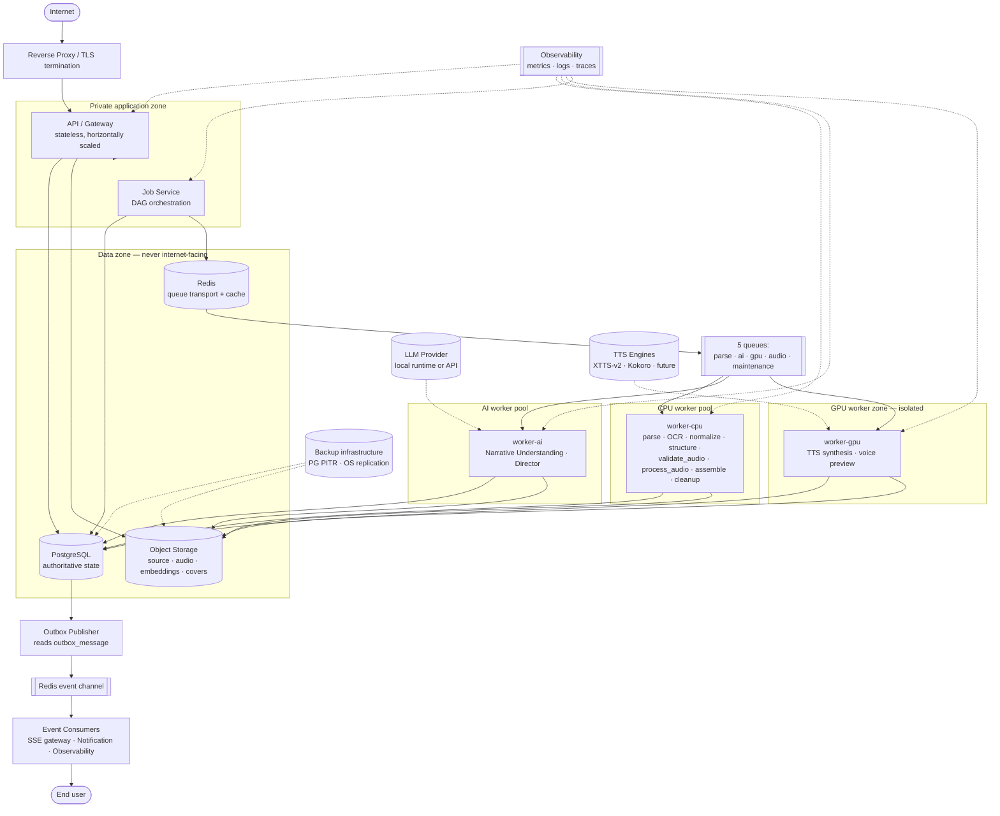
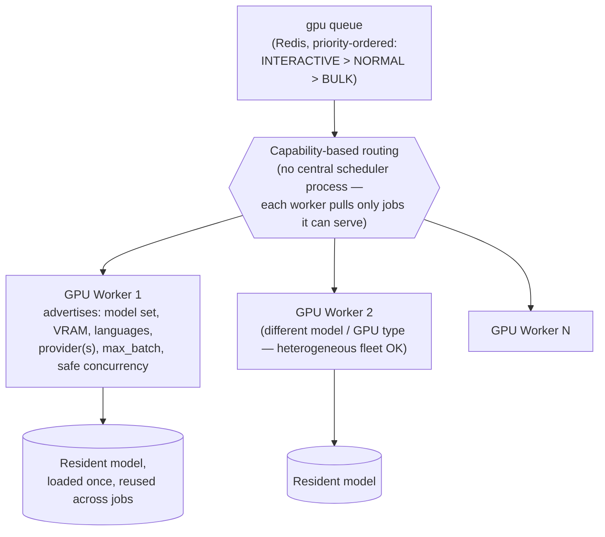
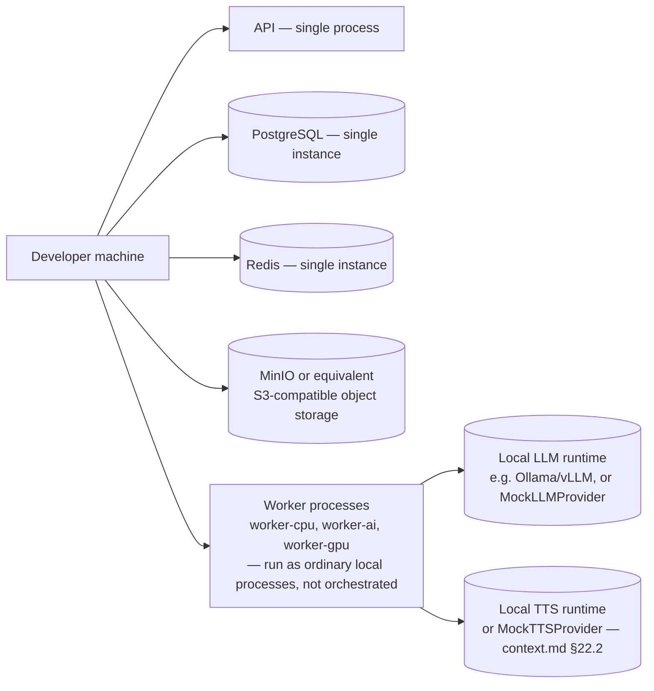
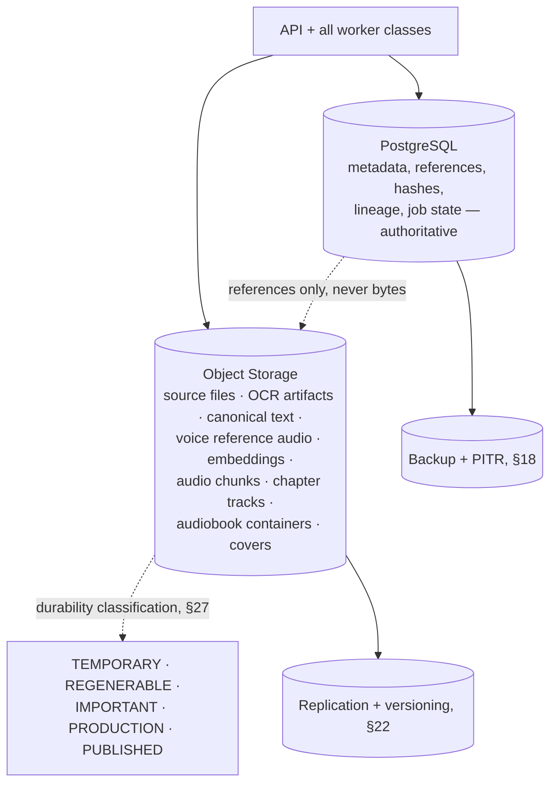
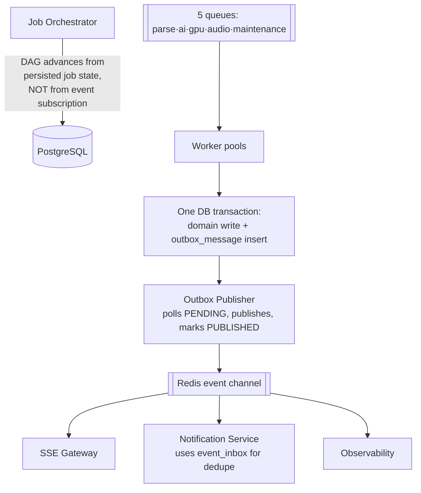
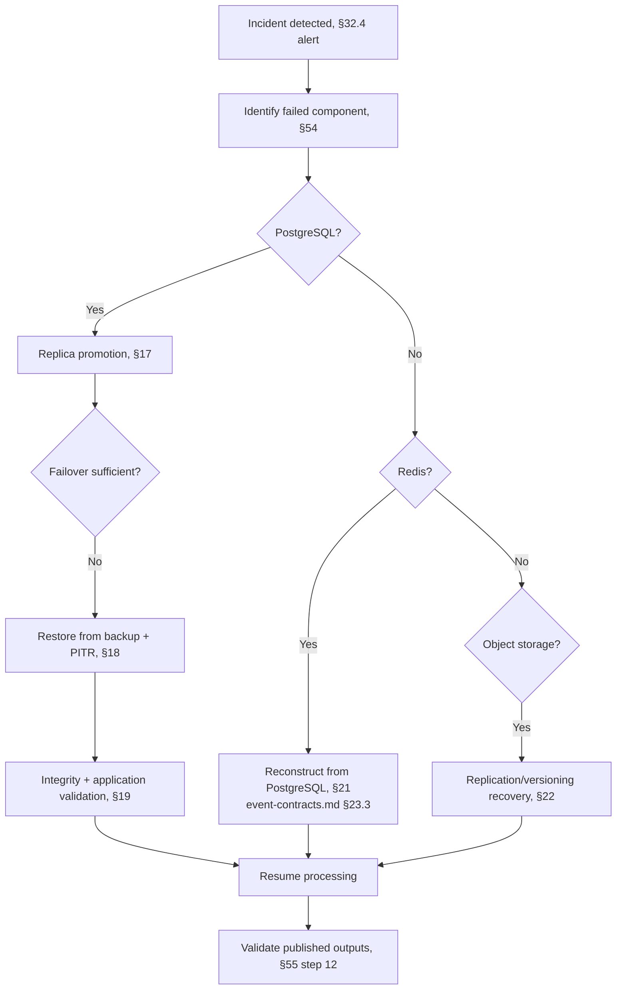
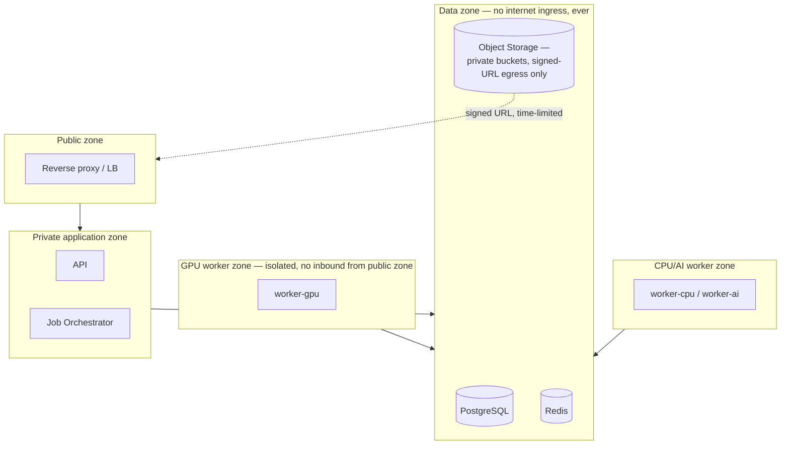

# Deployment Architecture — AI Audiobook Generator

> **Schema/Doc version:** `deployment-architecture.v1`
> **Tier:** 2 (environments, topology, scaling, configuration — `context.md` §26)
> **Status:** DRAFT — awaiting human review
> **Derives from:** `context.md` (`context.v1.1`); reconciled against `database-schema.md`
> (`db-schema.v1.1`), `event-contracts.md` (`events.v1`), `api-specification.md`
> (`api-spec.v1.1`), `audio-script-ir.md`, `director-specification.md`,
> `tts-provider-specification.md`
> **Frozen:** No. Freezes when Phase 1 begins (`context.md` §27.3)
> **Change protocol:** `context.md` §27
> **Commissioned by:** `architecture-review.md` BLOCKER-2 — `context.md` §29's Phase 0 exit
> criteria require eight documents; this is the eighth.

## 0. Scope and authority

This document is the **infrastructure and deployment architecture**. It fixes topology,
service boundaries, scaling dimensions, environment separation, disaster-recovery posture,
and operational architecture. It does **not** implement anything — no Dockerfiles, no
Kubernetes manifests, no Terraform, no CI/CD pipeline code, no exact hardware SKUs, no cloud
vendor selection.

Per `context.md` §26.1, this document may not contradict Tier 0/1 documents, and where a
concrete number is needed (a timeout, a retention window, a concurrency limit), this document
either fixes the **shape** of the configuration and leaves the value to measurement, or gives a
**provisional** value explicitly marked as such and the factors that will determine the final
one — consistent with every other document's discipline (`tts-provider-specification.md`
§69.2: "numerical thresholds are benchmarked, not asserted").

**What this document must not do** (`context.md` §26.1 rule 3, restated for this document):
introduce an entity absent from `database-schema.md`, an event absent from
`event-contracts.md`, a job type absent from `event-contracts.md` §11, or a persistence detail
that contradicts `database-schema.md`. Every entity this document references (`ModelVersion`,
`ProcessingJob`, `outbox_message`, etc.) is defined elsewhere and only its **deployment shape**
is fixed here.

---

## 1. High-level topology



**Reading notes**: the data zone is never directly internet-reachable (§9); GPU workers are a
physically and operationally distinct pool from CPU/AI workers (§7); the Outbox Publisher reads
`outbox_message` rows written by every other component's own transactions
(`database-schema.md` §15.6, closing BLOCKER-1) — it is not itself a domain-logic component.

---

## 2. Service boundaries

Per §19–§20's instruction to distinguish logical from deployable services and avoid premature
fragmentation, this table defines every **logical** responsibility and states which are
**mandatorily** separate deployment units and which may reasonably share a runtime in v1.

| Component | Responsibility | CPU/GPU | Persistence | Scaling | Queue dependency | Failure behavior | Deployment unit |
|---|---|---|---|---|---|---|---|
| **API Service** | HTTP surface (`api-specification.md`); validates, persists intent, enqueues, never blocks on expensive work | CPU | Reads/writes PostgreSQL; mints signed URLs against object storage | Horizontal, stateless | Enqueues via `processing_job` + Redis push | A crashed instance loses no state — the load balancer routes around it, in-flight requests fail and the client retries | **Own unit** — the only internet-facing component |
| **Job Orchestrator** (Job Service) | DAG evaluation, `BLOCKED→QUEUED` transitions, fan-in checks, lease/heartbeat/fencing, DLQ, the Outbox Publisher | CPU | PostgreSQL is its state; Redis is its transport | Horizontal — DAG evaluation is a database-driven poll/notify loop, not a singleton | Reads job tables directly; does not consume its own queue | Stateless between ticks — restart resumes from `processing_job` rows, never from memory | **Own unit**, though may co-locate with the API process in the smallest environments (§13) |
| **Ingestion Worker** | `parse_book`, `ocr_page`, `normalize_text`, `analyze_structure` | CPU-heavy (OCR) | Writes `book_version`/`parsed_page`/spine rows via the Book/Parser Service contract | Horizontal, page-parallel | `parse` queue | Crash loses at most the in-flight page/book; reaped by heartbeat, retried | Consumer of `worker-cpu` runtime — see §6 |
| **Analysis Worker** | `analyze_scene`, `build_story_bible_delta` | CPU or LLM-bound (deployment choice) | Writes Story Bible fact tables | Horizontal **across books**; sequential **within** a book (`event-contracts.md` §28.2, a Redis lock on `book_id`) | `ai` queue | Same reaping mechanism; the sequential-per-book lock is released on crash by lease expiry, never held indefinitely | `worker-ai` runtime |
| **Director Worker** | `generate_director_ir`, `revise_director_ir` | LLM-bound; GPU-backed only if local inference is chosen | Writes `audio_script`/`audio_script_chunk` | Horizontal across books; parallel within an analyzed scene | `ai` queue | Same reaping mechanism; a failed chunk falls to the deterministic fallback IR, never blocks the book | `worker-ai` runtime |
| **TTS Worker** | `generate_tts_chunk`, `generate_voice_preview` | **GPU** | Writes `audio_chunk`, `tts_job` | Horizontal, fully parallel across chunks | `gpu` queue | Reaping + OOM ladder (`tts-provider-specification.md` §56.2); graceful 6-step drain on deploy | **Own unit — GPU isolation is mandatory** (§7) |
| **Audio Processing Worker** | `validate_audio`, `process_audio`, `verify_transcript` | CPU-heavy (FFmpeg, ASR) | Writes `audio_chunk` validation/technical fields | Horizontal, per-chunk parallel | `audio` queue | Same reaping mechanism | `worker-cpu` runtime |
| **Assembly Worker** | `assemble_chapter`, `assemble_audiobook`, `encode_delivery_format` | CPU-heavy (FFmpeg) | Writes `chapter_audio`/`audiobook`/renditions | Parallel across chapters/books; ordered within one chapter's manifest (Redis lock) | `audio` queue | Same reaping mechanism; a partial fan-in refuses cleanly (`CHAPTER_MANIFEST_INCOMPLETE`), never assembles a wrong manifest | `worker-cpu` runtime |
| **Outbox Publisher** | Reads `outbox_message` `PENDING` rows, publishes, marks `PUBLISHED` (`database-schema.md` §15.6) | CPU, light | Reads/writes `outbox_message` only | Horizontal — `FOR UPDATE SKIP LOCKED` batches partitioned by `aggregate_id` hash (`event-contracts.md` §19.6) | Publishes to the Redis event channel | A crashed publisher loses no data — `PENDING` rows are simply not yet published; the next instance (or the same one, restarted) picks them up | Logical role of the **Job Orchestrator** unit; not a separately scaled service in v1 (no justification found for isolating it further — see §3) |
| **Event Consumer(s)** | SSE gateway, Notification Service, Observability ingestion | CPU, light | `event_inbox` for consumers that need it (`database-schema.md` §15.7); otherwise stateless projections | Horizontal | Subscribes to the Redis event channel | Losing a consumer costs a UI update or a notification, never correctness (`event-contracts.md` §19.7) | Each is its **own** small deployment unit — they scale independently of everything else and have no queue-consumption dependency on each other |
| **Model Manager** | Not a separate running process — a **worker-internal responsibility**: model load/warm/evict policy inside `worker-ai` and `worker-gpu` (`tts-provider-specification.md` §18) | Lives inside the GPU/AI worker process | Reads `model_registry`/`model_version`; caches weights locally per §10 | N/A — internal to each worker | N/A | A worker that fails to load its assigned model reports `FAILED_START` and is excluded from routing, never silently serves a wrong model | **Not a deployment unit.** Making it one would require worker↔manager RPC on the model-loading hot path for no benefit — see §3 |

---

## 3. Microservice granularity — logical vs. deployable

The instruction is explicit: avoid premature fragmentation. This document distinguishes two
axes:

- **Logical service** — a named responsibility with an owner in `database-schema.md` §6 and a
  behavioral contract in one of the Tier 1/2 documents. There are roughly 20 of these across
  the whole system (Book, Ingestion, Parser, Character, Context/Story Bible, Voice, Director,
  TTS, Assembly, Job, Auth, User, Notification, Observability, and several more).
- **Deployable service** — an actual running process/container with its own scaling policy.
  This document defines **7**: API, Job Orchestrator, `worker-cpu`, `worker-ai`, `worker-gpu`,
  SSE Gateway, Notification Service (Observability infrastructure — metrics/logs/traces
  backends — is treated as platform infrastructure, not an application deployable, and is out
  of this document's authority beyond §21–§24).

**It is acceptable, and intended, for several logical services to share one deployable unit.**
`worker-cpu` alone hosts the Ingestion, Audio Processing, and Assembly logical services (and
`cleanup_artifacts`); `worker-ai` hosts both Narrative Understanding and Director. This mirrors
`context.md` §3.3's own statement that "worker-ai" is a single runtime hosting multiple job
types sharing infrastructure but not responsibilities, and it avoids paying an operational
tax (independent deploy pipelines, independent health infrastructure, independent scaling
policy) for a split with no scaling or failure-isolation benefit.

### 3.1 What MUST be isolated, and why

| Component | Reason for mandatory isolation |
|---|---|
| **TTS Worker (`worker-gpu`)** | **GPU requirement** — cannot share a deployment unit with CPU-only work without wasting GPU allocation on CPU-bound code paths, and cannot be scaled by the same policy as CPU workers (GPU nodes are expensive and provisioned differently — §8). **Failure isolation** — GPU OOM, CUDA driver faults, and model-load failures are a distinct failure class that must not be able to take down ingestion or assembly capacity. **Resource requirement** — VRAM is a scarce, non-fungible resource; co-locating anything else on a GPU node wastes it. |
| **API Service** | **Scaling** — it scales on request rate, an entirely different signal from queue depth or GPU utilization. **Failure isolation** — the only internet-facing component; its blast radius (a bad deploy, a traffic spike) must never be able to starve worker capacity, and vice versa. |
| **Object storage, PostgreSQL, Redis** | Not application services at all — see §9–§11. Isolation here is a network-zone requirement, not a granularity choice. |

Everything else in §2 **may** be co-located if a deployment's scale doesn't yet justify
splitting it, and **may** be split further later without any contract change — because every
job type is already independently queued, independently retryable, and independently
observable (`event-contracts.md` §5, §21). Splitting `worker-cpu` into three separate processes
later (ingestion / audio-processing / assembly) is purely an operational scaling decision, not
an architecture change.

---

## 4. Compute classes

| Class | Workloads | Characteristics |
|---|---|---|
| **General CPU** | API, Job Orchestrator, database clients, light request handling | Low per-request cost, high request-rate variance, no large memory footprint |
| **CPU-heavy** | PDF/EPUB parsing, OCR, `process_audio` (FFmpeg), `assemble_chapter`/`assemble_audiobook` (FFmpeg), `encode_delivery_format` | Bursty, memory- and CPU-cycle-heavy per unit of work; benefits from more cores per instance, not more instances at the same core count |
| **GPU** | Director LLM inference (only if local inference is the deployment's choice — `director-specification.md` §31), TTS inference (always GPU for XTTS-v2/Kokoro in production), future local models | VRAM-bound, benefits from being kept warm (model residency — §10), and from capability-based routing rather than uniform instance sizing (heterogeneous GPU types are explicitly supported, §7.3) |

No exact hardware SKU, VRAM tier, or core count is prescribed here — `tts-provider-specification.md`
§39/§59 and this document's §22 (Capacity Planning) name what must be **measured** before that
decision is made.

---

## 5. GPU architecture



**Capability advertisement** (`worker.capabilities jsonb`, `database-schema.md` §15.5;
`tts-provider-specification.md` §3.3's `ProviderCapabilities`): every GPU worker publishes, at
minimum, the model(s) and `tts_model_version_id`(s) it has loaded, supported languages, its
provider identity (`tts_provider_id`), its measured `max_batch`, and its measured safe
concurrency. **The dispatcher does not guess — a worker's advertised concurrency is respected,
never exceeded by assumption** (`tts-provider-specification.md` §19.4, restated as a deployment
obligation: no orchestration layer may override a worker's self-reported safe concurrency "to
improve utilization").

**Jobs are scheduled only onto compatible workers.** A `generate_tts_chunk` command targeting
`voice_profile_version_id → tts_model_version_id = M` is only ever claimed by a worker
advertising `M` in its loaded-model set — there is no "closest match" or "compatible enough"
routing. This is enforced by the same mechanism that prevents silent voice/model substitution
elsewhere in the architecture (§14, ADR-014 below), applied at the deployment layer: a worker
that cannot serve a job simply never claims it, and the job remains `QUEUED` (visible in queue
depth metrics — §21) rather than being force-assigned somewhere unsuitable.

### 5.1 GPU isolation

```
API
 ↓ (validates, persists intent, returns 202 immediately)
Job (processing_job row)
 ↓ (enqueued via Redis, never a synchronous call)
gpu queue
 ↓ (worker pulls when free and capable)
GPU Worker (synthesizes, uploads, verifies, reports)
```

**The API service never performs GPU inference synchronously, and never holds an HTTP
connection open across a GPU call** — this is `context.md` §2.3's hard rule, restated here as a
deployment guarantee: no API process instance ever runs on GPU hardware, and no API code path
has network reachability to a GPU worker's internal control surface beyond the shared
PostgreSQL/Redis/object-storage data plane every component uses identically.

### 5.2 GPU scaling

Horizontal, capability-based, with **no hard-coded GPU index and no one-GPU-per-application-
instance assumption**:

```
1 GPU   →  1 worker process (or more, if VRAM permits — §5.3 of tts-provider-specification.md:
            "one model instance per GPU by default", a deliberate default, not a ceiling)
2 GPUs  →  2 independent worker processes, each pulling from the same gpu queue,
            each advertising its own capabilities independently
N GPUs  →  N independent worker processes; adding one is "join the pool, pull the model set,
            verify checksums against model_version, register capabilities, begin consuming —
            no application change, no contract change, no redeploy of other services"
            (context.md §20.4, event-contracts.md §27.5 — a hard architectural test)
```

A deployment **MAY** run multiple GPU worker processes per physical GPU (fractional GPU
sharing) where VRAM and the measured concurrency model support it, but this is a per-model,
benchmarked configuration decision (§22), never a default.

### 5.3 Model placement

```
Object Storage / Model Registry
   (model_version.weights_storage_key, weights_content_hash — database-schema.md §14.3)
        ↓  (fetched once per worker lifetime, or on model-set change)
Local Model Cache
   (worker-private disk/memory, checksum-verified against weights_content_hash on load)
        ↓  (loaded into GPU memory, held resident — tts-provider-specification.md §18)
GPU Worker (runtime-loaded model, serving inference)
```

**The model binary is never database state.** `model_version` (`database-schema.md` §14.3)
stores the storage key and content hash — never the weights themselves — matching every other
large-binary-artifact rule in this system (`context.md` §2.3, this document's §11). **Model
source** (the object-storage-resident, checksummed weights file, the thing `model_version`
points to) is distinct from **runtime-loaded model** (the in-GPU-memory instance a worker has
currently resident) — a worker may hold several `model_version`s loaded at once if VRAM
permits, and the mapping from "which versions are currently loaded on which worker" is exactly
`worker.loaded_model_version_ids` (`database-schema.md` §15.5), refreshed on every heartbeat.

### 5.4 Model versioning in deployment

A deployment MAY contain multiple `ModelVersion`s simultaneously — this is not an edge case,
it is the normal state during any model rollout (§16 below) and whenever different
`VoiceProfileVersion`s pin different `tts_model_version_id`s. **Production generation always
explicitly selects the pinned version** — never "whichever is loaded" — enforced identically to
every other version-pin rule in this system: a job whose pinned model is not loadable by any
worker in the current fleet fails terminally rather than falling back to a different version
(`event-contracts.md` §15.6, restated as a deployment consequence: **the fleet's job is to make
every currently-referenced `ModelVersion` loadable somewhere, not to substitute one that is
already loaded**).

---

## 6. Development environment

Developer-friendly, minimal-resource, single-machine-capable:



**`MockTTSProvider` and `MockLLMProvider` are mandatory development capabilities**
(`context.md` §22.2, restated here as a deployment requirement, not an optional convenience):
every downstream contract — the IR, the database writes, the event flow, chapter/audiobook
assembly — must be developable and testable on a laptop with no GPU, using mock providers that
satisfy the full `TTSProvider`/`DirectorModelProvider` interfaces with synthetic output
(silence/tone/fast-CPU-engine audio; schema-valid canned IR against fixture books). Real local
LLM/TTS runtimes are an optional upgrade for a developer with suitable hardware, never a
requirement to run the stack.

**No Docker Compose file is created by this document** — only the topology it should describe:
one process or container per component above, on a shared local network, no TLS, no auth
hardening beyond what the application itself requires, ephemeral data (dev data resets are
expected and safe — `context.md` §22.3 restricts development data to fixtures and
public-domain books).

---

## 7. Test environment

Isolated, deterministic where possible, no dependency on production resources:

| Test category | Environment shape |
|---|---|
| Unit tests | No external dependencies — pure in-process |
| Database tests | An isolated, ephemeral PostgreSQL instance per test run (or per test suite), migrated fresh, torn down after — never a shared or long-lived test database |
| Queue tests | An isolated, ephemeral Redis instance, same lifecycle as the database |
| Object storage tests | An isolated MinIO (or equivalent) instance, or a mocked storage client for pure unit-level tests |
| Worker tests | Workers run against the ephemeral PostgreSQL/Redis/object-storage triad above, with `MockTTSProvider`/`MockLLMProvider` standing in for GPU/LLM dependencies |
| Provider contract tests | Run against `MockTTSProvider`/`MockLLMProvider` for CI, and **additionally** against each real provider adapter (XTTS, Kokoro, the chosen LLM provider) in a scheduled, non-blocking suite — real-provider contract tests are not required to gate every commit, since they depend on GPU/API availability CI may not have |

**No production credentials, production data, or production object-storage buckets are ever
reachable from this environment** — a structural requirement, not a convention: test
environment configuration uses entirely separate credentials and endpoints, so a
misconfiguration cannot accidentally write to production.

---

## 8. Staging

**Staging is production-like** — the same topology as §30, at reduced scale, with the same
component versions, the same migration path, and the same event/queue/worker contracts. It
exists specifically to validate what a test environment structurally cannot:

| Validated in staging | Why it can't be validated in test |
|---|---|
| Database migrations against realistic data volume and a realistic schema history | Test databases are ephemeral and fresh; migration ordering/locking issues only surface against an evolved schema |
| Full event flow end-to-end, including the Outbox Publisher under real (if low) load | Test environments typically mock or short-circuit the publish step |
| Worker deployment mechanics (rolling restart, draining, model reload) | Test environments don't deploy — they start fresh each run |
| Object storage behavior at realistic latency (not a same-host MinIO) | Test environments are usually co-located with the test runner |
| Queue behavior under realistic concurrency | Test suites are typically single-threaded per test |
| **GPU workloads**, including real model loading and real inference | Test environments default to mock providers precisely to avoid needing GPU hardware |
| Observability — dashboards, alert routing, log aggregation — exercised for real | Test environments don't run the observability stack |
| **Backup/restore procedures**, exercised on a real (if smaller) dataset | This is the one environment (besides production itself) where a restore drill is meaningful — see §19 |

Staging uses **separate credentials, separate object-storage buckets, and a separate database
instance** from production — never a read replica of production data, to keep test/staging
activity from being able to touch real user content even accidentally.

---

## 9. Production

```mermaid
flowchart TD
    subgraph EDGE["Public zone"]
        LB[Load balancer / TLS termination]
    end
    LB --> API_P["API instances<br/>N ≥ 2, horizontally scaled, stateless"]

    subgraph APP["Private application zone"]
        API_P
        JOB_P[Job Orchestrator instances]
    end

    subgraph WORKERS["Worker pools — independently scaled"]
        CPU_P["worker-cpu pool"]
        AI_P["worker-ai pool"]
        GPU_P["worker-gpu pool<br/>(isolated node group/pool)"]
    end

    subgraph DATA["Data zone — private, never internet-facing"]
        PG_P[(PostgreSQL<br/>primary + replica(s) — §18)]
        REDIS_P[(Redis<br/>queue transport + cache)]
        OS_P[(Object storage<br/>durable, versioned, encrypted)]
    end

    API_P --> DATA
    JOB_P --> DATA
    WORKERS --> DATA

    subgraph OPS["Operations"]
        MON[Monitoring / metrics]
        LOG[Centralized logging]
        BAK[Backup infrastructure]
        DR[DR replication target]
    end

    DATA -.-> MON
    APP -.-> MON
    WORKERS -.-> MON
    DATA -.-> LOG
    APP -.-> LOG
    WORKERS -.-> LOG
    PG_P -.-> BAK
    OS_P -.-> BAK
    BAK -.-> DR
```

Production is the only environment requiring: HA PostgreSQL (§18), durable/versioned object
storage (§20), a dedicated GPU worker pool sized against measured demand (§22), full
observability (§21), backups with tested restore (§19), and disaster recovery (§40).

**No single cloud provider is assumed.** Every component in this topology
(`load balancer`, `PostgreSQL`, `Redis`, `object storage`, `compute for CPU/AI/GPU workers`) is
named by its architectural role, not by a vendor product. Provider-specific implementation
(a specific managed-Postgres product, a specific GPU instance family, a specific object-storage
service) is a deployment-time decision made **separately** from this document, consistent with
§61 below.

---

## 10. PostgreSQL as authoritative state

Restated as a deployment-binding rule, not merely an application-architecture one (see
ADR-DEP-001): **PostgreSQL is authoritative for every piece of durable state** —
`context.md` §3.2.11, `database-schema.md` §40.2 (as verified in `architecture-review.md` §26).
**Redis must never become the source of truth for jobs, artifacts, versions, user data, book
state, or processing state.** Every Redis key is rebuildable from PostgreSQL or object storage
by construction (`context.md` §12.2). If Redis disappears entirely, the deployment's expected
recovery is the exact procedure `event-contracts.md` §23.3 already specifies at the
application-architecture level, and this document adds no new recovery mechanism — only the
infrastructure to support it (§41).

**Deployment consequence**: PostgreSQL's own availability and durability posture (§18–§19) is
the single most consequential infrastructure decision in this document, because everything else
in the system is, by design, disposable and rebuildable **except** it.

---

## 11. Redis role

| Redis owns | Redis does NOT own |
|---|---|
| Queue transport (BullMQ job storage, retry scheduling metadata) | Job state authority — `processing_job` in PostgreSQL is authoritative; Redis job data is a cache/transport of it |
| The event channel (fan-out pub/sub or streams, bounded retention) | Durable event history — that is `processing_job`/`processing_attempt`/`audit_log`, plus the bounded-retention `outbox_message` table, never Redis |
| Cross-service coordination locks (the per-book sequential-analysis lock, per-chapter/per-book assembly locks, both fencing-token-protected) | Any lock's *correctness* — every lock is a fast-path optimization backed by a database-enforced invariant (unique constraints, the fan-in query) that remains correct even if the lock is lost |
| Cache (resolved character bindings, context-bundle fragments, rate-limit counters) | Anything for which cache loss would produce an incorrect (not merely slower) result — every cache in this system is rebuildable and never authoritative |
| Cancellation flags (the fast path; `processing_job.cancellation_requested` is the durable truth) | Cancellation *correctness* — a lost flag delays a cancellation, never fails to eventually honor a durable request |

Redis is deployed as a **single logical service** with these five responsibilities; nothing in
this architecture requires splitting queue transport from cache from pub/sub into separate
Redis clusters in v1, though nothing prevents it later purely as an operational scaling choice
(the application never assumes single-instance Redis).

---

## 12. Object storage role

Authoritative for every large binary artifact (`context.md` §2.3, restated and verified in
`architecture-review.md` §27):

```
source books (PDF/EPUB/image sets) · OCR artifacts · parsed documents · canonical chapter text
voice reference audio · voice embeddings · generated audio chunks (intermediate WAV)
chapter audio tracks · final audiobook containers and renditions · cover art
```

**PostgreSQL stores metadata and references only** — storage key, content hash, size, MIME/format,
lifecycle state (`database-schema.md` §4.4's field-group contract, present on every table that
owns a binary artifact). No document in this set, including this one, proposes an exception.

---

## 13. Network architecture

```
Internet
  ↓  (TLS terminated at the edge)
Public zone: reverse proxy / load balancer only
  ↓
Private application zone: API, Job Orchestrator
  ↓                              ↓
Data zone:                  GPU worker zone:
  PostgreSQL                  worker-gpu (isolated node group)
  Redis
  Object storage (via private endpoint / VPC-internal access, not the public internet path)
```

**Internal traffic, exhaustively enumerated:**

```
API          → PostgreSQL     (read/write, credentialed, narrow role — §35)
API          → Redis          (enqueue, cache, rate-limit counters)
API          → Object storage (mint signed URLs; does not proxy bytes — context.md §3.2.5)
Workers (all)→ PostgreSQL     (per-service narrow role, database-schema.md §37.2)
Workers (all)→ Redis          (consume queues, coordination locks)
Workers (all)→ Object storage (prefix-scoped credentials — §35)
Job Orchestrator → PostgreSQL (DAG evaluation, lease management)
Job Orchestrator → Redis      (queue reconciliation on restart)
```

**PostgreSQL and Redis are never exposed to the public internet, under any circumstance, in any
environment** — including staging. The one public ingress point in the entire system is the
reverse proxy in front of the API. Object storage is reachable from the public internet **only**
via short-lived signed URLs minted by the API after an ownership check
(`api-specification.md` §16.20) — buckets themselves are private, never publicly listable or
readable by default (§37).

---

## 14. Secret management

| Secret class | Examples |
|---|---|
| Database credentials | Per-service PostgreSQL roles (`database-schema.md` §37.2) |
| Redis credentials | Per-service, least-privilege |
| Object storage credentials | Per-service, prefix-scoped (a GPU worker's credential grants its own output prefix plus read of the one `speaker_reference` key in its own job payload — never bucket-wide, `tts-provider-specification.md` §74.1) |
| LLM API keys | For API-based `DirectorModelProvider` adapters |
| TTS provider API keys | For API-based `TTSProvider` adapters |

**Never stored in**: source code, Git history, container images, queue/event payloads
(`event-contracts.md` §35.1's explicit rule — "signed URLs are secrets," never persisted in a
message), or logs (§23). **Supplied via a secrets manager**, injected into each component's
runtime environment at start, rotated on a documented schedule. This document is deliberately
**provider-neutral** about which secrets-manager product is used — the architectural
requirement is the property (secrets never touch the four forbidden locations above), not the
implementation.

---

## 15. Tenant isolation in deployment

`architecture-review.md` §29 confirms tenant isolation is enforced at the **database grant and
composite-FK layer**, the strongest guarantee this stack uses. Deployment must not weaken this
by relying on API-level filtering as a substitute:

- **Workers receive only authorized job references**, never a raw tenant-unscoped query
  capability — a worker's database role has no path to enumerate another tenant's rows even if
  its application code contained a bug that tried (`database-schema.md` §37.2, restated: a GPU
  worker's role has no `SELECT` on `book`, `paragraph`, `character`, or `voice_assignment` at
  all).
- **This property must survive every deployment topology change.** Splitting `worker-cpu` into
  three separate deployables (§3.1) does not, by itself, require re-granting broader access to
  any of them — each retains exactly the narrow role its job types require.
- **Cross-tenant admin access** (`PLATFORM_ADMIN`) is metadata/lineage/diagnostics-only, never
  content, and is audited on every use (`api-specification.md` §6.6) — this document adds no
  deployment-level backdoor (e.g., a direct database console for support staff) that would
  bypass that boundary; any operational tooling that needs database access uses the same
  narrow, audited roles application code uses, never a superuser connection (§18.2 rule 19 of
  `database-schema.md`, restated here as binding on deployment tooling too).

---

## 16. Storage security

| Control | Requirement |
|---|---|
| Encryption at rest | Required for PostgreSQL and object storage in staging and production |
| Encryption in transit | TLS required for every network hop crossing a zone boundary (§13); required in staging and production, recommended in development |
| Private buckets | Object storage buckets are **never publicly readable by default** — no bucket ACL grants anonymous or public read, in any environment, at any time |
| Signed URLs | The only path from a public client to an object; short-lived, minted per-request after an ownership check, audited on mint (`api-specification.md` §16.20) |
| Lifecycle policies | `storage_class`/`expires_at` drive object-storage lifecycle transitions (STANDARD → INFREQUENT → ARCHIVED → EXPIRED, `database-schema.md`'s `storage_class` enum) — see §43 for the policy shape per artifact class |
| Access roles | Per-service, prefix-scoped, least privilege (§14) |

**Generated audiobook objects are never publicly readable by default** — the explicit
instruction this section addresses. A published audiobook's durability and correctness
guarantees (§27) are entirely orthogonal to its access control, which remains
signed-URL-and-ownership-check-gated exactly like every other artifact, permanently.

---

## 17. PostgreSQL high availability

```
Primary (read/write)
   ↓  streaming replication
Replica(s) (read-only, hot standby)
```

**Failover**: on primary failure, a replica is promoted; application connections must reconnect
(not assume a stable connection survives failover) — this is already consistent with how every
worker in this system treats PostgreSQL connectivity (retry-on-connection-loss is a documented,
retryable error class in `event-contracts.md` §21.2 — "Redis or database connection
interruption" is explicitly retryable, not terminal).

**Connection recovery**: every component (API, every worker class, the Job Orchestrator) uses a
connection pool with retry/backoff on connection loss, consistent with the general at-least-once,
idempotent-everywhere discipline this whole system already assumes — a PostgreSQL failover is,
architecturally, just a longer-than-usual instance of "the database was briefly unreachable,"
not a new failure class requiring new application logic.

**Migration handling**: schema migrations run against the primary, applied by a dedicated
migration step **before** application code that depends on the new schema is rolled out (§17 —
Database Migration Strategy) — never applied by an application process at request time
(`database-schema.md` §45 rule 19: "never run migrations from an application process").

**No exact vendor implementation (managed HA Postgres product, specific replication topology
beyond primary+replica, synchronous vs. asynchronous replication) is chosen here** — that is a
production sizing/vendor decision informed by the RPO/RTO targets in §40, made once those
targets are set from measurement, not guessed here.

---

## 18. PostgreSQL backups — CRITICAL

This is the requirement `architecture-review.md` marked CRITICAL (§34–§35 of that document:
"PostgreSQL is the system's single authoritative store... no document specifies PostgreSQL's
own failure/recovery posture"). This section closes that gap architecturally.

| Requirement | Specification |
|---|---|
| **Full backups** | Taken on a recurring schedule (frequency is a §40 RPO-derived value, not invented here); stored independently of the primary database's own storage volume |
| **Point-in-time recovery (PITR)** | Required where the chosen PostgreSQL deployment mode supports it (continuous WAL archiving alongside periodic full backups) — this is the mechanism that bounds RPO below "time since last full backup" |
| **Backup verification** | Every backup is verified **restorable**, not merely "completed without error" — see §39, restore testing is mandatory, not optional |
| **Encryption** | Backups are encrypted at rest, using the same secrets-management discipline as §14 |
| **Retention** | A backup retention window is set (configuration, informed by both the RPO target and any audit/compliance retention requirement named in `database-schema.md` §27 or product policy — not invented here); DLQ-style "never auto-expire" treatment does **not** apply to routine backups, which age out on a documented schedule, distinct from `audit_log`'s own much longer, append-only retention |
| **Off-site copy** | At least one backup copy is stored in a failure domain independent of the primary database's own infrastructure (a different availability zone at minimum; a different region for the strongest posture) — this is what makes the backup useful against a datacenter-level failure, not merely a single-disk failure |
| **Restore testing** | See §39 — a backup is not considered reliable until a restore has actually been performed and validated |

"Take regular backups" is explicitly insufficient per the task's own instruction, and this
table is the architecture, not the operational schedule — exact frequency and retention
duration are §40/§56 measurement-driven values.

---

## 19. Backup restore testing

```
Backup
  ↓
Restore into an isolated environment (never production, never staging with live traffic)
  ↓
Integrity validation (row counts, checksum spot-checks against known-good artifacts,
                      foreign-key/constraint validation — database-schema.md §41.3's own
                      CI invariant-check queries are the natural validation suite to re-run
                      here, since they already prove the schema's internal consistency)
  ↓
Application validation (the application, pointed at the restored database, can actually
                         serve read requests correctly and a worker can actually claim
                         and process a job against it)
```

**This must apply particularly to PostgreSQL**, per the task's explicit instruction, because it
is the one component whose loss without a verified restore path is unrecoverable. A restore
drill's cadence, and whether it runs against staging infrastructure or a dedicated ephemeral
environment, is an operational decision within this architecture's authority to require but not
to schedule numerically here (§56).

---

## 20. Disaster recovery

### 20.1 RPO and RTO — provisional framework, not invented numbers

Per the task's explicit instruction not to invent final numerical values: this document defines
the **factors** that determine RPO/RTO and a **provisional** starting point, to be replaced by
measured, product-approved values before production launch.

| Data class | Provisional RPO target | Provisional RTO target | Factors determining the final value |
|---|---|---|---|
| PostgreSQL (all authoritative state) | Minutes (bounded by PITR/WAL-archiving frequency, §18) | Hours (bounded by restore-and-verify time at realistic data volume, §19) | Actual database size at launch and at scale (§56); the chosen HA topology's own failover time (§17) vs. a full restore's time; product tolerance for "how much recent work can be safely lost" — voice approvals, casting decisions, and in-flight job state are all here |
| Object storage (audio, source files, embeddings) | Near-zero, if the storage layer's own replication/versioning is relied upon (§20.2 below) | Depends on the storage provider's own recovery mechanism, not a custom process | Whether the chosen object-storage product offers cross-region replication as a managed feature (likely, and the cheaper path) vs. requiring a custom backup process |
| Redis | N/A as data loss — Redis holds no authoritative data (§10) | Minutes (time to reconstruct queue/cache state from PostgreSQL per `event-contracts.md` §23.3) | Not a backup/DR concern at all; a fresh Redis instance plus the documented reconciliation procedure is the entire recovery path |
| Configuration | Effectively zero — configuration is version-controlled, not runtime-mutated state | Minutes (redeploy from source control) | N/A — configuration-as-code eliminates this as a DR concern if consistently followed (§66) |
| Model registry / model weights | Near-zero if object storage's own durability is relied upon; the `model_version` metadata rows are covered by the PostgreSQL RPO above | Bounded by re-fetching weights from object storage to a fresh GPU worker — not a database restore | Object-storage replication posture, and whether a secondary weights mirror is warranted for the largest models |
| Critical metadata (`audit_log`, lineage) | Same as PostgreSQL — it lives in the same authoritative store | Same as PostgreSQL | Same factors — no separate posture is defined, since splitting `audit_log` onto different infrastructure than the rest of PostgreSQL would create a second consistency problem for no benefit |

**These are starting points for a benchmarking and product-sign-off process, not commitments.**
`tts-provider-specification.md` §69.2's discipline is deliberately mirrored here: a number
appears only as a labeled provisional value, never as an unqualified architectural claim.

### 20.2 What is covered

PostgreSQL (§18–§19), object storage (replication/versioning — see §20.2 below and §27), Redis
(no backup required — reconstructable, §10), configuration (version-controlled, §66), model
registry (metadata in PostgreSQL, weights in object storage), and critical metadata (part of
PostgreSQL, no separate posture).

---

## 21. Redis disaster recovery

**Redis does not require persistence for correctness.** It is queue/cache/coordination
transport only (§11); PostgreSQL remains authoritative for every fact Redis also happens to
hold transiently. This document does **not** assume Redis's own persistence (RDB/AOF)
provides — or is needed to provide — complete job durability, because that durability already
comes from `processing_job` rows in PostgreSQL, written **before** the corresponding message is
enqueued (`event-contracts.md` §40.1's mandatory 8-step worker sequence, step 1: "the command
carries enough to identify the work, not enough to *be* the work").

**If Redis is lost**, the recovery procedure is exactly `event-contracts.md` §23.3's seven
numbered steps (already verified accurate in `architecture-review.md` §26), restated here as
the deployment-level expectation a fresh Redis instance must support: job state rebuilds from
PostgreSQL; queues re-populate from `QUEUED`/`RETRYING` rows; `RUNNING` jobs past heartbeat
deadline are reaped; caches rebuild lazily; cancellation flags re-derive from
`processing_job.cancellation_requested`; `outbox_message` `PENDING` rows publish once the relay
(Outbox Publisher, §2) reconnects; idempotency absorbs every duplicate the re-enqueue creates.

**A production deployment MAY still enable Redis persistence** (as a warm-restart optimization,
reducing the volume of work the reconciliation procedure above has to redo) but this is an
operational tuning choice, never an architectural dependency — the system is correct with an
empty, freshly-started Redis instance.

---

## 22. Object storage disaster recovery

| Concern | Requirement |
|---|---|
| Replication | Cross-zone (minimum) or cross-region (stronger posture) replication of the object-storage bucket(s), relied upon as the primary DR mechanism for binary artifacts rather than a custom backup process — object storage products designed for this purpose (versioned, replicated, checksum-verified) are architecturally preferred over reinventing the mechanism |
| Versioning | Object versioning enabled at the bucket level, so an accidental overwrite or delete is recoverable — this is distinct from, and in addition to, this system's own application-level immutability discipline (a `voice_profile_version`'s reference audio is never *supposed* to be overwritten, but bucket versioning is the infrastructure backstop if it ever is) |
| Backup | For object classes where the storage provider's own replication is judged insufficient (e.g., protecting against a bug that deletes objects programmatically, which replication faithfully propagates), a periodic backup/snapshot mechanism independent of the live bucket |
| Lifecycle | Governed by `storage_class`/`expires_at` (§43) — DR posture and lifecycle policy are related but distinct: an object correctly transitioning to `ARCHIVED` per its lifecycle policy is not a DR event, but an object disappearing outside that policy is |
| Deletion protection | Applied to the artifact classes named in §27 as `PUBLISHED`-durability — a published audiobook's storage key SHOULD be protected against accidental deletion (versioning + a deletion-protection setting where the storage product offers one), distinct from the ordered, audited purge process this system already defines for intentional deletion (`database-schema.md` §27.4) |

### 22.1 Why generated audio needs this evaluation specifically

Audio artifacts are expensive to regenerate — real GPU-hours and, for API-based providers, real
per-request cost (`architecture-review.md` §41). This justifies **differentiated** durability
by artifact class rather than one blanket policy — see §27's classification, which is this
document's direct answer to that evaluation.

---

## 23. Audio artifact durability classification

| Class | Examples | Durability/retention posture |
|---|---|---|
| **TEMPORARY** | Voice preview samples, dry-run/preview builds (`is_preview_build = true`), worker scratch files | Short, bounded lifetime; no cross-region replication required; cheap to lose and cheap to regenerate |
| **REGENERABLE** | Intermediate audio chunks (raw synthesized WAV) whose full lineage is intact and whose source (`AudioScriptChunk`, `VoiceProfileVersion`, `ModelVersion`) is unchanged | Standard durability; explicitly the system's accepted "dominant storage cost" tradeoff, "accepted for regenerability" (`context.md` §30.11 item 4) — lifecycle policy (§43) MAY move these to cheaper storage classes or expire them after a window, since re-rendering from intact lineage is always possible |
| **IMPORTANT** | `ChapterAudio` — an assembled, validated chapter track | Standard-to-strong durability; regenerable in principle (re-run assembly) but at a real cost in FFmpeg time and the coordination of a full chapter's chunk set |
| **PRODUCTION** | Any `Audiobook` version, including superseded ones (`is_current = false`) | Strong durability, replication, and versioning — a superseded version is still an audiobook someone may have downloaded or may need explained/reproduced (`architecture-review.md` §7's reproducibility chain depends on it remaining retrievable) |
| **PUBLISHED** | The current, user-facing `Audiobook` version and its delivery renditions | **Strongest durability tier** — deletion-protected (§22), versioned, replicated, checksum-verified on every access-URL mint (the checksum already recorded at creation, `database-schema.md` §4.4, is re-verifiable at serve time) |

This classification is a **retention/durability policy layer over the existing
`storage_class`/lifecycle mechanism** (`database-schema.md` §12.3/§34) — it does not introduce a
new database field; it gives the operational meaning to the `storage_class` values
(`STANDARD/INFREQUENT/ARCHIVED/EXPIRED`) that already exist, mapped by artifact class as above.

---

## 24. Worker failure

Workers are **disposable** — no persistent state lives in a worker process, ever
(`tts-provider-specification.md` §81.1: "workers are stateless except for loaded models and
temporary inference state; all persistent state lives in PostgreSQL and object storage").

| Worker class | Recovery on crash |
|---|---|
| API instance | Load balancer routes around it; in-flight requests fail and the client retries (idempotency-key-protected where the operation requires it, `api-specification.md` §11); no state is lost because the API holds none beyond the current request |
| Director worker (`worker-ai`) | The in-flight job's lease expires, is reaped to `RETRYING` by the Job Orchestrator's heartbeat check, retried on any available `worker-ai` instance; the sequential-per-book analysis lock (§28.2 of `event-contracts.md`) is released on lease expiry, never held indefinitely |
| TTS worker (`worker-gpu`) | Same reaping mechanism; at most one chunk per crashed worker is affected — `tts-provider-specification.md`'s own worked example ("10,000 chunks, 7,500 complete, cluster crashes, resumes at 7,501") is the deployment-level guarantee this component must uphold |
| Audio processing / assembly worker (`worker-cpu`) | Same reaping mechanism; a crash mid-assembly discards only the in-progress, unpublished attempt — completed chunks and any previously-`ASSEMBLED` chapter are untouched |

**Persistent state belongs in PostgreSQL and object storage, never in worker-local memory or
disk beyond the job's own lifetime** (§25 — Temporary Data covers the cleanup discipline this
implies).

---

## 25. Queue recovery

```
Job (processing_job row, durable)
  ↓
Queue (Redis — transport only)
  ↓
Worker (claims, processes)
```

**If a worker crashes mid-processing**, the job becomes retryable via the orphan-reaping
mechanism (`database-schema.md` §15.1's `INDEX (status, heartbeat_at) WHERE status='RUNNING'`,
described as "the single most important operational index in the table") — a `RUNNING` job past
its heartbeat deadline is reaped to `RETRYING`, its `lease_fence` is incremented, and a
resurrected/zombie original worker is structurally prevented from writing a stale result because
its fence is now behind (`event-contracts.md` §21.6). **No work is lost because a worker process
disappeared** — this is not a best-effort property, it is the direct, verified consequence of
persistent job identity plus fencing tokens plus idempotent re-processing, all already specified
at the application-architecture layer and simply required to hold at the deployment layer too
(i.e., the deployment must actually run the heartbeat/reaper loop continuously, on infrastructure
that itself survives an individual worker's failure — the Job Orchestrator, §2, §17).

---

## 26. Deployment strategy

| Component | Strategy | Rationale |
|---|---|---|
| API | Rolling deployment, health-check-gated | Stateless, cheap to replace one instance at a time; a bad deploy is caught by readiness checks (§75) before it receives traffic |
| CPU workers (`worker-cpu`) | Rolling, with in-flight-job draining (§76) before termination | No model-loading cost to amortize; draining is cheap since jobs checkpoint at natural boundaries (page, chunk, chapter — per-job-type detail in `event-contracts.md` §29.3) |
| AI workers (`worker-ai`) | Rolling, with draining | Similar to CPU workers; the sequential-per-book lock means an in-flight analysis run should be allowed to reach its next scene/chapter boundary before the worker is recycled, not killed mid-LLM-call |
| **GPU workers (`worker-gpu`)** | **Rolling, but with mandatory draining and NOT zero-downtime by default** | Model loading is expensive (§10) — replacing a GPU worker means the replacement must load its model set before it is useful, so a naive "kill old, start new" rolling deploy would transiently reduce effective GPU capacity by more than the instance count suggests. The recommended shape: start the new instance, wait for it to reach `MODEL_READY` (§75), **then** begin draining the old one — a brief period of N+1 capacity, not N-1 |
| Blue/green | Available as an option for the API and CPU/AI worker pools where the operational maturity to run parallel full environments exists | Not required by this architecture; useful for high-risk API changes specifically |
| Canary | Available as an option for the API, and for a new TTS/Director `ModelVersion` specifically (§16) | The natural place canary deployment matters most in this system is model rollout, not general application code, because a bad model version has a very different (and more expensive/harder-to-detect) failure mode than a bad application deploy |

**Zero-downtime deployment is not required everywhere** — the task's own instruction. CPU/AI/GPU
worker pools tolerate brief capacity reduction during a rolling deploy (jobs simply queue
slightly longer); only the API's availability is a user-facing SLA concern in the traditional
sense.

---

## 27. Database migration strategy

```
Application version N
  ↓
Database migration (applied first, backward-compatible with version N-1 still running)
  ↓
Application rollout (version N deployed, now assumes the new schema)
```

**Backward-compatible migration principles** (the expand/contract pattern
`database-schema.md` §35.2 already names for event schema evolution, applied identically here):
a migration that adds a nullable column or a new table is safe to apply before the application
code that uses it deploys; a migration that removes or renames a column must not be applied
until no running application version reads the old name. **Never deploy application code that
requires a schema change before the schema exists** — migrations always precede the application
version that depends on them, never the reverse, and a migration is never bundled inside an
application deployment's own startup sequence (`database-schema.md` §45 rule 19: migrations are
never run from an application process).

---

## 28. Event schema evolution

Uses `event_type` + `schema_version` exactly as `event-contracts.md` §14 fixes — this document
introduces no new versioning mechanism. MINOR changes (new optional field, new open-vocabulary
enum member, a new event/job type with the required `context.md` amendment) are safe to deploy
without consumer coordination; MAJOR changes (removed/renamed field, changed type or meaning,
narrowed constraint) require the dual-publish expand/migrate/contract sequence
`database-schema.md` §35.2 and `event-contracts.md` §14.4 already specify, and are **never**
deployed until every consumer supports the new version. **No payload semantics are ever changed
silently** — a change of meaning under an unchanged field name is forbidden outright
(`event-contracts.md` §14.6), and this document adds no deployment-level exception to that rule.

---

## 29. API versioning

Uses `api-specification.md` §2.1/§22 exactly — URL-prefixed major version (`/api/v1`), additive
changes within a version, breaking changes require a new major version plus a documented
migration path, deprecation announced via `Deprecation`/`Sunset` headers. **No new versioning
mechanism is invented here.** This document's only addition is the deployment consequence: a
new API major version is deployed **alongside** the previous one (both served simultaneously)
for a documented transition window, never as a hard cutover, consistent with the rolling/canary
strategies of §26.

---

## 30. Model deployment

A new `ModelVersion` (Director or TTS) **must not automatically replace the model used by
existing jobs.** This is not a deployment convenience — it is required by the versioning
discipline already fixed at the architecture layer (`architecture-review.md` §6:
"`ModelVersion → TTS`... unloadable pinned version = terminal job failure, never silent
substitution"). **Existing jobs retain their declared `ModelVersion`** because that pin is
already written into `audio_script_chunk.director_model_version_id` /
`voice_profile_version.tts_model_version_id` before the job runs — a deployment cannot change
what an already-created row points to, only what new rows point to going forward.

---

## 31. GPU model rollout

```
Old ModelVersion
    ↓  (still loaded on some fraction of the worker-gpu pool)
Existing jobs
    (chunks whose voice_profile_version/director pin the old version continue
     to route only to workers still advertising it)

New ModelVersion
    ↓  (loaded on a growing fraction of the pool, or a separate node group during validation)
New jobs
    (new VoiceProfileVersions cast against it, or a new director_version pinning it,
     per the existing casting/versioning workflow — no new mechanism)

After validation (benchmarking + certification, tts-provider-specification.md §72–§73,
                   or the Director equivalent):
New ModelVersion
    ↓
Default for future jobs
    (new VoiceProfileVersion casting defaults to it; existing, already-approved
     VoiceProfileVersions are UNCHANGED and continue to reference the old ModelVersion
     until a human explicitly recasts — architecture-review.md §10, §16)
```

**This must not, and structurally cannot, mutate historical generations** — every guarantee
this depends on (immutable `VoiceProfileVersion`, immutable `AudioChunk` lineage, no unlock
transition) is already enforced at the database layer (ADR-005, ADR-015 of
`architecture-review.md`); this section only describes how the GPU fleet's own model-loading
state transitions during a rollout without violating them. Both old and new `ModelVersion`s may
be simultaneously loaded across the fleet for as long as any job still legitimately targets the
old one — the fleet does not "cut over," individual jobs' pins determine routing.

---

## 32. Observability

### 32.1 Metrics

Deployment-level metrics, extending (never duplicating) `context.md` §17.2 and
`event-contracts.md` §44.2's application-level metric catalog:

```
API latency (p50/p95/p99, by endpoint)         · queue latency (per queue, oldest-message age)
job throughput (by job type)                    · worker utilization (per pool)
GPU utilization · GPU memory (used/free)         · LLM latency (by provider)
TTS latency (by provider/model)                  · audio generation rate (chunks/min, RTF)
error rates (by error class)                     · retry rates (attempts-per-success)
database health (connections, replication lag, WAL volume, lock waits)
Redis health (memory, connected clients, command latency)
object storage health (request latency, error rate, replication lag if applicable)
```

### 32.2 Logging

Centralized, structured, matching `event-contracts.md` §44.1's exact field set — this document
adds no new fields, only the infrastructure requirement to aggregate them: every log line is
traceable via `correlation_id`, `job_id`, `worker_id`, `book_id` where applicable, and
`generation_id` (i.e., `tts_job_id` + `audio_chunk.generation_version`, per the review's finding
on this decomposition) where applicable.

**Never logged, anywhere, in any environment except development against fixture/public-domain
books** (`context.md` §17.1, §22.3, independently restated in five documents and verified
consistent in `architecture-review.md` §48): full book text, API keys, secrets, voice
embeddings, or sensitive payloads. This document's contribution is purely infrastructural: the
centralized logging pipeline itself must not be a path by which any of the above leaks — log
shipping is TLS-encrypted, and the logging infrastructure's own access control follows §14/§35's
least-privilege discipline.

### 32.3 Tracing

```
API request → Job → Queue → Worker → Model → Artifact → Event
```

One trace per user-initiated operation, propagated via `traceparent` across every hop **including
across the asynchronous queue boundary** (`event-contracts.md` §44.3, carried in the command
envelope) — this is the one place a trace context must survive a transport that most tracing
tooling assumes is synchronous, and it is why `traceparent` is a first-class envelope field
rather than an HTTP-header-only concern. Head-based sampling for high-volume chunk-level work,
with 100% retention of errored traces, exactly as `context.md` §17.3 fixes.

### 32.4 Alerting

| Alert | Source |
|---|---|
| API outage | Load balancer health-check failure rate |
| PostgreSQL failure | Primary unreachable, or replication lag beyond threshold |
| Redis failure | Connection failure rate, or memory pressure |
| Queue backlog | Oldest-message age beyond SLO (`context.md` §20.5's backpressure trigger) |
| Worker crash rate | Reap rate trending up |
| GPU OOM | `GPU_OUT_OF_MEMORY` error-class rate |
| GPU unavailable | Fleet size below expected, or a worker stuck in `FAILED_START` |
| TTS failure spike | `tts.chunk_failed` rate |
| Director failure spike | `director.failed` rate, or `fallback_applied_count` trending up |
| Object storage failure | Upload/download error rate, or `object_verified_at` failures |
| Backup failure | A scheduled backup job's own failure/success signal |
| Replication failure | PostgreSQL replication lag or break; object-storage cross-region replication lag |
| **DLQ non-empty** | `event-contracts.md` §22.4's own minimum-alert-set rule — restated here as a deployment-level alerting requirement, not merely an application concern |
| **Outbox `PENDING` backlog growing** | `event-contracts.md` §44.4 — the specific signal that the Outbox Publisher (§2) itself has stalled |

No exact thresholds are invented here, per the task's instruction — each row names the signal;
the numeric threshold is a §56 (capacity planning) / operational-tuning value.

---

## 33. Capacity planning

Before production sizing is finalized, the following must be **measured**, not assumed:

```
books/day                          · concurrent users
average book length (words/pages)  · average pages/book
average chunks/book                · TTS audio hours generated/day
Director tokens consumed/day       · GPU hours consumed/day
storage growth rate (bytes/day, split by artifact class per §27)
database growth rate (rows/day, per §37 of database-schema.md's scale table)
queue throughput (jobs/sec, by queue)
```

**No final capacity numbers are invented in this document.** `tts-provider-specification.md`
§58.1's own worked example (400-page book → ~8,500 chunks; 100 books/tenant → ~4-5M rows across
five chunk-scale tables) is the closest thing to a concrete figure in the entire document set,
and it is explicitly a worked illustration, not a capacity commitment. This document's role is
to name what must be measured (above) and to ensure the architecture doesn't foreclose scaling
any one dimension independently (§34).

---

## 34. Scaling dimensions

Independent scaling, by design — this is the direct deployment consequence of §2's job-type/queue
partitioning and §3's "workers advertise their own concurrency" rule:

```
API                    — scales on request rate
CPU workers            — scale on parse/audio-processing/assembly queue depth
Director workers       — scale on ai queue depth (bounded by the sequential-per-book cap,
                          §28.2 of event-contracts.md, which caps per-book not per-fleet
                          throughput)
TTS GPU workers        — scale on gpu queue depth and GPU utilization
Audio processing workers — scale on audio queue depth
Assembly workers        — scale on audio queue depth (shares the queue with audio processing;
                           may be split into an independently-scaled pool later — §3.1)
```

**The architecture does not require scaling the entire application when only TTS demand
increases** — the explicit design test this section verifies. Because every worker pool
consumes its own named queue (`parse`/`ai`/`gpu`/`audio`/`maintenance`,
`event-contracts.md` §5.1) and advertises its own capacity independently, a spike in TTS
demand (e.g., a surge of large-book generation requests) is answered by adding `worker-gpu`
capacity alone — the API, CPU workers, and AI workers are entirely unaffected and need no
corresponding scale-up.

---

## 35. Backpressure

```
User submits a huge book
  ↓
Job accepted (202, immediately — never blocks on the book's actual size)
  ↓
Queue (fan-out happens in bounded batches, event-contracts.md §31.1 — "an 8,420-chunk
        expansion is committed per chapter, so a failure loses one chapter's expansion,
        not a book's, and no transaction holds locks for minutes")
  ↓
Controlled worker consumption (capacity-bounded, priority-ordered — §36 below)
```

**No unbounded memory, no unbounded GPU jobs, no unbounded database writes** — verified
consequences of decisions already fixed at the application-architecture layer and simply
required to hold under deployment load: bounded-batch fan-out (above) prevents an unbounded
single transaction; per-book and per-tenant concurrency caps
(`context.md` §11.4, `event-contracts.md` §26.2) prevent one book from claiming unbounded GPU
capacity; the `gpu` queue's priority-and-fairness rules (§36) prevent a backlog from starving
interactive work. This document adds no new backpressure mechanism — it requires the
infrastructure (queue depth monitoring, the alerting of §32.4) to make existing backpressure
signals observable and actionable.

---

## 36. Rate limiting

| Boundary | Applies to |
|---|---|
| API (general) | Per-principal request rate, per `api-specification.md` §14.3's bucket model (`auth, read, write, upload, expensive, access_url, stream`) |
| Uploads | Per-tenant/per-user upload rate and concurrent-upload-session count |
| Director requests | Bounded, particularly for `revise_director_ir`'s `INTERACTIVE`-priority single-chunk path, so a burst of user edits cannot flood the `ai` queue's interactive lane |
| TTS previews | Bounded per user/session — previews are cheap individually but numerous, and are explicitly `INTERACTIVE` priority (§34.4 of `event-contracts.md`), so an unbounded preview rate would degrade the very interactivity that priority level exists to protect |
| Bulk generation | Per-tenant concurrent-book-generation limits (`tenant_quota.concurrent_books_limit`, `database-schema.md` §7.5) |

**Limits are configurable**, not hard-coded in this architecture, and — the explicit
instruction — **legitimate long-running audiobook generation is never blocked merely because it
contains many chunks.** A 214-chunk chapter or an 8,500-chunk book is exactly the workload this
system is designed for; rate limiting targets *request rate* and *concurrent job count*, never
*chunk count within an already-accepted job*.

---

## 37. Cost controls

| Control | Applies to |
|---|---|
| Per-user/per-tenant quotas | `tenant_quota` (`gpu_minutes_monthly_limit`, `storage_bytes_limit`, `books_total_limit`, `database-schema.md` §7.5) — already a first-class entity in the persistence layer; this document requires the deployment to actually enforce it at job-admission time, not merely record it |
| Job limits | Concurrent-book and concurrent-preview caps, per §34/§36 |
| Preview limits | Rate-limited per §36; previews render in a physically separate storage prefix with no foreign key into production lineage (`tts-provider-specification.md` §47), so preview cost is separately attributable from production cost |
| Concurrency limits | Per-book, per-tenant, global GPU limits — all configurable, all deployment-tuned (`tts-provider-specification.md` §81.4) |
| Maximum book size | A configured ceiling (page count / chunk count) beyond which a book requires elevated approval or a different pricing tier — a product decision this document does not invent a number for |

**Cost accounting itself is computed, not estimated** — `processing_attempt.resource_usage`
(`database-schema.md` §15.2) is the sole basis, per `context.md` §17.2's explicit rule, already
verified consistent in `architecture-review.md` §41. This document's contribution is requiring
the deployment's metering/billing infrastructure to actually read that field rather than
maintaining a parallel estimate.

**No business limit numbers are hard-coded here** unless already fixed elsewhere in the
document set (none are) — every quota above is a named, configurable field.

---

## 38. Local vs. cloud

| Component | LOCAL | SELF-HOSTED | CLOUD |
|---|---|---|---|
| PostgreSQL | ✅ (dev) | ✅ | ✅ (managed service) |
| Redis | ✅ (dev) | ✅ | ✅ (managed service) |
| Object storage | ✅ (dev — MinIO or equivalent) | ✅ (self-hosted S3-compatible) | ✅ (managed object storage) |
| Director LLM | ✅ (local runtime, e.g. Ollama/vLLM) | ✅ | ✅ (API-based provider) |
| TTS | ✅ (local XTTS/Kokoro on developer GPU, or `MockTTSProvider`) | ✅ | ✅ (API-based provider, where available) |
| GPU workers | ✅ (developer GPU, small scale) | ✅ (owned/colocated GPU hardware) | ✅ (cloud GPU instances) |

**Every row has at least two viable columns**, and this is a deliberate architectural property,
not an accident: `TTSProvider` and `DirectorModelProvider` (§8 of ADR-008/ADR-014,
`architecture-review.md`) already guarantee the application layer is indifferent to which
column is chosen for LLM/TTS; PostgreSQL/Redis/object storage are all standard, portable
protocols with both self-hosted and every major cloud vendor's managed equivalent. **The
application architecture does not become dependent on a single cloud vendor** — the explicit
requirement — because nothing above this table's rows (API code, worker code, the database
schema, the event contracts) references a vendor-specific API; only the deployment
configuration (§66) selects which column each row uses in a given environment.

---

## 39. Deployment profiles

| Profile | Shape |
|---|---|
| **Development** | §6 — minimal local resources, single machine, mock providers acceptable, ephemeral data |
| **CI** | Deterministic, CPU-only where possible (§7) — real GPU/LLM providers excluded from the commit-gating suite; `MockTTSProvider`/`MockLLMProvider` satisfy every contract test that doesn't specifically target a real adapter |
| **Staging** | §8 — production-like topology at reduced scale, real GPU workers, full observability, backup/restore drills exercised here |
| **Production** | §9 — HA PostgreSQL, durable/versioned/replicated object storage, sized GPU worker pool, full observability, backups with tested restore, DR posture per §20 |
| **Evaluation** | A dedicated environment for LLM evaluation, TTS evaluation, and voice-consistency testing (`tts-provider-specification.md` §69–§73's certification process) — production-adjacent in that it uses real providers and real GPU hardware, but isolated from user traffic and billing; this is where a new `ModelVersion` is benchmarked and certified **before** it is eligible for the rollout process of §31 |

---

## 40. CI/CD architecture

Architecture only — no pipeline implementation, per the task's explicit instruction.

```mermaid
flowchart LR
    GIT[Git push / PR] --> LINT[Lint]
    LINT --> TYPE[Typecheck<br/>TypeScript + Python]
    TYPE --> UNIT[Unit tests]
    UNIT --> CONTRACT[Contract tests<br/>API · IR · events · TTSProvider/DirectorModelProvider]
    CONTRACT --> INTEG[Integration tests<br/>against ephemeral PG/Redis/object storage — §7]
    INTEG --> BUILD[Build]
    BUILD --> SEC[Security scan]
    SEC --> ART[Artifact<br/>immutable, versioned — §64]
    ART --> STAGE[Deploy to staging]
    STAGE --> VALID[Validation<br/>smoke tests, migration check, event-flow check]
    VALID --> PROD[Deploy to production<br/>per the component-specific strategy of §26]
```



`context.md` §28 rule 11 ("run lint, typecheck, and tests before declaring anything done") and
rule 10 (contract tests for every published interface) are the application-level rules this
pipeline shape exists to enforce mechanically, gating every stage before the next runs — a
failed contract test blocks the build from ever reaching an artifact, let alone production.

---

## 41. Artifact versioning

Deployment artifacts (container images, packaged worker builds) are **immutable and explicitly
versioned** — never `latest` as a production reproducibility mechanism, per the task's explicit
instruction. Production deployment identifies the **exact** version of: the application/worker
image, the `ModelVersion`(s) it was validated against (informational — actual model routing is
determined by the pinned `tts_model_version_id`/`director_model_version_id` on each job, not by
what a worker image "expects"), and the schema/event/IR contract versions it implements
(`schema_version`, `api-spec.v*`, `ir.v*`). This mirrors the same immutability discipline
ADR-015 (`architecture-review.md`) already applies to generated artifacts — applied here to
deployment artifacts for the same reason: reproducibility requires knowing exactly what ran.

---

## 42. Rollback

| Rollback target | Approach |
|---|---|
| **Application** | Redeploy the previous immutable artifact version (§41) — safe by construction if migrations were backward-compatible (§27) |
| **Database** | **Favors forward-compatible migrations over destructive rollback**, per the explicit instruction. A migration is designed so that the *previous* application version continues to function against the *new* schema during the deployment window (the expand phase of expand/migrate/contract); "rolling back the database" is rarely necessary and never destructive — if a migration must be undone, it is undone by a new forward migration, not by restoring a backup, except in a genuine disaster-recovery scenario (§20) |
| **Director model** | Revert `director_version`'s default routing to the previous `director_model_version_id` for **new** jobs; already-created `AudioScript`/`AudioScriptChunk` rows are entirely unaffected regardless (§30) |
| **TTS model** | Same pattern — revert default casting/routing for new `VoiceProfileVersion`s; existing versions and their generated audio are unaffected (§31) |
| **Configuration** | Revert to the previous version-controlled configuration value (§66); a configuration change that affects generated audio is itself versioned, so "which configuration produced this audio" remains answerable even after a rollback |

---

## 43. Configuration management

**Separated, as four distinct concerns**:

```
Code          — version-controlled, deployed via the artifact pipeline (§40–§41)
Configuration — version-controlled, environment-specific values (timeouts, retry ceilings,
                retention windows, rate limits, loudness targets — every "configuration"
                cross-reference throughout the seven Tier 1/2 documents lives here)
Secrets       — never version-controlled; supplied via the secrets manager (§14)
Model versions — referenced by ModelVersion id, resolved from model_registry/model_version
                 (database-schema.md §14), never a bare string in a config file
```

**Configuration changes that affect generated audio must be versioned** — the explicit
instruction, and it is already structurally guaranteed for the values that matter most:
loudness targets, pause-application parameters, and mastering settings are exactly the kind of
"configuration" that, if changed, changes what `process_audio`/`assemble_chapter` produce — and
because every generated artifact's lineage already records `pipeline_version` and the relevant
`*_model_version_id`/`audio_tool_model_version_id` (`database-schema.md` §16.2, §16.3), a
configuration change that affects output is required to bump the version identifier that
lineage records, exactly like a code change would. Configuration that does **not** affect
generated output (a log level, an alert threshold, a connection pool size) carries no such
requirement.

---

## 44. Environment parity

| Dimension | Development | Staging | Production | Kept identical? |
|---|---|---|---|---|
| Queue semantics (BullMQ on Redis, 5 named queues, priority levels) | ✅ | ✅ | ✅ | **Yes — always** |
| Object storage semantics (S3-compatible API, key structure) | ✅ (MinIO) | ✅ | ✅ | **Yes — always** |
| PostgreSQL behavior (version, extensions incl. `pgvector`/`btree_gist`) | ✅ | ✅ | ✅ | **Yes — always** |
| Event contracts (schemas, names, envelopes) | ✅ | ✅ | ✅ | **Yes — always** |
| Worker lifecycle (the 10-step GPU lifecycle, graceful shutdown) | Simplified — no orchestrated draining needed for a single local process | ✅ Full | ✅ Full | Behavior identical; orchestration mechanics differ |
| LLM/TTS providers | Mock or local, small models | Real providers, may be smaller/cheaper models for cost | Real providers, production models | **Differs deliberately** (§38) — the one dimension this architecture explicitly allows to vary, because the provider abstraction makes the difference invisible above the adapter layer |
| Scale (instance counts, GPU fleet size) | 1 of everything | Reduced, production-like ratios | Full | Differs by design — parity is about *behavior*, not *capacity* |
| HA/replication | None | Optional, recommended for realistic drills | Required (§17) | Differs by design |

The five "always identical" rows are the ones whose divergence would let a bug hide until
production — this table exists specifically to name them and hold the line, while explicitly
permitting the rows where divergence is safe or even desirable (cost, scale).

---

## 45. Security threat model

```
Internet → API → Jobs → Workers → Models → Storage
```

| Threat | Architectural mitigation | Where specified |
|---|---|---|
| Unauthorized book access | Tenant-scoped ownership chain, database-grant-enforced, existence-hiding 404s | `architecture-review.md` §29 |
| Malicious uploads | Sniffed-vs-declared MIME validation, size/structural checks, malware scan, quarantine state (`book_file.status`) | `api-specification.md` §16.6.6 |
| Prompt injection | Five-layer defense — structural separation, least authority, output-shape enforcement, referential validation, no instruction echo | `architecture-review.md` §30, `director-specification.md` §27, §50–§51 |
| Malicious OCR / crafted document input | Sandboxed parsing (no outbound network from `parse` queue workers, `context.md` §18.4); untrusted-input handling identical to book text generally | §46 below |
| Worker compromise | Least-privilege database grants (a compromised GPU worker cannot read `book`/`character`/`voice_assignment`); prefix-scoped storage credentials; no worker has a path to another tenant's data even if fully compromised | §15, §35, `database-schema.md` §37.2 |
| Credential theft | Secrets manager, never in code/images/messages/logs; rotation | §14 |
| Object storage exposure | Private buckets, signed URLs only, no public read (§16) | §16, §37 |
| Queue poisoning | Schema-validated envelopes; unknown-`MAJOR`-version rejection; malformed messages fail terminally rather than being retried into a poison loop (`event-contracts.md` §21.2) | `event-contracts.md` §6, §21 |
| Resource exhaustion | Bounded fan-out batches, per-book/per-tenant concurrency caps, rate limiting, backpressure (§35–§36) | §35, §36 |

---

## 46. Untrusted inputs

Treated as untrusted, consistent with `context.md` §18.9 and verified in
`architecture-review.md` §30–§31: uploaded PDF/EPUB/images, OCR output, extracted text, book
metadata, and user-provided voice reference audio.

**Sandboxing**: parsing/OCR workloads run with no outbound network access
(`context.md` §18.4), in a restricted filesystem scope limited to the specific input file and a
private scratch area, with resource limits (CPU time, memory) bounding any single malformed or
adversarial document's impact on the shared worker pool. **Uploaded files never execute code** —
parsing/OCR libraries are chosen and sandboxed specifically to prevent a crafted PDF/EPUB from
achieving code execution in the worker process; this is a library-selection and
process-isolation requirement this document names but does not implement.

---

## 47. GPU security

GPU workers process content that, while already normalized/validated upstream (§46), still
ultimately derives from an untrusted source document, and additionally handle user-uploaded
voice reference audio.

| Control | Requirement |
|---|---|
| Isolated runtime | GPU worker processes run in their own isolated container/process boundary, distinct from every other worker class |
| Restricted filesystem | Access limited to the job's own scratch space and its narrow, prefix-scoped object-storage credential (§14) — no access to another job's or another tenant's files |
| Restricted network access | No outbound network access beyond what an API-based `TTSProvider` adapter specifically requires (and then only to that provider's endpoint) — a local-inference GPU worker needs no outbound network at all |
| Resource limits | VRAM and CPU/memory limits per worker process, consistent with the measured safe-concurrency discipline of §5 |
| Temporary file cleanup | Any local scratch file used during synthesis is worker-private and removed after use (`tts-provider-specification.md` §74.2) — see §48 |

---

## 48. Temporary data

| Category | Cleanup requirement |
|---|---|
| Uploaded temporary files (pre-`book_file`-admission) | Removed on session expiry or immediately after successful admission/rejection |
| OCR intermediates | Worker-private, removed after the page/book's parse job completes (success or terminal failure) |
| Model temporary files | Any local scratch used during model loading/inference, removed after use; does not persist across jobs beyond the intentionally-resident model itself (§10) |
| Audio scratch files | Removed after successful upload-and-verify to object storage; never retained "just in case" |
| Provider request artifacts | For API-based providers, any local staging of the request/response payload is removed after the call completes |

**No unbounded local disk growth is permitted anywhere in this architecture** — every temporary
file class above has a defined removal trigger tied to a job's own lifecycle boundary, never
"whenever disk space runs low" as the only cleanup mechanism.

---

## 49. Data retention

| Category | Retention driver |
|---|---|
| Source data (`BookFile`, canonical text) | Cost + reproducibility — needed for every downstream regeneration; retained per the durability classification of §27 |
| Intermediate data (parsed documents, OCR reports) | Cost — lower durability need than source or final output; lifecycle-policy-eligible for cheaper storage classes sooner |
| Audio chunks (intermediate WAV) | Cost — the dominant storage cost (`context.md` §30.11 item 4); REGENERABLE tier (§27), lifecycle-policy-eligible |
| Final audiobook | User requirement + audit — PUBLISHED tier (§27), the strongest retention posture |
| Failed jobs | Audit — `processing_job`/`processing_attempt` rows are retained per `database-schema.md`'s own archival policy for terminal jobs (§33 of that document); not deleted merely because a job failed |
| Logs | Cost + audit — a bounded window, distinct from and shorter than `audit_log`'s own retention (§50) |
| Events (`outbox_message`) | Publication mechanism only, **not** history — bounded window, per `database-schema.md` §15.6 (this revision) |

Retention **windows** (the exact durations) are, consistent with every other numeric value in
this document, a product/configuration decision informed by cost and by whatever audit
requirement applies — not invented here (`database-schema.md` OQ-DB-9, unchanged and still
open).

---

## 50. Deletion

Conceptual cascading behavior for deleting a book — this document describes the shape; the
ordered mechanics are `database-schema.md` §27's authority:

```
Book metadata          → soft-deleted (deleted_at), then purge-eligible
Source files            → purge removes bytes, retains the row's audit trail per policy
Director artifacts       → purge removes/retains per the same ordered, bottom-up sequence
                            (child rows before parents, so every RESTRICT FK is satisfied
                            at each step — database-schema.md §27.4)
Audio Script             → same
TTS generations           → same
Audio chunks               → same
Chapter audio                → same
Final audiobook                → same, but see §27's PUBLISHED-tier deletion-protection note —
                                  an explicit, separate confirmation step is warranted before
                                  a published audiobook's bytes are actually removed
Events                          → outbox_message rows are already short-retention (§18 above);
                                  no special deletion path needed
Logs                             → age out per their own retention window (§49), independent
                                  of book deletion
```

**Immutable audit information is never physically deleted merely because a book is deleted** —
`audit_log` rows referencing a deleted book are retained per its own append-only, no-`DELETE`-role
policy (`database-schema.md` §17.1, verified in `architecture-review.md` §43); a book purge
removes the book's own content and derived artifacts, never the historical record that the
purge (or the book's prior existence and processing history) occurred.

---

## 51. Published audiobook lifecycle

Published artifacts are:

- **Immutable** — the bytes at a given `Audiobook` row's storage key never change (ADR-015).
- **Versioned** — `version`/`supersedes_audiobook_id`/`is_current` (`database-schema.md` §16.5).
- **Checksum-protected** — `content_hash`, verifiable on every access (§4.4 storage group).
- **Durable** — PUBLISHED tier (§27): deletion-protected, versioned at the bucket level,
  replicated.
- **Retrievable** — via short-lived signed URLs, always, for as long as the tenant's book
  exists and the user has not deleted it.

**A new generation produces a new `AudiobookVersion` row, never a mutation of the published
artifact.** This is not a deployment-layer decision — it is enforced by the immutability
discipline already fixed at the schema layer — and this document's only addition is the
storage-durability posture (PUBLISHED tier) that makes the *currently live* published version
specifically resilient to accidental loss, on top of the *correctness* guarantee (immutability)
that was already unconditional for every version, published or not.

---

## 52. Health checks

| Component | Liveness | Readiness |
|---|---|---|
| API | Process is running and responding to the liveness probe at all | Can reach PostgreSQL and Redis; not shedding load due to an internal circuit breaker |
| PostgreSQL | Process accepting connections | Accepting connections **and** not in a degraded replication state that the caller should route around |
| Redis | Process accepting connections | Accepting connections and within acceptable memory pressure |
| CPU/AI workers | Process running, heartbeating | Has successfully validated its dependencies (database, storage, and — for `worker-ai` — reachability of its configured `DirectorModelProvider`) |
| **GPU workers** | Process running, heartbeating | **Distinctly** — a GPU worker with no model loaded is **alive** (the process is healthy and could serve *some* future job) but **not ready** for any job requiring a model it hasn't loaded. Readiness is therefore per-capability, not a single boolean: a worker reports itself ready for the specific `(provider, model_version)` combinations it currently has resident, matching `worker.loaded_model_version_ids` (`database-schema.md` §15.5) |
| Model runtime (inside a worker) | N/A — internal to the worker process | Reflected through the worker's own readiness signal above, not a separately probed component |

**Liveness answers "should this process be restarted?"; readiness answers "should this process
receive new work right now?"** — the explicit distinction the task requires, and the GPU case
above is exactly the scenario that makes the distinction load-bearing rather than academic: a
GPU worker mid-model-load must never be killed by an overzealous liveness probe (it is alive,
just not yet ready), and must never receive a job it can't yet serve (readiness, scoped per
model).

---

## 53. Draining

```
READY
  ↓  (deployment/scale-down signal received)
DRAINING
  ↓  (stop accepting new work; finish current job — or, for GPU, finish the
      current chunk within a grace period, per tts-provider-specification.md §53.1's
      6-step graceful shutdown: stop accepting → finish in-flight where possible →
      persist state → release resources → acknowledge only after persistence →
      allow queue retry if interrupted)
STOPPED
```

**GPU workers are not terminated mid-inference unless unavoidable** — the explicit instruction,
and it is already the specified behavior at the application-architecture layer
(`tts-provider-specification.md` §53.1): a draining worker completes its current synthesis
within a bounded grace period before stopping, and if that period is exceeded (a genuinely
stuck or unresponsive worker), the interrupted work is safely requeued by the same
lease/fencing mechanism that handles any other crash (§25) — "unavoidable" termination is
therefore never unsafe, only occasionally wasteful of the in-flight chunk's partial work, which
is itself bounded to at most one chunk's synthesis time per worker.

---

## 54. Dependency failure matrix

| Dependency | Failure | Impact | Recovery | Data Loss |
|---|---|---|---|---|
| PostgreSQL | Primary unreachable | All writes blocked; reads degrade or fail depending on HA posture | Failover to replica (§17); or restore from backup in a genuine disaster (§18–§20) | None if failover succeeds within RPO window; bounded by RPO if a restore is required |
| Redis | Unreachable | New job enqueue delayed; in-flight queue consumption stalls | Full reconstruction from PostgreSQL (§21, `event-contracts.md` §23.3) | **None** — Redis holds no authoritative data |
| Object Storage | Unreachable | Uploads/downloads fail; no artifact can be marked valid (bytes-exist invariant blocks it structurally) | Retry (transient); replication/DR posture (§22) for a sustained/durable loss | None for durably-stored artifacts under the DR posture of §22; potential loss of anything not yet durably written (bounded by the same invariant that prevents it from ever being marked valid in the first place) |
| LLM provider (local) | Process/model failure | `worker-ai` jobs fail, fall to fallback IR or retry | Job retry, `worker-ai` restart, or fleet failover to a different loaded model instance | None — deterministic fallback IR, flagged for review |
| LLM provider (API) | Provider outage | Same as above, surfaces as sustained queue-age alerting | Retry with backoff; provider-level incident is outside this system's control | None |
| TTS provider (local) | Model/GPU failure | `generate_tts_chunk` jobs fail on that worker | OOM ladder, different worker, standard retry class (§24) | None — at most the in-flight chunk, retried |
| TTS provider (API) | Provider outage | Same, surfaces as queue-age alerting on `gpu` | Retry with backoff; queue-until-available; only a pre-approved fallback voice may substitute (never automatic) | None |
| GPU | Hardware failure | Worker(s) on that hardware fail health checks, removed from routing | In-flight jobs reaped and retried elsewhere; fleet capacity reduced until hardware/instance replaced | None |
| Model registry (metadata) | N/A — lives in PostgreSQL | Covered by PostgreSQL's own failure row above | Same | Same |
| Network (internal) | Zone/segment partition | Components in the affected zone lose reachability to dependencies | Standard retry/reconnect logic across every component (already required for connection-loss resilience, §17) | None beyond in-flight work, handled by the same reaping mechanism as any other transient failure |
| DNS | Resolution failure | New connections fail across the board | Redundant DNS infrastructure (outside this document's authority — a platform/infra concern) | None architecturally, though an extended DNS outage is a severe availability incident |
| Secrets provider | Unreachable | New process starts that need to fetch a secret at boot fail to start; already-running processes with cached credentials continue | Secrets-provider HA (outside this document's authority) | None |

---

## 55. Disaster recovery runbook outline

**Future runbook structure — not an operational runbook, per the explicit instruction:**

```
1. Detect incident            (alerting, §32.4)
2. Identify failed component   (dependency failure matrix, §54)
3. Preserve evidence            (do not destroy logs/state that explain the incident before
                                  it is understood — relevant to any DEAD_LETTERED/FAILED
                                  rows and processing_attempt.diagnostic_storage_key content)
4. Restore infrastructure        (bring the failed component's replacement online — a new
                                   PostgreSQL primary, a fresh Redis instance, restored
                                   object-storage access, etc.)
5. Restore PostgreSQL              (from replica promotion or from backup + PITR, per §17–§18)
6. Verify object storage            (replication/versioning state consistent, per §22)
7. Restore queue processing          (fresh Redis; the reconciliation procedure of §21)
8. Restart workers                    (rejoin the pool; GPU workers reload their model sets,
                                        §10)
9. Reconcile jobs                      (orphan reaping catches anything stuck RUNNING past
                                         its heartbeat; the fan-in sweep catches any stalled
                                         coordinator, event-contracts.md §31.3)
10. Verify artifacts                    (spot-check lineage/checksum integrity on recently
                                          affected rows — the same invariant queries
                                          database-schema.md §41.3 already defines for CI
                                          are the natural post-incident verification suite)
11. Resume processing                    (lift any incident-driven admission throttling)
12. Validate published outputs            (confirm PUBLISHED-tier artifacts are intact and
                                            servable before declaring the incident resolved)
```

This structure is the **skeleton** a future operational runbook fills in with exact commands,
owners, and escalation paths — none of which belongs in an architecture document.

---

## 56. Database disaster recovery decision

**This is the ADR-style decision the task explicitly requests as its own section** (distinct
from, and referenced by, ADR-DEP-007 in §57).

| Field | Decision |
|---|---|
| Authoritative database | PostgreSQL — the sole authoritative store for all durable state (§10, ADR-001 of `architecture-review.md`) |
| Replication | Primary + at least one hot-standby replica via streaming replication (§17); synchronous vs. asynchronous replication is a production-sizing decision made against the RPO target below, not fixed here |
| Backup | Full backups on a recurring schedule plus continuous WAL archiving for PITR, encrypted, retained per a documented window, with an off-site (cross-zone-minimum, cross-region-preferred) copy (§18) |
| PITR | Required where the deployment mode supports it — this is the mechanism that bounds RPO below "time since last full backup" |
| Restore | Mandatory, periodically tested, into an isolated environment, with both integrity and application-level validation (§19) |
| Failover | Replica promotion on primary failure; every component reconnects rather than assuming connection stability (§17) |
| RPO | **Provisional: minutes** — bounded by PITR/WAL-archiving frequency. Final value set after measuring realistic transaction volume and product sign-off on acceptable data-loss window (§20.1) |
| RTO | **Provisional: hours** — bounded by restore-and-verify time at realistic data volume, or by replica-promotion time if that path is used instead of a full restore. Final value set after a timed restore drill (§19) against production-representative data volume |

These provisional values are **explicitly not final** — this document's role, per the task's
own instruction, is to define the architecture and the factors, not to assert numbers that have
not been measured.

---

## 57. Deployment Architecture ADRs

Per the instruction not to duplicate ADRs already established in `architecture-review.md` §50,
this section either **references** an existing ADR where this document merely restates it as a
deployment consequence, or records a **new** ADR where this document makes a genuinely new
decision.

### ADR-DEP-001 — PostgreSQL authoritative state (deployment consequence)

**References** `architecture-review.md` ADR-001. This document's addition is purely
operational: PostgreSQL's own HA/backup/DR posture (§17–§20, §56) is the direct consequence of
ADR-001's claim that "losing Redis costs time, never data" — that claim is only true if
PostgreSQL itself is durable, which is why this document treats PostgreSQL's DR posture as its
single most important section.

### ADR-DEP-002 — Redis as transport/cache, not authoritative state (deployment consequence)

**References** `architecture-review.md` ADR-002. Deployment addition: Redis requires no backup
strategy and no cross-region replication for correctness (§21) — an operational simplification
that falls directly out of ADR-002, verified explicitly in this document rather than merely
assumed.

### ADR-DEP-003 — Object storage for binary artifacts (deployment consequence)

**References** `architecture-review.md` ADR-003. Deployment addition: the durability
classification of §27 (TEMPORARY/REGENERABLE/IMPORTANT/PRODUCTION/PUBLISHED) is a new
contribution this document makes on top of ADR-003 — differentiated durability by artifact
class was not specified at the application-architecture layer and is fixed here.

### ADR-DEP-004 — Independent GPU worker pool

**Status**: Accepted (new).
**Context**: GPU capacity is expensive, VRAM is non-fungible, and GPU failure modes (OOM,
driver faults, model-load failure) are a distinct class from CPU worker failures.
**Decision**: GPU workers (`worker-gpu`) are always their own deployment unit, on their own
node group/pool, never co-located with CPU/AI/API workloads, scaled independently (§5, §34).
**Alternatives considered**: A unified worker pool where any node can run any job type
(rejected — would either waste GPU allocation on CPU-bound work or require every node to have a
GPU, both economically indefensible); tying GPU worker count to API instance count (rejected —
the two scale on entirely different signals, §34).
**Consequences**: (+) clean cost attribution, clean failure isolation, independent scaling;
(−) an additional deployment unit to operate, with its own draining/rollout discipline (§26).
**Revisit when**: Never, absent a fundamental change in GPU economics that makes fine-grained
sharing cheap and safe.

### ADR-DEP-005 — Provider-independent model deployment

**Status**: Accepted (new, extends `architecture-review.md` ADR-008/ADR-014 into the
deployment layer).
**Context**: `TTSProvider`/`DirectorModelProvider` guarantee application-layer independence
from any specific model or provider; deployment must not silently reintroduce coupling by, e.g.,
hard-coding a model path into a worker image or assuming one GPU type.
**Decision**: Models are deployed via the object-storage/model-registry mechanism of §5.3, with
worker images carrying no baked-in model weights and no vendor-specific inference-engine
assumption beyond the adapter boundary already fixed at the application layer; GPU worker
capability advertisement (§5) is how the fleet expresses what it can currently serve, never a
deployment-time-fixed assignment.
**Alternatives considered**: Baking a specific model into each worker image at build time
(rejected — would require a new image build and full rollout for every model change, defeating
the point of the versioned-model-registry design already in `database-schema.md` §14).
**Consequences**: (+) model rollout (§31) is a data/configuration change, not a redeploy; (−)
worker images must implement the model-fetch-and-verify step at startup/on model-set change
(§5.3), a real implementation requirement this document names but does not build.
**Revisit when**: Never, absent a fundamental change to the provider abstraction itself.

### ADR-DEP-006 — Immutable deployment artifacts

**Status**: Accepted (new).
**Context**: Reproducibility (a core product guarantee, `architecture-review.md` §7) requires
knowing exactly what code produced a given result; `latest`-tag deployment defeats this.
**Decision**: Every deployment artifact (container image, worker package) is immutably
versioned and explicitly identified at deploy time (§41); `latest` is never used as a
production deployment mechanism.
**Alternatives considered**: Mutable `latest` tags with rollback via redeploying a known-good
tag after the fact (rejected — makes "what was actually running when this audiobook was
generated" unanswerable after a `latest` tag has moved on).
**Consequences**: (+) exact reproducibility of "what code ran"; (−) requires deliberate version
bumping discipline in the build pipeline (§40), a minor process cost.
**Revisit when**: Never — this is foundational to the reproducibility guarantee.

### ADR-DEP-007 — PostgreSQL backup/PITR strategy

**Status**: Accepted (new). Full decision recorded in §56 above; this entry is the
cross-reference the task's ADR list requests.
**Context, Decision, Consequences**: see §56.
**Revisit when**: After the first production restore drill (§19) produces real timing data, and
whenever transaction volume growth (§33) materially changes the WAL-archiving/backup-frequency
tradeoff.

### ADR-DEP-008 — Environment separation

**Status**: Accepted (new).
**Context**: Development, test, staging, and production must be similar enough that testing is
meaningful, while differing enough that cost and safety are respected (§44).
**Decision**: Five environments/profiles (§39): Development, CI, Staging, Production,
Evaluation — each with a defined shape (§6–§9, §39), and an explicit table (§44) of which
architectural dimensions must remain identical across all of them versus which are permitted to
diverge.
**Alternatives considered**: Two environments only (dev + prod) — rejected, since it would
either force GPU-dependent, expensive testing into every developer's local loop, or force
production-untested changes to skip a production-like validation stage entirely; a single
"staging=production" environment with no separate CI stage — rejected, since it would gate
every commit on real GPU/LLM availability, contradicting §7's requirement that the commit-gating
suite be deterministic and CPU-only where possible.
**Consequences**: (+) fast, cheap, deterministic CI; realistic pre-production validation
including the one drill (backup/restore) that matters most; (−) five environments to keep
configured and in sync (§43, §66).
**Revisit when**: Never, absent evidence one of the five profiles is redundant in practice.

---

## 58. Final architecture diagrams

### 58.1 Overall deployment topology

See §1.

### 58.2 Development environment

See §6.

### 58.3 Production environment

See §9.

### 58.4 GPU worker pool

See §5.

### 58.5 Data / storage architecture



### 58.6 Event / queue architecture



### 58.7 Disaster recovery



### 58.8 CI/CD flow

See §40.

### 58.9 Network / security zones



---

## 59. Acceptance criteria

| Criterion | Result |
|---|---|
| Supports API, PostgreSQL, Redis, object storage, ingestion/Director/TTS GPU/audio-processing workers, event publisher/consumers, monitoring, logging, backups, DR | **Pass** — §1–§55 |
| PostgreSQL remains authoritative; Redis never becomes authoritative | **Pass** — §10–§11, ADR-DEP-001/002 |
| GPU isolation from API | **Pass** — §5.1, ADR-DEP-004 |
| No single cloud vendor dependency | **Pass** — §9, §38 |
| Tenant isolation preserved at deployment layer | **Pass** — §15 |
| No secrets in code/images/messages/logs | **Pass** — §14, §32.2 |
| Provisional, evidence-seeking RPO/RTO rather than invented numbers | **Pass** — §20, §56 |
| Backup restore testing mandatory, not assumed | **Pass** — §19 |
| Durability differentiated by artifact class | **Pass** — §27 |
| Independent scaling per component | **Pass** — §34 |
| No zero-downtime requirement where unnecessary | **Pass** — §26 |
| Model rollout never mutates historical generations | **Pass** — §30–§31 |
| Liveness vs. readiness distinguished, GPU-specific case covered | **Pass** — §52 |
| No Docker/Kubernetes/Terraform files created | **Pass** — architecture only, throughout |

---

## 60. Rules for future deployment implementation

Binding on every future implementation session that touches infrastructure or deployment. These
sit under, and never above, `context.md` §28.

1. **This document is the authoritative deployment/infrastructure architecture.** Code and
   infrastructure-as-code conform to it; it is not retro-fitted to whatever gets deployed first.
2. **Never let Redis become authoritative for anything PostgreSQL already owns.**
3. **Never expose PostgreSQL or Redis to the public internet, in any environment.**
4. **Never co-locate GPU workloads with API or general CPU workloads** in a way that lets GPU
   failure or contention affect API availability, or vice versa.
5. **Never deploy a schema-dependent application version before its migration has run.**
6. **Never treat a configuration change that affects generated audio as exempt from
   versioning.**
7. **Never assume a specific cloud vendor** in application or worker code — only in
   environment-specific configuration.
8. **Never skip restore testing.** An untested backup is not a backup.
9. **Never terminate a GPU worker mid-inference without going through the drain sequence**,
   except when genuinely unavoidable (and even then, the interrupted work is safely requeued,
   never lost).
10. **Never invent a numeric SLO, retention window, or capacity figure without measurement** —
    update this document's provisional values, under §27 change control, once real data exists.
11. **If a deployment requirement conflicts with this document, stop and report the conflict** —
    do not silently deviate (`context.md` §28 rules 13–14).
12. **Update this document before making an architectural deployment change**, then propagate to
    dependent documents in dependency order.

---

## Appendix A — Document status

| Field | Value |
|---|---|
| Version | `deployment-architecture.v1` |
| Status | DRAFT — awaiting human review |
| Tier | 2 (environments, topology, scaling, configuration) |
| Derives from | `context.md` (`context.v1.1`) §26 |
| Reconciled against | `database-schema.md` (`db-schema.v1.1`), `event-contracts.md` (`events.v1`), `api-specification.md` (`api-spec.v1.1`), `audio-script-ir.md`, `director-specification.md`, `tts-provider-specification.md` |
| Frozen | No. Freezes when Phase 1 begins (`context.md` §27.3) |
| Change protocol | `context.md` §27 |
| Entities introduced | **Zero** — this document introduces no database entity, event, job type, or API endpoint |
| ADRs recorded | 8 (§57) — 3 referencing existing `architecture-review.md` ADRs, 5 new |
| Commissioned by | `architecture-review.md` BLOCKER-2 |
| Closes | `context.md` §29 Phase 0's eight-document requirement |
