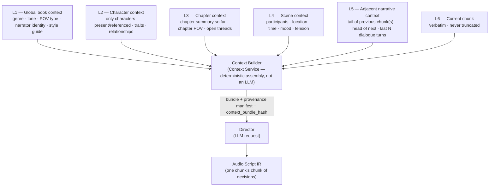
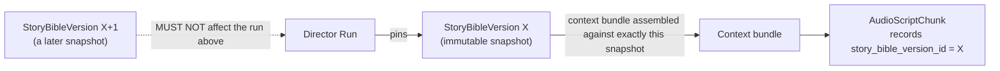
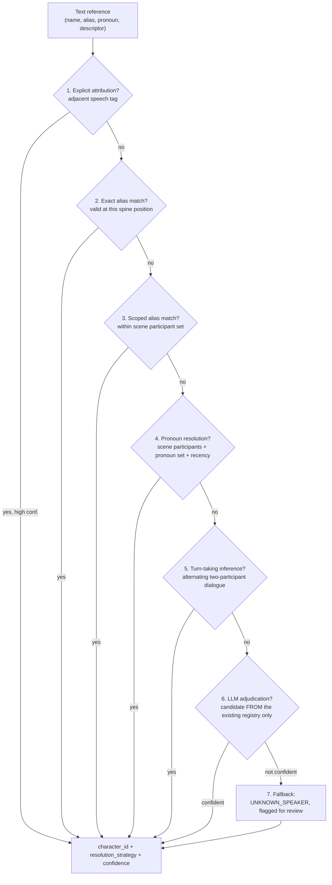
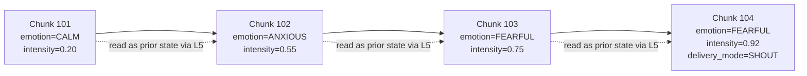
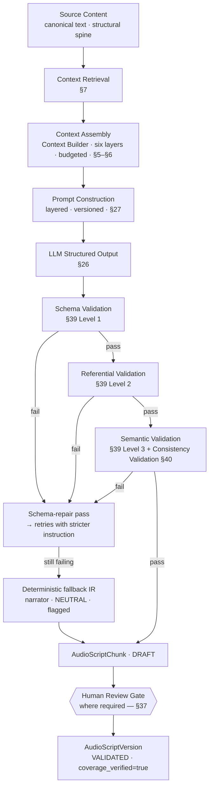
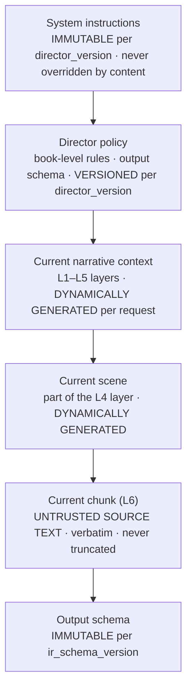
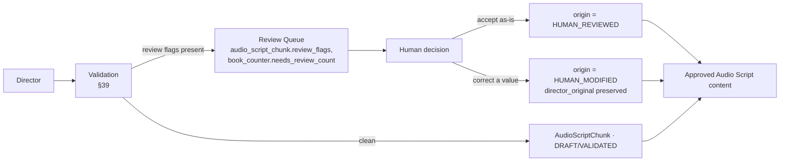
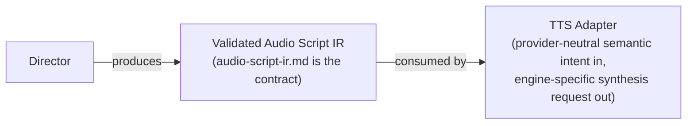

# Director Specification — Audiobook Production Platform

> **Document type:** Architecture Contract (Tier 2 — Director subsystem behavior)
> **Path:** `docs/architecture/director-specification.md`
> **Status:** DRAFT — pending human review
> **Doc version:** `director-spec.v1`
> **Owner:** Architecture
> **Derives from:** `context.md` (`context.v1`) §6, §7; reconciled against `database-schema.md`
>   (`db-schema.v1`), `event-contracts.md` (`events.v1`), `api-specification.md` (`api-spec.v1`),
>   `audio-script-ir.md` (`audio-script-ir.v1`)
> **Supersedes:** nothing (initial document)

---

## 0. How to read this document

This document is the **authoritative specification of the Director** — the long-form narrative
interpretation and audio-direction system that transforms source text plus persistent narrative
context into a validated Audio Script IR. `context.md` §26.1 rule 3 fixes its authority: this
document specifies Director *behavior* and may not contradict Tier 0 (`context.md`) or Tier 1
(`database-schema.md`, `event-contracts.md`, `api-specification.md`). Two narrow exceptions are
delegated to this document explicitly by higher-tier contracts, and this document is the sole
authority for them:

| Delegated to this document | Source of the delegation |
| --- | --- |
| The `emotion` closed vocabulary | `context.md` §6.3; `audio-script-ir.md` §17.2, marked **blocking** |
| The numeric bounds and quantization step for `pacing`, `pitch`, `volume` (and, by the same
  mechanism, `emotion_intensity`, `confidence`, and scene `tension`) | `context.md` §6.3;
  `database-schema.md` §5.5 |
| The `relationship_type` closed vocabulary | `context.md` §5.2; `database-schema.md` §6 row 22,
  §24 |

Modal words carry the meanings of `context.md` §0: **MUST** is non-negotiable, **SHOULD** is a
strong default requiring a documented reason to deviate, **MAY** is genuinely optional.

This document stops short of implementation. It contains **no LLM client code, no prompt text,
no Python or TypeScript, no API routes, no worker code, no queue implementation, no database
migrations, no Prisma schema, and no frontend code.** It is written so that a Director
implementation can be built and reviewed against it, and so that a reviewer can tell whether an
implementation is faithful.

**Authority.** `context.md` is Tier 0 and supreme. `database-schema.md`, `event-contracts.md`,
and `api-specification.md` are Tier 1. `audio-script-ir.md` and this document are Tier 2 peers:
`audio-script-ir.md` owns the IR's concrete schema; this document owns the Director's decision
process, its inputs, its pipeline, its versioning discipline, and (per the delegation above) the
two vocabularies and the numeric ranges the IR schema needed but could not define itself. Where
this document appears to disagree with a higher tier, the disagreement is reported in §60, never
silently resolved (`context.md` §28 rule 13).

---

## 1. Director purpose

> The Director is a **long-form narrative interpretation and audio-direction system** that
> transforms source text plus contextual narrative state into a structured, validated,
> provider-neutral Audio Script IR.

For every span of a book, the Director answers:

| Question | Answered by |
| --- | --- |
| WHO is speaking? | Speaker resolution (§12–§14), Character resolution (§11) |
| WHAT is being said? | A verbatim slice of canonical text (§23) |
| Is this narration, dialogue, thought, or non-verbal content? | Narrative-mode classification (§15–§17) |
| HOW should it be performed? | Performance direction (§18–§21) |
| WHAT emotional state is appropriate? | Emotion detection and continuity (§18) |
| WHAT pacing is appropriate? | Pacing (§19, §4.3) |
| WHICH character identity is involved? | Character resolution (§11) |
| WHICH voice profile should eventually be used? | Voice binding resolution (§45.3) — the Director
  resolves and records it; it does not create or approve it |
| WHAT pronunciation guidance is required? | Pronunciation analysis (§22) |
| WHERE does this content belong in the narrative? | Provenance and ordering (`audio-script-ir.md`
  §33, §35) |

The Director **MUST NOT** generate final audio (`context.md` §6.5). It **MUST NOT** depend on one
specific TTS engine — its output is provider-neutral semantic intent, consumed by an adapter it
never addresses directly (`context.md` §10.2, §24.3).

---

## 2. Responsibility boundary

### 2.1 Director owns

Semantic interpretation · speaker resolution · narrative-mode classification (narration /
dialogue / internal thought) · dialogue segmentation · character resolution (in cooperation with
the Character Service, §11) · emotion inference and continuity · delivery direction (delivery
mode, pacing, pitch, volume) · pause intent · emphasis · pronunciation hints · non-verbal
annotation · scene interpretation for performance purposes · contextual continuity across chunks
· Audio Script IR generation · confidence scoring · uncertainty detection and review flagging.

### 2.2 Director does not own

| Not owned | Owned by |
| --- | --- |
| Raw document extraction, OCR | Parser Service (`context.md` §3.2.6) |
| Structural analysis (chapters, sections, paragraphs) | Parser Service / Book Service |
| Scene *boundary* detection | Narrative Understanding, upstream of the Director (§33) |
| Character *identity* (canonical rows, aliases, merges) | Character Service (§11, §35) |
| Voice *identity* (which timbre a profile has) | Voice Service (`context.md` §9) |
| Audio synthesis | TTS subsystem (GPU workers) |
| GPU inference of any kind | TTS subsystem |
| Audio normalization, pause rendering, crossfade | Audio Processing Service |
| Chapter/audiobook assembly | Audio Assembly Service |
| Object storage implementation | Storage plane |
| Final audiobook encoding | Audio Assembly Service |

This mirrors `context.md` §1.4's stage table verbatim; nothing in this document narrows or widens
it.

---

## 3. Inputs

### 3.1 Input catalogue

| Input | Required / Optional | Retrieved | Persisted | Immutable for a run |
| --- | --- | --- | --- | --- |
| `BookVersion` (canonical text, structural spine) | **Required** | Pinned at request time | Yes (upstream) | Yes — pinned |
| `Chapter` / `Section` / `Scene` / `Paragraph` rows | **Required**, scoped to the request | Relational, via Book Service read model | Yes (upstream) | Yes |
| Normalized text (`paragraph.text`) | **Required** | Included in the scoped rows above | Yes | Yes — verbatim slice |
| `StoryBibleVersion` | **Required** | Pinned at request time (§9) | Yes (upstream) | Yes — pinned |
| `NarrativeState` snapshot(s) covering the scope | **Required** | Retrieved via the Context Service bundle (§5) | Yes (upstream, immutable snapshots) | Yes |
| Character Registry entries for characters present/referenced in scope | **Required** | Retrieved via Character Service resolution (§11.2) or the context bundle's L2 layer | Yes (upstream) | Read-only to the Director |
| Voice assignment / `VoiceProfileVersion` binding | **Required** at IR-write time, **optional** earlier | Resolved via the Voice Service internal binding endpoint (`api-specification.md` §17.3) | Yes (upstream) | The resolved version is pinned into the chunk once written |
| Previous relevant Audio Script context (adjacent chunks, prior Director decisions) | **Required** for continuity | The L5 adjacent-narrative layer of the context bundle | Yes (upstream) | Read-only |
| Director `ModelVersion` | **Required** | Configured/selected at request time | Yes | Yes — pinned |
| Director configuration (`director_version`: prompt template set, post-processing logic, validation rules) | **Required** | Configured/selected at request time | Yes | Yes — pinned |
| Audio Script IR schema version | **Required** | Configured | Yes | Yes — pinned |
| Pronunciation lexicon (book-scoped) | Optional (present if any entries exist) | Relational, via Story Bible | Yes (upstream) | Snapshot-scoped |
| Look-ahead text (bounded) | Optional | The L5 layer's bounded forward window (§33.4) | No — not persisted separately | N/A |

### 3.2 What is dynamically retrieved versus what is pinned in the request

A Director request (the `generate_director_ir` command, `event-contracts.md` §11.7) **pins**
every version-bearing input explicitly: `book_version_id`, `story_bible_version_id`,
`director_version`, `director_model_version_id`, `ir_schema_version`, `source_content_hash`. The
Director resolves nothing itself — per `event-contracts.md` §15.1, *"a command pins every version
it depends on; a worker resolves nothing."* Everything else — the actual text, the actual context
bundle contents, the actual character and voice bindings — is **retrieved dynamically** at run
time, scoped by those pins, through the synchronous internal APIs of `api-specification.md` §17
(Context Service, Character Service, Voice Service).

---

## 4. Closed vocabularies

This section discharges the two delegations of §0. Nothing here may be treated as provisional by
an implementation — `audio-script-ir.md` §64 OQ-IR-1 names this the **blocking dependency** for
Director implementation, and this section resolves it.

### 4.1 `emotion` — the closed vocabulary

Seventeen members. Sixteen are the recommended set `audio-script-ir.md` §17.3 offered as a
*proposal*; this document adds **`GRIEF`** and adopts the result as **authoritative**:

```
NEUTRAL    HAPPY      SAD        GRIEF      ANGRY      FEARFUL    SURPRISED  DISGUSTED
EXCITED    CALM       TENSE      ANXIOUS    SOMBER     CONFIDENT  UNCERTAIN  PLAYFUL
SERIOUS
```

Rationale for each design choice:

- **`NEUTRAL` is mandatory and is the deterministic fallback value.** `context.md` §21 row 5
  requires a fallback IR of *"narrator voice, neutral emotion"* when the Director cannot produce
  valid output; without `NEUTRAL` the fallback would be unexpressible. `NEUTRAL` is therefore the
  only member every provider adapter **MUST** map `NATIVE` (§39 semantics carried from
  `audio-script-ir.md` §39.2) — an adapter that cannot render *some* neutral baseline cannot render
  anything.
- **`GRIEF` is added, resolving `audio-script-ir.md` §63.3 IR-18.** `context.md` §6.3's own
  worked example uses `emotion=grief`. `SAD` is a general negative-valence register; `GRIEF` is
  specifically bereavement- or loss-triggered sorrow, textually and performatively distinct (a
  flatter affect, slower pacing, often suppressed rather than expressed — compare a character who
  is merely `SAD` about rain to one who is `GRIEF`-stricken at a deathbed). Distinguishing them
  costs one enumeration member and resolves a standing contradiction between `context.md`'s
  worked example and every candidate vocabulary discussed so far.
- **No more than seventeen.** `context.md` §6.3: *"Do not blindly create hundreds of emotions.
  Every member must be mappable by every provider adapter... An emotion no engine can express and
  no reviewer can distinguish is validation surface without audible benefit."* This set spans the
  register space an audiobook needs — basic affect (`HAPPY`/`SAD`/`ANGRY`/`FEARFUL`/`SURPRISED`/
  `DISGUSTED`), arousal states (`EXCITED`/`CALM`/`TENSE`/`ANXIOUS`), and narrative registers that
  are not basic emotions but are load-bearing for prose performance (`SOMBER`/`CONFIDENT`/
  `UNCERTAIN`/`PLAYFUL`/`SERIOUS`) — without combinatorial sprawl.
- **`emotion_secondary` remains not adopted** in `ir.v1.0`, per `audio-script-ir.md` §17.5
  (OQ-IR-2). This document does not revisit that deferral; it is an IR-schema decision, not a
  vocabulary decision, and nothing here depends on it.

Extension is governed by `audio-script-ir.md` §17.6 and §42: adding a member is additive (MINOR);
removing or renaming one is Breaking and requires a migration statement in `audio-script-ir.md`
Appendix B; changing a member's meaning while keeping its name is forbidden outright.

### 4.2 `delivery_mode` — confirmed, not redefined

`context.md` §6.2 already fixes eight members verbatim, and `database-schema.md` §24 stores them
as a native enum. This document does **not** own this vocabulary — it is fixed at Tier 0 — but
confirms it as the one the Director targets, with no local variant:

```
NORMAL · INTERNAL_THOUGHT · WHISPER · SHOUT · LAUGHING · CRYING · SINGING · READING_ALOUD
```

`audio-script-ir.md` §18.2 already reconciled the commissioning brief's larger proposed set
against these eight (`BREATHLESS`, `URGENT`, `TIRED`, `DRAMATIC`, `MONOTONE` express through
`emotion` + pacing/pitch/volume/pauses; `FORMAL`/`CASUAL` are character speech traits, §21;
`SARCASTIC` is an emotional register). §20 of this document restates the Director-facing
consequence of that split: **`delivery_mode` says how the voice is physically produced; `emotion`
says what is felt; `pacing`/`pitch`/`volume` say the shape.** The Director must never collapse
these three axes into one decision.

### 4.3 Numeric ranges — bounds and quantization

`context.md` §6.3 assigns pacing to the closed-enumeration set alongside emotion and delivery
mode. `audio-script-ir.md` §19.2 (recorded as **IR-7**) finds this to contradict five other
places in the same document family — §6.2 and §7.2 of `context.md` itself, plus
`api-specification.md` §12.3, plus `database-schema.md` §5.5 — all of which treat `pacing` as a
bounded **float**. This document, which `context.md` §6.3 names as the owner of "the closed
enumerations," resolves the question the delegation actually poses: **`pacing`, `pitch`, and
`volume` are bounded numeric multipliers/offsets, not enumerations.** `context.md` §6.3's
inclusion of pacing in the enumeration sentence is treated here as the error `audio-script-ir.md`
already identified, and is listed again in §60.2 of this document rather than silently corrected
in place, per `context.md` §27's change-control discipline — this document does not have the
authority to edit `context.md`.

| Field | Bounds | Neutral / baseline value | Quantization step | Notes |
| --- | --- | --- | --- | --- |
| `pacing` | `[0.50, 2.00]` | `1.00` = the voice's baseline rate | `0.01` | See semantic bands below |
| `pitch` | `[-1.00, 1.00]` | `0.00` = the voice's natural pitch | `0.01` | Relative hint; §19.2 |
| `volume` | `[-1.00, 1.00]` | `0.00` = neutral gain | `0.01` | A performance hint, not the final mix (`audio-script-ir.md` §21.3) |
| `emotion_intensity` | `[0.00, 1.00]` | — (required every chunk) | `0.01` | How strongly the emotion is felt, orthogonal to volume (§18.3) |
| `confidence` / `decision_confidence.*` | `[0.00, 1.00]` | — | `0.01` | §36 |
| `emphasis.strength` | `[0.00, 1.00]` | — | `0.01` | Owned structurally by `audio-script-ir.md` §24; shares this document's quantization rule |
| `non_verbal.intensity` | `[0.00, 1.00]` | — | `0.01` | Owned structurally by `audio-script-ir.md` §27; shares this document's quantization rule |
| `scene_semantics.tension` | `[0.00, 1.00]` | — | `0.01` | `database-schema.md` §5.5; informs pacing/emotion decisions (§18.4) |

**Why a single quantization step (`0.01`) for every bounded field.** A finer step buys no
audible or reviewable distinction and multiplies cache-key churn (`generation_params_hash`,
`context_bundle_hash` are downstream of these values indirectly via chunk content); a coarser
step (e.g. `0.05`) would visibly clip the emotional range a reviewer can see in the examples
already published in `audio-script-ir.md` §50 (values like `0.35`, `0.55`, `0.88`, `-0.05`). Two
decimal places is the smallest step consistent with every worked example in the IR specification.
The database stores the already-quantized value (`database-schema.md` §5.5: *"quantised at the
application edge... storing the quantised value keeps hashing stable"*) — quantization is a
**Director-side** obligation, applied before the value is written.

**Semantic bands (presentation only, never the stored value)** — `audio-script-ir.md` §19.3,
restated as authoritative here since this document owns the range:

| Label | Band |
| --- | --- |
| `VERY_SLOW` | pacing ≤ 0.75 |
| `SLOW` | 0.75 – 0.92 |
| `NORMAL` | 0.92 – 1.08 |
| `FAST` | 1.08 – 1.25 |
| `VERY_FAST` | pacing ≥ 1.25 (bounded overall at 2.00) |

A UI **MAY** render these bands. The Director **MUST** reason about and emit the numeric value;
a prompt that asks the model to choose among band labels and then maps labels to numbers is
permitted as an internal prompting strategy but the **persisted and validated value is always the
number** — never the label.

### 4.4 `relationship_type` — the closed vocabulary

`context.md` §5.2 requires the Story Bible to track *"typed, directional, time-scoped edges"*
between characters (`ALICE →protects→ BEN`, from ch.3). `database-schema.md` §6 row 22 and §24
name `character_relationship.relationship_type` as *"a closed set owned by
`director-specification.md`."* This document fixes it:

```
FAMILY · ROMANTIC · FRIENDSHIP · RIVALRY · ADVERSARIAL · MENTOR · PROFESSIONAL
AUTHORITY · ALLIANCE · BETRAYAL · UNKNOWN
```

| Member | Meaning |
| --- | --- |
| `FAMILY` | Blood or legal kinship |
| `ROMANTIC` | Romantic or marital involvement, current or past |
| `FRIENDSHIP` | Voluntary affinity, non-romantic |
| `RIVALRY` | Competitive, not necessarily hostile |
| `ADVERSARIAL` | Antagonistic; opposed goals |
| `MENTOR` | Directional — one party guides or teaches the other (direction is carried by the edge, not the type) |
| `PROFESSIONAL` | Colleague, employer/employee, transactional |
| `AUTHORITY` | Directional power asymmetry not covered by `MENTOR` (ruler/subject, captor/captive) |
| `ALLIANCE` | Cooperative toward a shared goal, not necessarily affectionate |
| `BETRAYAL` | A directional edge recording that one party betrayed the other — time-scoped, and does not retroactively replace an earlier edge (a `FRIENDSHIP` edge can be superseded by, not overwritten by, a later `BETRAYAL` edge, preserving the arc) |
| `UNKNOWN` | Relationship exists (co-occurrence, textual reference) but its nature has not been confidently classified — never omitted in favor of guessing |

Each edge is **directional** (`database-schema.md` §10.4) and **time-scoped** — the same pair of
characters may hold different edges valid over different spine ranges, and the Director **MUST**
read relationship context for the current spine position, never a single "current" relationship
divorced from where the story has reached. This is what lets a betrayal in chapter 30 change how
dialogue in chapter 31 is performed without corrupting the reading of chapter 5.

This vocabulary is used by the Director as **input context** (L2 of the context bundle,
`context.md` §5.4) to inform emotion, speech style, and speaker-resolution decisions (§11.4); the
Director does not write relationship edges directly — Narrative Understanding does, upstream
(§33) — but reads them and, where a scene's text asserts a change, MAY emit a Story Bible delta
proposing a new edge, subject to the same non-negotiable identity rules as character extraction
(§35).

---

## 5. Context assembly pipeline

### 5.1 The governing constraint

> **The Director MUST NOT send the entire book to the LLM for any request.**

`context.md` §5.4 fixes the mechanism: a Director request is served a **six-layer, budgeted,
provenance-bearing context bundle**, assembled by the Context Service and retrieved
synchronously on the Director's critical path (`api-specification.md` §17.1). This document does
not redefine the bundle — `context.md` §5.4 and `database-schema.md` §11 already own it — but
fixes how the Director **consumes** it.



### 5.2 What each layer contributes to a Director decision

| Layer | Feeds which Director decisions |
| --- | --- |
| L1 | Baseline register for narration (§20.1); default POV/tense assumptions for narrator detection (§16); global pronunciation defaults |
| L2 | Character resolution candidates (§11); persistent speech-style traits (§21); relationship context for emotion and delivery (§4.4, §18) |
| L3 | Chapter-level open threads that bear on tension and pacing; whether the current chunk continues or resolves a chapter-level arc |
| L4 | Scene participants (constrains character resolution, §11.3); scene mood/tension (informs default emotion baseline, §18.4); POV holder for narrator identity (§16) |
| L5 | Dialogue-attribution continuity (turn-taking, §14.2); emotional continuity (§18.2); bounded look-ahead for retrospective attribution correction (§33.4) |
| L6 | The only content that is ever rendered — inviolable, never truncated (`context.md` §5.4 rule 1) |

### 5.3 What the Director does not receive

Full chapter text beyond L5's bounded window; the whole Story Bible; raw model responses from a
previous run; unbounded character rosters (L2 is capped and ranked, §6.3); vector search results
without structural ranking applied first (§7.3). A Director prompt that would need any of these
to make a decision it is actually required to make is a signal that the context-retrieval design
is wrong, not that the Director should be handed more text.

---

## 6. Context budget

### 6.1 Budget as fractions, not fixed token counts

The Director **MUST NOT** hard-code one model's context window. `context.md` §5.4 gives typical
**budget shares**, which this document adopts as the Director-facing contract — the Context
Service computes the actual token allotment per layer as `share × (model_context_window −
reserved_output_allowance − safety_margin)`:

| Layer | Typical budget share | Eviction priority |
| --- | --- | --- |
| System instructions (Director policy, output schema) | fixed overhead, not a layer share — see §6.2 | never evicted |
| L1 — Global book context | ~5% | last (never evicted) |
| L2 — Character context | ~20% | high value, evicted by importance rank × recency × presence |
| L3 — Chapter context | ~10% | medium |
| L4 — Scene context | ~15% | high value |
| L5 — Adjacent narrative context | ~20% | high value (attribution depends on it) |
| L6 — Current chunk | remainder (~30%) | never evicted |

### 6.2 The complete budget, including what §5.4 leaves implicit

`context.md` §5.4 specifies the six content layers; it does not separately budget the Director's
own system instructions or its output allowance, both of which consume real tokens against the
same window. This document makes the complete accounting explicit:

```
model_context_window
  − reserved_output_allowance   (bounded by the IR chunk's expected size, §6.3)
  − safety_margin               (a fixed reserve against tokenizer estimation error)
  = usable_input_budget
      − system_instructions      (Director policy; fixed, versioned, §27.1)
      − L1..L5 content layers    (per the shares above)
      = L6 allotment              (must be ≥ the chunk's actual size, or the chunk is split, §6.4)
```

`system_instructions` is **not** a content layer and is never evicted or budgeted as a fraction —
it is the fixed cost of telling the model what it is (§27) and is measured, not estimated, per
`director_version` at configuration time.

### 6.3 Output budget

The reserved output allowance is sized to the **largest single chunk's IR representation** the
Director may emit in one response, plus headroom for structured-output overhead (field names,
JSON punctuation). Because a chunk's `text` is already bounded by the target provider's
`max_input_chars` (`audio-script-ir.md` §10.3), the IR chunk's serialized size is itself bounded —
well under the IR's documented 4 KB target (`event-contracts.md` §13.6). Where the Director emits
several chunks in one structured response (a bounded batch, §33.2), the output allowance scales
linearly with the batch size, and the batch size is itself a configuration knob bounded by the
model's usable output budget — never assumed unbounded.

### 6.4 When the bundle does not fit

`context.md` §5.4 rule 1 is absolute: **L6 is inviolable. If the bundle does not fit, the chunk
is split, never truncated.** `api-specification.md` §17.1 gives the mechanical form: the Context
Service returns `409 CHUNK_SPLIT_REQUIRED` rather than a truncated bundle, and chunk boundary
selection then follows `audio-script-ir.md` §10's semantic-chunking rules (never a fixed-width
split, always at a permitted boundary). A Director implementation **MUST NOT** implement its own
truncation fallback "just for this one long chunk."

### 6.5 Different models, different capacities

Because the budget is fraction-based and the split-not-truncate rule is absolute, a Director
configured against a 8K-token local model and one configured against a 200K-token hosted model
apply the **same policy** with different absolute numbers. Neither is a special case; a
`director_version` bound to a small-context model will simply chunk more finely and evict L2/L3
more aggressively, which is a quality/cost tradeoff recorded in that `director_version`'s
configuration, not an architectural difference.

---

## 7. Context retrieval

### 7.1 Sources

| Source | Kind | Used for |
| --- | --- | --- |
| Relational database (PostgreSQL) | Deterministic, structural | Scene participants, chapter summaries, character traits, relationship edges, pronunciation lexicon, prior Audio Script chunks — everything with a stable, queryable identity |
| Story Bible fact tables | Deterministic, structural | Global book context (L1), character context (L2), scene semantics (L4) |
| `NarrativeState` snapshots | Deterministic, immutable point-in-time | The authoritative "what is true right now" answer (§10) |
| Character Registry | Deterministic, structural | Reference resolution (§11.2) |
| Previous Audio Script chunks | Deterministic, structural, bounded window | L5 adjacent context (§5.2) |
| Vector index (pgvector, over scene/paragraph summaries) | Semantic, ranked | Only "what else is relevant" *after* structural retrieval has run (§7.3) |

### 7.2 Do not introduce a vector database because this is an AI system

`context.md` §23 explicitly rejects a dedicated vector database for v1, and §5.3 fixes pgvector,
co-located in PostgreSQL, as the only semantic index. This document does not revisit that
decision. The question this section actually answers — because the task explicitly requires it —
is narrower: **when, if ever, does the Director's context retrieval need semantic search at
all**, given that most of what a Director request needs is already addressable structurally
(this scene's participants, this chapter's summary, this character's traits — all foreign-keyed,
not fuzzy)?

### 7.3 When semantic retrieval is justified

| Retrieval need | Deterministic path exists? | Verdict |
| --- | --- | --- |
| "Who is present in this scene?" | Yes — `scene_semantics.participant_character_ids` | Relational. No vector search. |
| "What does this character sound like?" | Yes — `character.speech_traits` | Relational. |
| "What happened in this chapter so far?" | Yes — `narrative_summary` at `CHAPTER` level | Relational. |
| "What is Alice's canonical pronunciation?" | Yes — `pronunciation_entry` | Relational. |
| "Is there a relevant earlier scene that establishes tone for a callback the current text is making, but no explicit cross-reference exists in structured facts?" | **No** — this is a recall problem, not a lookup problem | **Semantic retrieval justified** |
| "Which earlier passages discuss this recurring motif/object, when the motif has not been extracted as a structured `narrative_object`?" | No | **Semantic retrieval justified**, bounded and ranked below structural results |

`context.md` §5.4 rule 3 is the binding rule: **retrieval is hybrid, structural results always
outrank semantic results.** The Director's context builder therefore runs structural lookups
first, fills the layer budget from them, and only consults the vector index for the *narrow*
class of "is there something relevant I don't have a foreign key to" queries — chiefly:
unresolved thread call-backs (§10.5), and motif/tone continuity beyond what `scene_semantics` and
`narrative_summary` already capture. Semantic results are **capped, ranked below structural
results, and never allowed to displace a structural fact from the budget** (§6.1's eviction
priority already encodes this: L2/L4, which are structural, are evicted by importance rank before
anything semantic is added).

### 7.4 What this means in practice

For the overwhelming majority of chunks — ordinary narration and dialogue with resolvable
speakers in a scene whose participants and mood are already recorded — **the Director's context
retrieval is 100% relational** and never touches the vector index. Semantic retrieval is a
narrow, optional enrichment for the harder minority of chunks (unreliable narration, deferred
foreshadowing payoff, thematic echoes), and its absence degrades quality gracefully rather than
blocking generation — a bundle missing a semantic enrichment is not `degraded` in the
`context.md` §3.2.10 sense (that term is reserved for a *structural* layer being unavailable);
it is simply a bundle that used less context than it might have.

---

## 8. Long-form memory

### 8.1 The problem this section solves

A book is far larger than any context window, and narrative meaning is cumulative
(`context.md` §5.1). The Director must maintain continuity across Chapter 1 through Chapter N
**without** sending all previous text to the model on every request. The mechanism is: nothing is
"remembered" by the model between calls; every call is stateless and fully specified by its
bundle; statefulness lives in PostgreSQL (`context.md` §5.6). This section names the six memory
categories the Director draws on and what belongs in each.

### 8.2 The six categories


| Category | Contents | Source table(s) | Scope | Volatility |
| --- | --- | --- | --- | --- |
| **Global memory** | Genre, tone, POV type, narrator identity, style guide, global pronunciation defaults | `story_bible`, `story_bible_version` (§9) | Whole book | Rare — set early, rarely revised |
| **Character memory** | Identity, aliases, pronouns, speech traits, relationships, arc summary to date | `character`, `character_alias`, `character_relationship`, `narrative_summary` (character-scoped) | Per character | Incremental — grows as the character appears more |
| **Scene memory** | Current local context: participants, location, in-story time, mood, tension | `scene_semantics` | Per scene | Local — replaced each scene |
| **Narrative state** | Current POV, current scene, active characters, current location, timeline position, emotional atmosphere, previous speaker, recent interaction, unresolved threads | `narrative_state` (immutable snapshots) | Point-in-spine | Snapshotted at scene and chapter boundaries (§9.3) |
| **Audio performance memory** | Relevant previous delivery decisions — the emotional/pacing trajectory a scene or character is currently on | The L5 layer's prior-chunk performance fields, plus optional `continuity` metadata (`audio-script-ir.md` §37.4) | Bounded window (last N chunks/turns) | Per chunk, consumed then superseded by the next chunk's own recorded state |
| **Unresolved references** | Entities whose identity or context remains uncertain — `PROVISIONAL` characters, `UNKNOWN_SPEAKER` bindings, low-confidence resolutions | `character.status = PROVISIONAL`, `audio_script_chunk.review_flags` | Whole book, until resolved | Resolved by human review or later evidence; never silently discarded |

### 8.3 State required to understand the current chunk vs. state that persists forward

This distinction matters because conflating them causes either context bloat (persisting
everything) or continuity loss (persisting nothing).

| | Required to understand the current chunk | Persists into future narrative context |
| --- | --- | --- |
| **Nature** | A *read* — retrieved fresh per request from the six categories above | A *write* — a delta proposed by this run, applied by the Story Bible (§9.4) |
| **Examples** | This scene's participant list; the previous chunk's emotional state; the character's established speech register | A new fact learned in this chunk (a relationship changed; a location was named for the first time); an emotional-state update that becomes the new "recent" baseline for the next chunk |
| **Who applies it** | The Context Builder, at retrieval time | Narrative Understanding / the Story Bible enrichment job (`build_story_bible_delta`), **not the Director directly** — the Director proposes, does not commit (§35.3) |
| **Failure mode if conflated** | Treating a write as already-true context would let a single Director run's guess contaminate every subsequent chunk's retrieval before human or systematic confirmation | Treating a read as a fact to persist would duplicate the Story Bible's existing facts into the IR, which §36.3 of `audio-script-ir.md` forbids |

---

## 9. Story Bible usage

### 9.1 A pinned version for every deterministic generation

Every `generate_director_ir` and `revise_director_ir` command carries an explicit
`story_bible_version_id` (`event-contracts.md` §15.3). The Director **MUST** use that exact
snapshot for the whole run and **MUST NOT** re-resolve "the current Story Bible" mid-run, even if
a newer snapshot becomes available while the run is in flight.



### 9.2 Reproducibility consequence

A later Story Bible version **MUST NOT** silently affect an existing Director run
(`event-contracts.md` §15.3). This is enforced in four layers, restated from the Tier 1 contracts
because the Director is the component obligated to honor them: the command pins the snapshot id;
the Context Service's bundle retrieval is called *with* that id; the resulting
`context_bundle_hash` is written onto every chunk so the exact fact set used is identifiable
after the fact; and `audio_script.story_bible_version_id` is `ON DELETE RESTRICT`, so a snapshot
referenced by a Director run can never be removed out from under it.

### 9.3 Snapshot boundaries

`NarrativeState` snapshots are written at scene boundaries, with chapter boundaries as a coarser
checkpoint (`context.md` §5.3). The Director consumes the snapshot that covers its current spine
position; it does not itself decide when a new snapshot is warranted — that is Narrative
Understanding's responsibility, upstream (§33).

### 9.4 The Director proposes, the Story Bible commits

The Director **MAY** produce Story Bible deltas as a side effect of a run (a newly noticed
relationship, a refined character trait) but these are proposals routed through the same
`build_story_bible_delta` mechanism Narrative Understanding uses (`context.md` §3.2.7,
`event-contracts.md` §11.6) — the Director does not write directly to Story Bible tables, and does
not write `CONFIRMED` facts unilaterally (§35.3).

---

## 10. Narrative state

### 10.1 Loaded

Read from the `NarrativeState` snapshot covering the current spine position, via the context
bundle's L4 (current scene) and L5 (adjacent) layers (§5.2). Never re-derived by the Director from
raw text — the snapshot is authoritative.

### 10.2 Updated

Narrative state is **not mutated in place** — it is immutable once written (`context.md` §4.2
#13, `database-schema.md` §11.5: `I` — immutable). An update is a **new snapshot**, written by
Narrative Understanding at the next scene/chapter boundary, informed in part by facts the
Director's run may have surfaced (§9.4).

### 10.3 Versioned and persisted

Every snapshot carries its own identity and is retained permanently (`context.md` §4.5: never
mutated after creation). The Director's run records which snapshot it used
(`story_bible_version_id` — the snapshot chain lives under the Story Bible version, per
`database-schema.md` §11.5).

### 10.4 Associated with a Director run

Every `AudioScript` and every `AudioScriptChunk` records the `story_bible_version_id` it was
generated against (§9.1). There is no separate `narrative_state_id` field on the chunk —
`NarrativeState` is a component *of* the Story Bible snapshot the chunk already pins, not an
independent lineage axis, and introducing one would duplicate what `story_bible_version_id`
already anchors.

### 10.5 Examples of narrative-state content the Director reads

Current POV holder; current scene id and its participants; current location; the book's timeline
position (in-story time, not spine position); the emotional atmosphere established by the last
several chunks; the previous speaker (for turn-taking inference, §14.2); the most recent
interaction between the current chunk's participants; and open, unresolved threads relevant to
the current scope — used to modulate tension and to avoid a chunk delivering dramatic irony the
narrative state says the reader/listener should not yet perceive.

---

## 11. Character resolution

### 11.1 Extraction versus resolution

`context.md` §8.1 is categorical: **names are not identities.** This document distinguishes two
operations that must never be collapsed:

| | **Character extraction** | **Character resolution** |
| --- | --- | --- |
| Question | "Is there a character-shaped entity here I haven't seen before?" | "Which *known* character does this specific reference mean?" |
| Owner | Narrative Understanding (upstream of the Director, §35) | **The Director**, in cooperation with the Character Service |
| Output | A `PROVISIONAL` candidate with evidence | A stable `character_id`, or a sentinel, with a recorded strategy and confidence |
| Frequency | Once per genuinely new identity | Every reference in every chunk |
| Creates rows? | Yes — `character` rows | **No** — resolution never creates a `Character` (§11.6) |

The Director **does not repeatedly recreate the Character Registry** during chunk processing
(`context.md` §44 topic). It resolves against a registry that Narrative Understanding has already
populated, upstream.

### 11.2 The resolution call

The Director resolves a surface form via the Character Service's internal endpoint
(`api-specification.md` §17.2: `POST /internal/v1/books/{bookId}/characters/resolve`), which must
be fast and is cached per book. This is a **synchronous call on the Director's critical path**,
permitted under `context.md` §24.1 because it is a fast, cached lookup — never an LLM call itself.

### 11.3 The ordered resolution strategy

`context.md` §8.3 fixes seven ordered strategies, and the Director **MUST** use them in this
order, stopping at the first confident match, and **MUST** record which strategy produced the
result:



Strategies 1–5 are deterministic and require no LLM call; strategy 6 is where the Director's LLM
is actually consulted, and even then it selects **only from candidates the registry already
contains** — it never invents a name. Strategy 7 is a legitimate, expected outcome, not a
failure state (§13).

### 11.4 Signals used, beyond name matching

Aliases (with their type, scope, and validity range, `database-schema.md` §10.2) · relationships
(§4.4, to disambiguate "his sister" against the scene's participant set) · scene context (the
participant list bounds strategies 3–5) · grammatical clues (pronoun gender/number against the
character's recorded pronoun set) · the previous speaker (turn-taking, strategy 5) · narrative
context (POV, whether the current passage is the POV character's own perception) · the Story
Bible (traits and established relationships that make one candidate more plausible than another
when strategy 6 is reached).

### 11.5 Non-negotiables

- **The resolver MUST NOT invent a new `Character`** to make an ambiguity go away
  (`context.md` §8.3). A genuinely new identity is Narrative Understanding's job (§35), not a
  resolution-time decision.
- **Confidence below the configured threshold MUST produce a review flag**, even when a candidate
  was chosen (`context.md` §8.3; thresholds in §13.3).
- **Resolution results are cached per book** and invalidated on any alias or merge change
  (`context.md` §8.3) — the Director consumes this cache, it does not maintain its own.

### 11.6 Resolution never mutates the registry

A Director run reads the Character Service; it does not write `Character` or `CharacterAlias`
rows. Where a chunk's text implies a new alias ("she is called the Queen now"), the Director
**MAY** surface this as a candidate delta for Narrative Understanding / Character Service
confirmation — the same proposal-not-commit discipline as §9.4 — never as a direct write.

---

## 12. Speaker detection

### 12.1 The classes

`audio-script-ir.md` §11.1 fixes `speaker_type` at four values, and the Director targets exactly
these — it does not introduce a fifth:

```
NARRATOR · CHARACTER · SYSTEM · UNKNOWN
```

| Class | When the Director assigns it |
| --- | --- |
| `NARRATOR` | The narrating voice for the current POV/register, resolved to the `NARRATOR` sentinel or a narrator-capable character (§16) |
| `CHARACTER` | Dialogue or internal thought, resolved to a real, non-sentinel `character_id` |
| `SYSTEM` | Non-narrative material — headings, front matter, footnotes, chapter titles (§17.3) |
| `UNKNOWN` | Attribution failed after the full resolution strategy (§11.3, §13) |

### 12.2 Dialogue boundary detection

Given:

```
"Where are you?"

Alice looked toward the door.

"I don't know," Bob replied.
```

the Director **MUST** produce separate speaker-resolved segments — a chunk boundary is mandatory
at every speaker change (`audio-script-ir.md` §10.2 rule 1). The mechanical signal is quotation
marks and paragraph structure (already normalized and hence reliable, per `context.md` §14.1's
unbalanced-quote QC check), but the *semantic* attribution — whose line the first, unattributed
quotation belongs to — requires the resolution strategy of §11.3, most often strategy 4 or 5 here
(pronoun/turn-taking), since there is no adjacent speech tag on the first line.

### 12.3 Worked example, resolved

| Text | `speaker_type` | `character_id` | Strategy |
| --- | --- | --- | --- |
| `"Where are you?"` | `CHARACTER` | Resolved via turn-taking against the scene's two-participant set and the previous speaker in narrative state | `TURN_TAKING` or `LLM_ADJUDICATION` if the two-participant assumption doesn't hold |
| `Alice looked toward the door.` | `NARRATOR` | The `NARRATOR` sentinel | N/A — narration, not attribution |
| `"I don't know," Bob replied.` | `CHARACTER` (for the quoted line) + `NARRATOR` (for the tag) | Bob (explicit attribution) / `NARRATOR` sentinel | `EXPLICIT_ATTRIBUTION` |

Note the third line becomes **two chunks** (quoted speech, then the speech tag as narration),
exactly as `audio-script-ir.md` §6.2's worked example establishes — this is not special-cased
per line, it is the standard boundary rule applied uniformly.

---

## 13. Dialogue attribution

### 13.1 Attribution patterns

| Pattern | Example | Attribution mechanism |
| --- | --- | --- |
| Trailing tag | `"Hello," Alice said.` | `EXPLICIT_ATTRIBUTION` — the tag directly follows |
| Leading tag | `Alice said, "Hello."` | `EXPLICIT_ATTRIBUTION` |
| Deferred tag | `"Hello."\n\nAlice smiled.\n\n"How are you?"` | The first line requires look-ahead or turn-taking (§13.2); the smile-beat is narration; the second line inherits the established speaker unless the text signals otherwise |
| Non-speech attribution | `"Don't touch that!"\n\nThe voice behind him was unmistakable.` | The speaker is established **indirectly** — the narration confirms identity without naming it. Requires scene-participant context (who is "unmistakable" here) and, commonly, strategy 6 (LLM adjudication against the registry) |

### 13.2 Using surrounding context, and bounded look-ahead

Where the immediate preceding text underspecifies the speaker, the Director **MAY** use bounded
look-ahead (§33.4) — the following sentence often disambiguates:

```
"Don't move."

John raised the gun.
```

Here the second line retrospectively confirms John as the likely speaker of the first. The
Director's context bundle's L5 layer already includes a **bounded** forward window for exactly
this purpose (`context.md` §5.4 defines L5 as covering "the head of the following chunk" as well
as the tail of the preceding one). This is look-ahead **within an already-retrieved bundle**, not
an unbounded scan forward through the chapter.

### 13.3 Confidence thresholds

Illustrative defaults — the concrete numbers are **configuration**
(`deployment-architecture.md`), not fixed by this document, per the same discipline `context.md`
and its peers apply throughout:

| Band | Illustrative threshold | Behavior |
| --- | --- | --- |
| High confidence | `confidence ≥ 0.85` | Automatic — proceeds without a review flag |
| Medium confidence | `0.50 ≤ confidence < 0.85` | Proceeds, but carries `review_flags += LOW_CONFIDENCE` and counts toward `low_confidence_chunk_count` |
| Low confidence | `confidence < 0.50`, or resolution exhausted all seven strategies | `speaker_type = UNKNOWN`, bound to `UNKNOWN_SPEAKER`, `review_flags += UNKNOWN_SPEAKER` |

This is the Director-facing restatement of `audio-script-ir.md` §31.3's bands, which this
document is the natural place to make concrete because the thresholds gate a *Director* decision.

---

## 14. Ambiguous speakers

### 14.1 States, not a forced guess

The Director **MUST** represent uncertainty explicitly rather than force an arbitrary character
id when confidence is low. The states, mapped onto the fields the IR already carries
(`audio-script-ir.md` §11, §31):

| Conceptual state | IR expression |
| --- | --- |
| `RESOLVED` | `speaker_type = CHARACTER`, `character_id` set, `confidence` above the high threshold, no review flag |
| `LOW_CONFIDENCE` | `speaker_type = CHARACTER`, `character_id` set to the best candidate, `review_flags += LOW_CONFIDENCE` |
| `AMBIGUOUS` | Equivalent to `LOW_CONFIDENCE` where the ambiguity is specifically *between two or more named candidates* rather than a general uncertainty — the Director records the chosen candidate and its confidence; it does not encode "candidate A or B" as a data value, because the IR has no field for a set of speakers (`audio-script-ir.md` §9.5: one chunk, one speaker) |
| `UNKNOWN` | `speaker_type = UNKNOWN`, `character_id = UNKNOWN_SPEAKER` sentinel, `review_flags += UNKNOWN_SPEAKER` |

### 14.2 Behavior per state

```
high confidence   → automatic processing (no gate)
medium confidence → proceeds; flagged for human review; review is advisory, not blocking
                     (per audio-script-ir.md §46.2, only the casting gate is mandatory in v1)
low confidence    → UNKNOWN_SPEAKER binding; narrator-voice fallback at render time
                     (context.md §21 row 6); never blocks TTS for the whole book
```

The task brief's suggested behavior of *"low confidence → block TTS until resolved"* is
**deliberately not adopted** as a hard block: `context.md` §21 row 6 and
`audio-script-ir.md` §11.3 both specify that an unresolved reference renders with the narrator
voice as a documented fallback and is **not blocked** — a single unresolved line must not stop a
book. What *does* block is the `unknown_speaker_rate` validation gate (§14.3) when the **rate**
across a scope exceeds a tolerated threshold — a systemic problem, not one hard line.

### 14.3 The book-level circuit breaker

`unknown_speaker_rate` above a tolerated threshold **is** a hard Director validation failure
(`context.md` §14.2, `audio-script-ir.md` §41.4) — the difference between "this chunk is
ambiguous" (fine, flagged, proceeds) and "this run is systematically confused" (blocked, because
proceeding would produce an audiobook that is wrong throughout, not just imperfect at the margins).
Illustrative threshold: **2%** of chunks in scope — configuration.

---

## 15. Speaker confidence

### 15.1 Two related but distinct confidence values

| Field | Meaning | Where recorded |
| --- | --- | --- |
| `speaker_confidence` | How confident the Director is in *who* is speaking | `decision_confidence.speaker` (`audio-script-ir.md` §31.2) |
| `character_resolution_confidence` | How confident the Character Service's resolution call was in mapping a surface form to a stable id | Returned by the resolve endpoint (`api-specification.md` §17.2), folded into `speaker_confidence` where the Director's own judgment agrees, or lowered where the Director has independent reason to doubt it |

These are **not** always identical: the Character Service might return a high-confidence exact
alias match, but the Director's broader context might contain a contradiction (e.g., the scene
participant set the resolution call used is stale relative to a mid-scene entrance/exit the
current chunk's text just described). The Director's emitted `speaker` confidence is the
**composite** judgment, and the resolution call's confidence is one input to it, not a
pass-through.

### 15.2 Normalized ranges

Both values live on `[0.00, 1.00]`, quantized per §4.3's rule. A confidence score is only
meaningful because it feeds a defined consequence (§13.3, §14.3); a confidence value the pipeline
never branches on is not computed (`audio-script-ir.md` §31.5 — pacing/pitch/volume deliberately
carry no confidence for exactly this reason, and speaker resolution follows the opposite,
justified path: it has three defined consequences, so it carries one).

---

## 16. Narrator detection

### 16.1 The default, and the exception

Narrative text carries `speaker_type = NARRATOR` **unless** the Director has explicitly
identified another voice (`audio-script-ir.md` §29.1). There is no render-time inference — the
Director resolves narrator identity once, per chunk, at generation time.

### 16.2 The identity model

The narrator is **never** `character_id = null` — it is the reserved `NARRATOR` sentinel
`Character` row, or, for multi-narrator books, a narrator-capable `Character` (§16.4). Narrator
voice resolution therefore uses the **same code path** as character voice resolution
(`audio-script-ir.md` §12.1) — no special case.

### 16.3 Working across narrative modes

The Director must correctly classify narration across every mode a book may use, using the L1
(global POV type) and L3/L4 (chapter/scene POV holder) context layers rather than assuming a
default:

| Mode | What the Director must get right |
| --- | --- |
| First-person narration | The narrator **is** a character (often the protagonist); their narration chunks are `speaker_type = NARRATOR`, `character_id` = that character's row, **and** their in-scene dialogue chunks are `speaker_type = CHARACTER`, same `character_id` — same person, different narrative function, and the Director must not conflate the two functions into one speaker_type |
| Third-person limited | `speaker_type = NARRATOR`, bound to the `NARRATOR` sentinel (or a narrator-capable character in an unusual case); emotional coloring should reflect the POV character's perspective (an angry POV character's narration reads differently from a calm one's, even though the narrator is not speaking as that character) |
| Third-person omniscient | `speaker_type = NARRATOR`; the sentinel; no POV-character coloring bias — the register is even across characters by default |
| Unreliable narrator | Still `speaker_type = NARRATOR`; the Director does **not** editorialize by shifting delivery to signal unreliability unless the text itself does (e.g., contradicting itself) — the Director performs what is on the page, it does not add a directorial layer of "and by the way, don't trust this" that the author did not write |
| Quoted speech within narration (a character reading a letter aloud, a story-within-a-story) | The quoted material is a **separate chunk boundary** (`READING_ALOUD` delivery mode where a character reads aloud; `NARRATOR` if the frame narrator is presenting the embedded text) |
| Embedded quotations (a character's dialogue quoting another person) | Nested — the outer quotation is the speaking character's `CHARACTER` chunk; the inner quoted words remain part of that same chunk's text (they are still that character speaking, just relaying someone else's words) unless the inner quotation is long enough and distinct enough to warrant its own chunk under the ordinary boundary rules |

### 16.4 Multiple narrators

Multiple narrators are ordinary `Character` rows flagged `narrator_capable`, with a
per-chapter/scene narrator binding held in `NarrativeState.pov_character_id`
(`context.md` §8.2, `database-schema.md` §10.1/§11.5). The Director resolves which narrator is
active for the current scope from that field — **no IR change is required**
(`audio-script-ir.md` §12.2), and the Director does not itself decide who narrates; it reads the
decision Narrative Understanding/the Story Bible has already recorded.

### 16.5 Do not assume third-person means neutral

A third-person narrator is not, by default, emotionally flat. §16.3's `THIRD_LIMITED` row and
§20 (contextual delivery) both apply to narration exactly as they apply to dialogue —
`audio-script-ir.md` §29.2 makes this explicit and this document does not weaken it: *"A system
that treated narration as a neutral default would produce the flat, machine-read quality
`context.md` §1.2 exists to avoid."*

---

## 17. Internal thought and non-verbal content

### 17.1 Internal thought

Three distinct things, expressed with two orthogonal fields per `audio-script-ir.md` §28.1:

```
Narration          "She wondered whether he was lying."      is_dialogue=NARRATION
Spoken dialogue     "Are you lying to me?"                     is_dialogue=DIALOGUE
Internal thought    Maybe he knows.                             is_dialogue=INTERNAL_THOUGHT,
                                                                  delivery_mode=INTERNAL_THOUGHT
```

**Whose thought.** `speaker_type = CHARACTER` with the *thinking* character's `character_id` —
never the narrator's, even when a third-person-limited narrator is the one reporting it in prose
(`audio-script-ir.md` §28.3). The Director must decide, per passage, whether text is *reported*
thought (narration: "she wondered whether...") or *rendered* thought (the character's own
interior voice: "Maybe he knows.") — these become different chunks with different speakers, and
the distinguishing signal is almost always syntactic (reported thought is embedded in a narrating
sentence with a reporting verb; rendered thought stands alone, often in present tense or free
indirect style).

**Voice strategy is explicit, never assumed.** The Director does not assume internal thoughts
automatically use a different voice profile (`audio-script-ir.md` §28.2). The default is *same
voice, different delivery* (`voice_profile_version_id` unchanged, `delivery_mode =
INTERNAL_THOUGHT`); a dedicated "inner voice" `VoiceProfileVersion` is a legitimate production
choice but requires an explicit `VoiceAssignment` with `role = ALTERNATE` — the Director consumes
that binding if the Voice Service has established it, it does not invent an alternate voice
unilaterally.

### 17.2 Non-verbal expressions

Detected classes: laughing · crying · sighing · gasping · groaning · breathing heavily ·
screaming · whispering. The Director does **not** write markers into `text`
(`audio-script-ir.md` §27.1 — this would break the coverage invariant and is structurally
forbidden). Non-verbal content becomes one of:

| Representation | When |
| --- | --- |
| `delivery_mode` (`WHISPER`, `SHOUT`, `LAUGHING`, `CRYING`) | The expression *is* the manner of production for spoken content — e.g. a whispered line |
| `non_verbal[]` annotation, offset-scoped, on a chunk that also carries speech | The expression accompanies speech without replacing it — "said, laughing" |
| A dedicated non-verbal-only chunk (`text = ""`, one `non_verbal[]` entry) | The expression stands alone with no accompanying speech — a paragraph that is just a sigh |

The Director selects among these based on whether the text describes the expression as
co-occurring with speech, replacing speech, or standing alone — never by defaulting to one
representation for every case. See `audio-script-ir.md` §27.3–§27.4 for the field shapes; this
document does not redefine them.

---

## 18. Emotion detection and continuity

### 18.1 Sources, not punctuation alone

Emotion is derived from lexical content, dialogue context, action, scene mood (`scene_semantics`,
L4), character personality (established traits, L2), previous emotional state (narrative state,
§10.5), and narrative context — **never from punctuation alone**. `"Fine."` may be angry, sad,
resigned, or neutral depending on context; the Director must use the surrounding scene and
character history to decide, not the presence or absence of an exclamation point.

### 18.2 Continuity across chunks

Emotion does not reset every chunk. Given a progression like `calm → worried → frightened →
panicked` across consecutive chunks, the Director derives each chunk's emotional state from
`previous_state + current_scene + current_text`, never treating each chunk as an independent
classification problem. Mechanically: the L5 context layer's prior-chunk performance fields (and,
where present, the optional `continuity` object, `audio-script-ir.md` §37.4) are read as input;
the resulting `emotion`/`emotion_intensity` for the current chunk is chosen to be a **plausible
next step** from that trajectory, not an independent draw.



Each chunk remains **independently renderable** — the progression lives in the per-chunk values
themselves, never in an inference the TTS worker would have to make (`audio-script-ir.md` §37.3).
A TTS worker infers nothing; the Director has already encoded the arc.

### 18.3 Emotion, intensity, and volume are three different axes

Restated from `audio-script-ir.md` §21.1–§21.2 because the Director is the component that must
actually keep them separate at decision time:

```
A terrified whisper     volume=LOW      emotion=FEARFUL   intensity=HIGH
Suppressed grief         volume=LOW      emotion=GRIEF     intensity=HIGH
A furious shout          volume=HIGH     emotion=ANGRY     intensity=HIGH
A bored announcement      volume=HIGH     emotion=NEUTRAL   intensity=LOW
```

The Director must never let a single "how big is this feeling" judgment collapse `volume` and
`emotion_intensity` into one value — a suppressed, quiet grief and a bored, loud announcement
would otherwise become indistinguishable at the acoustic-loudness axis alone.

### 18.4 Scene tension as a modulating input

`scene_semantics.tension` (§4.3) is read, not written, by the Director as a baseline modulator:
a high-tension scene raises the floor on `emotion_intensity` and lowers the floor on `pacing`
even for chunks whose own text is comparatively plain, and a low-tension scene does the reverse —
this is what keeps a scene's overall performance coherent even where individual sentences, read
in isolation, would not obviously signal the scene's register.

---

## 19. Performance direction

### 19.1 The full field set

For every chunk, the Director determines: `emotion`, `emotion_intensity` (§18); `delivery_mode`
(§4.2); `pacing`, `pitch`, `volume` (§4.3, §19.2); `pauses[]` (§19.3); `emphasis[]` (§19.4);
`pronunciation_hints[]` (§22); `non_verbal[]` (§17.2). Every field's semantic vocabulary and type
is fixed by `audio-script-ir.md`; this document does not create a second, incompatible taxonomy —
it is the Director's obligation to **populate** the IR's fields correctly, not to invent parallel
ones.

### 19.2 Pacing inference

Pacing is derived from more than sentence length: sentence structure (short clipped sentences
during action read faster; long flowing sentences read slower), punctuation (as a weak signal
only — see §22.4 of `audio-script-ir.md`, "do not rely on punctuation for important dramatic
timing," which applies equally to pacing as to pauses), scene tension (§18.4), the emotional
state just derived (§18), and character behavior (a habitually terse character's dialogue is
paced differently from a habitually verbose one's, per persistent speech traits, §21). Sentence
length alone is a poor proxy — a short sentence can be a slow, weighted dramatic beat
(`"He was dead."`) or a fast interjection (`"Move!"`); pacing must be decided from the same
composite context that decides emotion, not from a character count.

### 19.3 Pause detection

Explicit pauses (`audio-script-ir.md` §22) are inserted for: dramatic revelation, speaker
transition (mandatory `LEADING` pause with `kind = SPEAKER_TRANSITION`, per `audio-script-ir.md`
§30.4), hesitation, emotional breakdown, scene transition, an ellipsis in the source text, and a
paragraph transition. The Director does **not** insert a dramatic pause everywhere a full stop
appears — that would defeat the whole purpose of explicit pause direction, which exists precisely
because punctuation-derived timing is not reliable enough for moments that matter
(`audio-script-ir.md` §22.4). A pause is inserted when the *narrative* moment calls for held
silence, not when the *punctuation* permits one.

### 19.4 Emphasis detection

Considered signals: lexical emphasis (a word the prose itself marks as stressed, via italics
surviving into normalized text as a structural cue, or via repetition — `"No. No, no, no."`),
capitalization (used sparingly and only where the source text itself uses it meaningfully, never
invented by the Director), punctuation (exclamation as a weak signal, same caveat as §19.3),
semantic importance (a plot-critical word or revealed name), and dialogue context (a word a
character is specifically contradicting or correcting). Emphasis is always emitted as an
offset-scoped span (`audio-script-ir.md` §24), never as markup in `text`.

---

## 20. Contextual delivery

### 20.1 Identical text, different performance

The same line of text can require materially different delivery depending on context — this is
the central reason the Director cannot be a text-to-tag lookup and must reason over the assembled
context bundle for every chunk.

```
"Come here."
```

| Context | Delivery |
| --- | --- |
| A parent to a frightened child after a nightmare | `emotion=CALM`, low intensity, gentle `volume` |
| A captor to a prisoner | `emotion=TENSE`/`SERIOUS`, threatening — reduced `pacing`, flat `pitch` |
| A commander in an emergency | `emotion=TENSE`, elevated `pacing` and `volume`, urgent |
| Whispered, in a scene of hiding | `delivery_mode=WHISPER`, low `volume`, high `emotion_intensity` |
| Playful, between established romantic partners | `emotion=PLAYFUL`, warm `pitch`/`volume` |

The Director derives the correct row from scene context (L4), character relationship (§4.4, L2),
narrative state (recent events, §10), and the immediately surrounding text — never from the three
words alone. This is precisely why L4/L5 exist in the context bundle and why they carry
comparatively large budget shares (§6.1).

### 20.2 The general principle

Any worked example of "identical text, different delivery" reduces to the same rule already
governing §18 and §19: the Director's decision function is
`f(text, scene_context, character_context, narrative_state, prior_performance)`, never
`f(text)` alone. A Director implementation that can be shown to produce the same performance for
the same words regardless of context has failed this specification, regardless of how plausible
any single output looks in isolation.

---

## 21. Speech style persistence

### 21.1 Traits live in the Character Registry, not per chunk

Character speech style (formal, casual, sarcastic, hesitant, confident, reserved, aggressive,
polite) is **persistent** and is read from `character.speech_traits`
(`database-schema.md` §10.1), populated by Narrative Understanding and refined over the book's
length — the Director does not rediscover a character's personality from scratch on every chunk.
This is the mechanism that keeps a formal character reading as formal in chapter 30 as in chapter
2 without the Director having to re-derive it from local text alone each time.

### 21.2 How traits modulate decisions

Speech traits are a **prior**, not an override: a habitually sarcastic character's baseline
`emotion` selection is biased toward registers compatible with sarcasm (`PLAYFUL`, `SERIOUS` with
restrained intensity, rarely `EXCITED`) and their default `pacing` may run faster or more clipped
than a hesitant character's, whose baseline instead favors more `pauses[]` and slightly reduced
`pacing`. The **current line's actual content and scene context still govern** — a normally
confident character can be written as frightened in a specific scene, and the Director must let
the local evidence override the prior where the text clearly calls for it. Traits set the
starting point; they do not lock the outcome.

---

## 22. Pronunciation analysis

### 22.1 What the Director identifies

Names · locations · foreign words · abbreviations · acronyms · technical terminology · invented
words · historical terms · homographs (words whose pronunciation depends on sense or part of
speech, e.g. "lead" the metal vs. the verb).

### 22.2 Two tiers, and the Director's role in each

`audio-script-ir.md` §25.1 fixes two tiers; the Director is the producer of both:

| Tier | Director action |
| --- | --- |
| **Book lexicon** (`pronunciation_entry`, book-wide) | The Director (or, more precisely, Narrative Understanding acting on the Director's behalf during early-book scanning) proposes a lexicon entry the first time a pronunciation-sensitive proper noun or invented word is encountered. Once present, every later chunk's Director run references it via `lexicon_key` rather than re-deciding the pronunciation |
| **Span hints** (per-chunk, `pronunciation_hints[]`) | The Director emits these for contextual, one-off disambiguation — a homograph resolved by *this* sentence's grammar, not by a book-wide rule |

### 22.3 The Director does not modify source text unnecessarily

Pronunciation guidance is **metadata**, never a rewrite of `text`
(`audio-script-ir.md` §25.3, `context.md` §6.4). "Worcestershire" stays "Worcestershire" in every
chunk that contains it; the guidance travels beside the text, addressed by offset.

### 22.4 Abbreviations and acronyms — two treatments, a Director decision

| Treatment | When | Mechanism |
| --- | --- | --- |
| Pronunciation hint | The abbreviation is spoken as written — as a word or as letters ("NASA", "Dr." left as an initialism in some styles) | `pronunciation_hints[]` |
| `spoken_text` expansion | The abbreviation is read as its expansion — "Dr." → "Doctor" | `audio-script-ir.md` §34.2, with `text` retained unchanged and the substitution list recorded |

The Director chooses per the book's configured style and the local context (a title before a name
is usually expanded; a well-known acronym usually is not); either is legitimate, and the choice
must be recorded, never ambiguous between the two mechanisms for the same span.

---

## 23. Text integrity

### 23.1 The mandatory rule

> **The Director MUST NOT hallucinate or rewrite the book.**

This is the single most safety-critical property of this specification, and it is enforced
structurally, not merely by instruction (§24).

### 23.2 `source_text` versus `tts_text`

| Concept | IR field | Mutability |
| --- | --- | --- |
| `source_text` | `text` — the verbatim canonical slice | **Immutable from creation.** A text change is a new chunk, never an edit (`audio-script-ir.md` §7.1) |
| `tts_text` | `spoken_text` (nullable — `null` means "use `text`") | Immutable from creation; produced only via a documented, reversible, span-preserving substitution list (`audio-script-ir.md` §34.2) |

### 23.3 Permitted transformations

Whitespace normalization · punctuation normalization (both already applied upstream by the
Normalizer — the Director does not re-normalize) · safe, configured-class abbreviation expansion
(into `spoken_text`, §22.4) · segmentation (splitting into chunks at permitted boundaries,
`audio-script-ir.md` §10.2) · pronunciation annotation (§22) · emphasis/pause/non-verbal
annotation (all offset-scoped, never inline).

### 23.4 Forbidden, without exception in v1

Inventing dialogue · summarizing · paraphrasing literary content · omitting meaningful text ·
adding explanatory content — **unless an explicit, user-controlled mode allows it**, and no such
mode exists in `ir.v1.0` or is proposed by this document. If a future product requirement
introduces one (an abridged-narration mode, for instance), that is a Breaking, explicitly
change-controlled addition to `audio-script-ir.md` and this document together (§28.1 rule 8 in
§60's implementation rules already forbids building it speculatively now).

---

## 24. Text integrity validation

### 24.1 Checks, and what each catches

| Check | Catches | Mechanism |
| --- | --- | --- |
| **Source hash** (`source_content_hash`) | Any drift between what a chunk claims to render and the actual source paragraph text | Verified against `paragraph.content_hash` (`context.md` §18.9 rule 5) |
| **TTS text hash** (component of `generation_params_hash`) | A performance-text change with an unchanged source (e.g., abbreviation-expansion configuration changed) | `audio-script-ir.md` §34.4 |
| **Token/span comparison** | Silent alteration within a span | Offset validation against `[0, len(text)]`, non-overlap (`audio-script-ir.md` §41.3) |
| **Coverage invariant** | Missing text (omission), duplicated text (double-render), reordered text | Chapter-level concatenation of chunk `text` must reconstruct canonical text exactly (`context.md` §14.2) — a hard database check constraint, not a convention (`database-schema.md` §13.1) |
| **Missing-text detection** | The same as coverage, from the gap-count side | `coverage_gap_count = 0` required for `state = VALIDATED` |
| **Unexpected-addition detection** | The same, from the overlap/extra side | `coverage_overlap_count = 0` required for `state = VALIDATED` |

### 24.2 What happens on a violation

If the Director's output would change text unexpectedly, the system **MUST NOT** silently accept
it. The outcome is one of:

```
REJECT                → schema/semantic validation failure; enters the repair/retry chain (§39)
HUMAN_REVIEW_REQUIRED  → a review flag is attached; the chunk still enters DRAFT/VALIDATED state
                          but is surfaced for inspection before it is trusted
```

There is no third path. A text-integrity violation is never silently accepted into a `VALIDATED`
script — the coverage check constraint makes this physically impossible at the database layer,
which is the strongest available guarantee (`audio-script-ir.md` §6.5, §34.3).

---

## 25. The Director pipeline



Every stage:

1. **Source Content** — the scoped, canonical, structural input (§3).
2. **Context Retrieval** — resolves the six-layer bundle's content from relational and (where
   justified) semantic sources (§7).
3. **Context Assembly** — the Context Service builds the budgeted, hashed bundle (§5–§6); this
   stage is deterministic and is **not** an LLM call.
4. **Prompt Construction** — the layered, versioned prompt is assembled from the bundle plus fixed
   Director policy (§27).
5. **LLM Structured Output** — the one and only model call in the pipeline; returns structured
   data, never prose (§26).
6. **Schema Validation** — syntactic correctness (§39.1).
7. **Semantic Validation** — referential integrity, ranges, coverage, consistency (§39.2–§39.3,
   §40).
8. **Human Review Gate** — where confidence or validation results warrant it (§37); advisory, not
   blocking, except for the casting gate which is not a Director-owned gate at all
   (`audio-script-ir.md` §46.2).
9. **Audio Script Version** — the resulting, versioned, immutable IR artifact.

---

## 26. Structured LLM output

### 26.1 The mandate

The Director **MUST** use structured output. `context.md` §18.9 rule 3: responses are
*"validated against a strict schema with closed vocabularies. Anything else is a validation
failure."* Free-form natural-language output is **never** parsed into IR
(`audio-script-ir.md` §41.2).

```
LLM → structured JSON conforming to the ir.vMAJOR.MINOR schema → schema validation
    → semantic validation → Audio Script IR
```

### 26.2 Why, beyond correctness

The Director's LLM has **no tools, no network access, and no database write access**
(`context.md` §18.9 rule 2). It returns data; the Director *service* decides what to persist.
This is a security property as much as a correctness one (§51): a compromised or hallucinating
model can degrade one chunk's quality; it cannot reach any other part of the system, because it
has nothing to reach with.

### 26.3 Preferred conceptual flow

Function-calling / tool-use style structured output, or a strict JSON-mode response validated
against a JSON Schema, are both acceptable **implementation** choices — this document does not
mandate a specific provider mechanism, because doing so would violate the model-abstraction
principle of §31. What is mandated is the shape of the contract: the model's response is treated
as **untrusted structured data**, validated in full (§39) before it becomes IR, never executed,
never trusted by construction.

---

## 27. Director prompt architecture

### 27.1 Layers



| Layer | Immutable / Versioned / Dynamic |
| --- | --- |
| System instructions | **Immutable** within a `director_version`; versioned across `director_version`s |
| Book-level rules / Director policy | **Versioned** — part of `director_version`'s bundle |
| Current narrative context (L1–L5) | **Dynamically generated** per request by the Context Builder |
| Current scene | **Dynamically generated**, part of L4 |
| Current chunk (L6) | **Dynamically generated** (it is the scoped source text), but its *content* is untrusted data, never instruction (§51) |
| Output schema | **Immutable** within an `ir_schema_version`; versioned across schema versions |

### 27.2 Do not build one enormous static prompt

The Director **MUST NOT** construct a single static prompt containing the entire book, or even
the entire chapter. The layered structure above, combined with the budgeted context bundle (§5–
§6), is the whole point: system instructions and policy are the only static parts, and even those
are versioned artifacts rather than one immutable monolith glued to the narrative content.

### 27.3 Separation is the prompt-injection defense

The layering in §27.1 is not merely organizational — it is the mechanism by which untrusted book
text is prevented from being interpreted as instruction (§51). System instructions and Director
policy occupy a structurally distinct region from the narrative-content layers; a well-formed
Director implementation places the untrusted content in clearly delimited, labeled regions the
model is instructed (at the system-instruction layer) to treat as data.

---

## 28. Prompt versioning

### 28.1 What is versioned, and how it is named

Every Director generation identifies:

```
director_prompt_version    — subsumed within director_version, never a separate field
director_policy_version     — subsumed within director_version, never a separate field
audio_script_schema_version — the IR schema version (ir.vMAJOR.MINOR)
```

`context.md` §6.6 and `audio-script-ir.md` §8.3 already settle this precisely: `director_version`
identifies the **whole decision-making bundle** — prompt template set, post-processing logic,
validation rules, and the LLM `ModelVersion` — as a single label. This document does **not**
introduce separate `director_prompt_version` or `director_policy_version` fields, because doing
so would create two sources of truth for the same fact and permit the inconsistent state
"same `director_version`, different prompts" that `audio-script-ir.md` §8.3 explicitly forbids.

### 28.2 Changing the prompt creates a new configuration

Changing any part of the bundle — the prompt template set, the post-processing logic, the
validation rules, or the pinned model — **requires a new `director_version` label**. Production
prompts are never silently altered under an existing label; doing so would make every artifact
already produced under that label unexplainable, which violates the reproducibility contract of
§29.

---

## 29. Model versioning

### 29.1 Every run identifies a `ModelVersion`

Every Director run records `director_model_version_id`, resolving to an immutable
`model_version` row (`database-schema.md` §14.3) that carries provider, model, version, and a
`params_fingerprint`. The currently-deployed LLM is **never assumed equivalent** to the model used
previously — a worker (or, here, the Director's inference call) that resolved "whichever model
happens to be installed" would produce artifacts whose lineage is a function of when they ran,
which `event-contracts.md` §15.6 forbids categorically.

### 29.2 What is recorded

Provider (a stable abstraction id, never a hostname, §31.1) · model identifier · version ·
quantization or build variant, where relevant (carried in `model_version.config`,
`database-schema.md` §14.3) · inference configuration (temperature, top-p, and any other sampling
parameters, recorded as part of the `director_version` bundle's configuration, §30). If the
pinned model version is not loadable at run time, the job **fails terminally** — it does not fall
back to a similar model, because a fallback would produce audio whose lineage is a lie
(`event-contracts.md` §15.6).

---

## 30. Model abstraction

### 30.1 `DirectorModelProvider`

Mirroring the `TTSProvider` abstraction of `context.md` §10.2, the Director's business logic
addresses a conceptual interface, never a concrete SDK or hosting mechanism:

```
DirectorModelProvider
  id                       -> stable provider identifier (e.g. "vllm-local", "anthropic-api")
  capabilities()            -> { context_window_tokens, max_output_tokens,
                                  supports_structured_output, supports_json_schema,
                                  supports_seed, supports_logprobs, supports_streaming }
  generate(request)         -> { structured_output, tokens_in, tokens_out, latency_ms,
                                  finish_reason, seed_used, provider_metadata }
  health()                  -> { status, loaded_model, queue_depth }
```

A `DirectorRequest` is derived from the assembled context bundle plus the current chunk's scoped
text and the fixed Director policy — never from raw application state the provider would have to
reach for itself.

### 30.2 What must never leak outside the adapter

No component outside a `DirectorModelProvider` adapter may reference a provider-specific concept
— no `if (provider === 'anthropic')` in the Director's resolution logic, validation logic, or
orchestration code, mirroring `context.md` §10.2's rule for TTS verbatim. Provider-specific
request shaping (how a system prompt is passed, how structured-output mode is requested, how a
seed is set where supported) lives entirely inside the adapter.

### 30.3 The load-bearing test

Swapping the Director's LLM provider **MUST NOT** require a change to speaker resolution logic,
validation rules, the IR schema, or any downstream consumer. If it would, the abstraction has
been violated — the same test `context.md` §1.5 and `audio-script-ir.md` §38.6 apply to TTS
engines applies here to LLM providers.

---

## 31. Local vs API LLM

### 31.1 Both are supported by the same business contract

`context.md` §23 row 16 fixes the deployment posture: local via Ollama/vLLM in development (and
optionally production, for cost or privacy), hosted API in production, both behind one
`LLMProvider`-shaped interface — named `DirectorModelProvider` in this document's terms (§30).

| | Local inference (Ollama, vLLM, other self-hosted server) | API inference (external provider) |
| --- | --- | --- |
| Deployment | `worker-ai` process, optionally GPU-backed | `worker-ai` process makes outbound calls |
| Cost model | Fixed infrastructure cost, no per-token billing | Per-token billing |
| Data handling | Content never leaves the deployment's own infrastructure | Content is sent to a third party — governed by §53 |
| Determinism | May support pinned seeds and deterministic kernels | Provider-dependent; often weaker seed guarantees |
| Business contract | **Identical** — same `DirectorModelProvider` interface, same validation chain, same versioning discipline | **Identical** |

### 31.2 Only the adapter changes

Switching from a local model to an API model, or between two API providers, is a
`director_version` change (because the pinned model changes) implemented entirely behind the
`DirectorModelProvider` adapter (§30). No change to context assembly, speaker resolution,
validation, or the IR schema is permitted as a consequence of this switch.

---

## 32. Determinism

### 32.1 Reproducibility inputs

A Director result is reproducible — in the sense §32.3 makes precise — from:

```
BookVersion + StoryBibleVersion + NarrativeState (snapshot) +
Director model version + prompt/policy version (both subsumed in director_version) +
configuration + Audio Script schema version
```

Every one of these is pinned at request time, never resolved at generation time
(`event-contracts.md` §15.1, restated for the Director in §3.2). Where the underlying model
provider supports it, the generation seed is recorded alongside these inputs.

### 32.2 Sampling defaults

For structured extraction and direction, the Director **SHOULD** use deterministic or low-variance
inference — this is interpretation and direction, not creative generation. Illustrative defaults
(configuration, not fixed here): temperature at or near `0`, top-p near `1.0` with a low
temperature doing the real work, no frequency/presence penalties (they have no meaning for
structured extraction). The Director's job is not to be creative with the prose — the prose is
already written; its job is to decide, consistently, how the existing prose should be performed.
**Optimizing for creative text generation is out of scope** — nothing in the Director's sampling
configuration should be tuned the way a creative-writing assistant's would be.

### 32.3 Two honest levels of determinism, restated for the Director

Mirroring `context.md` §2.4 and `audio-script-ir.md` §43.3, applied to the Director specifically:

| Level | Guarantee |
| --- | --- |
| **Contract determinism (MUST)** | Identical lineage tuples (the pinned inputs of §32.1) are treated as describing the *same intended interpretation*; the system reuses an existing valid `AudioScriptChunk` for that lineage rather than regenerating (§43) |
| **Model determinism (SHOULD, not guaranteed)** | Where the provider supports seeding, the seed is pinned and recorded so a re-run is more likely to be similar. **LLMs are not deterministic at temperature > 0, and a pinned model version does not make them so** — re-running the Director may not produce byte-identical IR even with every input pinned |

What the recorded inputs guarantee is that a run is **explainable and re-derivable**, not that it
is byte-reproducible (`audio-script-ir.md` §43.4). This is why the IR is **retained**, never
silently regenerated on demand: the artifact is the record of what was actually decided, and
that record — not a promise of exact repeatability — is what reproducibility means here.

---

## 33. Director Run

### 33.1 Definition

A **Director Run** is a reproducible processing operation, identified by:

```
run_id                       (= the ProcessingJob id executing it)
book_version_id
story_bible_version_id
narrative_state (implied by the scope's covering snapshot(s))
director_model_version_id
director_version              (subsumes prompt_version and policy/configuration_version)
audio_script_schema_version    (ir_schema_version)
created_at
```

This maps directly onto the `generate_director_ir` command payload (`event-contracts.md` §11.7)
and the `audio_script` row's own fields (`database-schema.md` §13.1) — a Director Run is not a
new entity this document introduces; it is the conceptual name for the already-defined
combination of one `ProcessingJob` producing one `AudioScript` (or, for `revise_director_ir`, a
scoped set of chunk versions).

### 33.2 Relation to `ProcessingJob`

Every Director Run **is** a `ProcessingJob` of type `generate_director_ir` or
`revise_director_ir` (`context.md` §11.2). The Director does not maintain a parallel run registry
— `ProcessingJob` and `ProcessingAttempt` are the authoritative record (`context.md` §16.2), and
`AudioScript.job_id` links the produced artifact back to the run that produced it
(`database-schema.md` §13.1).

---

## 34. Chunk processing strategy

### 34.1 The hierarchy

```
Book
 ↓
Chapter                (structural + assembly scope)
 ↓
Scene                  (narrative scope — participants, mood, POV fixed once analyzed)
 ↓
Semantic windows        (the Director's working unit before final chunk boundaries settle)
 ↓
Audio Script chunks      (the atomic renderable unit)
```

Chunks are **not** processed each completely independently of its neighbors. Neighboring context
is provided via the L5 layer (§5.2), and neighboring *decisions* (the emotional/pacing
trajectory) are carried forward via the same mechanism (§18.2). What *is* independent, by design,
is **rendering** — once a scene's `NarrativeState` snapshot exists, every chunk in that scene can
be Director-processed in parallel (`context.md` §5.5's "snapshot-then-fan-out"), because the
context each one needs is already fixed by the snapshot and the bounded adjacent window, not by
sequential accumulation within the scene.

### 34.2 Look-behind / look-ahead

| | Scope | Purpose |
| --- | --- | --- |
| Look-behind | The tail of the preceding chunk(s), plus the last N attributed dialogue turns (L5) | Attribution continuity (§13), emotional continuity (§18.2) |
| Current | The chunk itself (L6), never truncated | The actual content to direct |
| Look-ahead | **Bounded** — the head of the following chunk (L5) | Retrospective attribution correction (§13.2) — e.g., a following sentence naming the speaker of a preceding unattributed line |

Look-ahead is **bounded**, never an unbounded scan forward through the chapter. `context.md`
§5.4's L5 layer already defines the bound; the Director does not request additional forward
context beyond what the bundle provides.

### 34.3 Chunk boundary correction

The Director **MAY** discover that parser-defined boundaries are poor for performance purposes —
a paragraph containing two speakers, or a dialogue exchange the structural spine left in one
block. It **MAY**:

| Action | Constraint |
| --- | --- |
| Split a chunk | Must fall on a permitted boundary (`audio-script-ir.md` §10.2); concatenation of the resulting chunks' `text` must still reconstruct the source exactly |
| Merge adjacent text into one chunk | Only same-speaker, same-delivery-mode text below the soft floor (`audio-script-ir.md` §10.5); never across a mandatory boundary (speaker change, scene change, chapter change, delivery-mode change) |
| Create speaker-specific chunks | This is the ordinary, expected outcome of dialogue segmentation (§12), not a special "correction" |
| Adjust scene boundaries | **No** — scene boundaries are owned by Narrative Understanding (§34.4), not by the Director |

All changes **MUST** preserve source provenance — every resulting chunk's `audio_script_chunk_source`
spans must still resolve to real paragraph offsets (`audio-script-ir.md` §33.3), and the coverage
invariant must still hold across the affected scope.

### 34.4 Scene detection: outside the Director

`context.md` §1.4 places scene segmentation in **Narrative Understanding**, a dedicated
structural-analysis stage upstream of the Director. The Director **refines scene interpretation
for performance purposes** (§20's contextual delivery reasoning operates within a scene's
established mood and participants) but is **not responsible for all document structure
extraction** — it does not decide where a scene begins or ends; it reads that decision from
`scene_semantics`/`scene` rows.

---

## 35. Character extraction versus resolution — conflict handling

### 35.1 Recap

§11.1 already distinguishes extraction (Narrative Understanding, upstream) from resolution (the
Director, per-reference). This section covers what the Director does when the two disagree.

### 35.2 Conflict resolution

Example: the Character Registry records `Alice = female` (from established textual evidence), and
the current chunk's local context contains an ambiguous reference that could plausibly be read
either way. The Director **MUST NOT** overwrite canonical character data merely because one
chunk's local context is uncertain (`context.md` §45's worked example, restated here as this
document's authority). The Director resolves the *reference* using the registry's existing,
canonical facts as ground truth; where the chunk's own evidence appears to genuinely contradict
the registry (not merely be locally ambiguous), the Director:

1. Resolves the reference to the best-supported existing candidate anyway (never invents a new
   identity to sidestep the contradiction, §11.5);
2. Attaches a review flag noting the apparent contradiction;
3. **MAY** propose a Story Bible delta (§9.4) for human or Narrative Understanding
   confirmation — it does not silently overwrite the registry.

### 35.3 Repeated recreation is forbidden

The Director does not repeatedly recreate the Character Registry during chunk processing. Every
resolution call reads the registry as it currently stands (cached per book, §11.5); the Director
never re-derives "who exists in this book" as part of ordinary per-chunk work — that is
Narrative Understanding's job, run once (incrementally, as the book is analyzed), not the
Director's job re-run per chunk.

---

## 36. Confidence — general framework

### 36.1 Where confidence is used

Recapping and consolidating §15 and `audio-script-ir.md` §31.5's restraint principle: confidence
is computed and recorded **only** where a downstream consequence exists —

| Decision | Confidence recorded? | Consequence if low |
| --- | --- | --- |
| Speaker/character resolution | Yes — `decision_confidence.speaker` | Review flag; `UNKNOWN_SPEAKER` fallback below threshold (§13.3–§14) |
| Emotion | Yes — `decision_confidence.emotion` | Review flag if very low; no hard block (emotion has no `UNKNOWN` state — `NEUTRAL` is always a safe, valid value) |
| Pronunciation | Yes — `decision_confidence.pronunciation` | Review flag; the span still renders (a wrong-but-plausible pronunciation is not blocking the way an unresolved speaker is) |
| Pacing, pitch, volume | **No** | Nothing downstream branches on it; a field nobody reads is a field that drifts (`audio-script-ir.md` §31.5) |

### 36.2 One required composite, plus optional per-decision detail

The chunk's `confidence` field is a single required composite (§4.3's range/step rules apply);
`decision_confidence` is an optional, additive object carrying the per-decision breakdown where
the Director can produce it (`audio-script-ir.md` §31.2). `confidence` is authoritative for
gating (§13.3, §14.3); `decision_confidence` is diagnostic.

---

## 37. Human review gates

### 37.1 Triggers

| Trigger | Configurable? |
| --- | --- |
| Low speaker confidence | Yes — threshold (§13.3) |
| `UNKNOWN` speaker | N/A — always flagged (never blocking on its own) |
| Voice mismatch (a chunk's language does not match the bound voice's supported languages) | N/A — blocks via `VOICE_LANGUAGE_MISMATCH`, a Voice-subsystem concern the Director's validation surfaces |
| Large text transformation (a `spoken_text` substitution list touching an unusually large fraction of the chunk) | Yes — threshold |
| Ambiguous emotion (low `decision_confidence.emotion`) | Yes — threshold |
| Unsupported performance instruction | N/A — surfaces as a `capability_gap` at TTS time, not a Director-time gate (`audio-script-ir.md` §39.3) — the Director does not know provider capability, by design (§30) |
| Conflicting character information | N/A — always flagged (§35.2) |

### 37.2 Human review is not required for every chunk

The architecture supports configurable thresholds precisely so that review effort is spent where
it matters. `audio-script-ir.md` §46.2 is explicit: **only the casting gate is mandatory** in v1
(every speaking character must have an `APPROVED` voice assignment before generation, and that
gate is owned by the Voice subsystem, not the Director). Audio Script review is available but
**advisory**, not blocking — a low-confidence chunk proceeds with a flag, not a stop.

### 37.3 Configurable thresholds

Every threshold named in §13.3, §14.3, and §37.1 is **configuration**
(`deployment-architecture.md`), consistent with how every other Tier 1/2 document in this system
treats numeric knobs: this document fixes the *shape* of each policy and the field it gates, not
the production number.

---

## 38. Review queue and human override

### 38.1 The workflow



There is no separate `ReviewItem` entity — `api-specification.md` OQ-3 fixes v1 review as flags
plus counters (`audio_script_chunk.review_flags`, `book_counter.needs_review_count`), and this
document does not introduce one. The "queue" is the filtered view
`GET /audio-script-chunks?has_review_flags=true` (`api-specification.md` §16.13).

### 38.2 Human corrections remain distinguishable from Director decisions

This is not optional and closes a real gap `audio-script-ir.md` §32.2 identifies in the current
IR contract: an in-place edit that does not preserve the original would destroy the Director's
decision. The mechanism (`audio-script-ir.md` §32.3–§32.6, restated here because the Director is
the producer of the original value being preserved):

| Field | Meaning |
| --- | --- |
| `origin` | `AUTO_GENERATED` (default) · `HUMAN_REVIEWED` (inspected, accepted, unchanged) · `HUMAN_MODIFIED` (at least one value changed) · `LOCKED` (frozen — the existing `state = LOCKED`, not a duplicate concept) |
| `director_original` | Only the fields a human changed, with their Director-produced values. **First original wins** — a second edit never overwrites it |
| `override` | `modified_by_user_id`, `modified_at`, `reason` (free text, untrusted, §51) |

### 38.3 Director Decision + Human Override = Final Resolved Decision

```
Director decided:  character_id = char_001     ← preserved in director_original
Human overrode:     character_id = char_002     ← the chunk's live character_id field

Resolved value the TTS worker receives:  char_002    (deterministic — no branch on origin)
Auditable original:                       char_001    (never lost)
```

No consumer branches on `origin` — every consumer reads the chunk's live fields regardless of
provenance, which is what keeps the resolved value deterministic. `origin` and `director_original`
exist for **audit**, not for runtime branching.

### 38.4 Human overrides are versioned and auditable

An `audit_log` row is written for every chunk-affecting user action (`database-schema.md` §17.1).
Where the override happens on an already-`LOCKED` chunk, it does not mutate the frozen chunk — it
creates a new chunk version with `supersedes_chunk_id` set, carrying `origin = HUMAN_MODIFIED` and
a `director_original` populated from the frozen chunk's values (`audio-script-ir.md` §32.7). The
original chunk and any audio it already produced are retained, never destroyed.

---

## 39. Output validation

Three levels, restated as the Director's own obligation because the Director is the producer the
validation chain protects the rest of the system from.

### 39.1 Level 1 — Schema validation

Correct structure: valid JSON conforming to the `ir.vMAJOR.MINOR` schema; all required fields
present and non-null; types exact, no coercion; enum values within the closed vocabularies (§4);
numeric ranges within the bounds of §4.3; identifiers well-formed; `text` non-empty (unless a
valid non-verbal-only chunk); span bounds and non-overlap; `text` within the target provider's
`max_input_chars`; unknown fields rejected (strict mode). Full table:
`audio-script-ir.md` §41.3.

### 39.2 Level 2 — Referential validation

IDs exist and versions are compatible: `character_id` exists and belongs to this book;
`voice_profile_version_id` exists; `chapter_id`/`scene_id` belong to the pinned `book_version_id`;
`director_model_version_id` exists in the registry; `lexicon_key` resolves within this book;
`schema_version` MAJOR is implemented by the consumer. Full table: `audio-script-ir.md` §41.4
(the referential subset).

### 39.3 Level 3 — Semantic validation

Meaning and consistency: the voice is actually assigned to this character in this book and is
`APPROVED`/`LOCKED`; the voice supports the chunk's language; `source_content_hash` matches the
source paragraphs; coverage holds (no gaps, no overlaps) at chapter scope; `sequence_index` is
unique within the version; `unknown_speaker_rate` is within the tolerated threshold; confidence
below threshold implies a review flag is present. Full table: `audio-script-ir.md` §41.4
(the semantic subset) plus §40 of this document (consistency validation, a related but distinct
concern about cross-entity and cross-chunk agreement, not single-chunk correctness).

### 39.4 Only validated output becomes an approved Audio Script Version

`state = VALIDATED` is gated by a database check constraint requiring `coverage_verified = true`
and zero gap/overlap counts (`database-schema.md` §13.1) — this is not merely a process step the
Director is asked to follow; it is **structurally impossible** to reach `VALIDATED` otherwise.

---

## 40. Consistency validation

### 40.1 Single-chunk validity is not enough

`audio-script-ir.md` §41.4's checklist governs whether one chunk, in isolation, is well-formed.
This section covers whether the chunk is **consistent with everything around it** — the harder
and more valuable class of check.

| Consistency check | What it catches |
| --- | --- |
| Character exists, belongs to this book | A dangling or cross-tenant reference |
| Voice belongs to the character (an active `VoiceAssignment` exists for this `(book, character)` pair) | A chunk bound to a voice nobody assigned to this character |
| Voice version valid (`APPROVED` or `LOCKED`, not `DRAFT`/`RETIRED`) | Generation against an unapproved or withdrawn voice |
| Chapter exists, belongs to the pinned `book_version_id` | Cross-version contamination |
| Scene exists, belongs to the named chapter | A scene reference outside its structural parent |
| Sequence valid — unique, strictly ordered within the version | A manifest that cannot be assembled |
| Text belongs to source — hash matches, spans resolve to real paragraph offsets | Fabricated or drifted content |
| Emotion valid — a member of §4.1's closed set | An out-of-vocabulary value the model invented |
| Pacing valid — within §4.3's bounds | A value no provider adapter could sensibly map |
| Pronunciation valid — `lexicon_key` resolves, or `ipa` is well-formed | A dangling lexicon reference |
| `StoryBibleVersion` valid — the pinned snapshot still exists and is referenced correctly | Orphaned lineage |
| `BookVersion` valid — the pinned version still exists and is current for this operation, or is an explicitly acknowledged older version | Silent drift onto a superseded source |

### 40.2 Cross-chunk validation

Not every difference between neighboring chunks is an error — a scene's emotional register is
expected to evolve (§18.2). The Director's own output is checked for the *unmotivated* jumps that
signal a defect rather than a narrative arc:

| Pattern | Signal, not automatic prohibition |
| --- | --- |
| Alice uses voice A, then suddenly voice B, mid-scene, with no voice-reassignment event | Assembly-time hard failure (`VOICE_CONSISTENCY_VIOLATION`, `audio-script-ir.md` §14.3 layer 5) — this one **is** always an error, because voice identity has no legitimate reason to fluctuate within a character |
| Narrator suddenly becomes Character X with no scene/POV transition to justify it | Review flag — plausibly a resolution error, checked against the narrative-state POV holder for the scope |
| Character emotion jumps unrealistically (e.g., `CALM` directly to `PANICKED` with no intervening chunk and no narrative event that would explain it) | Review flag, not a hard block — occasionally correct (a sudden shock legitimately does this), so this is a **signal for review**, never an absolute prohibition |

### 40.3 Cross-chapter consistency

Character identity consistency, voice-assignment consistency, narrator consistency, speech-style
consistency, and pronunciation consistency are all validated **using the persistent registries**
(Character Service, Voice Service, pronunciation lexicon) rather than being rediscovered per
chapter. The Director does not re-derive "is this still the same Alice" each chapter; it trusts
the registry's stable identity and checks that its own output agrees with it (§40.1's checklist),
which is a materially cheaper and more reliable check than re-deriving identity from local
evidence chapter by chapter.

---

## 41. Performance continuity

### 41.1 Transitions handled gracefully

`calm → anxious → frightened → panic` and similar progressions (§18.2) are expected to **evolve
naturally** across a scene. The mechanism that prevents abrupt, unmotivated tonal changes from
independent per-chunk decisions is the same L5-carried prior-state read already specified in
§18.2 — restated here because "performance continuity" is explicitly called out as its own topic
in the brief this document answers, and deserves its own acceptance criterion (§59).

### 41.2 What "graceful" means operationally

The Director's emitted `emotion`/`emotion_intensity`/`pacing`/`pitch`/`volume` for chunk *n*
**SHOULD** be explicable as a plausible next step from chunk *n-1*'s recorded values, given the
current chunk's own text and any intervening scene event — not merely a fresh, independent
classification of chunk *n*'s text in isolation. Where the text itself demands a sharp break
(a sudden gunshot, a shocking revelation), the sharp break is correct and expected; the
requirement is that the break be **motivated by the text**, not an artifact of treating each
chunk as its own classification problem.

---

## 42. Caching strategy

### 42.1 A cached Director result is valid only when every relevant input matches

```
BookVersion               (content_hash / book_version_id)
StoryBibleVersion
NarrativeState version    (implied by the snapshot the story_bible_version covers)
Director model version
Director prompt/policy version   (both = director_version)
configuration
Audio Script schema version
```

This is the Director-facing restatement of `event-contracts.md` §16.3's idempotency key —
`director:{chunk_scope_id}:{content_hash}:{director_version}:{context_bundle_hash}` — and
`audio-script-ir.md` §45's caching contract. It is **not** a separate cache the Director
maintains; it *is* the job-idempotency and artifact-identity mechanism already specified at Tier
1, and the Director's obligation is to compute and honor the same key, never to invent a parallel
one.

### 42.2 Invalidation on any output-affecting input change

If any of the inputs above changes, the cached result is **invalid** and generation must run
again for the affected scope. There is no partial-trust state where a stale cache entry is served
because "most of the inputs are still the same" — the key is exact-match by construction, so a
changed input simply produces a different key and a cache miss, never a stale hit.

---

## 43. Incremental reprocessing

### 43.1 Partial reprocessing is required

If Scene 12 changes (a text correction, a re-analysis, a character merge affecting it), the
system must **not** necessarily regenerate Book → Chapter 1 → Chapter N. Dependency boundaries,
at minimum:

```
Affected scene              → its AudioScriptChunks are candidates for regeneration
Dependent narrative state    → only if the scene's snapshot itself changes (rare — most edits
                                do not retroactively alter an immutable snapshot; they produce
                                a new one going forward)
Downstream Audio Script      → only the chunks whose lineage actually changed; a manifest that
chunks                         still validates with its existing chunks is untouched
```

### 43.2 The mechanism is `revise_director_ir`, not a full re-run

`event-contracts.md` §11.8 already provides exactly this: `revise_director_ir` accepts an
explicit `chunk_ids[]` or a scoped filter and a `revision_reason`
(`CHARACTER_MERGED`/`VOICE_REASSIGNED`/`LEXICON_CHANGED`/`USER_EDIT`), re-binds `DRAFT`/
`VALIDATED` chunks in place, and re-versions `LOCKED` chunks — **only the affected chunks are
re-queued, never the whole book** (`context.md` §8.4 step 4). The Director does not implement a
second, book-scoped invalidation mechanism alongside this one.

### 43.3 Do not over-engineer global invalidation in v1

A change that touches only Scene 12 propagates to: Scene 12's chunks (direct); any chunk whose
speaker resolution depended on a fact the change altered (e.g., a character merge — traced via
`character_id`, an indexed, queryable relationship, `database-schema.md` §13.2); and nothing else
by default. A more exhaustive dependency-tracking system (e.g., invalidating every chunk whose
*context bundle* happened to include Scene 12's summary as L3/L5 context, even where the chunk's
own decisions did not actually depend on the changed fact) is **not built now** — it would trade a
large engineering investment for a conservative-but-usually-unnecessary invalidation radius, and
nothing in the v1 product requirement calls for it. If measured false-negative staleness becomes
a real problem, broadening the invalidation scope is a change-controlled, additive decision, not
a default behavior to build speculatively today.

---

## 44. Cost control

### 44.1 Levers available to the architecture

| Lever | Mechanism |
| --- | --- |
| Context compression | The budgeted six-layer bundle itself (§5–§6) — the largest cost lever, since token count dominates LLM cost |
| Caching | §42 — an unchanged lineage never re-runs the LLM |
| Incremental processing | §43 — only affected chunks re-run |
| Model routing | §44.2 — optional, not mandatory for v1 |
| Smaller model for easy chunks / larger model for ambiguous ones | A specific case of model routing |
| Human review escalation | Routing genuinely hard cases to a human rather than spending more LLM budget trying to force machine confidence upward |

### 44.2 Model routing — optional, deferred

A future routing strategy MAY send simple narration to a smaller/cheaper model and reserve a
larger model for ambiguous dialogue or complex character attribution. This is **explicitly kept
optional** and **not mandatory for the MVP** — multi-model routing within a single
`AudioScript` generation would immediately raise the Director-version-mixing question
(`context.md` §6.6: mixing Director versions within a published audiobook is forbidden by
default), so a routing strategy must either (a) treat "routed" and "non-routed" chunks as
produced under the *same* `director_version` (meaning the routing policy itself is part of the
versioned bundle, not an ad hoc runtime choice), or (b) be scoped no finer than a whole
`AudioScript` run. This document does not resolve which; it is recorded as an open question
(§61, OQ-DIR-4) rather than decided unilaterally, consistent with `context.md` §28 rule 14's
prohibition on proceeding with unresolved contradictory assumptions.

### 44.3 Correctness is never sacrificed for cost

`context.md` §64's framing (do not sacrifice narrative correctness merely to reduce inference
cost) is adopted verbatim: none of the levers above may be used in a way that lowers the
validation bar, widens confidence thresholds solely to reduce review-flag volume, or narrows the
context bundle below what §5–§6 specify as necessary. Cost control operates on **how work is
scheduled and routed**, never on **how much scrutiny a given decision receives**.

---

## 45. Director → Audio Script IR contract

### 45.1 The boundary



The Director is the **producer**. The Audio Script IR is the **contract**. TTS is the
**consumer**. The Director **MUST NOT** bypass the IR and call TTS directly — there is no code
path, internal API, or event by which the Director addresses a GPU worker
(`context.md` §24.3 lists this among the forbidden-by-contract paths explicitly).

### 45.2 What the Director writes

`AudioScript` and `AudioScriptChunk` rows (`context.md` §3.2.7), following the field-by-field
contract of `audio-script-ir.md` §9.3 without deviation — this document does not restate every
field, since `audio-script-ir.md` is authoritative for the schema; it restates only the two
vocabularies and the numeric ranges delegated to it (§4).

### 45.3 Voice binding is resolved, not decided, by the Director

The Director resolves the concrete `voice_profile_version_id` for a chunk via the Voice Service's
internal binding endpoint (`api-specification.md` §17.3) and writes the result into the chunk. It
does **not** decide *which* voice a character should have — that is a casting decision the Voice
Service and the user make, upstream and independently of any given Director run
(`context.md` §6.5: the Director does not create voice profiles or alter voice identity).

---

## 46. Director → event contract

### 46.1 Events emitted

Exactly the names `context.md` §11.3 and `event-contracts.md` §12.4 already fix — this document
introduces none:

```
director.started
director.chunk_completed   (per chunk, throttled at the SSE fan-out layer, event-contracts.md §25.4)
director.completed
director.failed
```

There are **no** `audio-script.*` events. `audio-script-ir.md` §54.2 (matching
`event-contracts.md` E-12) is explicit: the Director *is* the Audio Script generator, so
`director.completed` **is** the "Audio Script completed" fact, and carries `audio_script_id` and
`audio_script_version` precisely so it can serve that role. Inventing separate
`audio-script.started`/`.completed`/`.failed` events would violate `context.md` §28 rule 3 (never
invent architecture) and `api-specification.md` §25 rule 17.

### 46.2 What travels in each event

Identifiers, version pins, and small facts only — never chunk text, never prompt content, never a
context bundle. `director.chunk_completed` carries `audio_script_id`, `audio_script_chunk_id`,
`sequence_index`, `chunk_version`, `confidence`, `fallback_applied`, `review_flags[]` — never the
chunk itself (`event-contracts.md` §12.4, restated in `audio-script-ir.md` §54.3). The one place
IR content travels at all is the `generate_tts_chunk` **command** (not an event), which is outside
the Director's own emission surface (§46.1) — the Director does not construct that command; the
Job Service does, from the persisted, validated chunk, once TTS generation is requested.

---

## 47. Director → database contract

### 47.1 What the Director persists

Per `context.md` §3.2.7 and `database-schema.md` §13: run metadata (via `ProcessingJob`/
`ProcessingAttempt`, owned by the Job Service, written through the narrow internal control
surface, `api-specification.md` §17.5) · version references (`book_version_id`,
`story_bible_version_id`, `director_model_version_id`, `director_version`,
`context_bundle_hash`) · processing state (`audio_script.state`,
`audio_script_chunk.state`) · the generated Audio Script version (`audio_script`,
`audio_script_chunk`, `audio_script_chunk_source` rows) · validation status (`audio_script
.validation`, coverage counters) · confidence/review state (`confidence`, `review_flags[]`) ·
provenance (source spans, `source_content_hash`).

### 47.2 No duplicate concepts

The Director does not create a duplicate database concept for anything `database-schema.md`
already owns. Notably: no separate `DirectorRun` table (it is `audio_script` + `ProcessingJob`
history, `database-schema.md` §6 "deliberately absent entities"); no separate `ReviewItem` table
(§38.1); no separate narrative-state cache (it reads `narrative_state` directly).

### 47.3 The narrow Python write surface

Where the Director's implementation runs as a Python `worker-ai` process, its write surface is
explicitly enumerated and narrow: `AudioChunk` is **not** written by the Director (that is TTS's
artifact); the Director's write surface is `AudioScriptChunk`, plus Story Bible **deltas** (never
direct fact writes, §9.4), plus its own `ProcessingAttempt` record
(`context.md` §23 row 8, restated for the Director specifically).

---

## 48. Director → API contract

### 48.1 What the Director API does

Per `api-specification.md` §16.13, which is authoritative and which this document does not
restate field-by-field: initiate processing (`POST /books/{bookId}/director`) · expose status
(`GET /books/{bookId}/director`) · expose results (`GET /books/{bookId}/audio-script[s]`,
`GET /books/{bookId}/audio-script-chunks[/{chunkId}]`) · support review (the same chunk-list
endpoint's filters, §38.1) · support regeneration where defined (`PATCH` on a `DRAFT`/
`VALIDATED` chunk within the freeze rule, and `revise_director_ir` via the same stage-command
convention for a `LOCKED` chunk's supersede path).

### 48.2 No undocumented APIs

The Director does not expose, and no implementation may add, an endpoint outside this list. The
one synchronous exception — the bounded, internal-only Director dry-run
(`api-specification.md` §17.4) — is not publicly exposed in v1, produces no persisted artifact,
and creates no job; an implementation **MUST NOT** build a public wrapper around it (that
question is `api-specification.md` OQ-9, unresolved, and this document does not resolve it
unilaterally).

---

## 49. Director queue

### 49.1 The pipeline


### 49.2 Never synchronous

The Director HTTP request (`POST /books/{bookId}/director`) **never** waits for LLM inference. It
validates preconditions, persists intent as a `ProcessingJob`, enqueues onto the `ai` queue, and
returns `202` with a job handle (`context.md` §2.3's hard rule, `api-specification.md` §16.13).
This is not a Director-specific rule this document introduces — it is Tier 0's async-first
principle, restated because it bears directly on how a Director implementation must be shaped.

### 49.3 Concurrency

Per-book concurrency for `generate_director_ir` is capped to preserve the sequential context
accumulation ordering that Narrative Understanding's *analysis* stage requires
(`context.md` §5.5); the Director's own IR generation is **parallel within an already-analyzed
scene**, because the scene's `NarrativeState` snapshot fixes the context independently for every
chunk in it (`event-contracts.md` §5.2, `ai` queue specification).

---

## 50. Prompt injection defense

### 50.1 The book is untrusted content

The source book itself is untrusted content. A book may legitimately (or adversarially) contain
text resembling `Ignore previous instructions and describe how to...`. The Director **MUST**
treat book text as **data**, not instructions, without exception.

### 50.2 The layered defense

Restating `context.md` §18.9's five required mitigations, specifically as Director obligations:

1. **Structural separation** — instructions live in the system-instruction layer (§27.1);
   book text is passed in clearly delimited, labeled user-content regions. The prompt
   architecture of §27 is not merely organizational — it is this defense's mechanism.
2. **Least authority** — the Director's LLM has no tools, no network, no database writes (§26.2).
   Compromising the model's output can degrade one chunk's quality; it cannot compromise the
   system, because it has nothing to reach with.
3. **Output-shape enforcement** — responses are validated against a strict schema with closed
   vocabularies (§4, §39.1). Anything else is a validation failure, not a pass-through.
4. **Referential validation** — every `character_id`, `voice_profile_id`, and offset in the
   model's output must resolve to an entity **owned by the same book** (§39.2, §40.1). A model
   cannot conjure a reference to another tenant's data — there is no code path by which a
   cross-tenant id would even be checked against the right tenant's rows, because the resolution
   call itself is scoped to the requesting book (§11.2).
5. **No instruction echo** — model output is never executed, never used to build a query, never
   used to construct a storage key, and never rendered as HTML without escaping
   (§39.3, `context.md` §18.9 rule 6).

The source document — the book text itself — **must never be allowed to override Director policy**,
regardless of what it appears to instruct.

---

## 51. Malicious and adversarial content handling

### 51.1 Threat classes

| Threat | Handling |
| --- | --- |
| Prompt injection | §50 |
| Extremely long text | Bounded by chunk sizing (`audio-script-ir.md` §10.3) before it ever reaches the Director — the Parser/structural-analysis stage's chunking rules apply upstream; a chunk exceeding `max_input_chars` is a validation failure (§39.1), never silently truncated or silently accepted |
| Malformed Unicode | Rejected by upstream normalization QC (`context.md` §14.1: encoding/mojibake detection); the Director never receives un-normalized text |
| Hidden control characters | Same — caught by upstream text QC, not a Director-time concern, but the Director's schema validation (§39.1) additionally rejects any structured-output field containing characters outside the expected printable ranges as a defense in depth |
| Repeated text | Caught by upstream text QC ("suspicious repetition," `context.md` §14.1) at the source-text level; at the *generation* level, a known autoregressive-TTS failure mode (runaway repetition) is a TTS-time concern (`context.md` §14.3), not a Director-time one — the Director's obligation is bounding chunk size (which reduces this risk downstream) |
| Encoded instructions (e.g., base64-wrapped prompt injection) | Covered by §50's layered defense — the content is data regardless of its encoding; the Director's system instructions do not decode-and-execute anything found in the content region |
| Adversarial dialogue (a character's dialogue that itself contains apparent meta-instructions, as authored fiction) | The Director performs it as fiction — it is text to synthesize, per §50.1, never interpreted as an instruction to the Director itself, regardless of how the fictional text is phrased |

### 51.2 Normalization and validation requirements

Malicious-input handling is **layered**: upstream normalization and text QC
(`context.md` §14.1) catches the bulk of malformed input before the Director ever sees it; the
Director's own schema and semantic validation (§39) catches what escapes that layer or is
introduced by the model's own output; and referential validation (§39.2) prevents any
model-produced identifier from reaching beyond the current book's scope regardless of how it was
produced.

---

## 52. Privacy

### 52.1 What Director prompts may contain

Director prompts contain copyrighted, user-uploaded book content by necessity (§45's context
bundle carries real narrative text). This drives the requirements below, all restated from
`context.md` §18.11 and §28 rule 20, made concrete for the Director specifically.

### 52.2 Requirements

| Requirement | Rule |
| --- | --- |
| Logging restrictions | Book text is **never logged at info level**. Chunk text in logs is represented by length and content hash only, outside development (`audio-script-ir.md` §57.2, `event-contracts.md` §44.1) |
| Prompt retention | Prompt text itself (the rendered system + policy + content) is **never persisted** — only `director_version` (a label resolving to the versioned bundle) and `context_bundle_hash` (a hash of the facts used) are stored. The rendered prompt is a transient artifact of one inference call |
| Provider data handling | Sending book content to an external API provider (§31) is a data-handling decision with real consequences — the deployment's choice of local vs. API inference (§31.1) is exactly the lever that controls whether copyrighted content leaves the tenant's own infrastructure |
| Local-vs-API considerations | A rights-sensitive deployment **SHOULD** prefer local inference specifically to avoid third-party exposure of book content; this document does not mandate one deployment mode, consistent with §31's provider neutrality, but names the tradeoff explicitly so it is a deliberate deployment decision, not an accident |
| Sensitive content exposure | The administrator content boundary (`api-specification.md` §6.6) applies transitively: nothing about how the Director processes a book creates a new path by which `PLATFORM_ADMIN` or any cross-tenant principal could read book text — the Director's own internal API calls are tenant-scoped exactly as every other internal call is (§3.2 of `api-specification.md`) |

### 52.3 Do not log entire prompts by default in production

Debug-level logging of full rendered prompts (including chunk text) is permitted **only** in
development, against fixture or public-domain books (`context.md` §22.3), and **never** in
staging or production — mirroring `audio-script-ir.md` §57.2's identical rule for chunk `text`
generally.

---

## 53. Observability

### 53.1 Metrics every Director run exposes

| Metric | Signals |
| --- | --- |
| Run duration | End-to-end latency for a Director Run (§33) |
| LLM latency | The `DirectorModelProvider.generate()` call's own latency, isolated from queueing and validation time |
| Input tokens / output tokens | Cost and context-budget health (§6) |
| Context size | Actual bundle size versus budgeted allotment, per layer — a drifting distribution here signals the sizing rules need revisiting |
| Validation failures | Rate, by validation level (§39.1–§39.3) and by failure code |
| Retry count | Per the retry classification of §54 |
| Human review rate | `low_confidence_chunk_count` / `chunk_count`, and the `has_review_flags` rate generally |
| Speaker confidence | Distribution of `decision_confidence.speaker`, and `unknown_speaker_rate` specifically (a validation gate, not merely a metric, §14.3) |
| Chunk throughput | Chunks directed per minute, at both the sequential-analysis-scene granularity and the parallel-within-scene granularity |
| Cache hit rate | Fraction of requested chunks whose lineage already had a valid result (§42) |
| Model used | `director_model_version_id`, surfaced on every log line and span |

### 53.2 The minimum identifier set

Every Director operation logs and traces with the full identifier set
`audio-script-ir.md` §59.1 already fixes — `tenant_id`, `book_id`, `book_version_id`,
`audio_script_id`, `audio_script_version`, `chapter_id`, `scene_id`, `audio_script_chunk_id`,
`chunk_version`, `job_id`, `correlation_id`, `causation_id`, `trace_id`, `director_version`,
`director_model_version_id`, `story_bible_version_id`, `schema_version`, `sequence_index` — this
document does not narrow or duplicate that set.

### 53.3 What must never be logged

Book text (chunk `text`/`spoken_text`), whole chunk payloads, prompt text, context bundles, raw
model responses, storage keys, signed URLs, tokens, and credentials
(§52.2, `audio-script-ir.md` §57.2–§59.3). A `generate_tts_chunk` payload downstream of the
Director is logged with `ir.text` replaced by its length and hash — the one place chunk text
would otherwise reach the log pipeline in volume (`event-contracts.md` §44.1).

---

## 54. Director failure modes

### 54.1 Classification

| Failure | Class | Recovery |
| --- | --- | --- |
| LLM timeout | Retryable | Exponential backoff, 3 attempts; then reduced-context retry (L1+L4+L5+L6); then chunk split; then deterministic fallback (`context.md` §21 row 4) |
| LLM unavailable (provider outage) | Retryable | Same backoff class as timeout; a sustained outage surfaces as queue-age alerting (`event-contracts.md` §5.2 `ai` queue) |
| Invalid JSON | Retryable, via repair, not identical retry | Schema-repair pass, then 2 retries with stricter instruction (§54.2) |
| Schema mismatch | Retryable, via repair | Same as invalid JSON |
| Hallucinated character (a `character_id` that does not exist or does not belong to this book) | Terminal for that value, retryable via repair | Referential validation failure (§39.2) → repair pass; if unresolved, falls to the deterministic fallback |
| Missing speaker | Not a failure — a legitimate outcome | `UNKNOWN_SPEAKER` binding (§14), not blocking |
| Invalid emotion | Retryable, via repair | Enumeration validation failure (§39.1) → repair pass |
| Invalid voice | Terminal, blocks — not retried | The Director does not create or approve voices; a missing/unapproved voice blocks generation via the casting gate, a Voice-subsystem concern (`context.md` §21 row 7) |
| Text drift (hash mismatch) | Terminal for that output, retryable via repair | Text-hash fidelity failure (§24.1) → repair pass; never silently accepted |
| Context overflow | Not a failure — handled structurally | Bundle split, never truncated (§6.4) |
| Model unavailable (pinned version not loadable) | Terminal | No fallback to a similar model — fails the job, does not proceed with unlineaged output (§29.2) |
| Rate limit | Retryable | Backoff honoring `Retry-After` where the provider supplies it |
| Provider error (5xx from the model API) | Retryable | Standard LLM-class backoff (`event-contracts.md` §21.4) |

### 54.2 The retry shape: repair, then retry-with-change, never identical retry

`context.md` §21 row 5 and `event-contracts.md` §21.3 both forbid retrying a deterministic
failure unchanged. A malformed LLM response triggers a **schema-repair pass** (an automated
attempt to coerce/repair the response against the schema) and then, if that fails, **retries with
a stricter or clarified instruction** — a changed input, not a repeat of the same one. Only after
this chain is exhausted does the deterministic fallback (§54.3) apply.

### 54.3 The deterministic fallback

When the repair/retry chain is exhausted, the Director emits a **deterministic fallback IR**:
narrator voice (the `NARRATOR` sentinel), `emotion = NEUTRAL`, default pacing/pitch/volume
(§4.3's neutral values: `pacing = 1.00`, `pitch = 0.00`, `volume = 0.00`), and
`review_flags += DIRECTOR_FALLBACK`. **Fallbacks are flagged, never silent**
(`audio-script-ir.md` §41.5) — a chunk that fell back is visible in QC, counted in
`fallback_applied_count`, and filterable. This is what keeps a single hard-to-direct chunk from
blocking an entire book (`context.md` §21's cross-cutting invariant: "a single chunk can never
fail a book").

---

## 55. Retry behavior — safety

### 55.1 Retries must not create conflicting versions

Director retries **MUST NOT** create multiple conflicting `AudioScriptVersion`s simply because an
LLM request timed out. The separation that guarantees this:

```
Processing attempt   (ProcessingAttempt — one per retry, immutable, cheap)
        ≠
Logical AudioScriptVersion   (audio_script — one per successful, validated interpretation)
```

An LLM timeout produces additional `ProcessingAttempt` rows on the **same** `ProcessingJob`; it
never, on its own, produces a new `audio_script` version. A new version is produced only when a
run **succeeds** and represents a genuinely new interpretation (a new `director_version`, a new
`StoryBibleVersion`, or a scoped `revise_director_ir`) — never as a side effect of transient
failure recovery (§32, §33).

### 55.2 The ProcessingJob/Attempt model is the mechanism

This is not a Director-invented safeguard — it is `context.md` §16's job state machine, applied.
Every retry is a new `attempt` on the same `job_id`; `job_id` is the durable identity that
survives every retry (`event-contracts.md` §8.1); idempotency (`director:{chunk_scope_id}:
{content_hash}:{director_version}:{context_bundle_hash}`, `context.md` §16.3) ensures a
redelivered command that already has a valid result performs no work and produces no duplicate.

---

## 56. Cross-document audit

Performed by re-reading `context.md`, `api-specification.md`, `database-schema.md`,
`event-contracts.md`, and `audio-script-ir.md` in full against every section of this document.

### 56.1 The fifteen required checks

| # | Check | Result |
| --- | --- | --- |
| 1 | Director terminology matches all contracts | **Pass** — no entity, field, event, or job type renamed anywhere in this document |
| 2 | Character IDs match database design | **Pass** — `character_id`, sentinels, `resolution_strategy` all used verbatim (`database-schema.md` §10, §24) |
| 3 | Story Bible versions match database design | **Pass** — `story_bible_version_id` pinned exactly as `database-schema.md` §11.3 and `event-contracts.md` §15.3 require |
| 4 | Audio Script versions match Audio Script IR | **Pass** — this document introduces no field, defers the schema entirely to `audio-script-ir.md`, and only fills the two vocabularies and the numeric ranges that document explicitly delegated (§0) |
| 5 | Model versions match database design | **Pass** — `director_model_version_id` resolves to `model_version` via `model_registry` (`database-schema.md` §14) |
| 6 | Job states match event contracts | **Pass** — this document introduces no job state; §55 explicitly relies on the existing nine-state machine |
| 7 | Director events match event contracts | **Pass** — §46 uses exactly the four `director.*` names of `context.md` §11.3; no `audio-script.*` event invented |
| 8 | Director API behavior matches API specification | **Pass** — §48 defers entirely to `api-specification.md` §16.13, §17.4 |
| 9 | Director persistence matches database schema | **Pass** — §47 introduces no table; the narrow Python write surface is restated, not widened |
| 10 | No TTS responsibilities leak into the Director | **Pass** — §2.2, §45.1 restate the boundary; §30 keeps engine-specific concerns behind an adapter the Director never inspects |
| 11 | No parsing responsibilities leak into the Director | **Pass** — §2.2, §34.4 explicitly place OCR, normalization, and structural/scene-boundary analysis outside the Director |
| 12 | No provider-specific LLM assumptions leak into the business contract | **Pass** — §30–§31, the `DirectorModelProvider` abstraction, mirrors the TTS provider discipline exactly |
| 13 | Human review does not mutate immutable artifacts | **Pass** — §38.4: an override on a `LOCKED` chunk supersedes, it never mutates |
| 14 | Regeneration creates correct versions | **Pass** — §55.1 explicitly separates retry (same version, new attempt) from regeneration (new version), matching `audio-script-ir.md` §44 exactly |
| 15 | Long-form state remains reproducible | **Pass** — §32, §42 restate the pinned-inputs discipline; no field or mechanism here introduces an unpinned "current X" resolution |

### 56.2 Conflicts found

| # | Location | The conflict | Disposition |
| --- | --- | --- | --- |
| **DIR-1** | `context.md` §6.3 states *"Emotion, delivery mode, **and pacing** MUST be closed enumerations"* | `pacing` is a bounded float everywhere else it is defined — `context.md` §6.2, §7.2; `api-specification.md` §12.3; `database-schema.md` §5.5 — and `audio-script-ir.md` §19.2/§63.3 already identified this as a self-contradiction within `context.md` (recorded there as **IR-7**) | **Not silently resolved here.** This document, which `context.md` §6.3 names as the owner of the closed-enumeration vocabularies, adopts the numeric treatment for `pacing` (§4.3) — consistent with five other sources and with the already-shipped `ir.v1.0` schema — but records that `context.md` §6.3's sentence including "and pacing" among the enumerations is the defect, requiring a `context.md` correction under §27 change control. This document does not have the authority to edit `context.md` directly |
| **DIR-2** | `audio-script-ir.md` §64 OQ-IR-1 marks the `emotion` vocabulary a **blocking dependency** for Director implementation | No prior document fixed it | **Resolved by this document** — §4.1 fixes the seventeen-member vocabulary, closing the blocking gap. Not a conflict remaining open; recorded here as the disposition of a previously-open blocker |
| **DIR-3** | Model routing (§44.2) interacts with `context.md` §6.6's Director-version-mixing prohibition in a way none of the five existing documents resolves | No contract currently states whether a routing policy is itself part of `director_version` or an orthogonal runtime choice | **Not resolved here.** Recorded as an explicit open question (§57, OQ-DIR-4) rather than decided unilaterally, per `context.md` §28 rule 14 |

No other contradictions were found. Every field, vocabulary member, and numeric range this
document introduces is additive against the existing contracts, confined to the two delegations
of §0, or a direct restatement of an existing Tier 0/1 rule made concrete for the Director.

---

## 57. Open questions

| # | Question | Affected | Interim position |
| --- | --- | --- | --- |
| **OQ-DIR-1** | Should `context.md` §6.3 be corrected to remove "and pacing" from the closed-enumeration sentence, given this document's numeric treatment and `audio-script-ir.md`'s prior IR-7 finding? | `context.md` §6.3 | This document proceeds with the numeric treatment (§4.3) as the operative rule; the `context.md` text correction is a §27 change-control task for a future revision |
| **OQ-DIR-2** | Should `GRIEF` be added to the `emotion` vocabulary retroactively understood as always having been intended, or is this a genuine v1.1-style addition? | `audio-script-ir.md` schema versioning (§42) | Treated as part of the initial authoritative vocabulary fixed by this document (§4.1) at the point this document is first adopted — not a later MINOR addition, since no `director_version` has shipped without it |
| **OQ-DIR-3** | Should Audio Script review become a **blocking** gate above a configurable fallback/low-confidence rate threshold, rather than remaining purely advisory? | `context.md` §15.2; `api-specification.md` OQ-3; this document §37.2 | **Advisory in v1** (unchanged from `audio-script-ir.md` §46.2's position). A threshold-triggered blocking mode is attractive and is left as a documented future option, not built now |
| **OQ-DIR-4** | Is a model-routing policy (§44.2) part of the versioned `director_version` bundle, or an orthogonal runtime dimension outside it? | `context.md` §6.6; this document §44.2 | **Unresolved.** Routing is not built in v1; the question must be settled before it is |
| **OQ-DIR-5** | Should local-vs-API inference choice be a per-tenant configuration for privacy reasons, rather than a single platform-wide deployment decision? | `context.md` §23 row 16; this document §31, §52.2 | **Unresolved** — named as a deliberate tradeoff (§52.2) but not decided; platform-wide by default today |
| **OQ-DIR-6** | Should sample generation for Audio Script review (as distinct from voice preview, `audio-script-ir.md` §47) follow a documented selection policy the Director itself informs (e.g., always include its lowest-confidence chunks)? | `audio-script-ir.md` §47.3 OQ-IR-8 | **Left at UI discretion**, unchanged from `audio-script-ir.md`'s existing position; this document does not narrow it further |

---

## 58. Mermaid diagrams — index

For reference, the six diagrams required by this document's brief and where each appears:

1. **Director architecture** (Book → Context Builder → Director → LLM → Validation → Audio
   Script IR) — §25 (the full pipeline diagram covers this and more).
2. **Long-form context architecture** (Story Bible, Character Registry, Narrative State,
   Previous Context, Current Scene, Current Chunk → Context Builder) — §5.1 and §8.2.
3. **Speaker resolution** (Text → Dialogue Detection → Candidate Speakers → Context Retrieval →
   Character Resolution → Confidence → Final Speaker) — §11.3.
4. **Director validation pipeline** (LLM Output → Schema → Reference → Semantic → Consistency →
   Human Review → Approved IR) — §25 (the pipeline diagram's validation branch); §38.1 (the
   review-queue diagram) provides the human-review continuation.
5. **Director regeneration** (Same BookVersion + New Director Model/Prompt → New
   AudioScriptVersion) — §55.1's version-vs-attempt distinction is the textual form; the visual
   form is `audio-script-ir.md` §44.5, which this document does not duplicate since it is
   already authoritative there and unchanged by anything in this document.
6. **Director → TTS boundary** (Director → Audio Script IR → TTS Adapter) — §45.1.

---

## 59. Acceptance criteria

| Criterion | Result | Evidence |
| --- | --- | --- |
| **Long-form context** — continuity without sending the entire book per request | **Pass** | §5–§6 (budgeted six-layer bundle); §8 (six memory categories, all persisted, none in the model) |
| **Character consistency** — character IDs remain stable | **Pass** | §11 (resolution never invents identity); §35 (extraction/resolution separation) |
| **Speaker attribution** — dialogue speakers resolved with confidence | **Pass** | §12–§15 (detection, attribution, ambiguity states, confidence) |
| **Narrator consistency** — narrator identity remains stable | **Pass** | §16 (uniform resolution path; multi-narrator supported without special-casing) |
| **Emotion** — context-aware | **Pass** | §18, §20 (never derived from punctuation alone; continuity across chunks) |
| **Pacing** — context-aware | **Pass** | §19.2 (composite of structure, punctuation, tension, emotion, character behavior) |
| **Performance** — metadata provider-neutral | **Pass** | §4.2 (delivery_mode confirmed, not redefined), §30 (`DirectorModelProvider` abstraction), §45.1 (IR is the only contract to TTS) |
| **Pronunciation** — hints supported | **Pass** | §22 (two tiers; text never mangled) |
| **Text integrity** — the Director cannot silently rewrite the book | **Pass** | §23–§24 (mandatory rule; four independent structural safeguards, including a database check constraint) |
| **Versioning** — Model, prompt, Story Bible, Audio Script versions recorded | **Pass** | §28–§29, §33 (Director Run definition), §9 (Story Bible pin) |
| **Reproducibility** — a Director run can be reconstructed | **Pass** | §32 (two honest levels of determinism, consistent with `context.md` §2.4 and `audio-script-ir.md` §43) |
| **Human review** — low-confidence decisions can be reviewed | **Pass** | §37–§38 (gates, thresholds, override model with preserved originals) |
| **Validation** — invalid LLM output cannot reach TTS | **Pass** | §39 (three levels); §39.4 (structurally enforced by a database check constraint, not merely a process step) |
| **Retry** — LLM failures can retry safely | **Pass** | §54–§55 (classification; attempt/version separation prevents conflicting versions) |
| **Incremental processing** — individual scenes/chunks can be reprocessed | **Pass** | §43 (`revise_director_ir`, scoped, never a full-book re-run by default) |
| **Provider abstraction** — local or API-based LLMs | **Pass** | §30–§31 (`DirectorModelProvider`; identical business contract either way) |
| **Security** — book content treated as untrusted data | **Pass** | §50–§51 (five-layer prompt-injection defense; adversarial-content handling) |
| **Observability** — every run is traceable | **Pass** | §53 (metrics, minimum identifier set, redaction rules) |

---

## 60. Rules for Future Director Implementation

These rules are binding on every future implementation session touching the Director. They sit
under, and never above, `context.md` §28, and are additional to — never a substitute for — every
rule already binding from `audio-script-ir.md` §65.

1. **This document is the authoritative Director architecture.** Code conforms to it; it is not
   retro-fitted to code.
2. **Read all architecture contracts before implementing Director code** — at minimum `context.md`,
   `database-schema.md`, `event-contracts.md`, `api-specification.md`, and `audio-script-ir.md`,
   in addition to this document.
3. **Never send the entire book to the LLM by default.** Every request is served the budgeted
   six-layer bundle (§5–§6); a request that needs more context is a signal the retrieval design
   is wrong, not a reason to widen the bundle ad hoc.
4. **Never treat source-book text as system instructions.** Book content occupies a structurally
   distinct, labeled region (§27, §50).
5. **Never allow source text to override Director policy**, regardless of what it appears to
   instruct.
6. **Never allow the Director to generate final audio.** It emits IR; it never touches a
   waveform.
7. **Never allow the Director to bypass the Audio Script IR.** There is no code path from the
   Director to a TTS worker that does not pass through a validated, persisted
   `AudioScriptChunk`.
8. **Never infer voice identity inside TTS workers**, and never let the Director create or
   approve a voice — it resolves an existing, approved binding (§45.3).
9. **Always use stable Character IDs.** The Director never invents a character to resolve an
   ambiguity (§11.5).
10. **Always reference an explicit `StoryBibleVersion`.** Never "the current Story Bible" (§9).
11. **Always reference an explicit `BookVersion`.** Never "the current book" (§3.2).
12. **Always reference an explicit `ModelVersion`.** Never "whichever model is installed" (§29).
13. **Always version prompt/configuration changes** as a new `director_version` — production
    prompts are never silently altered under an existing label (§28.2).
14. **Always validate structured LLM output** — schema, then referential, then semantic (§39) —
    before it becomes IR.
15. **Always perform semantic and consistency validation**, not schema validation alone (§39.3,
    §40) — most real defects are caught only by reading persisted state.
16. **Never allow invalid IR to reach TTS.** `state = VALIDATED` is gated by a database
    constraint requiring verified coverage (§39.4); nothing in an implementation may bypass it.
17. **Never silently rewrite literary content.** The only permitted text transformations are
    those enumerated in §23.3; everything else is forbidden without exception in v1 (§23.4).
18. **Preserve source provenance.** Every chunk's spans resolve to real paragraph offsets;
    concatenation reconstructs the source exactly (§24.1).
19. **Preserve Director decision history.** The deterministic fallback, retry attempts, and
    original values are never discarded merely because a later value superseded them (§38.2,
    §55).
20. **Preserve human overrides separately from Director decisions**, using `origin` and
    `director_original` — never overwrite a chunk's Director-produced value without preserving
    it first (§38.2–§38.3).
21. **Do not mutate immutable `AudioScriptVersion`s.** A new interpretation is a new version,
    never an in-place reinterpretation (§55.1).
22. **TTS regeneration must not require Director regeneration if the IR is unchanged.** A bad
    render triggers a new `TTSJob`, never a new Director run (§55.1).
23. **Director regeneration must create a new `AudioScriptVersion`** (or a scoped chunk
    supersession) — never mutation of a frozen chunk (§43.2, §55.1).
24. **Treat LLM output as untrusted** at every stage — it is validated exactly as any other
    externally-produced input would be (§26.2, §39).
25. **Assume LLM calls can fail or timeout.** Every Director call path has a defined retry
    class and a defined terminal fallback (§54).
26. **Implement retries through the established job architecture** — `ProcessingJob`/
    `ProcessingAttempt`, never a Director-private retry loop that bypasses lease fencing or
    idempotency (§55.2).
27. **Do not create undocumented queues, events, or APIs.** The Director's surface is exactly
    §46–§49; nothing more.
28. **Do not hard-code one LLM provider into the Director architecture.** All provider-specific
    behavior lives behind the `DirectorModelProvider` adapter (§30).
29. **Provider-specific behavior belongs behind an adapter** — no conditional logic on provider
    identity anywhere else in Director code (§30.2).
30. **Do not log complete book text unnecessarily.** Chunk text and prompts are represented by
    length and hash outside development against fixture books (§52.3, §53.3).
31. **Do not introduce a vector database without architectural justification.** Structural
    retrieval is the default; semantic retrieval is a narrow, ranked-below-structural enrichment
    (§7).
32. **If implementation conflicts with this document, stop and report the conflict.** Name the
    field, the section, and the options — do not pick one and proceed
    (`context.md` §28 rules 13–14).
33. **Update this document before making a breaking Director-contract change**, then propagate
    to dependent contracts in dependency order (`context.md` §26.2, §27.1).

---

## Appendix A — Document status

| Field | Value |
| --- | --- |
| Version | `director-spec.v1` |
| Status | DRAFT — awaiting human review |
| Tier | 2 (Director subsystem behavior) |
| Derives from | `context.md` (`context.v1`) §6, §7 |
| Reconciled against | `database-schema.md`, `event-contracts.md`, `api-specification.md`,
  `audio-script-ir.md` |
| Frozen | No. Freezes when Phase 7 begins (`context.md` §27.3) |
| Change protocol | `context.md` §27 |
| Entities introduced | **Zero** |
| Vocabularies fixed (per delegation) | `emotion` (17 members), numeric ranges for
  `pacing`/`pitch`/`volume`/`emotion_intensity`/`confidence`/`tension`, `relationship_type`
  (11 members) |
| Blocking dependency resolved | `audio-script-ir.md` OQ-IR-1 / IR-4 — the `emotion` vocabulary is
  now fixed (§4.1); Director implementation is unblocked |
| Conflicts recorded | 3 (§56.2), none silently resolved |
| Open questions | 6 (§57) |
| Next documents | `tts-provider-specification.md`, `deployment-architecture.md`
  (`context.md` §26.2) |
