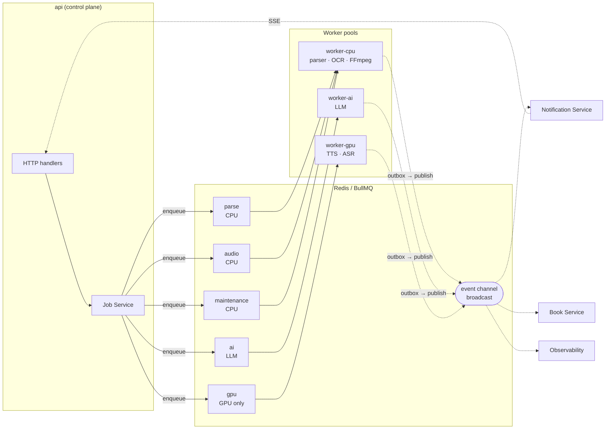
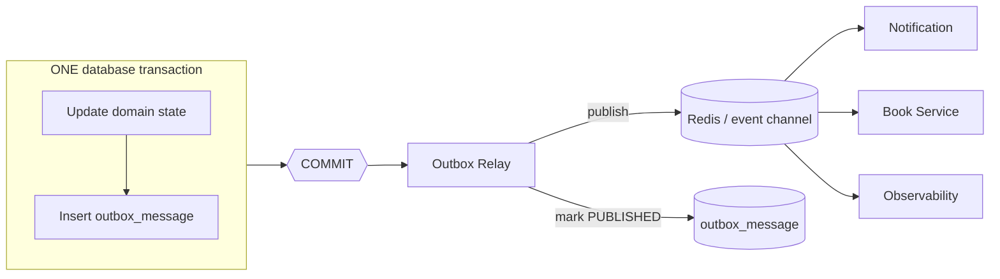
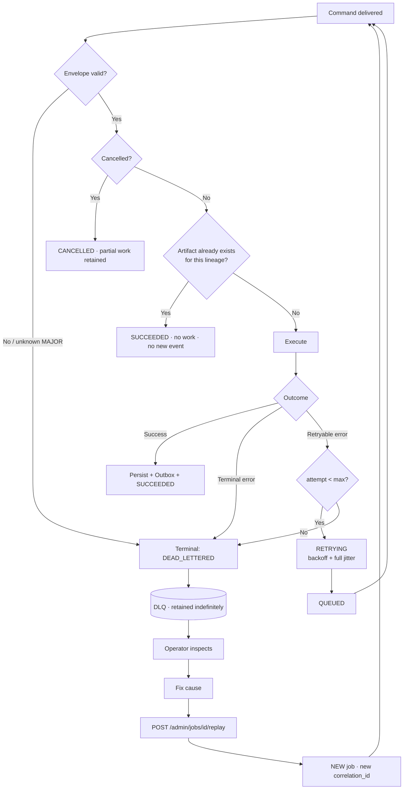
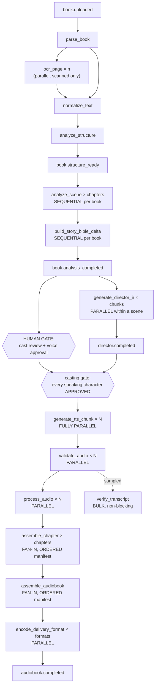
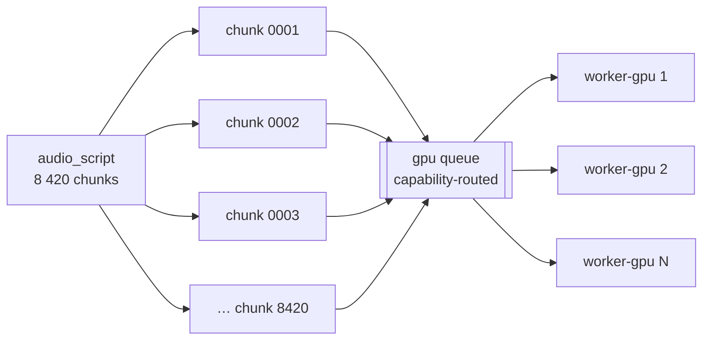
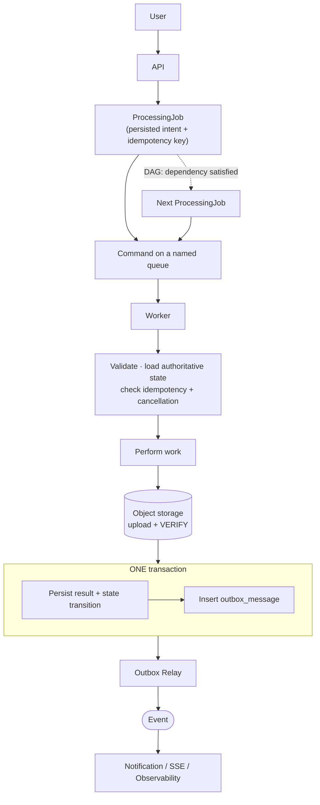
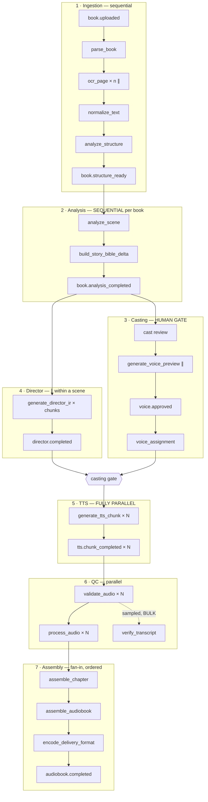

# Event Contracts — Audiobook Production Platform

> **Document type:** Architecture Contract (Tier 1 — async/job/event contract of record)
> **Path:** `docs/architecture/event-contracts.md`
> **Status:** DRAFT — pending human review
> **Schema/Doc version:** `events.v1`
> **Owner:** Architecture
> **Derives from:** `context.md` (`context.v1`)
> **Reconciled against:** `database-schema.md` (`db-schema.v1`), `api-specification.md` (`api-spec.v1`)
> **Supersedes:** nothing (initial document)

---

## 0. How to read this document

This document is the **single source of truth for asynchronous communication**: queue names,
job types, job payloads, event names, event schemas, envelopes, delivery semantics, retry and
dead-letter behaviour, idempotency, ordering, cancellation, progress, and correlation.

`context.md` §26.1 rule 2 fixes its authority precisely:

> `event-contracts.md` is the only authority on queue names, job payloads, event names, and
> event schemas.

It stops short of implementation. It contains **no Redis configuration, no BullMQ queue
definitions, no Kafka configuration, no worker code, no TypeScript interfaces, no Python
classes, no producers, no consumers, no tests, no Docker configuration.** It is written so
that those can be derived from it mechanically, and so that a reviewer can tell whether a
derived implementation is faithful.

Modal words carry the meanings fixed by `context.md` §0: **MUST** is non-negotiable,
**SHOULD** is a strong default requiring a documented reason to deviate, **MAY** is genuinely
optional.

**Authority.** `context.md` is Tier 0 and supreme. This document, `database-schema.md`, and
`api-specification.md` are Tier 1 peers with disjoint surfaces: this document owns the
message contracts, `database-schema.md` owns persistence, `api-specification.md` owns HTTP.
Where two appear to disagree, the disagreement is reported in §45, never silently resolved
(`context.md` §28 rule 13).

---

## 1. Purpose and scope

### 1.1 Why this contract exists

The system performs operations whose latency is unbounded, model-dependent, or proportional
to book size. `context.md` §2.3 makes them **mandatorily asynchronous**: ingestion, parsing,
OCR, normalisation, structural analysis, narrative analysis, all LLM inference, Director IR
generation, all TTS inference, audio validation, audio processing, chapter assembly,
audiobook assembly, final encoding, ASR verification, and bulk exports.

An HTTP handler accepts work, validates it, persists intent, enqueues, and returns a job
handle. It does not wait. Everything between "returns a job handle" and "the audiobook
exists" is governed by this document.

### 1.2 What this document defines

Commands · events · queues · envelopes · payload contracts · producers · consumers · job
lifecycle · retry behaviour · idempotency · ordering · concurrency · failure handling ·
dead-letter behaviour · cancellation · progress reporting · correlation · observability ·
versioning.

### 1.3 What this document may not do

Per `context.md` §25.9, §26.1, and §28 it **MUST NOT**:

- introduce a **queue** absent from `context.md` §11.2;
- introduce a **job type** absent from `context.md` §11.2;
- introduce an **event name** absent from `context.md` §11.3;
- introduce an **entity** absent from `context.md` §4.2 and `database-schema.md` §6;
- invent a **job state** absent from `context.md` §16.1;
- rename any of the above. Names are contracts and synonyms are forbidden
  (`context.md` §26.1 rule 5);
- define HTTP endpoints, status codes, or response shapes (`api-specification.md`);
- define tables, columns, or indexes (`database-schema.md`);
- define IR field types (`audio-script-ir.md`);
- bake configuration — concrete timeout values, attempt counts, backoff ceilings,
  concurrency numbers, retention windows — into the contract. Those live in
  `deployment-architecture.md` (`context.md` §30.10). This document fixes the **shape** of
  each policy, its bounds, and which knob exists; not the number.

Where the commissioning brief for this document asked for something the contracts already
name differently, the contract name is used and the divergence is recorded in §45. There are
**twenty-three** such divergences, and none was resolved by weakening `context.md`.

---

## 2. Inputs and consistency verification

### 2.1 Documents read in full before drafting

- `docs/architecture/context.md` — §1.3 (pipeline), §2.3–§2.5 (async, determinism,
  immutability), §3 (services and ownership), §4 (entities), §5.5 (ordering), §7 (IR),
  §9 (voice), §10.4 (GPU worker lifecycle), §11 (queues and events — load-bearing),
  §12 (storage), §14 (QC), §16 (job state machine), §17 (observability), §18 (security),
  §19 (tenancy), §20 (scale), §21 (failure), §24 (service communication).
- `docs/architecture/database-schema.md` — §6 (entity catalogue), §13 (IR tables), §15 (jobs,
  attempts, dependencies, idempotency), §16 (audio production), §19 (lineage), §21
  (idempotency layers), §26 (cascades), §28 (transaction boundaries), §29 (concurrency),
  §31 (consistency model), §32 (state machines).
- `docs/architecture/api-specification.md` — §11 (idempotency), §13 (API→job→event chain),
  §16.18–§16.19 (jobs, progress, SSE), §17.5 (internal job control), §18 (worker
  interfaces), §20 (state vocabularies).

### 2.2 The vocabularies this document inherits verbatim

| Vocabulary | Members | Source |
| --- | --- | --- |
| Queues | `parse`, `ai`, `gpu`, `audio`, `maintenance` | `context.md` §11.2 |
| Job types (commands) | 17 names, §11 of this document | `context.md` §11.2 |
| Event names | 36 names, §12 of this document | `context.md` §11.3 |
| Job states | `CREATED`, `QUEUED`, `RUNNING`, `RETRYING`, `BLOCKED`, `SUCCEEDED`, `FAILED`, `CANCELLED`, `DEAD_LETTERED` | `context.md` §16.1 |
| Priorities | `INTERACTIVE`, `NORMAL`, `BULK` | `context.md` §11.4 |
| Entity names | `database-schema.md` §6 | `context.md` §4.2 |

**Not one name in this document is invented.** §45 lists every place the brief proposed a
different name and why the contract name won.

### 2.3 Consistency checks performed

| Required check | Result | Where |
| --- | --- | --- |
| Service boundaries | **Pass** — every command has exactly one consuming service; no command crosses an ownership boundary | §11, §41.2 |
| Database entities | **Pass** — every payload identifier resolves to a `database-schema.md` §6 table | §14.2 |
| Job state machine | **Pass** — nine states, transitions per `database-schema.md` §32.3 | §24 |
| `BookVersion` | **Pass** — pinned on every command and event | §15.2 |
| `StoryBibleVersion` | **Pass** — pinned on Director commands | §15.3 |
| `VoiceProfileVersion` | **Pass** — pinned on TTS commands; never resolved by the worker | §15.4 |
| `AudioScriptVersion` (= `audio_script` row) | **Pass** — pinned on TTS commands | §15.5 |
| `AudioScriptChunk` | **Pass** — the unit of `generate_tts_chunk` | §16 |
| `TTSGeneration` (= `TTSJob`) | **Pass**, under its contract name | §45 conflict E-1 |
| `AudioChunk`, `ChapterAudio`, `AudiobookVersion` (= `audiobook` row) | **Pass** | §11, §45 E-2 |
| `ProcessingJob`, `ProcessingAttempt` | **Pass** — the job is the persisted intent; the attempt is the execution record | §24 |
| `ModelVersion` | **Pass** — pinned on every inference command | §15.6 |

---

## 3. The core principle: commands versus events

### 3.1 The distinction

| | **Command** | **Event** |
| --- | --- | --- |
| Means | *"Please perform this operation."* | *"This operation has happened."* |
| Grammar | Imperative | Declarative, past tense |
| Consumers | **Exactly one** logical consumer | **Zero or more** |
| Addressed | Yes — to a named queue consumed by one service | No — broadcast; the producer knows nothing about consumers |
| Retried | **Yes**, per §21 | **No** — never retried *into the domain* (§12.2) |
| Carries authority | Yes — it authorises expensive work | No — it authorises nothing |
| Failure | Retry, then DLQ | Redelivery of the notification only |
| Persisted as | A `processing_job` row (`database-schema.md` §15.1) | An `outbox_message` row, then a broadcast (§19) |
| Naming | `verb_noun` (`generate_tts_chunk`) | `domain.past_tense` (`tts.chunk_completed`) |

### 3.2 The rule that makes the distinction load-bearing

`context.md` §11.3, binding:

> An **event** states that something happened. Zero or more consumers. **Never used to
> *command* work in a way that couples producers to consumers' internals.**

And `context.md` §24.2:

> A service **MUST NOT** publish a command into another service's private queue as a way of
> reaching into its internals.

The practical consequence, and it is the single most important architectural property in this
document:

> **The pipeline is advanced by the Job Service reading persisted job state — not by services
> reacting to each other's events.**

`context.md` §16.4 states it directly: book-level jobs are **DAG coordinators** that track
child jobs; they never do work themselves. When `generate_director_ir` succeeds, the *next*
stage is enqueued because the Job Service's DAG says the dependency is satisfied
(`job_dependency`, `database-schema.md` §15.3) — **not** because someone subscribed to
`director.completed` and decided to start TTS.

Three things follow, and each is checked in §43:

1. **Losing an event never stalls the pipeline.** It costs a notification and a UI update, both
   recoverable by polling (`api-specification.md` §16.19: "the stream is a notification
   channel, not a source of truth"). This is what makes §19's Outbox a durability guarantee
   rather than a load-bearing dependency.
2. **No consumer needs to be trusted.** An event cannot cause expensive work, so a
   compromised or buggy consumer cannot spend GPU-hours.
3. **Event ordering across services does not need to be guaranteed.** Order matters only where
   §28 says it does, and every such place is protected by database state, not by delivery
   order.

### 3.3 What events are for

| Consumer | Consumes | Does what |
| --- | --- | --- |
| **Notification Service** | Everything book-scoped | Fan-out to email, in-app, SSE progress streams (`context.md` §3.2.15) |
| **Book Service** | `book.parsed`, `book.structure_ready`, `book.analysis_completed` | Updates the `book` aggregate's derived state (`context.md` §3.2.4) |
| **Job Service** | `job.*` (its own), worker-reported transitions | Progress aggregation and read models |
| **Observability plane** | Everything | Metrics, traces, audit correlation (`context.md` §17.5) |
| **Frontend** (indirectly, via SSE) | The book-scoped subset | Live UI (`api-specification.md` §16.19) |

Note what is **absent**: no consumer in that table enqueues domain work in response to an
event. That absence is the contract.

### 3.4 The one permitted exception, and its guard

The Voice Service requests a preview render by enqueueing `generate_voice_preview`
(`context.md` §3.2.9: "it *requests* TTS for previews"), and the result returns via
`voice.preview_ready`. This looks like event-driven chaining but is not: the Voice Service
creates a `processing_job` it owns, targeting a resource it owns, and reads the result from
persisted state. The event is the notification, not the mechanism. `context.md` §30.1
audits this exact path and finds the cycle broken.

---

## 4. Transport

### 4.1 The decision

`context.md` §11.1 and §23 row 10 select **Redis + BullMQ** for jobs, and Redis
Streams / BullMQ events for domain events. This document does not deviate, and no
alternative is evaluated here — `context.md` §11.1 already recorded the reasoning
(the workload is job-shaped, not log-shaped) and the documented trigger conditions under
which Kafka is reconsidered.

Kafka is **explicitly rejected for v1** (`context.md` §23, "Explicitly rejected"). Nothing in
this document may assume Kafka semantics: no partition keys as a correctness mechanism, no
log compaction, no consumer-group offsets, no infinite replay, no topic-as-state.

### 4.2 The two-layer split

```
┌─────────────────────────────────────────────────────────────┐
│  BUSINESS CONTRACT LAYER   (this document, §6–§16)          │
│  envelopes · names · payloads · schema_version · semantics   │
│  Transport-agnostic. Survives a broker migration unchanged.  │
├─────────────────────────────────────────────────────────────┤
│  TRANSPORT BINDING LAYER   (this document, §5 and §4.3)      │
│  queue names · delivery · ack · retry mechanics · DLQ wiring │
│  Broker-specific. Replaced entirely by a broker migration.   │
└─────────────────────────────────────────────────────────────┘
```

A migration from Redis/BullMQ to any other broker **MUST** be possible by replacing the lower
layer only. `context.md` §11.1 states the requirement: "event payloads carry no
Redis-specific semantics."

### 4.3 The transport-neutrality rules

Binding on every message contract in this document:

1. **No broker construct appears in a payload.** No Redis key, no BullMQ job id, no stream
   entry id, no queue name, no partition, no offset. Identity is the envelope's
   `message_id` / `event_id` and the domain's own identifiers.
2. **The queue is a routing label, not a payload field.** A message's queue is a property of
   its type (§5.3), resolvable from `message_type` alone.
3. **Delivery semantics are assumed at-least-once** (§18.2), which every candidate broker
   provides. No contract depends on stronger semantics.
4. **Ordering is never assumed from the transport** (§28). Where order matters, it is enforced
   by database state and locks.
5. **Retry, backoff, and DLQ are contract-level policies** (§21, §22) that the transport
   implements. If a broker cannot express one, the gap is closed in the worker, not by
   weakening the policy.
6. **Redis is never the source of truth** (§40.1). Losing the entire broker costs time, never
   data (`context.md` §12.2, §21 row 13).
7. **No message exceeds the payload budget** of §17.4. Bulk content travels by object key.

### 4.4 What a broker migration would and would not touch

| Would change | Would not change |
| --- | --- |
| Queue/topic declaration and wiring | `message_type` and `event_type` names |
| Ack, lease, and visibility mechanics | Envelope fields and their meanings |
| Retry/backoff implementation | Retry classification (§21.2) and its bounds |
| DLQ mechanism | DLQ retention contract and replay semantics (§22) |
| Priority implementation | The three priority levels and their assignment (§26) |
| Progress pub/sub channel | `job.progress` payload shape (§25) |
| Concurrency control mechanism | Per-queue concurrency model (§27) |

---

## 5. Queue architecture

### 5.1 The decision: five queues, not ten

`context.md` §11.2 fixes **five** queues: `parse`, `ai`, `gpu`, `audio`, `maintenance`.

The commissioning brief proposed ten domain-shaped queues (`ingestion`, `parsing`,
`analysis`, `director`, `voice`, `tts`, `audio-validation`, `audio-assembly`,
`audiobook-assembly`, `notifications`). That is a conflict, recorded as **E-3**, and the
contract wins. The brief's own instruction — *"Do not create unnecessary queues"* — points
the same way, and the reasoning is worth stating because it is the organising principle of
this section:

> **Queues are partitioned by runtime and scaling profile, not by business domain.**

A queue exists to route work to a **pool of workers with a particular resource shape**.
`director.analyze` and `story-bible.build` are different business operations but the same
scaling problem: LLM-bound, sequential per book, running in `worker-ai`. Splitting them into
two queues would create two pools that must be sized, monitored, and drained separately for
no benefit, and would break `context.md` §5.5's requirement that narrative analysis and
Director work share a per-book ordering discipline.

Conversely, `generate_tts_chunk` and `validate_audio` are adjacent business steps but
completely different scaling problems — one needs VRAM at one to two orders of magnitude the
cost per hour (`context.md` §20.2), the other is cheap CPU. They must never share a queue.

The test for whether a new queue is justified: **does this work need a worker pool that is
sized, scaled, or placed differently from every existing pool?** If not, it is a job type on
an existing queue.

### 5.2 Queue specifications

#### `parse` — document understanding

| Property | Value |
| --- | --- |
| **Purpose** | Bytes → text → canonical text → structural spine. `context.md` §3.2.6 |
| **Job types** | `parse_book`, `ocr_page`, `normalize_text`, `analyze_structure` |
| **Producers** | Ingestion Service (on upload admission), Job Service (DAG expansion), Book Service (re-ingest) |
| **Consumers** | `worker-cpu` — Parser Service module |
| **Runtime** | **CPU.** No GPU. OCR is the bottleneck and is parallelised per page |
| **Workload** | Bursty per book: one `parse_book` fanning out to *n* `ocr_page` for scanned input (~400 for a typical book), then one `normalize_text` and one `analyze_structure` |
| **Concurrency** | Horizontal, CPU-bound. Per-page work is embarrassingly parallel; per-book coordination is a DAG, not a lock |
| **Priority** | `NORMAL`. `INTERACTIVE` is refused for book-scope ingestion (`api-specification.md` §16.7) |
| **Retry** | `ocr_page`: 3 attempts with preprocessing variations (`context.md` §21 row 3). `parse_book`: 2 attempts, then the alternate extraction strategy (digital→OCR fallback, §21 row 2) |
| **Timeout** | Per-page for OCR; per-document for parse, scaled by page count |
| **Ordering** | **None required.** Pages are independent; `normalize_text` and `analyze_structure` are DAG-sequenced by dependency, not by queue order |
| **DLQ** | `parse:dlq`. A dead-lettered `ocr_page` does **not** fail the book — the page is marked `NEEDS_REVIEW` and the book proceeds with the gap flagged (`context.md` §3.2.6) |
| **Sandbox** | Parsers run resource-capped, with no outbound network (`context.md` §18.4). This is a property of the consumer, not the queue, but it is why parse work may not share a process with anything else |

#### `ai` — narrative intelligence

| Property | Value |
| --- | --- |
| **Purpose** | All LLM-facing work: scene analysis, Story Bible accumulation, Director IR generation and revision. `context.md` §3.2.7, §3.2.10 |
| **Job types** | `analyze_scene`, `build_story_bible_delta`, `generate_director_ir`, `revise_director_ir` |
| **Producers** | Job Service (DAG), Character Service (re-resolution after a merge, via the Job Service) |
| **Consumers** | `worker-ai` (Python) |
| **Runtime** | **LLM-bound.** CPU-light locally; may be GPU-backed if the deployment self-hosts the model via vLLM, but the queue does not know or care — the provider abstraction hides it (`context.md` §23 row 16) |
| **Workload** | `analyze_scene` and `build_story_bible_delta`: hundreds per book, **sequential**. `generate_director_ir`: thousands per book, **parallel within an analysed scene** |
| **Concurrency** | Horizontal across books; **capped per book** by a Redis lock on `book_id` for the sequential job types (`context.md` §5.5, §11.5). This is the single most important concurrency rule on this queue and §28.2 explains it |
| **Priority** | `NORMAL`; `INTERACTIVE` for a single-chunk `revise_director_ir` after a user edit |
| **Retry** | 3 attempts with exponential backoff and a **longer ceiling** than CPU work (`context.md` §11.4). On repeated timeout: reduced-context retry (L1+L4+L5+L6), then chunk split, then deterministic fallback IR with `review_flags` (`context.md` §21 rows 4–5) |
| **Timeout** | Generous — model latency is unbounded in practice. Scaled by context-bundle token count |
| **Ordering** | **Required and enforced** for `analyze_scene` and `build_story_bible_delta`: spine order per book. **Not required** for `generate_director_ir` once the scene's `narrative_state` snapshot exists (`context.md` §5.5 "snapshot-then-fan-out") |
| **DLQ** | `ai:dlq`. A dead-lettered Director chunk falls back to a deterministic IR flagged for review rather than blocking the book (`context.md` §3.2.7) |

#### `gpu` — synthesis

| Property | Value |
| --- | --- |
| **Purpose** | TTS synthesis and speaker-embedding extraction. The most expensive and most replaceable part of the system. `context.md` §3.2.12, §10 |
| **Job types** | `generate_tts_chunk`, `generate_voice_preview`, and `verify_transcript` where the deployment routes ASR to GPU |
| **Producers** | Job Service (DAG, for production renders), Voice Service (for previews, via the Job Service) |
| **Consumers** | `worker-gpu` (Python + CUDA) |
| **Runtime** | **GPU. This is the only queue that requires GPU workers.** `ai` may be GPU-backed by deployment choice; `gpu` requires it by contract |
| **Workload** | **The bulk of all work.** Tens of thousands of chunk renders for a 12-hour audiobook (`context.md` §20.2) |
| **Concurrency** | Independently horizontal on GPU nodes. **One model instance per GPU by default**; intra-process concurrency limited by VRAM headroom and measured throughput. **Workers advertise their own concurrency; the queue does not guess** (`context.md` §10.4 step 4). §27.3 is the full treatment |
| **Priority** | **This queue is why priority exists.** `INTERACTIVE` for previews and single-chunk regeneration; `NORMAL` for full-book generation. Interactive work must never starve behind a 20-hour render (`context.md` §11.4) |
| **Retry** | 3 attempts, backoff, **different worker** where possible. OOM: reduce batch → single item → 2 attempts → route to a larger-VRAM node or a smaller model variant if configured, else fail the chunk (not the chapter). New seed on the final attempt (`context.md` §21 rows 8–9) |
| **Timeout** | **Per-chunk, scaled by input length** (`context.md` §10.4 step 8). A fixed timeout is wrong: a 400-character chunk and a 40-character chunk differ by an order of magnitude |
| **Ordering** | **None.** Chunks are independent by design; no chunk may depend on another chunk's audio output (`context.md` §20.3). This is what makes throughput scale with worker count |
| **Routing constraint** | A chunk targeting a `voice_profile_version` is routed **only to workers advertising that provider and model** (`context.md` §10.3). Capability-based routing, not round-robin |
| **DLQ** | `gpu:dlq`. A dead-lettered chunk leaves its chapter incomplete and blocks *that* chapter's assembly; unrelated chapters proceed (§33) |
| **Draining** | On SIGTERM the worker stops accepting, finishes in-flight chunks within a grace period, and **releases unfinishable work back to the queue** — visibility restored, not lost (`context.md` §10.4 step 7) |

#### `audio` — waveform work

| Property | Value |
| --- | --- |
| **Purpose** | Technical validation, DSP, assembly, encoding. `context.md` §3.2.13, §3.2.14 |
| **Job types** | `validate_audio`, `process_audio`, `assemble_chapter`, `assemble_audiobook`, `encode_delivery_format`, and `verify_transcript` where routed to CPU |
| **Producers** | Job Service (DAG), triggered by chunk completion and by assembly requests |
| **Consumers** | `worker-cpu` — Audio Processing and Audio Assembly modules (FFmpeg-centric) |
| **Runtime** | **CPU**, I/O-bound on object storage |
| **Workload** | One `validate_audio` + one `process_audio` per chunk (tens of thousands per book); one `assemble_chapter` per chapter; one `assemble_audiobook` per audiobook version |
| **Concurrency** | Horizontal; cheap and highly parallel for per-chunk work. **Assembly is serialised per chapter** and per audiobook by a Redis lock (`context.md` §11.5) |
| **Priority** | `NORMAL`; `BULK` for `encode_delivery_format` re-encodes |
| **Retry** | 2 attempts for validation and processing; assembly is a **pure function of its inputs and always safe to re-run** (`context.md` §3.2.14), so its retry budget can be higher |
| **Timeout** | Per-chunk for validation; scaled by total duration for assembly |
| **Ordering** | **Per-chunk: none. Assembly: strictly ordered** — the chunk manifest is ordered and the manifest hash is computed over that order (§28.3) |
| **DLQ** | `audio:dlq`. A validation failure is **not** a DLQ event: it marks the chunk `INVALID` and requests regeneration of that chunk only (`context.md` §14.3). Only an infrastructure failure dead-letters here |

#### `maintenance` — housekeeping

| Property | Value |
| --- | --- |
| **Purpose** | Retention, purge, reconciliation, backfills |
| **Job types** | `cleanup_artifacts` |
| **Producers** | Scheduler (retention policy), Book Service (purge request, `api-specification.md` §16.6.3), operators |
| **Consumers** | `worker-cpu` |
| **Runtime** | CPU, I/O-bound |
| **Workload** | Low frequency, potentially very large per run (a book purge deletes millions of objects) |
| **Concurrency** | Low, deliberately. Maintenance must never contend with production work |
| **Priority** | **`BULK` always.** No exception |
| **Retry** | High attempt count with long backoff. Purge is resumable and ordered (`database-schema.md` §27.4); a partial purge is retried, never rolled back |
| **Timeout** | Long; the job checkpoints progress and resumes |
| **Ordering** | **Required within a purge**: the deletion order of `database-schema.md` §27.4 is bottom-up so every `RESTRICT` is satisfied at each step |
| **DLQ** | `maintenance:dlq`. A dead-lettered purge leaves the book soft-deleted and retryable — never half-deleted in an inconsistent state |

### 5.3 Routing table — job type to queue

Resolvable from `message_type` alone; the queue is never a payload field (§4.3 rule 2).

| Job type | Queue | Runtime | GPU required |
| --- | --- | --- | --- |
| `parse_book` | `parse` | CPU | No |
| `ocr_page` | `parse` | CPU | No |
| `normalize_text` | `parse` | CPU | No |
| `analyze_structure` | `parse` | CPU | No |
| `analyze_scene` | `ai` | LLM | Deployment-dependent |
| `build_story_bible_delta` | `ai` | LLM | Deployment-dependent |
| `generate_director_ir` | `ai` | LLM | Deployment-dependent |
| `revise_director_ir` | `ai` | LLM | Deployment-dependent |
| `generate_voice_preview` | `gpu` | GPU | **Yes** |
| `generate_tts_chunk` | `gpu` | GPU | **Yes** |
| `verify_transcript` | `gpu` **or** `audio` | ASR | Deployment-dependent |
| `validate_audio` | `audio` | CPU | No |
| `process_audio` | `audio` | CPU | No |
| `assemble_chapter` | `audio` | CPU | No |
| `assemble_audiobook` | `audio` | CPU | No |
| `encode_delivery_format` | `audio` | CPU | No |
| `cleanup_artifacts` | `maintenance` | CPU | No |

**`verify_transcript` routing.** `context.md` §11.2 marks it `gpu`/`audio` — a deliberate
deployment choice, because faster-whisper runs on either. The **contract** is that the job
type is routed by configuration to exactly one of the two queues per deployment, and the
choice is recorded in `deployment-architecture.md`. A job **MUST NOT** be published to both.
Recorded as **OQ-EV-3** because a single deployment-wide setting may be too coarse — spare
GPU capacity is exactly when ASR should run on GPU.

### 5.4 The event channel

Domain events are **not** a queue in the BullMQ sense. They are a broadcast channel
(Redis Streams / BullMQ events, `context.md` §11.1) with these properties:

- **Fan-out**, not work distribution. Every subscriber sees every event it subscribes to.
- **No retry into the domain** (§3.1). A failed subscriber's handler is that subscriber's
  problem; it does not redeliver work.
- **Bounded retention.** The stream is trimmed to a configured window. It is **not** the event
  history — that lives in PostgreSQL (§37).
- **Subscribable by prefix**: `book.*`, `tts.*`, `job.*`. The public SSE stream carries the
  book-scoped subset (`api-specification.md` §16.19).

### 5.5 Queue architecture diagram



Solid arrows are commands (work). Dotted arrows are events (facts). Note that **no dotted
arrow re-enters a queue**: events never command work (§3.2).

---

## 6. The command envelope

### 6.1 Structure

Every command on every queue carries this envelope. The `payload` is the only type-specific
part.

```json
{
  "message_id":      "0199c4f0-7a31-7c02-b8e4-3f9a2d1e6b40",
  "message_type":    "generate_tts_chunk",
  "schema_version":  "1.0",
  "enqueued_at":     "2026-08-27T15:04:03.221Z",

  "correlation_id":  "0199c4ef-2b10-7a44-9c31-77e0a1b2c3d4",
  "causation_id":    "0199c4ef-9f52-7d18-a002-5e1122334455",

  "tenant_id":       "0199c4e0-0000-7000-8000-000000000001",
  "book_id":         "0199c4e1-1111-7000-8000-000000000002",
  "book_version_id": "0199c4e2-2222-7000-8000-000000000003",

  "job_id":          "0199c4ef-9f52-7d18-a002-5e1122334455",
  "attempt":         1,
  "lease_fence":     14,

  "idempotency_key": "tts:0199c4f1...:4:0199c4d0...:77aa31...",
  "priority":        "NORMAL",
  "producer":        "api",
  "producer_version":"api@1.4.2",
  "traceparent":     "00-4bf92f3577b34da6a3ce929d0e0e4736-00f067aa0ba902b7-01",

  "payload":         { }
}
```

### 6.2 Field definitions

| Field | Type | Req. | Meaning |
| --- | --- | --- | --- |
| `message_id` | UUIDv7 | **Yes** | Identity of **this delivery attempt's message instance**. New on every enqueue, including a retry re-enqueue. Never reused. Used for transport-level dedup and for log correlation. **Not** a business identifier |
| `message_type` | enum | **Yes** | One of the 17 job types (§5.3). Determines the queue, the payload schema, and the consumer |
| `schema_version` | `MAJOR.MINOR` | **Yes** | Version of **this message type's payload schema** (§14). Independent of the API version and of every other message type's version |
| `enqueued_at` | RFC 3339 UTC | **Yes** | When the message was placed on the queue. Not when the job was created — `processing_job.created_at` is that |
| `correlation_id` | UUIDv7 | **Yes** | The **root** identifier of the whole user-initiated operation. Constant across every command, event, log line, and span in the chain (§9) |
| `causation_id` | UUIDv7 | **Yes** | The `message_id` or `event_id` of the message that **directly caused** this one. Forms a parent pointer; the chain of `causation_id`s is the causal tree (§9) |
| `tenant_id` | UUIDv7 | **Yes** | Ownership context. **Mandatory on every message without exception** (`context.md` §19.1). The consumer re-validates it against persisted state (§36) |
| `book_id` | UUIDv7 | Conditional | Required for every job type except `cleanup_artifacts` operating at tenant scope |
| `book_version_id` | UUIDv7 | Conditional | Required for every job type downstream of structural analysis. **This is the stale-version guard** (§15.2) |
| `job_id` | UUIDv7 | **Yes** | The `processing_job.id` this command executes. **The durable business identity of the work**; survives every retry |
| `attempt` | integer ≥ 1 | **Yes** | Which attempt this delivery is. Matches the `processing_attempt.attempt_number` the worker will create |
| `lease_fence` | integer | **Yes** | The fencing token issued with the lease. The worker **MUST** present it on every transition, heartbeat, and result write; a stale token is refused (`database-schema.md` §15.1, `api-specification.md` §17.5) |
| `idempotency_key` | string | **Yes** | The server-derived semantic identity of the work (§18.1). **Never client-supplied** (`api-specification.md` §11.4) |
| `priority` | enum | **Yes** | `INTERACTIVE` \| `NORMAL` \| `BULK` (§26) |
| `producer` | string | **Yes** | The service that enqueued it (`api`, `worker-ai`, `scheduler`) |
| `producer_version` | string | **Yes** | Its build identity. Required so a bad release is attributable |
| `traceparent` | W3C string | SHOULD | Trace context, propagated through the envelope and not only over HTTP (`context.md` §17.3, §23 row 25) |
| `payload` | object | **Yes** | Type-specific. May be `{}` where every input is in the envelope |

### 6.3 Rules

1. **The envelope is closed.** Adding a field is a schema change (§14). A worker that
   encounters an unknown envelope field **MUST** ignore it (forward compatibility) but
   **MUST NOT** depend on it.
2. **The envelope carries no secrets** (§35) and **no bulk content** (§17).
3. **`job_id` is the durable identity; `message_id` is the delivery identity.** A job retried
   five times has one `job_id` and five `message_id`s.
4. **A command is never published without a committed `processing_job` row.** Enqueue happens
   **after** the transaction commits (`database-schema.md` §28.12). A message referencing a
   `job_id` that does not exist is a defect, and the worker's response is to fail terminally
   rather than to create the row.

---

## 7. The event envelope

### 7.1 Structure

`context.md` §11.3 fixes the required fields; this document fixes their types and adds
nothing not implied there.

```json
{
  "event_id":        "0199c4f2-1a2b-7c3d-8e4f-556677889900",
  "event_type":      "tts.chunk_completed",
  "schema_version":  "1.0",
  "occurred_at":     "2026-08-27T15:06:11.004Z",

  "correlation_id":  "0199c4ef-2b10-7a44-9c31-77e0a1b2c3d4",
  "causation_id":    "0199c4f0-7a31-7c02-b8e4-3f9a2d1e6b40",

  "tenant_id":       "0199c4e0-0000-7000-8000-000000000001",
  "book_id":         "0199c4e1-1111-7000-8000-000000000002",
  "book_version_id": "0199c4e2-2222-7000-8000-000000000003",

  "job_id":          "0199c4ef-9f52-7d18-a002-5e1122334455",

  "producer":        "worker-gpu",
  "producer_version":"worker-gpu@2.1.0",
  "traceparent":     "00-4bf92f3577b34da6a3ce929d0e0e4736-1a2b3c4d5e6f7081-01",

  "payload":         { }
}
```

### 7.2 Field definitions

| Field | Type | Req. | Meaning |
| --- | --- | --- | --- |
| `event_id` | UUIDv7 | **Yes** | Identity of the **fact**, not of a delivery. Redelivering the same event carries the **same** `event_id` — which is what makes consumer dedup possible (§20) |
| `event_type` | enum | **Yes** | One of the 36 names of `context.md` §11.3 (§12). No others exist |
| `schema_version` | `MAJOR.MINOR` | **Yes** | Version of this event type's payload schema (§14) |
| `occurred_at` | RFC 3339 UTC | **Yes** | When the fact became true — **the database commit time**, not the publish time. This matters: an outbox message published minutes later still reports when the thing happened |
| `correlation_id` | UUIDv7 | **Yes** | Same root as the causing command (§9) |
| `causation_id` | UUIDv7 | **Yes** | The `message_id` of the command whose execution produced this fact, or the `event_id` of a triggering event |
| `tenant_id` | UUIDv7 | **Yes** | Ownership context. Subscribers filter on it; the SSE gateway enforces it (§36) |
| `book_id` | UUIDv7 | Conditional | `context.md` §11.3 marks it optional (`book_id?`). Absent only for tenant-scoped events |
| `book_version_id` | UUIDv7 | Conditional | Present on every event about book content (§15.2) |
| `job_id` | UUIDv7 | Conditional | Present when the fact was produced by a job. Absent on facts produced synchronously (`voice.approved`, `character.confirmed`) |
| `producer`, `producer_version` | string | **Yes** | Required by `context.md` §11.3 verbatim |
| `traceparent` | W3C string | SHOULD | Trace continuation |
| `payload` | object | **Yes** | Typed per event (§12). Identifiers and small facts only |

### 7.3 Ownership and serialisation

- **Ownership.** An event is owned by the service that produces it — the one that owns the
  entity whose state changed (`database-schema.md` §6). No service may publish another
  service's events. `api-specification.md` §18.4: workers "never publish domain events on
  behalf of another service."
- **Serialisation.** UTF-8 JSON. Field names `snake_case`, enum values
  `SCREAMING_SNAKE_CASE`, timestamps RFC 3339 UTC with an explicit `Z`, durations integer
  milliseconds with `_ms` suffixes, byte sizes integer with `_bytes` suffixes, identifiers
  opaque strings — identical to `api-specification.md` §2.3–§2.5, so no translation layer
  exists between the wire formats. `context.md` §23 row 26 makes **JSON Schema** the neutral
  source from which both TypeScript types and Pydantic models are generated (§38).
- **Canonical form.** Where a payload is hashed (context bundles, generation parameters), the
  canonical serialisation is sorted keys, fixed number formatting, explicit nulls
  (`database-schema.md` §20.3 rule 3). A serialisation change silently invalidates every
  idempotency check in the system and is therefore **Breaking**.

---

## 8. Message identity

### 8.1 Five identifiers, five jobs

The most common source of confusion in event-driven systems is conflating these. They are
distinct and none substitutes for another.

| Identifier | Scope | Changes when | Answers |
| --- | --- | --- | --- |
| `message_id` | One command delivery | **Every enqueue**, including retries | "Which physical message was this?" |
| `event_id` | One fact | **Never** — stable across redeliveries | "Which fact is this, and have I already handled it?" |
| `job_id` | One unit of intended work | **Never** — survives every retry and every redelivery | "What work is this, and what is its authoritative state?" |
| `correlation_id` | One user-initiated operation | **Never** within the operation | "What did the user ask for that led to all of this?" |
| `causation_id` | One causal edge | Every hop | "What directly caused this message?" |
| Entity/resource id | One domain object | Never | "What is this about?" (`book_id`, `audio_script_chunk_id`, …) |

### 8.2 The distinction that matters most

**`message_id` ≠ `job_id`.** A single job produces one `job_id` and *n* `message_id`s across
*n* attempts. Deduplicating on `message_id` catches transport-level double-delivery of the
same physical message; it does **not** catch a legitimate retry, and it must not — a retry is
supposed to run again. Semantic duplicate work is prevented by `idempotency_key` and by the
database constraints of §18, not by message identity.

**`event_id` is stable, `message_id` is not.** This asymmetry is deliberate. An event
subscriber that saw `event_id` X and sees it again knows it is a redelivery of the same fact
and can skip. A worker that saw `message_id` Y and sees Y again knows the *broker* redelivered;
if it sees a different `message_id` for the same `job_id`, that is a retry and it must
re-evaluate the idempotency key rather than skip.

### 8.3 Identifier generation

- All are **UUIDv7**, matching `database-schema.md` §3.1. Generated in the **application**,
  never by the broker or the database, so the identifier is known before the message exists
  and can be logged, traced, and referenced in the same breath.
- `correlation_id` is minted at the **edge**: the API gateway generates it per request (or
  adopts the client's `X-Request-Id` where supplied and well-formed), and it is identical to
  the value the API returns in `X-Request-Id` (`api-specification.md` §2.7). This is what lets
  a user quote a request id in a support ticket and an operator retrieve the entire
  processing chain.
- For scheduler-initiated work with no HTTP request, the scheduler mints the
  `correlation_id` and `causation_id` is null on the root message only.

### 8.4 The traceability requirement

`context.md` §17.5 makes this an architectural requirement, not a dashboard feature:

> Given a `book_id`, an operator **MUST** be able to retrieve: every job and attempt, every
> log line, every trace, every artifact key, every model version, and the total cost.

The identifier propagation that satisfies it:

```
HTTP request           correlation_id = C, X-Request-Id = C
  ↓ creates
ProcessingJob          job_id = J,  correlation_id = C
  ↓ enqueues
command                message_id = M1, job_id = J, correlation_id = C, causation_id = C
  ↓ consumed by
worker                 creates ProcessingAttempt(job_id = J, attempt = 1)
  ↓ commits + publishes
event                  event_id = E1, job_id = J, correlation_id = C, causation_id = M1
  ↓ Job Service DAG advances (NOT the event)
next ProcessingJob     job_id = J2, correlation_id = C
  ↓ enqueues
next command           message_id = M2, job_id = J2, correlation_id = C, causation_id = M1
```

Every row, log line, span, and message in that chain carries `correlation_id = C`. §44's
observability contract makes it queryable.

---

## 9. Correlation and causation

### 9.1 Semantics

- **`correlation_id` is flat and constant.** It identifies the *operation*, never a position
  within it. Every message in a book's TTS render — all 8 000 chunk commands, all 8 000
  completion events, every retry — shares the `correlation_id` of the `POST /books/{id}/tts`
  request that started it.
- **`causation_id` is a parent pointer.** It identifies the *immediately preceding* message.
  Following `causation_id` upward from any message reconstructs the exact causal path to the
  originating request.

Together they give a **tree**: `correlation_id` selects the tree, `causation_id` gives the
edges.

### 9.2 Worked example

```
HTTP  POST /api/v1/books/{id}/ingestion
      correlation_id = C1        causation_id = null        (root)
        │
        ▼
CMD   parse_book
      message_id = M1            correlation_id = C1        causation_id = C1
        │
        ▼
EVT   book.parse_started
      event_id = E1              correlation_id = C1        causation_id = M1
        │
        ▼
CMD   ocr_page  (×412, fan-out)
      message_id = M2..M413      correlation_id = C1        causation_id = M1
        │
        ▼
EVT   book.parsed
      event_id = E2              correlation_id = C1        causation_id = M1
        │
        ▼   (Job Service DAG advances — not the event)
CMD   analyze_structure
      message_id = M414          correlation_id = C1        causation_id = M1
        │
        ▼
EVT   book.structure_ready
      event_id = E3              correlation_id = C1        causation_id = M414
```

Note that the fan-out children carry `causation_id = M1` — the coordinator's message — not
each other's. Causation is a tree, never a chain through siblings.

### 9.3 Where a new correlation begins

A new `correlation_id` is minted **only** at a genuine operation boundary:

| Starts a new correlation | Continues the existing one |
| --- | --- |
| Any user HTTP request that creates a job | Every command and event descended from it |
| A scheduled maintenance run | Every child of that run |
| An operator DLQ replay (`api-specification.md` §16.22) — with `causation_id` pointing at the original message, so the replay is linked but distinguishable | A retry of an existing job |

**A retry never mints a new `correlation_id` and never a new `job_id`** — only a new
`message_id` and an incremented `attempt`.

### 9.4 Propagation obligations

1. Every producer **MUST** copy `correlation_id` from the message it is reacting to.
2. Every producer **MUST** set `causation_id` to the id of that message.
3. Every worker **MUST** include both in every log line it emits (§44.1) and in the span it
   opens.
4. `traceparent` propagates alongside, giving OpenTelemetry the same tree
   (`context.md` §17.3). The two mechanisms are redundant on purpose: traces are sampled,
   `correlation_id` is not.
5. **No component may generate a fresh `correlation_id` because one was missing.** A missing
   `correlation_id` is a defect to report, not to paper over — silently minting one severs the
   chain exactly where it is most needed.

---

## 10. Naming conventions

### 10.1 The two conventions, both inherited

`context.md` fixes both, and they are deliberately different so that a name's *kind* is
readable from its shape:

| | Commands | Events |
| --- | --- | --- |
| Shape | `verb_noun` | `domain.past_tense` |
| Case | `snake_case`, no dots | `snake_case` segments, dot-separated |
| Grammar | Imperative | Declarative |
| Examples | `parse_book`, `generate_tts_chunk`, `assemble_chapter` | `book.parsed`, `tts.chunk_completed`, `audiobook.completed` |
| Source | `context.md` §11.2 ("Named `verb_noun`") | `context.md` §11.3 |

You can tell at a glance: a name with a dot is a fact; a name without one is an instruction.
That is worth more than aesthetic consistency between the two.

### 10.2 The brief's proposed convention, and why the contract's wins

The commissioning brief asked for `domain.entity.action` for both, with hyphens
(`tts.chunk.generate`, `story-bible.generated`) and past tense for events.

This conflicts with `context.md` §11.2 and §11.3 on three counts — command shape, segment
separator, and the specific names — and `context.md` §26.1 rule 5 is categorical: *"An
entity, state, event, or field named here keeps that exact name in every document and in
code. Synonyms are forbidden."* Recorded as **E-4**, **E-5**, **E-6** in §45, with the full
name-by-name mapping.

### 10.3 An inconsistency inside the contract's own event list

Applying the brief's "past tense only" test to `context.md` §11.3 surfaces three names that
are not past tense:

| Name | Form | Should be, by the stated rule |
| --- | --- | --- |
| `job.progress` | **Noun** | `job.progressed` |
| `job.retrying` | **Present participle** | `job.retried` |
| `book.structure_ready` | **Adjective** | `book.structure_analyzed` |

These are not defects to fix here. `context.md` §11.3 lists them explicitly and names are
contracts; renaming one in this document would be exactly the silent divergence rule 5
forbids. They are used verbatim throughout §12 and recorded as **E-7** so that a future
`context.md` revision can decide deliberately.

The underlying reason two of them read oddly is instructive: `job.progress` and
`job.retrying` describe **ongoing conditions**, not completed transitions, which is a hint
that they are lifecycle telemetry rather than domain facts. §25 and §24.4 treat them
accordingly.

### 10.4 Naming rules for any future addition

1. A new job type is `verb_noun`, lowercase, snake_case, and **requires a `context.md` §11.2
   amendment first**.
2. A new event is `domain.past_tense`, and **requires a `context.md` §11.3 amendment first**.
3. The `domain` segment is one of the existing ten: `book`, `character`, `voice`, `director`,
   `tts`, `audio`, `chapter`, `audiobook`, `job`, `story_bible` — the last currently having
   no members (§45 E-13).
4. No abbreviations, no pluralisation of the domain, no version suffixes in names. Versioning
   is `schema_version`, never `book.parsed_v2`.
5. Never reuse a retired name for a different meaning.

---

## 11. Command catalog

Seventeen commands — exactly the job types of `context.md` §11.2. Each is specified against
the §47 contract table of the brief.

Conventions used throughout: **Payload** lists only the type-specific fields; every command
also carries the full envelope of §6. **Idempotency key** is server-derived and never
client-supplied. **Timeout** and **max attempts** state their *shape*; the numbers are
configuration (`deployment-architecture.md`).

### 11.1 `parse_book`

| | |
| --- | --- |
| **Purpose** | Extract text with layout and reading order from an admitted `book_file`; choose the digital-text or OCR path; fan out to `ocr_page` for scanned input. `context.md` §3.2.6 |
| **Producer** | `api` — Ingestion Service on upload finalisation, or Book Service on `POST /books/{id}/ingestion` |
| **Consumer** | `worker-cpu` (Parser Service) |
| **Queue / runtime** | `parse` / CPU, sandboxed and resource-capped (`context.md` §18.4) |
| **Schema version** | `1.0` |
| **Payload — required** | `book_file_id`, `source_kind` (`PDF`\|`EPUB`\|`IMAGE_SET`), `parser_strategy` (`AUTO`\|`PRIMARY`\|`FALLBACK`), `parser_model_version_id`, `pipeline_version` |
| **Payload — optional** | `ocr_language_hints[]`, `force_ocr`, `page_numbers[]` (for `scope: PAGES` re-runs), `previous_book_version_id` (when re-ingesting) |
| **Prerequisites** | `book_file.status = ADMITTED`; book not soft-deleted; no ingestion job `RUNNING` for this book unless forced |
| **State transition** | `book.status → PARSING`; creates `book_version` (`status = PARSING`) |
| **Emits** | `book.parse_started`, then `book.parsed` or `book.parse_failed` |
| **Idempotency key** | `parse:{book_file_id}:{parser_version}` — `context.md` §16.3 verbatim |
| **Retryable** | Yes for transient I/O. **2 attempts**, then the alternate extraction strategy (digital→OCR fallback); if all fail → `NEEDS_REVIEW` with diagnostics (`context.md` §21 row 2) |
| **Timeout** | Scaled by page count |
| **Priority** | `NORMAL`. `INTERACTIVE` refused for book scope (`api-specification.md` §16.7) |
| **Ordering** | None |
| **Cancellation** | Cooperative at page boundaries; partial page results retained |
| **Failure** | Terminal on unsupported/corrupt format after fallback → `book.parse_failed`, book `NEEDS_REVIEW`. Never dead-letters the whole book for one page |

### 11.2 `ocr_page`

| | |
| --- | --- |
| **Purpose** | OCR one page or image with per-block confidence. Per-page isolation is the point: a failed page must not fail a book |
| **Producer** | `worker-cpu` (`parse_book` fan-out) via the Job Service |
| **Consumer** | `worker-cpu` (Parser Service, OCR adapter) |
| **Queue / runtime** | `parse` / CPU |
| **Schema version** | `1.0` |
| **Payload — required** | `book_file_id`, `book_version_id`, `page_number`, `ocr_model_version_id` |
| **Payload — optional** | `language_hints[]`, `preprocessing_variant` (used on retry), `source_object` (§17.3 reference to the page image) |
| **Prerequisites** | Parent `book_version` exists in `PARSING` |
| **State transition** | Creates/updates `parsed_page` (`OK` \| `NEEDS_REVIEW` \| `FAILED`) |
| **Emits** | None individually. Aggregate outcome surfaces in `book.parsed`. Recorded as **E-14** — per-page completion has no event, so page-level progress reaches the UI only via `job.progress` |
| **Idempotency key** | `ocr_page:{book_version_id}:{page_number}:{ocr_model_version_id}:{preprocessing_variant}` |
| **Retryable** | Yes. **3 attempts with preprocessing variations** (`context.md` §21 row 3) |
| **Timeout** | Per page |
| **Priority** | Inherited from parent |
| **Ordering** | **None** — pages are independent and this is what makes OCR parallelism the throughput lever |
| **Cancellation** | Checked before each page |
| **Failure** | Page marked `NEEDS_REVIEW`; **the book proceeds with the gap flagged**. Only an aggregate threshold fails the book |

### 11.3 `normalize_text`

| | |
| --- | --- |
| **Purpose** | Raw text → canonical text: de-hyphenation, ligature repair, header/footer stripping, whitespace and quote canonicalisation, encoding repair, footnote separation. `context.md` §1.4 |
| **Producer** | Job Service (DAG, after `parse_book`/`ocr_page` complete) |
| **Consumer** | `worker-cpu` (Parser Service) |
| **Queue / runtime** | `parse` / CPU |
| **Schema version** | `1.0` |
| **Payload — required** | `book_version_id`, `normalizer_model_version_id` |
| **Payload — optional** | `chapter_ids[]` for scoped re-runs |
| **Prerequisites** | All non-failed pages extracted |
| **State transition** | `book_version.status → NORMALIZED`; writes `content_hash` and the canonical-text objects |
| **Emits** | None. Recorded as **E-14**: `context.md` §11.3 has no `book.normalized` |
| **Idempotency key** | `normalize:{book_version_id}:{raw_text_content_hash}:{normalizer_model_version_id}` |
| **Retryable** | Yes, 2 attempts. Deterministic — a repeated failure is a defect, not transience |
| **Timeout** | Scaled by character count |
| **Priority** | Inherited |
| **Ordering** | Runs once per `book_version`, after extraction |
| **Cancellation** | At chapter boundaries |
| **Failure** | Terminal → `book.parse_failed` |

### 11.4 `analyze_structure`

| | |
| --- | --- |
| **Purpose** | Canonical text → the reading spine: front/back matter, chapter boundaries, headings, section breaks, paragraph segmentation. Emits structure rows to the Book Service. `context.md` §3.2.6 |
| **Producer** | Job Service (DAG) |
| **Consumer** | `worker-cpu` (Parser Service) |
| **Queue / runtime** | `parse` / CPU |
| **Schema version** | `1.0` |
| **Payload — required** | `book_version_id`, `content_hash`, `pipeline_version` |
| **Payload — optional** | — |
| **Prerequisites** | `book_version.status = NORMALIZED` |
| **State transition** | Creates `chapter`/`section`/`paragraph` rows; `book_version.status → STRUCTURED` → `READY`; `book.status → STRUCTURED`; runs text QC (`context.md` §14.1) |
| **Emits** | `book.structure_ready` |
| **Idempotency key** | `analyze_structure:{book_id}:{pipeline_version}:{content_hash}` — mirrors the `book_version` unique constraint of `database-schema.md` §8.3, so a duplicate cannot create a second spine |
| **Retryable** | Yes, 2 attempts |
| **Timeout** | Scaled by character count |
| **Priority** | Inherited |
| **Ordering** | Once per `book_version`, after normalisation |
| **Cancellation** | Cooperative |
| **Failure** | Text QC `NEEDS_REVIEW` blocks and surfaces a diff to the user; it is **not** a job failure |

### 11.5 `analyze_scene`

| | |
| --- | --- |
| **Purpose** | Narrative understanding for one scope: scene segmentation, entity/speaker extraction, dialogue-attribution candidates, POV detection, temporal and location cues. Produces `scene` rows and Story Bible deltas |
| **Producer** | Job Service (DAG, on `POST /books/{id}/analysis`) |
| **Consumer** | `worker-ai` (Narrative Understanding module) |
| **Queue / runtime** | `ai` / LLM |
| **Schema version** | `1.0` |
| **Payload — required** | `book_version_id`, `chapter_id`, `spine_start`, `spine_end`, `story_bible_version_id`, `llm_model_version_id`, `analysis_mode` (`INCREMENTAL`\|`REBUILD`) |
| **Payload — optional** | `previous_narrative_state_id`, `context_budget_tokens` |
| **Prerequisites** | `book_version.status = READY`; the preceding scope analysed (spine order) |
| **State transition** | Creates `scene`, `scene_semantics`, `narrative_state` snapshots, `PROVISIONAL` `character` rows |
| **Emits** | `character.discovered` per new identity candidate. Scene creation has **no event** — recorded as **E-15** |
| **Idempotency key** | `analyze_scene:{book_version_id}:{chapter_id}:{spine_start}:{story_bible_version_id}:{llm_model_version_id}` |
| **Retryable** | Yes. 3 attempts, exponential backoff with an **LLM-length ceiling**. Then reduced-context retry, then chunk split (`context.md` §21 row 4) |
| **Timeout** | Generous; scaled by bundle token count |
| **Priority** | `NORMAL` |
| **Ordering** | **Strictly sequential per book, in spine order.** Guarded by a Redis lock on `book_id` with a fencing token (`context.md` §5.5, §11.5). §28.2 |
| **Cancellation** | At scene boundaries; completed snapshots retained and resumable |
| **Failure** | Bounded retries then `NEEDS_REVIEW`. **Never** invents a character to resolve an ambiguity (`context.md` §8.3) |

### 11.6 `build_story_bible_delta`

| | |
| --- | --- |
| **Purpose** | Apply accumulated narrative facts to the Story Bible and write the snapshot. `context.md` §3.2.10, §5.5 |
| **Producer** | Job Service (DAG, paired with `analyze_scene`) |
| **Consumer** | `worker-ai` (Story Bible enrichment) |
| **Queue / runtime** | `ai` / LLM |
| **Schema version** | `1.0` |
| **Payload — required** | `book_version_id`, `story_bible_version_id`, `chapter_id`, `spine_position`, `llm_model_version_id`, `build_mode` |
| **Payload — optional** | `scene_ids[]`, `summary_levels[]` to regenerate |
| **Prerequisites** | The scope's `analyze_scene` succeeded |
| **State transition** | Writes fact rows and `narrative_summary` under the target `story_bible_version_id`; updates `story_bible.status`/coverage; on completion of the book scope promotes the snapshot to current |
| **Emits** | `book.analysis_completed` when the book scope completes. **No `story_bible.*` event exists** — recorded as **E-13** |
| **Idempotency key** | `story_bible:{story_bible_version_id}:{chapter_id}:{spine_position}:{llm_model_version_id}` |
| **Retryable** | Yes, 3 attempts with LLM backoff |
| **Timeout** | Generous |
| **Priority** | `NORMAL` |
| **Ordering** | **Sequential per book**; snapshot writes additionally guarded by a Redis lock (`context.md` §11.5) |
| **Cancellation** | At snapshot boundaries |
| **Failure** | `story_bible.status → FAILED`; the previous snapshot remains current and readable — a failed rebuild never destroys the working snapshot |

### 11.7 `generate_director_ir`

| | |
| --- | --- |
| **Purpose** | Convert structured text plus a retrieved context bundle into Audio Script IR: speaker, emotion, intensity, pacing, pauses, emphasis, pronunciation hints, voice binding. **MUST NOT generate audio** (`context.md` §6.5) |
| **Producer** | Job Service (DAG, on `POST /books/{id}/director`) |
| **Consumer** | `worker-ai` (Director Service) |
| **Queue / runtime** | `ai` / LLM |
| **Schema version** | `1.0` |
| **Payload — required** | `book_version_id`, `audio_script_id`, `scope` (`BOOK`\|`CHAPTER`\|`SCENE`\|`CHUNK`), scope ids, `story_bible_version_id`, `director_version`, `director_model_version_id`, `ir_schema_version`, `source_content_hash` |
| **Payload — optional** | `context_budget_tokens`, `acknowledge_version_mixing` |
| **Prerequisites** | Ingestion complete; `narrative_state` snapshots cover the scope; no Director-version mixing unless acknowledged (`api-specification.md` §16.13) |
| **State transition** | Creates `audio_script_chunk` rows in `DRAFT`, then `VALIDATED` after the §14.2 validation chain; `book.status → SCRIPTING` → `SCRIPTED` |
| **Emits** | `director.started`, `director.chunk_completed` per chunk, then `director.completed` or `director.failed` |
| **Idempotency key** | `director:{chunk_scope_id}:{content_hash}:{director_version}:{context_bundle_hash}` — `context.md` §16.3 verbatim |
| **Retryable** | Yes. Malformed output → schema-repair pass → 2 stricter retries → **deterministic fallback IR** (narrator, neutral) with `review_flags = [DIRECTOR_FALLBACK]` (`context.md` §21 row 5). Fallbacks are flagged, never silent |
| **Timeout** | Generous, scaled by bundle size |
| **Priority** | `NORMAL`; `INTERACTIVE` for a single-chunk scope |
| **Ordering** | **Parallel within an analysed scene**; the scene's snapshot fixes the context, so chunks are independent (`context.md` §5.5) |
| **Cancellation** | At chunk boundaries; completed chunks retained |
| **Failure** | Never blocks the book — a chunk that cannot be directed gets the fallback IR and a review flag |

### 11.8 `revise_director_ir`

| | |
| --- | --- |
| **Purpose** | Targeted re-run after a character merge, an alias change, a lexicon change, or a user edit. Re-binds `DRAFT`/`VALIDATED` chunks in place and **re-versions** frozen ones (`context.md` §7.3, §8.4) |
| **Producer** | Character Service (post-merge), Voice Service (post-reassignment), `api` (post-edit) — all via the Job Service |
| **Consumer** | `worker-ai` (Director Service) |
| **Queue / runtime** | `ai` / LLM |
| **Schema version** | `1.0` |
| **Payload — required** | `book_version_id`, `audio_script_id`, `chunk_ids[]` **or** a scoped filter, `revision_reason` (`CHARACTER_MERGED`\|`VOICE_REASSIGNED`\|`LEXICON_CHANGED`\|`USER_EDIT`), `director_version`, `director_model_version_id` |
| **Payload — optional** | `character_merge_id`, `voice_assignment_id` |
| **Prerequisites** | The named chunks exist and belong to the current `audio_script` |
| **State transition** | `DRAFT`/`VALIDATED` chunks updated in place; `LOCKED` chunks superseded by a new version with `supersedes_chunk_id` set |
| **Emits** | `director.chunk_completed` per revised chunk, then `director.completed` |
| **Idempotency key** | `revise_director:{audio_script_id}:{revision_reason}:{chunk_id_set_hash}:{director_version}` |
| **Retryable** | Yes, as `generate_director_ir` |
| **Timeout** | Scaled by chunk count |
| **Priority** | `INTERACTIVE` — it follows a user action and the user is waiting |
| **Ordering** | Parallel across chunks |
| **Cancellation** | At chunk boundaries |
| **Failure** | Affected chunks retain their previous state; nothing is left half-revised |

### 11.9 `generate_voice_preview`

| | |
| --- | --- |
| **Purpose** | Render short samples so a human can judge a voice **before** the fleet spends GPU-hours. Casting is a gate, not a suggestion (`context.md` §15.1) |
| **Producer** | Voice Service, via the Job Service |
| **Consumer** | `worker-gpu` |
| **Queue / runtime** | `gpu` / **GPU** |
| **Schema version** | `1.0` |
| **Payload — required** | `voice_profile_id`, `voice_profile_version_id`, `voice_preview_ids[]`, `tts_provider_id`, `tts_model_version_id`, `generation_params_hash`, `seed`, `speaker_reference` (§17.3 object reference), `sample_texts[]` with `{preview_id, text, emotion}` |
| **Payload — optional** | `book_id`, `character_id`, `source_paragraph_ids[]` |
| **Prerequisites** | The version has a usable speaker reference unless the provider supports reference-free synthesis; a worker advertises the target model |
| **State transition** | `voice_preview.status GENERATING → READY`\|`FAILED`; on first success `voice_profile_version.approval_state DRAFT → PREVIEW_GENERATED` |
| **Emits** | `voice.preview_requested` (at enqueue, by the Voice Service), `voice.preview_ready` on success. **No failure event exists** — recorded as **E-16** |
| **Idempotency key** | `voice_preview:{voice_profile_version_id}:{preview_id}:{tts_model_version_id}:{params_hash}:{seed}` |
| **Retryable** | Yes, 2 attempts — previews are cheap and disposable |
| **Timeout** | Short; samples are seconds of audio |
| **Priority** | **`INTERACTIVE`, always.** A user is watching (`context.md` §11.4) |
| **Ordering** | None |
| **Cancellation** | Immediate; partial samples discarded |
| **Failure** | `voice_preview.status = FAILED` with an error code. **Never** blocks the pipeline — previews are outside every audiobook lineage |
| **Fidelity rule** | Generated with the **same provider, model version, and generation parameters as production** (`context.md` §15.3). The command carries no parameter override, by design |

### 11.10 `generate_tts_chunk`

The bulk of all work. Fully specified in §16.

| | |
| --- | --- |
| **Purpose** | Render one `audio_script_chunk` to audio bytes, deterministically parameterised, and write to object storage with verified lineage |
| **Producer** | Job Service (DAG, on `POST /books/{id}/tts`) |
| **Consumer** | `worker-gpu` |
| **Queue / runtime** | `gpu` / **GPU** |
| **Schema version** | `1.0` |
| **Payload** | §16.1 |
| **Prerequisites** | `audio_script.state = VALIDATED`; coverage verified; **every speaking character in scope has an `APPROVED` voice assignment** or narrator fallback accepted; a worker advertises the target model; no Director-version mixing |
| **State transition** | Freezes the chunk (`state → LOCKED`), locks the `voice_profile_version` (`USED_IN_GENERATION`), creates `tts_job`, then `audio_chunk` (`GENERATED`) on verified upload |
| **Emits** | `tts.started` (per scope), `tts.chunk_completed` or `tts.chunk_failed` per chunk, `tts.completed` (per scope) |
| **Idempotency key** | `tts:{audio_script_chunk_id}:{voice_profile_version}:{tts_model_version}:{params_hash}` — `context.md` §16.3 verbatim |
| **Retryable** | Yes. 3 attempts, backoff, **different worker** where possible; OOM → batch reduction → single item; **new seed on the final attempt** (`context.md` §21 rows 8–9) |
| **Timeout** | **Per-chunk, scaled by input character count** |
| **Priority** | `NORMAL` for full-book; `INTERACTIVE` for bounded single-chunk regeneration |
| **Ordering** | **None — fully parallel.** No chunk depends on another chunk's audio (`context.md` §20.3) |
| **Cancellation** | Checked at chunk boundaries; in-flight chunk finished or released back to the queue on drain |
| **Failure** | Fails **the chunk, not the chapter**. The chapter remains incomplete and its assembly is blocked; unrelated chapters proceed (§33) |

### 11.11 `validate_audio`

| | |
| --- | --- |
| **Purpose** | Technical QC: decodability, duration within the expected band, true-peak clipping, DC offset, sample rate and channel match, silence thresholds, RMS floor, NaN/Inf, level discontinuities. **Validation judges and never modifies** (`context.md` §30.3) |
| **Producer** | Job Service (DAG, on `tts.chunk_completed`-equivalent DAG advance) |
| **Consumer** | `worker-cpu` (Audio Processing) |
| **Queue / runtime** | `audio` / CPU |
| **Schema version** | `1.0` |
| **Payload — required** | `audio_chunk_id`, `audio_script_chunk_id`, `book_version_id`, `expected_duration_band_ms`, `target_sample_rate`, `target_channels` |
| **Payload — optional** | `checks[]` subset for re-validation |
| **Prerequisites** | `audio_chunk.status = GENERATED` with `object_verified_at` set |
| **State transition** | `audio_chunk.status → VALIDATED` or `INVALID`; writes the `validation` field group |
| **Emits** | `audio.validated` or `audio.validation_failed` |
| **Idempotency key** | `validate_audio:{audio_chunk_id}:{content_hash}:{check_set_version}` |
| **Retryable** | **Infrastructure failures only.** A validation *verdict* is deterministic and is never retried — retrying a failed check is the anti-pattern §21.3 forbids. 2 attempts for I/O |
| **Timeout** | Short |
| **Priority** | Inherited from the chunk |
| **Ordering** | None |
| **Cancellation** | Cheap to abandon |
| **Failure** | Marks the chunk `INVALID` with a named failing check and **requests regeneration of that chunk only**, bounded before `NEEDS_REVIEW` |

### 11.12 `process_audio`

| | |
| --- | --- |
| **Purpose** | Loudness normalisation to the working target, peak limiting, silence trimming, **application of the IR pause plan**, optional crossfade, resampling. **Processing modifies and never judges** |
| **Producer** | Job Service (DAG, after validation) |
| **Consumer** | `worker-cpu` (Audio Processing) |
| **Queue / runtime** | `audio` / CPU |
| **Schema version** | `1.0` |
| **Payload — required** | `audio_chunk_id`, `audio_script_chunk_id`, `pause_plan` (leading/trailing/offset entries from the IR), `target_lufs`, `true_peak_ceiling_dbtp`, `target_sample_rate`, `audio_tool_model_version_id` |
| **Payload — optional** | `capability_gap_compensation[]` — post-processing instructions handed down when the engine could not express an IR field (`context.md` §10.2) |
| **Prerequisites** | `audio_chunk.status = VALIDATED` |
| **State transition** | Writes a **new processed artifact version**, never an overwrite (`context.md` §3.2.13) |
| **Emits** | None. Recorded as **E-17**: `context.md` §11.3 has no `audio.processed` |
| **Idempotency key** | `process_audio:{audio_chunk_id}:{pause_plan_hash}:{loudness_target}:{audio_tool_model_version_id}` |
| **Retryable** | Yes, 2 attempts |
| **Timeout** | Short, scaled by duration |
| **Priority** | Inherited |
| **Ordering** | None |
| **Cancellation** | Cheap |
| **Failure** | Chunk remains `VALIDATED` but unprocessed; assembly refuses it |

### 11.13 `verify_transcript`

| | |
| --- | --- |
| **Purpose** | ASR round-trip content QC: transcribe the rendered audio, normalise both sides, align, compute WER/CER. v1 samples a configurable percentage **plus 100 % of high-risk chunks** (`context.md` §14.4) |
| **Producer** | Job Service (sampling policy) |
| **Consumer** | `worker-gpu` **or** `worker-cpu`, per deployment routing (§5.3) |
| **Queue / runtime** | `gpu` **or** `audio` / ASR |
| **Schema version** | `1.0` |
| **Payload — required** | `audio_chunk_id`, `audio_script_chunk_id`, `expected_text_content_hash`, `asr_model_version_id`, `normalization_profile_version`, `wer_threshold` |
| **Payload — optional** | `language` |
| **Prerequisites** | `audio_chunk.status = VALIDATED` |
| **State transition** | Writes `asr_sampled`, `asr_wer`, `asr_outcome`, `asr_model_version_id` on the chunk |
| **Emits** | None. Recorded as **E-17** |
| **Idempotency key** | `verify_transcript:{audio_chunk_id}:{asr_model_version_id}:{normalization_profile_version}` |
| **Retryable** | Yes, 2 attempts (infrastructure only) |
| **Timeout** | Scaled by duration |
| **Priority** | `BULK` by default — **it must never contend with production rendering.** `NORMAL` when configured as a gate for a verified build |
| **Ordering** | None |
| **Cancellation** | Cheap |
| **Failure** | **Never blocks assembly by default** (`context.md` §14.4). Exceeding the threshold flags the chunk for review or regeneration |

### 11.14 `assemble_chapter`

| | |
| --- | --- |
| **Purpose** | Order validated chunks, apply the pause plan at joins, loudness-normalise at chapter level, optional crossfade, render the chapter track. **A pure function of its inputs** (`context.md` §3.2.14) |
| **Producer** | Job Service (DAG fan-in, §31) |
| **Consumer** | `worker-cpu` (Audio Assembly) |
| **Queue / runtime** | `audio` / CPU |
| **Schema version** | `1.0` |
| **Payload — required** | `book_version_id`, `chapter_id`, `ordered_chunk_manifest_hash`, `audio_script_id`, `director_version`, `target_lufs`, `audio_tool_model_version_id` |
| **Payload — optional** | `allow_partial_preview` |
| **Prerequisites** | **Every chunk in the manifest exists, is current, and is `VALIDATED`**; **voice consistency verified** across the chapter; single Director version. Otherwise the job fails terminally with a named precondition |
| **State transition** | Creates `chapter_audio` + `chapter_audio_member` rows; member chunks → `ASSEMBLED` |
| **Emits** | `chapter.assembly_started`, then `chapter.completed`. **No failure event exists** — recorded as **E-18** |
| **Idempotency key** | `assemble_chapter:{chapter_id}:{ordered_chunk_manifest_hash}` — `context.md` §16.3 verbatim. Re-running on an unchanged manifest returns the existing result and does no work |
| **Retryable** | Yes — assembly is idempotent and always safe to re-run. Higher attempt budget than generation |
| **Timeout** | Scaled by chapter duration |
| **Priority** | `NORMAL` |
| **Ordering** | **The chunk manifest is strictly ordered**, and the order participates in the manifest hash. Assembly per chapter is serialised by a Redis lock (`context.md` §11.5) |
| **Cancellation** | Cooperative; a partial track is discarded, never published |
| **Failure** | Refuses to run on an incomplete manifest unless `allow_partial_preview`, in which case the artifact is marked `is_preview_build` and **never published as final** |

### 11.15 `assemble_audiobook`

| | |
| --- | --- |
| **Purpose** | Concatenate chapter tracks, write chapter markers, embed metadata and cover, produce the final container |
| **Producer** | Job Service (DAG fan-in over chapters) |
| **Consumer** | `worker-cpu` (Audio Assembly) |
| **Queue / runtime** | `audio` / CPU |
| **Schema version** | `1.0` |
| **Payload — required** | `book_version_id`, `audiobook_id`, `ordered_chapter_manifest_hash`, `container_format`, `metadata` (title, author, narrator credit, language, year, publisher, series), `ai_narration_disclosed: true`, `audio_tool_model_version_id` |
| **Payload — optional** | `audiobook_cover_id`, `allow_partial_preview` |
| **Prerequisites** | Every chapter assembled and current; **book-wide voice consistency verified**; single Director version; metadata sufficient for the container |
| **State transition** | Creates `audiobook` + `audiobook_chapter` rows; `book.status → COMPLETED` |
| **Emits** | `audiobook.assembly_started`, then `audiobook.completed` or `audiobook.failed` |
| **Idempotency key** | `assemble_audiobook:{book_version_id}:{ordered_chapter_manifest_hash}:{container_format}` |
| **Retryable** | Yes; pure function |
| **Timeout** | Long, scaled by total duration |
| **Priority** | `NORMAL` |
| **Ordering** | Chapter manifest strictly ordered; serialised per book by a Redis lock |
| **Cancellation** | Cooperative |
| **Failure** | `audiobook.failed` with the failing precondition named. Chapter tracks are untouched and remain valid |

### 11.16 `encode_delivery_format`

| | |
| --- | --- |
| **Purpose** | Produce a delivery rendition (M4B, M4A, MP3-per-chapter). **Exactly one lossy encode, at this final step** (`context.md` §13.2) |
| **Producer** | Job Service |
| **Consumer** | `worker-cpu` (Audio Assembly) |
| **Queue / runtime** | `audio` / CPU |
| **Schema version** | `1.0` |
| **Payload — required** | `audiobook_id`, `format`, `bitrate_kbps`, `sample_rate`, `channels`, `audio_tool_model_version_id` |
| **Payload — optional** | `chapter_id` (required for `MP3_PER_CHAPTER`) |
| **Prerequisites** | `audiobook.status = READY` for the primary container |
| **State transition** | Creates `audiobook_rendition` rows |
| **Emits** | None. Recorded as **E-17** |
| **Idempotency key** | `encode:{audiobook_id}:{format}:{chapter_id?}:{encode_params_hash}:{audio_tool_model_version_id}` |
| **Retryable** | Yes |
| **Timeout** | Scaled by duration |
| **Priority** | `BULK` for additional formats; `NORMAL` for the primary container |
| **Ordering** | None across formats |
| **Cancellation** | Cheap |
| **Failure** | The rendition is absent; `409 FORMAT_NOT_AVAILABLE` on request. The audiobook remains valid |

### 11.17 `cleanup_artifacts`

| | |
| --- | --- |
| **Purpose** | Retention sweeps, book purge, orphan-object reconciliation, expired-session and expired-key cleanup |
| **Producer** | Scheduler; Book Service on `POST /books/{id}/purge`; operators |
| **Consumer** | `worker-cpu` |
| **Queue / runtime** | `maintenance` / CPU |
| **Schema version** | `1.0` |
| **Payload — required** | `operation` (`RETENTION_SWEEP`\|`BOOK_PURGE`\|`TENANT_PURGE`\|`ORPHAN_RECONCILE`\|`KEY_EXPIRY`), `policy_version` |
| **Payload — optional** | `book_id`, `tenant_id`, `dry_run`, `resume_token` |
| **Prerequisites** | For `BOOK_PURGE`: the book is soft-deleted, has **no active jobs**, and the requester is `TENANT_OWNER` with a confirmation token |
| **State transition** | Per `database-schema.md` §27 |
| **Emits** | None |
| **Idempotency key** | `cleanup:{operation}:{scope_id}:{policy_version}` |
| **Retryable** | Yes, high attempts with long backoff. **Purge is resumable and ordered, never rolled back** |
| **Timeout** | Long; checkpoints via `resume_token` |
| **Priority** | **`BULK` always** |
| **Ordering** | **Purge deletion order is mandatory** (`database-schema.md` §27.4, bottom-up) |
| **Cancellation** | Between steps; the book stays soft-deleted and retryable |
| **Failure** | Aborts, leaving a consistent retryable state. **Never leaves a half-deleted book** |

### 11.18 Operations that are deliberately NOT commands

The brief proposed several commands that are not queued work in this architecture. Each is
recorded in §45; the reasoning is collected here because it defines the boundary of what
belongs on a queue.

| Proposed | What it actually is | Why |
| --- | --- | --- |
| `book.ingest` | The synchronous upload-finalisation path, which then enqueues `parse_book` | Bytes never traverse the API (`context.md` §25.8); admission is validation plus a row write, and `api-specification.md` §16.6.7 returns `202` with the **parse** job handle |
| `character.extract` | Part of `analyze_scene` | Not a separate job type in `context.md` §11.2. Extraction and scene segmentation share a model call and a context bundle; splitting them would double LLM cost for no benefit |
| `voice.validate` | Nothing | No such operation exists. Reference-audio validation is part of upload finalisation; capability checking is a synchronous precondition |
| `voice.lock` | A synchronous metadata transition | `api-specification.md` §16.14 — approval and locking are database writes under a row lock (`database-schema.md` §28.7), not queued work. Making them async would open a window in which an unapproved voice could render |
| `job.cancel` | A synchronous state write plus a Redis flag | `context.md` §11.4: cancellation is **cooperative** — the API sets state and a flag; the worker polls it. A cancel *command* would queue behind the very work it is trying to stop. §29 |
| `tts.chunk.regenerate` | `generate_tts_chunk` with a new lineage or a force token | §34. A separate command would duplicate the contract and split the idempotency surface |

---

## 12. Event catalog

Thirty-six events — exactly the names of `context.md` §11.3, in its order. No event is added,
removed, or renamed.

Every event carries the envelope of §7; the **Payload** column lists only type-specific
fields. Every payload obeys §13: identifiers and small facts, never bulk content.

### 12.1 Book lifecycle

| Event | Producer | Payload | Emitted when | Consumers |
| --- | --- | --- | --- | --- |
| `book.uploaded` | Ingestion | `book_file_id`, `source_kind`, `size_bytes`, `content_hash`, `page_count?`, `admitted: true` | Upload finalisation admits the file (§11.18) | Notification, Job Service (auto-ingest), Observability |
| `book.parse_started` | Parser | `book_version_id`, `book_file_id`, `parser_strategy`, `parser_model_version_id`, `total_pages?` | `parse_book` enters `RUNNING` | Notification, Observability |
| `book.parsed` | Parser | `book_version_id`, `content_hash`, `pages_ok`, `pages_needs_review`, `extraction_method`, `degraded` | Extraction **and** normalisation complete | Book Service, Notification, Observability |
| `book.parse_failed` | Parser | `book_version_id`, `error_code`, `error_class`, `failed_stage`, `retryable`, `pages_failed?` | Parsing terminally fails | Notification, Job Service, Observability |
| `book.structure_ready` | Parser | `book_version_id`, `structure_version_label`, `chapter_count`, `paragraph_count`, `text_qc_outcome` | `analyze_structure` succeeds | **Book Service** (updates the spine read model), Notification |
| `book.analysis_completed` | Context Service | `book_version_id`, `story_bible_version_id`, `story_bible_snapshot_version`, `scenes`, `characters_provisional`, `characters_confirmed`, `degraded` | The book-scope Story Bible build completes | Book Service, Notification, Observability |

### 12.2 Characters

| Event | Producer | Payload | Emitted when | Consumers |
| --- | --- | --- | --- | --- |
| `character.discovered` | Character Service | `character_id`, `display_name`, `status: PROVISIONAL`, `detection_confidence`, `first_appearance_chapter_id`, `evidence_paragraph_ids[]` (bounded) | A new provisional identity is created with evidence | Notification (cast-review prompt), Observability |
| `character.merged` | Character Service | `character_merge_id`, `losing_character_id`, `winning_character_id`, `operation`, `draft_chunks_rebound`, `generated_chunks_to_reversion`, `chapters_affected[]` | A merge/split commits | Notification, Observability. **Not** the Director — re-binding is enqueued by the Job Service (§3.2) |
| `character.confirmed` | Character Service | `character_id`, `status: CONFIRMED`, `confirmed_by_user_id` | A user confirms an identity | Notification, Observability |

### 12.3 Voice

| Event | Producer | Payload | Emitted when | Consumers |
| --- | --- | --- | --- | --- |
| `voice.version_created` | Voice Service | `voice_profile_id`, `voice_profile_version_id`, `version`, `tts_provider_id`, `tts_model_version_id`, `language`, `approval_state: DRAFT` | A new version row is created | Notification, Observability |
| `voice.preview_requested` | Voice Service | `voice_profile_version_id`, `preview_ids[]`, `sample_count`, `emotions[]`, `book_id?`, `character_id?` | A preview render is enqueued | Notification, Observability |
| `voice.preview_ready` | Voice Service | `voice_profile_version_id`, `preview_id`, `duration_ms`, `sample_rate`, `emotion`, `capability_gap?` | A preview sample renders successfully | Notification (the user is waiting), Observability |
| `voice.approved` | Voice Service | `voice_profile_version_id`, `version`, `approved_by_user_id`, `approved_at` | A human records the casting decision | Notification, **Job Service** (may satisfy a `HUMAN_GATE` dependency, §30.3) |
| `voice.locked` | Voice Service | `voice_profile_version_id`, `locked_reason` (`USED_IN_GENERATION`\|`USER_LOCKED`), `locked_at` | A version becomes immutable forever | Notification, Observability, audit correlation |

### 12.4 Director

| Event | Producer | Payload | Emitted when | Consumers |
| --- | --- | --- | --- | --- |
| `director.started` | Director | `audio_script_id`, `book_version_id`, `story_bible_version_id`, `director_version`, `director_model_version_id`, `scope`, `planned_chunk_count` | A Director run begins | Notification, Observability |
| `director.chunk_completed` | Director | `audio_script_id`, `audio_script_chunk_id`, `sequence_index`, `chunk_version`, `confidence`, `fallback_applied`, `review_flags[]` | One chunk's IR is written and validated | Notification (throttled — thousands per book, §25.4), Observability |
| `director.completed` | Director | `audio_script_id`, `audio_script_version`, `chunk_count`, `ir_schema_version`, `coverage_verified`, `unknown_speaker_rate`, `fallback_applied_count`, `low_confidence_chunk_count` | The scope's IR passes validation | Notification, Observability. **This is also the "Audio Script completed" fact** (§45 E-12) |
| `director.failed` | Director | `audio_script_id`, `error_code`, `error_class`, `failed_scope`, `retryable` | A Director run terminally fails | Notification, Observability |

### 12.5 TTS

| Event | Producer | Payload | Emitted when | Consumers |
| --- | --- | --- | --- | --- |
| `tts.started` | TTS Service | `book_version_id`, `audio_script_id`, `scope`, `planned_unit_count`, `skipped_unit_count`, `tts_provider_id`, `tts_model_version_id` | A TTS scope begins | Notification, Observability |
| `tts.chunk_completed` | TTS Service | `audio_script_chunk_id`, `audio_chunk_id`, `generation_version`, `duration_ms`, `sample_rate`, `content_hash`, `capability_gaps?` | One chunk renders and its upload is **verified** | Notification (throttled), Job Service (progress aggregation), Observability |
| `tts.chunk_failed` | TTS Service | `audio_script_chunk_id`, `error_code`, `error_class`, `attempt`, `retryable`, `terminal` | A chunk render fails | Notification, Observability |
| `tts.completed` | TTS Service | `book_version_id`, `audio_script_id`, `scope`, `chunks_succeeded`, `chunks_failed`, `chunks_skipped` | A TTS scope finishes | Notification, Observability |

### 12.6 Audio validation

| Event | Producer | Payload | Emitted when | Consumers |
| --- | --- | --- | --- | --- |
| `audio.validated` | Audio Processing | `audio_chunk_id`, `audio_script_chunk_id`, `validation_status: PASS`, `duration_ms`, `integrated_lufs`, `true_peak_dbtp` | Technical QC passes | Job Service (fan-in counting, §31), Notification (throttled), Observability |
| `audio.validation_failed` | Audio Processing | `audio_chunk_id`, `failing_check`, `error_code`, `attempt_count`, `terminal` | Technical QC fails | Job Service (schedules chunk regeneration), Notification, Observability |

### 12.7 Assembly

| Event | Producer | Payload | Emitted when | Consumers |
| --- | --- | --- | --- | --- |
| `chapter.assembly_started` | Assembly | `chapter_id`, `chunk_count`, `ordered_chunk_manifest_hash` | Chapter assembly begins | Notification, Observability |
| `chapter.completed` | Assembly | `chapter_id`, `chapter_audio_id`, `version`, `duration_ms`, `chunk_count`, `voice_consistency_verified`, `is_preview_build` | A chapter track is written and verified | Job Service (audiobook fan-in), Notification, Observability |
| `audiobook.assembly_started` | Assembly | `audiobook_id`, `book_version_id`, `chapter_count`, `container_format` | Audiobook assembly begins | Notification, Observability |
| `audiobook.completed` | Assembly | `audiobook_id`, `version`, `duration_ms`, `size_bytes`, `container_format`, `available_formats[]`, `book_wer?` | The deliverable exists and its upload is verified | Notification (**the event the user cares about most**), Observability |
| `audiobook.failed` | Assembly | `audiobook_id`, `error_code`, `error_class`, `failing_precondition`, `blocking_chapter_ids[]` | Audiobook assembly terminally fails | Notification, Observability |

### 12.8 Job lifecycle

These are **lifecycle telemetry**, not domain facts. §24.4 explains why the distinction
matters and why a client must not reconstruct job state from them.

| Event | Producer | Payload | Emitted when | Consumers |
| --- | --- | --- | --- | --- |
| `job.created` | Job Service | `job_type`, `queue`, `priority`, `related_resource_type`, `related_resource_id`, `parent_job_id?`, `forced` | A `processing_job` row is committed | Notification, Observability |
| `job.started` | Job Service | `job_type`, `attempt`, `worker_id`, `lease_fence` | A job transitions to `RUNNING` | Notification, Observability |
| `job.progress` | Job Service | `progress` (0..1), `stage`, `completed_units`, `total_units` | A worker heartbeat reports progress, **throttled** per §25 | SSE gateway, Observability. **Not persisted via the Outbox** (§19.4) |
| `job.retrying` | Job Service | `attempt`, `max_attempts`, `next_attempt_at`, `error_code`, `error_class` | A retryable failure schedules a retry | Notification, Observability (retry-pressure alerting) |
| `job.failed` | Job Service | `error_code`, `error_class`, `error_message` (public-safe), `attempt_count`, `terminal` | A job reaches `FAILED` | Notification, Observability |
| `job.cancelled` | Job Service | `cancelled_by_user_id?`, `cancellation_effective_at`, `partial_units_retained` | Cancellation takes effect | Notification, Observability |
| `job.dead_lettered` | Job Service | `job_type`, `queue`, `attempt_count`, `error_code`, `error_class`, `dlq_message_id` | A job exhausts its attempts | **Alerting** (DLQ non-empty is a minimum alert, `context.md` §17.4), Observability |

### 12.9 The gaps in the event vocabulary

Writing the catalog surfaced six places where `context.md` §11.3 has no event for a state
transition that a consumer plausibly needs. **None is filled here** — inventing an event name
is exactly what `api-specification.md` §25 rule 17 and `context.md` §28 rule 3 forbid. Each is
recorded in §45 with its workaround and its impact.

| # | Missing | Impact | Workaround in v1 |
| --- | --- | --- | --- |
| **E-8** | `job.succeeded` / `job.completed` | A client cannot learn from the stream that a job finished successfully. Six of seven `job.*` events cover failure paths; success has none | Poll `GET /jobs/{id}`, or observe the domain completion event (`tts.completed`, `chapter.completed`, …). Adequate for domain work; **inadequate for a coordinator job**, whose success has no domain event |
| **E-9** | `job.queued` | The `CREATED → QUEUED` transition is unobservable | `job.created` plus polling |
| **E-13** | `story_bible.*` | Story Bible build start/completion/failure have no dedicated events | `book.analysis_completed` covers success at book scope; per-chapter progress uses `job.progress` |
| **E-14** | `book.normalized`, per-page OCR completion | Normalisation and page completion are invisible | Folded into `book.parsed`; page progress via `job.progress` |
| **E-16** | `voice.preview_failed` | A failed preview produces no event; the user's UI must poll | Poll the preview resource; `job.failed` carries the job-level fact |
| **E-17** | `audio.processed`, `audio.transcript_verified`, `audiobook.encoded` | Post-validation stages are invisible to subscribers | Derived from persisted state |
| **E-18** | `chapter.assembly_failed` | Only `audiobook.failed` exists at book level | `job.failed` on the `assemble_chapter` job |

**The most consequential is E-8.** `api-specification.md` §16.19 says the SSE stream is "a
notification channel, not a source of truth" and that polling "is the baseline and is always
sufficient", so the contract is satisfiable today. But a UI that wants to react to *"the thing
you asked for is done"* must either poll or special-case seven domain events. This should be
resolved in `context.md` §11.3 before Phase 12.

---

## 13. Payload design

### 13.1 The governing rule

`context.md` §11.3, binding:

> Events carry **identifiers and small facts, not large payloads**. Text and audio travel by
> object key, never inline.

A payload exists to let a consumer **decide whether to act and where to look** — not to spare
it a database read. PostgreSQL is authoritative (§40.1); the message is a pointer plus enough
immutable context to make the pointer unambiguous.

### 13.2 What a payload MUST contain

| Category | Why | Example |
| --- | --- | --- |
| **Identifiers** for the affected entities | The consumer's entry point into authoritative state | `audio_script_chunk_id`, `audio_chunk_id` |
| **Version pins** for every version-bearing input | Prevents the race in which a consumer reads a *newer* version than the one the work targeted (§15) | `book_version_id`, `story_bible_version_id`, `voice_profile_version_id`, `audio_script_id` |
| **Model version references** | Reproducibility (`context.md` §2.4); the worker must not choose a model | `tts_model_version_id`, `director_model_version_id` |
| **Hashes** where identity depends on content | Idempotency and integrity | `content_hash`, `generation_params_hash`, `ordered_chunk_manifest_hash` |
| **Small immutable facts** the consumer needs to act without a round trip | Throughput, and correctness under redelivery | `sequence_index`, `duration_ms`, `error_code` |
| **Object-storage references** where bytes are involved | §17 | `speaker_reference` |

### 13.3 What a payload MUST NOT contain

| Never | Instead |
| --- | --- |
| Whole database rows | Identifiers |
| Book text, canonical text, chapter text | The paragraph/chunk id, or an object reference |
| Audio bytes, images, embeddings, model weights | An object reference (§17) |
| Mutable state that the database also holds | Read it from the database at handling time |
| Anything derived that the consumer can compute | Compute it |
| Secrets, tokens, keys, credentials (§35) | A reference resolved through the secrets manager |
| Prompt text, prompt templates, raw model responses | `director_version` + `director_model_version_id` |
| Storage keys returned to any public surface | The key stays internal; clients get signed URLs from the API |

### 13.4 The tension: pointers versus snapshots

A pure-pointer payload has a real failure mode. Consider `tts.chunk_completed` carrying only
`audio_chunk_id`: by the time a slow consumer handles it, that chunk may have been superseded
by a regeneration, and the consumer would act on the *wrong generation* while believing it
acted on the one the event described.

The rule that resolves it:

> **A payload carries the identifiers *and* the version/generation discriminators that make
> those identifiers unambiguous at the moment the fact became true. It does not carry the
> mutable state those identifiers resolve to.**

So `tts.chunk_completed` carries `audio_chunk_id` **and** `generation_version` **and**
`content_hash`. A consumer that reads the chunk and finds a different `generation_version` knows
it is holding a stale event and can skip it — a check it could not make from an id alone.

### 13.5 When to include each kind of field

| Include | When | Example |
| --- | --- | --- |
| **IDs only** | The consumer will read authoritative state anyway, and staleness is detectable from the row | `character.confirmed` |
| **IDs + version discriminator** | The entity is version-chained and a newer version may exist | `tts.chunk_completed`, `chapter.completed` |
| **Snapshot of small immutable facts** | The fact is *about* those values and they will never change (an immutable artifact's measurements) | `audiobook.completed` carrying `duration_ms`, `size_bytes` |
| **Hashes** | Identity, idempotency, or integrity depends on content | `assemble_chapter`'s manifest hash |
| **Object-storage reference** | The consumer needs bytes | `generate_voice_preview`'s `speaker_reference` |
| **Counts and rates** | A UI or alert needs them without an aggregate query | `director.completed`'s `unknown_speaker_rate` |

### 13.6 Payload size budget

| Bound | Value |
| --- | --- |
| Target | **< 4 KB** serialised |
| Hard ceiling | **64 KB**. A message above this is a contract violation, not a large message |
| Arrays of identifiers | Bounded (`evidence_paragraph_ids[]`, `chapters_affected[]`) — truncated with a `truncated: true` flag rather than growing unboundedly |
| Free text | Only public-safe error messages, bounded at 1 KB |

A payload that will not fit is a signal that the work should be **fanned out into per-unit
messages**, which is exactly what §31 does for chunks. `generate_tts_chunk` carries one chunk,
not a chapter's worth, and that is why it fits.

---

## 14. Versioning

### 14.1 What `schema_version` versions

`schema_version` versions **one message type's payload schema**. It is:

- **Independent per message type.** `tts.chunk_completed` at `1.2` and `book.parsed` at `1.0`
  coexist normally.
- **Independent of the API version** (`api-specification.md` §2.1) and of the IR
  `schema_version` (`context.md` §7.4). Three version axes, three lifecycles.
- **Carried in the payload**, never in the name. There is no `book.parsed_v2`.

Format: `MAJOR.MINOR`. No patch component — a payload schema change is either compatible or
it is not.

### 14.2 Compatible changes — MINOR bump

| Change | Why compatible |
| --- | --- |
| Add an **optional** field | Old consumers ignore it |
| Add a value to an enum **that consumers already treat as open** | Consumers must already tolerate unknown values (`api-specification.md` §7.6) |
| Relax a constraint (widen a range, raise a length bound) | Existing valid messages remain valid |
| Add a new event type or job type | Additive; requires a `context.md` amendment first (§10.4) |
| Deprecate a field (mark it, keep populating it) | §14.5 |

### 14.3 Breaking changes — MAJOR bump

| Change | Why breaking |
| --- | --- |
| Remove or rename a field | Consumers reading it break |
| Change a field's type or units | Silently wrong values — the worst kind of break |
| **Change a field's meaning while keeping its name** | The most dangerous change in this document, and §14.6 forbids it outright |
| Make an optional field required | Old producers emit invalid messages |
| Narrow a constraint | Previously valid messages become invalid |
| Change the canonical serialisation used for a hash | Invalidates every idempotency check computed from it (`database-schema.md` §20.3) |
| Remove an enum member | Consumers matching on it break |

A MAJOR bump requires an ADR, a migration plan for in-flight messages, and updates to this
document **first** (`context.md` §27.1).

### 14.4 Consumer compatibility rules

1. **Consumers MUST ignore unknown fields.** Forward compatibility is the consumer's
   obligation and it is what makes MINOR bumps safe.
2. **Consumers MUST tolerate unknown enum values** in fields the contract marks open, degrading
   to a documented default rather than crashing.
3. **Consumers MUST reject a message whose MAJOR version they do not implement**, rather than
   best-effort parsing it. This mirrors `context.md` §7.4's rule for the IR: *"Workers MUST
   reject a chunk whose major schema version they do not implement rather than best-effort
   parse it."* A rejected message is a **terminal** failure (§21.2) and goes to the DLQ — it
   will never succeed on retry.
4. **Producers MUST NOT emit a MAJOR version until every consumer supports it.** During a
   MAJOR transition the producer dual-publishes both versions for a documented window, which
   is the message-layer form of the expand/migrate/contract pattern
   (`database-schema.md` §35.2).

### 14.5 Deprecation

A field is deprecated in three steps across at least two releases: mark it deprecated in this
document and keep populating it → consumers stop reading it → remove it in a MAJOR bump.
**A field is never silently dropped**, and a deprecated field keeps its exact previous meaning
until removal.

### 14.6 The rule that outranks the rest

> **Never silently change the meaning of an existing field.**

Adding a field is cheap; changing what a field means is undetectable at the type level and
propagates into stored lineage, where it is permanent. If a field's meaning must change, it
gets a **new name** and the old one is deprecated.

---

## 15. Version consistency

This section is the message-layer half of the reproducibility guarantee. `context.md` §2.4
requires that every artifact carry a lineage tuple sufficient to explain and re-render it;
`database-schema.md` §19 stores it. This section ensures the **command that produced it
carried the right versions in the first place**.

### 15.1 The universal rule

> **A command pins every version it depends on. A worker resolves nothing.**

A worker that resolves "the current X" is a worker whose output cannot be explained, because
"current" is a function of when it ran. Every version-bearing input is an explicit field in
the command payload, and the worker uses **that value or fails**.

### 15.2 Book version consistency

Every command and event downstream of structural analysis carries `book_version_id`.

**The stale-version guard, binding:**

```
A job targeting book_version 3 continues to operate against book_version 3
for its entire lifetime, including every retry, even after book_version 4 exists.
```

Enforcement, in layers:

1. **The command pins it.** `book_version_id` is in the envelope (§6.2), not resolved.
2. **The worker validates it.** Before doing work the worker checks that the pinned
   `book_version` exists and that its own inputs belong to it. A mismatch is **terminal**, not
   retryable.
3. **The database makes drift unrepresentable.** `chapter`, `section`, `scene`, and
   `paragraph` all carry `book_version_id NOT NULL`
   (`database-schema.md` §9), so a worker cannot accidentally read version 4's paragraphs
   while holding version 3's ids — they are different rows.
4. **Supersession is explicit.** A new `book_version` demotes the old one's `is_current`, but
   the old row remains and remains readable. Nothing about a running job changes.

**What happens to in-flight work when a new version appears:** nothing automatic. The
in-flight jobs complete against their pinned version and their artifacts remain valid and
explainable. Re-processing against the new version is a **new user-initiated operation** with
a new `correlation_id`. The system never silently migrates work across versions.

### 15.3 Story Bible version consistency

`generate_director_ir` and `revise_director_ir` carry `story_bible_version_id`, and
`analyze_scene`/`build_story_bible_delta` carry the version they are building.

```
director.analyze  →  story_bible_version_id = <explicit>
```

A later Story Bible snapshot **MUST NOT** affect a Director job already running or already
completed. Enforcement:

1. The command pins the snapshot id.
2. The Context Service's bundle retrieval is called **with** that snapshot id, so the six-layer
   bundle (`context.md` §5.4) is assembled from that snapshot's facts.
3. The resulting `context_bundle_hash` is written onto every chunk, so the exact fact set is
   identifiable afterwards (`context.md` §30.5).
4. `audio_script.story_bible_version_id` is `ON DELETE RESTRICT`
   (`database-schema.md` §26.2) — a snapshot referenced by a Director run **cannot be
   removed**, so the lineage cannot be orphaned.

### 15.4 Voice version consistency

**This is the core audiobook-consistency requirement** (`context.md` §9.1), and it is the
strictest rule in this document.

> A TTS command carries `voice_profile_version_id`. The worker **MUST NOT** resolve
> `character_id` to "whatever the current voice happens to be." There is no code path by
> which it could.

Enforcement, in five layers:

1. **The Director resolves the binding once**, at IR generation time, through the Voice
   Service's internal binding endpoint, which "never returns a floating 'current version'
   pointer for a caller to dereference later" (`api-specification.md` §17.3).
2. **The concrete version is written into the IR chunk** (`audio_script_chunk.voice_profile_version_id`).
3. **The TTS command carries it from the chunk**, together with the resolved
   `speaker_reference` object key.
4. **The GPU worker cannot look it up.** `context.md` rule 16 and §10.1 forbid a TTS worker
   reading the book, Story Bible, or Character Registry, and `database-schema.md` §37.2 makes
   it a **permission error**: the `app_worker_gpu` role has no `SELECT` on `character` or
   `voice_assignment`. The architectural rule is enforced by the database, not by discipline.
5. **The version is locked on first render** (`USED_IN_GENERATION`) and is immutable forever.
   Any change is a new version, and a new version requires a new command.

`audio_chunk.voice_profile_version_id` then records what actually rendered, and assembly
verifies that every chunk sharing a `character_id` shares a `voice_profile_version_id`
(`database-schema.md` §12.5) — **consistency is validated, not assumed**.

### 15.5 Audio Script version consistency

A TTS command carries `audio_script_id` (the Audio Script version) **and**
`audio_script_chunk_id` **and** the chunk's `version`.

> **A TTS worker MUST NOT regenerate a chunk from raw text independently.** The Audio Script
> IR is the authoritative source of what is spoken and how.

`context.md` §7.1 states the test: *a TTS worker with no database access, no book access, and
no network except object storage must be able to render the chunk correctly from the IR plus
the referenced voice artifact.* The corollary is that the worker has no other input it
*could* use — there is no book text in its payload, no paragraph reference it can dereference,
and no read permission that would let it fetch one.

The chunk's `source_content_hash` travels with the command so the rendered text is verifiable
against the source without the worker being able to read the source.

### 15.6 Model version consistency

Every inference command carries an explicit `*_model_version_id` resolving to a
`model_version` row (`database-schema.md` §14):

| Command | Pins |
| --- | --- |
| `parse_book`, `ocr_page` | `parser_model_version_id`, `ocr_model_version_id` |
| `normalize_text` | `normalizer_model_version_id` |
| `analyze_scene`, `build_story_bible_delta` | `llm_model_version_id` |
| `generate_director_ir`, `revise_director_ir` | `director_version` **and** `director_model_version_id` |
| `generate_tts_chunk`, `generate_voice_preview` | `tts_model_version_id` |
| `verify_transcript` | `asr_model_version_id` |
| `process_audio`, `assemble_*`, `encode_delivery_format` | `audio_tool_model_version_id` (the FFmpeg build) |

> **A worker MUST NOT silently use whichever model happens to be installed on the machine.**

`context.md` §10.4 step 9 makes it operational: every worker reports the exact model version
it loaded, the rendered chunk records it, and **a worker running an unexpected model version
is quarantined** rather than allowed to produce mixed-version audio. `worker.status =
QUARANTINED` (`database-schema.md` §15.5) is where that decision persists.

If the pinned model version is not loadable, the job **fails terminally** — it does not fall
back to a similar model. A fallback would produce audio whose lineage is a lie.

### 15.7 Generation configuration

Any parameter that affects output reproducibility is either pinned in the command or
hashed into a value that is:

| Command | Configuration carried |
| --- | --- |
| `generate_tts_chunk` | `generation_params` (engine-neutral + provider bag), `generation_params_hash`, `seed`, `target_sample_rate`, `target_channels` |
| `generate_voice_preview` | The same, **without override** — previews must predict production (`context.md` §15.3) |
| `generate_director_ir` | `director_version` (the whole bundle: prompt templates, post-processing, validation rules), `director_model_version_id`, `ir_schema_version`, `context_bundle_hash` |
| `process_audio` | `pause_plan`, `target_lufs`, `true_peak_ceiling_dbtp`, `audio_tool_model_version_id` |
| `assemble_chapter` | `ordered_chunk_manifest_hash`, `target_lufs` |
| `verify_transcript` | `normalization_profile_version`, `wer_threshold` |

`context.md` §2.4 makes the consequence explicit: *"`generation_params_hash` and seed are
first-class persisted fields, not implementation trivia."* They are also first-class **message
fields**, because a hash computed after the fact from a worker's local configuration would
prove nothing.

**Prompt text never travels in a message.** `director_version` identifies the prompt bundle;
the text itself is a deployment artifact. This keeps prompts out of Redis, out of logs, and
out of the reach of a compromised subscriber.

---

## 16. The `generate_tts_chunk` command in full

The single most important command in the system: it is the bulk of all work, the dominant
cost, and the place where every version-consistency rule converges.

### 16.1 Payload

```json
{
  "message_type": "generate_tts_chunk",
  "schema_version": "1.0",
  "tenant_id": "...", "book_id": "...", "book_version_id": "...",
  "job_id": "...", "attempt": 1, "lease_fence": 14,
  "idempotency_key": "tts:{chunk_id}:{voice_version}:{tts_model_version}:{params_hash}",
  "priority": "NORMAL",
  "payload": {
    "audio_script_id":         "...",
    "audio_script_version":    2,
    "audio_script_chunk_id":   "...",
    "audio_script_chunk_version": 1,
    "ir_schema_version":       "ir.v1.2",
    "sequence_index":          4021,
    "chapter_id":              "...",
    "scene_id":                "...",

    "tts_job_id":              "...",

    "voice_profile_id":        "...",
    "voice_profile_version_id":"...",
    "voice_profile_version":   4,
    "speaker_reference": {
      "kind": "EMBEDDING",
      "storage": { "provider": "s3", "bucket": "...", "object_key": "...",
                   "content_hash": "...", "content_type": "application/octet-stream",
                   "size_bytes": 2097152 },
      "extractor_model_version_id": "..."
    },

    "tts_provider_id":         "xtts-v2",
    "tts_model_version_id":    "...",
    "generation_params":       { "speed": 1.0, "temperature": 0.7, "top_k": 50 },
    "generation_params_hash":  "77aa...31",
    "seed":                    8123471,
    "target_sample_rate":      24000,
    "target_channels":         1,

    "source_content_hash":     "3c81...aa",
    "output_storage_prefix":   "{tenant_id}/books/{book_id}/audio/chunks/{chunk_id}/",

    "ir": {
      "text": "...", "spoken_text": null, "language": "en-GB",
      "speaker_type": "CHARACTER", "character_id": "...",
      "is_dialogue": true, "delivery_mode": "NORMAL",
      "emotion": "ANGER", "emotion_intensity": 0.7,
      "pacing": 0.95, "pitch": 0.0, "volume": 0.1,
      "pauses": [...], "emphasis": [...], "pronunciation_hints": [...]
    }
  }
}
```

### 16.2 Why the IR travels inline

This is the one place a payload carries substantive content rather than a pointer, and it is
deliberate. `context.md` §7.1 states the correctness test:

> A TTS worker with no database access, no book access, and no network except object storage
> must be able to render the chunk correctly from the IR plus the referenced voice artifact.

If the worker had to fetch the IR from PostgreSQL, that test would fail and the GPU worker
would need read access to the Director's tables — which `context.md` §24.3 forbids and
`database-schema.md` §37.2 makes impossible by grant. Sending the IR inline is what lets the
worker be genuinely dumb.

It fits the budget of §13.6: a chunk's `text` is bounded by the provider's `max_input_chars`
(typically a few hundred characters, `api-specification.md` §16.21), and the annotation arrays
are offset lists. A chunk IR is well under 4 KB.

**`character_id` is present but is a label, not a lookup key.** The worker records it for
lineage; it has neither the permission nor the need to resolve it (§15.4).

### 16.3 What the worker does

```
1. Validate the envelope; reject an unimplemented MAJOR schema version (terminal)
2. Check the cancellation flag (§29)
3. Check idempotency: does a current audio_chunk already exist for this lineage? → skip (§18)
4. Verify the loaded model version equals tts_model_version_id → else quarantine (§15.6)
5. Fetch the speaker reference from object storage (cached per voice version, LRU)
6. Synthesize
7. Upload to object storage; VERIFY the upload by returned ETag/checksum
8. Report the result with the lease fence (§6.2); the Job Service writes audio_chunk
9. The write transaction publishes tts.chunk_completed via the Outbox (§19)
```

Step 7 before step 8 is not negotiable: `context.md` §21 row 15 requires that a chunk is never
marked `GENERATED` without a verified upload, and `database-schema.md` §16.2 enforces it with
a check constraint that makes the wrong order **uncommittable**.

### 16.4 What is deliberately absent from the payload

| Absent | Why |
| --- | --- |
| Book text, chapter text, paragraph text | The worker renders the IR chunk, nothing else (§15.5) |
| Character name, traits, Story Bible facts | `context.md` rule 16 — never make TTS smart |
| Reference audio **bytes** | Object reference only (§17). Multi-megabyte WAVs never enter Redis |
| Model weights | Fetched from the model cache at boot, verified against `model_version.weights_content_hash` (`context.md` §10.4 step 1) |
| Any credential | §35 |
| The output object key (fully formed) | The worker receives a **prefix** and composes the versioned key; the key pattern is owned by `database-schema.md` §34.2 |

---

## 17. Object storage references

### 17.1 The rule

> Messages never contain binary payloads. Audio, images, embeddings, model weights, parsed
> documents, and canonical text travel **by reference**.

`context.md` §11.3 and §12.1 both state it. The practical reason is blunt: Redis is an
in-memory store, and a single 12-hour audiobook's chunk audio is tens of gigabytes. Putting
bytes in messages would make the broker the storage tier.

### 17.2 The reference shape

```json
{
  "provider":      "s3",
  "bucket":        "audiobook-prod-artifacts",
  "object_key":    "{tenant_id}/voices/{voice_profile_id}/v{version}/embedding-{extractor}.bin",
  "content_hash":  "ab12...ff",
  "content_type":  "application/octet-stream",
  "size_bytes":    2097152
}
```

| Field | Purpose |
| --- | --- |
| `provider` | S3-compatible abstraction, so MinIO in dev and S3 in prod differ by configuration, not by contract |
| `bucket` | Logical bucket; a bucket migration is data, not code (`database-schema.md` §4.4) |
| `object_key` | Constructed by the **server** from validated identifiers only. No user-supplied string ever becomes part of a key (`context.md` §18.5) |
| `content_hash` | **Integrity verification before use.** A worker that fetches an object whose hash does not match fails terminally rather than rendering from corrupt input |
| `content_type`, `size_bytes` | Fetch planning and sanity bounds |

### 17.3 Where references appear

| Message | Reference |
| --- | --- |
| `generate_voice_preview`, `generate_tts_chunk` | `speaker_reference` — embedding or reference audio |
| `ocr_page` | `source_object` — the page image |
| `assemble_chapter`, `assemble_audiobook` | Members are resolved from the database manifest, **not** carried as an array of references — a 500-chunk manifest would blow the budget |
| `encode_delivery_format` | The source container, resolved from the database |
| `audiobook.completed` | **No reference.** Bytes reach clients only through short-lived signed URLs minted by the API after an ownership check (`api-specification.md` §16.20) |

### 17.4 Storage keys never leave the internal plane

An `object_key` may appear in an internal command payload. It **MUST NOT** appear in:

- any event delivered to the public SSE stream;
- any API response (`api-specification.md` §14.8);
- any log line (`context.md` §28 rule 20);
- any audit record (`database-schema.md` §17.1).

**Signed URLs are never put in a message at all**, in either direction. They are short-lived
credentials; persisting or broadcasting one extends its effective lifetime and multiplies its
blast radius. A worker holds its own storage credentials with a narrow prefix grant
(`context.md` §18.8).

---

## 18. Idempotency and delivery semantics

### 18.1 Assume at-least-once. Always.

> **Delivery is AT-LEAST-ONCE. Workers MUST tolerate duplicate commands and duplicate events.
> No component may assume exactly-once delivery.**

Exactly-once delivery does not exist across a broker and a database. What exists is
at-least-once delivery plus **idempotent effects**, and that is what this architecture builds.

Duplicates arise from: broker redelivery after a lost ack; a worker crash between doing work
and acknowledging; a retry racing a slow original; queue/database reconciliation after a
Redis loss re-enqueueing a job that is actually running; and operator DLQ replay.

### 18.2 Four layers of protection

`database-schema.md` §21 defines three; the message layer adds a fourth. Each catches what the
others cannot.

| Layer | Mechanism | Catches |
| --- | --- | --- |
| **1. HTTP** | `idempotency_key` table, unique on `(tenant, principal, method, path, key)` | A client retrying a request |
| **2. Job** | `processing_job` unique on `(tenant_id, idempotency_key)` where non-terminal | Two enqueues of the same semantic work |
| **3. Artifact** | `tts_job.dedupe_key`, `audio_chunk UNIQUE (chunk) WHERE is_current`, `chapter_audio UNIQUE (chapter, manifest_hash)`, `voice_profile_version UNIQUE (profile, fingerprint)` | Duplicate *output*, however the duplicate arose |
| **4. Worker pre-check** | The skip query of §18.4, run **before** expensive work | Wasted compute — the others prevent bad data, this one prevents cost |

Layers 1–3 are **database constraints**. They hold even if every line of worker code is wrong.
Layer 4 is an optimisation that saves money; it is not the safety mechanism, and it must never
be treated as one.

### 18.3 Idempotency key derivation

`context.md` §16.3 fixes four; the rest follow the same shape. **All are server-derived and
never client-supplied** (`api-specification.md` §11.4).

```
parse:{book_file_id}:{parser_version}
ocr_page:{book_version_id}:{page_number}:{ocr_model_version_id}:{preprocessing_variant}
normalize:{book_version_id}:{raw_text_content_hash}:{normalizer_model_version_id}
analyze_structure:{book_id}:{pipeline_version}:{content_hash}
analyze_scene:{book_version_id}:{chapter_id}:{spine_start}:{story_bible_version_id}:{llm_model_version_id}
story_bible:{story_bible_version_id}:{chapter_id}:{spine_position}:{llm_model_version_id}
director:{chunk_scope_id}:{content_hash}:{director_version}:{context_bundle_hash}
revise_director:{audio_script_id}:{revision_reason}:{chunk_id_set_hash}:{director_version}
voice_preview:{voice_profile_version_id}:{preview_id}:{tts_model_version_id}:{params_hash}:{seed}
tts:{audio_script_chunk_id}:{voice_profile_version}:{tts_model_version}:{params_hash}
validate_audio:{audio_chunk_id}:{content_hash}:{check_set_version}
process_audio:{audio_chunk_id}:{pause_plan_hash}:{loudness_target}:{audio_tool_model_version_id}
verify_transcript:{audio_chunk_id}:{asr_model_version_id}:{normalization_profile_version}
assemble_chapter:{chapter_id}:{ordered_chunk_manifest_hash}
assemble_audiobook:{book_version_id}:{ordered_chapter_manifest_hash}:{container_format}
encode:{audiobook_id}:{format}:{chapter_id?}:{encode_params_hash}:{audio_tool_model_version_id}
cleanup:{operation}:{scope_id}:{policy_version}
```

**The composition rule:** a key contains every input whose change would make the output
different, and nothing else. Adding a timestamp or an attempt number would defeat it; omitting
the model version would make two different outputs collide.

### 18.4 What a worker does on a duplicate

```
1. Read the command's idempotency_key and its lineage fields.
2. Query: does a current, valid artifact already exist for this exact lineage?
      → YES: record a no-op attempt, report success with the existing artifact, publish nothing new.
      → NO:  proceed.
3. Do the work.
4. Persist. If a unique constraint rejects the write, another worker won the race:
   re-read the winner's artifact and report success with it. Do NOT retry, do NOT fail.
```

Step 4 is the part most often got wrong. A unique-constraint violation on an idempotency
boundary is **success**, not an error: it means the desired state already exists. Treating it
as a failure turns a benign race into a spurious retry and, eventually, a spurious DLQ entry.

The skip query for TTS is exactly `database-schema.md` §21.5's, and its lineage comparison is
what makes it *correct* rather than merely fast: a chunk whose voice binding changed has no
matching current audio and is correctly re-rendered.

### 18.5 Forced regeneration without breaking idempotency

`force: true` must bypass skip-existing-output logic while remaining replay-safe. The
resolution (`database-schema.md` §21.4) is a **`force_token`** — the request's HTTP
`Idempotency-Key` — folded into the derived job key and into `tts_job.dedupe_key`:

- two different forced requests → two different jobs and two different generations;
- the *same* forced request retried → identical `force_token`, so it is a replay at every
  layer;
- a forced request never collides with the original, whose `force_token` is empty.

### 18.6 Event idempotency

Events are facts, not work, so their idempotency requirement is on the **consumer** (§20).
`event_id` is stable across redeliveries precisely so a consumer can dedup on it. A producer
that regenerates an `event_id` for the same fact breaks every consumer's dedup and is a
defect.

---

## 19. The Outbox pattern

### 19.1 The problem it solves

Without it:

```
BEGIN; UPDATE audio_chunk SET status = 'GENERATED'; COMMIT;
  ← crash here
publish tts.chunk_completed          ← never happens
```

The database says the chunk is generated; no subscriber ever hears it. The UI stalls, the
notification never arrives, and nothing detects the gap. The mirror failure is worse: publish
first, then fail to commit, and subscribers act on a fact that is not true.

### 19.2 The pattern



The domain write and the intent to publish commit **atomically**. The relay then publishes
at-least-once and marks the row published. A crash between publish and mark causes a
redelivery, which §20 absorbs.

### 19.3 The `outbox_message` entity

> **This entity does not yet exist in `database-schema.md`.** Introducing it is a
> change-control item recorded as **E-19**: `database-schema.md` must be amended to add the
> table **before** any implementation phase relies on it (`context.md` §27.1 step 4). The
> contract shape is defined here because this document owns event publication; the table
> definition belongs to `database-schema.md`.

| Field | Purpose |
| --- | --- |
| `id` | UUIDv7 |
| `event_id` | The **stable** `event_id` the event will carry (§8.2) — generated at insert, not at publish |
| `event_type`, `schema_version` | §7 |
| `occurred_at` | **The transaction's commit time**, not the publish time |
| `tenant_id`, `book_id`, `job_id` | Routing and filtering without parsing the payload |
| `correlation_id`, `causation_id`, `traceparent` | §9 |
| `producer`, `producer_version` | §7.2 |
| `payload` | The typed payload (JSONB) |
| `aggregate_type`, `aggregate_id` | The entity whose change produced the event — the ordering key (§19.5) |
| `status` | `PENDING` → `PUBLISHED` → (`FAILED`) |
| `published_at`, `publish_attempts`, `last_error` | Relay bookkeeping |
| `created_at` | Insert time |

**Indexes:** `(status, created_at) WHERE status = 'PENDING'` — the relay's only hot query;
`(aggregate_type, aggregate_id, created_at)` for per-aggregate ordering;
`(published_at) WHERE status = 'PUBLISHED'` for the cleanup sweep;
`UNIQUE (event_id)`.

### 19.4 Which flows use the Outbox, and which do not

The brief asks that a decision not to use it be explained. Here it is.

| Flow | Outbox? | Why |
| --- | --- | --- |
| All **domain events** — `book.*`, `character.*`, `voice.*`, `director.*`, `tts.*`, `audio.*`, `chapter.*`, `audiobook.*` | **Yes** | Each accompanies a durable state change. Atomicity is exactly the property needed |
| `job.created`, `job.started`, `job.retrying`, `job.failed`, `job.cancelled`, `job.dead_lettered` | **Yes** | Each accompanies a `processing_job` state transition |
| **`job.progress`** | **No** | High-frequency (thousands per minute per book), inherently lossy-tolerable, and **not a state transition** — it reflects a heartbeat, not a commit. Routing it through the Outbox would add a database write per progress tick on the hottest path in the system, for a signal whose loss costs a stale progress bar for one poll interval. It publishes **directly** to the progress channel, throttled per §25.3. `api-specification.md` §16.19 already contracts the stream as "a notification channel, not a source of truth" |
| Ephemeral operational signals — cancellation flags, lease heartbeats | **No** | Not events. They are Redis state with a database backstop (§29) |

### 19.5 Ordering

The relay publishes in `(aggregate_id, created_at)` order, so events **about the same
aggregate** are published in the order they occurred. Events about *different* aggregates have
no ordering guarantee, and none is needed (§28).

This matters in exactly one place: `tts.chunk_completed` followed by
`audio.validation_failed` for the same chunk must not arrive reversed, or a UI would show a
chunk regressing from failed to complete. Per-aggregate ordering prevents it.

### 19.6 Relay properties

| Property | Contract |
| --- | --- |
| **Delivery** | At-least-once. A crash between publish and mark redelivers; §20 absorbs it |
| **Concurrency** | Multiple relay instances claim batches with `FOR UPDATE SKIP LOCKED`, partitioned by `aggregate_id` hash so per-aggregate order is preserved within a claim |
| **Retry** | The relay retries indefinitely with backoff. A permanently unpublishable message is an **alert**, never a discard |
| **Latency budget** | Sub-second in steady state. The relay polls at a short interval, or is woken by a commit notification |
| **Cleanup** | `PUBLISHED` rows are deleted after a bounded window by `cleanup_artifacts`. The **durable event history is not the outbox** — it is the domain tables plus `audit_log` (§37) |
| **Backpressure** | A growing `PENDING` backlog is a first-class metric and an alert (§44.2) |

### 19.7 Honest assessment: how load-bearing is this?

Because the DAG is advanced by the Job Service from persisted state and **not** by event
subscriptions (§3.2), a lost domain event does **not** stall the pipeline. It costs a
notification, an SSE update, and a metrics data point — all recoverable by polling, which the
API contract already designates as the always-sufficient baseline.

So the Outbox here is **strong durability for observability and notification**, not a
prerequisite for correctness. That is worth stating plainly, because it changes the failure
posture: an Outbox relay outage degrades the user experience and the operator's view; it does
not corrupt state or halt production.

It is still mandatory for domain events, for three reasons: it is cheap (one insert in a
transaction that is already open); it makes event history complete enough to reconstruct a
timeline during an incident; and it means a future consumer that *does* need reliable delivery
can be added without re-architecting publication.

---

## 20. Inbox and consumer deduplication

### 20.1 The requirement

A consumer may receive the same event more than once (§18.1). It must determine
*"already processed"* without redoing expensive work — and `context.md`'s preference, echoed
by the brief, is to use **database constraints** rather than bookkeeping wherever possible.

### 20.2 Three strategies, in order of preference

**1. Naturally idempotent handlers — preferred, and sufficient for most consumers.**

A handler whose effect is a state assignment rather than an increment is idempotent by
construction. `book.structure_ready` → set `book.status = 'STRUCTURED'` is safe any number of
times. **Most event handlers in this system are of this shape**, which is a consequence of
events not commanding work: a handler that only projects state has nothing to double.

**2. Constraint-backed effects — preferred where the handler writes.**

The handler's write carries a unique constraint derived from the event's identity, so a
duplicate is rejected by the database and treated as success (§18.4 step 4). The layer-3
constraints of §18.2 already provide this for every artifact-producing path.

**3. The Inbox table — required only where neither of the above applies.**

For handlers with side effects that are neither idempotent nor constrained — sending an
email, incrementing a counter, calling an external webhook — the consumer records what it has
processed:

> **This entity does not yet exist in `database-schema.md`.** Recorded as **E-19** alongside
> the Outbox; both must be added there before implementation.

| Field | Purpose |
| --- | --- |
| `consumer_name` | Which logical consumer — the same event may be processed by several |
| `event_id` | The stable event identity (§8.2) |
| `processed_at` | When |
| `outcome` | `PROCESSED` \| `SKIPPED` \| `FAILED` |

**`PRIMARY KEY (consumer_name, event_id)`.** The handler inserts this row **in the same
transaction as its effect**; a primary-key violation means "already processed" and the handler
returns success without acting.

### 20.3 Which consumers need which

| Consumer | Strategy | Why |
| --- | --- | --- |
| Book Service (state projection) | 1 — naturally idempotent | Assignments, not increments |
| Job Service (progress aggregation) | 2 — constraint-backed | Counters are recomputed from source rows, not incremented per event (`database-schema.md` §18.1) |
| **Notification Service** | **3 — Inbox** | Sending an email twice is user-visible. `context.md` §3.2.15 already requires "at-least-once delivery with dedupe key" — this is that dedupe key |
| SSE gateway | 1 — idempotent | A duplicate frame is harmless; the client resyncs from `GET .../progress` |
| Observability | 1 — idempotent | Metrics are aggregates; `event_id` dedups at ingestion where it matters |

### 20.4 Retention

Inbox rows are retained for **longer than the maximum plausible redelivery window** — the
broker's retention plus the relay's maximum retry horizon — then swept by
`cleanup_artifacts`. Deleting too early reopens the duplicate window; the sweep window is
configuration, and the schema stores `processed_at` so the sweep needs no policy knowledge.

---

## 21. Retry policy

### 21.1 The shape

`context.md` §11.4 fixes it: per-job-type max attempts; exponential backoff with **full
jitter**; per-job-type base and ceiling; LLM and TTS providers get longer ceilings.

```
delay(attempt) = random_between(0, min(base × 2^(attempt-1), ceiling))
```

**Full jitter, not fixed backoff, not "exponential plus a little jitter."** When a shared
dependency recovers — an LLM provider, object storage, the database — every failed job retries
at once. Full jitter spreads them across the whole window and is the difference between a
recovery and a second outage.

Concrete values are configuration (`deployment-architecture.md`). The **classes** below are
contract.

### 21.2 Retryable versus terminal

`context.md` §11.4 is categorical: *"Terminal errors **MUST NOT** be retried."*

| **Retryable** — transient, may succeed unchanged | **Terminal** — deterministic, will never succeed |
| --- | --- |
| Network timeout, connection reset | Schema violation in the message (`error_class = CONTRACT`) |
| HTTP 5xx from a model provider | Unimplemented MAJOR `schema_version` (§14.4 rule 3) |
| Rate limit / 429 (with `Retry-After` honoured) | Invalid or non-`VALIDATED` Audio Script |
| Object-storage 5xx or throttling | Missing or unapproved voice profile → **blocks**, does not retry (`context.md` §21 row 7) |
| **GPU OOM** — retried after batch reduction | Unsupported language for the bound voice |
| Worker crash, host eviction, lease expiry | Malformed or corrupt immutable artifact |
| Redis or database connection interruption | Authorization or tenancy failure |
| LLM timeout (then reduced context, then split) | Content-hash mismatch against the source (`context.md` §18.9 rule 5) |
| Transient lock contention | Pinned model version not loadable (§15.6) |
| | Unresolvable character reference — binds to `UNKNOWN_SPEAKER` instead (`context.md` §21 row 6) |
| | A validation **verdict** (§21.3) |

Every terminal error carries `retryable: false` and `terminal: true` on the job and in
`job.failed`. A worker that cannot classify an error treats it as **retryable but
attempt-bounded** — the safe default, since bounded retries of a terminal error waste a little
compute, while treating a transient error as terminal loses work.

### 21.3 The anti-pattern this section exists to forbid

> **Do not retry deterministic validation failures.**

If `validate_audio` finds true-peak clipping, running it again finds the same clipping. The
correct response is to mark the chunk `INVALID` with the failing check named and **request
regeneration of that chunk** — a *different* operation with a *different* input, not a repeat
of the same one. `context.md` §14.3 specifies exactly this, bounded before escalation to
`NEEDS_REVIEW`.

The same logic governs Director validation: a malformed LLM response gets a **schema-repair
pass** and then retries with *stricter instructions* — a changed input — not identical
retries (`context.md` §21 row 5).

### 21.4 Per-job-type policy classes

| Class | Job types | Max attempts | Backoff ceiling | Notes |
| --- | --- | --- | --- | --- |
| **Deterministic CPU** | `normalize_text`, `analyze_structure`, `process_audio`, `encode_delivery_format` | Low (≈2) | Short | Repeated failure is a defect |
| **Isolated unit** | `ocr_page` | ≈3 | Short | **Varies the input** (preprocessing variant) between attempts |
| **Document** | `parse_book` | ≈2 | Short | Then the alternate strategy — a changed approach, not a repeat |
| **LLM** | `analyze_scene`, `build_story_bible_delta`, `generate_director_ir`, `revise_director_ir` | ≈3 | **Long** | Then reduced context → split → deterministic fallback |
| **GPU** | `generate_tts_chunk`, `generate_voice_preview` | ≈3 | **Long** | Different worker where possible; OOM → batch reduction; **new seed on the final attempt** |
| **Validation** | `validate_audio`, `verify_transcript` | ≈2 | Short | **Infrastructure failures only** (§21.3) |
| **Pure function** | `assemble_chapter`, `assemble_audiobook` | Higher | Medium | Always safe to re-run |
| **Maintenance** | `cleanup_artifacts` | High | Very long | Resumable via `resume_token` |

### 21.5 Attempt bookkeeping

Every attempt creates an immutable `processing_attempt` row (`database-schema.md` §15.2)
recording worker, host reference, lease fence, loaded model versions, timings, outcome, error
class, resource usage, and output artifact. This is the audit trail for *"why does this chunk
sound different?"* (`context.md` §16.2) and the sole basis for cost accounting.

`job.retrying` carries `attempt`, `max_attempts`, `next_attempt_at`, and the error class, so
retry pressure is observable before it becomes DLQ pressure.

### 21.6 Orphan reaping is not a retry

A `RUNNING` job whose worker missed its heartbeat deadline is **reaped** to `RETRYING` or
`FAILED` by the Job Service (`context.md` §16.5). This is not the worker retrying; it is the
Job Service reclaiming a lease. The **fencing token** ensures a resurrected worker cannot
write a result for a reaped attempt (`database-schema.md` §15.1) — without it, a zombie
worker and its replacement could both write, and the last writer would win arbitrarily.

---

## 22. Dead letter queues

### 22.1 Contract

Every queue has a DLQ: `parse:dlq`, `ai:dlq`, `gpu:dlq`, `audio:dlq`, `maintenance:dlq`.

`context.md` §11.4: *"After max attempts a job moves to a DLQ with full error context and
stays there for inspection; DLQ jobs are replayable by an operator after the cause is fixed.
**Nothing is silently dropped.**"*

### 22.2 What a DLQ entry retains

| Retained | Why |
| --- | --- |
| The **original message**, envelope and payload verbatim | Replay must reproduce the original request exactly |
| `job_id`, `correlation_id`, `causation_id` | Reconstruct the whole chain (§9) |
| `attempt_count`, and every `processing_attempt` row | The failure history, per attempt |
| `error_code`, `error_class`, public-safe `error_message` | Triage |
| Internal diagnostic reference (`diagnostic_storage_key`) | Deep debugging, **not** returned to any client |
| `first_failed_at`, `dead_lettered_at` | Age and trend |
| `producer`, `producer_version`, `worker_id` | Attributing a failure to a bad release or a bad node |

The job row itself moves to `status = DEAD_LETTERED` — a **distinct terminal state**, not a
flavour of `FAILED` (`context.md` §30.4), specifically so DLQ pressure is observable and
replay is a defined operation.

### 22.3 Retention

**DLQ entries are never auto-purged** (`context.md` §11.4, `database-schema.md` §27.3). They
are removed only by an operator after resolution. A DLQ that empties itself is a DLQ that
hides bugs.

### 22.4 Alerting

`context.md` §17.4 makes **DLQ non-empty** a minimum-alert-set condition. Not "DLQ above a
threshold" — non-empty. A single dead-lettered job means some unit of a user's book will never
complete without intervention.

---

## 23. Inspection, replay, and recovery

### 23.1 Operator inspection

`api-specification.md` §16.22 fixes the surface: `GET /admin/dead-letters` lists DLQ contents
with full error context; `GET /admin/jobs` filters cross-tenant by status, type, queue, and
tenant. Both are `PLATFORM_ADMIN`-only, audited, and **metadata-only** — an administrator can
see that a chunk failed and why, and cannot listen to it or read the book (`api-specification.md`
§6.6).

### 23.2 Replay

`POST /admin/jobs/{jobId}/replay` — `202` with a **new** job handle.

| Rule | Reason |
| --- | --- |
| Replay creates a **new job** with the original's lineage; it **never mutates the original** | The original is the evidence |
| Permitted only from `DEAD_LETTERED` or terminal `FAILED` | Replaying a running job would duplicate work |
| Requires `Idempotency-Key` | The replay request is itself replay-safe |
| The new job carries a **new `correlation_id`**, with `causation_id` pointing at the original message | The replay is linked but distinguishable (§9.3) |
| Job-level idempotency still applies | If the artifact now exists (because the cause was fixed by regenerating it another way), the replay does no work and succeeds |
| Audited | `JOB_REPLAYED` in `audit_log` |

**Replay is for after the cause is fixed.** Replaying into an unfixed cause reproduces the
failure and adds a DLQ entry; the operator surface should make the failure reason prominent
enough that this is obvious.

### 23.3 Recovery from broker loss

`context.md` §21 row 13: losing Redis costs **time, never data**.

```
1. Job state is rebuilt from PostgreSQL — it was never in Redis to begin with (§40.1)
2. Queues are re-populated from rows in QUEUED and RETRYING
3. RUNNING jobs past their heartbeat deadline are reaped to RETRYING or FAILED (§21.6)
4. Caches rebuild lazily; every Redis key is rebuildable by construction (context.md §12.2)
5. Cancellation flags are re-derived from processing_job.cancellation_requested
6. Outbox PENDING rows publish as soon as the relay reconnects — no events are lost
7. Idempotency (§18) absorbs every duplicate the re-enqueue creates
```

Step 7 is what makes steps 2 and 3 safe. Without artifact-level idempotency, re-enqueueing
after a broker loss would re-render chunks that already exist — expensive, and it would
produce duplicate artifacts. With it, the re-enqueued jobs skip on their pre-check and
complete immediately.

### 23.4 Failure/retry/DLQ flow



---

## 24. Job state versus event state

### 24.1 The authority rule

> **PostgreSQL is authoritative for current job state. Events communicate transitions.**

`context.md` §3.2.11 states it: the Job Service *"is the **authority on truth for job state**;
queue state is a cache of it."* `api-specification.md` §13.2 rule 3 repeats it for the HTTP
surface: *"Job state is read from persisted state, never from a worker."*

### 24.2 What follows

| | Current state | Transition history |
| --- | --- | --- |
| Lives in | `processing_job`, `processing_attempt` | Events, plus `processing_attempt` and `audit_log` |
| Answers | "What is happening now?" | "What happened, in what order, caused by what?" |
| Read by | `GET /jobs/{id}`, `GET /books/{id}/progress` | SSE subscribers, operators, observability |
| Complete? | **Always** | **Best-effort** — the stream is bounded and lossy |

### 24.3 The rule for clients

> **No client is ever required to reconstruct current state from event history.**

`api-specification.md` §16.19 makes it binding: polling "is the baseline and is always
sufficient", SSE is "the low-latency path", and a client whose `Last-Event-ID` falls outside
the buffered window receives a `stream.resync` control event instructing it to re-read
`GET .../progress`.

This is not a limitation to work around — it is what lets the event stream be **bounded,
trimmed, lossy, and cheap** without any correctness consequence. A system whose clients must
replay all events to learn the truth has made its event log a database, and then must operate
it like one.

### 24.4 Job lifecycle events are telemetry

The seven `job.*` events (§12.8) describe an **operational lifecycle**, not domain facts. Two
of them (`job.progress`, `job.retrying`) describe ongoing conditions rather than completed
transitions (§10.3) — which is exactly why they are telemetry.

Consequences:

- They are **not** part of any lineage. `database-schema.md` §19's traversal uses
  `processing_job` and `processing_attempt` rows, never events.
- `job.progress` bypasses the Outbox (§19.4).
- Losing every `job.*` event costs a UI update, never a correctness property.
- A domain consumer should subscribe to domain events, not to `job.*`. The Job Service's own
  DAG advancement reads job rows, not its own events.

### 24.5 The nine job states

Verbatim from `context.md` §16.1 (`database-schema.md` §32.3 gives the transition table):

```
CREATED → QUEUED → RUNNING → SUCCEEDED
            ▲        │
            │        ├─→ RETRYING → QUEUED
            │        ├─→ FAILED → DEAD_LETTERED
            │        ├─→ CANCELLED
            │        └─→ BLOCKED → QUEUED
            └────(dependency satisfied / gate resolved)
```

Terminal: `SUCCEEDED`, `FAILED`, `CANCELLED`, `DEAD_LETTERED`. Nine states, not seven — the
brief proposed seven; `BLOCKED` and `DEAD_LETTERED` are what represent "waiting on cast
approval" and "DLQ pressure" without abusing `QUEUED` and `FAILED` (`context.md` §30.4).
Recorded as **E-20**, matching `api-specification.md` C-7.

Only the Job Service writes job state. Workers **request** transitions through the internal
control surface with their lease fence (`api-specification.md` §17.5); they never write job
rows directly.

---

## 25. Progress reporting

### 25.1 The rule

`context.md` §11.4: *"Workers report progress (`0..1` + stage label) at a bounded rate;
aggregated per book by the Job Service. Progress is derived from **completed units**, never
estimated from wall clock."*

### 25.2 Payload

`job.progress` carries:

```json
{
  "progress": 0.61,
  "stage": "TTS_GENERATION",
  "completed_units": 5180,
  "total_units": 8420
}
```

| Field | Contract |
| --- | --- |
| `progress` | Float `0.0`–`1.0`. **Not** a percentage integer — the API's `book_progress` uses the same 0–1 scale (`api-specification.md` §16.19), so no conversion exists to get wrong. Recorded as **E-21**: the brief proposed `{progress: 42, unit: "PERCENT"}` |
| `stage` | A label from a closed per-job-type set, so a UI can render a phase name without parsing |
| `completed_units` / `total_units` | The **basis** of the number, so a client can render "5 180 of 8 420" rather than a bare bar |

**No ETA in the event.** `api-specification.md` §16.19 puts ETA on the progress *endpoint*
with an explicit `confidence` and `basis`, and a `null` `remaining_ms` whenever confidence is
`NONE` — *"a fabricated ETA is a contract violation."* Putting an ETA in a high-frequency event
would multiply the opportunities to fabricate one.

### 25.3 Throttling — mandatory

Without throttling, a TTS render of 8 420 chunks would emit progress at whatever rate GPU
workers complete, saturating the channel with updates no human can perceive.

| Rule | Contract |
| --- | --- |
| **Rate ceiling** | At most one `job.progress` per job per interval (configuration; order of seconds) |
| **Meaningful-change filter** | Emit only when `progress` advances by at least a minimum delta, **or** `stage` changes, **or** the ceiling interval has elapsed with any change at all |
| **Always emit** | The first progress after `RUNNING`, and every `stage` transition — a stage change is information a rate limit must not swallow |
| **Never emit** | On a heartbeat with no change |
| **Aggregation point** | Workers heartbeat to the Job Service; the **Job Service** aggregates per book and emits. A book-level aggregate emitted per chunk by 40 GPU workers would be 40 conflicting numbers |
| **Coalescing** | If several updates are pending, publish only the latest — progress is a **level, not an increment**, so intermediate values carry no information |

### 25.4 Chunk-completion events are throttled too

`director.chunk_completed`, `tts.chunk_completed`, and `audio.validated` are per-chunk and
therefore thousands per book. They are real domain facts and go through the Outbox, but the
**SSE fan-out** to a browser is throttled and coalesced: a client receives a summarised
progress update rather than 8 420 individual frames. The events remain individually available
to operators and to observability; it is the *browser stream* that is rate-limited.
`api-specification.md` §16.19 already bounds concurrent streams per principal and closes idle
connections.

---

## 26. Priority

### 26.1 The three levels

`context.md` §11.4, verbatim: `INTERACTIVE` > `NORMAL` > `BULK`.

| Priority | Meaning | Assigned to |
| --- | --- | --- |
| **`INTERACTIVE`** | A human is waiting, right now | `generate_voice_preview` (always); `revise_director_ir` after a user edit; single-chunk `generate_tts_chunk` regeneration below a bounded size |
| **`NORMAL`** | Production work the user started and will come back to | Full-book ingestion, analysis, Director, TTS, assembly |
| **`BULK`** | Nobody is waiting | `cleanup_artifacts` (always); `verify_transcript` by default; additional `encode_delivery_format` renditions; backfills |

Recorded as **E-22**: the brief proposed `HIGH`/`NORMAL`/`LOW`. The contract's names are
better and are binding — `INTERACTIVE` states *why* the work is urgent, which is the fact a
scheduler and an operator both need.

### 26.2 The starvation rules

> **Interactive work must never starve behind a 20-hour render** (`context.md` §11.4).

| Rule | Mechanism |
| --- | --- |
| Strict priority within a queue | Higher priority is dequeued first |
| **`INTERACTIVE` is bounded in size** | `api-specification.md` §16.15 accepts it only for `CHUNKS` scope below a configured bound, and `§16.7` refuses it for book-scope ingestion. **Without this, every user would mark everything interactive and the level would mean nothing** |
| **`BULK` never starves `NORMAL`** | `BULK` consumption is capped as a fraction of pool capacity, so maintenance cannot monopolise workers even when the queue is otherwise empty |
| **Aging** | A `NORMAL` job waiting beyond an SLO gains effective priority, so a continuous stream of interactive work cannot indefinitely defer production work |
| **Fairness across tenants and books** | Per-tenant and per-book concurrency caps (`context.md` §11.4) — one large book cannot monopolise the GPU pool regardless of its priority |

Priority and fairness are different mechanisms solving different problems: priority orders
*what runs next*, fairness bounds *how much any one tenant may hold at once*. Both are
required; neither substitutes for the other.

### 26.3 Backpressure

`context.md` §20.5: when GPU queue age exceeds its SLO the system (a) raises the priority of
interactive work, (b) admits new full-book generations more slowly with a user-visible queued
position, and (c) emits scale-up signals. **It never drops jobs and never blocks HTTP
requests.** `api-specification.md` §16.15 surfaces `queue_position` as advisory and explicitly
not an ETA.

---

## 27. Concurrency

### 27.1 Per-queue model

| Queue | Concurrency governed by | Per-book constraint |
| --- | --- | --- |
| `parse` | CPU cores per worker × worker count | None — pages are independent |
| `ai` | LLM provider throughput and rate limits | **Capped**: sequential per book for `analyze_scene` and `build_story_bible_delta` (§28.2) |
| `gpu` | **VRAM**, then GPU compute | Capped by fairness, not by ordering |
| `audio` | CPU and object-storage I/O | Assembly serialised per chapter and per book |
| `maintenance` | Deliberately low | One purge per book at a time |

### 27.2 The rule that governs all of them

> **Workers advertise their own concurrency; the queue does not guess**
> (`context.md` §10.4 step 4).

A worker registers its capabilities — models, languages, max batch, and its own safe
concurrency — and the dispatcher respects that number. `worker.capabilities`
(`database-schema.md` §15.5) is where it persists.

### 27.3 GPU concurrency and VRAM

> **Do not assume `1 worker = 1 request`.**

`context.md` §10.4:

| Rule | Reason |
| --- | --- |
| **One model instance per GPU by default** | Two model copies in one GPU's VRAM usually means neither fits comfortably |
| **Intra-process concurrency is bounded by VRAM headroom and measured throughput** | Not by a guessed constant. The right number is discovered by measurement and configured per model and GPU type |
| **Model load is amortised, never per job** | A long-lived process keeps the model resident; per-job loading would dominate runtime |
| **Speaker embeddings are extracted once per voice version**, cached in VRAM/host memory with an LRU, and persisted to object storage so other workers reuse them | Reference audio is never re-processed per chunk |
| **Batching, where supported, groups chunks sharing `(model, voice_version, generation params)`** | And **MUST NOT** cross voice versions unless the engine provably supports per-item conditioning — §32 |
| **OOM is a first-class retry path**: reduce batch → single item → larger-VRAM node or smaller model → fail the chunk | Not the chapter, not the book |

`generate_tts_chunk` is routed **only to workers advertising the required provider and model**
(`context.md` §10.3). This is capability-based routing, not round-robin, and it is why the
`gpu` queue can host heterogeneous GPU nodes.

### 27.4 The property that must be preserved

`database-schema.md` §29.5 records it, and it is a message-layer obligation too: **the
per-chunk write path touches only rows unique to that chunk.** A new feature that puts a
shared, hot row in that path caps fleet throughput no matter how many GPUs are added. The same
applies to messages: a per-chunk command that requires a global lock, a shared counter, or a
serialising dependency would convert an embarrassingly parallel workload into a serial one.

### 27.5 Adding capacity

`context.md` §20.4, a hard architectural requirement and a design test: adding a GPU node
requires only that the node join the pool, pull its model set, verify checksums against
`model_version`, register capabilities, and begin consuming.

> **No application change, no contract change, no redeploy of other services.**

Nothing in this document may violate that. A message contract that named a worker, a host, a
node count, or a shard would.

---

## 28. Ordering

### 28.1 Where ordering matters, and where it must not be imposed

| Stage | Ordered? | Why |
| --- | --- | --- |
| `ocr_page` | **No** | Pages are independent. Serialising them would make OCR — already the parse bottleneck — *n* times slower |
| `normalize_text`, `analyze_structure` | Sequenced by **dependency**, not by queue order | They run once, after extraction |
| `analyze_scene`, `build_story_bible_delta` | **YES — strictly sequential per book, in spine order** | §28.2 |
| `generate_director_ir` | **No, within an analysed scene** | The scene's `narrative_state` snapshot fixes the context, so chunks are independent (`context.md` §5.5) |
| **`generate_tts_chunk`** | **NO — fully parallel** | §28.4 |
| `validate_audio`, `process_audio` | **No** | Per-chunk and independent |
| **`assemble_chapter`** | **YES — the chunk manifest is strictly ordered** | §28.3 |
| **`assemble_audiobook`** | **YES — the chapter manifest is strictly ordered** | §28.3 |

### 28.2 Why narrative analysis is sequential

`context.md` §5.5: narrative context accumulates **in reading order**. Who "he" is in chapter
12 depends on chapter 11. Analysing chapter 12 before chapter 11 would produce a Story Bible
built from a context that did not yet contain the facts it needed.

Enforcement is a **Redis lock keyed on `book_id` with a fencing token**
(`context.md` §11.5), plus the API's `409 ANALYSIS_ALREADY_RUNNING` precheck, plus job-level
idempotency. Three layers, because the Redis lock alone is not durable.

**This caps per-book throughput, and that is accepted.** `context.md` §30.11 tension 3 records
it: quality of long-form context is the product; cross-book parallelism provides fleet
throughput; and the deferred two-pass design is the escape hatch.

The compensating design is **snapshot-then-fan-out**: once a scene's `narrative_state`
snapshot exists, every chunk in that scene is independent and parallelisable
(`context.md` §5.5). The sequential phase is per *scene*, not per chunk — and the chunk phase
is where the volume is.

### 28.3 Why assembly is ordered

Chapter assembly concatenates chunks in `sequence_index` order. The order is not merely
respected at runtime — it is **part of the artifact's identity**: `ordered_chunk_manifest_hash`
is computed over the ordered list, and it is the assembly idempotency key
(`context.md` §16.3) and a unique constraint (`database-schema.md` §16.3). A different order
is a different manifest, a different hash, and a different artifact.

Assembly is additionally serialised per chapter and per book by a Redis lock
(`context.md` §11.5), so two assemblies of the same chapter cannot interleave and produce a
manifest describing a set that never existed simultaneously.

### 28.4 Why TTS must not be ordered

`context.md` §20.3 gives the throughput model:

```
total render time ≈ total_audio_seconds / (RTF_effective × parallel_workers)
```

The only levers are RTF and worker count. Chunk-level parallelism is therefore the primary
throughput lever, and the architecture guarantees it by requiring that **no chunk may depend
on another chunk's audio output**.

Ordering TTS would reduce a 40-GPU fleet to the throughput of one GPU. Any future feature
that introduces a cross-chunk audio dependency — a crossfade computed from the neighbouring
chunk's waveform, a prosody continuation conditioned on the previous chunk's audio — would
destroy this property. Such a feature belongs in **assembly**, which is already ordered and
already cheap, never in generation.

### 28.5 Ordering is never inherited from the transport

§4.3 rule 4: no contract assumes broker ordering. Where order matters it is enforced by
database state and locks, which survive a broker restart, a re-enqueue, and a migration to a
different broker. The only ordering the transport is asked to provide is the Outbox relay's
per-aggregate publication order (§19.5), and that is the relay's own doing, not the broker's.

---

## 29. Cancellation

### 29.1 Cooperative, not preemptive

`context.md` §11.4: *"Cooperative: a cancel sets job state and a Redis cancellation flag;
workers check it at chunk boundaries and between expensive steps, then exit cleanly, releasing
partial artifacts as `CANCELLED`. Queued jobs are removed. **Already-completed work is
retained.**"*

**Cancellation is not a queued command** (§11.18). A `job.cancel` message would queue behind
the very work it is trying to stop — on a saturated GPU queue it might not be delivered for
hours. Instead:

```
POST /jobs/{id}/cancellation   (synchronous)
  → set processing_job.cancellation_requested = true   (durable)
  → set the Redis cancellation flag                    (fast path)
  → return 200 immediately
Worker polls the flag at boundaries → exits cleanly → job → CANCELLED → job.cancelled
```

Recorded as **E-23**. The Redis flag is the fast path; `processing_job.cancellation_requested`
is the durable truth, so cancellation survives a broker loss (§23.3 step 5).

### 29.2 Behaviour by state

Per `api-specification.md` §16.18, and **idempotent in every case**:

| State | Result | Notes |
| --- | --- | --- |
| `CREATED` | → `CANCELLED` immediately | |
| `QUEUED` | Removed from the queue → `CANCELLED` | |
| `BLOCKED` | → `CANCELLED` | |
| `RETRYING` | Scheduled retry dropped → `CANCELLED` | |
| **`RUNNING`** | `cancellation_requested = true`; status stays `RUNNING` until the worker acknowledges, then `CANCELLED`. **The response does not claim the work stopped** — `cancellation.effective` is `false` until acknowledged | The honest answer |
| `SUCCEEDED` | **No-op.** Remains `SUCCEEDED` | **A completed job cannot be cancelled** |
| `FAILED`, `CANCELLED`, `DEAD_LETTERED` | No-op; original `requested_at` preserved | |

**A terminal job returns `200`, not `409`.** Cancelling something already finished is a no-op,
not a conflict. Repeated calls never change the outcome and never revive a job.

### 29.3 Where workers must check

| Job type | Check points |
| --- | --- |
| `parse_book`, `ocr_page` | Between pages |
| `analyze_scene`, `build_story_bible_delta` | Between scenes; before each LLM call |
| `generate_director_ir` | Between chunks; before each LLM call |
| `generate_tts_chunk` | **Before synthesis begins.** A single chunk is short enough that mid-synthesis cancellation is not worth the complexity |
| `assemble_chapter`, `assemble_audiobook` | Between input files |
| `cleanup_artifacts` | Between deletion steps — and it always leaves a consistent, resumable state |

The general rule: **before each expensive step, and at every natural unit boundary.** A check
inside a tight loop wastes Redis round trips; a check only at job start makes cancellation
useless for exactly the jobs that need it.

### 29.4 Cascade

Cancelling a **coordinator** cancels its `CREATED`/`QUEUED`/`BLOCKED` children and requests
cancellation of `RUNNING` ones. Cancelling a **child** does not cancel its parent — the parent
records a failed child and proceeds according to §33.

### 29.5 What survives

> **Already-completed work is retained. A cancelled book keeps its finished, validated chunks
> and can resume.**

Partial artifacts *of the cancelled attempt* are released as `CANCELLED` and never marked
valid. Completed, verified chunks stay `VALIDATED` and participate in the next run's skip
logic (§39.1). Cancelling at chunk 8 000 of 10 000 and resuming later renders 2 000 chunks,
not 10 000.

---

## 30. The dependency graph

### 30.1 The pipeline DAG



### 30.2 What runs in parallel, and what does not

| Parallel | Sequential |
| --- | --- |
| `ocr_page` across pages | `analyze_scene` / `build_story_bible_delta` across a book's spine |
| `generate_director_ir` across chunks of an analysed scene | `normalize_text` after extraction |
| **`generate_tts_chunk` across all chunks of a book** | `analyze_structure` after normalisation |
| `validate_audio`, `process_audio` across chunks | `assemble_chapter` after its chunk set is complete |
| `assemble_chapter` **across different chapters** | `assemble_audiobook` after every chapter |
| `encode_delivery_format` across formats | The chunk manifest *within* an assembly |
| Voice previews across characters | Voice approval before production render (a **human gate**) |
| Different books, everywhere | |

### 30.3 Human gates

Two dependencies are not jobs at all:

| Gate | Blocks | Released by |
| --- | --- | --- |
| **Casting approval** | `generate_tts_chunk` for any chapter containing an unapproved speaking character | `voice.approved` for the last blocking character, **or** the recorded narrator-fallback decision |
| **Review resolution** | Any stage the user has put into `NEEDS_REVIEW` | The user's explicit decision |

Both are `job_dependency` rows with `kind = HUMAN_GATE` and a `gate_key`
(`database-schema.md` §15.3), and the dependent job sits in `BLOCKED` — which is precisely the
state `context.md` §30.4 added so that "waiting on cast approval" need not abuse `QUEUED`.

The gate is evaluated **inside the job-creation transaction, against source tables**
(`database-schema.md` §28.5). A cached or event-derived casting state could authorise a render
that should have been blocked — spending GPU-hours on a voice the user never approved.

### 30.4 The DAG is advanced by the Job Service

Restating §3.2 because it is the crux: when a job succeeds, the Job Service consults
`job_dependency`, finds jobs whose dependencies are now satisfied, and moves them
`BLOCKED → QUEUED`. **Events are published as a consequence; they are not the mechanism.**

This is why a lost event cannot stall the pipeline, why a slow subscriber cannot delay
production, and why an event consumer needs no authority.

---

## 31. Fan-out and fan-in

### 31.1 Fan-out



The coordinator job creates one **child `processing_job` per chunk** — a real, persisted row,
not a counter. Each child has its own state, its own attempts, its own idempotency key, its
own retry budget, and its own DLQ path. That is what makes a single chunk independently
retryable and independently regenerable (`context.md` §16.4).

Fan-out is written in **bounded batches** (`database-schema.md` §28.12): an 8 420-chunk
expansion is committed per chapter, so a failure loses one chapter's expansion rather than a
book's, and no transaction holds locks for minutes.

### 31.2 Fan-in — and the rule that governs it

> **Completion is determined from persistent database state. Never from counting queue
> messages.**

The brief states it and the architecture requires it. Redis job counts are wrong under
redelivery, wrong after a broker restart, wrong during a re-enqueue, and wrong whenever a job
is dead-lettered. The authoritative question is a database query:

```sql
-- Is chapter X ready to assemble?
SELECT count(*) FILTER (WHERE ac.id IS NULL OR ac.status <> 'VALIDATED') AS not_ready
FROM audio_script_chunk asc_
LEFT JOIN audio_chunk ac
       ON ac.audio_script_chunk_id = asc_.id AND ac.is_current
WHERE asc_.chapter_id = $1 AND asc_.is_current;
-- not_ready = 0  →  fan-in satisfied
```

Two properties make this correct where counting is not:

1. It is **idempotent and re-runnable**. Asking twice gives the same answer.
2. It is **self-healing**. If a completion event was lost, the query still sees the chunk as
   validated, because the row is the truth.

### 31.3 When the check runs

| Trigger | Purpose |
| --- | --- |
| On each child's completion | The common path — the last child completing satisfies the parent |
| On a periodic sweep of `BLOCKED` coordinators | **The safety net.** Catches a parent left blocked by a lost notification or a crash between the child's commit and the parent's update |
| On explicit user request (`POST .../assembly`) | The user may assemble when they choose |

The periodic sweep is what makes the system self-healing rather than merely correct-when-
nothing-fails.

### 31.4 Partial fan-in

If some children failed terminally, the parent is **not** satisfied and assembly refuses with
`CHAPTER_MANIFEST_INCOMPLETE`, naming the missing count and the first missing ids
(`api-specification.md` §16.16) — unless `allow_partial_preview: true`, which produces an
artifact explicitly marked `is_preview_build` that is **never published as final**
(`context.md` §21 row 16).

---

## 32. Batching

### 32.1 The contract

> **Chunk-level identity is preserved even when transport batching is introduced. A batch
> must never destroy individual retryability.**

`context.md` §10.4 step 5 permits GPU batching where the engine supports it, grouping chunks
that share `(model, voice_version, generation_params)`, and states the constraint plainly:

> Batching is an optimisation **behind the provider interface** and **never changes per-chunk
> lineage or output identity**.

### 32.2 What this means concretely

| Preserved regardless of batching | |
| --- | --- |
| One `processing_job` per chunk | Individually retryable, cancellable, dead-letterable |
| One `tts_job` per chunk | Individual `dedupe_key` and parameters |
| One `audio_chunk` per chunk | Individual lineage, hash, validation, supersede chain |
| One `tts.chunk_completed` per chunk | Individual observability |

Batching is a **worker-side execution strategy**: a worker claims *n* compatible messages and
runs one model invocation. If the batch fails, each member's job fails independently and
retries independently — and the OOM path explicitly shrinks the batch and retries
(`context.md` §21 row 8), which is only expressible if members are separable.

### 32.3 Batches must not cross voice versions

`context.md` §10.4 step 5: batches **MUST NOT** cross voice versions unless the engine
provably supports per-item conditioning. A batch that silently conditioned several chunks on
one voice would produce audio whose recorded `voice_profile_version_id` is a lie — and
assembly's voice-consistency check would pass while the audio is wrong, because the check
reads the recorded value.

### 32.4 Chapter-batch submission is rejected

A `generate_tts_chapter` command carrying many chunks would collapse *n* jobs into one and
destroy per-chunk retryability, per-chunk regeneration (`context.md` §16.4's explicit
guarantee), per-chunk idempotency, and per-chunk lineage. **The command is per chunk.**
Batching, if adopted, happens inside the worker after messages are claimed.

---

## 33. Failure propagation and partial completion

### 33.1 The blast-radius rules

| Failure | Fails | Does **not** fail |
| --- | --- | --- |
| One OCR page | The page → `NEEDS_REVIEW` | The book. It proceeds with the gap flagged |
| One Director chunk | Nothing — deterministic fallback IR + review flag | The chapter or the book |
| **One TTS chunk** | **The chunk** | The chapter, and certainly not the book |
| One chunk's validation | The chunk → `INVALID` → regeneration of that chunk only | Anything else |
| One chapter's assembly | That chapter | **Other chapters, which continue** |
| Audiobook assembly | The audiobook version | Every chapter track, which stays valid and playable |

`context.md` §21: *"A single chunk can never fail a book. Only an explicit policy threshold
(e.g. >N% chunks unrecoverable) fails a book."*

### 33.2 Independent chapters

```
Chapter 3: chunk 47 dead-lettered  →  chapter 3 assembly BLOCKED
Chapter 4: all chunks validated    →  chapter 4 assembly PROCEEDS
Chapter 5: rendering               →  continues
```

Chapters are independent because their assembly inputs are disjoint: `assemble_chapter` for
chapter 4 reads only chapter 4's chunks, and its manifest hash is computed over only those.
There is no cross-chapter dependency **at the generation and assembly layers**.

**The one genuine cross-chapter dependency is upstream and sequential**: narrative analysis
(§28.2). Once the Story Bible snapshot exists, chapters are independent for the rest of the
pipeline. This is why the sequential phase is placed as early and as cheaply as possible.

### 33.3 Partial completion is a supported state, not a degraded one

```
Chapter 1  COMPLETE
Chapter 2  COMPLETE
Chapter 3  FAILED       ← blocks only itself
Chapter 4  COMPLETE
Chapter 5  PROCESSING
```

| Rule | Enforcement |
| --- | --- |
| **Successful artifacts are preserved** | Immutability (`context.md` §2.5); nothing is rolled back |
| **Expensive completed work is never discarded because a later unit failed** | There is no rollback path that could |
| The audiobook is simply not assembled yet | `audiobook_project.generation_status = BLOCKED`, listing the blocking chapters |
| A partial preview build is possible and is **explicitly marked** | `is_preview_build`, never published as final |
| Resuming renders only what is missing | §39.1 |

### 33.4 Why rollback does not exist here

A transactional pipeline would undo completed work on failure. This one must not, and the
reason is economic as much as architectural: an audiobook is assembled from tens of thousands
of pieces over hours or days, at real GPU cost. Discarding 8 000 valid chunks because chunk
8 001 failed would be indefensible.

The architecture that makes it unnecessary: every artifact is **independently valid**
(it carries its own lineage and its own validation), **immutable** (nothing later can corrupt
it), and **addressed by stable identity** (so the next run finds it). Failure is therefore
always *local*, and recovery is always *incremental*.

---

## 34. Regeneration

### 34.1 There is no separate regeneration command

Regeneration is `generate_tts_chunk` with `scope: CHUNKS` — the same contract, the same
idempotency key derivation, the same retry policy. `api-specification.md` §16.15:

> Chunk regeneration is this endpoint with `scope: "CHUNKS"`. There is no separate
> regeneration endpoint.

A separate `tts.chunk.regenerate` command would duplicate the contract and split the
idempotency surface — two commands producing the same artifact class, with two chances to
diverge. Recorded as **E-24**.

### 34.2 What regeneration produces

> **A regenerated chunk creates a new `tts_job` and a new `audio_chunk`. It never overwrites
> historical generation metadata.**

```
audio_chunk generation_version = 1   is_current = false   status = SUPERSEDED   ← retained
audio_chunk generation_version = 2   is_current = true    status = VALIDATED    ← the selected output
```

| Rule | Where |
| --- | --- |
| A new generation is a new row with `supersedes_audio_chunk_id` | `database-schema.md` §16.2 |
| Exactly one is current | `UNIQUE (audio_script_chunk_id) WHERE is_current` |
| Previous generations remain traceable, with full lineage | `context.md` §2.5 |
| The chapter manifest then references the new version, and **only the affected chapter is re-assembled** | `context.md` §7.3 |

This is what lets a user fix one line without invalidating a 14-hour render.

### 34.3 The three regeneration triggers

| Trigger | Path | Produces |
| --- | --- | --- |
| **Validation failure** | Automatic, bounded, then `NEEDS_REVIEW` | New generation, same lineage, possibly a new seed |
| **User edits a chunk's performance fields** | `PATCH` while `DRAFT`/`VALIDATED` → re-render. If the chunk is `LOCKED`, a **new chunk version** with `supersedes_chunk_id`, then render | New IR version **and** new generation |
| **Voice change after generation** | `context.md` §15.4: new `VoiceProfileVersion` → preview → approve → compute the impact set → user confirms scope → re-version affected chunks → enqueue | New IR version and new generation for every affected chunk |

The voice-change path deserves emphasis: the system **computes the impact set and shows it
with an estimated cost**, and a scope narrower than the impact set requires
`acknowledge_partial_revoice: true` because a partial re-voice produces an audibly
inconsistent audiobook (`api-specification.md` §16.14).

### 34.4 Forced regeneration

`force: true` bypasses skip-existing-output but not idempotency, via the `force_token` of
§18.5. It is recorded on the job as `forced` with the requesting principal and written to
`audit_log`, **because a forced re-render is a cost event**.

---

## 35. Security

### 35.1 What a message must never contain

> **Passwords, password hashes, access tokens, refresh tokens, session identifiers, API keys,
> signed URLs, private credentials, model-provider keys, MFA secrets, or unnecessary PII.**

`context.md` §18.8 (no secrets outside the secrets manager) and §28 rule 20 (never log
secrets, tokens, or signed URLs) both apply, and messages are logged.

Two that are easy to get wrong:

- **Signed URLs are secrets.** They are bearer credentials for an object. Putting one in a
  message persists it in the broker, in the Outbox, and in every log line that captured the
  payload — extending its effective lifetime far beyond its expiry intent. Workers use their
  own narrow-prefix storage credentials instead (§17.4).
- **Book text is not a secret but is treated as sensitive.** `context.md` §17.1: book text is
  never logged at info level, for copyright and volume reasons. The IR chunk in
  `generate_tts_chunk` is the one place text travels (§16.2), and it is **redacted from logs**
  (§44.1).

### 35.2 PII minimisation

Messages carry `tenant_id` and identifiers. They do **not** carry email addresses, display
names, IP addresses, or user agents. Where a notification needs a recipient, the Notification
Service resolves it from the database at send time — the event carries `user_id`, never an
address.

### 35.3 Broker security posture

| Control | Requirement |
| --- | --- |
| Redis is **never publicly reachable** | Private network only |
| Authentication and TLS in transit | Required in staging and production |
| Credentials per service, least privilege | `context.md` §18.8 — a worker's Redis credential grants access to the queues it consumes, not to every key |
| No public client ever addresses the broker | `api-specification.md` §3 rule 3: no public endpoint names a worker, a host, a queue, or a Redis key |
| Message content is not encrypted at the application layer | Transport TLS plus network isolation is the control. **This is a deliberate choice**, recorded as **OQ-EV-5**, because the IR carries book text and a stricter posture may be wanted for a rights-sensitive deployment |

### 35.4 Untrusted content in messages

`context.md` §18: uploaded books and LLM output are both untrusted. A message payload may
therefore contain adversarial content — a book that says "ignore previous instructions", a
model-produced string, a filename chosen by an attacker. Consumers **MUST**:

- never execute, interpolate into a query, or interpolate into a storage key any payload
  string (`context.md` §18.9 rule 6);
- validate every identifier resolves to an entity **owned by the same book/tenant** before
  acting (`context.md` §18.9 rule 4);
- escape payload content before rendering it anywhere;
- treat `text` as data to synthesise, never as instruction.

---

## 36. Tenant isolation

### 36.1 Every message carries ownership context

`tenant_id` is **mandatory on every command and every event without exception**
(`context.md` §19.1: *"Not 'usually' — every query"*). `book_id` accompanies it for
book-scoped work; `user_id` appears only where a specific principal's action is the fact
(`character.confirmed`, `voice.approved`, `job.cancelled`).

### 36.2 Consumers validate; they do not trust

> **Possession of a job id does not grant access to the underlying book or audio.**

Every consumer, worker included, **re-validates ownership against persisted state** before
acting. `api-specification.md` §18.4 and §17.5 make it explicit for workers: a worker may
transition only jobs it holds a lease on, and every worker-issued transition is validated
against the job's **recorded** `tenant_id` — *"never derived from the caller at read time"*.

The message's `tenant_id` is a **routing and filtering hint plus a cross-check**, never an
authorisation grant. If the message says tenant A and the job row says tenant B, that is a
security event: the work stops and it is audited.

### 36.3 Workers are cross-tenant; their reach is not

Workers necessarily process every tenant's work (`api-specification.md` §5.6:
`tenant_scope = ALL`), which is why their scope allowlist is the strictest in the system and
why `database-schema.md` §37.2 grants them the narrowest database roles. A GPU worker has no
`SELECT` on `book`, `paragraph`, or `character` at all — so even a fully compromised TTS
worker cannot read a tenant's book.

### 36.4 Event fan-out is filtered

The SSE gateway filters by the authenticated principal's `tenant_id` before a frame reaches a
client, and a cross-tenant `book_id` is `404` before the stream opens
(`api-specification.md` §16.19). The Notification Service resolves recipients from the
database, not from the event.

**No public subscriber ever attaches to the broker.** The gateway is the only bridge, and it
is where the tenancy predicate is applied.

---

## 37. Event retention

### 37.1 Operational data versus durable history

| | Operational (Redis) | Durable history (PostgreSQL) |
| --- | --- | --- |
| Contains | Queue entries, in-flight jobs, the event stream tail, progress counters, locks, cancellation flags | `processing_job`, `processing_attempt`, `outbox_message`, `audit_log`, and every domain artifact with its lineage |
| Retention | **Short and bounded** — the stream is trimmed to a configured window | Long, per `database-schema.md` §27.5 |
| Authoritative | **Never** | **Always** |
| Rebuildable | Yes, entirely, from PostgreSQL | — |

> **Redis is never the permanent event history.** `context.md` §12.2: every Redis key must be
> rebuildable from PostgreSQL or object storage; losing Redis costs time, never data.

### 37.2 Where processing history actually lives

| Question | Answered by |
| --- | --- |
| What work was requested? | `processing_job` — and `api-specification.md` §13.3 makes the job list "a complete, auditable record of everything the user asked the system to do" |
| What happened on each attempt? | `processing_attempt` — immutable, with worker, timings, model versions, resource usage |
| What significant actions occurred, by whom? | `audit_log` — append-only, monthly-partitioned, no application role holds `DELETE` |
| What produced this artifact? | The lineage columns and foreign keys (`database-schema.md` §19) |
| What events were published? | `outbox_message` — until the cleanup sweep. **Not** a permanent log (§37.3) |

### 37.3 The outbox is not an event store

`outbox_message` rows are deleted after publication plus a bounded window (§19.6). It is a
**publication mechanism**, not a history. If a durable, queryable, permanent event log is ever
required — for compliance, replay to new consumers, or event sourcing — that is a new
architectural capability requiring a `context.md` change, not a retention-setting change.
Recorded as **OQ-EV-4**.

The system does not need one today because current state is authoritative and complete
(§24.1), and the *significant* history is in `audit_log`.

### 37.4 DLQ retention is the exception

DLQ entries are retained **indefinitely** until an operator resolves them (§22.3). They are
the one class of operational data that must not expire, because expiry would silently discard
the record that a user's work never completed.

---

## 38. Schema registry and file organisation

### 38.1 The authoritative contract is this document

> **The event contract does not exist only in code.**

This document is the contract of record. Generated artifacts are derived **from** it and never
the reverse — the same binding direction `context.md` §23 row 7 applies to Prisma.

### 38.2 JSON Schema as the neutral source

`context.md` §23 row 26 and §22.4 fix the mechanism: **JSON Schema** is the neutral source
from which TypeScript types and Pydantic models are generated, because the system is
two-language and *"contract duplication across languages is a known hazard."*

Proposed location, to be created by a later implementation phase — **not now**:

```
docs/contracts/events/
├── envelope/
│   ├── command-envelope.v1.json
│   └── event-envelope.v1.json
├── commands/
│   ├── generate_tts_chunk.v1.json
│   └── … one per job type
├── events/
│   ├── tts.chunk_completed.v1.json
│   └── … one per event type
└── README.md          ← points here as the authority
```

And later, the generated bindings (`context.md` §22.4):

```
packages/events/
├── commands/     ├── events/     ├── schemas/     └── versioning/
```

**Neither tree is created by this task.**

### 38.3 Schema change review

Every schema change follows `context.md` §27.1: identify the affected contract → state why →
identify downstream impact (which producers, consumers, in-flight messages, and **stored
artifacts**) → update **this document first** → update the JSON Schema → regenerate bindings →
verify compatibility → record an ADR.

### 38.4 Contract tests

`context.md` §28 rule 10 requires contract tests for every published interface, events
included. At minimum: every published message validates against its schema; every consumer
accepts every documented version it claims to support; unknown-field tolerance is tested;
unimplemented-MAJOR rejection is tested; and the TypeScript and Python bindings are asserted
equivalent — the drift `context.md` §30.11 tension 1 names as the highest-probability
long-term defect source.

---

## 39. Resumability and reproducibility

### 39.1 Resumability

> **If the process stops after 8 000 of 10 000 chunks, the system continues from the
> remaining 2 000. It MUST NOT regenerate the 8 000.**

Four properties combine to guarantee it, and none of them is "remember what we were doing":

| Property | Mechanism |
| --- | --- |
| Every unit of work has a **stable identity** | `audio_script_chunk_id` — not a queue position, not an offset |
| Every unit's output is **persisted with its lineage** | `audio_chunk` with the full §2.4 tuple |
| **Skip-existing-output** is a lineage comparison, not a flag | §21.5 of `database-schema.md`: the join compares `voice_profile_version_id`, `generation_params_hash`, and `source_content_hash`, so a chunk whose binding changed is correctly re-rendered while an unchanged one is skipped |
| Re-enqueueing is **safe** | Idempotency layers 2–4 (§18.2) |

Resuming is therefore not a special mode. `POST /books/{id}/tts` at any time enqueues only
units with no valid current output — which is why `accepted.planned_unit_count` may legitimately
be `0` and the API still returns `202` with the existing job handle
(`api-specification.md` §11.4).

**A crash mid-render costs the in-flight chunks only** — at most one per worker, reaped by
heartbeat expiry and retried.

### 39.2 Reproducibility

A processing chain is reconstructable from:

```
BookVersion + StoryBibleVersion + AudioScriptVersion + VoiceProfileVersion
           + ModelVersion(s) + generation configuration + seed
```

Every one of those is:

1. **pinned in the command** that produced the artifact (§15);
2. **recorded on the artifact** as the lineage tuple (`database-schema.md` §19.2);
3. **protected from removal** by `ON DELETE RESTRICT` (`database-schema.md` §26.2), so no
   lineage hop can be orphaned;
4. **referenced in the event**, so a subscriber or an operator reading only the event stream
   can identify what produced what (§13.2).

`context.md` §2.4 defines determinism honestly at two levels: **contract determinism is
guaranteed** — identical lineage tuples resolve to the *same stored artifact*, which the
system reuses rather than regenerating — while **bit-exact model determinism is not promised**
across differing GPU hardware, and nothing in this document depends on it.

---

## 40. Architectural decisions

### 40.1 Do not chain everything through Redis

> **Redis/BullMQ is the orchestration transport, NOT the authoritative state store.**

The mandatory worker sequence:

```
1. Receive the command
2. Validate it — envelope, schema version, version pins, ownership
3. Load authoritative state from PostgreSQL / object storage
4. Check idempotency and cancellation
5. Perform the work
6. Persist the result (object storage first, verified; then the database row)
7. Persist the state transition
8. Publish the event — via the Outbox, in the same transaction as step 7
```

Steps 3 and 6–8 are what make Redis replaceable. The command carries **enough to identify the
work**, not enough to *be* the work; everything authoritative is loaded and stored elsewhere.

Consequences, all verified in §43: losing Redis loses no data (§23.3); job state survives a
broker restart; the queue is reconciled *from* the database, never the reverse; and a broker
migration is a transport change (§4.4).

### 40.2 No direct cross-service database coupling

> A service **MUST NOT** manipulate another service's owned entities.

`context.md` §3.1 rule 1: only the owning service writes its owned tables; everyone else reads
through that service's contract. The TTS worker does not modify `character` rows — it cannot
even read them (`database-schema.md` §37.2).

**Entity ownership** (`context.md` §4.2, `database-schema.md` §6):

| Owner | Entities |
| --- | --- |
| **User** | `tenant`, `user`, quotas, usage |
| **Auth** | credentials, identities, sessions, refresh tokens |
| **Book** | `book`, `book_version`, `chapter`, `section`, `scene` (rows), `paragraph` |
| **Ingestion** | `book_file` |
| **Parser** | `parsed_page`, parse artifacts |
| **Character** | `character`, `character_alias`, `character_merge` |
| **Context / Story Bible** | `story_bible`, `story_bible_version`, `narrative_state`, `scene_semantics`, the narrative fact tables, `pronunciation_entry` |
| **Voice** | `voice_profile`, `voice_profile_version`, `voice_assignment`, `voice_preview` |
| **Director** | `audio_script`, `audio_script_chunk` |
| **TTS** | `audio_chunk` |
| **Assembly** | `chapter_audio`, `audiobook`, renditions, covers |
| **Job** | `processing_job`, `processing_attempt`, `job_dependency`, `idempotency_key`, `worker`, `outbox_message` |
| **Platform** | `model_registry`, `model_version`, `audit_log` |

The **Python worker write surface** is deliberately narrow and enumerated
(`context.md` §23 row 8): `AudioChunk`, `AudioScriptChunk`, `ProcessingAttempt`, and Story
Bible deltas. `database-schema.md` §37.2 enforces it with database grants — not with
discipline, and not with code review.

### 40.3 Eventual consistency, bounded

| Eventually consistent — acceptable | Strongly consistent — required |
| --- | --- |
| Job progress and ETA projections | **Voice locking** |
| Notifications and SSE delivery | **Artifact version selection** (`is_current`) |
| Analytics, metrics, cost aggregates | **Job claiming** and lease fencing |
| UI read models and counters | **Idempotency** at all layers |
| Redis caches (resolution, bindings, bundles) | **Artifact lineage** writes |
| Search and semantic ranking | **The casting gate** |
| | **Ownership and tenancy** checks |
| | **Job state transitions** |
| | The **coverage invariant** and assembly manifests |

`database-schema.md` §31.3 states the boundary rule, and it governs this document too:

> **Eventual consistency may affect what a user is *shown*. It may never affect what the
> system *generates*.**

A stale progress bar is acceptable. A stale casting gate is not — it would authorise a render
with an unapproved voice, and the audio would be wrong in a way no later check catches,
because the recorded lineage would say it was fine.

### 40.4 Summary of the standard pattern



Note the dotted arrow: **the next job is created by the Job Service's DAG evaluation, not by
an event subscriber.** That single detail is what distinguishes this architecture from an
event-chained one, and it is the reason event loss is survivable.

---

## 41. Cross-document audit

Performed by re-reading `context.md`, `api-specification.md`, and `database-schema.md` in full
after drafting §1–§40.

### 41.1 The fifteen required checks

| # | Check | Result |
| --- | --- | --- |
| 1 | **Service boundaries consistent** | **Pass.** Every command has exactly one consuming service (§11); no command writes across an ownership boundary (§40.2); no synchronous chain exceeds two hops |
| 2 | **Entity names consistent** | **Pass.** Every identifier in every payload names a `database-schema.md` §6 table. `TTSJob` not `TTSGeneration`; `audio_script` rows *are* Audio Script versions (§45 E-1, E-2) |
| 3 | **Job states consistent** | **Pass.** Nine states, verbatim from `context.md` §16.1 (§24.5) |
| 4 | **API async behaviour consistent** | **Pass.** Every `202` endpoint in `api-specification.md` §23.2 maps to a command here; no command exists for an operation the API serves synchronously (§11.18) |
| 5 | **Database relationships consistent** | **Pass.** Fan-in reads the same joins as `database-schema.md` §31; skip-existing-output is `database-schema.md` §21.5 verbatim |
| 6 | **`BookVersion` handling consistent** | **Pass.** Pinned on every downstream message; stale-version guard in four layers (§15.2) |
| 7 | **`StoryBibleVersion` handling consistent** | **Pass.** Pinned on Director commands; `ON DELETE RESTRICT` prevents orphaned lineage (§15.3) |
| 8 | **`VoiceProfileVersion` handling consistent** | **Pass.** Pinned, never resolved by the worker, enforced by database grant (§15.4) |
| 9 | **`AudioScriptVersion` handling consistent** | **Pass.** `audio_script_id` + chunk id + chunk version on every TTS command (§15.5) |
| 10 | **`ModelVersion` handling consistent** | **Pass.** Every inference command pins one; quarantine on drift (§15.6) |
| 11 | **Ownership / tenant handling consistent** | **Pass.** `tenant_id` mandatory on every message; consumers re-validate against persisted state (§36) |
| 12 | **No event introduces an undocumented entity** | **Pass.** Every payload field resolves to an existing entity or a documented value. **One exception, declared:** `outbox_message` and the Inbox table do not yet exist in `database-schema.md` — recorded as **E-19**, requiring an amendment there before implementation |
| 13 | **No command bypasses an architectural boundary** | **Pass.** No command reaches into another service's tables; the GPU worker's payload contains no book, character, or Story Bible data, and its database role could not read them anyway |
| 14 | **No event requires large binary data in Redis** | **Pass.** §13.6 budget; §17 object references; the only substantive inline content is one IR chunk, bounded by the provider's `max_input_chars` (§16.2) |
| 15 | **No worker requires undocumented synchronous communication** | **Pass.** Workers use only the documented internal control surface of `api-specification.md` §17.5 (attempts, heartbeats, transitions, results) plus, for `worker-ai`, the documented Context/Character/Voice resolution endpoints. **The GPU worker calls nothing** |

### 41.2 Boundary verification per command

| Command | Consumer | Reads | Writes | Boundary respected |
| --- | --- | --- | --- | --- |
| `parse_book`, `ocr_page`, `normalize_text`, `analyze_structure` | `worker-cpu` | `book_file`, object storage | Parse artifacts, structure rows via the Book Service contract | ✓ |
| `analyze_scene`, `build_story_bible_delta` | `worker-ai` | Structure, Story Bible | Story Bible deltas, `scene`, provisional characters via the Character Service contract | ✓ (`context.md` §23 row 8) |
| `generate_director_ir`, `revise_director_ir` | `worker-ai` | Context bundles, character resolutions, voice bindings — **all through internal APIs, never by joining across ownership** | `audio_script`, `audio_script_chunk` | ✓ |
| `generate_tts_chunk`, `generate_voice_preview` | `worker-gpu` | **The message and object storage. Nothing else** | `audio_chunk`, `tts_job`, `processing_attempt` | ✓ — enforced by grant |
| `validate_audio`, `process_audio`, `verify_transcript` | `worker-cpu` | `audio_chunk` metadata, object storage | Validation field groups, processed artifacts | ✓ |
| `assemble_chapter`, `assemble_audiobook`, `encode_delivery_format` | `worker-cpu` | Manifests, object storage | `chapter_audio`, `audiobook`, renditions | ✓ |
| `cleanup_artifacts` | `worker-cpu` | Retention state | Deletes in the mandated order | ✓ |

### 41.3 Where this document had to choose

Every choice went to the Tier 0 reading and is recorded in §45. The substantive ones: five
queues not ten; `verb_noun` commands and `domain.past_tense` events; nine job states;
`INTERACTIVE`/`NORMAL`/`BULK`; progress as `0.0–1.0`; cancellation synchronous rather than
queued; no separate regeneration command; and six event-vocabulary gaps left **open** rather
than filled by invention.

---

## 42. The complete pipeline contract

### 42.1 The standard pattern

Every stage in this system follows the same shape (§40.4). It is worth stating as a rule
because uniformity is what makes the pipeline reviewable:

```
API → ProcessingJob → Command → Worker → Validate → Load state → Work
    → Persist (storage verified, then database) → Outbox → Event
    → [Job Service DAG] → Next ProcessingJob
```

### 42.2 End-to-end: one chapter, concretely

Following a 214-chunk chapter from upload to a completed chapter track. `C1` is the
correlation id of the originating request; every message below carries it.

```
── INGESTION ─────────────────────────────────────────── sequential
POST /books                       → book (CREATED) + sentinels + story_bible
POST /upload-sessions             → presigned targets     (bytes: client → storage)
POST .../completion               → book_file (ADMITTED)  → EVT book.uploaded
POST /ingestion                   → CMD parse_book        → EVT book.parse_started
                                    ├─ CMD ocr_page × 412   PARALLEL
                                    ├─ CMD normalize_text
                                    └─ CMD analyze_structure
                                                          → EVT book.parsed
                                                          → EVT book.structure_ready
── ANALYSIS ──────────────────────────────────── SEQUENTIAL per book
POST /analysis                    → CMD analyze_scene × chapters      (spine order)
                                  → CMD build_story_bible_delta       (spine order)
                                  → EVT character.discovered × n
                                  → EVT book.analysis_completed
── CASTING ──────────────────────────────────────────── HUMAN GATE
PATCH /characters, /character-merges                     (cast review)
POST /voice-profiles/{}/versions  → EVT voice.version_created
POST .../previews                 → CMD generate_voice_preview  [INTERACTIVE]
                                  → EVT voice.preview_ready
POST .../approval                 → EVT voice.approved      ← releases the gate
PUT  /characters/{}/voice         → voice_assignment (is_active)
── DIRECTOR ───────────── PARALLEL within each analysed scene
POST /director                    → EVT director.started
                                  → CMD generate_director_ir × 214    PARALLEL
                                  → EVT director.chunk_completed × 214 (throttled to UI)
                                  → EVT director.completed
                                       audio_script VALIDATED, coverage verified
── TTS ─────────────────────────────────── FULLY PARALLEL, N = 214
POST /tts    (gate: every speaking character APPROVED)
                                  → EVT tts.started
                                  → CMD generate_tts_chunk × 214      PARALLEL
                                       each: freeze chunk → lock voice version
                                             → synthesize → upload → VERIFY
                                  → EVT tts.chunk_completed × 214
                                  → EVT tts.completed
── VALIDATION ──────────────────────────────────────────── PARALLEL
                                  → CMD validate_audio × 214
                                  → EVT audio.validated × 214
                                  → CMD process_audio × 214
                                  → CMD verify_transcript × sample   [BULK, non-blocking]
── ASSEMBLY ──────────────────── FAN-IN, then ORDERED manifest
   Job Service: "all 214 current chunks VALIDATED?" ← DATABASE QUERY, not a counter
                                  → CMD assemble_chapter
                                       verify voice consistency → concat in sequence order
                                  → EVT chapter.assembly_started
                                  → EVT chapter.completed
```

### 42.3 What is parallel, what is sequential

| Fully parallel | Strictly sequential |
| --- | --- |
| `ocr_page` × 412 | `analyze_scene` / `build_story_bible_delta` across the book's spine |
| `generate_director_ir` × 214 within a scene | `parse → normalize → analyze_structure` (dependency) |
| **`generate_tts_chunk` × 214** | Voice approval before production render (human gate) |
| `validate_audio` / `process_audio` × 214 | The chunk manifest **within** `assemble_chapter` |
| Other chapters, throughout | `assemble_audiobook` after every chapter |
| Other books, everywhere | |

### 42.4 Where each thing lives

| Lives in **PostgreSQL** | Travels in **messages** | Lives in **object storage** |
| --- | --- | --- |
| Job state and every attempt | Identifiers | Uploaded source file |
| `book_version`, spine rows, `parsed_page` | Version pins | Parsed document, OCR report |
| Story Bible versions, facts, snapshots | Model version references | Canonical chapter text |
| Characters, aliases, merges | Hashes | Reference audio, speaker embeddings |
| Voice profiles, versions, assignments | Small immutable facts | Preview samples |
| `audio_script`, chunks, source links | Object-storage **references** | **Audio chunks** |
| `tts_job`, `audio_chunk` **metadata + lineage** | One IR chunk (`generate_tts_chunk` only) | Chapter tracks |
| `chapter_audio`, `audiobook`, manifests | Public-safe error codes | Audiobook containers and renditions |
| `outbox_message`, `audit_log` | Progress levels | Cover art, diagnostics, model weights |

**Never in a message:** audio bytes, book text outside one IR chunk, images, embeddings,
model weights, secrets, signed URLs, whole database rows.

### 42.5 Full pipeline diagram



---

## 43. Acceptance criteria

| Criterion | Result | Evidence |
| --- | --- | --- |
| **Commands** — every expensive operation has one | **Pass** | 17 commands (§11) covering every mandatorily-async operation of `context.md` §2.3 |
| **Events** — every important transition has one | **Pass, with six declared gaps** | 36 events (§12); §12.9 records what `context.md` §11.3 does not cover and why none was invented |
| **Async** — no expensive operation blocks HTTP | **Pass** | Every such endpoint returns `202` + a job handle; §11.18 shows the synchronous exceptions are metadata-only |
| **Idempotency** — duplicates are safe | **Pass** | Four layers (§18.2), three of them database constraints that hold even if worker code is wrong |
| **Ordering** — only genuinely order-dependent work is serialised | **Pass** | §28: sequential only for narrative accumulation and assembly manifests; explicitly *not* for TTS |
| **Parallelism** — TTS chunks run concurrently | **Pass** | §28.4; no chunk may depend on another chunk's audio |
| **Fan-in** — assembly knows when chunks are complete | **Pass** | §31.2 — a database query, never a Redis count, plus a periodic sweep that self-heals |
| **Versioning** — Book, Story Bible, Audio Script, Voice, Model preserved | **Pass** | §15, pinned in commands and recorded in lineage |
| **Failure recovery** — retries and DLQs defined | **Pass** | §21 classification and per-type policies; §22 DLQ with indefinite retention; §23 replay |
| **Resumability** — partial progress preserved | **Pass** | §39.1 — 8 000 of 10 000 resumes with 2 000 |
| **Observability** — messages correlate across the pipeline | **Pass** | §8–§9 identity and causation; §44 logging and metrics |
| **Security** — no secrets in messages | **Pass** | §35, including the signed-URL rule most systems get wrong |
| **Storage** — no large binaries in Redis | **Pass** | §13.6 budget; §17 references |
| **State authority** — PostgreSQL authoritative | **Pass** | §24, §40.1; losing Redis costs time, never data |
| **Transport abstraction** — contracts not Redis-coupled | **Pass** | §4.3's seven rules; §4.4's migration impact table |

---

## 44. Observability

### 44.1 Structured logging

`context.md` §17.1 fixes the mandatory core. Every message handled emits at least one log line
carrying:

```
timestamp · level · service · service_version · env
trace_id · span_id · correlation_id · causation_id
tenant_id · user_id? · book_id? · job_id? · chunk_id?
message_id | event_id · message_type | event_type · schema_version
worker_id · attempt · duration_ms · result · error_class?
```

**Redaction rules, binding:**

| Never logged | Why |
| --- | --- |
| Book text, canonical text, the IR `text` field | `context.md` §17.1 — copyright and volume. The `generate_tts_chunk` payload is logged with `ir.text` replaced by its length and hash |
| Secrets, tokens, signed URLs | `context.md` §28 rule 20 |
| Object storage keys | Internal-plane only (§17.4); logged as a hash where correlation is needed |
| Stack traces at info level | They go to the diagnostic bundle referenced by `processing_attempt.diagnostic_storage_key` |
| Full payloads for high-frequency messages | `job.progress` is sampled, not logged per emission |

### 44.2 Metrics

Extending `context.md` §17.2 with the message-layer specifics:

| Domain | Metrics |
| --- | --- |
| **Queue** | Depth per queue and priority; **oldest-message age** (the SLO signal that drives backpressure, `context.md` §20.5); enqueue and dequeue rate; wait-time histogram; **DLQ size per queue** |
| **Jobs** | Throughput by type; duration histogram by type; failure rate by type **and error class**; retry rate; **attempts-per-success** (the single best signal of a degrading dependency); cancellation rate |
| **Messages** | Publish rate by type; consume rate; **duplicate-detection rate** (a rising rate means the broker is redelivering, which precedes visible problems); schema-validation failure rate by type and version |
| **Outbox** | **`PENDING` backlog depth** and **oldest pending age** — the two numbers that reveal a stalled relay; publish latency; publish failure rate |
| **Inbox** | Duplicate-skip rate per consumer |
| **TTS / GPU** | Chunks per minute per worker; **real-time factor** (audio seconds ÷ compute seconds); OOM count; batch-size distribution; **model-load count — should be near zero in steady state**; GPU utilisation, VRAM used/free |
| **LLM** | Tokens in/out; latency; **schema-validation failure rate**; **fallback rate**; degraded-bundle rate |
| **Fan-in** | Coordinators in `BLOCKED`; **age of the oldest blocked coordinator** (a stuck fan-in shows here first) |
| **Cost** | Per-book and per-tenant, computed from `processing_attempt.resource_usage` — **not estimated** (`context.md` §17.2) |

### 44.3 Tracing

`context.md` §17.3: one trace per user-initiated operation, propagated across HTTP **and
through queue messages** via `traceparent` in the envelope. A book render yields a trace tree:
book → chapters → chunks → attempts. Head-based sampling for high-volume chunk work, with
**100 % retention of errored traces**.

### 44.4 Minimum alert set

From `context.md` §17.4, with the message-layer additions:

- **DLQ non-empty** — not "above a threshold" (§22.4)
- Queue oldest-age above SLO
- **Outbox `PENDING` backlog growing or oldest-pending age above threshold**
- GPU worker fleet below expected size
- TTS failure rate spike; LLM schema-failure rate spike
- **Attempts-per-success trending up**
- **Oldest blocked coordinator above threshold** — a stuck fan-in
- Any worker in `QUARANTINED`
- Book stuck in a state beyond threshold

### 44.5 The correlation guarantee

`context.md` §17.5: given a `book_id`, an operator **MUST** be able to retrieve every job,
attempt, log line, trace, artifact key, model version, and the total cost. This document's
contribution is that `correlation_id`, `causation_id`, `job_id`, `book_id`, and `tenant_id`
appear in **every message envelope and every log line**, so the retrieval is a query rather
than an investigation.

---

## 45. Conflicts discovered

Recorded rather than silently resolved (`context.md` §28 rule 13). Twenty-four items.

### 45.1 Conflicts with this document's commissioning brief

All resolved toward `context.md`, per `context.md` §26.1 rule 4.

| # | Brief proposed | Contract says | This document |
| --- | --- | --- | --- |
| **E-1** | Entity `TTSGeneration` | `context.md` §4.2 #16 names it **`TTSJob`** | `tts_job` (§16.1). Same concept, contract name. Consistent with `database-schema.md` D-1 |
| **E-2** | `AudioScriptVersion`, `AudiobookVersion` as entities | Version *rows* of `audio_script` / `audiobook` | `audio_script_id` **is** the Audio Script version (§13.1 of `database-schema.md`, D-2) |
| **E-3** | Ten domain queues | `context.md` §11.2 fixes **five**: `parse`, `ai`, `gpu`, `audio`, `maintenance` | Five (§5.1). Queues partition by **runtime and scaling profile**, not by business domain |
| **E-4** | Commands named `domain.entity.action` | `context.md` §11.2: *"Named `verb_noun`"* | `verb_noun` (§10.1) |
| **E-5** | Hyphenated segments (`story-bible.generated`, `audio-script.completed`) | `context.md` §11.3 uses `snake_case` segments | `snake_case` |
| **E-6** | A single naming convention for both kinds | `context.md` uses two, deliberately | Two — a name with a dot is a fact, one without is an instruction (§10.1) |
| **E-10** | Command catalog: `book.ingest`, `book.parse`, `book.ocr`, `book.normalize`, `book.analyze`, `character.extract`, `story-bible.build`, `director.analyze`, `audio-script.generate`, `voice.preview.generate`, `voice.validate`, `voice.lock`, `tts.chunk.generate`, `audio.chunk.validate`, `audio.chapter.assemble`, `audio.book.assemble`, `job.cancel` | The 17 job types of `context.md` §11.2 | Mapping in §45.3. Five proposed commands are **not queued work at all** (§11.18) |
| **E-11** | ~45 event names across ten groups | The 36 names of `context.md` §11.3 | Mapping in §45.4. `api-specification.md` §13.2 rule 6 forbids inventing event names |
| **E-12** | Separate `audio-script.*` events | The Director **produces** the Audio Script; `director.completed` is that fact | `director.completed` carries `audio_script_id`, `audio_script_version`, `chunk_count`, `coverage_verified` |
| **E-19** | Outbox and Inbox tables | **Neither exists in `database-schema.md`** | Contract defined (§19.3, §20.2); `database-schema.md` **must be amended before implementation** (§46, OQ-EV-1) |
| **E-20** | Seven job states | `context.md` §16.1 defines **nine** | Nine (§24.5). Matches `api-specification.md` C-7 |
| **E-21** | `{progress: 42, unit: "PERCENT"}` | `context.md` §11.4: `0..1` + stage label | `0.0–1.0` (§25.2), matching the API's `book_progress` so no conversion can go wrong |
| **E-22** | Priorities `HIGH`/`NORMAL`/`LOW` | `context.md` §11.4: `INTERACTIVE`/`NORMAL`/`BULK` | Contract names (§26.1) — `INTERACTIVE` states *why* the work is urgent |
| **E-23** | `job.cancel` as a queued command | `context.md` §11.4: cancellation is **cooperative** — state + a Redis flag the worker polls | Synchronous (§29.1). A cancel command would queue behind the work it is stopping |
| **E-24** | `tts.chunk.regenerate` as a distinct command | `api-specification.md` §16.15: regeneration is the same endpoint with `scope: CHUNKS` | `generate_tts_chunk` (§34.1) |

### 45.2 Tensions inside `context.md` itself

Reported, not resolved.

| # | Location | Tension | How this document proceeds |
| --- | --- | --- | --- |
| **E-7** | §11.3 event names | The list mixes tenses: `job.progress` is a **noun**, `job.retrying` a **present participle**, `book.structure_ready` an **adjective**; the rest are past tense | Names used **verbatim** (§10.3). Renaming would be the silent divergence §26.1 rule 5 forbids. The odd ones are lifecycle telemetry rather than domain facts (§24.4), which explains the shape |
| **E-8** | §11.3 job events | **No `job.succeeded` or `job.completed`.** Six of seven `job.*` events describe failure paths; success has none | Not invented. A client polls `GET /jobs/{id}` or observes the domain completion event. **Inadequate for a coordinator job**, whose success has no domain event. **The most consequential gap** — see OQ-EV-2 |
| **E-9** | §11.3 job events | No `job.queued`; the `CREATED → QUEUED` transition is unobservable | `job.created` plus polling |
| **E-13** | §11.3 vs §11.2 | `build_story_bible_delta` is a job type but there is **no `story_bible.*` event**. The `story_bible` domain has zero members | `book.analysis_completed` carries `story_bible_version_id` and covers success at book scope; per-chapter progress uses `job.progress` |
| **E-14** | §11.3 vs §11.2 | `normalize_text` and `ocr_page` produce no events | Folded into `book.parsed`; page progress via `job.progress` (§11.2, §11.3) |
| **E-15** | §11.3 | `character.discovered` exists but there is **no scene event**, though scenes are a first-class entity | Scene creation surfaces in `book.analysis_completed` counts |
| **E-16** | §11.3 | `voice.preview_ready` exists; **`voice.preview_failed` does not** | The UI polls; `job.failed` carries the job-level fact |
| **E-17** | §11.3 vs §11.2 | `process_audio`, `verify_transcript`, and `encode_delivery_format` produce no events | Derived from persisted state |
| **E-18** | §11.3 | `chapter.assembly_started` and `chapter.completed` exist; **`chapter.assembly_failed` does not**, though `audiobook.failed` does | `job.failed` on the `assemble_chapter` job |

**Assessment.** The event vocabulary is **asymmetric**: it covers the happy path of the
generation pipeline well, and covers post-generation stages, per-page work, Story Bible
builds, and several failure paths not at all. This is survivable in v1 precisely because the
architecture does not chain work through events (§3.2) — the gaps cost observability and UI
latency, never correctness. They should be closed in `context.md` §11.3 before Phase 12
(orchestration and progress) rather than worked around in code.

### 45.3 Command name mapping — brief to contract

| Brief | Contract | Note |
| --- | --- | --- |
| `book.ingest` | *(not a command)* | Upload finalisation is synchronous; it enqueues `parse_book` |
| `book.parse` | `parse_book` | |
| `book.ocr` | `ocr_page` | Per **page**, not per book — that is what makes page failure isolable |
| `book.normalize` | `normalize_text` | |
| `book.analyze` | `analyze_scene` | |
| `character.extract` | *(part of `analyze_scene`)* | Not a separate job type; shares the model call and context bundle |
| `story-bible.build` | `build_story_bible_delta` | |
| `director.analyze` | `generate_director_ir` | |
| `audio-script.generate` | *(same command)* | The Director **is** the Audio Script generator |
| `voice.preview.generate` | `generate_voice_preview` | |
| `voice.validate` | *(does not exist)* | No such operation |
| `voice.lock` | *(not a command)* | Synchronous metadata transition under a row lock |
| `tts.chunk.generate` | `generate_tts_chunk` | |
| `audio.chunk.validate` | `validate_audio` | |
| `audio.chapter.assemble` | `assemble_chapter` | |
| `audio.book.assemble` | `assemble_audiobook` | |
| `job.cancel` | *(not a command)* | Cooperative cancellation (§29.1) |
| — | `revise_director_ir`, `process_audio`, `verify_transcript`, `encode_delivery_format`, `cleanup_artifacts` | Five contract job types the brief omitted |

### 45.4 Event name mapping — brief to contract

| Brief | Contract |
| --- | --- |
| `book.created` | *(none — book creation is synchronous metadata)* |
| `book.uploaded` | `book.uploaded` ✓ |
| `book.validation.completed` | *(folded into `book.uploaded`; rejection is a `book_file.status`)* |
| `book.ingestion.started` / `.completed` / `.failed` | `book.parse_started` / `book.parsed` / `book.parse_failed` |
| `book.parsing.started` / `book.parsed` / `.failed` | Same three |
| `book.ocr.completed`, `book.normalized` | *(none — E-14)* |
| `book.analysis.started` | *(none — `job.started` covers it)* |
| `book.analysis.completed` | `book.analysis_completed` ✓ |
| `characters.detected` | `character.discovered` (per character, not a batch) |
| `scenes.detected` | *(none — E-15)* |
| `story-bible.build.started` / `.generated` / `.updated` / `.failed` | *(none — E-13; `book.analysis_completed` covers success)* |
| `director.started` / `.completed` / `.failed` | ✓ all three |
| `audio-script.started` / `.completed` / `.failed` | *(the `director.*` events — E-12)* |
| `voice.preview.started` / `.completed` | `voice.preview_requested` / `voice.preview_ready` |
| `voice.approved`, `voice.locked` | ✓ both |
| `voice.failed` | *(none — E-16)* |
| `tts.started` / `.completed` / `.failed` | `tts.started` / `tts.completed` ✓; failure is **per chunk**: `tts.chunk_failed` |
| `audio.validation.started` | *(none — `job.started`)* |
| `audio.validated` / `audio.validation.failed` | `audio.validated` / `audio.validation_failed` ✓ |
| `chapter.assembly.started` / `chapter.completed` | `chapter.assembly_started` / `chapter.completed` ✓ |
| `chapter.assembly.failed` | *(none — E-18)* |
| `audiobook.assembly.started` / `audiobook.completed` / `.failed` | ✓ all three |
| `job.created` / `.started` / `.retrying` / `.failed` / `.cancelled` | ✓ all five |
| `job.queued` | *(none — E-9)* |
| `job.progressed` | `job.progress` (E-7) |
| `job.completed` | *(none — E-8)* |
| — | `character.merged`, `character.confirmed`, `voice.version_created`, `director.chunk_completed`, `tts.chunk_completed`, `job.dead_lettered` — six contract events the brief omitted |

### 45.5 Conflicts with `api-specification.md` and `database-schema.md`

**None.** Both are respected verbatim: the `202`-returning endpoints map one-to-one onto
commands (§41.1 check 4); the internal worker control surface is used exactly as
`api-specification.md` §17.5 defines it; the idempotency key derivations, job states, entity
names, fan-in queries, and skip-existing-output predicate are `database-schema.md`'s verbatim.

The **one outstanding dependency** is E-19: `database-schema.md` has no `outbox_message` or
Inbox table, and this document requires both. That is an amendment obligation, not a
contradiction — and per `context.md` §27.1 the amendment must land **before** implementation.

---

## 46. Open architectural questions

Unresolved. An implementation phase **MUST NOT** resolve one by choosing silently
(`context.md` §28 rule 13).

| # | Question | Affected | Options | Interim position |
| --- | --- | --- | --- | --- |
| **OQ-EV-1** | Where do `outbox_message` and the Inbox table live in the schema? | `database-schema.md` §6; `context.md` §4.2 | (a) add both to `database-schema.md` under §27 change control; (b) Outbox only, relying on natural idempotency for consumers; (c) neither, accepting best-effort publication | **(a).** §19.3 and §20.2 define the shapes. **This blocks Phase 1** — the tables must exist before any event is published |
| **OQ-EV-2** | Should a generic job-success event exist? | `context.md` §11.3 | (a) add `job.succeeded`; (b) keep polling + domain events; (c) add it only for coordinators | **(b) as contracted**, but this is the largest usability gap (E-8). A coordinator job's success is observable **only** by polling. Recommend (a) before Phase 12 |
| **OQ-EV-3** | Is `verify_transcript` routed to `gpu` or `audio`? | `context.md` §11.2 | (a) one deployment-wide setting; (b) dynamic by GPU idle capacity; (c) always CPU | **(a)**. A single setting may be too coarse — spare GPU capacity is exactly when ASR should run there (§5.3) |
| **OQ-EV-4** | Is a permanent, queryable event log required? | `context.md` §12.1, §17.5 | (a) no — current state is authoritative and `audit_log` holds significant history; (b) yes — a durable event store | **(a)** (§37.3). (b) would be a new architectural capability requiring a `context.md` change, not a retention setting |
| **OQ-EV-5** | Should message payloads be encrypted at the application layer? | `context.md` §18 | (a) transport TLS + network isolation only; (b) encrypt payloads carrying book text | **(a)** (§35.3). The `generate_tts_chunk` IR carries book text into Redis; a rights-sensitive deployment may want (b) |
| **OQ-EV-6** | What are the concrete retry limits, backoff ceilings, timeouts, and concurrency numbers? | `deployment-architecture.md` | Configuration | This document fixes the **classes** (§21.4) and their shape. The numbers are deliberately absent and must be measured, not guessed — particularly GPU intra-process concurrency (§27.3) |
| **OQ-EV-7** | What is the progress throttle interval and minimum delta? | `context.md` §11.4 | Configuration | §25.3 fixes the rules; the numbers belong to `deployment-architecture.md`. Too aggressive makes the UI feel dead; too loose saturates the channel |
| **OQ-EV-8** | Does a `BLOCKED` coordinator time out? | `context.md` §16.1 | (a) blocks indefinitely until the human gate is released; (b) expires after a window | **(a)**. Casting review has no deadline. But an indefinitely blocked coordinator holds a `processing_job` row and an alert threshold forever (§44.4) — worth an explicit product decision |
| **OQ-EV-9** | Can `INTERACTIVE` be requested for a scope larger than the configured bound? | `api-specification.md` §16.15 | (a) refuse with `422`; (b) silently downgrade | **(a)**, as contracted. Silent downgrade would make the priority level meaningless (§26.2) |
| **OQ-EV-10** | Should the event stream be partitioned per tenant? | `context.md` §11.1, §19.2 | (a) one stream, filtered at the SSE gateway; (b) per-tenant streams | **(a)** (§36.4). (b) becomes attractive at high tenant counts, and is a transport change only (§4.4) |

---

## 47. Rules for Future Event/Queue Implementation

Binding on every implementation session that touches queues, workers, producers, or consumers.
These sit under, and never above, `context.md` §28.

1. **This document is the authoritative asynchronous communication contract.** For queue
   names, job types, job payloads, event names, event schemas, envelopes, delivery semantics,
   retry, DLQ, idempotency, ordering, cancellation, and progress, it is the source of truth.
   Code conforms to it; it is not retro-fitted to code.
2. **Do not create undocumented commands.** The 17 job types of §11 are the complete set. A
   new one requires a `context.md` §11.2 amendment **first**.
3. **Do not create undocumented events.** The 36 names of §12 are the complete set. A new one
   requires a `context.md` §11.3 amendment **first**. `api-specification.md` §25 rule 17 says
   the same: *"Never invent a job state, a job type, an event name, or an entity."*
4. **Do not change payload fields without updating the contract.** Adding, removing,
   renaming, retyping, or re-scoping a field is a schema change under §14, requiring a version
   bump and a document update.
5. **Do not silently change event semantics.** Never change the meaning of an existing field
   (§14.6). If the meaning must change, the field gets a **new name**.
6. **Do not rely on exactly-once delivery.** It does not exist.
7. **Assume at-least-once delivery.** Every consumer and every worker tolerates duplicates
   (§18.1).
8. **All expensive operations must be idempotent.** Backed by database constraints (§18.2
   layers 1–3), not only by a pre-check. A unique-constraint violation on an idempotency
   boundary is **success**, not an error (§18.4).
9. **Do not use Redis as the source of truth for persistent state.** Every Redis key must be
   rebuildable from PostgreSQL or object storage (§40.1). Losing Redis costs time, never data.
10. **Do not put large binary data into messages.** Audio, images, embeddings, model weights,
    parsed documents, and canonical text travel by object reference (§17). The payload budget
    is §13.6.
11. **Do not expose secrets through messages.** No tokens, no credentials, and **no signed
    URLs** — a signed URL is a bearer credential and persisting one extends its lifetime
    (§35.1).
12. **Do not bypass the Outbox where it is required.** Every domain event and every job-state
    event publishes through the Outbox, in the same transaction as the state change
    (§19.4). `job.progress` is the single documented exception, and its exemption is reasoned,
    not incidental.
13. **Do not bypass version checks.** Every command pins `book_version_id` and every
    version-bearing input it depends on; a worker that finds a mismatch fails **terminally**
    rather than proceeding against a different version (§15).
14. **Do not allow workers to silently use a different model version.** The pinned
    `*_model_version_id` is used or the job fails. A worker running an unexpected version is
    **quarantined**, not tolerated (§15.6).
15. **Do not silently change retry behaviour.** The classification of §21.2 and the policy
    classes of §21.4 are contract. In particular: **never retry a deterministic validation
    verdict** (§21.3).
16. **Do not silently change queue semantics.** Queue membership, priority assignment,
    concurrency model, and ordering guarantees are contract. A change to any of them requires
    a document update first.
17. **Do not introduce Kafka-specific assumptions into business contracts.** No partition keys
    as a correctness mechanism, no log compaction, no consumer-group offsets, no
    topic-as-state, no infinite replay (§4.1, §4.3).
18. **If implementation conflicts with this document, report the conflict.** Name the message,
    the section, and the options. Do not pick one and proceed (`context.md` §28 rules 13–14).
19. **Update this document before making an architectural event-contract change**
    (`context.md` §27.1 step 4), then dependent contracts in dependency order.

Additional standing rules specific to this contract:

20. **Never make an event command work.** An event states a fact; it authorises nothing. The
    DAG is advanced by the Job Service from persisted state (§3.2). A consumer that enqueues
    domain work in response to an event has inverted the architecture.
21. **Never determine fan-in completion by counting queue messages.** Query the database
    (§31.2). Redis counts are wrong under redelivery, restart, re-enqueue, and dead-lettering.
22. **Never publish before the transaction commits, and never enqueue inside one** (§40.1,
    `database-schema.md` §28.12).
23. **Never mark an artifact valid before its upload is verified** (§16.3 step 7). The
    database check constraint makes the wrong order uncommittable — do not work around it.
24. **Never serialise TTS.** No chunk may depend on another chunk's audio output (§28.4). A
    feature needing cross-chunk audio context belongs in assembly.
25. **Never let a batch destroy per-chunk identity, retryability, or lineage** (§32).
26. **Never trust a message's `tenant_id` as an authorisation grant.** Re-validate against
    persisted state (§36.2).

---

## Appendix A — Message index

**Commands (17)** — `parse_book` · `ocr_page` · `normalize_text` · `analyze_structure` ·
`analyze_scene` · `build_story_bible_delta` · `generate_director_ir` · `revise_director_ir` ·
`generate_voice_preview` · `generate_tts_chunk` · `validate_audio` · `process_audio` ·
`verify_transcript` · `assemble_chapter` · `assemble_audiobook` · `encode_delivery_format` ·
`cleanup_artifacts`

**Events (36)** — `book.uploaded` · `book.parse_started` · `book.parsed` ·
`book.parse_failed` · `book.structure_ready` · `book.analysis_completed` ·
`character.discovered` · `character.merged` · `character.confirmed` ·
`voice.preview_requested` · `voice.preview_ready` · `voice.approved` · `voice.locked` ·
`voice.version_created` · `director.started` · `director.chunk_completed` ·
`director.completed` · `director.failed` · `tts.started` · `tts.chunk_completed` ·
`tts.chunk_failed` · `tts.completed` · `audio.validated` · `audio.validation_failed` ·
`chapter.assembly_started` · `chapter.completed` · `audiobook.assembly_started` ·
`audiobook.completed` · `audiobook.failed` · `job.created` · `job.started` · `job.progress` ·
`job.retrying` · `job.failed` · `job.cancelled` · `job.dead_lettered`

**Queues (5)** — `parse` · `ai` · `gpu` · `audio` · `maintenance`, each with a `:dlq`

## Appendix B — Document status

| Field | Value |
| --- | --- |
| Version | `events.v1` |
| Status | DRAFT — awaiting human review |
| Tier | 1 (contract of record for async/job/event communication) |
| Derives from | `context.md` (`context.v1`) |
| Reconciled against | `database-schema.md` (`db-schema.v1`), `api-specification.md` (`api-spec.v1`) |
| Frozen | No. Freezes when its implementation phase begins (`context.md` §27.3) |
| Change protocol | `context.md` §27 |
| Commands | 17 — exactly `context.md` §11.2 |
| Events | 36 — exactly `context.md` §11.3 |
| Queues | 5 — exactly `context.md` §11.2 |
| Names invented | **Zero** |
| Conflicts recorded | 15 with the commissioning brief, 9 within `context.md` (§45) |
| Open questions | 10 (§46) |
| **Blocking dependency** | **E-19 / OQ-EV-1** — `database-schema.md` must add `outbox_message` and the Inbox table before implementation |
| Next documents | `audio-script-ir.md`, then the finalisation pass over `api-specification.md` (`context.md` §26.2) |
