# TTS Provider Specification — Audiobook Production Platform

> **Document type:** Architecture Contract (Tier 2 — TTS subsystem behavior and provider
>   abstraction)
> **Path:** `docs/architecture/tts-provider-specification.md`
> **Status:** DRAFT — pending human review
> **Doc version:** `tts-provider-spec.v1`
> **Owner:** Architecture
> **Derives from:** `context.md` (`context.v1`) §10; reconciled against `database-schema.md`
>   (`db-schema.v1`), `event-contracts.md` (`events.v1`), `api-specification.md` (`api-spec.v1`),
>   `audio-script-ir.md` (`audio-script-ir.v1`), `director-specification.md` (`director-spec.v1`)
> **Supersedes:** nothing (initial document)

---

## 0. How to read this document

This document is the **authoritative specification of the TTS subsystem** — the provider
abstraction, the GPU worker architecture, and the concrete rules that govern how validated Audio
Script IR becomes a persisted `AudioChunk`. `context.md` §26.1 rule 3 fixes its authority: this is
a Tier 2 document specifying subsystem behavior and may not contradict Tier 0 (`context.md`) or
Tier 1 (`database-schema.md`, `event-contracts.md`, `api-specification.md`). It is a peer of
`director-specification.md`, positioned immediately after it in the dependency order
(`context.md` §26.2), and it does not revisit anything `director-specification.md` or
`audio-script-ir.md` already settled — in particular, the `emotion` vocabulary, the numeric
ranges for `pacing`/`pitch`/`volume`, and the three-level capability-handling vocabulary
(`NATIVE`/`APPROXIMATED`/`UNSUPPORTED`) are used here exactly as fixed there (§32).

Modal words carry the meanings of `context.md` §0: **MUST** is non-negotiable, **SHOULD** is a
strong default requiring a documented reason to deviate, **MAY** is genuinely optional.

This document stops short of implementation. It contains **no TTS worker code, no Python
inference code, no TypeScript service code, no XTTS or Kokoro implementation, no model download
scripts, no GPU configuration, no Dockerfiles, no API routes, no Prisma changes, no database
migrations, no queue implementation, and no audio-processing code.** It is written so a TTS
implementation can be built and reviewed against it.

**Authority.** `context.md` is Tier 0 and supreme. `database-schema.md`, `event-contracts.md`,
and `api-specification.md` are Tier 1. `audio-script-ir.md` and `director-specification.md` are
Tier 2 peers this document may not contradict. This document owns: the concrete
`TTSProvider` interface contract (context.md §10.2 sketches it conceptually; this document fixes
it); the provider-neutral synthesis request/result shapes; the GPU worker lifecycle; the
capability-declaration and degradation mechanics as they apply to provider selection and
certification; and the boundary between TTS synthesis and audio post-processing. It introduces
**zero new database entities** and **zero new closed vocabularies** beyond one narrowly scoped
addition (§33.2) — everything else is drawn from the five documents already in force.

---

## 1. Purpose

> The TTS subsystem is a **provider-independent audio synthesis layer** that consumes validated
> Audio Script IR and produces deterministic, traceable audio artifacts using an explicitly
> versioned voice profile, TTS model, and generation configuration.

```
Audio Script IR
      ↓
TTSJob                (the brief's "TTSGeneration" — see §86.1)
      ↓
AudioChunk
```

The TTS subsystem **MUST NOT**: interpret the book; infer character identity; decide emotions;
decide speakers; modify narrative meaning; generate its own Audio Script; or independently
retrieve Story Bible context. Every one of those decisions belongs upstream, is already made by
the time IR reaches the TTS subsystem, and is **not re-derivable** by a TTS worker even in
principle — `database-schema.md` §37.2 enforces this as a database permission, not merely a
convention: `app_worker_gpu` has no `SELECT` on `book`, `paragraph`, `character`, or
`voice_assignment`.

---

## 2. Architectural boundary

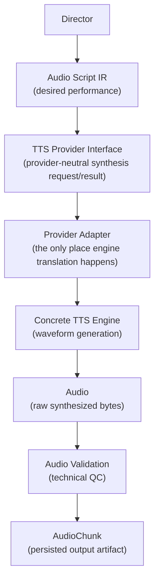

Four responsibilities, never collapsed into one another:

| Layer | Owns | Does not own |
| --- | --- | --- |
| **Audio Script IR** | The desired performance — semantic intent, fully decided upstream | Nothing about *how* to realize it acoustically |
| **TTS Provider** (interface + adapter) | Translation from semantic performance intent to provider-specific synthesis controls | Any narrative decision; any decision the IR did not already make |
| **TTS Engine** | Actual waveform generation from the adapter's translated request | Anything about identity, meaning, or the book |
| **AudioChunk** | The persisted, versioned, lineage-bearing output artifact | Its own regeneration policy (that is the Job/TTS Service's, §44) |

This is `audio-script-ir.md` §2's boundary, restated with the fourth stage (the persisted
artifact) made explicit because this document is where that artifact's producer-side contract
lives.

---

## 3. Provider independence and the `TTSProvider` interface

### 3.1 The mandate

The system **MUST** support multiple TTS engines without changing the Audio Script IR.
`context.md` §23 names XTTS-v2 and Kokoro as the two providers selected for v1 specifically
*because* they are complementary (cloning vs. speed) and because a single provider was
explicitly rejected — but no document, including this one, treats either as the permanent
solution. Nothing here assumes any provider is load-bearing.

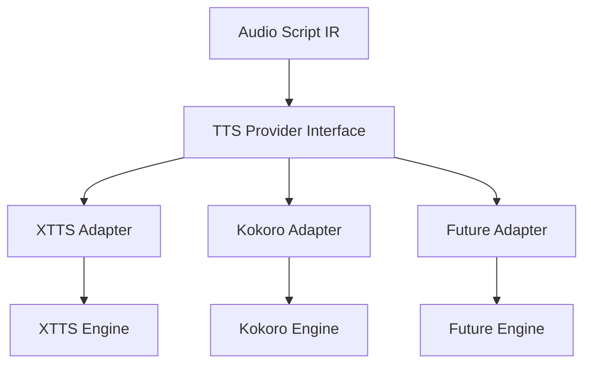

`context.md` §10.2's hard rule governs every section below: **no component outside a provider
adapter may reference an engine-specific concept.** No `if (model === 'xtts')` anywhere in the
Director, the Voice Registry, the Job Service, or this document's own conceptual interface.

### 3.2 The `TTSProvider` interface, concretized

`context.md` §10.2 sketches the interface conceptually. This document fixes its concrete
contract — the operations, their inputs, and their outputs — without specifying a language
binding:

```
TTSProvider
  id                        -> stable provider identifier (e.g. "xtts-v2", "kokoro-v1"),
                                never a hostname or worker address
  capabilities()             -> ProviderCapabilities                          (§3.3)
  prepare_voice(version)     -> ProviderVoiceHandle                           (§7.4)
  validate_voice(version)    -> { valid: bool, reason?: string }              (§7.4)
  estimate_resources(request) -> { vram_mb, estimated_duration_ms }           (§19.4)
  synthesize(request)        -> SynthesisResult                              (§5)
  health()                   -> { status, loaded_models[], vram_free_mb }
  load_model(model_version)   -> { status: READY | FAILED }                   (§18)
  unload_model(model_version) -> { status: UNLOADED }                         (§18)
```

| Operation | Purpose | Section |
| --- | --- | --- |
| `id` | Routing and lineage — a stable abstraction identifier, never provider internals | §3.1 |
| `capabilities()` | What this provider/model combination can express, declared once and cached | §3.3 |
| `prepare_voice(version)` | Resolve a `VoiceProfileVersion` into a provider-loadable handle — extract or fetch an embedding, cache it | §7.4, §9 |
| `validate_voice(version)` | A cheap precondition check before committing to synthesis (e.g., embedding dimension compatible with the loaded model) | §10 |
| `estimate_resources(request)` | Resource-aware scheduling input — VRAM and expected duration, never a guarantee | §19.4, §62 |
| `synthesize(request)` | The one operation that produces audio | §4–§5 |
| `health()` | Liveness plus loaded-model state, mirroring `api-specification.md` §18.2's worker control surface | §52 |
| `load_model` / `unload_model` | Explicit lifecycle control for the model-residency policy of §18 | §18 |

### 3.3 `ProviderCapabilities`

Restated and completed from `context.md` §10.2:

```
ProviderCapabilities
  models[]                    -> supported model identifiers
  languages[]                 -> BCP-47 tags this provider can synthesize
  max_input_chars              -> hard ceiling per synthesis request
  native_sample_rate
  supports_reference_audio     -> bool
  supports_embedding            -> bool
  supports_streaming            -> bool
  emotion_control                -> NONE | TAGS | CONDITIONING
  deterministic_seed             -> bool
  max_batch                     -> integer, this provider's safe batch ceiling (§21)
  supports_pitch_control         -> bool
  supports_speed_control         -> bool
  supports_ssml                  -> bool
  supports_phoneme_input          -> bool
```

This is a **declaration**, verified during provider certification (§70), consumed at capability
negotiation time (§34) and at chunk-sizing configuration time (§22). It is never inferred at
runtime by probing the engine mid-request.

---

## 4. Synthesis request

### 4.1 The provider-neutral shape

Enough information to reproduce a generation, and nothing more:

```
SynthesisRequest
  # identity
  audio_script_chunk_id
  audio_script_chunk_version
  audio_script_version_id       (= audio_script_id + its version)
  tts_job_id
  correlation_id
  job_id                         (the ProcessingJob envelope field, event-contracts.md §6.2)

  # content
  text                            (or spoken_text, resolved — §31.1)
  language                        (BCP-47)
  script                          (optional)

  # speaker / voice identity
  voice_profile_id
  voice_profile_version_id
  speaker_reference                (object-storage reference, event-contracts.md §17.2)

  # model
  tts_provider_id
  tts_model_version_id

  # performance instructions (semantic, never engine parameters — audio-script-ir.md §38.3)
  speaker_type, character_id, is_dialogue, delivery_mode
  emotion, emotion_intensity
  pacing, pitch, volume
  pauses[], emphasis[], pronunciation_hints[], non_verbal[]

  # generation configuration
  generation_params, generation_params_hash, seed
  target_sample_rate, target_channels
```

This is not a new schema — it is the `generate_tts_chunk` command payload
(`event-contracts.md` §16.1) as the TTS worker actually consumes it, restated here as the
provider-neutral request shape the `TTSProvider.synthesize()` operation accepts. The worker
constructs it from the envelope and IR fields it received; it is **not** a second copy fetched
independently.

### 4.2 What is deliberately not duplicated

`event-contracts.md` §16.4 already enumerates what is absent from the payload — book text beyond
the chunk itself, character traits, Story Bible facts, reference-audio bytes, model weights, any
credential, the fully-formed output key. This document does not repeat that table; it is
authoritative and unchanged. The synthesis request is exactly as large as the command payload
that carries it, because it **is** that payload, reshaped into the interface's terms.

---

## 5. Synthesis result

### 5.1 The provider-neutral shape

```
SynthesisResult
  tts_job_id
  audio_script_chunk_id
  generation_version              (this attempt's ordinal — event-contracts.md §34.2)

  provider_id
  tts_model_version_id
  voice_profile_version_id

  audio_object_key                 (never returned to any public client — §62.2)
  format                          (WAV, at the intermediate stage — §26.1)
  sample_rate
  channels
  duration_ms
  content_hash                    (SHA-256 of the produced bytes)

  generation_latency_ms
  provider_metadata                (opaque, provider-specific diagnostic bag — never
                                      interpreted outside the adapter)

  capability_gaps[]                (§32–§35 — never absent; empty array when nothing degraded)
  seed_used
```

### 5.2 The binary never travels through Redis

The result's `audio_object_key` is a **reference**, resolved after the worker has already
uploaded and verified the bytes (`event-contracts.md` §16.3 steps 6–8). No `SynthesisResult` is
ever constructed with inline audio bytes, and no queue message carries them
(`event-contracts.md` §17.1). This is not a TTS-specific rule — it is the platform-wide
object-storage-reference discipline — restated here because it is the rule most tempting to
violate at exactly this boundary (the audio has just been produced, in worker memory, and the
path of least resistance would be to hand it directly to the next step over the queue).

### 5.3 The result feeds `AudioChunk`, it is not `AudioChunk`

`SynthesisResult` is the provider adapter's return value — a transient, in-process object. It
becomes an `AudioChunk` row only after the write path of §5.2 and the freeze/verification
discipline of `database-schema.md` §16.2 (the `object_verified_at` check) have both run. The
mapping is 1:1 per successful synthesis, but the two are not the same artifact: the result is
what the adapter produced; the `AudioChunk` is what the system has verified and committed.

---

## 6. Voice architecture

### 6.1 The chain

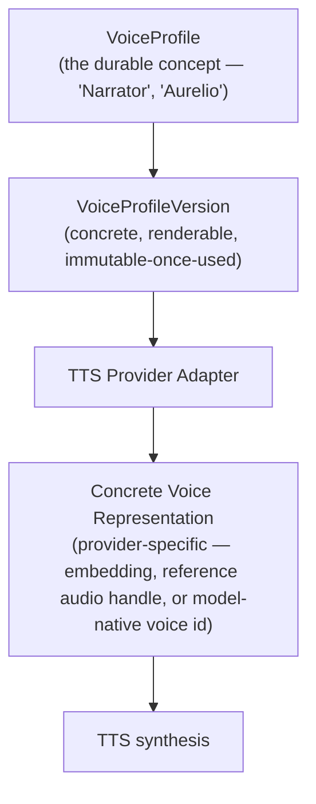

`VoiceProfile` and `VoiceProfileVersion` are owned by the Voice Service and fully specified by
`database-schema.md` §12 and `api-specification.md` §16.14 — this document does not restate
their field-by-field contract. What this document owns is the **fourth box**: how a
`VoiceProfileVersion` becomes something a specific engine can actually use.

### 6.2 The stability guarantee

> The logical voice identity (`VoiceProfile` → `VoiceProfileVersion`) **MUST** remain stable even
> if the underlying TTS provider changes.

This is enforced by construction, not by convention: `voice_profile_version.tts_provider_id` and
`voice_profile_version.tts_model_version_id` are columns *of the version*
(`database-schema.md` §12.2). Changing the provider or model for a character is not a mutation of
an existing version — `context.md` §9.3 rule 3 is explicit: *"changing the TTS model or its
version cannot preserve timbre; it therefore mandates a new `VoiceProfileVersion`."* The logical
voice concept (`VoiceProfile`) survives across such a change; the specific rendering
configuration does not, and is never asked to.

---

## 7. Voice profile types

### 7.1 The five representations, and why the core does not depend on any one

| Type | Description | Where it lives |
| --- | --- | --- |
| Predefined model voice | A voice built into the engine (no reference audio needed) | `voice_profile_version.reference_provenance = LIBRARY`; `reference_audio_storage_key` may be `NULL` |
| Reference-audio voice | A short reference clip conditions the model at synthesis time | `reference_audio_storage_key` set; `reference_provenance = UPLOADED` |
| Cloned voice | A trained or fine-tuned voice derived from more extensive reference material | `derived_from_version_id` may link to the source version; `reference_provenance = UPLOADED` or `SYNTHESIZED` |
| Embedding-based voice | A precomputed speaker embedding conditions the model, independent of holding the raw audio at synthesis time | `embedding_storage_key` set |
| Locally trained / custom voice | A model fine-tuned or trained specifically for one voice | `reference_provenance = SYNTHESIZED`; the "model" itself may be the voice, in which case `tts_model_version_id` is unique to it |

### 7.2 The architecture does not depend on one representation

`VoiceProfileVersion` is the **logical concept**; §7.1's five types are **provider-specific
implementations behind it** (`context.md` §9.2 already lists `speaker_reference` as carrying
*"reference-audio object key(s) and/or speaker embedding object key"* — the "and/or" is
deliberate). A provider adapter reads whichever of `reference_audio_storage_key` /
`embedding_storage_key` / bare `tts_model_version_id` its engine actually requires and ignores
the rest. No core business logic branches on which representation a given voice uses — that
branching, if any is needed, lives entirely inside the adapter (§3.1).

### 7.3 Do not assume every voice needs reference audio

A predefined model voice needs neither reference audio nor an embedding — `capabilities()`
(§3.3) declares `supports_reference_audio` and `supports_embedding` independently precisely so a
provider that ships built-in voices is fully expressible: `prepare_voice()` for such a voice may
resolve immediately from `tts_model_version_id` alone.

### 7.4 `prepare_voice` and `validate_voice`

`prepare_voice(version)` is where representation-specific resolution happens: fetching and
caching an embedding, or loading reference audio into the adapter's working set. It runs once per
`(worker, VoiceProfileVersion)` combination and its result is cached (§9), never re-run per
chunk. `validate_voice(version)` is a cheap precondition — does this representation match what
the currently-loaded model expects — checked before a synthesis attempt is scheduled, so a
mismatch (§11) surfaces as a scheduling-time rejection rather than a wasted inference attempt.

---

## 8. Voice embeddings

### 8.1 Handling

Embeddings are **generated once**, per `(VoiceProfileVersion, extractor model version)`, **cached**
in worker memory/VRAM with an LRU (`context.md` §10.4 step 3), **stored in object storage** so
other workers reuse the extraction rather than repeating it, **referenced by metadata** in
PostgreSQL (`voice_profile_version.embedding_storage_key`,
`embedding_extractor_model_version_id`, `embedding_content_hash`,
`database-schema.md` §12.2), and **regenerated** only when voice/model compatibility changes
(§9).

### 8.2 PostgreSQL stores metadata and references, never the binary

This is not a TTS-specific rule — `context.md` §12.1 forbids speaker embeddings in PostgreSQL
categorically — but it is the rule most directly relevant to this document's subject matter, so
it is restated: `voice_profile_version.embedding_storage_key` is a **reference**; the vector
itself lives in object storage, addressed exactly like reference audio (`database-schema.md`
§5.7's boundary table lists it explicitly).

---

## 9. Embedding compatibility

### 9.1 Voice identity versus provider/model-specific representation

> A voice embedding generated for one model may not be valid for another model.

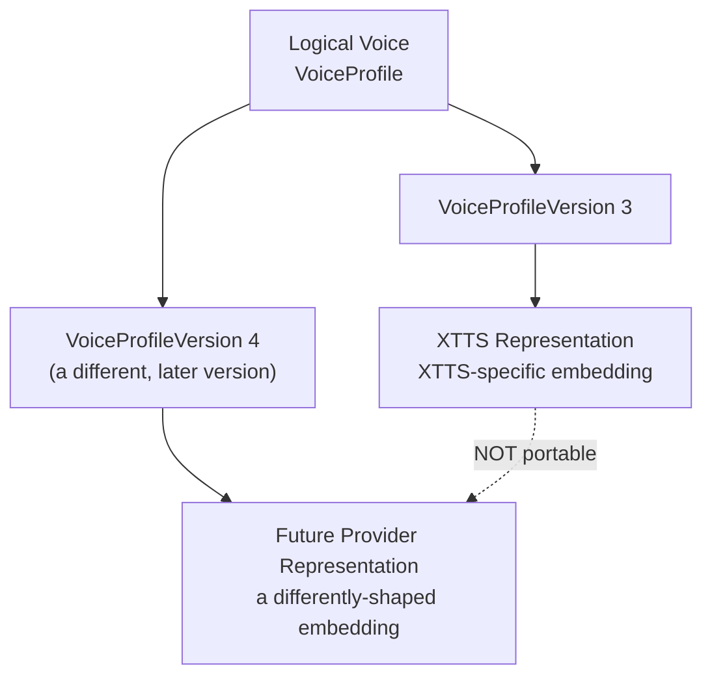

`database-schema.md` §12.2 already enforces the consequence: `voice_profile_version.
embedding_extractor_model_version_id` is recorded on the row, and the version's
`identity_fingerprint` includes `embedding_content_hash` — so an embedding produced by extractor
X is a **different fact** from one produced by extractor Y, even for the "same" voice, and they
cannot silently substitute for each other.

### 9.2 The consequence for provider/model switches

Changing the bound TTS model for a character (§41) is, by construction, a **new
`VoiceProfileVersion`** (§6.2), and that new version's `prepare_voice()` call re-extracts or
re-validates the embedding against the new model — it never reuses a prior version's embedding
under the new model's assumptions. `validate_voice()` (§7.4) is the mechanical check: a worker
that finds an embedding whose extractor is incompatible with its loaded model rejects the request
before wasting a synthesis attempt, with a typed error (`VOICE_MODEL_INCOMPATIBLE`, §79).

### 9.3 Embeddings are never assumed universally portable

No provider adapter, and no scheduling logic outside an adapter, may treat an embedding produced
for provider A as valid input to provider B's model. Where a provider migration is genuinely
desired for an existing character, the correct path is casting a **new** `VoiceProfileVersion`
under the new provider (with preview and approval, `api-specification.md` §16.14) — not a
silent, cross-provider embedding reuse that would produce voice drift nobody explicitly decided
on.

---

## 10. Voice consistency

### 10.1 The rule, restated for the TTS subsystem specifically

> Character A's chapter-1 audio and chapter-20 audio **MUST** use the same
> `VoiceProfileVersion`, unless a human explicitly created and approved a new one.

```
Character A
  Chapter 1   → VoiceProfileVersion V3
  Chapter 10  → VoiceProfileVersion V3
  Chapter 20  → VoiceProfileVersion V3
```

### 10.2 The TTS subsystem's specific obligations

The TTS subsystem does not itself *decide* this consistency — that is the Voice Service's and
the assembly-time verification's job (`database-schema.md` §12.5, restated in
`director-specification.md` §40.1). What the TTS subsystem **MUST** do, at its own layer:

1. **Never silently switch to another voice version.** A `SynthesisRequest`'s
   `voice_profile_version_id` is exactly what was resolved and pinned upstream (§4.1); the worker
   does not "improve" or "correct" it.
2. **Record what actually rendered.** Every `AudioChunk` carries the `voice_profile_version_id`
   that was actually used (`database-schema.md` §16.2), which is what makes the assembly-time
   consistency check (§10.1's guarantee) verifiable rather than assumed.
3. **Refuse a mismatch rather than approximate it.** If `prepare_voice()` or `validate_voice()`
   finds the pinned version unusable for any reason, the correct response is a typed failure
   (§79), never a silent substitution of a "close enough" voice.

---

## 11. Voice locking

### 11.1 The TTS subsystem respects the existing lifecycle without exception

`VoiceProfileVersion.approval_state` and `lock_state` are fully specified by
`database-schema.md` §12.2 and `api-specification.md` §16.14; this document does not redefine
them. What matters here is the **consequence for synthesis**:

| State | TTS subsystem behavior |
| --- | --- |
| `DRAFT` | Not eligible for production synthesis. Reachable only via `generate_voice_preview` (§47), which is disposable and outside audiobook lineage |
| `PREVIEW_GENERATED` | Same — still preview-only |
| `APPROVED` | Eligible for production synthesis. **Not yet locked** — becomes `LOCKED` automatically the moment the first `TTSJob` for it enters `RUNNING` |
| `LOCKED` | The version used for this and every subsequent chunk targeting this character, until an explicit new version is approved and its impact set accepted (`director-specification.md` §45.3, `api-specification.md` §16.14) |
| `RETIRED` | Not selectable for *new* assignments; **existing generated audio remains valid and playable** |

### 11.2 Never resolve "current voice" at generation time

> `character_id → current voice` **MUST NEVER** be resolved during generation.

The TTS subsystem receives `character_id` **and** `voice_profile_version_id` in the synthesis
request, and treats the latter as authoritative. There is no code path — and `database-schema.md`
§37.2 makes it a permission error, not merely a missing feature — by which a TTS worker could
even attempt to resolve `character_id` to "whatever the current voice happens to be." It has no
`SELECT` on `voice_assignment`.

---

## 12. Voice resolution boundary

### 12.1 Who decides what

| Question | Answered by |
| --- | --- |
| "Who is this character?" | **Director**, via speaker/character resolution (`director-specification.md` §11–§14) |
| "Which logical voice does this character have?" | **Voice Assignment** (`voice_assignment`, Voice Service) |
| "Which exact version renders this chunk?" | **Audio Script IR** — the Director resolves and records the concrete `voice_profile_version_id` at IR-generation time (`director-specification.md` §45.3) |
| "How does this provider realize that voice?" | **TTS** — provider-specific representation resolution (§7) |

### 12.2 What the TTS subsystem must never decide

The TTS subsystem **MUST NOT** decide "who is this character" in any form. It receives an
already-resolved `voice_profile_version_id` and, separately and only for lineage purposes, a
`character_id` label (`event-contracts.md` §16.2: *"`character_id` is present but is a label, not
a lookup key. The worker records it for lineage; it has neither the permission nor the need to
resolve it."*). This document does not weaken that boundary in any direction.

---

## 13. Model versioning

### 13.1 Every generation references an explicit `ModelVersion`

Never *"whatever model is currently installed."* `database-schema.md` §14.3 already provides the
mechanism (`model_version`, immutable, `params_fingerprint`); this document fixes what a TTS
generation specifically records, mirroring `director-specification.md` §29 for the LLM side:

| Recorded | Field |
| --- | --- |
| Provider | `tts_provider_id` (stable abstraction id) |
| Model | `model_registry.model_id`, via `tts_model_version_id` |
| Model version | `model_version.version` |
| Revision/commit (where applicable) | `model_version.config` (`jsonb`) |
| Quantization | `model_version.config` |
| Runtime version (where output-affecting) | `model_version.config` — recorded **only** when it affects output; a non-output-affecting runtime patch is not a new `model_version` |
| Supported languages | `model_registry`/provider `capabilities()` (§3.3), not duplicated onto every generation |
| Supported capabilities | `capabilities()` (§3.3) |

### 13.2 No fallback to a similar model

If the pinned `tts_model_version_id` is not loadable, the job **fails terminally** — it does not
fall back to a similar model, because a fallback would produce audio whose recorded lineage is a
lie (`event-contracts.md` §15.6, restated here for the TTS-specific case). This is distinct from
*model fallback as an explicit, recorded decision* (§41), which is a different, human-initiated
operation.

### 13.3 Model version drift is quarantined, not tolerated

Every worker reports the exact model version it has loaded at boot and on health checks
(§3.2 `health()`); a worker running an unexpected model version is **quarantined**
(`worker.status = QUARANTINED`, `database-schema.md` §15.5) rather than allowed to produce
mixed-version audio (`context.md` §10.4 step 9).

---

## 14. Model registry usage

### 14.1 Discovery, without duplication

A TTS worker discovers model location, type, provider, version, capabilities, hardware
requirements, and supported voices/languages from the existing `model_registry` /
`model_version` tables (`database-schema.md` §14.2–§14.3), **not** from a parallel
TTS-specific registry this document does not introduce.

| Worker needs to know | Source |
| --- | --- |
| Model location (where to fetch weights) | `model_version.weights_storage_key` |
| Model type / provider / version | `model_registry.role = 'TTS'`, joined to `model_version` |
| Capabilities | The provider adapter's own `capabilities()` (§3.3) — declared, not derived from the registry row, because capability is a property of the **adapter's integration**, not the raw model file |
| Hardware/memory requirements | `model_version.config` (`jsonb`) — recorded per the benchmark of §69, not guessed |
| Supported voices | Not a registry concern — voices are `VoiceProfileVersion` rows bound to a model, discovered via `voice_assignment`/`voice_profile_version.tts_model_version_id` |
| Supported languages | Provider `capabilities().languages[]` |

### 14.2 Boot-time verification

At boot, a worker fetches its assigned model set, verifies each model's weights checksum against
`model_version.weights_content_hash` before loading (`context.md` §10.4 step 1), and only then
registers its capabilities and begins consuming. A checksum mismatch is a boot-time failure, not
a runtime one — the worker never enters `READY`.

---

## 15. Local model support

### 15.1 Architecture

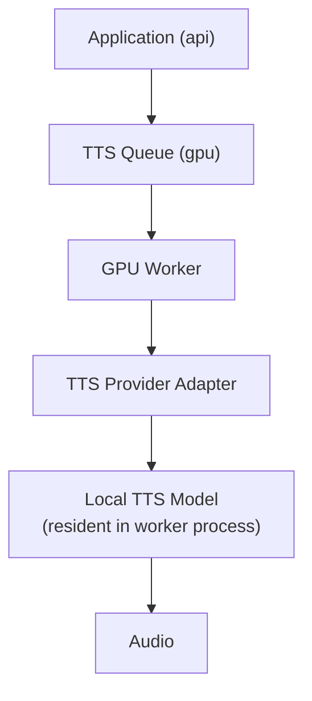

### 15.2 The API/backend never performs GPU inference synchronously

This is `context.md` §2.3's hard rule (no HTTP handler may invoke a TTS model inline), restated
because it bears directly on this document's subject: `POST /books/{bookId}/tts`
(`api-specification.md` §16.15) validates preconditions and enqueues; it **never** waits for a
synthesis result, regardless of whether the target model is local or API-based (§16).

---

## 16. API-based provider support

### 16.1 Architecture

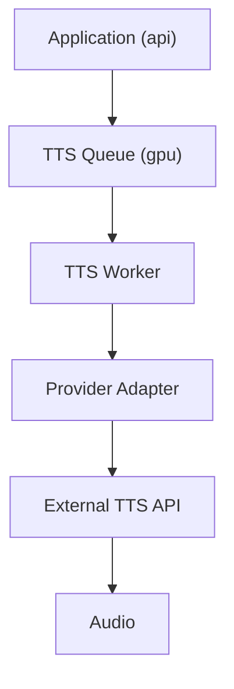

### 16.2 The business contract is identical

Whether the target engine is local (§15) or an external API, the `TTSProvider` interface (§3.2),
the synthesis request/result shapes (§4–§5), the idempotency and caching rules (§42–§43), and the
validation chain (§27–§30) are **unchanged**. The only difference is what happens inside the
adapter and inside `synthesize()` — a local adapter invokes an in-process or co-located model; an
API adapter makes an outbound authenticated request and translates the response. Neither
difference is visible to any code outside the adapter (§3.1).

### 16.3 API-provider-specific concerns, still behind the adapter

Credential management (§71), rate-limit handling as a retry class (§60), and outbound-network
egress rules (§71) are all adapter-internal or worker-infrastructure concerns; they do not
introduce a second business contract.

---

## 17. GPU worker model

### 17.1 The ten steps

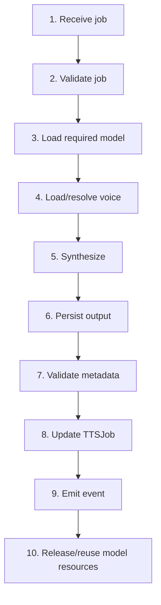

| Step | Detail |
| --- | --- |
| 1. Receive job | Dequeue from `gpu`, per capability-based routing (`context.md` §10.3) — the worker only receives jobs whose target model it advertises |
| 2. Validate job | Envelope validity, unimplemented-MAJOR-schema rejection, cancellation-flag check, idempotency pre-check (§42) |
| 3. Load required model | Amortized, not per-job (§18) — a resident model is reused; a cold model is loaded per §18's lifecycle |
| 4. Load/resolve voice | `prepare_voice()` (§7.4), cached per `(worker, VoiceProfileVersion)` with an LRU |
| 5. Synthesize | The one `synthesize()` call; per-chunk timeout scaled by input length (§55) |
| 6. Persist output | Upload to object storage; **verify** by returned ETag/checksum before proceeding (§62.4, `event-contracts.md` §16.3 step 7) |
| 7. Validate metadata | The technical checks of §27–§30, run either inline or as the immediately following `validate_audio` job — the boundary is defined in §27.3 |
| 8. Update `TTSJob` | Via the internal control surface (`api-specification.md` §17.5), never a direct database write bypassing the lease-fence discipline |
| 9. Emit event | `tts.chunk_completed` / `tts.chunk_failed`, via the Outbox, in the same transaction as the domain write (`event-contracts.md` §19) |
| 10. Release/reuse resources | Model stays resident per §18's policy; voice cache entries age out via LRU; no per-job teardown of the model itself |

### 17.2 One GPU does not run unlimited concurrent requests

Concurrency is bounded by measured VRAM headroom and throughput, never assumed
(§20, `context.md` §10.4). A worker that has not benchmarked its safe concurrency **MUST NOT**
accept work beyond a conservative default.

---

## 18. Model loading

### 18.1 Lifecycle

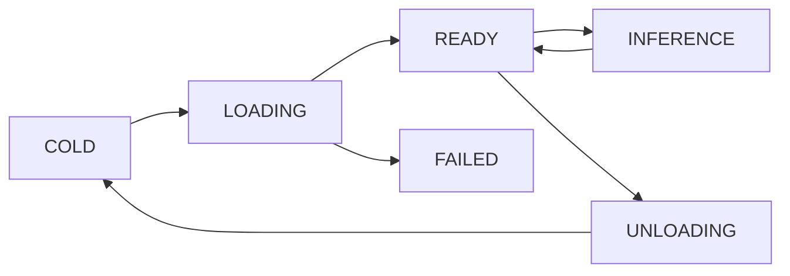

| State | Meaning |
| --- | --- |
| `COLD` | Weights not resident |
| `LOADING` | Weights being loaded and verified (§14.2) |
| `READY` | Resident, warmed, accepting inference |
| `INFERENCE` | Actively synthesizing (may overlap across a batch, §21) |
| `UNLOADING` | Explicitly evicted (memory pressure, model switch, drain) |
| `FAILED` | Load failed — worker does not enter `READY`; reported via `health()` and, if persistent, the worker is not registered as capable of that model |

### 18.2 Preload, lazy loading, caching, eviction

| Concern | Policy |
| --- | --- |
| **Model preload** | A worker's assigned model set is loaded at boot (`context.md` §10.4 step 1) — not lazily on first job, because per-job loading would dominate runtime |
| **Lazy loading** | Permitted for a *secondary* model a worker is configured to serve on demand (e.g., an occasionally-used language variant), never for the worker's primary model |
| **Model caching** | A loaded model stays resident across thousands of jobs — *"model load is amortized across thousands of chunks and MUST NOT happen per job"* (`context.md` §10.4 step 2) |
| **Eviction** | Under memory pressure, the least-recently-used **non-primary** model is unloaded first; a worker's primary/assigned model is evicted only on explicit reconfiguration or drain |
| **Model switching** | A worker configured for multiple models switches between them only when idle between jobs, never mid-batch |

### 18.3 Frequently used models stay resident

The architecture's steady-state goal is **near-zero model-load events** — `event-contracts.md`
§44.2 already names *"model-load count — should be near zero in steady state"* as a first-class
metric. A worker whose model-load count is not near zero in production is a capacity-planning
signal, not a normal operating mode.

---

## 19. GPU memory management

### 19.1 Considerations, not hard-coded numbers

VRAM, model size, quantization, batch size, concurrent inference, voice-embedding memory, and
audio-buffer memory all consume the same finite VRAM budget. This document fixes the
**considerations and the configuration surface**, never a hardware-specific number
(`context.md` §21's numeric-values-are-configuration discipline applies here as everywhere).

### 19.2 Configuration and benchmarking requirements

| Concern | Requirement |
| --- | --- |
| VRAM budget per model | Measured per `(model, quantization, GPU type)` combination, recorded in deployment configuration, never assumed portable across GPU generations |
| Batch size | Derived from measured throughput at a given VRAM headroom (§21), not a fixed constant across all deployments |
| Concurrent inference | Bounded by the worker's own `capabilities().max_batch` and its measured safe concurrency, advertised by the worker itself (§17.2, `context.md` §10.4 step 4: *"workers advertise their own concurrency; the queue does not guess"*) |
| Voice embedding memory | Bounded by the LRU cache size (§8.1), itself a configuration value sized against the VRAM budget left over after the model |
| Audio buffers | Sized to the largest permitted chunk (`max_input_chars`, §3.3), never unbounded |

### 19.3 One model instance per GPU by default

`context.md` §10.4: two model copies in one GPU's VRAM usually means neither fits comfortably. A
deployment that wants to run two smaller models concurrently on one GPU does so as an explicit,
benchmarked configuration choice, not the default assumption.

### 19.4 `estimate_resources` is advisory, not a guarantee

The `estimate_resources()` operation (§3.2) informs scheduling (§62) but is explicitly **not** a
commitment — actual VRAM usage at synthesis time may vary with input length and batch
composition. A scheduler that treats the estimate as exact and packs workers to the byte will
eventually OOM; the OOM retry path (§58) exists precisely because the estimate is advisory.

---

## 20. Concurrency

### 20.1 Parallel chunk processing where hardware allows

```
Chapter 1:
  Chunk 1 → GPU Worker A
  Chunk 2 → GPU Worker B
  Chunk 3 → GPU Worker A
  Chunk 4 → GPU Worker C
```

`context.md` §20.3: chunks are independent by design — *"no chunk may depend on another chunk's
audio output"* — which is what makes this diagram correct rather than merely convenient. Chunk
ordering (§65) is entirely an assembly-time concern; generation itself is unordered
(`event-contracts.md` §28.1: `generate_tts_chunk` is explicitly "NO — fully parallel").

### 20.2 What bounds concurrency

| Constraint | Mechanism |
| --- | --- |
| VRAM | §19 |
| Model loading cost | Amortized residency (§18) means loading cost is not a per-request concern once warm |
| Provider limitations | `capabilities().max_batch`, rate limits for API providers (§60) |
| Thermal constraints | Deployment/infrastructure concern, surfaced through `health()` degrading before a hard failure, never modeled by this document numerically |
| Queue priorities | §57 |

---

## 21. Batching

### 21.1 The contract, restated as binding on the TTS subsystem specifically

`event-contracts.md` §32 already fixes this in full; this document does not re-derive it, only
restates the consequence for provider adapters:

> **Chunk-level identity is preserved even when transport batching is introduced. A batch must
> never destroy individual retryability, ordering, or provenance.**

| Preserved regardless of batching | |
| --- | --- |
| One `ProcessingJob` per chunk | Individually retryable, cancellable, dead-letterable |
| One `TTSJob` per chunk | Individual `dedupe_key` and parameters |
| One `AudioChunk` per chunk | Individual lineage, hash, validation, supersede chain |
| One `tts.chunk_completed` per chunk | Individual observability |

### 21.2 Batching is a worker-side execution strategy, never a protocol change

A provider adapter **MAY** claim *n* compatible messages sharing `(model, voice_version,
generation_params)` and issue one model invocation, per `context.md` §10.4 step 5. If the batch
fails, each member's job fails and retries **independently** — this is what makes the OOM
recovery path (§58: reduce batch → single item) expressible at all. Batching that could not be
unwound member-by-member on failure would not be a valid implementation of this contract.

### 21.3 Batches must not cross voice versions

Unless the engine **provably** supports per-item conditioning (a capability the adapter must
positively assert, not assume), a batch **MUST NOT** mix chunks bound to different
`voice_profile_version_id`s. A batch that silently conditioned several chunks on one voice would
produce audio whose recorded lineage is false — the assembly-time voice-consistency check would
pass while the audio is actually wrong, because that check reads the *recorded* value, not the
audio itself (`event-contracts.md` §32.3).

### 21.4 There is no chapter-batch command

The command is per chunk; there is no `generate_tts_chapter`. Collapsing many jobs into one would
destroy per-chunk retryability and idempotency (`event-contracts.md` §32.4). Batching, where
adopted, happens strictly inside a worker's execution of already-independent, already-claimed
per-chunk messages.

---

## 22. Chunk size

### 22.1 The TTS layer does not introduce a second chunking algorithm

Chunk boundaries are entirely an Audio Script IR concern (`audio-script-ir.md` §10) —
semantic, never fixed-width, decided by the Director. The TTS subsystem consumes chunks as given.

### 22.2 What the TTS layer may do

| Action | Permitted? |
| --- | --- |
| Reject a chunk that exceeds `max_input_chars` for the target provider | **Yes** — this is a validation failure (`INVALID_PERFORMANCE_METADATA`-class, or, if surfaced at the TTS layer specifically, a distinct provider-capacity error), never a silent truncation |
| Silently re-segment a chunk into multiple synthesis calls without recording the transformation | **No** — this would produce two audio artifacts from what the IR and the database both believe is one chunk, breaking the 1:1 `AudioScriptChunk ↔ current AudioChunk` invariant (`database-schema.md` §16.2) |
| Split a chunk into multiple synthesis calls **with the transformation recorded** (e.g., as multiple `AudioChunk`s stitched at the assembly layer) | **Not adopted in v1** — `max_input_chars` is already sized so this should not occur for a correctly-chunked IR (`audio-script-ir.md` §10.3); if it does occur, it indicates the Director's chunk sizing configuration is out of step with the bound provider, which is a configuration defect to fix upstream (§22.3), not a runtime workaround to build here |

### 22.3 The actual fix for an over-large chunk is upstream

`audio-script-ir.md` §10.3: `effective_max_chars = min(ir_absolute_ceiling,
provider.max_input_chars)`, fed back into Director chunk sizing **via configuration**, not
runtime coupling. A chunk that exceeds the bound provider's limit is therefore evidence that this
configuration value is stale relative to the actual bound provider — the correction is
re-chunking at the Director layer (a `revise_director_ir` run, `director-specification.md`
§43.2), not an ad hoc TTS-layer re-segmentation.

---

## 23. Long-form consistency

### 23.1 Consistency inputs

Across thousands of chunks, the TTS worker must use the **same configuration for equivalent
generations**:

```
VoiceProfileVersion  · ModelVersion  · generation configuration
language              · sample rate    · provider  · speaker identity
pronunciation configuration
```

### 23.2 How this is guaranteed, not merely intended

Every one of these is pinned in the `SynthesisRequest` (§4.1), sourced from the pinned IR chunk
and the pinned voice binding — never resolved by the worker itself (§11.2, §13.1). Two chunks
bound to the same `VoiceProfileVersion` and the same `tts_model_version_id` will therefore always
receive identical `voice_profile_version_id`/`tts_model_version_id` inputs; the only source of
legitimate variation between them is the IR's own per-chunk performance fields (emotion, pacing,
etc.) and the seed, both of which are supposed to vary. There is no configuration surface by
which two "equivalent" generations could diverge in provider, model, or voice without an explicit
upstream decision producing that divergence.

---

## 24. Audio continuity

### 24.1 Independent generation, mitigated discontinuity

Chunk-level independence (§20) is what makes throughput scale, but it creates a real risk:
audible discontinuities at chunk boundaries if nothing guards against them. Mitigations:

| Mitigation | Owned by |
| --- | --- |
| Stable voice embedding across a character's chunks | TTS — the same `VoiceProfileVersion`/embedding is used for every chunk of that character, never re-derived per chunk |
| Consistent sample rate | TTS — `target_sample_rate` is fixed per project configuration, not per chunk |
| Consistent loudness target | **Not TTS** — a light per-chunk normalization pass and an authoritative per-chapter integrated pass, both owned by Audio Processing (§25, `context.md` §13.3) |
| Deterministic generation configuration | TTS — `generation_params` is fixed per `VoiceProfileVersion`'s baseline, varied only by the IR's own explicit performance fields |
| Controlled pauses | **Not TTS** — the IR's pause plan is applied by Audio Processing, never left to whatever silence the engine happens to emit (`context.md` §13.3) |
| Optional overlap/crossfade | **Not TTS** — Audio Assembly, at join points only, short and disabled by default for dialogue (`context.md` §13.3) |
| Silence normalization | **Not TTS** — Audio Processing trims engine-emitted silence before the IR's intended pause is inserted |

### 24.2 The separation this table encodes

TTS synthesis produces a waveform that is *internally* consistent (same voice, same rate, same
configuration); it does **not** attempt to smooth the *seams between* chunks — that is audio
post-processing's job, and conflating the two is exactly what §25 forbids.

---

## 25. Post-processing boundary

### 25.1 What belongs to TTS versus Audio Processing

| TTS | Audio Processing |
| --- | --- |
| Waveform synthesis | Resampling to the project's canonical rate |
| Provider-specific speech controls (inside the adapter) | Loudness normalization (per-chunk light pass, then per-chapter/book authoritative pass) |
| — | Silence trimming (engine-emitted silence removed) and IR pause-plan application |
| — | Format conversion |
| — | Channel conversion |
| — | Concatenation (chapter assembly) |
| — | Crossfade at joins |
| — | Final encoding (delivery formats) |

### 25.2 Do not overload the TTS provider interface with mastering responsibilities

`context.md` §13.1 already fixes the pipeline order (`TTS output → technical validation →
loudness normalization → silence/pause processing → optional crossfade → chapter assembly →
audiobook assembly → final encoding`), and every stage after "TTS output" belongs to the Audio
Processing / Audio Assembly services, never to a `TTSProvider` adapter. A provider adapter that
performed its own loudness normalization or its own pause insertion would be duplicating a
downstream stage's responsibility and very likely producing an inconsistent result across
providers, since each engine's native output characteristics differ — which is precisely why
normalization is centralized downstream rather than delegated per-provider.

---

## 26. Audio format and sample rate

### 26.1 Canonical intermediate format

| Property | Value | Rationale |
| --- | --- | --- |
| Container | WAV (PCM) | `context.md` §13.2: lossless; repeated re-encoding of intermediates would compound artifacts |
| Sample rate | A single project-canonical rate, configured per deployment | Consistency across providers whose native rates differ (§26.2) |
| Bit depth | 16-bit or 24-bit PCM, configuration | Sufficient headroom for the subsequent normalization pass without introducing quantization artifacts before mastering |
| Channels | Mono for narration/dialogue (the overwhelming default) | Matches every provider's native output for speech synthesis; stereo is not fabricated where the source is mono |

The internal format optimizes for quality and processing reliability, not storage size — exactly
one lossy encode happens, at the final delivery step (`context.md` §13.2), never earlier.

### 26.2 Providers do not produce identical output

```
Provider A output (e.g. 24 kHz) ─┐
Provider B output (e.g. 22.05 kHz) ─┼──► Audio normalization ──► Canonical internal format
Provider C output (e.g. 16 kHz) ─┘
```

The architecture **assumes heterogeneous provider sample rates** and does not require every
provider to natively match the project's canonical rate — resampling to the canonical rate is an
Audio Processing responsibility (§25.1), applied uniformly regardless of which provider produced
the input. `AudioChunk.sample_rate` records the **as-produced** value; the *processed* artifact
(after Audio Processing) is what carries the canonical rate.

---

## 27. Loudness

### 27.1 What TTS exposes, and what it does not do

The TTS result carries loudness-relevant **metadata** — `peak_dbfs`, `integrated_lufs` (as
measured on the raw synthesized output, before any normalization pass), `rms_dbfs` — sufficient
for later validation and mastering (§30, `database-schema.md` §16.2's technical column group).
The TTS engine itself is **not** required to perform final audiobook mastering; that target
(nominal −18 to −20 LUFS integrated, true-peak ceiling near −3 dBTP, `context.md` §13.3) is
applied downstream, in two passes (a light per-chunk pass, then an authoritative
per-chapter/book pass), neither of which is a TTS responsibility.

### 27.2 Why raw measurement still matters

An engine that is producing systematically clipped or near-silent output is a **synthesis
defect**, not a normalization opportunity — the raw measurement is what §29 (clipping) and §33
(duration/silence anomalies) validate *before* any downstream correction is attempted. Feeding
already-mastered-sounding audio into validation would mask exactly the defects validation exists
to catch.

---

## 28. Audio validation

### 28.1 Checks run immediately after synthesis

| Check | Purpose |
| --- | --- |
| File exists | The upload actually completed |
| File readable | Not corrupt at the container level |
| `duration_ms > 0` | Not an empty synthesis |
| Sample rate matches expected | Provider-output sanity |
| Channels match expected | Provider-output sanity |
| Valid encoding | Decodable by the downstream pipeline |
| No corruption (NaN/Inf samples) | A known failure mode of some inference paths |
| Checksum recorded | Integrity, cache key, dedup input (§20.1 of `database-schema.md`) |
| Silence anomalies | §33 |
| Clipping | §34 |
| Unexpected extremely short output | §35 |
| Unexpected extremely long output | §35 |

### 28.2 Integration with `AudioChunk` and `ProcessingJob`

These checks are exactly `context.md` §14.3's "TTS/technical validation" set, expressed as the
`validate_audio` job (`event-contracts.md` §11.11), writing `audio_chunk.validation_status` and
`audio_chunk.validation` (`database-schema.md` §16.2). This document does not introduce a
parallel validation record — the `AudioChunk` row **is** where validation outcome lives, and
`ProcessingJob`/`ProcessingAttempt` (via `validate_audio`'s own job) is where the *attempt* to
validate is recorded.

### 28.3 Where the boundary between "TTS" and "Audio Validation" actually falls

`validate_audio` is a **separate job type**, on the `audio` queue, consuming `worker-cpu`, not
the GPU worker that synthesized the chunk (`event-contracts.md` §5.2). The GPU worker's own
obligation (§17.1 step 6–7) is limited to a cheap, immediate sanity check before it reports
success (file exists, readable, non-zero duration, upload verified) — the fuller technical QC
chain of §28.1 runs as its own downstream job, which is what keeps GPU worker time reserved for
synthesis rather than CPU-bound validation work.

---

## 29. Quality gates

### 29.1 The gate sequence

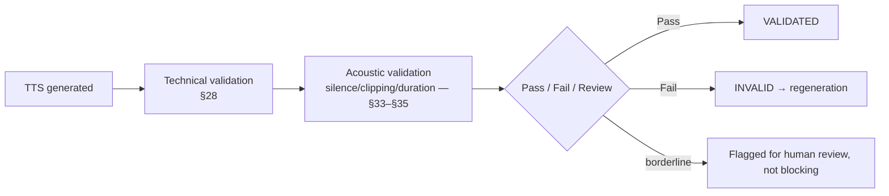

### 29.2 A failed chunk never automatically becomes valid content

`audio_chunk.status = INVALID` triggers regeneration of that chunk only
(`context.md` §14.3), bounded, then escalating to `NEEDS_REVIEW`. There is no path by which a
failed technical check is overridden automatically — human override, where it exists, is an
explicit action recorded in `audit_log`, never a default.

---

## 30. Silence detection

### 30.1 What is detected

Complete silence (RMS below a floor for the entire chunk) · excessive leading silence · excessive
trailing silence · unnatural internal gaps.

### 30.2 Do not aggressively trim intentional dramatic pauses

The Audio Script IR is authoritative for intentional pauses (`director-specification.md` §19.3,
`audio-script-ir.md` §22). Silence *detection* at the TTS-validation layer flags **engine-emitted**
silence anomalies — an unnaturally long gap the model produced that was not requested by any
`pauses[]` entry — never the IR's own deliberate pause plan, which is applied downstream by Audio
Processing (§25.1), not trimmed by TTS validation. The distinguishing signal is straightforward:
a pause the IR requested is expected at that offset and of that approximate duration; a pause
detection failure is silence *the IR did not ask for*, at an unexpected position or of anomalous
length.

---

## 31. Pronunciation

### 31.1 The TTS subsystem consumes, it does not infer

The TTS subsystem consumes pronunciation instructions from the Audio Script IR
(`pronunciation_hints[]`, `director-specification.md` §22) and **does not independently infer
pronunciation** except as an explicitly configured fallback for spans the IR left unannotated
(ordinary, unremarkable words — the overwhelming majority of any text — rely on the engine's own
built-in pronunciation, which is not "inference" in the sense this rule forbids; the rule forbids
the TTS layer second-guessing an explicit hint or inventing pronunciation guidance for a
proper noun the Director specifically annotated).

### 31.2 Translation happens in the adapter

The provider adapter translates the IR's canonical pronunciation representation — IPA (preferred)
or a `lexicon_key` resolving to IPA (`audio-script-ir.md` §25–§26) — into whatever
provider-specific format that engine actually consumes: an engine phoneme set, ARPAbet, an
engine's own lexicon syntax, or SSML `<phoneme>` markup where the adapter targets an
SSML-consuming provider (§25.1's post-processing boundary and §40.3 of `audio-script-ir.md`'s
SSML discussion both apply unchanged: SSML, where used at all, exists **only** inside an adapter,
never as the IR's own representation).

---

## 32. Emotion support and capability handling

### 32.1 The vocabulary is already fixed — this document does not reopen it

`director-specification.md` §4.1 fixes the closed `emotion` vocabulary (17 members);
`audio-script-ir.md` §39.2 fixes the capability-handling vocabulary at exactly three levels:

```
NATIVE · APPROXIMATED · UNSUPPORTED
```

This document adopts both **unchanged**. It does **not** introduce a fourth level (`DEGRADED`)
or a fifth (`UNKNOWN`) for per-chunk capability recording — `audio-script-ir.md` §39.2 already
considered and rejected `DEGRADED` as not reliably distinguishable from `APPROXIMATED` in
practice, and that reasoning applies without modification here. A provider adapter reports
exactly one of these three per requested field it could not honor exactly as asked.

### 32.2 What "support" governs

`emotion_control` (`NONE | TAGS | CONDITIONING`, §3.3) is the provider's *mechanism* for
expressing emotion at all; `emotion_capability_map` (`voice_profile_version.
emotion_capability_map`, `database-schema.md` §12.2) is the **per-emotion, per-voice**
declaration of how well that mechanism honors each of the 17 members — recorded because two
voices bound to the same engine can still differ in fidelity (a voice with sparse reference
material may approximate `GRIEF` less convincingly than one with rich reference coverage, even on
identical hardware).

### 32.3 Never silently discard performance metadata

Every field the IR requests that the provider cannot honor exactly is recorded as a
`capability_gap` (§35), never dropped. This applies equally to `emotion`, `delivery_mode`,
`pacing`, `pitch`, `volume`, `pauses[]` (where the *engine's own* production, as opposed to the
Audio-Processing-applied pause plan, is at issue), `emphasis[]`, `pronunciation_hints[]`, and
`non_verbal[]`.

---

## 33. Performance capability matrix

### 33.1 The matrix

Illustrative — actual provider capability values **MUST** be verified during implementation and
certification (§70), never assumed from this table:

| Capability | XTTS-v2 | Kokoro | Future provider |
| --- | --- | --- | --- |
| Speaker identity (reference/embedding-conditioned) | ✅ | ✅ | To be verified |
| Reference-audio voice | ✅ | Partial — verify | To be verified |
| Voice cloning (few-shot) | ✅ | Limited/verify | To be verified |
| Emotion (`emotion_control`) | `CONDITIONING` (verify) | `TAGS`/`NONE` (verify) | To be verified |
| Speed (`supports_speed_control`) | ✅ | ✅ | To be verified |
| Pitch (`supports_pitch_control`) | Verify — often `NATIVE` for some voices, `APPROXIMATED` for others | Verify | To be verified |
| SSML (`supports_ssml`) | ❌ (verify) | ❌ (verify) | To be verified |
| Phoneme input (`supports_phoneme_input`) | Verify | Verify | To be verified |
| Non-verbal expression | Verify, likely `APPROXIMATED` | Verify, likely `APPROXIMATED` | To be verified |

### 33.2 Matrix-level values are `SUPPORTED` / `UNSUPPORTED` for binary mechanisms

For capabilities that are genuinely binary presence/absence facts about a provider integration
(does this adapter accept SSML input at all; does this provider expose a phoneme-input channel at
all) — as opposed to per-request fidelity, which is `NATIVE`/`APPROXIMATED`/`UNSUPPORTED` per
§32.1 — this document introduces exactly one narrowly scoped additional pair:

```
SUPPORTED · UNSUPPORTED
```

used **only** for the boolean fields already present in `ProviderCapabilities` (§3.3):
`supports_reference_audio`, `supports_embedding`, `supports_streaming`, `supports_ssml`,
`supports_phoneme_input`, `supports_pitch_control`, `supports_speed_control`,
`deterministic_seed`. This is not a competing vocabulary to the three-level one — it answers a
different question (*"does the adapter expose this mechanism at all"* versus *"how faithfully
was this specific request honored"*) and the two are never used interchangeably. The task
brief's proposed `SUPPORTED | PARTIAL | APPROXIMATED | UNSUPPORTED | UNKNOWN` five-level matrix
scheme is **not adopted**: `PARTIAL` and `UNKNOWN` would duplicate ground the existing
three-level vocabulary and the boolean pair between them already cover, for the reasons
`audio-script-ir.md` §39.2 already gave against a fourth level generally.

### 33.3 Do not invent unsupported capabilities

A capability this document, `context.md`, or `audio-script-ir.md` does not name (e.g., a
hypothetical "accent strength" control) is **not** added to the matrix speculatively. If a future
provider exposes a genuinely new performance axis, that is a change-controlled addition to the
IR schema (`audio-script-ir.md` §42) and this document's `ProviderCapabilities` shape together,
not a TTS-layer invention.

---

## 34. Provider capability negotiation

### 34.1 The flow

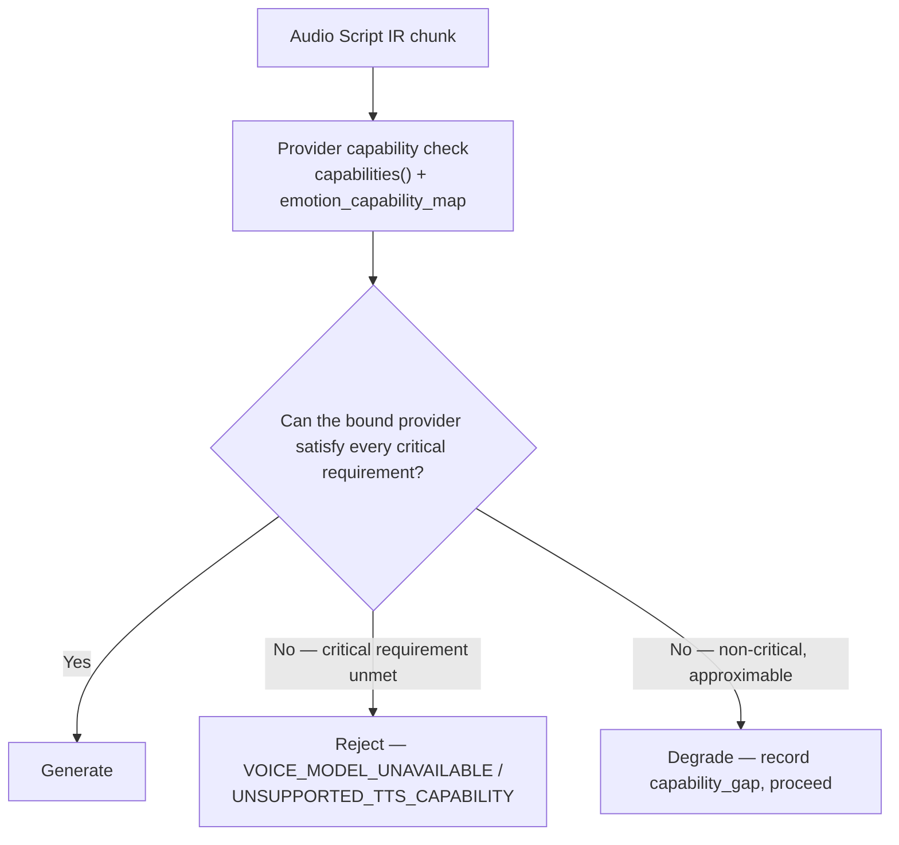

### 34.2 Critical versus non-critical requirements

| Requirement class | Examples | Policy |
| --- | --- | --- |
| **Critical — rejectable** | Target model/provider not advertised by any worker (`VOICE_MODEL_UNAVAILABLE`); voice identity itself unresolvable; language not supported by the bound voice (`VOICE_LANGUAGE_MISMATCH`) | Generation is **blocked**, never approximated. Voice identity and language are not approximable — `context.md` §21 row 7 and `audio-script-ir.md` §48.3 already fix this |
| **Non-critical — approximable** | `emotion`, `delivery_mode`, `pitch`, non-verbal expression when the engine lacks a native control | **Degraded** (§35) — synthesis proceeds with a recorded `capability_gap` |

### 34.3 When the check runs

Two points, not one: **before job creation** (`api-specification.md` §16.15 precondition 5 —
some worker advertises the bound model, or the request is refused at `202`-time), and **at
routing** (`context.md` §10.3 — the specific chunk is routed only to a worker advertising the
exact bound provider/model). The second check exists because worker fleet composition can change
between request time and dequeue time; both checks use the same `capabilities()` declaration.

---

## 35. Degradation policy

### 35.1 The example, worked through

```
Audio Script:
  emotion = FEARFUL
  delivery_mode = WHISPER
  emotion_intensity = 0.8

Provider:
  native whisper unsupported (emotion_control = TAGS, no delivery-mode axis)

Adapter:
  approximate via reduced volume + slightly slower pacing + breathiness where available
  record: { field: "delivery_mode", requested: "WHISPER", handling: "APPROXIMATED",
            note: "volume+pacing approximation" }
```

The system **may** approximate; it **must** record that it did, and it never claims exact
fidelity where none was achieved.

### 35.2 Four rules, restated as binding on every adapter

1. **Never silently discard an instruction.** Every unsupported field produces a `capability_gap`
   record.
2. **Never falsely report exact support.** `NATIVE` means the engine has a real, direct control
   for exactly this — not "close enough that nobody will notice."
3. **Approximate where a documented approximation exists.** The specific approximation method per
   provider is documented in this document's provider-adapter appendices at implementation time
   (not specified here, since no adapter exists yet) — but the *fact* that a documented method
   must exist before `APPROXIMATED` is ever claimed is binding now.
4. **Prefer approximation over failure**, with one categorical exception: a **missing or
   unapproved voice** blocks rather than degrades (§34.2). Voice identity is not approximable —
   there is no "close enough" substitute voice the system may silently choose.

---

## 36. Provider selection

### 36.1 Factors

Language · voice availability (which provider the bound `VoiceProfileVersion` actually targets)
· required capabilities (§33–§34) · latency · GPU availability · cost · quality · user preference
(where a product surface exposes one) · pinned `tts_model_version_id` · local/API deployment
policy (§16).

### 36.2 Provider selection never overrides a locked voice requirement

Once a `VoiceProfileVersion` is `LOCKED` (§11.1), its `tts_provider_id` and
`tts_model_version_id` are **fixed facts about that version**, not inputs to a selection
algorithm. "Provider selection" in the ordinary sense — choosing among interchangeable options —
applies only at the point a **new** `VoiceProfileVersion` is being created (a casting decision,
made by a human via the Voice Service, `api-specification.md` §16.14), never at generation time
for an already-bound chunk. The TTS subsystem does not select a provider per chunk; it is told
which provider to use, and that instruction is authoritative.

---

## 37. Voice fallback

### 37.1 The scenario and the options

If the primary provider is unavailable (a worker fleet outage, a provider API down):

| Option | When permitted |
| --- | --- |
| 1. Retry | Default — the provider/model is expected to become available again (`context.md` §21 rows 8–9's retry class) |
| 2. Queue until provider available | Equivalent to retry with backoff; the job remains `QUEUED`/`RETRYING`, never silently reassigned |
| 3. Alternate compatible model | **Only** if an explicit, human-approved alternate `VoiceProfileVersion` targeting a different provider already exists for this character — never an automatic substitution |
| 4. Human review | Escalation after bounded retries, per the standard `NEEDS_REVIEW` path (§45) |
| 5. Fail | Terminal, after the retry budget is exhausted, to the DLQ (`event-contracts.md` §22) |

### 37.2 The rule that governs the choice

> The TTS system **MUST NOT** automatically switch voices if doing so would compromise voice
> consistency (§10). A fallback must preserve the logical voice identity.

Option 3 is the only one that changes what actually renders, and it is gated on a **pre-existing,
human-approved** alternate — never a system-invented substitute, and never silent. Options 1, 2,
4, and 5 all preserve the property that the character's voice, when it does render, is exactly
the one that was cast.

---

## 38. Model fallback

### 38.1 Distinct from voice fallback

Changing the **TTS model** — as opposed to falling back to an alternate provider entirely — may
change voice characteristics, prosody, pronunciation, and quality even when nominally targeting
"the same" logical voice, because a `VoiceProfileVersion`'s identity is bound to a specific
`tts_model_version_id` (§13). There is therefore no such thing as a transparent, quality-neutral
model fallback.

### 38.2 Model fallback must be explicit

The system **MUST NOT** silently switch production model versions. A model becoming unavailable
does not trigger a substitute model — it triggers the same retry/queue/fail path as §37.1 options
1–2 and 5. Where a genuine model change is desired (a deliberate upgrade, an EOL migration), the
path is casting a new `VoiceProfileVersion` under the new model, with preview and approval, per
§9.2 and `context.md` §9.3 rule 3 — an explicit, auditable, human-approved change, never a
runtime fallback.

---

## 39. Cost / performance routing

### 39.1 A future, optional routing strategy

```
Interactive preview      → fast model
Full audiobook             → highest-quality model
Bulk regeneration          → optimized model
```

### 39.2 Kept optional, and quality-first for final generation

This document does **not** mandate routing for v1, consistent with
`director-specification.md` §44.2's identical deferral on the Director side (and for a related
reason: routing at the TTS layer raises the same voice/model-fixed-by-version question §38.1
already answers — a routing policy that changed the *model* mid-book for the same character
would violate voice consistency outright, since the model is part of the version's identity).
Where routing is adopted, it operates **only** at the point a `VoiceProfileVersion` is cast (a
production-quality model is chosen once, for the whole book, at casting time) — not per-chunk at
render time. **Quality remains the primary criterion for final audiobook generation**; a
fast/cheap model is legitimate for interactive preview specifically because previews are outside
audiobook lineage (§47) and are explicitly disposable.

---

## 40. Determinism

### 40.1 Reproducibility inputs

A TTS generation is reproducible — in the two-level sense §40.3 makes precise — from:

```
AudioScriptChunk + VoiceProfileVersion + ModelVersion + generation configuration
```

where provider capabilities permit deterministic inference. The seed is recorded where the
provider supports it (`tts_job.seed`, `audio_chunk` lineage group, `database-schema.md` §16.1,
§16.2).

### 40.2 Not all TTS engines are bit-for-bit deterministic

This document does not assume otherwise. `capabilities().deterministic_seed` (§3.3) declares
whether a given provider even supports seeding at all; where it does not, `seed` is still
recorded on the request (for auditability — "this generation asked for seed X") but the result is
understood not to be exactly reproducible from it.

### 40.3 Two honest levels, restated for TTS specifically

Mirroring `context.md` §2.4 and `director-specification.md` §32.3:

| Level | Guarantee |
| --- | --- |
| **Contract determinism (MUST)** | An identical lineage tuple (chunk content hash, voice version, model version, params hash, seed) resolves to the **same stored `AudioChunk`** — the system reuses it, per §43, rather than regenerating |
| **Model determinism (SHOULD, not guaranteed)** | Where the engine supports deterministic kernels and a pinned seed, re-rendering **SHOULD** yield perceptually identical audio. **Bit-exactness across differing GPU models is not promised, and no component may depend on it** |

---

## 41. Generation configuration

### 41.1 Output-affecting parameters, and the semantic/provider-specific split

| Category | Examples | Where it lives |
| --- | --- | --- |
| **Semantic instructions** | `emotion`, `emotion_intensity`, `delivery_mode`, `pacing`, `pitch`, `volume`, `pauses[]`, `emphasis[]`, `pronunciation_hints[]`, `non_verbal[]` | The IR (`audio-script-ir.md` §16–§27); provider-neutral; never engine parameters |
| **Provider-specific inference configuration** | temperature, top-p, speaker-parameter weights, sampling parameters, output-format flags | `voice_profile_version.base_generation_params` (per-voice baseline) and `generation_params` on the request (per-generation override where legitimately needed, e.g. speed derived from `pacing`) |

### 41.2 The architecture distinguishes these two categories structurally

This is `audio-script-ir.md` §16.1/§38's boundary, restated as binding on generation
configuration specifically: the Director never emits provider-specific parameter names into the
IR (`audio-script-ir.md` §38.4 lists `temperature`, `top_k`, `exaggeration`, `gpt_cond_len` as
explicitly forbidden in the core IR), and the provider adapter is the **only** place semantic
instructions are translated into the provider-specific configuration category. `generation_params`
on a `SynthesisRequest` is therefore always the **adapter's own output** from that translation
— constructed from the IR's semantic fields plus the voice version's baseline params — never a
second, independent channel by which provider-specific values enter the system.

---

## 42. TTS generation identity and idempotency

### 42.1 The identity is already fixed at Tier 1 — this document does not duplicate it

`database-schema.md` §16.1 already defines `tts_job.dedupe_key`:

```
sha256(
  audio_script_chunk_id, audio_script_chunk_version,
  voice_profile_version_id, tts_model_version_id,
  generation_params_hash, seed, coalesce(force_token,'')
)
```

with `UNIQUE (dedupe_key)`. This document does not introduce a second identity concept
alongside it — the task brief's proposed `hash(audio_script_chunk_hash, voice_profile_version_id,
model_version_id, generation_configuration)` **is** this key, modulo naming, and the existing
name and exact component list are authoritative. Using only `audio_script_chunk_id` (without the
other components) is explicitly wrong, for the reason `database-schema.md` §16.1 already gives:
a model, voice, or parameter change would otherwise collide with a semantically different
generation.

### 42.2 Idempotency under at-least-once delivery

Restating `event-contracts.md` §18.4's worker duty for the TTS-specific case: on receiving a
`generate_tts_chunk` message, the worker checks whether a current, valid `AudioChunk` already
exists for the exact lineage the message describes; if so, it records a no-op attempt and reports
success with the existing artifact, performing **no synthesis**. If the eventual database write
loses a race to a concurrent worker (a unique-constraint violation on `dedupe_key`), that is
**success**, not an error — the desired state already exists, and the correct response is to
re-read the winner's artifact and report success with it, never to retry or fail
(`event-contracts.md` §18.4 step 4).

### 42.3 Not reliant on Redis alone

Idempotency is enforced by database uniqueness (§42.1's constraint), never by a Redis-only check.
Losing Redis costs time, never correctness, here as everywhere (`context.md` §12.2).

---

## 43. Cache

### 43.1 When a result may be reused

Exactly when **every output-affecting input matches** — this document adopts
`audio-script-ir.md` §45's cache-key composition without modification:

```
audio_script_chunk content hash (source_content_hash)
+ voice_profile_version_id
+ tts_model_version_id
+ generation configuration (params hash + seed)
```

### 43.2 Never reuse when any output-affecting input changed

The skip-existing-output query of `database-schema.md` §21.5 is the mechanism, restated: it
joins on lineage equality, not on a boolean flag, so a chunk whose voice binding, model, or
parameters changed has no matching current audio and is correctly re-rendered — without any
component having to remember to invalidate a stale cache entry.

---

## 44. Regeneration

### 44.1 Two cases, kept structurally separate

| | **TTS regeneration** | **Director regeneration** |
| --- | --- | --- |
| Same | `AudioScriptChunk`, `VoiceProfileVersion`, the Director's semantic decisions | — |
| New | `TTSJob`, `AudioChunk` (`generation_version` n+1) | `AudioScriptVersion` (or a scoped chunk supersession) |
| Trigger | Bad audio, validation failure, forced re-render | A changed interpretation upstream — new `director_version`, Story Bible rebuild, character merge, user edit of a frozen chunk |
| Cost | One chunk's GPU time | Director LLM cost, then downstream TTS for affected chunks |

### 44.2 The TTS subsystem must not force Director regeneration when only synthesis failed

If synthesis produced bad audio (clipping, an OOM-truncated render, an engine-side glitch) but the
IR's semantic instructions are unchanged, the correct and only response is a **new `TTSJob` and a
new `AudioChunk`** against the same, unmodified `AudioScriptChunk` — never a re-run of
`generate_director_ir`/`revise_director_ir`. Conflating the two, as
`director-specification.md` §44.4 already warns, produces one of two failures: re-running the LLM
over a chapter to fix one clipped waveform (expensive and pointless), or rendering new audio
against a stale IR (the audio no longer matches its own specification).

### 44.3 There is no separate regeneration command

`event-contracts.md` §34.1: regeneration is `generate_tts_chunk` with `scope: CHUNKS` — the same
contract, the same idempotency derivation, the same retry policy as first-time generation. This
document does not introduce a `tts.chunk.regenerate` command.

---

## 45. Failed generation

### 45.1 What must be preserved on failure

| Requirement | Mechanism |
| --- | --- |
| Preserve the failed `TTSJob` | `tts_job.status = FAILED`, retained, never deleted |
| Record error category | `tts_job.error_code`, classified per §78 |
| Record the attempt | `ProcessingAttempt`, immutable (`context.md` §16.2) |
| Allow retry | Per the retryable/terminal classification of §60 |
| Never destroy a prior successful generation | A failed regeneration attempt does not touch the `is_current` `AudioChunk` — it simply fails to produce a new one; the existing current chunk is untouched |
| Never modify the Audio Script | A synthesis failure carries zero write access to `AudioScriptChunk` — the TTS subsystem's write surface is `AudioChunk` and its own job/attempt records only (`context.md` §23 row 8) |

### 45.2 Auditability

A failed generation remains fully auditable — the failed `TTSJob` row, its `ProcessingAttempt`
history, and its error classification are all retained permanently (never purged by the ordinary
retention sweep, which targets successful, superseded `AudioChunk` bytes, not failure records).

---

## 46. Multiple generations and human selection

### 46.1 A chunk may have several generations; exactly one is current

```
AudioScriptChunk 57
  Generation 1  status SUPERSEDED  is_current false   ← retained
  Generation 2  status VALIDATED   is_current true    ← selected
  Generation 3  status GENERATED   is_current false   ← a pending candidate, not yet selected
```

`UNIQUE (audio_script_chunk_id) WHERE is_current` (`database-schema.md` §16.2) enforces exactly
one selected artifact; every other generation is retained with full lineage
(`database-schema.md` §19.2), never deleted by a regeneration.

### 46.2 Selection

Ordinary automatic selection promotes the newest successfully-`VALIDATED` generation to
`is_current` (the default path of §44). **Human selection** — choosing a specific prior
generation over the automatically-selected latest one — is a future review capability this
document names but does not build (`api-specification.md` OQ-3 already keeps chunk-level review
as flags and counters in v1, not a full selection workflow): where it exists, it marks the chosen
generation `is_current` (demote-then-promote, the same versioning-column contract as every other
version chain, `database-schema.md` §4.2) **without deleting** the un-selected generations.
Historical generation metadata is never overwritten by a selection action.

---

## 47. Voice preview architecture

### 47.1 The contract, restated for the TTS subsystem's role in it

`context.md` §15 and `api-specification.md` §16.14 fully specify the preview workflow; this
document's obligation is narrow and specific: `generate_voice_preview` (§3.2's `synthesize()`,
invoked via the same `TTSProvider` interface as production synthesis) **MUST** use the **same
provider, model version, and generation parameters as production would** for that
`VoiceProfileVersion` (`context.md` §15.3). The API enforces this by refusing a
`generation_params` override on a preview request (`api-specification.md` §16.14) — the TTS
subsystem has no code path by which a preview could be rendered with different fidelity than a
production chunk would receive under the same version.

### 47.2 A preview must not mutate production artifacts

Preview output (`voice_preview` rows and their objects) lives in a physically separate storage
prefix (`context.md` §12.3) and has **no foreign key from any production artifact**
(`database-schema.md` §12.4) — a preview cannot become part of an audiobook's lineage even by
accident, because the relationship required to reference it from `chapter_audio` or `audiobook`
simply does not exist in the schema.

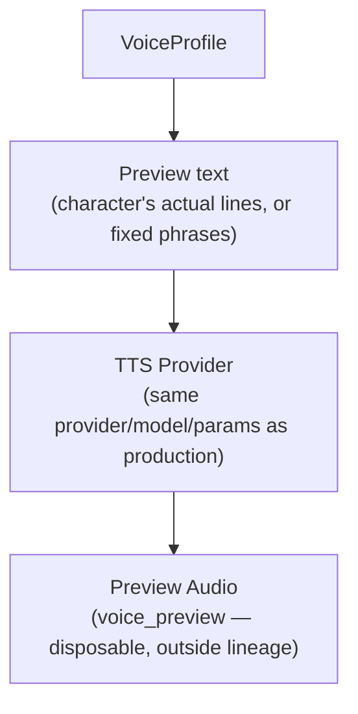

---

## 48. Voice approval integration

### 48.1 The gate, restated for what it means to TTS generation specifically

```
Voice creation → Preview → Human approval → VoiceProfileVersion → LOCKED
```

The TTS subsystem's production synthesis path (`generate_tts_chunk`) **MUST** only target a
`VoiceProfileVersion` whose `approval_state` is `APPROVED` or `LOCKED` — never `DRAFT` or
`PREVIEW_GENERATED` (§11.1). This precondition is checked before job admission
(`api-specification.md` §16.15 precondition 4, the casting gate) and is not re-checked
optimistically inside the worker as the *primary* control, though the worker's own
`validate_voice()` (§7.4) MAY assert it defensively — the primary enforcement is upstream, at
job-creation time, exactly where `context.md` §15.1 places it: *"casting is a gate, not a
suggestion."*

---

## 49. Voice cloning

### 49.1 Generic workflow, not provider-specific

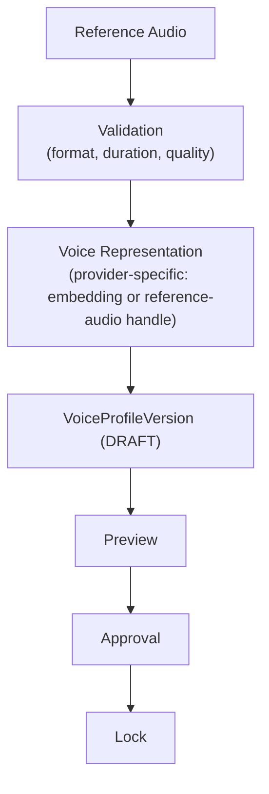

This document specifies the workflow's **shape**, matching §7 (voice profile types) and §11
(locking) — it does not specify a provider-specific cloning implementation, per the task's
explicit scope boundary. Where a specific engine's cloning mechanism (few-shot fine-tuning,
zero-shot embedding conditioning, etc.) differs from this generic shape, that difference is
entirely inside the adapter's implementation of `prepare_voice()`.

---

## 50. Reference audio

### 50.1 Requirements

| Requirement | Detail |
| --- | --- |
| Storage | Object storage, never PostgreSQL (§8.2, `context.md` §12.1) |
| Checksum | `reference_audio_content_hash`, participates in `voice_profile_version.identity_fingerprint` (§9.1, `database-schema.md` §12.2) |
| Format | Constrained by an allowlist, validated at upload (`api-specification.md` §12.4) |
| Duration | Bounded (a minimum for usable conditioning material, a maximum to prevent abuse), configuration |
| Sample rate | Validated against the provider's requirements before acceptance |
| Quality validation | Basic technical sanity (not silent, not clipped, not corrupt) before the file is accepted as a candidate for embedding extraction |
| Consent/ownership metadata | **Mandatory** — `consent_attested`, `consent_subject`, `consent_attestation_text` where required; `database-schema.md` §12.2's `CHECK (consent_attested)` makes an unattested version unrepresentable (`context.md` §9.3 rule 6) |
| Provider compatibility | Checked via `validate_voice()` (§7.4) before the reference is trusted for a given target model |

### 50.2 Never in PostgreSQL

Restated once more because it is the single most consequential storage-boundary rule in this
document's subject area: reference audio bytes are **always** in object storage; PostgreSQL holds
only the reference, the hash, and lifecycle state (`database-schema.md` §5.7).

---

## 51. Model warming

### 51.1 Reduces interactive latency

```
Worker startup → load common TTS model → READY
```

A worker configured for interactive preview traffic **SHOULD** preload its primary model at
startup (§18.2) rather than waiting for the first job, because preview latency is user-visible
and `context.md` §11.4 requires interactive work to never wait behind a large render.

### 51.2 Full-audiobook workers may load dynamically when necessary

A worker dedicated to bulk, `NORMAL`-priority production rendering has more latitude to load a
model on first assignment (still amortized across the book, not per chunk, per §18.2) — warming
every possible model at every worker's boot is neither necessary nor a good use of the
memory budget where a worker's assignment is stable and known in advance.

---

## 52. Worker lifecycle

### 52.1 States

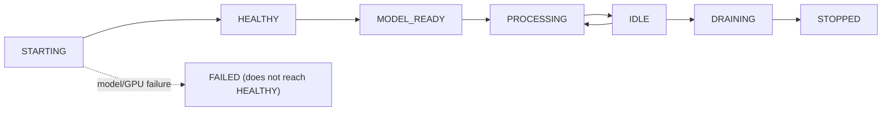

| State | Meaning |
| --- | --- |
| `STARTING` | Process initializing, dependencies (storage, queue, database) not yet verified |
| `HEALTHY` | Dependencies reachable; models not yet necessarily loaded |
| `MODEL_READY` | Assigned model set loaded and verified (§18.1's `READY`) |
| `PROCESSING` | Actively consuming and synthesizing |
| `IDLE` | Consuming, no work currently assigned |
| `DRAINING` | Stopping acceptance, finishing in-flight work (§53) |
| `STOPPED` | Terminated |

### 52.2 Failure handling included in the lifecycle

| Failure | Handling |
| --- | --- |
| GPU failure | §54 |
| Model load failure | Worker does not reach `MODEL_READY`; reported via `health()`; the orchestrator does not route work to it |
| Memory exhaustion | OOM retry path (§58); persistent exhaustion escalates to worker restart |
| Worker restart | A restarting worker's in-flight jobs are reaped by heartbeat expiry (`context.md` §16.5), not assumed lost silently |
| Graceful shutdown | §53 |

---

## 53. Graceful shutdown

### 53.1 The sequence

```
1. Stop accepting new jobs           (deregister from the queue's active consumer set)
2. Finish current synthesis where possible   (within a grace period)
3. Persist state                      (upload + verify any completed-but-unpersisted result)
4. Release resources                  (unload models, close connections)
5. Acknowledge completion ONLY after persistence
6. Allow queue retry if work was interrupted   (release the message's visibility rather than
                                                 losing it)
```

### 53.2 In-flight work is never lost

`context.md` §10.4 step 7: on SIGTERM, the worker stops accepting, finishes in-flight chunks
within a grace period, and **releases** unfinishable work back to the queue (visibility
restored), rather than losing it. This is what makes a rolling deployment or an autoscale-down
event safe: any chunk that was mid-synthesis when the grace period expired is picked up by
another worker, and idempotency (§42) guarantees this is safe even if the draining worker had, in
fact, already produced (but not yet persisted and acknowledged) a result.

### 53.3 Acknowledge only after persistence

Step 5 is not negotiable and mirrors `event-contracts.md` §16.3 step 7's ordering exactly: a
worker **MUST NOT** report success before the object-storage upload is verified. A worker that
acknowledges first and persists second creates exactly the class of bug `context.md` §21 row 15
exists to prevent — a chunk marked complete whose bytes may not actually exist.

---

## 54. GPU failure

### 54.1 Behavior

| Scenario | Response |
| --- | --- |
| Worker health check fails | Removed from the active routing set; in-flight jobs reaped by heartbeat expiry (`context.md` §16.5) |
| Job retry | Standard GPU-class retry (§60), preferring a **different worker** where possible (`event-contracts.md` §21.4) |
| Alternate GPU worker | The queue naturally routes to any other worker advertising the same model — no special "alternate GPU" code path is needed beyond ordinary capability-based routing (`context.md` §10.3) |
| Provider fallback | Only per §37–§38's explicit, human-approved rules — never automatic |
| DLQ after maximum attempts | Standard DLQ path (§60, `event-contracts.md` §22) |

### 54.2 The bytes-exist invariant holds through every failure path

No failure path may mark a job successful before the audio artifact is safely persisted and
verified (§53.3). `database-schema.md` §16.2's `CHECK (status NOT IN
('GENERATED','VALIDATED','ASSEMBLED') OR object_verified_at IS NOT NULL)` makes this
structurally true regardless of how the GPU failure manifested.

---

## 55. Timeouts

### 55.1 Categories, not one enormous timeout

| Category | Scaled by |
| --- | --- |
| Queue wait timeout | Priority class and current queue depth — not fixed |
| Model load timeout | Model size / storage throughput, generous, since it is a rare, amortized event (§18.2) |
| Inference timeout | **Input character count** — a fixed timeout is wrong, since a 400-character chunk and a 40-character chunk differ in synthesis time by roughly an order of magnitude (`context.md` §10.4 step 8) |
| Object storage timeout | Upload size and configured storage-layer SLA |
| Validation timeout | Short — the technical checks of §28 are cheap CPU operations |

### 55.2 Never one timeout for everything

A single global timeout would either be too short for model loading (spurious failures) or too
long for a short-chunk inference call (slow failure detection). Each category above is
independently configured.

---

## 56. Retries

### 56.1 Retryable versus non-retryable, TTS-specific

| Retryable | Non-retryable |
| --- | --- |
| GPU temporary failure (transient driver fault, momentary unavailability) | Invalid Audio Script (fails schema/semantic validation upstream — never reaches TTS in the first place, but if it somehow did, this is terminal) |
| Provider timeout | Missing voice (`MISSING_VOICE_PROFILE`) — blocks, does not retry |
| Network failure | Incompatible model (`VOICE_MODEL_INCOMPATIBLE`) |
| Temporary object storage failure | Unsupported language (`VOICE_LANGUAGE_MISMATCH`, `UNSUPPORTED_TTS_CAPABILITY`) |
| GPU OOM (with batch reduction, §21.2) | Corrupted input (a text-hash mismatch — `INVALID_SOURCE_HASH`) |

This is the TTS-scoped instance of `event-contracts.md` §21.2's general table; the classification
principle is identical: **retryable** means the same input might succeed on a different attempt
(a transient condition); **non-retryable** means the input itself is wrong and retrying changes
nothing.

### 56.2 Avoid infinite retries

Every retryable class has a bounded `max_attempts` (§56's GPU class in `event-contracts.md`
§21.4: "≈3, long backoff ceiling"), after which the job dead-letters (§60's DLQ path) rather than
retrying forever. `context.md` §21 rows 8–9 additionally specify the GPU-specific degradation
sequence: reduce batch → single item → 2 attempts → route to a larger-VRAM node or a smaller
model variant if configured → fail the chunk (not the chapter), with a **new seed on the final
attempt**.

---

## 57. Priority

### 57.1 Levels and assignment

| Priority | Assigned to |
| --- | --- |
| `INTERACTIVE` | Voice preview (always); bounded single-chunk regeneration |
| `NORMAL` | Production audiobook generation |
| `BULK` | Bulk regeneration, additional delivery-format encodes |

This is `context.md` §11.4's three-level vocabulary, unchanged — this document does not
introduce a TTS-specific priority scheme.

### 57.2 Large audiobook jobs must not starve interactive preview requests

Enforced by strict priority ordering within the `gpu` queue plus the bound on `INTERACTIVE`'s own
size (`api-specification.md` §16.15: `INTERACTIVE` is accepted only for bounded `CHUNKS` scope) —
`event-contracts.md` §26.2's starvation rules apply without modification.

---

## 58. Resource-aware scheduling

### 58.1 Factors

GPU type · VRAM · model requirements · concurrency · provider · language · batch compatibility.

### 58.2 A job is only assigned to a capable worker

Capability-based routing (`context.md` §10.3): a `generate_tts_chunk` job targeting a specific
`(tts_provider_id, tts_model_version_id)` is routed **only** to a worker whose registered
`capabilities()` (§3.3) advertises that exact combination. There is no "best effort" routing to
an incapable worker followed by a runtime failure — the routing layer itself excludes incapable
workers from consideration.

---

## 59. Multi-GPU

### 59.1 Design for multiple GPUs without hard-coding placement

```
GPU 0 → TTS Model A
GPU 1 → TTS Model B
GPU 2 → TTS Model A
```

No business logic names `GPU 0` or any other specific device. Placement is a **worker
configuration and capability-advertisement** concern (§58.2) — a worker process is bound to a
specific device at deployment time, and the queue/routing layer only ever sees the worker's
advertised capabilities, never the underlying hardware identifier.

### 59.2 Adding a GPU requires no application change

`context.md` §20.4's hard architectural requirement applies unchanged to the TTS subsystem
specifically: a new node joins the pool, pulls its model set, verifies checksums, registers
capabilities, and begins consuming — with **no application change, no contract change, no
redeploy of other services.**

---

## 60. CPU fallback

### 60.1 A configurable deployment decision, not a default

| Use case | CPU TTS acceptable? |
| --- | --- |
| Interactive preview (latency-tolerant, low volume) | Possibly, as a documented deployment configuration — never assumed |
| Production generation (throughput- and quality-sensitive) | Depends entirely on the deployment's performance requirements; not assumed appropriate |

This document does not mandate CPU fallback and does not assume it is always appropriate. Where
a deployment configures a CPU-based adapter (for a specific lightweight model, or for
development/testing per `context.md` §22.2's `MockTTSProvider`), it is exposed through the same
`TTSProvider` interface (§3.2) as any GPU-backed adapter — CPU-vs-GPU is an adapter
implementation detail, not a business-contract branch.

---

## 61. Language support

### 61.1 Every request identifies language explicitly

`SynthesisRequest.language` (BCP-47, §4.1), sourced from the IR chunk's own `language` field
(`audio-script-ir.md` §48.1) — never inferred, never defaulted from the book's primary language
when a chunk's own language differs (code-switching, `audio-script-ir.md` §48.2).

### 61.2 Provider capability is checked before synthesis, never after

§34.2's critical-requirement check covers this exactly: the bound `VoiceProfileVersion`'s
`supported_languages[]` must include the chunk's `language`, and the target provider's
`capabilities().languages[]` must include it too. A mismatch is `VOICE_LANGUAGE_MISMATCH` or
`UNSUPPORTED_TTS_CAPABILITY` (§78), never a silent same-provider-different-language substitution.

---

## 62. Multilingual voices

### 62.1 A character may have per-language voice profiles

A logical character (`Character`) may eventually have an English `VoiceProfile`, a Hindi
`VoiceProfile`, and a German `VoiceProfile` — this document does not assume one
`VoiceProfileVersion` must support every language a book might need. `voice_assignment` is scoped
`(book, character, role)`; a **language-aware** assignment model, where the active assignment
additionally depends on the chunk's language, is a natural, additive extension of the existing
schema (an additional key component on `voice_assignment`) rather than a new concept — but this
document does not build it now, since no upstream contract currently models a per-language
assignment axis. Recorded as an open question (§87, OQ-TTS-6).

### 62.2 What exists today

A single `VoiceProfileVersion` **MAY** declare `supported_languages[]` covering more than one
language (`database-schema.md` §12.2), which is the mechanism available in v1 for a voice that
genuinely performs acceptably across languages (most commonly a multilingual TTS model). This is
distinct from, and does not by itself solve, the "different voice per language for the same
character" case named above.

---

## 63. Audio artifact storage

### 63.1 Object storage, never Redis or a database blob

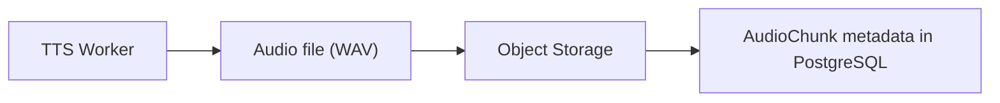

Large audio binaries **never** pass through Redis (§5.2) and are never stored as bytes in
PostgreSQL (`context.md` §12.1). This is not new — it is restated once more because it is the
constraint every other section in this document assumes.

---

## 64. Storage key strategy

### 64.1 The existing convention, not a new one

`context.md` §12.3 already fixes the key convention for generated chunks:

```
{tenant_id}/books/{book_id}/audio/chunks/{chunk_id}/v{gen_version}.wav
```

This document does not introduce a competing convention (the task brief's illustrative
`tts/book-version/audio-script-version/chapter/chunk/generation/` shape is **not adopted** — it
would duplicate and diverge from the already-authoritative key pattern). The actual
implementation of storage-key construction belongs to `database-schema.md` §34.2 and is not
re-specified here; what this document fixes is that **no TTS business logic hard-codes an
implementation of key construction** — a worker receives an `output_storage_prefix` in its
command payload (`event-contracts.md` §16.1) and composes the versioned key from validated
identifiers only, never from a user-supplied string (`context.md` §18.5).

---

## 65. Checksums

### 65.1 Every generated artifact has one

`audio_chunk.content_hash` (SHA-256), used for: integrity verification (before
`object_verified_at` is set, §53.3); duplicate detection (a content-identical re-render is
detectable even across two different `generation_version`s, though it is never deduplicated
*away* — both remain distinct, lineage-bearing rows); cache-key composition (indirectly, via
`source_content_hash` + `generation_params_hash`, §43.1); audit; and download validation (returned
alongside a signed URL so a client can verify what it downloaded, `api-specification.md` §16.20).

---

## 66. Audio metadata

### 66.1 The complete set recorded on `AudioChunk`

Restated from `database-schema.md` §16.2's technical column group, as the definitive list this
document's synthesis result (§5.1) must be able to populate:

```
duration_ms · format · sample_rate · channels · peak_dbfs · true_peak_dbtp
integrated_lufs · rms_dbfs · content_hash
provider (tts_provider_id) · tts_model_version_id · voice_profile_version_id · generation ID (tts_job_id)
```

Bit depth is not separately tracked as a first-class column beyond what `format` and the WAV
container imply — it is part of `generation_params`/provider metadata where it varies, not a
lineage-significant fact on its own (it does not participate in the dedupe key, §42.1).

---

## 67. Audio processing pipeline — downstream relationship

### 67.1 Restated once more, as the closing statement of the TTS/Processing boundary

```
TTS → Audio Validation → Audio Processing → Chapter Assembly
```

The TTS provider **MUST NOT** assemble chapters, and **MUST NOT** perform the mastering,
normalization, or pause-application work of §25. Every arrow above is a hard service boundary
(`context.md` §1.4); this document's scope ends at the point an `AudioChunk` exists and is
technically validated (§28).

---

## 68. Chapter assembly compatibility

### 68.1 Every chunk must be technically compatible with its chapter siblings

Where necessary, normalize **before assembly**, not during it:

| Property | Normalized by |
| --- | --- |
| Sample rate | Audio Processing, to the project canonical rate (§26.2) |
| Channels | Audio Processing |
| Format | Audio Processing |
| Loudness | Audio Processing (two-pass, §27.1) |

### 68.2 No provider is forced to natively produce the final format

A provider may output at its own native sample rate, its own native bit depth, and its own
native loudness characteristics; conformance to the audiobook's final technical profile is
achieved downstream, uniformly, regardless of which provider (or how many different providers
across a multi-character book) produced the individual chunks. This is what makes provider
heterogeneity within a single audiobook technically viable, not just architecturally permitted.

---

## 69. Audio quality targets

### 69.1 Goals, not arbitrary numeric claims

No clipping · no corrupted audio · stable voice (no drift within a character, §75) · consistent
sample rate (post-processing) · controlled loudness (post-processing) · acceptable noise floor ·
acceptable pronunciation (per the IR's pronunciation guidance, §31) · acceptable prosody.

### 69.2 Numerical thresholds are benchmarked, not asserted

Every quantitative bound implied by §69.1 (what counts as "acceptable" noise, what duration-band
tolerance flags a runaway-repetition failure, §35 of `context.md`) is a **configuration value**,
established by the benchmarking and certification process of §69–§70, never hard-coded in this
document as an architectural claim.

---

## 70. Quality evaluation

### 70.1 A future TTS evaluation dataset

Recommended coverage, spanning the range of performance the Director's IR can request:

```
narration · dialogue · whispers · shouting · emotional speech (across the 17-member vocabulary)
multiple characters · foreign/invented names · difficult pronunciations
long passages · punctuation-heavy passages · internal thought · non-verbal-only chunks
```

### 70.2 Evaluation dimensions

Naturalness · intelligibility · speaker consistency (§75) · pronunciation accuracy · emotional
expressiveness against the requested `emotion`/`emotion_intensity` · pacing accuracy · absence of
synthesis artifacts (clicks, dropouts, runaway repetition).

---

## 71. Speaker consistency test

### 71.1 An automated strategy, where possible

```
Character A, VoiceProfileVersion V1
  → Generate Sample 1, Sample 2, Sample 3 (different text, same version)
  → Compare speaker embeddings (or an equivalent voice-similarity metric)
  → Flag unexpected divergence
```

### 71.2 Detecting drift, not merely trusting subjective review

Nothing about `AudioChunk`'s recorded `voice_profile_version_id` (§10.2) can, by itself, detect
an engine that has silently drifted in its interpretation of a stable embedding (a real, if rare,
failure mode of some architectures). An automated speaker-similarity check across generations of
the same `VoiceProfileVersion`, run as part of the certification process (§72) and optionally as
a periodic production QC sample, is the mechanism that catches this class of defect. The system
**does not rely solely on subjective human review** for this specific failure mode, precisely
because it is the kind of gradual, low-salience drift a listener may not consciously notice
chunk-by-chunk but that becomes objectionable over a 12-hour audiobook.

---

## 72. Model benchmarking

### 72.1 Dimensions

Quality · latency · VRAM · throughput · voice consistency (§71) · pronunciation accuracy ·
expressive range (coverage of the 17-member emotion vocabulary and the 8-member delivery-mode
vocabulary) · language support breadth.

### 72.2 Speed is not the sole selection criterion

The final TTS engine selection **MUST NOT** be made solely on benchmark speed. `context.md` §23
row 17 already made this tradeoff explicitly for v1 (XTTS for cloning/expressiveness, Kokoro for
speed — *complementary*, not competing on one axis), and this document's benchmarking process
exists to make that kind of multi-dimensional tradeoff visible and comparable, not to collapse it
into a single throughput number.

---

## 73. Provider certification

### 73.1 The gate before production use

Before a TTS provider is used for production, it **MUST** pass:

```
1. Capability test        — capabilities() matches actual behavior, verified empirically
2. Voice consistency test  — §71, across multiple generations of the same version
3. Pronunciation test      — accuracy against the pronunciation-hint mechanism (§31)
4. Long-form test          — extended passages, checking for drift and artifact accumulation
5. Performance benchmark    — §72
6. Failure/retry test       — the retry classification of §56 actually behaves as specified
                              under induced failure conditions
7. Artifact integrity test  — the bytes-exist invariant (§54.2) holds under injected faults
```

### 73.2 A provider must pass every defined acceptance criterion

Partial certification is not production certification. A provider that fails any of the seven
tests above is not eligible for production `VoiceProfileVersion` binding, though it **may** remain
usable in development/staging behind the `MockTTSProvider`-adjacent non-production posture
(`context.md` §22.3: mock and unvetted providers are forbidden in staging and production).

---

## 74. Security

### 74.1 What TTS workers may access, and the least-privilege boundary

| Access | Scope |
| --- | --- |
| User book content | **None.** A TTS worker never reads the book, Story Bible, or Character Registry (`context.md` §7.1, `database-schema.md` §37.2) |
| Voice references | Read-only, scoped to the specific `speaker_reference` object key carried in its own job's payload — never a general storage-browsing capability |
| Generated audio | Write-only to its own output prefix; workers get write access only to the audio prefix (`context.md` §18.8) |

### 74.2 Requirements

Least privilege (narrow, per-service storage credentials, §74.1) · secret management (provider
API credentials for API-based adapters live in the secrets manager, never in code, images, or
messages — `event-contracts.md` §35.1) · access control (a worker's storage credential is scoped
to a prefix, not a bucket) · secure temporary files (any local scratch file used during synthesis
is written to a worker-private, non-shared temp location and removed after use) · cleanup of
local inference artifacts (no residual audio, embeddings, or reference material persists on a
worker's local disk beyond the job's lifetime).

### 74.3 Generated audio is never exposed through worker internals

There is no HTTP path from any client, public or internal, to a worker's local filesystem or
in-memory synthesis buffers (`api-specification.md` §3 rule 3, §18.2's minimal control surface).
Audio reaches any consumer only via the object-storage artifact and, for end users, only via
short-lived signed URLs minted by the API after an ownership check (`api-specification.md` §16.20).

---

## 75. Privacy

### 75.1 API-based providers

| Concern | Requirement |
| --- | --- |
| Data retention | Whatever the reference-audio bytes and chunk text sent to an external API provider are retained by that provider is a real, deployment-relevant fact — this document does not claim any specific provider's retention policy, and an implementation **MUST** verify it before production use, never assume it |
| Provider data usage | Same — verify, never assume, whether a provider trains on submitted audio/text |
| User consent | The existing reference-audio consent attestation (§50.1) covers voice-cloning consent; it does not by itself cover "consent to send this book's text to a third-party API" — a deployment sending book content to an external TTS API is making the same category of decision `director-specification.md` §52.2 already names for LLM providers, and the same tradeoff applies here |
| Sensitive content handling | No new path introduced by TTS beyond what the underlying object-storage and API-scoping rules already provide |
| Opt-in/opt-out | Where a deployment offers a choice between local and API-based synthesis for privacy reasons, that choice is a deployment/tenant configuration decision, not a TTS-subsystem business-logic branch |

### 75.2 Local models

The privacy advantage of local inference — content never leaves the deployment's own
infrastructure — is real and is the primary reason `context.md` §23 keeps local inference as a
first-class, not merely a development-only, option. This document does not overstate it beyond
that structural fact.

### 75.3 No provider's policy is claimed without verification

This document makes no factual claim about any specific real-world TTS provider's data-handling
practices. Any such claim belongs in deployment documentation, verified against that provider's
actual, current terms at the time of integration.

---

## 76. Logging

### 76.1 Never logged

Complete book text · full voice reference audio · embeddings · API secrets · complete IR chunk
`text` (logged as length and hash, `event-contracts.md` §44.1).

### 76.2 Logged

Identifiers and metadata: `job_id` · `tts_job_id` (generation ID) · `audio_script_chunk_id` ·
`tts_model_version_id` · `tts_provider_id` · `duration_ms` · `generation_latency_ms` · `status` ·
`error_code`/`error_class`.

This is `event-contracts.md` §44.1's redaction table, restated for the fields specific to a TTS
log line.

---

## 77. Observability

### 77.1 Metrics

Extending `context.md` §17.2 and `event-contracts.md` §44.2 with nothing new, only the
TTS-specific subset gathered in one place:

```
TTS queue depth · queue latency · inference latency · chunks/minute · audio duration/minute
GPU utilization · GPU memory (used/free) · model load time · model-load count (near zero in
steady state) · cache hit rate (§43) · failure rate · retry rate (attempts-per-success)
provider degradation rate (capability_gap rate, per provider/field) · voice consistency
failures (§71) · real-time factor (RTF = synthesis time ÷ generated audio duration)
```

### 77.2 RTF as a first-class throughput metric

```
RTF = synthesis_time / generated_audio_duration
```

Lower is better (RTF < 1 means synthesis is faster than real-time playback). Reported per
`(provider, model, GPU type)` combination, feeding both the benchmarking process (§72) and
ongoing production capacity planning.

---

## 78. Error taxonomy

### 78.1 TTS-specific error codes

Every code below is either already registered in `api-specification.md` §21 (marked
**existing**) or newly introduced by this document for an internal/worker-level distinction not
previously named (marked **new** — none of these cross into the public API surface without a
corresponding `api-specification.md` amendment, per §86.1):

| Code | Class | Existing / New |
| --- | --- | --- |
| `INVALID_AUDIO_SCRIPT` | Terminal | Existing (`audio-script-ir.md` §41.4 family) |
| `VOICE_NOT_FOUND` | Terminal | New — internal; the public-facing equivalent is `404` on the voice resource itself, never reached at synthesis time because binding is resolved upstream |
| `VOICE_VERSION_INVALID` | Terminal | New — internal precision on top of the existing `VOICE_PROFILE_NOT_APPROVED` |
| `MISSING_VOICE_PROFILE` | Terminal | Existing |
| `VOICE_MODEL_INCOMPATIBLE` | Terminal | New — §9.2's embedding/model-compatibility failure |
| `MODEL_NOT_FOUND` | Terminal | New — the pinned `tts_model_version_id` does not resolve |
| `MODEL_LOAD_FAILED` | Terminal (for that worker; retryable at the job level via a different worker) | New |
| `GPU_OUT_OF_MEMORY` | Retryable (with batch reduction, §21.2/§56.2) | Existing concept, `context.md` §21 row 8 |
| `GPU_UNAVAILABLE` | Retryable | New |
| `VOICE_LANGUAGE_MISMATCH` | Terminal (blocks, §34.2) | Existing |
| `UNSUPPORTED_TTS_CAPABILITY` | Terminal (blocks) for critical capabilities; **not an error at all** for non-critical ones, which degrade instead (§35) | Existing |
| `PROVIDER_TIMEOUT` | Retryable | New |
| `PROVIDER_RATE_LIMIT` | Retryable, honoring `Retry-After` where supplied | New |
| `SYNTHESIS_FAILED` | Retryable (generic engine-side failure; classify more specifically where possible) | New |
| `AUDIO_CORRUPTED` | Retryable (regenerate) | New |
| `AUDIO_VALIDATION_FAILED` | Non-retryable as a *verdict* (§28.3's rule against retrying a deterministic check); triggers **regeneration**, a different operation | Existing |
| `OUTPUT_STORAGE_FAILED` | Retryable | New — the TTS-specific instance of the general object-storage-failure class (`context.md` §21 row 15) |
| `VOICE_MODEL_UNAVAILABLE` | Terminal at admission (blocks job creation) | Existing |
| `VOICE_CONSISTENCY_VIOLATION` | Terminal, at assembly time, not at TTS generation time | Existing |
| `ARTIFACT_UPLOAD_UNVERIFIED` | Internal, terminal for that completion attempt | Existing |

### 78.2 Classification discipline

Every code above carries exactly one of `RETRYABLE`, `NON_RETRYABLE` (terminal), or
`HUMAN_REVIEW_REQUIRED` (as an escalation after bounded retries, never a first response) — no
code is left unclassified, per `event-contracts.md` §21.2's categorical rule that terminal errors
must not be retried and `director-specification.md` §54.1's identical discipline on the Director
side.

---

## 79. Provider adapter error translation

### 79.1 Provider errors are never exposed raw

```
Provider says:   "CUDA out of memory"
System says:      GPU_OUT_OF_MEMORY

Provider says:   "Voice embedding dimension mismatch"
System says:      VOICE_MODEL_INCOMPATIBLE

Provider says:   "429 Too Many Requests"  (an API provider)
System says:      PROVIDER_RATE_LIMIT
```

### 79.2 The translation happens inside the adapter, and only there

Every provider adapter **MUST** map its engine's or API's native error surface onto the
normalized taxonomy of §78 before that error reaches any code outside the adapter. This is the
error-handling instance of the same rule that governs everything else about provider-specific
concepts (§3.1): the rest of the system reasons about `GPU_OUT_OF_MEMORY`, never about a specific
CUDA error string, exactly as it reasons about `emotion = FEARFUL`, never about a specific
provider's conditioning vector.

---

## 80. Testing strategy

### 80.1 Future test categories (not implemented by this document)

| Category | Covers |
| --- | --- |
| **Unit** | Provider adapter logic; capability mapping; generation-configuration construction; cache-identity (dedupe key) computation; error translation (§79) |
| **Integration** | Model loading; synthesis against a real or mock engine; storage round-trip; database writes; queue consumption |
| **End-to-end** | `AudioScriptChunk → TTS → AudioChunk → Validation`, the full chain of §2 |
| **Quality** | Voice consistency (§71); pronunciation accuracy (§31); emotional/performance fidelity against requested IR fields; long-form continuity |

### 80.2 Contract testing

Every provider adapter — the XTTS adapter, the Kokoro adapter, any future adapter — **MUST**
satisfy the **same** provider contract tests:

```
synthesis contract     — SynthesisRequest in, SynthesisResult out, per §4–§5
metadata contract       — every field of §66 is populated
error contract          — every failure surfaces as a §78 code, never a raw provider error
capability contract     — capabilities() (§3.3) matches empirically observed behavior
lifecycle contract      — §18's state machine is honored (no per-job model reload; graceful
                            shutdown per §53)
```

This uniform contract-test suite is what makes providers swappable without a business-logic
change — the load-bearing test of §3.1 (`audio-script-ir.md` §38.6) is verified mechanically,
not merely asserted.

### 80.3 Golden audio dataset

For each test case, store: the Audio Script IR that was requested, the expected semantic
behavior, the expected voice, the model version, and (where licensing permits) a reference
generated audio sample. Used for regression testing whenever a provider adapter, a model version,
or the certification suite itself changes. **Bit-for-bit identical waveform reproduction is not
required** unless the specific model guarantees determinism (§40.2) — the golden dataset is
compared on the semantic/quality dimensions of §70.2, not on byte equality, except where
`deterministic_seed` is asserted `true`.

Nothing in this section is implemented by this document — it is a recommendation for a future
testing phase, consistent with the task's explicit exclusion of tests from this deliverable.

---

## 81. Scaling, backpressure, fairness, and resource isolation

### 81.1 Horizontal scaling

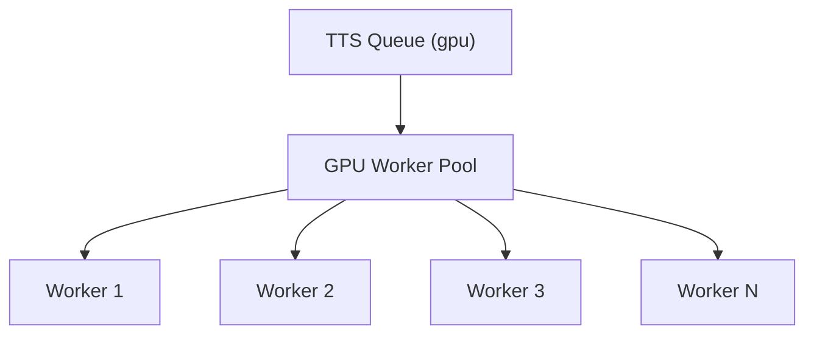

Workers are stateless except for loaded models and temporary inference state (§18); all
persistent state lives in PostgreSQL and object storage (§63). Adding a worker is the operation
of §59.2 — no application change.

### 81.2 Backpressure

When TTS demand exceeds GPU capacity, the queue grows, `context.md` §20.5's response applies
unchanged: raise the priority of interactive work, admit new full-book generations more slowly
with a user-visible queue position, and emit scale-up signals. **Jobs are never dropped, and no
GPU worker is overloaded past its advertised safe concurrency** (§19.4, §20.2) — a worker that
has not benchmarked a safe concurrency figure defaults conservatively rather than accepting
unbounded work.

### 81.3 Fairness

One large audiobook must not starve smaller jobs. Levers: strict priority (§57); per-book and
per-tenant concurrency caps (`context.md` §11.4); weighted scheduling (a future refinement, not
built now); and interactive-work reservations (a bounded slice of capacity implicitly reserved by
`INTERACTIVE`'s strict-priority-first dequeue behavior). This document does **not** mandate a
complex scheduler beyond these existing mechanisms — it names the architectural direction
(fairness is a first-class scheduling concern, not an afterthought) without building a bespoke
weighted-fair-queueing implementation that no upstream contract currently requires.

### 81.4 Resource isolation

Per-book concurrency limits, per-tenant concurrency limits, global GPU limits, and preview-traffic
reservations are all **configurable** (`deployment-architecture.md`), consistent with this
document's — and every peer document's — discipline of fixing the policy shape and leaving the
numeric values to deployment configuration.

---

## 82. Resumability

### 82.1 The TTS pipeline resumes without regenerating completed work

```
10,000 chunks total
Completed: 1–7,500      (valid, VALIDATED, retained)
Failure: worker cluster crashes
Restart: resumes at 7,501–10,000
```

This follows directly from §42–§43 (idempotency and caching) — there is no separate
"resumability" mechanism to build. The skip-existing-output query (`database-schema.md` §21.5)
is, by construction, also the resumption mechanism: re-submitting the full 10,000-chunk scope
after a crash re-enqueues only the chunks with no valid current output for their exact lineage,
which is exactly the 2,500 chunks that were never completed.

---

## 83. Reproducibility

### 83.1 The mandatory traceability chain

A production audio chunk **MUST** be traceable to:

```
BookVersion → AudioScriptVersion → AudioScriptChunk
  → VoiceProfileVersion → ModelVersion → generation configuration
  → TTS provider → provider adapter version
```

### 83.2 This is not new — it is `database-schema.md` §19's traversal, restated as the

**TTS subsystem's own acceptance bar.** Every hop is a real foreign key
(`database-schema.md` §19.1); the reproducibility query of `database-schema.md` §19.3 already
demonstrates the full chain resolves in a single indexed join set. The one component this
document adds to that chain, not previously named at Tier 1, is the **provider adapter version**
— the specific build/version of the *adapter code itself*, as distinct from the model it wraps.
Where the adapter's own logic materially affects output (its translation of semantic fields into
engine parameters), its version **SHOULD** be recorded as part of `generation_params` or
`model_version.config` (`deployment-architecture.md`'s domain to fix precisely) so that an
adapter-level bug fix is distinguishable, in lineage, from a model version change. This is
recorded as an open question (§87, OQ-TTS-7) rather than a new column this document mandates,
since introducing a literal new database column is `database-schema.md`'s prerogative under
change control (`context.md` §27.1), not this document's.

---

## 84. Mermaid diagrams — index

For reference, the seven diagrams required by this document's brief and where each appears:

1. **TTS architecture** (Audio Script IR → TTS Provider Interface → Provider Adapter → TTS Model
   → AudioChunk) — §2.
2. **Voice architecture** (Character → Voice Assignment → VoiceProfileVersion →
   Provider-specific representation → TTS) — §6.1 (via `VoiceProfileVersion`), with the character
   → assignment hop shown in §12.1's table and `director-specification.md` §45.3.
3. **GPU worker architecture** (TTS Queue → Scheduler → GPU Worker Pool → Model Manager → TTS
   Engine) — §81.1 (worker pool) combined with §17.1 (the worker's own ten-step lifecycle) and
   §18.1 (model lifecycle) — the "Model Manager" concept in the brief maps onto §18's model
   loading policy, which is not a separate component but a worker-internal responsibility.
4. **Provider abstraction** (Audio Script IR → TTS Interface → XTTS / Kokoro / Future) — §3.1.
5. **TTS generation lifecycle** (Queued → Running → Synthesized → Validated → Stored →
   Completed) — §17.1's ten-step diagram is the fuller form; the state-machine form is
   `database-schema.md` §32.4's `audio_chunk.status` machine, adopted unchanged (§28.2).
6. **Failure flow** (TTS → Failure → Retry → Success, or → Max attempts → DLQ) —
   `event-contracts.md` §23.4's flow diagram, adopted unchanged; this document's own §56 and §60
   /§78 give the TTS-specific classification feeding into it.
7. **Regeneration** (AudioScriptChunk → TTS Generation 1 → failure/poor quality → TTS Generation
   2 → selected output) — §46.1.

---

## 85. Acceptance criteria

| Criterion | Result | Evidence |
| --- | --- | --- |
| **Provider independence** — Audio Script IR does not depend on one TTS engine | **Pass** | §3 (`TTSProvider` interface); §38.4 of `audio-script-ir.md`, unchanged and confirmed here |
| **Voice consistency** — character voice remains stable through explicit `VoiceProfileVersion` | **Pass** | §10–§12 |
| **Model consistency** — every generation uses an explicit `ModelVersion` | **Pass** | §13 |
| **Reproducibility** — every audio artifact has complete generation lineage | **Pass** | §83 |
| **Idempotency** — duplicate queue deliveries do not cause unnecessary duplicate synthesis | **Pass** | §42 |
| **GPU safety** — concurrency respects hardware limits | **Pass** | §19–§20 |
| **Parallelism** — independent chunks generate concurrently | **Pass** | §20, `event-contracts.md` §28.4 |
| **Ordering** — chapter assembly remains ordered | **Pass** | §67–§68; ordering is entirely assembly's concern, never TTS's (`event-contracts.md` §28.3) |
| **Capability awareness** — unsupported features are detected | **Pass** | §32–§34 |
| **Degradation** — approximations are explicitly recorded | **Pass** | §35 |
| **Audio validation** — bad output cannot silently become production audio | **Pass** | §27–§30 |
| **Regeneration** — TTS can regenerate independently of Director | **Pass** | §44 |
| **Versioning** — previous generations remain auditable | **Pass** | §46 |
| **Storage** — large audio artifacts are stored outside PostgreSQL and Redis | **Pass** | §63 |
| **Resumability** — completed chunks are not unnecessarily regenerated | **Pass** | §82 |
| **Security** — secrets and sensitive book content are not exposed through logs/messages | **Pass** | §74, §76 |
| **Observability** — every generation can be traced | **Pass** | §77, §83 |

---

## 86. Cross-document audit

Performed by re-reading `context.md`, `api-specification.md`, `database-schema.md`,
`event-contracts.md`, `audio-script-ir.md`, and `director-specification.md` in full against every
section of this document.

### 86.1 Naming reconciliation (the brief's terms mapped to the authoritative contract)

| Brief's term | Authoritative name | Status |
| --- | --- | --- |
| `TTSGeneration` | `TTSJob` | Already recorded as `database-schema.md` D-1 / `audio-script-ir.md` IR-1; this document uses `TTSJob` throughout and does not reopen the naming |
| `AudiobookVersion` | `audiobook` (the row **is** the version, via `version`/`supersedes_audiobook_id`) | Already recorded as `database-schema.md` D-2; used correctly throughout this document |
| "TTS Provider Interface" | `TTSProvider` (`context.md` §10.2) | This document adopts the existing name exactly, concretizing rather than renaming it (§3.2) |

### 86.2 The sixteen required checks

| # | Check | Result |
| --- | --- | --- |
| 1 | TTS responsibilities are consistent | **Pass** — §1–§2 restate `context.md` §1.4/§3.2.12 without contradiction |
| 2 | Audio Script IR fields are consistent | **Pass** — §4.1's `SynthesisRequest` is the `generate_tts_chunk` payload's IR block, unmodified |
| 3 | `VoiceProfileVersion` is consistent | **Pass** — §6–§11 introduce no field, state, or behavior `database-schema.md` §12.2 / `api-specification.md` §16.14 do not already specify |
| 4 | `ModelVersion` is consistent | **Pass** — §13–§14 |
| 5 | `TTSGeneration`/`TTSJob` is consistent | **Pass** — §42.1 uses the existing `dedupe_key` verbatim |
| 6 | `AudioChunk` is consistent | **Pass** — §5.3, §46, §66 introduce no new column |
| 7 | `ProcessingJob` is consistent | **Pass** — §17.1, §45.1 rely on the existing job/attempt model exclusively |
| 8 | Event names are consistent | **Pass** — this document does not name a single event beyond the existing `tts.*` four (implicit throughout; no new event introduced) |
| 9 | Queue semantics are consistent | **Pass** — §21 (batching), §57 (priority) restate `event-contracts.md` §5.2/§26/§32 without modification |
| 10 | API semantics are consistent | **Pass** — §47–§48 defer entirely to `api-specification.md` §16.14–§16.15 |
| 11 | Storage boundaries are consistent | **Pass** — §5.2, §8.2, §50.2, §63–§64 restate `context.md` §12 without exception |
| 12 | Versioning rules are consistent | **Pass** — §40, §83 |
| 13 | Regeneration rules are consistent | **Pass** — §44, matching `event-contracts.md` §34 exactly |
| 14 | Provider abstraction does not contradict the Director contract | **Pass** — §3.1, §12.2 restate `director-specification.md` §45.1/§45.3's boundary from the TTS side; no disagreement |
| 15 | No TTS responsibility incorrectly assigned to Director | **Pass** — §12 is explicit that TTS never resolves character identity, mirroring `director-specification.md` §45.3 exactly |
| 16 | No TTS responsibility incorrectly assigned to Audio Assembly | **Pass** — §25, §67–§68 draw the boundary explicitly and do not let TTS perform mastering, normalization, or assembly |

### 86.3 Conflicts found

| # | Location | The conflict | Disposition |
| --- | --- | --- | --- |
| **TTS-1** | `api-specification.md` §16.14's illustrative `emotion_capability_map` example: `{ "ANGER": "NATIVE", "WHISPER": "APPROXIMATED", "SINGING": "UNSUPPORTED" }` | `ANGER` is not a member of the `emotion` vocabulary `director-specification.md` §4.1 fixes (`ANGRY` is). `WHISPER` and `SINGING` are `delivery_mode` members (`context.md` §6.2), not `emotion` members, and `emotion_capability_map` is documented (`context.md` §9.2) as covering emotions specifically | **Not silently corrected in `api-specification.md`.** Recorded here: the example predates `director-specification.md`'s fixed vocabulary and appears to conflate `emotion` and `delivery_mode` keys in one illustrative map. This document (§32.2) clarifies that `emotion_capability_map` is scoped strictly to the 17-member `emotion` vocabulary; delivery-mode and other performance-axis capability is declared at the provider/model level via `capabilities()` (§3.3), not per-voice. An `api-specification.md` correction under §27 change control is recommended but not made here |
| **TTS-2** | The task brief's proposed capability matrix vocabulary (`SUPPORTED \| PARTIAL \| APPROXIMATED \| UNSUPPORTED \| UNKNOWN`) versus `audio-script-ir.md` §39.2's fixed three-level vocabulary (`NATIVE \| APPROXIMATED \| UNSUPPORTED`) | A five-level scheme was requested by this document's own commissioning brief for §33's matrix | **Resolved toward the existing contract** (§33.2): the three-level vocabulary is used for per-request/per-emotion fidelity; a separate, narrowly-scoped `SUPPORTED`/`UNSUPPORTED` binary is introduced **only** for the boolean mechanism-presence fields already in `ProviderCapabilities`, never as a competing fidelity scale |
| **TTS-3** | The task brief's illustrative storage-key convention (`tts/book-version/audio-script-version/chapter/chunk/generation/`) versus `context.md` §12.3's authoritative key convention | Two different key shapes for the same artifact class | **Resolved toward the existing contract** (§64.1): this document explicitly does not adopt the brief's illustrative convention and defers entirely to `context.md` §12.3 / `database-schema.md` §34.2 |

No other contradictions were found. Every mechanism this document introduces (the concretized
`TTSProvider` interface shape, §3.2–§3.3; the `SynthesisRequest`/`SynthesisResult` shapes, §4–§5;
the `SUPPORTED`/`UNSUPPORTED` binary of §33.2) is additive against the existing contracts and
introduces no database entity, no event, no closed vocabulary beyond the one narrow addition
already flagged.

---

## 87. Open questions

| # | Question | Affected | Interim position |
| --- | --- | --- | --- |
| **OQ-TTS-1** | Should `api-specification.md` §16.14's `emotion_capability_map` example be corrected, and should the field be renamed or split to also cover `delivery_mode` capability declaration? | `api-specification.md` §16.14; `database-schema.md` §12.2 | This document proceeds with `emotion_capability_map` scoped to `emotion` only (§32.2); the `api-specification.md` example correction is a §27 change-control task |
| **OQ-TTS-2** | Should batching adopted at the adapter level (§21) be formalized with a documented per-provider batch-compatibility policy, or left to each adapter's own implementation discretion within the constraints of §21.3? | `tts-provider-specification.md` (this document), future adapter documentation | Left to adapter discretion within the binding constraints already fixed (§21.2–§21.4); no further specification here |
| **OQ-TTS-3** | Should CPU fallback (§60) be a formally certified deployment mode (§73-style certification), or remain an uncertified, deployment-owned configuration choice? | `deployment-architecture.md` | Uncertified/deployment-owned for now; revisit if CPU-based production synthesis becomes a real deployment pattern |
| **OQ-TTS-4** | Should human selection among multiple generations (§46.2) become a first-class reviewed workflow (with its own audit trail beyond the existing versioning columns), mirroring the Director's `origin`/`director_original` override model (`director-specification.md` §38.2)? | `api-specification.md` OQ-3; this document §46.2 | Not built in v1; the existing version-chain columns (`is_current`, `supersedes_audio_chunk_id`) are sufficient for the mechanics, but no dedicated review UI/audit-annotation field is proposed here |
| **OQ-TTS-5** | Should a routing policy that varies `tts_model_version_id` within a single book ever be permitted, given that the model is part of a `VoiceProfileVersion`'s identity (§38.1)? | `director-specification.md` §44.2 (its own equivalent open question, OQ-DIR-4); this document §39.2 | **Unresolved**, consistent with `director-specification.md`'s parallel deferral. Model routing, if adopted, operates only at casting time (once per `VoiceProfileVersion`), never per-chunk |
| **OQ-TTS-6** | Should `voice_assignment` gain a language dimension so a character can have distinct per-language voice profiles within one multilingual book? | `database-schema.md` §12.3 | Not built in v1 (§62.1); the current mechanism (`supported_languages[]` on one `VoiceProfileVersion`) is the only v1 path. A schema amendment is a `database-schema.md` change-control task if this becomes a real requirement |
| **OQ-TTS-7** | Should the provider adapter's own version be a first-class lineage field, distinct from `tts_model_version_id`? | `database-schema.md` §14, §19 | Recommended (§83.2) but not mandated as a new column by this document; a `database-schema.md` amendment under §27 change control would be required before implementation relies on it |

---

## 88. Rules for Future TTS Implementation

These rules are binding on every future implementation session touching the TTS subsystem. They
sit under, and never above, `context.md` §28, and are additional to — never a substitute for —
every rule already binding from `audio-script-ir.md` §65 and `director-specification.md` §60.

1. **This document is the authoritative TTS architecture.** Code conforms to it; it is not
   retro-fitted to code.
2. **Read all architecture contracts before implementing TTS** — at minimum `context.md`,
   `database-schema.md`, `event-contracts.md`, `api-specification.md`, `audio-script-ir.md`, and
   `director-specification.md`, in addition to this document.
3. **TTS consumes validated Audio Script IR.** It never receives, and never requests, unvalidated
   or raw model output.
4. **TTS must never interpret raw book text.** It renders the IR chunk it is given; it does not
   read, and cannot read, any other part of the book.
5. **TTS must never determine character identity.** `character_id` arrives resolved; it is a
   label for lineage, never a lookup key (§12.2).
6. **TTS must never silently resolve a different voice.** `voice_profile_version_id` is pinned
   and authoritative (§10.2, §11.2).
7. **TTS must always use an explicit `VoiceProfileVersion`.** Never "the current voice for this
   character."
8. **TTS must always use an explicit `ModelVersion`.** Never "whatever model is installed"
   (§13.2).
9. **TTS must be provider-independent at the business layer.** No code outside a provider adapter
   may reference an engine-specific concept (§3.1).
10. **Provider-specific logic belongs in adapters**, and only in adapters.
11. **Do not hard-code XTTS or Kokoro into core business logic.** The `TTSProvider` interface
    (§3.2) is the only surface core logic addresses.
12. **Do not silently switch providers.** A provider change for an existing voice requires a new
    `VoiceProfileVersion` (§38.2).
13. **Do not silently switch models.** Same rule, same mechanism (§38).
14. **Do not silently switch voices.** §37.2 — a fallback must preserve the logical voice
    identity or it is not a valid fallback.
15. **Do not silently discard unsupported performance instructions.** Every unmappable field
    produces a `capability_gap` record (§35.2).
16. **Record capability degradation** with the field, the requested value, the handling level
    (one of the three fixed levels, §32.1), and a note explaining the approximation.
17. **Do not put audio binaries into Redis.** Ever, in either direction (§5.2).
18. **Do not put large audio binaries into PostgreSQL.** Metadata and references only (§8.2,
    §50.2, §63).
19. **Store generated artifacts in object storage**, keyed per the existing convention
    (`context.md` §12.3), never a locally-invented key scheme (§64.1).
20. **Preserve checksums** on every generated artifact (§65).
21. **Preserve generation lineage** — the full chain of §83.1, on every `AudioChunk`.
22. **Assume at-least-once delivery.** No component may assume exactly-once queue semantics
    (§42.2).
23. **Make TTS generation idempotent**, using the existing `dedupe_key` derivation (§42.1) — never
    a locally-invented idempotency scheme.
24. **Do not mutate immutable `AudioScriptVersion`s.** TTS has no write access to
    `AudioScriptChunk`'s content or lineage fields at all (`context.md` §23 row 8).
25. **TTS regeneration creates a new `TTSJob` and a new `AudioChunk`** (§44.3) — never an
    in-place overwrite.
26. **Do not destroy previous successful generations.** Superseded generations are retained with
    full lineage (§46.1).
27. **Validate audio before marking it valid.** The technical QC chain of §27–§30 runs before
    `VALIDATED` is reachable.
28. **Do not let GPU workers modify unrelated domain entities.** The write surface is exactly
    `AudioChunk` plus the worker's own `ProcessingAttempt` record — nothing else.
29. **Persist state before acknowledging successful queue processing.** Upload, verify, then
    acknowledge — never the reverse (§53.3).
30. **Gracefully handle worker shutdown.** In-flight work is finished or released, never lost
    (§53).
31. **Do not log complete book text.** Nor the full IR chunk text — length and hash only (§76.1).
32. **Do not log voice embeddings**, nor reference audio content.
33. **Do not expose provider credentials** — in logs, in messages, or through any worker-facing
    HTTP surface beyond the secrets manager (§74.2).
34. **Do not bypass event contracts.** TTS events are exactly the existing `tts.*` four, emitted
    through the Outbox, never invented ad hoc.
35. **Do not bypass database constraints.** The uniqueness and check constraints of
    `database-schema.md` §16 and §21 are the enforcement mechanism, not a suggestion an
    implementation may work around.
36. **Do not introduce provider-specific fields into the core Audio Script IR.** That boundary
    belongs to `audio-script-ir.md` §38.4 and is not reopened here.
37. **Do not introduce a new TTS provider without provider contract tests** passing (§80.2).
38. **Benchmark a provider before production certification** (§72–§73) — a provider is never
    promoted to production eligibility on the strength of a single anecdotal test.
39. **Update this document before making an architectural TTS change**, then propagate to
    dependent contracts in dependency order (`context.md` §26.2, §27.1).
40. **If implementation conflicts with this document, stop and report the conflict.** Name the
    field, the section, and the options — do not pick one and proceed
    (`context.md` §28 rules 13–14).

---

## Appendix A — Document status

| Field | Value |
| --- | --- |
| Version | `tts-provider-spec.v1` |
| Status | DRAFT — awaiting human review |
| Tier | 2 (TTS subsystem behavior and provider abstraction) |
| Derives from | `context.md` (`context.v1`) §10 |
| Reconciled against | `database-schema.md`, `event-contracts.md`, `api-specification.md`,
  `audio-script-ir.md`, `director-specification.md` |
| Frozen | No. Freezes when Phase 9 begins (`context.md` §27.3, §29) |
| Change protocol | `context.md` §27 |
| Entities introduced | **Zero** |
| Vocabularies fixed | One narrowly-scoped addition: `SUPPORTED \| UNSUPPORTED` for binary
  provider-capability mechanism flags only (§33.2) — never a competing fidelity scale to the
  existing three-level `NATIVE`/`APPROXIMATED`/`UNSUPPORTED` |
| Conflicts recorded | 3 (§86.3), none silently resolved |
| Open questions | 7 (§87) |
| Next documents | `deployment-architecture.md` (`context.md` §26.2) |
